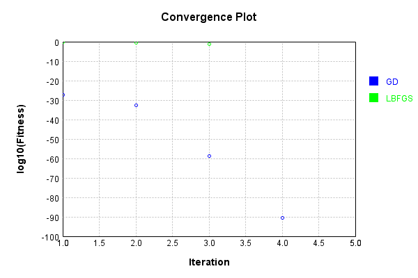
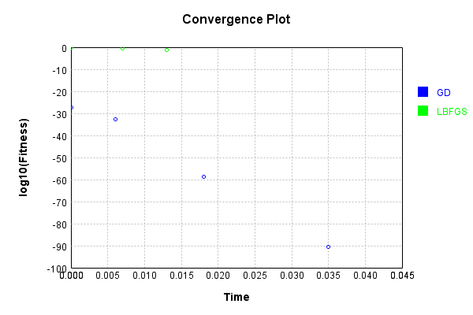
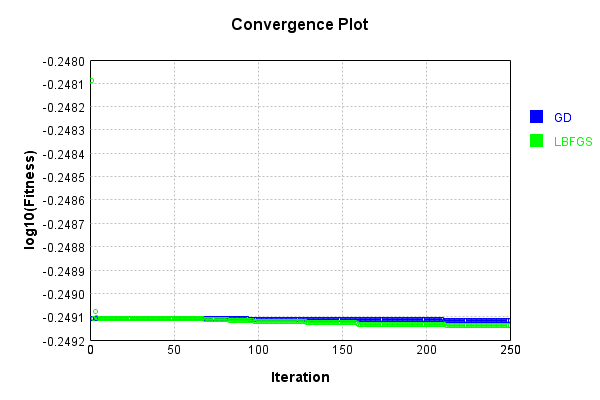
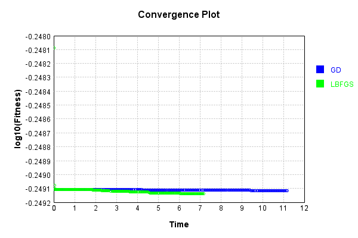

# SimpleConvolutionLayer
## SimpleConvolutionLayerTest
### Json Serialization
Code from [JsonTest.java:36](../../../../../../../src/main/java/com/simiacryptus/mindseye/test/unit/JsonTest.java#L36) executed in 0.00 seconds: 
```java
    JsonObject json = layer.getJson();
    NNLayer echo = NNLayer.fromJson(json);
    if ((echo == null)) throw new AssertionError("Failed to deserialize");
    if ((layer == echo)) throw new AssertionError("Serialization did not copy");
    if ((!layer.equals(echo))) throw new AssertionError("Serialization not equal");
    return new GsonBuilder().setPrettyPrinting().create().toJson(json);
```

Returns: 

```
    {
      "class": "com.simiacryptus.mindseye.layers.cudnn.SimpleConvolutionLayer",
      "id": "4a60aaf9-1027-4361-bafc-a071f126fe3d",
      "isFrozen": false,
      "name": "SimpleConvolutionLayer/4a60aaf9-1027-4361-bafc-a071f126fe3d",
      "filter": [
        [
          [
            0.652
          ]
        ]
      ],
      "strideX": 1,
      "strideY": 1,
      "simple": false,
      "precision": "Double"
    }
```


### Example Input/Output Pair
Code from [ReferenceIO.java:68](../../../../../../../src/main/java/com/simiacryptus/mindseye/test/unit/ReferenceIO.java#L68) executed in 0.00 seconds: 
```java
    SimpleEval eval = SimpleEval.run(layer, inputPrototype);
    return String.format("--------------------\nInput: \n[%s]\n--------------------\nOutput: \n%s\n--------------------\nDerivative: \n%s",
      Arrays.stream(inputPrototype).map(t -> t.prettyPrint()).reduce((a, b) -> a + ",\n" + b).get(),
      eval.getOutput().prettyPrint(),
      Arrays.stream(eval.getDerivative()).map(t -> t.prettyPrint()).reduce((a, b) -> a + ",\n" + b).get());
```

Returns: 

```
    --------------------
    Input: 
    [[
    	[ [ 1.26 ] ]
    ]]
    --------------------
    Output: 
    [
    	[ [ 0.82152 ] ]
    ]
    --------------------
    Derivative: 
    [
    	[ [ 0.652 ] ]
    ]
```


[GPU Log](etc/cuda.log)

### Batch Execution
Code from [BatchingTester.java:66](../../../../../../../src/main/java/com/simiacryptus/mindseye/test/unit/BatchingTester.java#L66) executed in 0.03 seconds: 
```java
    return test(reference, inputPrototype);
```

Returns: 

```
    ToleranceStatistics{absoluteTol=0.0000e+00 +- 0.0000e+00 [0.0000e+00 - 0.0000e+00] (20#), relativeTol=0.0000e+00 +- 0.0000e+00 [0.0000e+00 - 0.0000e+00] (20#)}
```


Code from [SingleDerivativeTester.java:77](../../../../../../../src/main/java/com/simiacryptus/mindseye/test/unit/SingleDerivativeTester.java#L77) executed in 0.02 seconds: 
```java
    return test(component, inputPrototype);
```
Logging: 
```
    Inputs: [
    	[ [ -0.232 ] ]
    ]
    Inputs Statistics: {meanExponent=-0.6345120151091003, negative=1, min=-0.232, max=-0.232, mean=-0.232, count=1.0, positive=0, stdDev=0.0, zeros=0}
    Output: [
    	[ [ -0.151264 ] ]
    ]
    Outputs Statistics: {meanExponent=-0.8202644193771801, negative=1, min=-0.151264, max=-0.151264, mean=-0.151264, count=1.0, positive=0, stdDev=0.0, zeros=0}
    Feedback for input 0
    Inputs Values: [
    	[ [ -0.232 ] ]
    ]
    Value Statistics: {meanExponent=-0.6345120151091003, negative=1, min=-0.232, max=-0.232, mean=-0.232, count=1.0, positive=0, stdDev=0.0, zeros=0}
    Implemented Feedback: [ [ 0.652 ] ]
    Implemented Statistics: {meanExponent=-0.1857524042680798, negative=0, min=0.652, max=0.652, mean=0.652, count=1.0, positive=1, stdDev=0.0, zeros=0}
    Measured Feedback: [ [ 0.6519999999998749 ] ]
    Measured Statistics: {meanExponent=-0.18575240426816314, negative=0, min=0.6519999999998749, max=0.6519999999998749, mean=0.6519999999998749, count=1.0, positive=1, stdDev=0.0, zeros=0}
    Feedback Error: [ [ -1.25122134
```
...[skipping 99 bytes](etc/168.txt)...
```
    7525514E-13, max=-1.2512213487525514E-13, mean=-1.2512213487525514E-13, count=1.0, positive=0, stdDev=0.0, zeros=0}
    Learning Gradient for weight set 0
    Weights: [ 0.652 ]
    Implemented Gradient: [ [ -0.232 ] ]
    Implemented Statistics: {meanExponent=-0.6345120151091003, negative=1, min=-0.232, max=-0.232, mean=-0.232, count=1.0, positive=0, stdDev=0.0, zeros=0}
    Measured Gradient: [ [ -0.23200000000000998 ] ]
    Measured Statistics: {meanExponent=-0.6345120151090816, negative=1, min=-0.23200000000000998, max=-0.23200000000000998, mean=-0.23200000000000998, count=1.0, positive=0, stdDev=0.0, zeros=0}
    Gradient Error: [ [ -9.96425164601078E-15 ] ]
    Error Statistics: {meanExponent=-14.001555312940647, negative=1, min=-9.96425164601078E-15, max=-9.96425164601078E-15, mean=-9.96425164601078E-15, count=1.0, positive=0, stdDev=0.0, zeros=0}
    Finite-Difference Derivative Accuracy:
    absoluteTol: 6.7543e-14 +- 5.7579e-14 [9.9643e-15 - 1.2512e-13] (2#)
    relativeTol: 5.8714e-14 +- 3.7239e-14 [2.1475e-14 - 9.5953e-14] (2#)
    
```

Returns: 

```
    ToleranceStatistics{absoluteTol=6.7543e-14 +- 5.7579e-14 [9.9643e-15 - 1.2512e-13] (2#), relativeTol=5.8714e-14 +- 3.7239e-14 [2.1475e-14 - 9.5953e-14] (2#)}
```


### Reference Implementation
Code from [EquivalencyTester.java:61](../../../../../../../src/main/java/com/simiacryptus/mindseye/test/unit/EquivalencyTester.java#L61) executed in 0.00 seconds: 
```java
    System.out.println(new GsonBuilder().setPrettyPrinting().create().toJson(this.reference.getJson()));
```
Logging: 
```
    {
      "class": "com.simiacryptus.mindseye.layers.aparapi.ConvolutionLayer",
      "id": "e7d9deeb-949c-4c58-9d77-d88b4db4a5bf",
      "isFrozen": false,
      "name": "ConvolutionLayer/e7d9deeb-949c-4c58-9d77-d88b4db4a5bf",
      "filter": [
        [
          [
            0.652
          ]
        ]
      ],
      "skip": [
        [
          0.0
        ]
      ],
      "simple": true
    }
    
```

Code from [EquivalencyTester.java:64](../../../../../../../src/main/java/com/simiacryptus/mindseye/test/unit/EquivalencyTester.java#L64) executed in 0.02 seconds: 
```java
    return test(subject, inputPrototype);
```
Logging: 
```
    Inputs: [
    	[ [ -1.96 ] ]
    ]
    Error: [
    	[ [ 0.0 ] ]
    ]
    Accuracy:
    absoluteTol: 0.0000e+00 +- 0.0000e+00 [0.0000e+00 - 0.0000e+00] (1#)
    relativeTol: 0.0000e+00 +- 0.0000e+00 [0.0000e+00 - 0.0000e+00] (1#)
    
```

Returns: 

```
    ToleranceStatistics{absoluteTol=0.0000e+00 +- 0.0000e+00 [0.0000e+00 - 0.0000e+00] (1#), relativeTol=0.0000e+00 +- 0.0000e+00 [0.0000e+00 - 0.0000e+00] (1#)}
```


### Performance
Now we execute larger-scale runs to benchmark performance:

Code from [PerformanceTester.java:66](../../../../../../../src/main/java/com/simiacryptus/mindseye/test/unit/PerformanceTester.java#L66) executed in 0.45 seconds: 
```java
    test(component, inputPrototype);
```
Logging: 
```
    100 batches
    Input Dimensions:
    	[100, 100, 1]
    Performance:
    	Evaluation performance: 0.009540s +- 0.000601s [0.008963s - 0.010601s]
    	Learning performance: 0.068131s +- 0.036089s [0.041790s - 0.136749s]
    
```

### Input Learning
In this test, we use a network to learn this target input, given it's pre-evaluated output:

Code from [LearningTester.java:127](../../../../../../../src/main/java/com/simiacryptus/mindseye/test/unit/LearningTester.java#L127) executed in 0.00 seconds: 
```java
    return Arrays.stream(input_target).map(x -> x.prettyPrint()).reduce((a, b) -> a + "\n" + b).orElse("");
```

Returns: 

```
    [
    	[ [ -1.828 ], [ -0.064 ], [ -1.476 ], [ 0.628 ], [ 0.316 ], [ 1.24 ], [ 1.452 ], [ -0.56 ], ... ],
    	[ [ -1.724 ], [ -0.412 ], [ 0.68 ], [ 0.492 ], [ 0.976 ], [ 0.3 ], [ 0.772 ], [ -1.856 ], ... ],
    	[ [ -1.552 ], [ 1.392 ], [ -1.056 ], [ -0.036 ], [ 0.036 ], [ 0.312 ], [ -1.324 ], [ 0.528 ], ... ],
    	[ [ -1.388 ], [ -0.02 ], [ 1.972 ], [ -0.228 ], [ -1.252 ], [ 0.82 ], [ -1.028 ], [ -0.696 ], ... ],
    	[ [ -1.56 ], [ -0.112 ], [ 1.1 ], [ -0.588 ], [ 1.552 ], [ 1.004 ], [ -1.94 ], [ -1.28 ], ... ],
    	[ [ 0.548 ], [ 1.876 ], [ 0.776 ], [ -1.332 ], [ -1.68 ], [ 1.892 ], [ 0.04 ], [ -1.404 ], ... ],
    	[ [ 0.612 ], [ -0.508 ], [ -1.12 ], [ -1.284 ], [ 1.888 ], [ 0.136 ], [ 0.424 ], [ 0.368 ], ... ],
    	[ [ -0.828 ], [ -0.756 ], [ 0.12 ], [ -1.572 ], [ 1.588 ], [ 0.948 ], [ -1.968 ], [ -0.42 ], ... ],
    	...
    ]
```


First, we use a conjugate gradient descent method, which converges the fastest for purely linear functions.

Code from [LearningTester.java:300](../../../../../../../src/main/java/com/simiacryptus/mindseye/test/unit/LearningTester.java#L300) executed in 0.08 seconds: 
```java
    return new IterativeTrainer(trainable)
      .setLineSearchFactory(label -> new QuadraticSearch())
      .setOrientation(new GradientDescent())
      .setMonitor(monitor)
      .setTimeout(30, TimeUnit.SECONDS)
      .setMaxIterations(250)
      .setTerminateThreshold(0)
      .run();
```
Logging: 
```
    Constructing line search parameters: GD
    F(0.0) = LineSearchPoint{point=PointSample{avg=1.0945679884976611}, derivative=-1.8612209207292442E-4}
    New Minimum: 1.0945679884976611 > 1.0945679884976447
    F(1.0E-10) = LineSearchPoint{point=PointSample{avg=1.0945679884976447}, derivative=-1.8612209207292284E-4}, delta = -1.6431300764452317E-14
    New Minimum: 1.0945679884976447 > 1.0945679884975306
    F(7.000000000000001E-10) = LineSearchPoint{point=PointSample{avg=1.0945679884975306}, derivative=-1.8612209207291336E-4}, delta = -1.305622276959184E-13
    New Minimum: 1.0945679884975306 > 1.0945679884967485
    F(4.900000000000001E-9) = LineSearchPoint{point=PointSample{avg=1.0945679884967485}, derivative=-1.861220920728469E-4}, delta = -9.126033262418787E-13
    New Minimum: 1.0945679884967485 > 1.0945679884912771
    F(3.430000000000001E-8) = LineSearchPoint{point=PointSample{avg=1.0945679884912771}, derivative=-1.8612209207238167E-4}, delta = -6.384004436199575E-12
    New Minimum: 1.0945679884912771 > 1.0945679884529769
    F(2.40100
```
...[skipping 4847 bytes](etc/169.txt)...
```
    archPoint{point=PointSample{avg=1.391707650637031E-60}, derivative=7.277136544027334E-64}, delta = -1.176849774253712E-59
    1.391707650637031E-60 <= 1.3160205393174152E-59
    New Minimum: 1.391707650637031E-60 > 3.846528494847452E-91
    F(11761.827693929015) = LineSearchPoint{point=PointSample{avg=3.846528494847452E-91}, derivative=3.0452450213495925E-79}, delta = -1.3160205393174152E-59
    Right bracket at 11761.827693929015
    Converged to right
    Iteration 4 complete. Error: 3.846528494847452E-91 Total: 249637061506034.9700; Orientation: 0.0003; Line Search: 0.0154
    Zero gradient: 8.087458560694159E-48
    F(0.0) = LineSearchPoint{point=PointSample{avg=3.846528494847452E-91}, derivative=-6.540698597094523E-95}
    New Minimum: 3.846528494847452E-91 > 0.0
    F(11761.827693929015) = LineSearchPoint{point=PointSample{avg=0.0}, derivative=0.0}, delta = -3.846528494847452E-91
    0.0 <= 3.846528494847452E-91
    Converged to right
    Iteration 5 complete. Error: 0.0 Total: 249637067300784.9400; Orientation: 0.0003; Line Search: 0.0038
    
```

Returns: 

```
    0.0
```


Training Converged

Next, we run the same optimization using L-BFGS, which is nearly ideal for purely second-order or quadratic functions.

Code from [LearningTester.java:324](../../../../../../../src/main/java/com/simiacryptus/mindseye/test/unit/LearningTester.java#L324) executed in 0.04 seconds: 
```java
    return new IterativeTrainer(trainable)
      .setLineSearchFactory(label -> new ArmijoWolfeSearch())
      .setOrientation(new LBFGS())
      .setMonitor(monitor)
      .setTimeout(30, TimeUnit.SECONDS)
      .setMaxIterations(250)
      .setTerminateThreshold(0)
      .run();
```
Logging: 
```
    LBFGS Accumulation History: 1 points
    Constructing line search parameters: GD
    th(0)=1.0945679884976611;dx=-1.8612209207292442E-4
    New Minimum: 1.0945679884976611 > 1.0941670373307575
    WOLFE (weak): th(2.154434690031884)=1.0941670373307575; dx=-1.860879997615781E-4 delta=4.009511669036403E-4
    New Minimum: 1.0941670373307575 > 1.0937661596134889
    WOLFE (weak): th(4.308869380063768)=1.0937661596134889; dx=-1.8605390745023178E-4 delta=8.018288841722399E-4
    New Minimum: 1.0937661596134889 > 1.0921633832410536
    WOLFE (weak): th(12.926608140191302)=1.0921633832410536; dx=-1.859175382048465E-4 delta=0.0024046052566075726
    New Minimum: 1.0921633832410536 > 1.0849654325973863
    WOLFE (weak): th(51.70643256076521)=1.0849654325973863; dx=-1.853038766006127E-4 delta=0.009602555900274812
    New Minimum: 1.0849654325973863 > 1.0469782790277111
    WOLFE (weak): th(258.53216280382605)=1.0469782790277111; dx=-1.8203101471136584E-4 delta=0.04758970946995
    New Minimum: 1.0469782790277111 > 0.8248948578552093
    END: th(1551.1929768229
```
...[skipping 187 bytes](etc/170.txt)...
```
     0.0147
    LBFGS Accumulation History: 1 points
    th(0)=0.8248948578552093;dx=-1.4026644146147342E-4
    New Minimum: 0.8248948578552093 > 0.4227281409853761
    END: th(3341.943960201201)=0.4227281409853761; dx=-1.0041187131647435E-4 delta=0.40216671686983324
    Iteration 2 complete. Error: 0.4227281409853761 Total: 249637095336958.9000; Orientation: 0.0005; Line Search: 0.0044
    LBFGS Accumulation History: 1 points
    th(0)=0.4227281409853761;dx=-7.188136945817897E-5
    New Minimum: 0.4227281409853761 > 0.06359006791075178
    END: th(7200.000000000001)=0.06359006791075178; dx=-2.7879206395883378E-5 delta=0.3591380730746243
    Iteration 3 complete. Error: 0.06359006791075178 Total: 249637101512725.9000; Orientation: 0.0005; Line Search: 0.0043
    LBFGS Accumulation History: 1 points
    th(0)=0.06359006791075178;dx=-1.0812956891652899E-5
    MAX ALPHA: th(0)=0.06359006791075178;th'(0)=-1.0812956891652899E-5;
    Iteration 4 failed, aborting. Error: 0.06359006791075178 Total: 249637107562816.9000; Orientation: 0.0005; Line Search: 0.0042
    
```

Returns: 

```
    0.06359006791075178
```


This training run resulted in the following regressed input:

Code from [LearningTester.java:154](../../../../../../../src/main/java/com/simiacryptus/mindseye/test/unit/LearningTester.java#L154) executed in 0.00 seconds: 
```java
    return Arrays.stream(input_lbgfs).map(x -> x.prettyPrint()).reduce((a, b) -> a + "\n" + b).orElse("");
```

Returns: 

```
    [
    	[ [ -1.2427762328066785 ], [ 0.06615685102322635 ], [ -1.0594980767256756 ], [ 0.027350235648370247 ], [ -0.07350642824728482 ], [ 1.272780243961405 ], [ 0.9130542242816033 ], [ -0.030695472505546162 ], ... ],
    	[ [ -1.0751439945286567 ], [ 0.0122149218534785 ], [ 0.6481838808609891 ], [ 0.47560987801929744 ], [ 0.5141842100731449 ], [ -0.17820591190755763 ], [ 0.9455424680309685 ], [ -1.7470538950694474 ], ... ],
    	[ [ -1.197202065358909 ], [ 1.0150271944438405 ], [ -0.4466731122468217 ], [ 0.1298294694518144 ], [ 0.3040267006256069 ], [ 0.6793315573322167 ], [ -0.9074980767256757 ], [ -0.02155114876473363 ], ... ],
    	[ [ -1.4429551148764734 ], [ -0.12316135599618683 ], [ 1.4224488512352664 ], [ -0.4613182070194131 ], [ -1.43036309214294 ], [ 0.2665923519456893 ], [ -1.249748709150682 ], [ -0.8300133503128034 ], ... ],
    	[ [ -1.4462332709574763 ], [ -0.49861405378010215 ], [ 0.9341705305481857 ], [ -0.15510795474497308 ], [ 1.225161685208343 ], [ 0.464090099459209 ], [ -1.6845069220655184 ], [ -1.118991154660157 ], ... ],
    	[ [ 0.8748383147916574 ], [ 1.2599242384900617 ], [ 0.34792857885694434 ], [ -1.1960584000424082 ], [ -1.5440584000424078 ], [ 1.9045336226911254 ], [ 0.43143467789207335 ], [ -0.899762717887797 ], ... ],
    	[ [ 0.9147351942318007 ], [ -0.1493455660693317 ], [ -0.9368162837450889 ], [ -0.6958838583394957 ], [ 1.783874519181419 ], [ -0.11756482828969289 ], [ 0.20032304120452948 ], [ 0.2870135149188814 ], ... ],
    	[ [ -0.7248386440038131 ], [ -0.48797329937439315 ], [ -0.2511880566217938 ], [ -1.5845336226911255 ], [ 1.4896592681157845 ], [ 0.8901525106563437 ], [ -1.5852424455094751 ], [ -0.5405156027992836 ], ... ],
    	...
    ]
```


Code from [LearningTester.java:96](../../../../../../../src/main/java/com/simiacryptus/mindseye/test/unit/LearningTester.java#L96) executed in 0.00 seconds: 
```java
    return TestUtil.compare(runs);
```

Returns: 




Code from [LearningTester.java:99](../../../../../../../src/main/java/com/simiacryptus/mindseye/test/unit/LearningTester.java#L99) executed in 0.00 seconds: 
```java
    return TestUtil.compareTime(runs);
```

Returns: 




### Model Learning
In this test, attempt to train a network to emulate a randomized network given an example input/output. The target state is:

Code from [LearningTester.java:176](../../../../../../../src/main/java/com/simiacryptus/mindseye/test/unit/LearningTester.java#L176) executed in 0.00 seconds: 
```java
    return network_target.state().stream().map(Arrays::toString).reduce((a, b) -> a + "\n" + b).orElse("");
```

Returns: 

```
    [0.652]
```


First, we use a conjugate gradient descent method, which converges the fastest for purely linear functions.

Code from [LearningTester.java:300](../../../../../../../src/main/java/com/simiacryptus/mindseye/test/unit/LearningTester.java#L300) executed in 0.01 seconds: 
```java
    return new IterativeTrainer(trainable)
      .setLineSearchFactory(label -> new QuadraticSearch())
      .setOrientation(new GradientDescent())
      .setMonitor(monitor)
      .setTimeout(30, TimeUnit.SECONDS)
      .setMaxIterations(250)
      .setTerminateThreshold(0)
      .run();
```

Returns: 

```
    0.0
```


This training run resulted in the following configuration:

Code from [LearningTester.java:189](../../../../../../../src/main/java/com/simiacryptus/mindseye/test/unit/LearningTester.java#L189) executed in 0.00 seconds: 
```java
    return network_gd.state().stream().map(Arrays::toString).reduce((a, b) -> a + "\n" + b).orElse("");
```

Returns: 

```
    [0.652]
    [0.618096, -0.5268160000000001, -0.96496, -0.11475199999999999, 0.075632, 0.26080000000000003, -0.545072, 0.41988800000000004, -1.061456, -0.42510400000000004, 0.605056, 1.2179360000000001, -0.26080000000000003, -0.073024, -0.623312, 0.21646400000000002, 0.49552, -0.35208000000000006, -1.21272, -1.25184, -0.21646400000000002, -0.44075200000000003, -0.803264, 0.237328, 0.284272, -1.079712, 0.310352, -1.064064, -0.633744, -0.594624, 1.220544, -0.9988640000000001, 0.25297600000000003, -0.93888, 0.503344, 0.623312, -0.8945440000000001, -0.57376, 0.336432, 1.035376, -0.89976, 0.224288, -1.2700960000000001, -0.787616, -0.159088, 1.103184, 0.21907200000000002, -0.941488, 0.8893280000000001, 1.283136, -0.1956, -1.246624, 0.346864, -0.792832, -0.26340800000000003, 0.633744, 0.774576, 0.985824, 0.31296, -0.542464, 0.959744, -0.307744, 1.152736, -1.0536320000000001, -1.137088, -0.06259200000000001, 0.8736800000000001, 0.618096, 0.545072, 1.254448, 0.302528, 0.052160000000000005, 1.06928, -0.8945440000000001, -0.
```
...[skipping 133227 bytes](etc/171.txt)...
```
    7015520000000001, -0.513776, 0.7224160000000001, -0.75632, -0.837168, -0.187776, -0.628528, -0.813696, 0.975392, 1.118832, 0.628528, -0.25819200000000003, 0.41988800000000004, -0.276448, 0.41206400000000004, -0.07824, -0.393808, 0.166912, 0.096496, -0.524208, 0.04433600000000001, 0.26340800000000003, -1.262272, 1.061456, 0.37816, 0.5972320000000001, -0.59984, -0.542464, 0.344256, -0.578976, -1.275312, 0.383376, 0.018256, -0.771968, 0.985824, -1.220544, -0.318176, 0.8658560000000001, -0.8345600000000001, 0.6598240000000001, 0.135616, -0.307744, 0.10692800000000001, -0.620704, 0.385984, 1.25184, 0.281664, -1.1736, -1.014512, 1.236192, 0.980608, -1.111008, -0.315568, -0.43814400000000003, -0.049552, 0.268624, -1.137088, -0.777184, 0.826736, 1.223152, 1.189248, 0.393808, -0.239936, 0.8606400000000001, 0.735456, -0.14344, -0.04433600000000001, 1.275312, 0.14344, 0.25297600000000003, -0.7537119999999999, 0.268624, 0.5059520000000001, -0.649392, 0.9232319999999999, 0.813696, -0.751104, 1.283136, 0.41206400000000004]
```


Next, we run the same optimization using L-BFGS, which is nearly ideal for purely second-order or quadratic functions.

Code from [LearningTester.java:324](../../../../../../../src/main/java/com/simiacryptus/mindseye/test/unit/LearningTester.java#L324) executed in 0.01 seconds: 
```java
    return new IterativeTrainer(trainable)
      .setLineSearchFactory(label -> new ArmijoWolfeSearch())
      .setOrientation(new LBFGS())
      .setMonitor(monitor)
      .setTimeout(30, TimeUnit.SECONDS)
      .setMaxIterations(250)
      .setTerminateThreshold(0)
      .run();
```

Returns: 

```
    0.0
```


This training run resulted in the following configuration:

Code from [LearningTester.java:203](../../../../../../../src/main/java/com/simiacryptus/mindseye/test/unit/LearningTester.java#L203) executed in 0.00 seconds: 
```java
    return network_lbfgs.state().stream().map(Arrays::toString).reduce((a, b) -> a + "\n" + b).orElse("");
```

Returns: 

```
    [0.652]
    [0.618096, -0.5268160000000001, -0.96496, -0.11475199999999999, 0.075632, 0.26080000000000003, -0.545072, 0.41988800000000004, -1.061456, -0.42510400000000004, 0.605056, 1.2179360000000001, -0.26080000000000003, -0.073024, -0.623312, 0.21646400000000002, 0.49552, -0.35208000000000006, -1.21272, -1.25184, -0.21646400000000002, -0.44075200000000003, -0.803264, 0.237328, 0.284272, -1.079712, 0.310352, -1.064064, -0.633744, -0.594624, 1.220544, -0.9988640000000001, 0.25297600000000003, -0.93888, 0.503344, 0.623312, -0.8945440000000001, -0.57376, 0.336432, 1.035376, -0.89976, 0.224288, -1.2700960000000001, -0.787616, -0.159088, 1.103184, 0.21907200000000002, -0.941488, 0.8893280000000001, 1.283136, -0.1956, -1.246624, 0.346864, -0.792832, -0.26340800000000003, 0.633744, 0.774576, 0.985824, 0.31296, -0.542464, 0.959744, -0.307744, 1.152736, -1.0536320000000001, -1.137088, -0.06259200000000001, 0.8736800000000001, 0.618096, 0.545072, 1.254448, 0.302528, 0.052160000000000005, 1.06928, -0.8945440000000001, -0.
```
...[skipping 133227 bytes](etc/172.txt)...
```
    7015520000000001, -0.513776, 0.7224160000000001, -0.75632, -0.837168, -0.187776, -0.628528, -0.813696, 0.975392, 1.118832, 0.628528, -0.25819200000000003, 0.41988800000000004, -0.276448, 0.41206400000000004, -0.07824, -0.393808, 0.166912, 0.096496, -0.524208, 0.04433600000000001, 0.26340800000000003, -1.262272, 1.061456, 0.37816, 0.5972320000000001, -0.59984, -0.542464, 0.344256, -0.578976, -1.275312, 0.383376, 0.018256, -0.771968, 0.985824, -1.220544, -0.318176, 0.8658560000000001, -0.8345600000000001, 0.6598240000000001, 0.135616, -0.307744, 0.10692800000000001, -0.620704, 0.385984, 1.25184, 0.281664, -1.1736, -1.014512, 1.236192, 0.980608, -1.111008, -0.315568, -0.43814400000000003, -0.049552, 0.268624, -1.137088, -0.777184, 0.826736, 1.223152, 1.189248, 0.393808, -0.239936, 0.8606400000000001, 0.735456, -0.14344, -0.04433600000000001, 1.275312, 0.14344, 0.25297600000000003, -0.7537119999999999, 0.268624, 0.5059520000000001, -0.649392, 0.9232319999999999, 0.813696, -0.751104, 1.283136, 0.41206400000000004]
```


Code from [LearningTester.java:96](../../../../../../../src/main/java/com/simiacryptus/mindseye/test/unit/LearningTester.java#L96) executed in 0.00 seconds: 
```java
    return TestUtil.compare(runs);
```

Code from [LearningTester.java:99](../../../../../../../src/main/java/com/simiacryptus/mindseye/test/unit/LearningTester.java#L99) executed in 0.00 seconds: 
```java
    return TestUtil.compareTime(runs);
```

### Composite Learning
In this test, attempt to train a network to emulate a randomized network given an example input/output. The target state is:

Code from [LearningTester.java:219](../../../../../../../src/main/java/com/simiacryptus/mindseye/test/unit/LearningTester.java#L219) executed in 0.00 seconds: 
```java
    return network_target.state().stream().map(Arrays::toString).reduce((a, b) -> a + "\n" + b).orElse("");
```

Returns: 

```
    [0.652]
```


We simultaneously regress this target input:

Code from [LearningTester.java:223](../../../../../../../src/main/java/com/simiacryptus/mindseye/test/unit/LearningTester.java#L223) executed in 0.00 seconds: 
```java
    return Arrays.stream(testInput).map(x -> x.prettyPrint()).reduce((a, b) -> a + "\n" + b).orElse("");
```

Returns: 

```
    [
    	[ [ 1.584 ], [ 0.336 ], [ 0.264 ], [ -0.492 ], [ -0.544 ], [ 1.972 ], [ -1.984 ], [ 0.992 ], ... ],
    	[ [ 0.436 ], [ 0.484 ], [ -1.96 ], [ 1.772 ], [ 1.54 ], [ -1.304 ], [ 0.724 ], [ -1.708 ], ... ],
    	[ [ -1.624 ], [ 0.956 ], [ -1.776 ], [ -1.668 ], [ 1.444 ], [ -0.716 ], [ 1.0 ], [ 1.612 ], ... ],
    	[ [ -0.772 ], [ 0.492 ], [ -1.144 ], [ 0.276 ], [ -1.84 ], [ -1.2 ], [ 0.468 ], [ 1.884 ], ... ],
    	[ [ 1.208 ], [ -0.12 ], [ 1.392 ], [ -1.504 ], [ -1.332 ], [ -1.864 ], [ -0.032 ], [ 1.48 ], ... ],
    	[ [ -1.132 ], [ -1.948 ], [ 0.208 ], [ -0.296 ], [ -0.848 ], [ -0.564 ], [ 1.18 ], [ -0.412 ], ... ],
    	[ [ 1.856 ], [ 0.216 ], [ -1.928 ], [ 1.736 ], [ -0.392 ], [ -0.016 ], [ -1.588 ], [ -0.308 ], ... ],
    	[ [ 0.12 ], [ -0.924 ], [ 1.16 ], [ -0.136 ], [ -0.3 ], [ -0.588 ], [ 1.708 ], [ -0.632 ], ... ],
    	...
    ]
```


Which produces the following output:

Code from [LearningTester.java:230](../../../../../../../src/main/java/com/simiacryptus/mindseye/test/unit/LearningTester.java#L230) executed in 0.00 seconds: 
```java
    return Stream.of(targetOutput).map(x -> x.prettyPrint()).reduce((a, b) -> a + "\n" + b).orElse("");
```

Returns: 

```
    [
    	[ [ 1.0327680000000001 ], [ 0.21907200000000002 ], [ 0.172128 ], [ -0.320784 ], [ -0.35468800000000006 ], [ 1.285744 ], [ -1.293568 ], [ 0.646784 ], ... ],
    	[ [ 0.284272 ], [ 0.315568 ], [ -1.27792 ], [ 1.1553440000000001 ], [ 1.00408 ], [ -0.8502080000000001 ], [ 0.472048 ], [ -1.113616 ], ... ],
    	[ [ -1.058848 ], [ 0.623312 ], [ -1.157952 ], [ -1.087536 ], [ 0.941488 ], [ -0.466832 ], [ 0.652 ], [ 1.0510240000000002 ], ... ],
    	[ [ -0.503344 ], [ 0.320784 ], [ -0.745888 ], [ 0.17995200000000003 ], [ -1.19968 ], [ -0.7824 ], [ 0.305136 ], [ 1.228368 ], ... ],
    	[ [ 0.787616 ], [ -0.07824 ], [ 0.907584 ], [ -0.980608 ], [ -0.8684640000000001 ], [ -1.2153280000000002 ], [ -0.020864 ], [ 0.96496 ], ... ],
    	[ [ -0.7380639999999999 ], [ -1.2700960000000001 ], [ 0.135616 ], [ -0.192992 ], [ -0.552896 ], [ -0.367728 ], [ 0.7693599999999999 ], [ -0.268624 ], ... ],
    	[ [ 1.210112 ], [ 0.140832 ], [ -1.257056 ], [ 1.131872 ], [ -0.25558400000000003 ], [ -0.010432 ], [ -1.035376 ], [ -0.200816 ], ... ],
    	[ [ 0.07824 ], [ -0.6024480000000001 ], [ 0.75632 ], [ -0.08867200000000001 ], [ -0.1956 ], [ -0.383376 ], [ 1.113616 ], [ -0.41206400000000004 ], ... ],
    	...
    ]
```


First, we use a conjugate gradient descent method, which converges the fastest for purely linear functions.

Code from [LearningTester.java:300](../../../../../../../src/main/java/com/simiacryptus/mindseye/test/unit/LearningTester.java#L300) executed in 11.36 seconds: 
```java
    return new IterativeTrainer(trainable)
      .setLineSearchFactory(label -> new QuadraticSearch())
      .setOrientation(new GradientDescent())
      .setMonitor(monitor)
      .setTimeout(30, TimeUnit.SECONDS)
      .setMaxIterations(250)
      .setTerminateThreshold(0)
      .run();
```
Logging: 
```
    Constructing line search parameters: GD
    F(0.0) = LineSearchPoint{point=PointSample{avg=1.139489816443899}, derivative=-3.0545923120363594}
    New Minimum: 1.139489816443899 > 1.1394898161384517
    F(1.0E-10) = LineSearchPoint{point=PointSample{avg=1.1394898161384517}, derivative=-3.054592311226339}, delta = -3.0544722307013217E-10
    New Minimum: 1.1394898161384517 > 1.1394898143056886
    F(7.000000000000001E-10) = LineSearchPoint{point=PointSample{avg=1.1394898143056886}, derivative=-3.054592306366287}, delta = -2.1382102755040933E-9
    New Minimum: 1.1394898143056886 > 1.1394898014763992
    F(4.900000000000001E-9) = LineSearchPoint{point=PointSample{avg=1.1394898014763992}, derivative=-3.054592272345972}, delta = -1.496749968410427E-8
    New Minimum: 1.1394898014763992 > 1.139489711671389
    F(3.430000000000001E-8) = LineSearchPoint{point=PointSample{avg=1.139489711671389}, derivative=-3.054592034203721}, delta = -1.0477251000118315E-7
    New Minimum: 1.139489711671389 > 1.1394890830365227
    F(2.4010000000000004E-7) = LineSe
```
...[skipping 288232 bytes](etc/173.txt)...
```
    36731793
    Converged to left
    Iteration 249 complete. Error: 0.5634874362467023 Total: 249648539938573.5000; Orientation: 0.0003; Line Search: 0.0448
    F(0.0) = LineSearchPoint{point=PointSample{avg=0.5634874362467023}, derivative=-2.5494653888608575E-7}
    F(7.164948836731793) = LineSearchPoint{point=PointSample{avg=0.5635020461303403}, derivative=4.333100880421157E-6}, delta = 1.460988363799487E-5
    New Minimum: 0.5634874362467023 > 0.5634873929907088
    F(0.5511499105178302) = LineSearchPoint{point=PointSample{avg=0.5634873929907088}, derivative=9.7980187800787E-8}, delta = -4.3255993453783503E-8
    0.5634873929907088 <= 0.5634874362467023
    New Minimum: 0.5634873929907088 > 0.5634873854946679
    F(0.3981386261476444) = LineSearchPoint{point=PointSample{avg=0.5634873854946679}, derivative=3.607123223979185E-17}, delta = -5.075203435289666E-8
    Right bracket at 0.3981386261476444
    Converged to right
    Iteration 250 complete. Error: 0.5634873854946679 Total: 249648616552163.4700; Orientation: 0.0004; Line Search: 0.0711
    
```

Returns: 

```
    0.5634873854946679
```


This training run resulted in the following configuration:

Code from [LearningTester.java:245](../../../../../../../src/main/java/com/simiacryptus/mindseye/test/unit/LearningTester.java#L245) executed in 0.00 seconds: 
```java
    return network_gd.state().stream().map(Arrays::toString).reduce((a, b) -> a + "\n" + b).orElse("");
```

Returns: 

```
    [-0.007708428144820824]
    [1.0327680000000001, 0.284272, -1.058848, -0.503344, 0.787616, -0.7380639999999999, 1.210112, 0.07824, 1.097968, 1.1657760000000001, -0.138224, 0.826736, 0.310352, 1.1553440000000001, -0.8502080000000001, -0.388592, -0.057375999999999996, 0.910192, 1.05624, 0.92584, -0.941488, 1.006688, -0.6546080000000001, 0.9284479999999999, 1.267488, -0.8762880000000001, -0.42510400000000004, -1.0301600000000002, -0.067808, -1.09536, 0.307744, 0.933664, 0.89976, -1.223152, -0.7015520000000001, -0.683296, -1.0301600000000002, -0.8345600000000001, 1.014512, 0.35990400000000006, -0.43292800000000004, -0.740672, -0.020864, -0.568544, 1.00408, -1.246624, -0.135616, 0.688512, 0.477264, -1.09536, -0.816304, -0.6754720000000001, -1.129264, -1.241408, 0.852816, -0.5972320000000001, 0.949312, -1.1736, 0.276448, -0.761536, 1.223152, -0.46161599999999997, 0.644176, 0.79544, 0.13040000000000002, 0.7172000000000001, -0.636352, 0.852816, 0.8554240000000001, -0.7641439999999999, 0.962352, -0.53464, -0.623312, 0.404
```
...[skipping 133243 bytes](etc/174.txt)...
```
    000004, 0.242544, -1.0223360000000001, 0.29992, -0.949312, 0.46161599999999997, 0.842384, 1.29096, -1.019728, -1.21272, 0.7432799999999999, -1.16056, -0.792832, -0.06259200000000001, -0.35208000000000006, 1.1944640000000002, 0.6963360000000001, -0.897152, -0.735456, 1.0432000000000001, -0.8449920000000001, 0.101712, 1.139696, 0.023472, 1.06928, 0.8945440000000001, 0.7693599999999999, -0.787616, -0.503344, 1.275312, 0.5059520000000001, 0.34947200000000006, -1.087536, -0.12779200000000002, -1.1657760000000001, 0.6546080000000001, 0.010432, 0.7224160000000001, 0.07824, -0.5059520000000001, 0.271232, -0.200816, -0.7067680000000001, -0.315568, 0.401632, -0.148656, -0.9284479999999999, -0.41206400000000004, 0.732848, 0.777184, -0.122576, -0.06259200000000001, 0.589408, -1.257056, -0.610272, -1.233584, -0.17473600000000003, -0.910192, -0.023472, -0.133008, 1.178816, 0.805872, -0.17995200000000003, 0.578976, 1.08232, 0.740672, 1.296176, -0.897152, 0.6546080000000001, 0.8710720000000001, 1.0405920000000002, -1.254448]
```


And regressed input:

Code from [LearningTester.java:249](../../../../../../../src/main/java/com/simiacryptus/mindseye/test/unit/LearningTester.java#L249) executed in 0.00 seconds: 
```java
    return Arrays.stream(input_gd).map(x -> x.prettyPrint()).reduce((a, b) -> a + "\n" + b).orElse("");
```

Returns: 

```
    [
    	[ [ 0.7105832683620517 ], [ -1.116246795108013 ], [ 0.4757487266646488 ], [ -1.899488769218953 ], [ -0.9394839566709186 ], [ 1.7581991990638117 ], [ -1.4222029417931368 ], [ 0.07112860772467487 ], ... ],
    	[ [ 0.9515779848042571 ], [ 1.1635269793082286 ], [ -0.7982504084113983 ], [ -0.1415451700539254 ], [ -1.0333042687281162 ], [ -0.6948290425761068 ], [ -1.4125738770672305 ], [ 0.0614925402618152 ], ... ],
    	[ [ 1.5813545615570557 ], [ -1.776761522367878 ], [ -0.09044149147740949 ], [ -1.4664776842458436 ], [ 1.2266839371910665 ], [ -1.3633154196778121 ], [ 1.7550502012087665 ], [ -1.841333033115209 ], ... ],
    	[ [ 0.4086584643880392 ], [ 1.0755237078851416 ], [ -1.866919402998695 ], [ 1.5076944644238965 ], [ -0.07438614800248869 ], [ -1.3828909060662788 ], [ 1.5235257203163257 ], [ 0.9823091325743707 ], ... ],
    	[ [ 1.6948706741256248 ], [ -1.0078522184414367 ], [ -1.2211667466512308 ], [ -1.4466220883792584 ], [ 1.4811032017876655 ], [ -0.44234953611546896 ], [ -1.1799219555253673 ], [ 0.7106743039424396 ], ... ],
    	[ [ -0.31499571391228276 ], [ 0.9456651396265808 ], [ -0.9481418747341429 ], [ -0.051738693865457944 ], [ 0.08473872840832136 ], [ 0.8244587542889938 ], [ -0.7290020355585861 ], [ -1.143590851966684 ], ... ],
    	[ [ -1.20957341421003 ], [ 1.4997473241613957 ], [ -1.4542506041104006 ], [ -0.22950992642377255 ], [ 0.9803015808426554 ], [ -1.4919227317955701 ], [ 1.9173088024060125 ], [ -1.7316569555862484 ], ... ],
    	[ [ -0.3880885893522542 ], [ -0.6831621813968981 ], [ 1.0429403361909766 ], [ 1.8280415369629208 ], [ -1.1116902471254289 ], [ 0.07251164827287826 ], [ -0.8974570927801011 ], [ -0.03144542693931331 ], ... ],
    	...
    ]
```


Which produces the following output:

Code from [LearningTester.java:256](../../../../../../../src/main/java/com/simiacryptus/mindseye/test/unit/LearningTester.java#L256) executed in 0.00 seconds: 
```java
    return Stream.of(regressedOutput).map(x -> x.prettyPrint()).reduce((a, b) -> a + "\n" + b).orElse("");
```

Returns: 

```
    [ 0.5634873854946679 ]
```


Next, we run the same optimization using L-BFGS, which is nearly ideal for purely second-order or quadratic functions.

Code from [LearningTester.java:324](../../../../../../../src/main/java/com/simiacryptus/mindseye/test/unit/LearningTester.java#L324) executed in 7.22 seconds: 
```java
    return new IterativeTrainer(trainable)
      .setLineSearchFactory(label -> new ArmijoWolfeSearch())
      .setOrientation(new LBFGS())
      .setMonitor(monitor)
      .setTimeout(30, TimeUnit.SECONDS)
      .setMaxIterations(250)
      .setTerminateThreshold(0)
      .run();
```
Logging: 
```
    LBFGS Accumulation History: 1 points
    Constructing line search parameters: GD
    th(0)=1.139489816443899;dx=-3.0545923120363594
    Armijo: th(2.154434690031884)=13.350222734120035; dx=14.386802633719382 delta=-12.210732917676136
    Armijo: th(1.077217345015942)=2.5478130657617513; dx=5.668527653716263 delta=-1.4083232493178524
    New Minimum: 1.139489816443899 > 0.5648213331474446
    END: th(0.3590724483386473)=0.5648213331474446; dx=-0.14634721543881757 delta=0.5746684832964543
    Iteration 1 complete. Error: 0.5648213331474446 Total: 249648691915269.3400; Orientation: 0.0007; Line Search: 0.0257
    LBFGS Accumulation History: 1 points
    th(0)=0.5648213331474446;dx=-0.007011795071828572
    Armijo: th(0.7735981389354633)=0.5649598580894247; dx=0.007369924881877232 delta=-1.3852494198007825E-4
    New Minimum: 0.5648213331474446 > 0.5634998866445767
    WOLF (strong): th(0.3867990694677316)=0.5634998866445767; dx=1.7906619388403483E-4 delta=0.0013214465028679179
    END: th(0.12893302315591054)=0.5640718044796376; dx=-0.004614841030169
```
...[skipping 141410 bytes](etc/175.txt)...
```
    l: 249655784498756.2500; Orientation: 0.0006; Line Search: 0.0181
    LBFGS Accumulation History: 1 points
    th(0)=0.5634587400978256;dx=-2.4175570897390597E-8
    New Minimum: 0.5634587400978256 > 0.5634587213461791
    WOLF (strong): th(1.5772156401053807)=0.5634587213461791; dx=3.974078741524285E-10 delta=1.875164645781524E-8
    END: th(0.7886078200526904)=0.5634587258773913; dx=-1.1889081505493802E-8 delta=1.4220434274569982E-8
    Iteration 249 complete. Error: 0.5634587213461791 Total: 249655807225213.2200; Orientation: 0.0006; Line Search: 0.0170
    LBFGS Accumulation History: 1 points
    th(0)=0.5634587258773913;dx=-2.5294697762810627E-8
    New Minimum: 0.5634587258773913 > 0.5634587096614818
    WOLF (strong): th(1.6990040443519376)=0.5634587096614818; dx=6.2059752557100566E-9 delta=1.621590950406926E-8
    END: th(0.8495020221759688)=0.5634587110794665; dx=-9.544361261943195E-9 delta=1.4797924774434534E-8
    Iteration 250 complete. Error: 0.5634587096614818 Total: 249655863538367.2000; Orientation: 0.0005; Line Search: 0.0506
    
```

Returns: 

```
    0.5634587110794665
```


This training run resulted in the following configuration:

Code from [LearningTester.java:266](../../../../../../../src/main/java/com/simiacryptus/mindseye/test/unit/LearningTester.java#L266) executed in 0.00 seconds: 
```java
    return network_lbfgs.state().stream().map(Arrays::toString).reduce((a, b) -> a + "\n" + b).orElse("");
```

Returns: 

```
    [-0.009051125105259603]
    [1.0327680000000001, 0.284272, -1.058848, -0.503344, 0.787616, -0.7380639999999999, 1.210112, 0.07824, 1.097968, 1.1657760000000001, -0.138224, 0.826736, 0.310352, 1.1553440000000001, -0.8502080000000001, -0.388592, -0.057375999999999996, 0.910192, 1.05624, 0.92584, -0.941488, 1.006688, -0.6546080000000001, 0.9284479999999999, 1.267488, -0.8762880000000001, -0.42510400000000004, -1.0301600000000002, -0.067808, -1.09536, 0.307744, 0.933664, 0.89976, -1.223152, -0.7015520000000001, -0.683296, -1.0301600000000002, -0.8345600000000001, 1.014512, 0.35990400000000006, -0.43292800000000004, -0.740672, -0.020864, -0.568544, 1.00408, -1.246624, -0.135616, 0.688512, 0.477264, -1.09536, -0.816304, -0.6754720000000001, -1.129264, -1.241408, 0.852816, -0.5972320000000001, 0.949312, -1.1736, 0.276448, -0.761536, 1.223152, -0.46161599999999997, 0.644176, 0.79544, 0.13040000000000002, 0.7172000000000001, -0.636352, 0.852816, 0.8554240000000001, -0.7641439999999999, 0.962352, -0.53464, -0.623312, 0.404
```
...[skipping 133243 bytes](etc/176.txt)...
```
    000004, 0.242544, -1.0223360000000001, 0.29992, -0.949312, 0.46161599999999997, 0.842384, 1.29096, -1.019728, -1.21272, 0.7432799999999999, -1.16056, -0.792832, -0.06259200000000001, -0.35208000000000006, 1.1944640000000002, 0.6963360000000001, -0.897152, -0.735456, 1.0432000000000001, -0.8449920000000001, 0.101712, 1.139696, 0.023472, 1.06928, 0.8945440000000001, 0.7693599999999999, -0.787616, -0.503344, 1.275312, 0.5059520000000001, 0.34947200000000006, -1.087536, -0.12779200000000002, -1.1657760000000001, 0.6546080000000001, 0.010432, 0.7224160000000001, 0.07824, -0.5059520000000001, 0.271232, -0.200816, -0.7067680000000001, -0.315568, 0.401632, -0.148656, -0.9284479999999999, -0.41206400000000004, 0.732848, 0.777184, -0.122576, -0.06259200000000001, 0.589408, -1.257056, -0.610272, -1.233584, -0.17473600000000003, -0.910192, -0.023472, -0.133008, 1.178816, 0.805872, -0.17995200000000003, 0.578976, 1.08232, 0.740672, 1.296176, -0.897152, 0.6546080000000001, 0.8710720000000001, 1.0405920000000002, -1.254448]
```


And regressed input:

Code from [LearningTester.java:270](../../../../../../../src/main/java/com/simiacryptus/mindseye/test/unit/LearningTester.java#L270) executed in 0.00 seconds: 
```java
    return Arrays.stream(input_lbgfs).map(x -> x.prettyPrint()).reduce((a, b) -> a + "\n" + b).orElse("");
```

Returns: 

```
    [
    	[ [ 0.7074252402564168 ], [ -1.1168870946927039 ], [ 0.47521404491161967 ], [ -1.8984686654278338 ], [ -0.9383831420224904 ], [ 1.7542472150978972 ], [ -1.4182350049223602 ], [ 0.06915958329303103 ], ... ],
    	[ [ 0.950691076517221 ], [ 1.1625399267926357 ], [ -0.7943446389579313 ], [ -0.14505614722823343 ], [ -1.0363343132318374 ], [ -0.6922266865632496 ], [ -1.4139767501043357 ], [ 0.0648784600668352 ], ... ],
    	[ [ 1.5845383998053755 ], [ -1.778616000468221 ], [ -0.08691716426613422 ], [ -1.4631354139879822 ], [ 1.223791509728757 ], [ -1.3618635926956792 ], [ 1.7530259896960507 ], [ -1.8444870018551796 ], ... ],
    	[ [ 0.4101799748583377 ], [ 1.0745228444988424 ], [ -1.8646069942033703 ], [ 1.5071118869579991 ], [ -0.07073526902155074 ], [ -1.3804787389752513 ], [ 1.5225619931410654 ], [ 0.9785497905964128 ], ... ],
    	[ [ 1.6924353561615513 ], [ -1.0075906965672474 ], [ -1.2238988864362914 ], [ -1.443605531381512 ], [ 1.4837102780370588 ], [ -0.43864246731871864 ], [ -1.1798309398335847 ], [ 0.7077225295626591 ], ... ],
    	[ [ -0.3127433428328694 ], [ 0.9495063881630149 ], [ -0.9485322463803039 ], [ -0.05115044983003085 ], [ 0.08641852815710081 ], [ 0.825558043705151 ], [ -0.7313252232592069 ], [ -1.142747057492186 ], ... ],
    	[ [ -1.2132260431258923 ], [ 1.4992839260296926 ], [ -1.450392979737974 ], [ -0.2329474532770778 ], [ 0.9810561157266787 ], [ -1.4918561622444013 ], [ 1.9204133995318804 ], [ -1.7310056850341615 ], ... ],
    	[ [ -0.38831751461827696 ], [ -0.6813137249670385 ], [ 1.0406154364580353 ], [ 1.8282685695629548 ], [ -1.1110693192481906 ], [ 0.07367609390709286 ], [ -0.9008234919802292 ], [ -0.030191291712782717 ], ... ],
    	...
    ]
```


Which produces the following output:

Code from [LearningTester.java:277](../../../../../../../src/main/java/com/simiacryptus/mindseye/test/unit/LearningTester.java#L277) executed in 0.00 seconds: 
```java
    return Stream.of(regressedOutput).map(x -> x.prettyPrint()).reduce((a, b) -> a + "\n" + b).orElse("");
```

Returns: 

```
    [ 0.5634587110794665 ]
```


Code from [LearningTester.java:96](../../../../../../../src/main/java/com/simiacryptus/mindseye/test/unit/LearningTester.java#L96) executed in 0.00 seconds: 
```java
    return TestUtil.compare(runs);
```

Returns: 




Code from [LearningTester.java:99](../../../../../../../src/main/java/com/simiacryptus/mindseye/test/unit/LearningTester.java#L99) executed in 0.00 seconds: 
```java
    return TestUtil.compareTime(runs);
```

Returns: 




