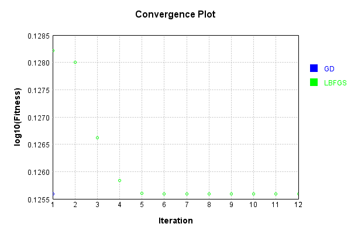
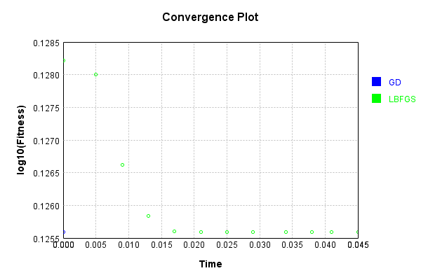

# SubsampleLayer
## Double
### Json Serialization
Code from [JsonTest.java:36](../../../../../../../../src/main/java/com/simiacryptus/mindseye/test/unit/JsonTest.java#L36) executed in 0.00 seconds: 
```java
    JsonObject json = layer.getJson();
    NNLayer echo = NNLayer.fromJson(json);
    if ((echo == null)) throw new AssertionError("Failed to deserialize");
    if ((layer == echo)) throw new AssertionError("Serialization did not copy");
    if ((!layer.equals(echo))) throw new AssertionError("Serialization not equal");
    return new GsonBuilder().setPrettyPrinting().create().toJson(json);
```

Returns: 

```
    {
      "class": "com.simiacryptus.mindseye.layers.cudnn.SubsampleLayer",
      "id": "1e773fe0-6f3e-4207-a8c6-11b0cbefab08",
      "isFrozen": false,
      "name": "SubsampleLayer/1e773fe0-6f3e-4207-a8c6-11b0cbefab08",
      "maxBands": -1,
      "precision": "Double"
    }
```


### Example Input/Output Pair
Code from [ReferenceIO.java:68](../../../../../../../../src/main/java/com/simiacryptus/mindseye/test/unit/ReferenceIO.java#L68) executed in 0.00 seconds: 
```java
    SimpleEval eval = SimpleEval.run(layer, inputPrototype);
    return String.format("--------------------\nInput: \n[%s]\n--------------------\nOutput: \n%s\n--------------------\nDerivative: \n%s",
      Arrays.stream(inputPrototype).map(t -> t.prettyPrint()).reduce((a, b) -> a + ",\n" + b).get(),
      eval.getOutput().prettyPrint(),
      Arrays.stream(eval.getDerivative()).map(t -> t.prettyPrint()).reduce((a, b) -> a + ",\n" + b).get());
```

Returns: 

```
    --------------------
    Input: 
    [[
    	[ [ 0.864 ], [ -0.984 ] ],
    	[ [ -0.124 ], [ 0.056 ] ]
    ],
    [
    	[ [ -0.748 ], [ 0.76 ] ],
    	[ [ -1.732 ], [ -0.092 ] ]
    ]]
    --------------------
    Output: 
    [
    	[ [ 0.864, -0.748 ], [ -0.984, 0.76 ] ],
    	[ [ -0.124, -1.732 ], [ 0.056, -0.092 ] ]
    ]
    --------------------
    Derivative: 
    [
    	[ [ 1.0 ], [ 1.0 ] ],
    	[ [ 1.0 ], [ 1.0 ] ]
    ],
    [
    	[ [ 1.0 ], [ 1.0 ] ],
    	[ [ 1.0 ], [ 1.0 ] ]
    ]
```


[GPU Log](etc/cuda.log)

### Batch Execution
Code from [BatchingTester.java:66](../../../../../../../../src/main/java/com/simiacryptus/mindseye/test/unit/BatchingTester.java#L66) executed in 0.01 seconds: 
```java
    return test(reference, inputPrototype);
```

Returns: 

```
    ToleranceStatistics{absoluteTol=0.0000e+00 +- 0.0000e+00 [0.0000e+00 - 0.0000e+00] (160#), relativeTol=0.0000e+00 +- 0.0000e+00 [0.0000e+00 - 0.0000e+00] (160#)}
```


Code from [SingleDerivativeTester.java:77](../../../../../../../../src/main/java/com/simiacryptus/mindseye/test/unit/SingleDerivativeTester.java#L77) executed in 0.02 seconds: 
```java
    return test(component, inputPrototype);
```
Logging: 
```
    Inputs: [
    	[ [ 0.7 ], [ 0.792 ] ],
    	[ [ 1.08 ], [ 0.88 ] ]
    ],
    [
    	[ [ -1.832 ], [ 1.756 ] ],
    	[ [ 0.236 ], [ -0.76 ] ]
    ]
    Inputs Statistics: {meanExponent=-0.06956758768978283, negative=0, min=0.88, max=0.88, mean=0.863, count=4.0, positive=4, stdDev=0.14052401929919298, zeros=0},
    {meanExponent=-0.05970610596179669, negative=2, min=-0.76, max=-0.76, mean=-0.15000000000000002, count=4.0, positive=2, stdDev=1.321273627981729, zeros=0}
    Output: [
    	[ [ 0.7, -1.832 ], [ 0.792, 1.756 ] ],
    	[ [ 1.08, 0.236 ], [ 0.88, -0.76 ] ]
    ]
    Outputs Statistics: {meanExponent=-0.06463684682578977, negative=2, min=-0.76, max=-0.76, mean=0.35650000000000004, count=8.0, positive=6, stdDev=1.0673789158494749, zeros=0}
    Feedback for input 0
    Inputs Values: [
    	[ [ 0.7 ], [ 0.792 ] ],
    	[ [ 1.08 ], [ 0.88 ] ]
    ]
    Value Statistics: {meanExponent=-0.06956758768978283, negative=0, min=0.88, max=0.88, mean=0.863, count=4.0, positive=4, stdDev=0.14052401929919298, zeros=0}
    Implemented Feedback: [ [ 1.0, 0.0, 0.0, 0.0, 0.0, 0.0, 0.0, 0.0 ], [ 
```
...[skipping 1911 bytes](etc/218.txt)...
```
    998899, 0.0, 0.0 ], [ 0.0, 0.0, 0.0, 0.0, 0.0, 0.0, 0.9999999999998899, 0.0 ], [ 0.0, 0.0, 0.0, 0.0, 0.0, 0.0, 0.0, 0.9999999999998899 ] ]
    Measured Statistics: {meanExponent=-4.7830642341045674E-14, negative=0, min=0.9999999999998899, max=0.9999999999998899, mean=0.12499999999998623, count=32.0, positive=4, stdDev=0.3307189138830374, zeros=28}
    Feedback Error: [ [ 0.0, 0.0, 0.0, 0.0, -1.1013412404281553E-13, 0.0, 0.0, 0.0 ], [ 0.0, 0.0, 0.0, 0.0, 0.0, -1.1013412404281553E-13, 0.0, 0.0 ], [ 0.0, 0.0, 0.0, 0.0, 0.0, 0.0, -1.1013412404281553E-13, 0.0 ], [ 0.0, 0.0, 0.0, 0.0, 0.0, 0.0, 0.0, -1.1013412404281553E-13 ] ]
    Error Statistics: {meanExponent=-12.958078098036825, negative=4, min=-1.1013412404281553E-13, max=-1.1013412404281553E-13, mean=-1.3766765505351941E-14, count=32.0, positive=0, stdDev=3.6423437884903677E-14, zeros=28}
    Finite-Difference Derivative Accuracy:
    absoluteTol: 1.3767e-14 +- 3.6423e-14 [0.0000e+00 - 1.1013e-13] (64#)
    relativeTol: 5.5067e-14 +- 0.0000e+00 [5.5067e-14 - 5.5067e-14] (8#)
    
```

Returns: 

```
    ToleranceStatistics{absoluteTol=1.3767e-14 +- 3.6423e-14 [0.0000e+00 - 1.1013e-13] (64#), relativeTol=5.5067e-14 +- 0.0000e+00 [5.5067e-14 - 5.5067e-14] (8#)}
```


### Performance
Now we execute larger-scale runs to benchmark performance:

Code from [PerformanceTester.java:66](../../../../../../../../src/main/java/com/simiacryptus/mindseye/test/unit/PerformanceTester.java#L66) executed in 0.01 seconds: 
```java
    test(component, inputPrototype);
```
Logging: 
```
    100 batches
    Input Dimensions:
    	[2, 2, 1]
    	[2, 2, 1]
    Performance:
    	Evaluation performance: 0.000584s +- 0.000375s [0.000277s - 0.001211s]
    	Learning performance: 0.000253s +- 0.000060s [0.000204s - 0.000372s]
    
```

### Input Learning
In this test, we use a network to learn this target input, given it's pre-evaluated output:

Code from [LearningTester.java:127](../../../../../../../../src/main/java/com/simiacryptus/mindseye/test/unit/LearningTester.java#L127) executed in 0.00 seconds: 
```java
    return Arrays.stream(input_target).map(x -> x.prettyPrint()).reduce((a, b) -> a + "\n" + b).orElse("");
```

Returns: 

```
    [
    	[ [ 1.284 ], [ 1.144 ] ],
    	[ [ 1.828 ], [ 1.808 ] ]
    ]
    [
    	[ [ -0.6 ], [ -1.2 ] ],
    	[ [ -1.656 ], [ 1.38 ] ]
    ]
```


First, we use a conjugate gradient descent method, which converges the fastest for purely linear functions.

Code from [LearningTester.java:300](../../../../../../../../src/main/java/com/simiacryptus/mindseye/test/unit/LearningTester.java#L300) executed in 0.09 seconds: 
```java
    return new IterativeTrainer(trainable)
      .setLineSearchFactory(label -> new QuadraticSearch())
      .setOrientation(new GradientDescent())
      .setMonitor(monitor)
      .setTimeout(30, TimeUnit.SECONDS)
      .setMaxIterations(250)
      .setTerminateThreshold(0)
      .run();
```
Logging: 
```
    Constructing line search parameters: GD
    F(0.0) = LineSearchPoint{point=PointSample{avg=2.6965540000000003}, derivative=-1.361227}
    New Minimum: 2.6965540000000003 > 2.6965539998638772
    F(1.0E-10) = LineSearchPoint{point=PointSample{avg=2.6965539998638772}, derivative=-1.3612269999319386}, delta = -1.361231127816609E-10
    New Minimum: 2.6965539998638772 > 2.696553999047141
    F(7.000000000000001E-10) = LineSearchPoint{point=PointSample{avg=2.696553999047141}, derivative=-1.3612269995235706}, delta = -9.528591249363672E-10
    New Minimum: 2.696553999047141 > 2.6965539933299882
    F(4.900000000000001E-9) = LineSearchPoint{point=PointSample{avg=2.6965539933299882}, derivative=-1.361226996664994}, delta = -6.670012098197731E-9
    New Minimum: 2.6965539933299882 > 2.6965539533099143
    F(3.430000000000001E-8) = LineSearchPoint{point=PointSample{avg=2.6965539533099143}, derivative=-1.361226976654957}, delta = -4.6690086019651744E-8
    New Minimum: 2.6965539533099143 > 2.696553673169417
    F(2.4010000000000004E-7) = LineSearchPoin
```
...[skipping 3450 bytes](etc/219.txt)...
```
    
    Left bracket at 1.2142821018560666
    F(1.6999949425984933) = LineSearchPoint{point=PointSample{avg=1.3353269999999997}, derivative=-3.0814879110195774E-33}, delta = 0.0
    Left bracket at 1.6999949425984933
    F(1.9428513629697064) = LineSearchPoint{point=PointSample{avg=1.3353269999999997}, derivative=-3.0814879110195774E-33}, delta = 0.0
    Left bracket at 1.9428513629697064
    F(2.064279573155313) = LineSearchPoint{point=PointSample{avg=1.3353269999999997}, derivative=3.0814879110195774E-33}, delta = 0.0
    Right bracket at 2.064279573155313
    F(2.0035654680625097) = LineSearchPoint{point=PointSample{avg=1.3353269999999997}, derivative=3.0814879110195774E-33}, delta = 0.0
    Right bracket at 2.0035654680625097
    F(1.973208415516108) = LineSearchPoint{point=PointSample{avg=1.3353269999999997}, derivative=-3.0814879110195774E-33}, delta = 0.0
    Left bracket at 1.973208415516108
    Converged to left
    Iteration 2 failed, aborting. Error: 1.3353269999999997 Total: 249766590349707.4400; Orientation: 0.0001; Line Search: 0.0362
    
```

Returns: 

```
    1.3353269999999997
```


This training run resulted in the following regressed input:

Code from [LearningTester.java:144](../../../../../../../../src/main/java/com/simiacryptus/mindseye/test/unit/LearningTester.java#L144) executed in 0.00 seconds: 
```java
    return Arrays.stream(input_gd).map(x -> x.prettyPrint()).reduce((a, b) -> a + "\n" + b).orElse("");
```

Returns: 

```
    [
    	[ [ 0.342 ], [ -0.028000000000000025 ] ],
    	[ [ 0.08600000000000008 ], [ 1.5939999999999999 ] ]
    ]
    [
    	[ [ 1.38 ], [ -1.656 ] ],
    	[ [ -0.6 ], [ -1.2 ] ]
    ]
```


Next, we run the same optimization using L-BFGS, which is nearly ideal for purely second-order or quadratic functions.

Code from [LearningTester.java:324](../../../../../../../../src/main/java/com/simiacryptus/mindseye/test/unit/LearningTester.java#L324) executed in 0.05 seconds: 
```java
    return new IterativeTrainer(trainable)
      .setLineSearchFactory(label -> new ArmijoWolfeSearch())
      .setOrientation(new LBFGS())
      .setMonitor(monitor)
      .setTimeout(30, TimeUnit.SECONDS)
      .setMaxIterations(250)
      .setTerminateThreshold(0)
      .run();
```
Logging: 
```
    LBFGS Accumulation History: 1 points
    Constructing line search parameters: GD
    th(0)=2.6965540000000003;dx=-1.361227
    New Minimum: 2.6965540000000003 > 1.3434433409950246
    WOLF (strong): th(2.154434690031884)=1.3434433409950246; dx=0.10511033490401561 delta=1.3531106590049757
    END: th(1.077217345015942)=1.6251076677967482; dx=-0.6280583325479923 delta=1.0714463322032521
    Iteration 1 complete. Error: 1.3434433409950246 Total: 249766599235904.4000; Orientation: 0.0000; Line Search: 0.0028
    LBFGS Accumulation History: 1 points
    th(0)=1.6251076677967482;dx=-0.2897806677967483
    New Minimum: 1.6251076677967482 > 1.3427822638768276
    WOLF (strong): th(2.3207944168063896)=1.3427822638768276; dx=0.04648001016381198 delta=0.28232540391992056
    END: th(1.1603972084031948)=1.3863959778364876; dx=-0.12165032881646813 delta=0.2387116899602606
    Iteration 2 complete. Error: 1.3427822638768276 Total: 249766603495191.4000; Orientation: 0.0000; Line Search: 0.0033
    LBFGS Accumulation History: 1 points
    th(0)=1.3863959778364876;dx
```
...[skipping 4449 bytes](etc/220.txt)...
```
    00000084 Total: 249766639422416.3800; Orientation: 0.0000; Line Search: 0.0020
    LBFGS Accumulation History: 1 points
    th(0)=1.3353270000000084;dx=-8.405237451938255E-15
    New Minimum: 1.3353270000000084 > 1.3353270000000033
    WOLF (strong): th(3.2552083333333353)=1.3353270000000033; dx=5.275162053030167E-15 delta=5.10702591327572E-15
    New Minimum: 1.3353270000000033 > 1.3353270000000002
    END: th(1.6276041666666676)=1.3353270000000002; dx=-1.5650377003918827E-15 delta=8.215650382226158E-15
    Iteration 12 complete. Error: 1.3353270000000002 Total: 249766643403564.3800; Orientation: 0.0000; Line Search: 0.0029
    LBFGS Accumulation History: 1 points
    th(0)=1.3353270000000002;dx=-2.9140675889924945E-16
    Armijo: th(3.5065668783071047)=1.3353270000000004; dx=2.1951188531765096E-16 delta=-2.220446049250313E-16
    END: th(1.7532834391535523)=1.3353270000000002; dx=-3.594743662247011E-17 delta=0.0
    Iteration 13 failed, aborting. Error: 1.3353270000000002 Total: 249766647117688.3400; Orientation: 0.0000; Line Search: 0.0028
    
```

Returns: 

```
    1.3353270000000002
```


This training run resulted in the following regressed input:

Code from [LearningTester.java:154](../../../../../../../../src/main/java/com/simiacryptus/mindseye/test/unit/LearningTester.java#L154) executed in 0.00 seconds: 
```java
    return Arrays.stream(input_lbgfs).map(x -> x.prettyPrint()).reduce((a, b) -> a + "\n" + b).orElse("");
```

Returns: 

```
    [
    	[ [ 0.3420000014475288 ], [ -0.027999997631972834 ] ],
    	[ [ 0.08600000314413364 ], [ 1.5940000003862482 ] ]
    ]
    [
    	[ [ 1.38 ], [ -1.656 ] ],
    	[ [ -0.6 ], [ -1.2 ] ]
    ]
```


Code from [LearningTester.java:96](../../../../../../../../src/main/java/com/simiacryptus/mindseye/test/unit/LearningTester.java#L96) executed in 0.00 seconds: 
```java
    return TestUtil.compare(runs);
```

Returns: 




Code from [LearningTester.java:99](../../../../../../../../src/main/java/com/simiacryptus/mindseye/test/unit/LearningTester.java#L99) executed in 0.00 seconds: 
```java
    return TestUtil.compareTime(runs);
```

Returns: 




