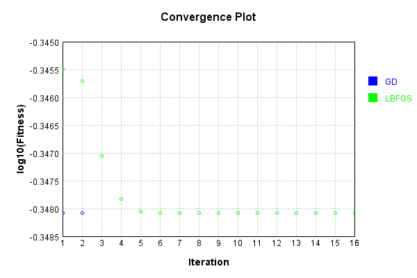
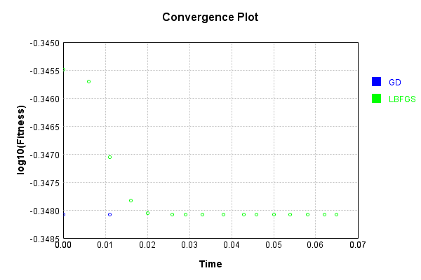

# SubsampleLayer
## Float
### Json Serialization
Code from [JsonTest.java:36](../../../../../../../../src/main/java/com/simiacryptus/mindseye/test/unit/JsonTest.java#L36) executed in 0.00 seconds: 
```java
    JsonObject json = layer.getJson();
    NNLayer echo = NNLayer.fromJson(json);
    if ((echo == null)) throw new AssertionError("Failed to deserialize");
    if ((layer == echo)) throw new AssertionError("Serialization did not copy");
    if ((!layer.equals(echo))) throw new AssertionError("Serialization not equal");
    return new GsonBuilder().setPrettyPrinting().create().toJson(json);
```

Returns: 

```
    {
      "class": "com.simiacryptus.mindseye.layers.cudnn.SubsampleLayer",
      "id": "32d693a2-c4ec-469d-b1fd-4f5c735f6514",
      "isFrozen": false,
      "name": "SubsampleLayer/32d693a2-c4ec-469d-b1fd-4f5c735f6514",
      "maxBands": -1,
      "precision": "Double"
    }
```


### Example Input/Output Pair
Code from [ReferenceIO.java:68](../../../../../../../../src/main/java/com/simiacryptus/mindseye/test/unit/ReferenceIO.java#L68) executed in 0.00 seconds: 
```java
    SimpleEval eval = SimpleEval.run(layer, inputPrototype);
    return String.format("--------------------\nInput: \n[%s]\n--------------------\nOutput: \n%s\n--------------------\nDerivative: \n%s",
      Arrays.stream(inputPrototype).map(t -> t.prettyPrint()).reduce((a, b) -> a + ",\n" + b).get(),
      eval.getOutput().prettyPrint(),
      Arrays.stream(eval.getDerivative()).map(t -> t.prettyPrint()).reduce((a, b) -> a + ",\n" + b).get());
```

Returns: 

```
    --------------------
    Input: 
    [[
    	[ [ -1.212 ], [ 0.404 ] ],
    	[ [ -0.008 ], [ -1.26 ] ]
    ],
    [
    	[ [ 1.504 ], [ 1.084 ] ],
    	[ [ 0.472 ], [ 1.16 ] ]
    ]]
    --------------------
    Output: 
    [
    	[ [ -1.212, 1.504 ], [ 0.404, 1.084 ] ],
    	[ [ -0.008, 0.472 ], [ -1.26, 1.16 ] ]
    ]
    --------------------
    Derivative: 
    [
    	[ [ 1.0 ], [ 1.0 ] ],
    	[ [ 1.0 ], [ 1.0 ] ]
    ],
    [
    	[ [ 1.0 ], [ 1.0 ] ],
    	[ [ 1.0 ], [ 1.0 ] ]
    ]
```


[GPU Log](etc/cuda.log)

### Batch Execution
Code from [BatchingTester.java:66](../../../../../../../../src/main/java/com/simiacryptus/mindseye/test/unit/BatchingTester.java#L66) executed in 0.01 seconds: 
```java
    return test(reference, inputPrototype);
```

Returns: 

```
    ToleranceStatistics{absoluteTol=0.0000e+00 +- 0.0000e+00 [0.0000e+00 - 0.0000e+00] (160#), relativeTol=0.0000e+00 +- 0.0000e+00 [0.0000e+00 - 0.0000e+00] (160#)}
```


Code from [SingleDerivativeTester.java:77](../../../../../../../../src/main/java/com/simiacryptus/mindseye/test/unit/SingleDerivativeTester.java#L77) executed in 0.02 seconds: 
```java
    return test(component, inputPrototype);
```
Logging: 
```
    Inputs: [
    	[ [ 0.74 ], [ 1.876 ] ],
    	[ [ 1.796 ], [ 0.612 ] ]
    ],
    [
    	[ [ -0.24 ], [ 0.6 ] ],
    	[ [ 1.092 ], [ 0.4 ] ]
    ]
    Inputs Statistics: {meanExponent=0.045880577062717136, negative=0, min=0.612, max=0.612, mean=1.256, count=4.0, positive=4, stdDev=0.5824499978538928, zeros=0},
    {meanExponent=-0.3003387195520174, negative=1, min=0.4, max=0.4, mean=0.46299999999999997, count=4.0, positive=3, stdDev=0.47764735946093134, zeros=0}
    Output: [
    	[ [ 0.74, -0.24 ], [ 1.876, 0.6 ] ],
    	[ [ 1.796, 1.092 ], [ 0.612, 0.4 ] ]
    ]
    Outputs Statistics: {meanExponent=-0.1272290712446501, negative=1, min=0.4, max=0.4, mean=0.8594999999999999, count=8.0, positive=7, stdDev=0.6640103538349383, zeros=0}
    Feedback for input 0
    Inputs Values: [
    	[ [ 0.74 ], [ 1.876 ] ],
    	[ [ 1.796 ], [ 0.612 ] ]
    ]
    Value Statistics: {meanExponent=0.045880577062717136, negative=0, min=0.612, max=0.612, mean=1.256, count=4.0, positive=4, stdDev=0.5824499978538928, zeros=0}
    Implemented Feedback: [ [ 1.0, 0.0, 0.0, 0.0, 0.0, 0.0, 0.0, 0.0 ], [ 0.0, 1.0,
```
...[skipping 1893 bytes](etc/221.txt)...
```
    998899, 0.0, 0.0 ], [ 0.0, 0.0, 0.0, 0.0, 0.0, 0.0, 0.9999999999998899, 0.0 ], [ 0.0, 0.0, 0.0, 0.0, 0.0, 0.0, 0.0, 0.9999999999998899 ] ]
    Measured Statistics: {meanExponent=-4.7830642341045674E-14, negative=0, min=0.9999999999998899, max=0.9999999999998899, mean=0.12499999999998623, count=32.0, positive=4, stdDev=0.3307189138830374, zeros=28}
    Feedback Error: [ [ 0.0, 0.0, 0.0, 0.0, -1.1013412404281553E-13, 0.0, 0.0, 0.0 ], [ 0.0, 0.0, 0.0, 0.0, 0.0, -1.1013412404281553E-13, 0.0, 0.0 ], [ 0.0, 0.0, 0.0, 0.0, 0.0, 0.0, -1.1013412404281553E-13, 0.0 ], [ 0.0, 0.0, 0.0, 0.0, 0.0, 0.0, 0.0, -1.1013412404281553E-13 ] ]
    Error Statistics: {meanExponent=-12.958078098036825, negative=4, min=-1.1013412404281553E-13, max=-1.1013412404281553E-13, mean=-1.3766765505351941E-14, count=32.0, positive=0, stdDev=3.6423437884903677E-14, zeros=28}
    Finite-Difference Derivative Accuracy:
    absoluteTol: 1.3767e-14 +- 3.6423e-14 [0.0000e+00 - 1.1013e-13] (64#)
    relativeTol: 5.5067e-14 +- 0.0000e+00 [5.5067e-14 - 5.5067e-14] (8#)
    
```

Returns: 

```
    ToleranceStatistics{absoluteTol=1.3767e-14 +- 3.6423e-14 [0.0000e+00 - 1.1013e-13] (64#), relativeTol=5.5067e-14 +- 0.0000e+00 [5.5067e-14 - 5.5067e-14] (8#)}
```


### Performance
Now we execute larger-scale runs to benchmark performance:

Code from [PerformanceTester.java:66](../../../../../../../../src/main/java/com/simiacryptus/mindseye/test/unit/PerformanceTester.java#L66) executed in 0.01 seconds: 
```java
    test(component, inputPrototype);
```
Logging: 
```
    100 batches
    Input Dimensions:
    	[2, 2, 1]
    	[2, 2, 1]
    Performance:
    	Evaluation performance: 0.000659s +- 0.000309s [0.000276s - 0.001109s]
    	Learning performance: 0.000229s +- 0.000009s [0.000220s - 0.000244s]
    
```

### Input Learning
In this test, we use a network to learn this target input, given it's pre-evaluated output:

Code from [LearningTester.java:127](../../../../../../../../src/main/java/com/simiacryptus/mindseye/test/unit/LearningTester.java#L127) executed in 0.00 seconds: 
```java
    return Arrays.stream(input_target).map(x -> x.prettyPrint()).reduce((a, b) -> a + "\n" + b).orElse("");
```

Returns: 

```
    [
    	[ [ 0.044 ], [ -0.14 ] ],
    	[ [ -0.612 ], [ -1.62 ] ]
    ]
    [
    	[ [ -0.008 ], [ 1.84 ] ],
    	[ [ 0.252 ], [ -0.036 ] ]
    ]
```


First, we use a conjugate gradient descent method, which converges the fastest for purely linear functions.

Code from [LearningTester.java:300](../../../../../../../../src/main/java/com/simiacryptus/mindseye/test/unit/LearningTester.java#L300) executed in 0.05 seconds: 
```java
    return new IterativeTrainer(trainable)
      .setLineSearchFactory(label -> new QuadraticSearch())
      .setOrientation(new GradientDescent())
      .setMonitor(monitor)
      .setTimeout(30, TimeUnit.SECONDS)
      .setMaxIterations(250)
      .setTerminateThreshold(0)
      .run();
```
Logging: 
```
    Constructing line search parameters: GD
    F(0.0) = LineSearchPoint{point=PointSample{avg=0.897332}, derivative=-0.448666}
    New Minimum: 0.897332 > 0.8973319999551335
    F(1.0E-10) = LineSearchPoint{point=PointSample{avg=0.8973319999551335}, derivative=-0.44866599997756673}, delta = -4.486655491575675E-11
    New Minimum: 0.8973319999551335 > 0.8973319996859338
    F(7.000000000000001E-10) = LineSearchPoint{point=PointSample{avg=0.8973319996859338}, derivative=-0.4486659998429669}, delta = -3.1406621747720465E-10
    New Minimum: 0.8973319996859338 > 0.8973319978015368
    F(4.900000000000001E-9) = LineSearchPoint{point=PointSample{avg=0.8973319978015368}, derivative=-0.4486659989007683}, delta = -2.198463189273525E-9
    New Minimum: 0.8973319978015368 > 0.8973319846107564
    F(3.430000000000001E-8) = LineSearchPoint{point=PointSample{avg=0.8973319846107564}, derivative=-0.44866599230537807}, delta = -1.5389243657182305E-8
    New Minimum: 0.8973319846107564 > 0.8973318922753
    F(2.4010000000000004E-7) = LineSearchPoint{point=PointS
```
...[skipping 3905 bytes](etc/222.txt)...
```
    avg=0.448666}, derivative=-7.703719777548943E-34}, delta = 0.0
    Left bracket at 1.1530014641288435
    F(1.7295021961932653) = LineSearchPoint{point=PointSample{avg=0.448666}, derivative=-7.703719777548943E-34}, delta = 0.0
    Left bracket at 1.7295021961932653
    F(2.017752562225476) = LineSearchPoint{point=PointSample{avg=0.448666}, derivative=7.703719777548943E-34}, delta = 0.0
    Right bracket at 2.017752562225476
    F(1.8736273792093707) = LineSearchPoint{point=PointSample{avg=0.448666}, derivative=-7.703719777548943E-34}, delta = 0.0
    Left bracket at 1.8736273792093707
    F(1.9456899707174236) = LineSearchPoint{point=PointSample{avg=0.448666}, derivative=-7.703719777548943E-34}, delta = 0.0
    Left bracket at 1.9456899707174236
    F(1.9817212664714499) = LineSearchPoint{point=PointSample{avg=0.448666}, derivative=-7.703719777548943E-34}, delta = 0.0
    Left bracket at 1.9817212664714499
    Converged to left
    Iteration 3 failed, aborting. Error: 0.448666 Total: 249766880083817.1200; Orientation: 0.0000; Line Search: 0.0166
    
```

Returns: 

```
    0.448666
```


This training run resulted in the following regressed input:

Code from [LearningTester.java:144](../../../../../../../../src/main/java/com/simiacryptus/mindseye/test/unit/LearningTester.java#L144) executed in 0.00 seconds: 
```java
    return Arrays.stream(input_gd).map(x -> x.prettyPrint()).reduce((a, b) -> a + "\n" + b).orElse("");
```

Returns: 

```
    [
    	[ [ 0.018 ], [ 0.8500000000000001 ] ],
    	[ [ -0.18 ], [ -0.8280000000000001 ] ]
    ]
    [
    	[ [ 1.84 ], [ -0.036 ] ],
    	[ [ 0.252 ], [ -0.008 ] ]
    ]
```


Next, we run the same optimization using L-BFGS, which is nearly ideal for purely second-order or quadratic functions.

Code from [LearningTester.java:324](../../../../../../../../src/main/java/com/simiacryptus/mindseye/test/unit/LearningTester.java#L324) executed in 0.07 seconds: 
```java
    return new IterativeTrainer(trainable)
      .setLineSearchFactory(label -> new ArmijoWolfeSearch())
      .setOrientation(new LBFGS())
      .setMonitor(monitor)
      .setTimeout(30, TimeUnit.SECONDS)
      .setMaxIterations(250)
      .setTerminateThreshold(0)
      .run();
```
Logging: 
```
    LBFGS Accumulation History: 1 points
    Constructing line search parameters: GD
    th(0)=0.897332;dx=-0.448666
    New Minimum: 0.897332 > 0.45134117926758266
    WOLF (strong): th(2.154434690031884)=0.45134117926758266; dx=0.03464479731892261 delta=0.44599082073241736
    END: th(1.077217345015942)=0.5441788961574344; dx=-0.20701060134053872 delta=0.3531531038425656
    Iteration 1 complete. Error: 0.45134117926758266 Total: 249766888693584.1200; Orientation: 0.0001; Line Search: 0.0030
    LBFGS Accumulation History: 1 points
    th(0)=0.5441788961574344;dx=-0.09551289615743436
    New Minimum: 0.5441788961574344 > 0.45112328553912084
    WOLF (strong): th(2.3207944168063896)=0.45112328553912084; dx=0.015320001910156712 delta=0.09305561061831358
    END: th(1.1603972084031948)=0.46549854446906047; dx=-0.04009644712363883 delta=0.07868035168837395
    Iteration 2 complete. Error: 0.45112328553912084 Total: 249766894550745.1200; Orientation: 0.0000; Line Search: 0.0048
    LBFGS Accumulation History: 1 points
    th(0)=0.46549854446906047;dx=-0.016
```
...[skipping 6325 bytes](etc/223.txt)...
```
    .551115123125783E-17
    END: th(0.6781684027777782)=0.44866600000000006; dx=-2.993368130408233E-21 delta=0.0
    Iteration 15 complete. Error: 0.448666 Total: 249766950939419.0600; Orientation: 0.0000; Line Search: 0.0039
    LBFGS Accumulation History: 1 points
    th(0)=0.44866600000000006;dx=-1.9783637407694162E-21
    New Minimum: 0.44866600000000006 > 0.448666
    END: th(1.4610695326279604)=0.448666; dx=-5.330999749520814E-22 delta=5.551115123125783E-17
    Iteration 16 complete. Error: 0.448666 Total: 249766953690600.0600; Orientation: 0.0000; Line Search: 0.0018
    LBFGS Accumulation History: 1 points
    th(0)=0.448666;dx=-1.4365183582725956E-22
    WOLF (strong): th(3.147778885642349)=0.448666; dx=8.244021219797388E-23 delta=0.0
    Armijo: th(1.5738894428211745)=0.44866600000000006; dx=-3.060576264565136E-23 delta=-5.551115123125783E-17
    END: th(0.5246298142737248)=0.448666; dx=-1.0596974276119927E-22 delta=0.0
    Iteration 17 failed, aborting. Error: 0.448666 Total: 249766958320074.0300; Orientation: 0.0000; Line Search: 0.0037
    
```

Returns: 

```
    0.448666
```


This training run resulted in the following regressed input:

Code from [LearningTester.java:154](../../../../../../../../src/main/java/com/simiacryptus/mindseye/test/unit/LearningTester.java#L154) executed in 0.00 seconds: 
```java
    return Arrays.stream(input_lbgfs).map(x -> x.prettyPrint()).reduce((a, b) -> a + "\n" + b).orElse("");
```

Returns: 

```
    [
    	[ [ 0.01800000000034319 ], [ 0.8499999999869323 ] ],
    	[ [ -0.1800000000057023 ], [ -0.8280000000104543 ] ]
    ]
    [
    	[ [ 1.84 ], [ -0.036 ] ],
    	[ [ 0.252 ], [ -0.008 ] ]
    ]
```


Code from [LearningTester.java:96](../../../../../../../../src/main/java/com/simiacryptus/mindseye/test/unit/LearningTester.java#L96) executed in 0.00 seconds: 
```java
    return TestUtil.compare(runs);
```

Returns: 




Code from [LearningTester.java:99](../../../../../../../../src/main/java/com/simiacryptus/mindseye/test/unit/LearningTester.java#L99) executed in 0.00 seconds: 
```java
    return TestUtil.compareTime(runs);
```

Returns: 




