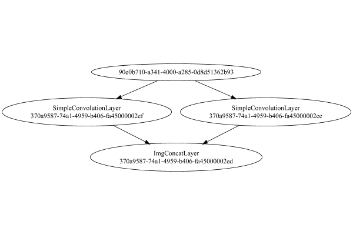

# PipelineNetwork
## AsymmetricExplodedTest
### Json Serialization
Code from [LayerTestBase.java:83](../../../../../../../../../src/test/java/com/simiacryptus/mindseye/layers/LayerTestBase.java#L83) executed in 0.00 seconds: 
```java
    JsonObject json = layer.getJson();
    NNLayer echo = NNLayer.fromJson(json);
    assert (echo != null) : "Failed to deserialize";
    assert (layer != echo) : "Serialization did not copy";
    Assert.assertEquals("Serialization not equal", layer, echo);
    return new GsonBuilder().setPrettyPrinting().create().toJson(json);
```

Returns: 

```
    {
      "class": "com.simiacryptus.mindseye.network.PipelineNetwork",
      "id": "a864e734-2f23-44db-97c1-5040000002ec",
      "isFrozen": false,
      "name": "PipelineNetwork/a864e734-2f23-44db-97c1-5040000002ec",
      "inputs": [
        "409878db-5f61-409a-9fa0-dde562a76e43"
      ],
      "nodes": {
        "c86feb6c-9ff2-428a-8e62-5d3304267eef": "a864e734-2f23-44db-97c1-5040000002ee",
        "409785fd-3dd7-43ba-9458-ed623f38e0f2": "a864e734-2f23-44db-97c1-5040000002ef",
        "8c5e1fb7-323e-45ff-ab08-15fa4b80a26e": "a864e734-2f23-44db-97c1-5040000002ed"
      },
      "layers": {
        "a864e734-2f23-44db-97c1-5040000002ee": {
          "class": "com.simiacryptus.mindseye.layers.cudnn.f32.SimpleConvolutionLayer",
          "id": "a864e734-2f23-44db-97c1-5040000002ee",
          "isFrozen": false,
          "name": "SimpleConvolutionLayer/a864e734-2f23-44db-97c1-5040000002ee",
          "filter": {
            "dimensions": [
              1,
              1,
              4
            ],
            "data": [
              -1.016,
              -0.6,
              -1.436,
              1.14
            ]
          },
          "strideX": 1,
          "strideY": 1,
          "simple": false
        },
        "a864e734-2f23-44db-97c1-5040000002ef": {
          "class": "com.simiacryptus.mindseye.layers.cudnn.f32.SimpleConvolutionLayer",
          "id": "a864e734-2f23-44db-97c1-5040000002ef",
          "isFrozen": false,
          "name": "SimpleConvolutionLayer/a864e734-2f23-44db-97c1-5040000002ef",
          "filter": {
            "dimensions": [
              1,
              1,
              4
            ],
            "data": [
              -1.24,
              -0.984,
              1.88,
              1.54
            ]
          },
          "strideX": 1,
          "strideY": 1,
          "simple": false
        },
        "a864e734-2f23-44db-97c1-5040000002ed": {
          "class": "com.simiacryptus.mindseye.layers.cudnn.f32.ImgConcatLayer",
          "id": "a864e734-2f23-44db-97c1-5040000002ed",
          "isFrozen": false,
          "name": "ImgConcatLayer/a864e734-2f23-44db-97c1-5040000002ed",
          "maxBands": 3
        }
      },
      "links": {
        "c86feb6c-9ff2-428a-8e62-5d3304267eef": [
          "409878db-5f61-409a-9fa0-dde562a76e43"
        ],
        "409785fd-3dd7-43ba-9458-ed623f38e0f2": [
          "409878db-5f61-409a-9fa0-dde562a76e43"
        ],
        "8c5e1fb7-323e-45ff-ab08-15fa4b80a26e": [
          "c86feb6c-9ff2-428a-8e62-5d3304267eef",
          "409785fd-3dd7-43ba-9458-ed623f38e0f2"
        ]
      },
      "labels": {},
      "head": "8c5e1fb7-323e-45ff-ab08-15fa4b80a26e"
    }
```


### Network Diagram
Code from [LayerTestBase.java:94](../../../../../../../../../src/test/java/com/simiacryptus/mindseye/layers/LayerTestBase.java#L94) executed in 2.28 seconds: 
```java
    return Graphviz.fromGraph(toGraph((DAGNetwork) layer))
      .height(400).width(600).render(Format.PNG).toImage();
```

Returns: 




### Example Input/Output Pair
Code from [LayerTestBase.java:120](../../../../../../../../../src/test/java/com/simiacryptus/mindseye/layers/LayerTestBase.java#L120) executed in 0.01 seconds: 
```java
    SimpleEval eval = SimpleEval.run(layer, inputPrototype);
    return String.format("--------------------\nInput: \n[%s]\n--------------------\nOutput: \n%s",
      Arrays.stream(inputPrototype).map(t->t.prettyPrint()).reduce((a,b)->a+",\n"+b).get(),
      eval.getOutput().prettyPrint());
```

Returns: 

```
    --------------------
    Input: 
    [[
    	[ [ -1.404, 0.552 ] ]
    ]]
    --------------------
    Output: 
    [
    	[ [ 1.0952640771865845, 2.6454241275787354, 1.1977921724319458 ] ]
    ]
```


### Batch Execution
Code from [LayerTestBase.java:138](../../../../../../../../../src/test/java/com/simiacryptus/mindseye/layers/LayerTestBase.java#L138) executed in 0.04 seconds: 
```java
    BatchingTester batchingTester = getBatchingTester();
    return batchingTester==null?null:batchingTester.test(layer, inputPrototype);
```

Returns: 

```
    ToleranceStatistics{absoluteTol=0.0000e+00 +- 0.0000e+00 [0.0000e+00 - 0.0000e+00] (50#), relativeTol=0.0000e+00 +- 0.0000e+00 [0.0000e+00 - 0.0000e+00] (50#)}
```


### Differential Validation
Code from [LayerTestBase.java:144](../../../../../../../../../src/test/java/com/simiacryptus/mindseye/layers/LayerTestBase.java#L144) executed in 0.00 seconds: 
```java
    return getDerivativeTester().test(layer, inputPrototype);
```
Logging: 
```
    Inputs: [
    	[ [ -1.404, 0.552 ] ]
    ]
    Inputs Statistics: {meanExponent=-0.05534690723850731, negative=1, min=0.552, max=0.552, mean=-0.42599999999999993, count=2.0, positive=1, stdDev=0.978, zeros=0}
    Output: [
    	[ [ 1.0952640771865845, 2.6454241275787354, 1.1977921724319458 ] ]
    ]
    Outputs Statistics: {meanExponent=0.1801318748767142, negative=0, min=1.1977921724319458, max=1.1977921724319458, mean=1.6461601257324219, count=3.0, positive=3, stdDev=0.7078250309307106, zeros=0}
    Feedback for input 0
    Inputs Values: [
    	[ [ -1.404, 0.552 ] ]
    ]
    Value Statistics: {meanExponent=-0.05534690723850731, negative=1, min=0.552, max=0.552, mean=-0.42599999999999993, count=2.0, positive=1, stdDev=0.978, zeros=0}
    Implemented Feedback: [ [ 0.0, 0.0, -1.2400000095367432 ], [ 0.0, 0.0, -0.984000027179718 ] ]
    Implemented Statistics: {meanExponent=0.04320839946481895, negative=2, min=-0.984000027179718, max=-0.984000027179718, mean=-0.37066667278607685, count=6.0, positive=0, stdDev=0.5293853957271277, zeros=4}
    Measured: [ [ -1.0156631469726562, -1.4352798461914062, -1.2409687042236328 ], [ -0.5996227264404297, 1.1396408081054688, -0.9846687316894531 ] ]
    Measured Statistics: {meanExponent=0.014230555703674465, negative=5, min=-0.9846687316894531, max=-0.9846687316894531, mean=-0.6894270579020182, count=6.0, positive=1, stdDev=0.8570925929744084, zeros=0}
    Feedback Error: [ [ -1.0156631469726562, -1.4352798461914062, -9.686946868896484E-4 ], [ -0.5996227264404297, 1.1396408081054688, -6.687045097351074E-4 ] ]
    Error Statistics: {meanExponent=-1.0317077453767356, negative=5, min=-6.687045097351074E-4, max=-6.687045097351074E-4, mean=-0.31876038511594135, count=6.0, positive=1, stdDev=0.8306905498222854, zeros=0}
    
```

Returns: 

```
    java.lang.AssertionError: ToleranceStatistics{absoluteTol=6.9864e-01 +- 5.5096e-01 [6.6870e-04 - 1.4353e+00] (6#), relativeTol=6.6679e-01 +- 4.7123e-01 [3.3967e-04 - 1.0000e+00] (6#)}
    	at com.simiacryptus.mindseye.layers.DerivativeTester.lambda$test$6(DerivativeTester.java:90)
    	at java.util.stream.IntPipeline$4$1.accept(IntPipeline.java:250)
    	at java.util.stream.Streams$RangeIntSpliterator.forEachRemaining(Streams.java:110)
    	at java.util.Spliterator$OfInt.forEachRemaining(Spliterator.java:693)
    	at java.util.stream.AbstractPipeline.copyInto(AbstractPipeline.java:481)
    	at java.util.stream.AbstractPipeline.wrapAndCopyInto(AbstractPipeline.java:471)
    	at java.util.stream.ReduceOps$ReduceOp.evaluateSequential(ReduceOps.java:708)
    	at java.util.stream.AbstractPipeline.evaluate(AbstractPipeline.java:234)
    	at java.util.stream.ReferencePipeline.reduce(ReferencePipeline.java:479)
    	at com.simiacryptus.mindseye.layers.DerivativeTester.test(DerivativeTester.java:121)
    	at com.simiacryptus.mindseye.layers.LayerTestBase.lambda$test$16(LayerTestBase.java:145)
    	at com.simiacryptus.util.io.MarkdownNotebookOutput.lambda$null$1(MarkdownNotebookOutput.java:136)
    	at com.simiacryptus.util.lang.TimedResult.time(TimedResult.java:59)
    	at com.simiacryptus.util.io.MarkdownNotebookOutput.lambda$code$2(MarkdownNotebookOutput.java:136)
    	at com.simiacryptus.util.test.SysOutInterceptor.withOutput(SysOutInterceptor.java:83)
    	at com.simiacryptus.util.io.MarkdownNotebookOutput.code(MarkdownNotebookOutput.java:134)
    	at com.simiacryptus.util.io.NotebookOutput.code(NotebookOutput.java:133)
    	at com.simiacryptus.mindseye.layers.LayerTestBase.test(LayerTestBase.java:144)
    	at com.simiacryptus.mindseye.layers.LayerTestBase.test(LayerTestBase.java:68)
    	at sun.reflect.NativeMethodAccessorImpl.invoke0(Native Method)
    	at sun.reflect.NativeMethodAccessorImpl.invoke(NativeMethodAccessorImpl.java:62)
    	at sun.reflect.DelegatingMethodAccessorImpl.invoke(DelegatingMethodAccessorImpl.java:43)
    	at java.lang.reflect.Method.invoke(Method.java:498)
    	at org.junit.runners.model.FrameworkMethod$1.runReflectiveCall(FrameworkMethod.java:50)
    	at org.junit.internal.runners.model.ReflectiveCallable.run(ReflectiveCallable.java:12)
    	at org.junit.runners.model.FrameworkMethod.invokeExplosively(FrameworkMethod.java:47)
    	at org.junit.internal.runners.statements.InvokeMethod.evaluate(InvokeMethod.java:17)
    	at org.junit.runners.ParentRunner.runLeaf(ParentRunner.java:325)
    	at org.junit.runners.BlockJUnit4ClassRunner.runChild(BlockJUnit4ClassRunner.java:78)
    	at org.junit.runners.BlockJUnit4ClassRunner.runChild(BlockJUnit4ClassRunner.java:57)
    	at org.junit.runners.ParentRunner$3.run(ParentRunner.java:290)
    	at org.junit.runners.ParentRunner$1.schedule(ParentRunner.java:71)
    	at org.junit.runners.ParentRunner.runChildren(ParentRunner.java:288)
    	at org.junit.runners.ParentRunner.access$000(ParentRunner.java:58)
    	at org.junit.runners.ParentRunner$2.evaluate(ParentRunner.java:268)
    	at org.junit.runners.ParentRunner.run(ParentRunner.java:363)
    	at org.junit.runners.Suite.runChild(Suite.java:128)
    	at org.junit.runners.Suite.runChild(Suite.java:27)
    	at org.junit.runners.ParentRunner$3.run(ParentRunner.java:290)
    	at org.junit.runners.ParentRunner$1.schedule(ParentRunner.java:71)
    	at org.junit.runners.ParentRunner.runChildren(ParentRunner.java:288)
    	at org.junit.runners.ParentRunner.access$000(ParentRunner.java:58)
    	at org.junit.runners.ParentRunner$2.evaluate(ParentRunner.java:268)
    	at org.junit.runners.ParentRunner.run(ParentRunner.java:363)
    	at org.junit.runner.JUnitCore.run(JUnitCore.java:137)
    	at com.intellij.junit4.JUnit4IdeaTestRunner.startRunnerWithArgs(JUnit4IdeaTestRunner.java:68)
    	at com.intellij.rt.execution.junit.IdeaTestRunner$Repeater.startRunnerWithArgs(IdeaTestRunner.java:47)
    	at com.intellij.rt.execution.junit.JUnitStarter.prepareStreamsAndStart(JUnitStarter.java:242)
    	at com.intellij.rt.execution.junit.JUnitStarter.main(JUnitStarter.java:70)
    
```


