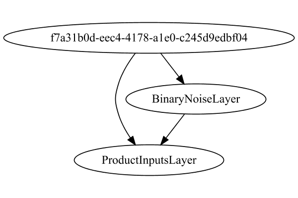

# DropoutNoiseLayer
## DropoutNoiseLayerTest
### Json Serialization
Code from [LayerTestBase.java:75](../../../../../../../../../MindsEye/src/test/java/com/simiacryptus/mindseye/layers/LayerTestBase.java#L75) executed in 0.00 seconds: 
```java
    JsonObject json = layer.getJson();
    NNLayer echo = NNLayer.fromJson(json);
    assert (echo != null) : "Failed to deserialize";
    assert (layer != echo) : "Serialization did not copy";
    Assert.assertEquals("Serialization not equal", layer, echo);
    return new GsonBuilder().setPrettyPrinting().create().toJson(json);
```

Returns: 

```
    {
      "class": "com.simiacryptus.mindseye.layers.cudnn.f32.DropoutNoiseLayer",
      "id": "b385277b-2d2d-42fe-8250-210c000000bd",
      "isFrozen": false,
      "name": "DropoutNoiseLayer/b385277b-2d2d-42fe-8250-210c000000bd",
      "inputs": [
        "1b2c18ab-7db0-44c8-a4a3-0c23db39d6d9"
      ],
      "nodes": {
        "81f8cb36-510b-4679-acb8-dc443fb34776": "b385277b-2d2d-42fe-8250-210c000000bf",
        "56180516-8b7b-4409-86dd-8ae729f15f70": "b385277b-2d2d-42fe-8250-210c000000be"
      },
      "layers": {
        "b385277b-2d2d-42fe-8250-210c000000bf": {
          "class": "com.simiacryptus.mindseye.layers.java.BinaryNoiseLayer",
          "id": "b385277b-2d2d-42fe-8250-210c000000bf",
          "isFrozen": false,
          "name": "mask",
          "value": 0.5
        },
        "b385277b-2d2d-42fe-8250-210c000000be": {
          "class": "com.simiacryptus.mindseye.layers.cudnn.f32.ProductInputsLayer",
          "id": "b385277b-2d2d-42fe-8250-210c000000be",
          "isFrozen": false,
          "name": "ProductInputsLayer/b385277b-2d2d-42fe-8250-210c000000be"
        }
      },
      "links": {
        "81f8cb36-510b-4679-acb8-dc443fb34776": [
          "1b2c18ab-7db0-44c8-a4a3-0c23db39d6d9"
        ],
        "56180516-8b7b-4409-86dd-8ae729f15f70": [
          "81f8cb36-510b-4679-acb8-dc443fb34776",
          "1b2c18ab-7db0-44c8-a4a3-0c23db39d6d9"
        ]
      },
      "labels": {},
      "head": "56180516-8b7b-4409-86dd-8ae729f15f70"
    }
```


### Network Diagram
Code from [LayerTestBase.java:86](../../../../../../../../../MindsEye/src/test/java/com/simiacryptus/mindseye/layers/LayerTestBase.java#L86) executed in 2.07 seconds: 
```java
    return Graphviz.fromGraph(toGraph((DAGNetwork) layer))
      .height(400).width(600).render(Format.PNG).toImage();
```

Returns: 




### Example Input/Output Pair
Code from [LayerTestBase.java:112](../../../../../../../../../MindsEye/src/test/java/com/simiacryptus/mindseye/layers/LayerTestBase.java#L112) executed in 0.00 seconds: 
```java
    SimpleEval eval = SimpleEval.run(layer, inputPrototype);
    return String.format("--------------------\nInput: \n[%s]\n--------------------\nOutput: \n%s",
      Arrays.stream(inputPrototype).map(t->t.prettyPrint()).reduce((a,b)->a+",\n"+b).get(),
      eval.getOutput().prettyPrint());
```

Returns: 

```
    --------------------
    Input: 
    [[
    	[ [ -1.4, 1.444 ], [ -0.348, 0.584 ], [ 0.516, -1.152 ] ],
    	[ [ -0.036, 0.016 ], [ -0.24, 0.564 ], [ -1.832, 0.796 ] ],
    	[ [ 1.396, -0.092 ], [ -0.844, 1.128 ], [ 1.908, 1.068 ] ]
    ]]
    --------------------
    Output: 
    [
    	[ [ -1.399999976158142, 1.444000005722046 ], [ 0.0, 0.5839999914169312 ], [ 0.515999972820282, 0.0 ] ],
    	[ [ 0.0, 0.0 ], [ -0.23999999463558197, 0.5640000104904175 ], [ 0.0, 0.0 ] ],
    	[ [ 1.3960000276565552, -0.09200000017881393 ], [ -0.843999981880188, 1.128000020980835 ], [ 1.9079999923706055, 1.0679999589920044 ] ]
    ]
```


### Differential Validation
Code from [LayerTestBase.java:130](../../../../../../../../../MindsEye/src/test/java/com/simiacryptus/mindseye/layers/LayerTestBase.java#L130) executed in 0.06 seconds: 
```java
    getDerivativeTester().test(layer, inputPrototype);
```
Logging: 
```
    Finite-Difference Derivative Accuracy:
    absoluteTol: 6.0414e-06 +- 3.6071e-05 [0.0000e+00 - 4.3011e-04] (324#)
    relativeTol: 8.1558e-05 +- 4.8765e-05 [8.4638e-06 - 2.1510e-04] (12#)
    
```

### Performance
Code from [LayerTestBase.java:135](../../../../../../../../../MindsEye/src/test/java/com/simiacryptus/mindseye/layers/LayerTestBase.java#L135) executed in 6.29 seconds: 
```java
    getPerformanceTester().test(layer, inputPrototype);
```
Logging: 
```
    Evaluation performance: 2.6863 +- 0.9842 [2.0576 - 57.2465]
    Learning performance: 0.5278 +- 0.2831 [0.1738 - 5.1524]
    
```

