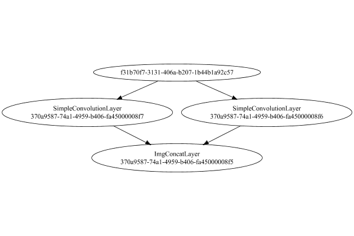

# PipelineNetwork
## AsymmetricExplodedTest
### Json Serialization
Code from [LayerTestBase.java:83](../../../../../../../../../../MindsEye/src/test/java/com/simiacryptus/mindseye/layers/LayerTestBase.java#L83) executed in 0.00 seconds: 
```java
    JsonObject json = layer.getJson();
    NNLayer echo = NNLayer.fromJson(json);
    assert (echo != null) : "Failed to deserialize";
    assert (layer != echo) : "Serialization did not copy";
    Assert.assertEquals("Serialization not equal", layer, echo);
    return new GsonBuilder().setPrettyPrinting().create().toJson(json);
```

Returns: 

```
    {
      "class": "com.simiacryptus.mindseye.network.PipelineNetwork",
      "id": "370a9587-74a1-4959-b406-fa45000008f4",
      "isFrozen": false,
      "name": "PipelineNetwork/370a9587-74a1-4959-b406-fa45000008f4",
      "inputs": [
        "f31b70f7-3131-406a-b207-1b44b1a92c57"
      ],
      "nodes": {
        "b3e9347d-1c6f-424c-84d5-a4cdf8b9910d": "370a9587-74a1-4959-b406-fa45000008f6",
        "a842eecc-5639-4df1-8bef-21d36a1d974f": "370a9587-74a1-4959-b406-fa45000008f7",
        "c6f4f59a-723a-4014-b293-38b2166517b0": "370a9587-74a1-4959-b406-fa45000008f5"
      },
      "layers": {
        "370a9587-74a1-4959-b406-fa45000008f6": {
          "class": "com.simiacryptus.mindseye.layers.cudnn.f64.SimpleConvolutionLayer",
          "id": "370a9587-74a1-4959-b406-fa45000008f6",
          "isFrozen": false,
          "name": "SimpleConvolutionLayer/370a9587-74a1-4959-b406-fa45000008f6",
          "filter": {
            "dimensions": [
              1,
              1,
              4
            ],
            "data": [
              -0.068,
              1.32,
              -0.528,
              0.408
            ]
          },
          "strideX": 1,
          "strideY": 1,
          "simple": false
        },
        "370a9587-74a1-4959-b406-fa45000008f7": {
          "class": "com.simiacryptus.mindseye.layers.cudnn.f64.SimpleConvolutionLayer",
          "id": "370a9587-74a1-4959-b406-fa45000008f7",
          "isFrozen": false,
          "name": "SimpleConvolutionLayer/370a9587-74a1-4959-b406-fa45000008f7",
          "filter": {
            "dimensions": [
              1,
              1,
              4
            ],
            "data": [
              -1.556,
              -0.44,
              0.892,
              -0.86
            ]
          },
          "strideX": 1,
          "strideY": 1,
          "simple": false
        },
        "370a9587-74a1-4959-b406-fa45000008f5": {
          "class": "com.simiacryptus.mindseye.layers.cudnn.f64.ImgConcatLayer",
          "id": "370a9587-74a1-4959-b406-fa45000008f5",
          "isFrozen": false,
          "name": "ImgConcatLayer/370a9587-74a1-4959-b406-fa45000008f5",
          "maxBands": 3
        }
      },
      "links": {
        "b3e9347d-1c6f-424c-84d5-a4cdf8b9910d": [
          "f31b70f7-3131-406a-b207-1b44b1a92c57"
        ],
        "a842eecc-5639-4df1-8bef-21d36a1d974f": [
          "f31b70f7-3131-406a-b207-1b44b1a92c57"
        ],
        "c6f4f59a-723a-4014-b293-38b2166517b0": [
          "b3e9347d-1c6f-424c-84d5-a4cdf8b9910d",
          "a842eecc-5639-4df1-8bef-21d36a1d974f"
        ]
      },
      "labels": {},
      "head": "c6f4f59a-723a-4014-b293-38b2166517b0"
    }
```


### Network Diagram
Code from [LayerTestBase.java:94](../../../../../../../../../../MindsEye/src/test/java/com/simiacryptus/mindseye/layers/LayerTestBase.java#L94) executed in 0.14 seconds: 
```java
    return Graphviz.fromGraph(toGraph((DAGNetwork) layer))
      .height(400).width(600).render(Format.PNG).toImage();
```

Returns: 




### Example Input/Output Pair
Code from [LayerTestBase.java:120](../../../../../../../../../../MindsEye/src/test/java/com/simiacryptus/mindseye/layers/LayerTestBase.java#L120) executed in 0.00 seconds: 
```java
    SimpleEval eval = SimpleEval.run(layer, inputPrototype);
    return String.format("--------------------\nInput: \n[%s]\n--------------------\nOutput: \n%s",
      Arrays.stream(inputPrototype).map(t->t.prettyPrint()).reduce((a,b)->a+",\n"+b).get(),
      eval.getOutput().prettyPrint());
```

Returns: 

```
    --------------------
    Input: 
    [[
    	[ [ -0.284, 0.02 ] ]
    ]]
    --------------------
    Output: 
    [
    	[ [ 0.045712, 0.158112, 0.433104 ] ]
    ]
```


### Batch Execution
Code from [LayerTestBase.java:138](../../../../../../../../../../MindsEye/src/test/java/com/simiacryptus/mindseye/layers/LayerTestBase.java#L138) executed in 0.04 seconds: 
```java
    BatchingTester batchingTester = getBatchingTester();
    return batchingTester==null?null:batchingTester.test(layer, inputPrototype);
```

Returns: 

```
    ToleranceStatistics{absoluteTol=0.0000e+00 +- 0.0000e+00 [0.0000e+00 - 0.0000e+00] (50#), relativeTol=0.0000e+00 +- 0.0000e+00 [0.0000e+00 - 0.0000e+00] (50#)}
```


### Differential Validation
Code from [LayerTestBase.java:144](../../../../../../../../../../MindsEye/src/test/java/com/simiacryptus/mindseye/layers/LayerTestBase.java#L144) executed in 0.07 seconds: 
```java
    return getDerivativeTester().test(layer, inputPrototype);
```
Logging: 
```
    Inputs: [
    	[ [ -0.284, 0.02 ] ]
    ]
    Inputs Statistics: {meanExponent=-1.1228258321444906, negative=1, min=0.02, max=0.02, mean=-0.13199999999999998, count=2.0, positive=1, stdDev=0.152, zeros=0}
    Output: [
    	[ [ 0.045712, 0.158112, 0.433104 ] ]
    ]
    Outputs Statistics: {meanExponent=-0.8348042500029207, negative=0, min=0.433104, max=0.433104, mean=0.21230933333333332, count=3.0, positive=3, stdDev=0.16272912794238437, zeros=0}
    Feedback for input 0
    Inputs Values: [
    	[ [ -0.284, 0.02 ] ]
    ]
    Value Statistics: {meanExponent=-1.1228258321444906, negative=1, min=0.02, max=0.02, mean=-0.13199999999999998, count=2.0, positive=1, stdDev=0.152, zeros=0}
    Implemented Feedback: [ [ -0.068, -0.528, -1.556 ], [ 1.32, 0.408, -0.44 ] ]
    Implemented Statistics: {meanExponent=-0.3130268002207273, negative=4, min=-0.44, max=-0.44, mean=-0.14400000000000002, count=6.0, positive=2, stdDev=0.8834206246177412, zeros=0}
    Measured Feedback: [ [ -0.0680000000000125, -0.5279999999999174, -1.5559999999997798 ], [ 1.3200000000000016, 0.40800000000007497, -0.44000000000044004 ] ]
    Measured Statistics: {meanExponent=-0.3130268002206498, negative=4, min=-0.44000000000044004, max=-0.44000000000044004, mean=-0.1440000000000122, count=6.0, positive=2, stdDev=0.8834206246177092, zeros=0}
    Feedback Error: [ [ -1.2490009027033011E-14, 8.260059303211165E-14, 2.2026824808563106E-13 ], [ 1.5543122344752192E-15, 7.499556531342932E-14, -4.400368958101808E-13 ] ]
    Error Statistics: {meanExponent=-13.32223987396148, negative=2, min=-4.400368958101808E-13, max=-4.400368958101808E-13, mean=-1.2184697695261093E-14, count=6.0, positive=4, stdDev=2.0569612645817236E-13, zeros=0}
    Learning Gradient for weight set 0
    Weights: [ -0.068, 1.32, -0.528, 0.408 ]
    Implemented Gradient: [ [ -0.284, 0.0, 0.0 ], [ 0.02, 0.0, 0.0 ], [ 0.0, -0.284, 0.0 ], [ 0.0, 0.02, 0.0 ] ]
    Implemented Statistics: {meanExponent=-1.1228258321444906, negative=2, min=0.0, max=0.0, mean=-0.04399999999999999, count=12.0, positive=2, stdDev=0.10757942802103632, zeros=8}
    Measured Gradient: [ [ -0.2840000000000481, 0.0, 0.0 ], [ 0.019999999999950613, 0.0, 0.0 ], [ 0.0, -0.2840000000001175, 0.0 ], [ 0.0, 0.020000000000020002, 0.0 ] ]
    Measured Statistics: {meanExponent=-1.1228258321445868, negative=2, min=0.0, max=0.0, mean=-0.04400000000001625, count=12.0, positive=2, stdDev=0.10757942802106563, zeros=8}
    Gradient Error: [ [ -4.8128168117500536E-14, 0.0, 0.0 ], [ -4.93875773610597E-14, 0.0, 0.0 ], [ 0.0, -1.1751710715657282E-13, 0.0 ], [ 0.0, 2.0001361678012586E-14, 0.0 ] ]
    Error Statistics: {meanExponent=-13.313205572530618, negative=3, min=0.0, max=0.0, mean=-1.6252624246426706E-14, count=12.0, positive=1, stdDev=3.628131379537164E-14, zeros=8}
    Learning Gradient for weight set 1
    Weights: [ -1.556, -0.44, 0.892, -0.86 ]
    Implemented Gradient: [ [ 0.0, 0.0, -0.284 ], [ 0.0, 0.0, 0.02 ], [ 0.0, 0.0, 0.0 ], [ 0.0, 0.0, 0.0 ] ]
    Implemented Statistics: {meanExponent=-1.1228258321444906, negative=1, min=0.0, max=0.0, mean=-0.021999999999999995, count=12.0, positive=1, stdDev=0.07918754110759259, zeros=10}
    Measured Gradient: [ [ 0.0, 0.0, -0.28399999999983994 ], [ 0.0, 0.0, 0.01999999999946489 ], [ 0.0, 0.0, 0.0 ], [ 0.0, 0.0, 0.0 ] ]
    Measured Statistics: {meanExponent=-1.1228258321504228, negative=1, min=0.0, max=0.0, mean=-0.022000000000031255, count=12.0, positive=1, stdDev=0.07918754110752481, zeros=10}
    Gradient Error: [ [ 0.0, 0.0, 1.6003864899971632E-13 ], [ 0.0, 0.0, -5.351101506345657E-13 ], [ 0.0, 0.0, 0.0 ], [ 0.0, 0.0, 0.0 ] ]
    Error Statistics: {meanExponent=-12.533665967088377, negative=1, min=0.0, max=0.0, mean=-3.125595846957078E-14, count=12.0, positive=1, stdDev=1.5817501467456432E-13, zeros=10}
    Finite-Difference Derivative Accuracy:
    absoluteTol: 5.8738e-14 +- 1.2678e-13 [0.0000e+00 - 5.3511e-13] (30#)
    relativeTol: 1.3766e-12 +- 3.6332e-12 [5.8875e-16 - 1.3378e-11] (12#)
    
```

Returns: 

```
    ToleranceStatistics{absoluteTol=5.8738e-14 +- 1.2678e-13 [0.0000e+00 - 5.3511e-13] (30#), relativeTol=1.3766e-12 +- 3.6332e-12 [5.8875e-16 - 1.3378e-11] (12#)}
```


### Performance
Code from [LayerTestBase.java:149](../../../../../../../../../../MindsEye/src/test/java/com/simiacryptus/mindseye/layers/LayerTestBase.java#L149) executed in 0.57 seconds: 
```java
    getPerformanceTester().test(layer, inputPrototype);
```
Logging: 
```
    Evaluation performance: 16.8609 +- 1.7539 [15.2350 - 23.7843]
    Learning performance: 22.3575 +- 115.4172 [9.0481 - 1170.5792]
    
```

