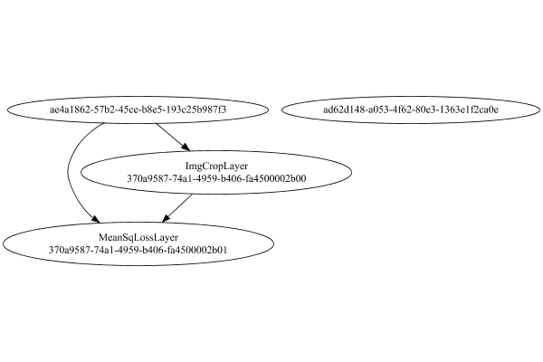

# PipelineNetwork
## Debug
### Json Serialization
Code from [LayerTestBase.java:83](../../../../../../../../../../MindsEye/src/test/java/com/simiacryptus/mindseye/layers/LayerTestBase.java#L83) executed in 0.00 seconds: 
```java
    JsonObject json = layer.getJson();
    NNLayer echo = NNLayer.fromJson(json);
    assert (echo != null) : "Failed to deserialize";
    assert (layer != echo) : "Serialization did not copy";
    Assert.assertEquals("Serialization not equal", layer, echo);
    return new GsonBuilder().setPrettyPrinting().create().toJson(json);
```

Returns: 

```
    {
      "class": "com.simiacryptus.mindseye.network.PipelineNetwork",
      "id": "370a9587-74a1-4959-b406-fa4500002aff",
      "isFrozen": false,
      "name": "PipelineNetwork/370a9587-74a1-4959-b406-fa4500002aff",
      "inputs": [
        "ae4a1862-57b2-45ce-b8e5-193c25b987f3",
        "ad62d148-a053-4f62-80e3-1363e1f2ca0e"
      ],
      "nodes": {
        "bd841ae6-c4e2-4e54-b370-afe3aeabb7cf": "370a9587-74a1-4959-b406-fa4500002b00",
        "ac8a2eb3-8e2d-4989-b6ac-aef914e32395": "370a9587-74a1-4959-b406-fa4500002b01"
      },
      "layers": {
        "370a9587-74a1-4959-b406-fa4500002b00": {
          "class": "com.simiacryptus.mindseye.layers.java.ImgCropLayer",
          "id": "370a9587-74a1-4959-b406-fa4500002b00",
          "isFrozen": false,
          "name": "ImgCropLayer/370a9587-74a1-4959-b406-fa4500002b00",
          "sizeX": 4,
          "sizeY": 4
        },
        "370a9587-74a1-4959-b406-fa4500002b01": {
          "class": "com.simiacryptus.mindseye.layers.java.MeanSqLossLayer",
          "id": "370a9587-74a1-4959-b406-fa4500002b01",
          "isFrozen": false,
          "name": "MeanSqLossLayer/370a9587-74a1-4959-b406-fa4500002b01"
        }
      },
      "links": {
        "bd841ae6-c4e2-4e54-b370-afe3aeabb7cf": [
          "ae4a1862-57b2-45ce-b8e5-193c25b987f3"
        ],
        "ac8a2eb3-8e2d-4989-b6ac-aef914e32395": [
          "bd841ae6-c4e2-4e54-b370-afe3aeabb7cf",
          "ae4a1862-57b2-45ce-b8e5-193c25b987f3"
        ]
      },
      "labels": {},
      "head": "ac8a2eb3-8e2d-4989-b6ac-aef914e32395"
    }
```


### Network Diagram
Code from [LayerTestBase.java:94](../../../../../../../../../../MindsEye/src/test/java/com/simiacryptus/mindseye/layers/LayerTestBase.java#L94) executed in 0.13 seconds: 
```java
    return Graphviz.fromGraph(toGraph((DAGNetwork) layer))
      .height(400).width(600).render(Format.PNG).toImage();
```

Returns: 




### Example Input/Output Pair
Code from [LayerTestBase.java:120](../../../../../../../../../../MindsEye/src/test/java/com/simiacryptus/mindseye/layers/LayerTestBase.java#L120) executed in 0.00 seconds: 
```java
    SimpleEval eval = SimpleEval.run(layer, inputPrototype);
    return String.format("--------------------\nInput: \n[%s]\n--------------------\nOutput: \n%s",
      Arrays.stream(inputPrototype).map(t->t.prettyPrint()).reduce((a,b)->a+",\n"+b).get(),
      eval.getOutput().prettyPrint());
```

Returns: 

```
    --------------------
    Input: 
    [[
    	[ [ 0.32, -0.396, 1.564 ], [ 0.944, 0.688, 0.8 ], [ 0.544, -1.648, 1.868 ], [ 0.32, -0.032, -0.4 ] ],
    	[ [ 1.96, 0.064, -0.22 ], [ -0.032, 0.348, -0.4 ], [ -1.924, 1.908, 0.816 ], [ 1.212, 1.784, -1.56 ] ],
    	[ [ 1.656, 0.548, 1.744 ], [ 1.88, 0.44, 0.972 ], [ -1.712, 1.352, -0.892 ], [ -0.268, 1.164, 1.516 ] ],
    	[ [ 0.312, 0.608, 0.532 ], [ -1.984, -0.644, 1.16 ], [ -0.468, -0.48, -0.672 ], [ 1.088, 1.148, 0.068 ] ]
    ],
    [
    	[ [ -0.8, 0.788, 1.616 ], [ 0.172, -1.848, -1.928 ], [ -1.952, 1.292, -1.332 ], [ -0.78, 0.996, -1.66 ], [ 0.024, 1.564, -1.376 ] ],
    	[ [ -1.092, -1.144, 0.688 ], [ 0.848, -1.78, 1.392 ], [ -1.152, 1.832, -1.216 ], [ 0.808, -0.316, -1.412 ], [ 1.9, -1.884, -1.944 ] ],
    	[ [ 1.716, 0.248, 0.112 ], [ -0.556, 0.344, 0.196 ], [ -1.84, 1.232, 0.976 ], [ -1.932, 0.924, -1.3 ], [ -0.068, 0.912, 1.344 ] ],
    	[ [ 1.004, 1.056, -0.716 ], [ -0.58, -1.936, 1.1 ], [ 1.228, -0.932, 1.86 ], [ 1.064, 0.444, -1.668 ], [ 1.792, -0.496, 0.156 ] ],
    	[ [ -0.244, 1.34, -1.016 ], [ -1.036, -1.864, 0.664 ], [ -1.904, 0.332, -0.584 ], [ 0.388, -0.216, 1.668 ], [ 0.076, 0.128, 1.304 ] ]
    ]]
    --------------------
    Output: 
    [ 0.0 ]
```


### Batch Execution
Code from [LayerTestBase.java:138](../../../../../../../../../../MindsEye/src/test/java/com/simiacryptus/mindseye/layers/LayerTestBase.java#L138) executed in 0.00 seconds: 
```java
    BatchingTester batchingTester = getBatchingTester();
    return batchingTester==null?null:batchingTester.test(layer, inputPrototype);
```

Returns: 

```
    ToleranceStatistics{absoluteTol=0.0000e+00 +- 0.0000e+00 [0.0000e+00 - 0.0000e+00] (1240#), relativeTol=0.0000e+00 +- 0.0000e+00 [Infinity - -Infinity] (0#)}
```


### Differential Validation
Code from [LayerTestBase.java:144](../../../../../../../../../../MindsEye/src/test/java/com/simiacryptus/mindseye/layers/LayerTestBase.java#L144) executed in 0.01 seconds: 
```java
    return getDerivativeTester().test(layer, inputPrototype);
```
Logging: 
```
    Inputs: [
    	[ [ 0.32, -0.396, 1.564 ], [ 0.944, 0.688, 0.8 ], [ 0.544, -1.648, 1.868 ], [ 0.32, -0.032, -0.4 ] ],
    	[ [ 1.96, 0.064, -0.22 ], [ -0.032, 0.348, -0.4 ], [ -1.924, 1.908, 0.816 ], [ 1.212, 1.784, -1.56 ] ],
    	[ [ 1.656, 0.548, 1.744 ], [ 1.88, 0.44, 0.972 ], [ -1.712, 1.352, -0.892 ], [ -0.268, 1.164, 1.516 ] ],
    	[ [ 0.312, 0.608, 0.532 ], [ -1.984, -0.644, 1.16 ], [ -0.468, -0.48, -0.672 ], [ 1.088, 1.148, 0.068 ] ]
    ],
    [
    	[ [ -0.8, 0.788, 1.616 ], [ 0.172, -1.848, -1.928 ], [ -1.952, 1.292, -1.332 ], [ -0.78, 0.996, -1.66 ], [ 0.024, 1.564, -1.376 ] ],
    	[ [ -1.092, -1.144, 0.688 ], [ 0.848, -1.78, 1.392 ], [ -1.152, 1.832, -1.216 ], [ 0.808, -0.316, -1.412 ], [ 1.9, -1.884, -1.944 ] ],
    	[ [ 1.716, 0.248, 0.112 ], [ -0.556, 0.344, 0.196 ], [ -1.84, 1.232, 0.976 ], [ -1.932, 0.924, -1.3 ], [ -0.068, 0.912, 1.344 ] ],
    	[ [ 1.004, 1.056, -0.716 ], [ -0.58, -1.936, 1.1 ], [ 1.228, -0.932, 1.86 ], [ 1.064, 0.444, -1.668 ], [ 1.792, -0.496, 0.156 ] ],
    	[ [ -0.244, 1.34, -1.016 ], [ -1.036, -1.864, 0.664 ], [ -1.904, 0.332, -0.584 ], [ 0.388, -0.216, 1.668 ], [ 0.076, 0.128, 1.304 ] ]
    ]
    Inputs Statistics: {meanExponent=-0.18082798545804216, negative=17, min=0.068, max=0.068, mean=0.3665833333333333, count=48.0, positive=31, stdDev=1.0624652118487872, zeros=0},
    {meanExponent=-0.09495854413393984, negative=35, min=1.304, max=1.304, mean=-0.06634666666666666, count=75.0, positive=40, stdDev=1.219697202788007, zeros=0}
    Output: [ 0.0 ]
    Outputs Statistics: {meanExponent=NaN, negative=0, min=0.0, max=0.0, mean=0.0, count=1.0, positive=0, stdDev=0.0, zeros=1}
    Feedback for input 0
    Inputs Values: [
    	[ [ 0.32, -0.396, 1.564 ], [ 0.944, 0.688, 0.8 ], [ 0.544, -1.648, 1.868 ], [ 0.32, -0.032, -0.4 ] ],
    	[ [ 1.96, 0.064, -0.22 ], [ -0.032, 0.348, -0.4 ], [ -1.924, 1.908, 0.816 ], [ 1.212, 1.784, -1.56 ] ],
    	[ [ 1.656, 0.548, 1.744 ], [ 1.88, 0.44, 0.972 ], [ -1.712, 1.352, -0.892 ], [ -0.268, 1.164, 1.516 ] ],
    	[ [ 0.312, 0.608, 0.532 ], [ -1.984, -0.644, 1.16 ], [ -0.468, -0.48, -0.672 ], [ 1.088, 1.148, 0.068 ] ]
    ]
```
...[skipping 557 bytes](etc/1.txt)...
```
    =0, min=0.0, max=0.0, mean=0.0, count=48.0, positive=0, stdDev=0.0, zeros=48}
    Feedback Error: [ [ 0.0 ], [ 0.0 ], [ 0.0 ], [ 0.0 ], [ 0.0 ], [ 0.0 ], [ 0.0 ], [ 0.0 ], ... ]
    Error Statistics: {meanExponent=NaN, negative=0, min=0.0, max=0.0, mean=0.0, count=48.0, positive=0, stdDev=0.0, zeros=48}
    Feedback for input 1
    Inputs Values: [
    	[ [ -0.8, 0.788, 1.616 ], [ 0.172, -1.848, -1.928 ], [ -1.952, 1.292, -1.332 ], [ -0.78, 0.996, -1.66 ], [ 0.024, 1.564, -1.376 ] ],
    	[ [ -1.092, -1.144, 0.688 ], [ 0.848, -1.78, 1.392 ], [ -1.152, 1.832, -1.216 ], [ 0.808, -0.316, -1.412 ], [ 1.9, -1.884, -1.944 ] ],
    	[ [ 1.716, 0.248, 0.112 ], [ -0.556, 0.344, 0.196 ], [ -1.84, 1.232, 0.976 ], [ -1.932, 0.924, -1.3 ], [ -0.068, 0.912, 1.344 ] ],
    	[ [ 1.004, 1.056, -0.716 ], [ -0.58, -1.936, 1.1 ], [ 1.228, -0.932, 1.86 ], [ 1.064, 0.444, -1.668 ], [ 1.792, -0.496, 0.156 ] ],
    	[ [ -0.244, 1.34, -1.016 ], [ -1.036, -1.864, 0.664 ], [ -1.904, 0.332, -0.584 ], [ 0.388, -0.216, 1.668 ], [ 0.076, 0.128, 1.304 ] ]
    ]
    Value Statistics: {meanExponent=-0.09495854413393984, negative=35, min=1.304, max=1.304, mean=-0.06634666666666666, count=75.0, positive=40, stdDev=1.219697202788007, zeros=0}
    Implemented Feedback: [ [ 0.0 ], [ 0.0 ], [ 0.0 ], [ 0.0 ], [ 0.0 ], [ 0.0 ], [ 0.0 ], [ 0.0 ], ... ]
    Implemented Statistics: {meanExponent=NaN, negative=0, min=0.0, max=0.0, mean=0.0, count=75.0, positive=0, stdDev=0.0, zeros=75}
    Measured Feedback: [ [ 0.0 ], [ 0.0 ], [ 0.0 ], [ 0.0 ], [ 0.0 ], [ 0.0 ], [ 0.0 ], [ 0.0 ], ... ]
    Measured Statistics: {meanExponent=NaN, negative=0, min=0.0, max=0.0, mean=0.0, count=75.0, positive=0, stdDev=0.0, zeros=75}
    Feedback Error: [ [ 0.0 ], [ 0.0 ], [ 0.0 ], [ 0.0 ], [ 0.0 ], [ 0.0 ], [ 0.0 ], [ 0.0 ], ... ]
    Error Statistics: {meanExponent=NaN, negative=0, min=0.0, max=0.0, mean=0.0, count=75.0, positive=0, stdDev=0.0, zeros=75}
    Finite-Difference Derivative Accuracy:
    absoluteTol: 0.0000e+00 +- 0.0000e+00 [0.0000e+00 - 0.0000e+00] (123#)
    relativeTol: 0.0000e+00 +- 0.0000e+00 [Infinity - -Infinity] (0#)
    
```

Returns: 

```
    ToleranceStatistics{absoluteTol=0.0000e+00 +- 0.0000e+00 [0.0000e+00 - 0.0000e+00] (123#), relativeTol=0.0000e+00 +- 0.0000e+00 [Infinity - -Infinity] (0#)}
```


### Performance
Code from [LayerTestBase.java:149](../../../../../../../../../../MindsEye/src/test/java/com/simiacryptus/mindseye/layers/LayerTestBase.java#L149) executed in 0.01 seconds: 
```java
    getPerformanceTester().test(layer, inputPrototype);
```
Logging: 
```
    Evaluation performance: 0.4727 +- 0.1295 [0.3448 - 1.4448]
    Learning performance: 0.1053 +- 0.0328 [0.0684 - 0.2394]
    
```

