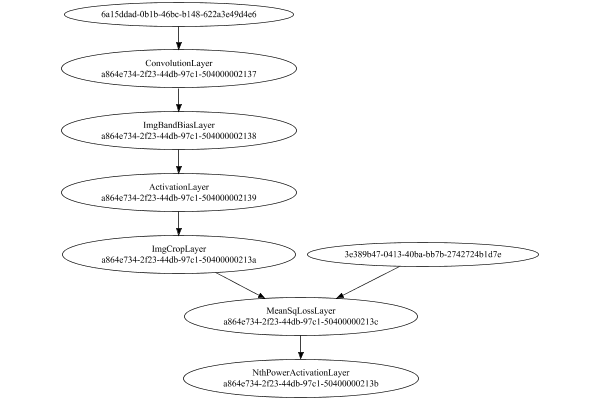

# PipelineNetwork
## ConvolutionNetworkTest
### Json Serialization
Code from [LayerTestBase.java:83](../../../../../../../../../MindsEye/src/test/java/com/simiacryptus/mindseye/layers/LayerTestBase.java#L83) executed in 0.00 seconds: 
```java
    JsonObject json = layer.getJson();
    NNLayer echo = NNLayer.fromJson(json);
    assert (echo != null) : "Failed to deserialize";
    assert (layer != echo) : "Serialization did not copy";
    Assert.assertEquals("Serialization not equal", layer, echo);
    return new GsonBuilder().setPrettyPrinting().create().toJson(json);
```

Returns: 

```
    {
      "class": "com.simiacryptus.mindseye.network.PipelineNetwork",
      "id": "370a9587-74a1-4959-b406-fa4500002136",
      "isFrozen": false,
      "name": "PipelineNetwork/370a9587-74a1-4959-b406-fa4500002136",
      "inputs": [
        "e9203566-70a1-466c-8c44-b27b107be4bc",
        "e0da588a-f8bd-474c-ba02-8813ccd89ed0"
      ],
      "nodes": {
        "ef05c608-6e60-44ac-a278-e94d769143ab": "370a9587-74a1-4959-b406-fa4500002137",
        "ab320000-cc6d-4fad-a654-618808dfd0b8": "370a9587-74a1-4959-b406-fa4500002138",
        "d599f0ba-5da5-400c-85ac-5efbf4e75156": "370a9587-74a1-4959-b406-fa4500002139",
        "ca661639-afa1-4a7e-b90c-25f181615ded": "370a9587-74a1-4959-b406-fa450000213a",
        "dc086f7c-4212-4c0d-86f6-0b3581c29398": "370a9587-74a1-4959-b406-fa450000213c",
        "9630d388-6d4a-45f4-988c-bb84460cfebf": "370a9587-74a1-4959-b406-fa450000213b"
      },
      "layers": {
        "370a9587-74a1-4959-b406-fa4500002137": {
          "class": "com.simiacryptus.mindseye.layers.cudnn.f64.ConvolutionLayer",
          "id": "370a9587-74a1-4959-b406-fa4500002137",
          "isFrozen": false,
          "name": "ConvolutionLayer/370a9587-74a1-4959-b406-fa4500002137",
          "filter": {
            "dimensions": [
              3,
              3,
              21
            ],
            "data": [
              1.968,
              -0.004,
              -0.212,
              0.592,
              -0.64,
              1.464,
              -1.496,
              -0.72,
              0.744,
              -0.856,
              -1.212,
              -1.472,
              0.588,
              -0.672,
              1.524,
              0.936,
              0.672,
              0.832,
              -0.832,
              0.18,
              -0.496,
              0.932,
              1.62,
              1.968,
              -0.816,
              1.48,
              -1.08,
              -0.352,
              1.064,
              -1.992,
              -1.744,
              -0.884,
              -1.112,
              -1.108,
              1.492,
              -1.888,
              -1.392,
              1.912,
              1.336,
              1.02,
              1.812,
              -1.668,
              -1.408,
              1.304,
              1.232,
              0.196,
              0.688,
             
```
...[skipping 2691 bytes](etc/1.txt)...
```
    rozen": false,
          "name": "ImgBandBiasLayer/370a9587-74a1-4959-b406-fa4500002138",
          "bias": [
            0.0,
            0.0,
            0.0
          ]
        },
        "370a9587-74a1-4959-b406-fa4500002139": {
          "class": "com.simiacryptus.mindseye.layers.cudnn.f64.ActivationLayer",
          "id": "370a9587-74a1-4959-b406-fa4500002139",
          "isFrozen": false,
          "name": "ActivationLayer/370a9587-74a1-4959-b406-fa4500002139",
          "mode": 1
        },
        "370a9587-74a1-4959-b406-fa450000213a": {
          "class": "com.simiacryptus.mindseye.layers.java.ImgCropLayer",
          "id": "370a9587-74a1-4959-b406-fa450000213a",
          "isFrozen": false,
          "name": "ImgCropLayer/370a9587-74a1-4959-b406-fa450000213a",
          "sizeX": 4,
          "sizeY": 4
        },
        "370a9587-74a1-4959-b406-fa450000213c": {
          "class": "com.simiacryptus.mindseye.layers.java.MeanSqLossLayer",
          "id": "370a9587-74a1-4959-b406-fa450000213c",
          "isFrozen": false,
          "name": "MeanSqLossLayer/370a9587-74a1-4959-b406-fa450000213c"
        },
        "370a9587-74a1-4959-b406-fa450000213b": {
          "class": "com.simiacryptus.mindseye.layers.java.NthPowerActivationLayer",
          "id": "370a9587-74a1-4959-b406-fa450000213b",
          "isFrozen": false,
          "name": "NthPowerActivationLayer/370a9587-74a1-4959-b406-fa450000213b",
          "power": 0.5
        }
      },
      "links": {
        "ef05c608-6e60-44ac-a278-e94d769143ab": [
          "e0da588a-f8bd-474c-ba02-8813ccd89ed0"
        ],
        "ab320000-cc6d-4fad-a654-618808dfd0b8": [
          "ef05c608-6e60-44ac-a278-e94d769143ab"
        ],
        "d599f0ba-5da5-400c-85ac-5efbf4e75156": [
          "ab320000-cc6d-4fad-a654-618808dfd0b8"
        ],
        "ca661639-afa1-4a7e-b90c-25f181615ded": [
          "d599f0ba-5da5-400c-85ac-5efbf4e75156"
        ],
        "dc086f7c-4212-4c0d-86f6-0b3581c29398": [
          "ca661639-afa1-4a7e-b90c-25f181615ded",
          "e9203566-70a1-466c-8c44-b27b107be4bc"
        ],
        "9630d388-6d4a-45f4-988c-bb84460cfebf": [
          "dc086f7c-4212-4c0d-86f6-0b3581c29398"
        ]
      },
      "labels": {},
      "head": "9630d388-6d4a-45f4-988c-bb84460cfebf"
    }
```


### Network Diagram
Code from [LayerTestBase.java:94](../../../../../../../../../MindsEye/src/test/java/com/simiacryptus/mindseye/layers/LayerTestBase.java#L94) executed in 0.24 seconds: 
```java
    return Graphviz.fromGraph(toGraph((DAGNetwork) layer))
      .height(400).width(600).render(Format.PNG).toImage();
```

Returns: 




### Example Input/Output Pair
Code from [LayerTestBase.java:120](../../../../../../../../../MindsEye/src/test/java/com/simiacryptus/mindseye/layers/LayerTestBase.java#L120) executed in 0.01 seconds: 
```java
    SimpleEval eval = SimpleEval.run(layer, inputPrototype);
    return String.format("--------------------\nInput: \n[%s]\n--------------------\nOutput: \n%s",
      Arrays.stream(inputPrototype).map(t->t.prettyPrint()).reduce((a,b)->a+",\n"+b).get(),
      eval.getOutput().prettyPrint());
```

Returns: 

```
    --------------------
    Input: 
    [[
    	[ [ 0.18, -0.584, -1.624 ], [ 1.688, -0.144, 1.08 ], [ 1.504, 0.784, 1.792 ], [ -0.868, 0.088, -0.12 ] ],
    	[ [ 1.568, -1.616, -1.58 ], [ -0.792, -0.132, -1.2 ], [ 1.96, -1.912, -1.576 ], [ 0.116, 1.452, -1.288 ] ],
    	[ [ 0.748, -1.756, -0.724 ], [ -0.576, -1.748, 1.74 ], [ 0.088, -0.416, -1.332 ], [ 1.456, -0.2, -0.124 ] ],
    	[ [ -1.836, 0.252, -1.756 ], [ 0.52, 1.344, -1.184 ], [ -1.18, -1.876, -1.216 ], [ -1.428, 0.064, -0.736 ] ]
    ],
    [
    	[ [ 0.468, 1.808, -0.416, -0.664, 1.728, -0.532, -1.072 ], [ -0.46, 1.068, -0.536, -0.128, -1.764, -0.548, 0.92 ], [ -0.288, -0.576, -0.004, -0.976, -0.3, 0.58, 0.952 ], [ 1.652, -1.664, 1.372, -0.472, 0.864, 1.812, -0.32 ], [ 1.512, 1.16, 0.284, 0.068, 1.488, -0.672, -0.66 ] ],
    	[ [ -1.384, -0.316, -1.148, 0.936, -0.448, -0.164, 1.668 ], [ 1.42, 1.756, 1.768, -0.932, 0.852, -1.504, -0.372 ], [ 0.368, -1.484, 0.372, 1.124, -1.784, 1.712, 0.928 ], [ -1.7, 0.844, -0.044, 1.56, -1.548, -1.856, 0.444 ], [ 1.572, 0.616, -1.292, 0.56, 0.232, -0.72, -0.248 ] ],
    	[ [ -1.736, 0.708, -0.932, -0.532, -0.384, -0.832, 0.272 ], [ -0.66, -0.6, -0.404, -1.5, 1.18, 0.88, -1.644 ], [ 0.536, 0.476, 0.72, 0.384, 0.496, -1.46, 0.68 ], [ -1.532, 1.548, 1.348, 0.844, 1.656, -0.884, -0.524 ], [ 1.944, 0.836, 1.464, 0.52, -0.664, -1.3, 0.752 ] ],
    	[ [ 0.976, 0.744, 1.456, 0.604, 0.06, 1.488, 0.356 ], [ 0.18, 1.976, -0.24, -1.508, 0.96, -0.628, -0.16 ], [ 1.372, -0.532, -0.116, -1.484, -0.22, -1.828, 1.384 ], [ 0.976, -1.1, -1.136, 1.132, 0.352, 1.364, -1.808 ], [ 1.944, -0.512, -1.888, -1.084, -1.256, 1.116, 1.32 ] ],
    	[ [ -1.796, 0.26, 0.144, -0.156, 0.08, 1.684, -0.888 ], [ -0.952, -0.904, 0.312, 0.084, -1.648, -1.392, 1.696 ], [ 0.752, 0.756, 1.892, 1.232, -0.844, 1.76, -1.992 ], [ 1.044, 1.988, -1.332, -1.344, 1.304, -0.844, 0.364 ], [ -1.392, 1.92, -1.956, -0.812, 0.56, -0.324, -0.412 ] ]
    ]]
    --------------------
    Output: 
    [ 5.37986377566917 ]
```


### Batch Execution
Code from [LayerTestBase.java:138](../../../../../../../../../MindsEye/src/test/java/com/simiacryptus/mindseye/layers/LayerTestBase.java#L138) executed in 0.05 seconds: 
```java
    BatchingTester batchingTester = getBatchingTester();
    return batchingTester==null?null:batchingTester.test(layer, inputPrototype);
```

Returns: 

```
    ToleranceStatistics{absoluteTol=6.1161e-19 +- 4.1014e-18 [0.0000e+00 - 5.5511e-17] (2240#), relativeTol=8.2704e-18 +- 8.6959e-17 [0.0000e+00 - 2.4856e-15] (2226#)}
```


### Differential Validation
Code from [LayerTestBase.java:144](../../../../../../../../../MindsEye/src/test/java/com/simiacryptus/mindseye/layers/LayerTestBase.java#L144) executed in 1.28 seconds: 
```java
    return getDerivativeTester().test(layer, inputPrototype);
```
Logging: 
```
    Inputs: [
    	[ [ 0.18, -0.584, -1.624 ], [ 1.688, -0.144, 1.08 ], [ 1.504, 0.784, 1.792 ], [ -0.868, 0.088, -0.12 ] ],
    	[ [ 1.568, -1.616, -1.58 ], [ -0.792, -0.132, -1.2 ], [ 1.96, -1.912, -1.576 ], [ 0.116, 1.452, -1.288 ] ],
    	[ [ 0.748, -1.756, -0.724 ], [ -0.576, -1.748, 1.74 ], [ 0.088, -0.416, -1.332 ], [ 1.456, -0.2, -0.124 ] ],
    	[ [ -1.836, 0.252, -1.756 ], [ 0.52, 1.344, -1.184 ], [ -1.18, -1.876, -1.216 ], [ -1.428, 0.064, -0.736 ] ]
    ],
    [
    	[ [ 0.468, 1.808, -0.416, -0.664, 1.728, -0.532, -1.072 ], [ -0.46, 1.068, -0.536, -0.128, -1.764, -0.548, 0.92 ], [ -0.288, -0.576, -0.004, -0.976, -0.3, 0.58, 0.952 ], [ 1.652, -1.664, 1.372, -0.472, 0.864, 1.812, -0.32 ], [ 1.512, 1.16, 0.284, 0.068, 1.488, -0.672, -0.66 ] ],
    	[ [ -1.384, -0.316, -1.148, 0.936, -0.448, -0.164, 1.668 ], [ 1.42, 1.756, 1.768, -0.932, 0.852, -1.504, -0.372 ], [ 0.368, -1.484, 0.372, 1.124, -1.784, 1.712, 0.928 ], [ -1.7, 0.844, -0.044, 1.56, -1.548, -1.856, 0.444 ], [ 1.572, 0.616, -1.292, 0.56, 0.232, -0.72, -0.248 ] ],
    	[ [ -1.736, 0.708, -0.932, -0.532, -0.384, -0.832, 0.272 ], [ -0.66, -0.6, -0.404, -1.5, 1.18, 0.88, -1.644 ], [ 0.536, 0.476, 0.72, 0.384, 0.496, -1.46, 0.68 ], [ -1.532, 1.548, 1.348, 0.844, 1.656, -0.884, -0.524 ], [ 1.944, 0.836, 1.464, 0.52, -0.664, -1.3, 0.752 ] ],
    	[ [ 0.976, 0.744, 1.456, 0.604, 0.06, 1.488, 0.356 ], [ 0.18, 1.976, -0.24, -1.508, 0.96, -0.628, -0.16 ], [ 1.372, -0.532, -0.116, -1.484, -0.22, -1.828, 1.384 ], [ 0.976, -1.1, -1.136, 1.132, 0.352, 1.364, -1.808 ], [ 1.944, -0.512, -1.888, -1.084, -1.256, 1.116, 1.32 ] ],
    	[ [ -1.796, 0.26, 0.144, -0.156, 0.08, 1.684, -0.888 ], [ -0.952, -0.904, 0.312, 0.084, -1.648, -1.392, 1.696 ], [ 0.752, 0.756, 1.892, 1.232, -0.844, 1.76, -1.992 ], [ 1.044, 1.988, -1.332, -1.344, 1.304, -0.844, 0.364 ], [ -1.392, 1.92, -1.956, -0.812, 0.56, -0.324, -0.412 ] ]
    ]
    Inputs Statistics: {meanExponent=-0.1395866939304893, negative=29, min=-0.736, max=-0.736, mean=-0.27291666666666664, count=48.0, positive=19, stdDev=1.1852651572772885, zeros=0},
    {meanExponent=-0.1262
```
...[skipping 5879 bytes](etc/2.txt)...
```
    0}
    Measured Gradient: [ [ 0.0317761233681324 ], [ 0.0176120662676027 ], [ 0.05477294311440062 ], [ -0.05493370919928964 ], [ 0.07735878848613709 ], [ 0.003377421249339818 ], [ 0.0039061533652073877 ], [ 0.016679650123307965 ], ... ]
    Measured Statistics: {meanExponent=-1.4980395907194473, negative=81, min=-0.01453561123909708, max=-0.01453561123909708, mean=0.011453104116268997, count=189.0, positive=108, stdDev=0.08285599134817824, zeros=0}
    Gradient Error: [ [ 1.6784265277278165E-6 ], [ 1.0959374945399003E-6 ], [ 5.267570710801306E-7 ], [ 9.643024087013785E-7 ], [ 6.257728874387025E-7 ], [ 4.063735792587779E-7 ], [ 2.948634178902114E-7 ], [ 9.8741457195059E-7 ], ... ]
    Error Statistics: {meanExponent=-5.985611943632919, negative=0, min=1.1870754549180712E-6, max=1.1870754549180712E-6, mean=1.3042068084718866E-6, count=189.0, positive=189, stdDev=7.935518799868284E-7, zeros=0}
    Learning Gradient for weight set 1
    Weights: [ 0.0, 0.0, 0.0 ]
    Implemented Gradient: [ [ 0.08290686999991705 ], [ 0.12052665774410753 ], [ 0.33739069903758445 ] ]
    Implemented Statistics: {meanExponent=-0.8240644203071487, negative=0, min=0.33739069903758445, max=0.33739069903758445, mean=0.18027474226053633, count=3.0, positive=3, stdDev=0.1121542985146057, zeros=0}
    Measured Gradient: [ [ 0.08290758061413328 ], [ 0.12052807171869517 ], [ 0.3373915773163816 ] ]
    Measured Statistics: {meanExponent=-0.8240611043370936, negative=0, min=0.3373915773163816, max=0.3373915773163816, mean=0.18027574321640336, count=3.0, positive=3, stdDev=0.11215425190761762, zeros=0}
    Gradient Error: [ [ 7.106142162344176E-7 ], [ 1.413974587638478E-6 ], [ 8.7827879713398E-7 ] ]
    Error Statistics: {meanExponent=-6.018097368594258, negative=0, min=8.7827879713398E-7, max=8.7827879713398E-7, mean=1.0009558670022918E-6, count=3.0, positive=3, stdDev=2.9996244278133745E-7, zeros=0}
    Finite-Difference Derivative Accuracy:
    absoluteTol: 1.2942e-06 +- 1.0449e-06 [6.1739e-09 - 5.0059e-06] (415#)
    relativeTol: 4.1717e-05 +- 1.5539e-04 [4.3275e-07 - 2.1373e-03] (415#)
    
```

Returns: 

```
    ToleranceStatistics{absoluteTol=1.2942e-06 +- 1.0449e-06 [6.1739e-09 - 5.0059e-06] (415#), relativeTol=4.1717e-05 +- 1.5539e-04 [4.3275e-07 - 2.1373e-03] (415#)}
```


### Performance
Code from [LayerTestBase.java:149](../../../../../../../../../MindsEye/src/test/java/com/simiacryptus/mindseye/layers/LayerTestBase.java#L149) executed in 0.69 seconds: 
```java
    getPerformanceTester().test(layer, inputPrototype);
```
Logging: 
```
    Evaluation performance: 32.0037 +- 22.7142 [21.8465 - 230.0236]
    Learning performance: 10.7146 +- 0.9008 [9.2903 - 14.3173]
    
```

