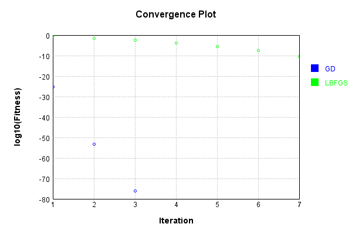
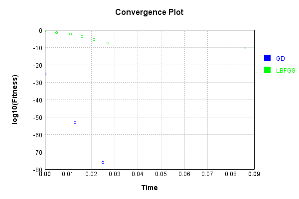
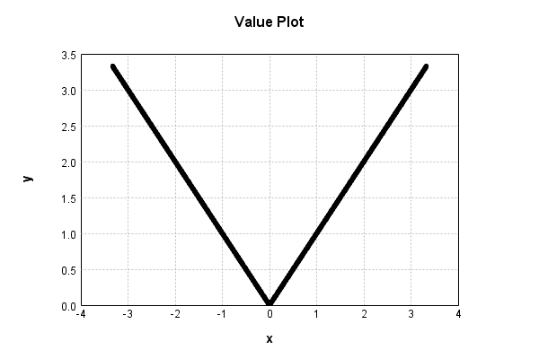

# AbsActivationLayer
## AbsActivationLayerTest
### Json Serialization
Code from [JsonTest.java:36](../../../../../../../src/main/java/com/simiacryptus/mindseye/test/unit/JsonTest.java#L36) executed in 0.00 seconds: 
```java
    JsonObject json = layer.getJson();
    NNLayer echo = NNLayer.fromJson(json);
    if ((echo == null)) throw new AssertionError("Failed to deserialize");
    if ((layer == echo)) throw new AssertionError("Serialization did not copy");
    if ((!layer.equals(echo))) throw new AssertionError("Serialization not equal");
    return new GsonBuilder().setPrettyPrinting().create().toJson(json);
```

Returns: 

```
    {
      "class": "com.simiacryptus.mindseye.layers.java.AbsActivationLayer",
      "id": "67cb2ac4-119b-438b-bf51-f8541f007216",
      "isFrozen": true,
      "name": "AbsActivationLayer/67cb2ac4-119b-438b-bf51-f8541f007216"
    }
```


### Example Input/Output Pair
Code from [ReferenceIO.java:68](../../../../../../../src/main/java/com/simiacryptus/mindseye/test/unit/ReferenceIO.java#L68) executed in 0.00 seconds: 
```java
    SimpleEval eval = SimpleEval.run(layer, inputPrototype);
    return String.format("--------------------\nInput: \n[%s]\n--------------------\nOutput: \n%s\n--------------------\nDerivative: \n%s",
      Arrays.stream(inputPrototype).map(t -> t.prettyPrint()).reduce((a, b) -> a + ",\n" + b).get(),
      eval.getOutput().prettyPrint(),
      Arrays.stream(eval.getDerivative()).map(t -> t.prettyPrint()).reduce((a, b) -> a + ",\n" + b).get());
```

Returns: 

```
    --------------------
    Input: 
    [[
    	[ [ 0.112 ], [ 1.856 ], [ 1.54 ] ],
    	[ [ -0.156 ], [ 0.444 ], [ -1.336 ] ]
    ]]
    --------------------
    Output: 
    [
    	[ [ 0.112 ], [ 1.856 ], [ 1.54 ] ],
    	[ [ 0.156 ], [ 0.444 ], [ 1.336 ] ]
    ]
    --------------------
    Derivative: 
    [
    	[ [ 1.0 ], [ 1.0 ], [ 1.0 ] ],
    	[ [ -1.0 ], [ 1.0 ], [ -1.0 ] ]
    ]
```


### Batch Execution
Code from [BatchingTester.java:66](../../../../../../../src/main/java/com/simiacryptus/mindseye/test/unit/BatchingTester.java#L66) executed in 0.00 seconds: 
```java
    return test(reference, inputPrototype);
```

Returns: 

```
    ToleranceStatistics{absoluteTol=0.0000e+00 +- 0.0000e+00 [0.0000e+00 - 0.0000e+00] (120#), relativeTol=0.0000e+00 +- 0.0000e+00 [0.0000e+00 - 0.0000e+00] (120#)}
```


Code from [SingleDerivativeTester.java:77](../../../../../../../src/main/java/com/simiacryptus/mindseye/test/unit/SingleDerivativeTester.java#L77) executed in 0.00 seconds: 
```java
    return test(component, inputPrototype);
```
Logging: 
```
    Inputs: [
    	[ [ -1.144 ], [ -0.168 ], [ -0.496 ] ],
    	[ [ -1.808 ], [ -1.348 ], [ 1.216 ] ]
    ]
    Inputs Statistics: {meanExponent=-0.0914935206752621, negative=5, min=1.216, max=1.216, mean=-0.6246666666666667, count=6.0, positive=1, stdDev=0.9837300894497886, zeros=0}
    Output: [
    	[ [ 1.144 ], [ 0.168 ], [ 0.496 ] ],
    	[ [ 1.808 ], [ 1.348 ], [ 1.216 ] ]
    ]
    Outputs Statistics: {meanExponent=-0.0914935206752621, negative=0, min=1.216, max=1.216, mean=1.03, count=6.0, positive=6, stdDev=0.5450076452063158, zeros=0}
    Feedback for input 0
    Inputs Values: [
    	[ [ -1.144 ], [ -0.168 ], [ -0.496 ] ],
    	[ [ -1.808 ], [ -1.348 ], [ 1.216 ] ]
    ]
    Value Statistics: {meanExponent=-0.0914935206752621, negative=5, min=1.216, max=1.216, mean=-0.6246666666666667, count=6.0, positive=1, stdDev=0.9837300894497886, zeros=0}
    Implemented Feedback: [ [ -1.0, 0.0, 0.0, 0.0, 0.0, 0.0 ], [ 0.0, -1.0, 0.0, 0.0, 0.0, 0.0 ], [ 0.0, 0.0, -1.0, 0.0, 0.0, 0.0 ], [ 0.0, 0.0, 0.0, -1.0, 0.0, 0.0 ], [ 0.0, 0.0, 0.0, 0.0, -1.0, 0.0 ], [ 0.0, 0.0, 0.0
```
...[skipping 427 bytes](etc/224.txt)...
```
    .9999999999998899, 0.0 ], [ 0.0, 0.0, 0.0, 0.0, 0.0, 0.9999999999998899 ] ]
    Measured Statistics: {meanExponent=-4.7830642341045674E-14, negative=5, min=0.9999999999998899, max=0.9999999999998899, mean=-0.11111111111109888, count=36.0, positive=1, stdDev=0.39283710065914984, zeros=30}
    Feedback Error: [ [ 1.1013412404281553E-13, 0.0, 0.0, 0.0, 0.0, 0.0 ], [ 0.0, 1.1013412404281553E-13, 0.0, 0.0, 0.0, 0.0 ], [ 0.0, 0.0, 1.1013412404281553E-13, 0.0, 0.0, 0.0 ], [ 0.0, 0.0, 0.0, 1.1013412404281553E-13, 0.0, 0.0 ], [ 0.0, 0.0, 0.0, 0.0, 1.1013412404281553E-13, 0.0 ], [ 0.0, 0.0, 0.0, 0.0, 0.0, -1.1013412404281553E-13 ] ]
    Error Statistics: {meanExponent=-12.958078098036824, negative=1, min=-1.1013412404281553E-13, max=-1.1013412404281553E-13, mean=1.223712489364617E-14, count=36.0, positive=5, stdDev=4.3264769972619575E-14, zeros=30}
    Finite-Difference Derivative Accuracy:
    absoluteTol: 1.8356e-14 +- 4.1045e-14 [0.0000e+00 - 1.1013e-13] (36#)
    relativeTol: 5.5067e-14 +- 0.0000e+00 [5.5067e-14 - 5.5067e-14] (6#)
    
```

Returns: 

```
    ToleranceStatistics{absoluteTol=1.8356e-14 +- 4.1045e-14 [0.0000e+00 - 1.1013e-13] (36#), relativeTol=5.5067e-14 +- 0.0000e+00 [5.5067e-14 - 5.5067e-14] (6#)}
```


### Performance
Now we execute larger-scale runs to benchmark performance:

Code from [PerformanceTester.java:66](../../../../../../../src/main/java/com/simiacryptus/mindseye/test/unit/PerformanceTester.java#L66) executed in 0.25 seconds: 
```java
    test(component, inputPrototype);
```
Logging: 
```
    100 batches
    Input Dimensions:
    	[100, 100, 1]
    Performance:
    	Evaluation performance: 0.012445s +- 0.017241s [0.003107s - 0.046900s]
    	Learning performance: 0.030618s +- 0.019072s [0.012826s - 0.066662s]
    
```

### Input Learning
In this test, we use a network to learn this target input, given it's pre-evaluated output:

Code from [LearningTester.java:127](../../../../../../../src/main/java/com/simiacryptus/mindseye/test/unit/LearningTester.java#L127) executed in 0.00 seconds: 
```java
    return Arrays.stream(input_target).map(x -> x.prettyPrint()).reduce((a, b) -> a + "\n" + b).orElse("");
```

Returns: 

```
    [
    	[ [ -0.024 ], [ 0.02 ], [ -0.576 ], [ -1.608 ], [ 1.428 ], [ 1.912 ], [ -1.604 ], [ -0.648 ], ... ],
    	[ [ -0.064 ], [ -0.844 ], [ -1.756 ], [ 1.504 ], [ -1.924 ], [ 1.312 ], [ 0.944 ], [ 0.748 ], ... ],
    	[ [ 0.54 ], [ 1.368 ], [ -1.556 ], [ -0.628 ], [ 0.288 ], [ -0.62 ], [ 1.468 ], [ -1.588 ], ... ],
    	[ [ -1.476 ], [ 1.828 ], [ 1.02 ], [ 1.436 ], [ -0.108 ], [ -0.008 ], [ 0.324 ], [ -0.8 ], ... ],
    	[ [ -0.328 ], [ -1.632 ], [ -1.488 ], [ -1.292 ], [ 0.048 ], [ -0.424 ], [ -1.98 ], [ -0.612 ], ... ],
    	[ [ 0.728 ], [ -1.092 ], [ 0.236 ], [ -1.932 ], [ -1.112 ], [ -0.804 ], [ 1.924 ], [ -1.696 ], ... ],
    	[ [ 1.468 ], [ 1.484 ], [ 1.576 ], [ 1.02 ], [ -0.264 ], [ 0.812 ], [ -1.004 ], [ -0.86 ], ... ],
    	[ [ -1.84 ], [ -1.584 ], [ 0.932 ], [ -0.212 ], [ 0.308 ], [ 1.46 ], [ 0.52 ], [ -0.76 ], ... ],
    	...
    ]
```


First, we use a conjugate gradient descent method, which converges the fastest for purely linear functions.

Code from [LearningTester.java:300](../../../../../../../src/main/java/com/simiacryptus/mindseye/test/unit/LearningTester.java#L300) executed in 0.05 seconds: 
```java
    return new IterativeTrainer(trainable)
      .setLineSearchFactory(label -> new QuadraticSearch())
      .setOrientation(new GradientDescent())
      .setMonitor(monitor)
      .setTimeout(30, TimeUnit.SECONDS)
      .setMaxIterations(250)
      .setTerminateThreshold(0)
      .run();
```
Logging: 
```
    Constructing line search parameters: GD
    F(0.0) = LineSearchPoint{point=PointSample{avg=0.661889337599995}, derivative=-2.6475573504000004E-4}
    New Minimum: 0.661889337599995 > 0.6618893375999688
    F(1.0E-10) = LineSearchPoint{point=PointSample{avg=0.6618893375999688}, derivative=-2.647557350399947E-4}, delta = -2.6201263381153694E-14
    New Minimum: 0.6618893375999688 > 0.6618893375998156
    F(7.000000000000001E-10) = LineSearchPoint{point=PointSample{avg=0.6618893375998156}, derivative=-2.6475573503996296E-4}, delta = -1.794120407794253E-13
    New Minimum: 0.6618893375998156 > 0.6618893375987023
    F(4.900000000000001E-9) = LineSearchPoint{point=PointSample{avg=0.6618893375987023}, derivative=-2.647557350397406E-4}, delta = -1.2927436898735323E-12
    New Minimum: 0.6618893375987023 > 0.6618893375909151
    F(3.430000000000001E-8) = LineSearchPoint{point=PointSample{avg=0.6618893375909151}, derivative=-2.647557350381838E-4}, delta = -9.079959006896843E-12
    New Minimum: 0.6618893375909151 > 0.6618893375364281
    F(2.40100000
```
...[skipping 5278 bytes](etc/225.txt)...
```
    64.269380554257) = LineSearchPoint{point=PointSample{avg=1.1993525561942772E-46}, derivative=5.166623544126295E-49}, delta = -1.3790694436237065E-44
    1.1993525561942772E-46 <= 1.3910629691856492E-44
    New Minimum: 2.8198103952727115E-60 > 5.6597994242666955E-77
    F(5000.0) = LineSearchPoint{point=PointSample{avg=5.6597994242666955E-77}, derivative=1.9607186960650915E-64}, delta = -1.3910629691856492E-44
    Right bracket at 5000.0
    Converged to right
    Iteration 3 complete. Error: 5.6597994242666955E-77 Total: 249767379849279.6200; Orientation: 0.0003; Line Search: 0.0112
    Zero gradient: 1.504632769052528E-40
    F(0.0) = LineSearchPoint{point=PointSample{avg=5.6597994242666955E-77}, derivative=-2.263919769706678E-80}
    New Minimum: 5.6597994242666955E-77 > 0.0
    F(5000.0) = LineSearchPoint{point=PointSample{avg=0.0}, derivative=0.0}, delta = -5.6597994242666955E-77
    0.0 <= 5.6597994242666955E-77
    Converged to right
    Iteration 4 complete. Error: 0.0 Total: 249767383033057.6200; Orientation: 0.0003; Line Search: 0.0022
    
```

Returns: 

```
    0.0
```


Training Converged

Next, we run the same optimization using L-BFGS, which is nearly ideal for purely second-order or quadratic functions.

Code from [LearningTester.java:324](../../../../../../../src/main/java/com/simiacryptus/mindseye/test/unit/LearningTester.java#L324) executed in 0.10 seconds: 
```java
    return new IterativeTrainer(trainable)
      .setLineSearchFactory(label -> new ArmijoWolfeSearch())
      .setOrientation(new LBFGS())
      .setMonitor(monitor)
      .setTimeout(30, TimeUnit.SECONDS)
      .setMaxIterations(250)
      .setTerminateThreshold(0)
      .run();
```
Logging: 
```
    LBFGS Accumulation History: 1 points
    Constructing line search parameters: GD
    th(0)=0.661889337599995;dx=-2.6475573504000004E-4
    New Minimum: 0.661889337599995 > 0.661319061548775
    WOLFE (weak): th(2.154434690031884)=0.661319061548775; dx=-2.64641655252009E-4 delta=5.702760512200644E-4
    New Minimum: 0.661319061548775 > 0.6607490312749904
    WOLFE (weak): th(4.308869380063768)=0.6607490312749904; dx=-2.64527575464018E-4 delta=0.0011403063250046142
    New Minimum: 0.6607490312749904 > 0.6584713679544231
    WOLFE (weak): th(12.926608140191302)=0.6584713679544231; dx=-2.6407125631205394E-4 delta=0.00341796964557195
    New Minimum: 0.6584713679544231 > 0.6482705469474519
    WOLFE (weak): th(51.70643256076521)=0.6482705469474519; dx=-2.620178201282157E-4 delta=0.013618790652543122
    New Minimum: 0.6482705469474519 > 0.5952110624646806
    WOLFE (weak): th(258.53216280382605)=0.5952110624646806; dx=-2.5106616048107844E-4 delta=0.06667827513531444
    New Minimum: 0.5952110624646806 > 0.31490761656683347
    END: th(1551.1929768229563)
```
...[skipping 2576 bytes](etc/226.txt)...
```
    1.4800714932209228E-10 delta=3.6631769457219144E-6
    Iteration 6 complete. Error: 3.7001787330521975E-8 Total: 249767426001244.6000; Orientation: 0.0005; Line Search: 0.0043
    LBFGS Accumulation History: 1 points
    th(0)=3.7001787330521975E-8;dx=-1.4800714932208774E-11
    New Minimum: 3.7001787330521975E-8 > 3.2624642884639795E-8
    WOLF (strong): th(9694.956105143481)=3.2624642884639795E-8; dx=1.3897741386292435E-11 delta=4.37714444588218E-9
    New Minimum: 3.2624642884639795E-8 > 3.443082092485195E-11
    END: th(4847.478052571741)=3.443082092485195E-11; dx=-4.5148677295825883E-13 delta=3.696735650959712E-8
    Iteration 7 complete. Error: 3.443082092485195E-11 Total: 249767485712766.5600; Orientation: 0.0005; Line Search: 0.0585
    LBFGS Accumulation History: 1 points
    th(0)=3.443082092485195E-11;dx=-1.3772328369940599E-14
    MAX ALPHA: th(0)=3.443082092485195E-11;th'(0)=-1.3772328369940599E-14;
    Iteration 8 failed, aborting. Error: 3.443082092485195E-11 Total: 249767489934151.5000; Orientation: 0.0008; Line Search: 0.0026
    
```

Returns: 

```
    3.443082092485195E-11
```


Training Converged

Code from [LearningTester.java:96](../../../../../../../src/main/java/com/simiacryptus/mindseye/test/unit/LearningTester.java#L96) executed in 0.02 seconds: 
```java
    return TestUtil.compare(runs);
```

Returns: 




Code from [LearningTester.java:99](../../../../../../../src/main/java/com/simiacryptus/mindseye/test/unit/LearningTester.java#L99) executed in 0.00 seconds: 
```java
    return TestUtil.compareTime(runs);
```

Returns: 




### Function Plots
Code from [ActivationLayerTestBase.java:110](../../../../../../../src/test/java/com/simiacryptus/mindseye/layers/java/ActivationLayerTestBase.java#L110) executed in 0.00 seconds: 
```java
    return plot("Value Plot", plotData, x -> new double[]{x[0], x[1]});
```

Returns: 




Code from [ActivationLayerTestBase.java:114](../../../../../../../src/test/java/com/simiacryptus/mindseye/layers/java/ActivationLayerTestBase.java#L114) executed in 0.00 seconds: 
```java
    return plot("Derivative Plot", plotData, x -> new double[]{x[0], x[2]});
```

Returns: 


