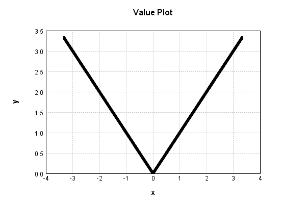
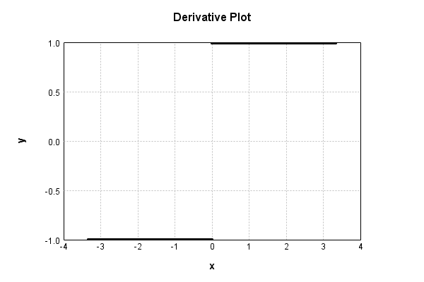

# AbsActivationLayer
## AbsActivationLayerTest
### Json Serialization
Code from [StandardLayerTests.java:68](../../../../../../../src/main/java/com/simiacryptus/mindseye/test/StandardLayerTests.java#L68) executed in 0.00 seconds: 
```java
    JsonObject json = layer.getJson();
    NNLayer echo = NNLayer.fromJson(json);
    if ((echo == null)) throw new AssertionError("Failed to deserialize");
    if ((layer == echo)) throw new AssertionError("Serialization did not copy");
    if ((!layer.equals(echo))) throw new AssertionError("Serialization not equal");
    return new GsonBuilder().setPrettyPrinting().create().toJson(json);
```

Returns: 

```
    {
      "class": "com.simiacryptus.mindseye.layers.java.AbsActivationLayer",
      "id": "3afaf3ac-f96b-44dc-ac59-0eb067f8b6be",
      "isFrozen": true,
      "name": "AbsActivationLayer/3afaf3ac-f96b-44dc-ac59-0eb067f8b6be"
    }
```


### Example Input/Output Pair
Code from [StandardLayerTests.java:152](../../../../../../../src/main/java/com/simiacryptus/mindseye/test/StandardLayerTests.java#L152) executed in 0.00 seconds: 
```java
    SimpleEval eval = SimpleEval.run(layer, inputPrototype);
    return String.format("--------------------\nInput: \n[%s]\n--------------------\nOutput: \n%s\n--------------------\nDerivative: \n%s",
      Arrays.stream(inputPrototype).map(t -> t.prettyPrint()).reduce((a, b) -> a + ",\n" + b).get(),
      eval.getOutput().prettyPrint(),
      Arrays.stream(eval.getDerivative()).map(t -> t.prettyPrint()).reduce((a, b) -> a + ",\n" + b).get());
```

Returns: 

```
    --------------------
    Input: 
    [[
    	[ [ -1.496 ], [ -1.092 ], [ -1.568 ] ],
    	[ [ -1.12 ], [ 1.08 ], [ 0.204 ] ]
    ]]
    --------------------
    Output: 
    [
    	[ [ 1.496 ], [ 1.092 ], [ 1.568 ] ],
    	[ [ 1.12 ], [ 1.08 ], [ 0.204 ] ]
    ]
    --------------------
    Derivative: 
    [
    	[ [ -1.0 ], [ -1.0 ], [ -1.0 ] ],
    	[ [ -1.0 ], [ 1.0 ], [ 1.0 ] ]
    ]
```


### Batch Execution
Code from [StandardLayerTests.java:101](../../../../../../../src/main/java/com/simiacryptus/mindseye/test/StandardLayerTests.java#L101) executed in 0.00 seconds: 
```java
    return getBatchingTester().test(layer, inputPrototype);
```

Returns: 

```
    ToleranceStatistics{absoluteTol=0.0000e+00 +- 0.0000e+00 [0.0000e+00 - 0.0000e+00] (120#), relativeTol=0.0000e+00 +- 0.0000e+00 [0.0000e+00 - 0.0000e+00] (120#)}
```


### Differential Validation
Code from [StandardLayerTests.java:109](../../../../../../../src/main/java/com/simiacryptus/mindseye/test/StandardLayerTests.java#L109) executed in 0.00 seconds: 
```java
    return getDerivativeTester().test(layer, inputPrototype);
```
Logging: 
```
    Inputs: [
    	[ [ 0.912 ], [ -1.336 ], [ 1.1 ] ],
    	[ [ 0.888 ], [ 0.592 ], [ 1.808 ] ]
    ]
    Inputs Statistics: {meanExponent=0.017521180044505577, negative=1, min=1.808, max=1.808, mean=0.6606666666666667, count=6.0, positive=5, stdDev=0.9674390018095312, zeros=0}
    Output: [
    	[ [ 0.912 ], [ 1.336 ], [ 1.1 ] ],
    	[ [ 0.888 ], [ 0.592 ], [ 1.808 ] ]
    ]
    Outputs Statistics: {meanExponent=0.017521180044505577, negative=0, min=1.808, max=1.808, mean=1.106, count=6.0, positive=6, stdDev=0.38624172051536126, zeros=0}
    Feedback for input 0
    Inputs Values: [
    	[ [ 0.912 ], [ -1.336 ], [ 1.1 ] ],
    	[ [ 0.888 ], [ 0.592 ], [ 1.808 ] ]
    ]
    Value Statistics: {meanExponent=0.017521180044505577, negative=1, min=1.808, max=1.808, mean=0.6606666666666667, count=6.0, positive=5, stdDev=0.9674390018095312, zeros=0}
    Implemented Feedback: [ [ 1.0, 0.0, 0.0, 0.0, 0.0, 0.0 ], [ 0.0, 1.0, 0.0, 0.0, 0.0, 0.0 ], [ 0.0, 0.0, -1.0, 0.0, 0.0, 0.0 ], [ 0.0, 0.0, 0.0, 1.0, 0.0, 0.0 ], [ 0.0, 0.0, 0.0, 0.0, 1.0, 0.0 ], [ 0.0, 0.0, 0.0, 0.0, 0.0, 1.0
```
...[skipping 411 bytes](etc/93.txt)...
```
    9999999998899, 0.0 ], [ 0.0, 0.0, 0.0, 0.0, 0.0, 0.9999999999998899 ] ]
    Measured Statistics: {meanExponent=-4.7830642341045674E-14, negative=1, min=0.9999999999998899, max=0.9999999999998899, mean=0.11111111111109888, count=36.0, positive=5, stdDev=0.39283710065914984, zeros=30}
    Feedback Error: [ [ -1.1013412404281553E-13, 0.0, 0.0, 0.0, 0.0, 0.0 ], [ 0.0, -1.1013412404281553E-13, 0.0, 0.0, 0.0, 0.0 ], [ 0.0, 0.0, 1.1013412404281553E-13, 0.0, 0.0, 0.0 ], [ 0.0, 0.0, 0.0, -1.1013412404281553E-13, 0.0, 0.0 ], [ 0.0, 0.0, 0.0, 0.0, -1.1013412404281553E-13, 0.0 ], [ 0.0, 0.0, 0.0, 0.0, 0.0, -1.1013412404281553E-13 ] ]
    Error Statistics: {meanExponent=-12.958078098036824, negative=5, min=-1.1013412404281553E-13, max=-1.1013412404281553E-13, mean=-1.223712489364617E-14, count=36.0, positive=1, stdDev=4.3264769972619575E-14, zeros=30}
    Finite-Difference Derivative Accuracy:
    absoluteTol: 1.8356e-14 +- 4.1045e-14 [0.0000e+00 - 1.1013e-13] (36#)
    relativeTol: 5.5067e-14 +- 0.0000e+00 [5.5067e-14 - 5.5067e-14] (6#)
    
```

Returns: 

```
    ToleranceStatistics{absoluteTol=1.8356e-14 +- 4.1045e-14 [0.0000e+00 - 1.1013e-13] (36#), relativeTol=5.5067e-14 +- 0.0000e+00 [5.5067e-14 - 5.5067e-14] (6#)}
```


### Performance
Code from [StandardLayerTests.java:119](../../../../../../../src/main/java/com/simiacryptus/mindseye/test/StandardLayerTests.java#L119) executed in 0.19 seconds: 
```java
    getPerformanceTester().test(layer, permPrototype);
```
Logging: 
```
    100 batches
    Input Dimensions:
    	[100, 100, 1]
    Performance:
    	Evaluation performance: 0.025437s +- 0.044556s [0.002629s - 0.114547s]
    	Learning performance: 0.009976s +- 0.000388s [0.009665s - 0.010709s]
    
```

### Function Plots
Code from [ActivationLayerTestBase.java:110](../../../../../../../src/test/java/com/simiacryptus/mindseye/layers/java/ActivationLayerTestBase.java#L110) executed in 0.00 seconds: 
```java
    return plot("Value Plot", plotData, x -> new double[]{x[0], x[1]});
```

Returns: 




Code from [ActivationLayerTestBase.java:114](../../../../../../../src/test/java/com/simiacryptus/mindseye/layers/java/ActivationLayerTestBase.java#L114) executed in 0.00 seconds: 
```java
    return plot("Derivative Plot", plotData, x -> new double[]{x[0], x[2]});
```

Returns: 




