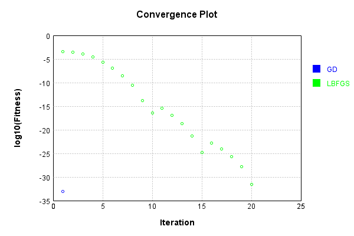
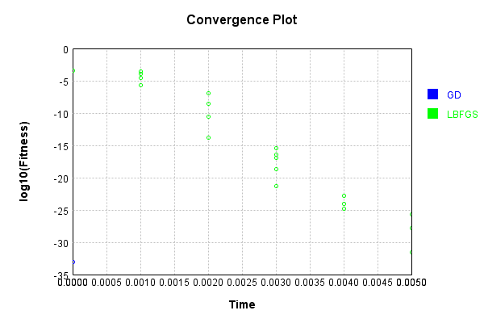

# AssertDimensionsLayer
## AssertDimensionsLayerTest
### Json Serialization
Code from [JsonTest.java:36](../../../../../../../src/main/java/com/simiacryptus/mindseye/test/unit/JsonTest.java#L36) executed in 0.00 seconds: 
```java
    JsonObject json = layer.getJson();
    NNLayer echo = NNLayer.fromJson(json);
    if ((echo == null)) throw new AssertionError("Failed to deserialize");
    if ((layer == echo)) throw new AssertionError("Serialization did not copy");
    if ((!layer.equals(echo))) throw new AssertionError("Serialization not equal");
    return new GsonBuilder().setPrettyPrinting().create().toJson(json);
```

Returns: 

```
    {
      "class": "com.simiacryptus.mindseye.layers.java.AssertDimensionsLayer",
      "id": "4a3be6ed-4a79-47aa-a7f9-95a605eb8940",
      "isFrozen": false,
      "name": "AssertDimensionsLayer/4a3be6ed-4a79-47aa-a7f9-95a605eb8940",
      "dims": [
        2,
        2
      ]
    }
```


### Example Input/Output Pair
Code from [ReferenceIO.java:68](../../../../../../../src/main/java/com/simiacryptus/mindseye/test/unit/ReferenceIO.java#L68) executed in 0.00 seconds: 
```java
    SimpleEval eval = SimpleEval.run(layer, inputPrototype);
    return String.format("--------------------\nInput: \n[%s]\n--------------------\nOutput: \n%s\n--------------------\nDerivative: \n%s",
      Arrays.stream(inputPrototype).map(t -> t.prettyPrint()).reduce((a, b) -> a + ",\n" + b).get(),
      eval.getOutput().prettyPrint(),
      Arrays.stream(eval.getDerivative()).map(t -> t.prettyPrint()).reduce((a, b) -> a + ",\n" + b).get());
```

Returns: 

```
    --------------------
    Input: 
    [[ [ 1.912, 1.648 ], [ 1.256, -0.26 ] ]]
    --------------------
    Output: 
    [ [ 1.912, 1.648 ], [ 1.256, -0.26 ] ]
    --------------------
    Derivative: 
    [ [ 1.0, 1.0 ], [ 1.0, 1.0 ] ]
```


### Batch Execution
Code from [BatchingTester.java:66](../../../../../../../src/main/java/com/simiacryptus/mindseye/test/unit/BatchingTester.java#L66) executed in 0.00 seconds: 
```java
    return test(reference, inputPrototype);
```

Returns: 

```
    ToleranceStatistics{absoluteTol=0.0000e+00 +- 0.0000e+00 [0.0000e+00 - 0.0000e+00] (80#), relativeTol=0.0000e+00 +- 0.0000e+00 [0.0000e+00 - 0.0000e+00] (80#)}
```


Code from [SingleDerivativeTester.java:77](../../../../../../../src/main/java/com/simiacryptus/mindseye/test/unit/SingleDerivativeTester.java#L77) executed in 0.00 seconds: 
```java
    return test(component, inputPrototype);
```
Logging: 
```
    Inputs: [ [ 0.512, -0.648 ], [ 0.824, -0.812 ] ]
    Inputs Statistics: {meanExponent=-0.1634179480538212, negative=2, min=-0.812, max=-0.812, mean=-0.031000000000000055, count=4.0, positive=2, stdDev=0.7100218306502977, zeros=0}
    Output: [ [ 0.512, -0.648 ], [ 0.824, -0.812 ] ]
    Outputs Statistics: {meanExponent=-0.1634179480538212, negative=2, min=-0.812, max=-0.812, mean=-0.031000000000000055, count=4.0, positive=2, stdDev=0.7100218306502977, zeros=0}
    Feedback for input 0
    Inputs Values: [ [ 0.512, -0.648 ], [ 0.824, -0.812 ] ]
    Value Statistics: {meanExponent=-0.1634179480538212, negative=2, min=-0.812, max=-0.812, mean=-0.031000000000000055, count=4.0, positive=2, stdDev=0.7100218306502977, zeros=0}
    Implemented Feedback: [ [ 1.0, 0.0, 0.0, 0.0 ], [ 0.0, 1.0, 0.0, 0.0 ], [ 0.0, 0.0, 1.0, 0.0 ], [ 0.0, 0.0, 0.0, 1.0 ] ]
    Implemented Statistics: {meanExponent=0.0, negative=0, min=1.0, max=1.0, mean=0.25, count=16.0, positive=4, stdDev=0.4330127018922193, zeros=12}
    Measured Feedback: [ [ 0.9999999999998899, 0.0, 0.0, 0.0 ], [ 0.0, 0.9999999999998899, 0.0, 0.0 ], [ 0.0, 0.0, 0.9999999999998899, 0.0 ], [ 0.0, 0.0, 0.0, 0.9999999999998899 ] ]
    Measured Statistics: {meanExponent=-4.7830642341045674E-14, negative=0, min=0.9999999999998899, max=0.9999999999998899, mean=0.24999999999997247, count=16.0, positive=4, stdDev=0.4330127018921716, zeros=12}
    Feedback Error: [ [ -1.1013412404281553E-13, 0.0, 0.0, 0.0 ], [ 0.0, -1.1013412404281553E-13, 0.0, 0.0 ], [ 0.0, 0.0, -1.1013412404281553E-13, 0.0 ], [ 0.0, 0.0, 0.0, -1.1013412404281553E-13 ] ]
    Error Statistics: {meanExponent=-12.958078098036825, negative=4, min=-1.1013412404281553E-13, max=-1.1013412404281553E-13, mean=-2.7533531010703882E-14, count=16.0, positive=0, stdDev=4.7689474622312385E-14, zeros=12}
    Finite-Difference Derivative Accuracy:
    absoluteTol: 2.7534e-14 +- 4.7689e-14 [0.0000e+00 - 1.1013e-13] (16#)
    relativeTol: 5.5067e-14 +- 0.0000e+00 [5.5067e-14 - 5.5067e-14] (4#)
    
```

Returns: 

```
    ToleranceStatistics{absoluteTol=2.7534e-14 +- 4.7689e-14 [0.0000e+00 - 1.1013e-13] (16#), relativeTol=5.5067e-14 +- 0.0000e+00 [5.5067e-14 - 5.5067e-14] (4#)}
```


### Performance
Now we execute larger-scale runs to benchmark performance:

Code from [PerformanceTester.java:66](../../../../../../../src/main/java/com/simiacryptus/mindseye/test/unit/PerformanceTester.java#L66) executed in 0.00 seconds: 
```java
    test(component, inputPrototype);
```
Logging: 
```
    100 batches
    Input Dimensions:
    	[2, 2]
    Performance:
    	Evaluation performance: 0.000017s +- 0.000005s [0.000013s - 0.000028s]
    	Learning performance: 0.000025s +- 0.000002s [0.000024s - 0.000029s]
    
```

### Input Learning
In this test, we use a network to learn this target input, given it's pre-evaluated output:

Code from [LearningTester.java:127](../../../../../../../src/main/java/com/simiacryptus/mindseye/test/unit/LearningTester.java#L127) executed in 0.00 seconds: 
```java
    return Arrays.stream(input_target).map(x -> x.prettyPrint()).reduce((a, b) -> a + "\n" + b).orElse("");
```

Returns: 

```
    [ [ 0.712, -0.564 ], [ 0.38, 0.624 ] ]
```


First, we use a conjugate gradient descent method, which converges the fastest for purely linear functions.

Code from [LearningTester.java:300](../../../../../../../src/main/java/com/simiacryptus/mindseye/test/unit/LearningTester.java#L300) executed in 0.00 seconds: 
```java
    return new IterativeTrainer(trainable)
      .setLineSearchFactory(label -> new QuadraticSearch())
      .setOrientation(new GradientDescent())
      .setMonitor(monitor)
      .setTimeout(30, TimeUnit.SECONDS)
      .setMaxIterations(250)
      .setTerminateThreshold(0)
      .run();
```
Logging: 
```
    Constructing line search parameters: GD
    F(0.0) = LineSearchPoint{point=PointSample{avg=0.05511199999999999}, derivative=-0.05511199999999999}
    New Minimum: 0.05511199999999999 > 0.05511199999448878
    F(1.0E-10) = LineSearchPoint{point=PointSample{avg=0.05511199999448878}, derivative=-0.05511199999724438}, delta = -5.511209544284412E-12
    New Minimum: 0.05511199999448878 > 0.055111999961421576
    F(7.000000000000001E-10) = LineSearchPoint{point=PointSample{avg=0.055111999961421576}, derivative=-0.055111999980710785}, delta = -3.8578411298839654E-11
    New Minimum: 0.055111999961421576 > 0.055111999729951185
    F(4.900000000000001E-9) = LineSearchPoint{point=PointSample{avg=0.055111999729951185}, derivative=-0.055111999864975586}, delta = -2.7004880276404464E-10
    New Minimum: 0.055111999729951185 > 0.05511199810965841
    F(3.430000000000001E-8) = LineSearchPoint{point=PointSample{avg=0.05511199810965841}, derivative=-0.05511199905482919}, delta = -1.890341577714949E-9
    New Minimum: 0.05511199810965841 > 0.05511198676760
```
...[skipping 1657 bytes](etc/227.txt)...
```
    .005225960037463241
    F(1.3841287201) = LineSearchPoint{point=PointSample{avg=0.005225960037463241}, derivative=-0.0169709489889244}, delta = -0.049886039962536745
    Loops = 12
    New Minimum: 0.005225960037463241 > 7.703719777548943E-34
    F(2.0000000000000004) = LineSearchPoint{point=PointSample{avg=7.703719777548943E-34}, derivative=4.607425552194399E-18}, delta = -0.05511199999999999
    Right bracket at 2.0000000000000004
    Converged to right
    Iteration 1 complete. Error: 7.703719777548943E-34 Total: 249767791772148.2200; Orientation: 0.0000; Line Search: 0.0008
    Zero gradient: 2.7755575615628914E-17
    F(0.0) = LineSearchPoint{point=PointSample{avg=7.703719777548943E-34}, derivative=-7.703719777548943E-34}
    New Minimum: 7.703719777548943E-34 > 0.0
    F(2.0000000000000004) = LineSearchPoint{point=PointSample{avg=0.0}, derivative=0.0}, delta = -7.703719777548943E-34
    0.0 <= 7.703719777548943E-34
    Converged to right
    Iteration 2 complete. Error: 0.0 Total: 249767791918056.2200; Orientation: 0.0000; Line Search: 0.0001
    
```

Returns: 

```
    0.0
```


Training Converged

Next, we run the same optimization using L-BFGS, which is nearly ideal for purely second-order or quadratic functions.

Code from [LearningTester.java:324](../../../../../../../src/main/java/com/simiacryptus/mindseye/test/unit/LearningTester.java#L324) executed in 0.01 seconds: 
```java
    return new IterativeTrainer(trainable)
      .setLineSearchFactory(label -> new ArmijoWolfeSearch())
      .setOrientation(new LBFGS())
      .setMonitor(monitor)
      .setTimeout(30, TimeUnit.SECONDS)
      .setMaxIterations(250)
      .setTerminateThreshold(0)
      .run();
```
Logging: 
```
    LBFGS Accumulation History: 1 points
    Constructing line search parameters: GD
    th(0)=0.05511199999999999;dx=-0.05511199999999999
    New Minimum: 0.05511199999999999 > 3.2860631247969176E-4
    WOLF (strong): th(2.154434690031884)=3.2860631247969176E-4; dx=0.004255602318518586 delta=0.0547833936875203
    END: th(1.077217345015942)=0.01173235041886062; dx=-0.025428198840740695 delta=0.043379649581139365
    Iteration 1 complete. Error: 3.2860631247969176E-4 Total: 249767795160826.2200; Orientation: 0.0000; Line Search: 0.0002
    LBFGS Accumulation History: 1 points
    th(0)=0.01173235041886062;dx=-0.01173235041886062
    New Minimum: 0.01173235041886062 > 3.0184128200492783E-4
    WOLF (strong): th(2.3207944168063896)=3.0184128200492783E-4; dx=0.0018818362551932997 delta=0.011430509136855692
    END: th(1.1603972084031948)=0.0020676297976197373; dx=-0.00492525708183366 delta=0.009664720621240883
    Iteration 2 complete. Error: 3.0184128200492783E-4 Total: 249767795471737.2200; Orientation: 0.0000; Line Search: 0.0003
    LBFGS Accumulatio
```
...[skipping 9135 bytes](etc/228.txt)...
```
    ientation: 0.0000; Line Search: 0.0002
    LBFGS Accumulation History: 1 points
    th(0)=1.4005747741572857E-28;dx=-1.4005747741572857E-28
    New Minimum: 1.4005747741572857E-28 > 1.3092086575955552E-28
    WOLF (strong): th(3.9347236070529372)=1.3092086575955552E-28; dx=1.3541213438986655E-28 delta=9.136611656173047E-30
    New Minimum: 1.3092086575955552E-28 > 3.158525108795067E-32
    END: th(1.9673618035264686)=3.158525108795067E-32; dx=-2.0900191756490283E-30 delta=1.4002589216464062E-28
    Iteration 20 complete. Error: 3.158525108795067E-32 Total: 249767799748978.2000; Orientation: 0.0000; Line Search: 0.0001
    LBFGS Accumulation History: 1 points
    th(0)=3.158525108795067E-32;dx=-3.158525108795067E-32
    Armijo: th(4.238552517361115)=4.0059342843254506E-32; dx=3.543711097672514E-32 delta=-8.474091755303838E-33
    New Minimum: 3.158525108795067E-32 > 0.0
    END: th(2.1192762586805576)=0.0; dx=0.0 delta=3.158525108795067E-32
    Iteration 21 complete. Error: 0.0 Total: 249767799939913.2000; Orientation: 0.0000; Line Search: 0.0001
    
```

Returns: 

```
    0.0
```


Training Converged

Code from [LearningTester.java:96](../../../../../../../src/main/java/com/simiacryptus/mindseye/test/unit/LearningTester.java#L96) executed in 0.00 seconds: 
```java
    return TestUtil.compare(runs);
```

Returns: 




Code from [LearningTester.java:99](../../../../../../../src/main/java/com/simiacryptus/mindseye/test/unit/LearningTester.java#L99) executed in 0.00 seconds: 
```java
    return TestUtil.compareTime(runs);
```

Returns: 




