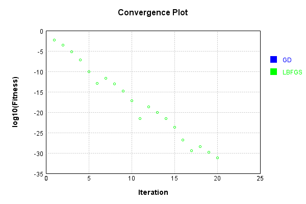
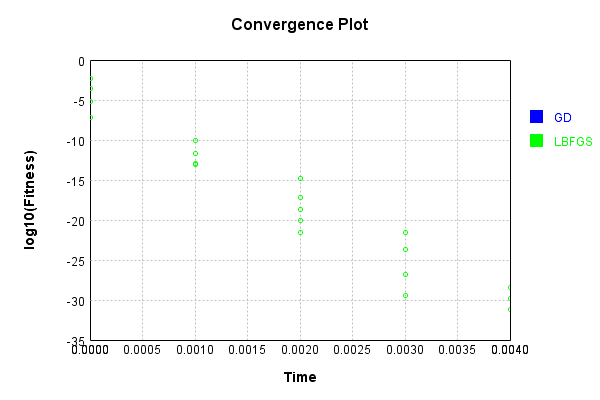
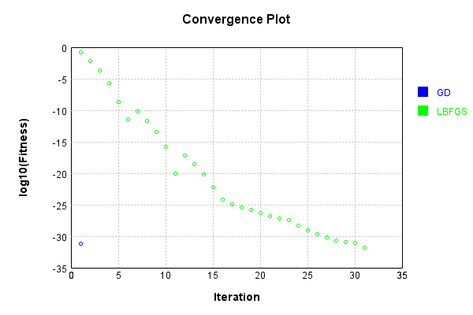
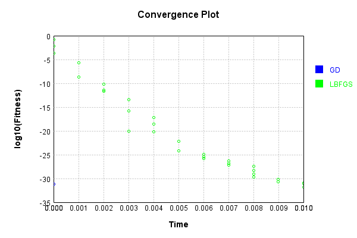

# BiasLayer
## Reducing
### Json Serialization
Code from [JsonTest.java:36](../../../../../../../../src/main/java/com/simiacryptus/mindseye/test/unit/JsonTest.java#L36) executed in 0.00 seconds: 
```java
    JsonObject json = layer.getJson();
    NNLayer echo = NNLayer.fromJson(json);
    if ((echo == null)) throw new AssertionError("Failed to deserialize");
    if ((layer == echo)) throw new AssertionError("Serialization did not copy");
    if ((!layer.equals(echo))) throw new AssertionError("Serialization not equal");
    return new GsonBuilder().setPrettyPrinting().create().toJson(json);
```

Returns: 

```
    {
      "class": "com.simiacryptus.mindseye.layers.java.BiasLayer",
      "id": "015b86c7-58af-482f-9482-f1a77960f762",
      "isFrozen": false,
      "name": "BiasLayer/015b86c7-58af-482f-9482-f1a77960f762",
      "bias": [
        -0.604
      ]
    }
```


### Example Input/Output Pair
Code from [ReferenceIO.java:68](../../../../../../../../src/main/java/com/simiacryptus/mindseye/test/unit/ReferenceIO.java#L68) executed in 0.00 seconds: 
```java
    SimpleEval eval = SimpleEval.run(layer, inputPrototype);
    return String.format("--------------------\nInput: \n[%s]\n--------------------\nOutput: \n%s\n--------------------\nDerivative: \n%s",
      Arrays.stream(inputPrototype).map(t -> t.prettyPrint()).reduce((a, b) -> a + ",\n" + b).get(),
      eval.getOutput().prettyPrint(),
      Arrays.stream(eval.getDerivative()).map(t -> t.prettyPrint()).reduce((a, b) -> a + ",\n" + b).get());
```

Returns: 

```
    --------------------
    Input: 
    [[ 0.924, 1.172, 0.708 ]]
    --------------------
    Output: 
    [ 0.32000000000000006, 0.568, 0.10399999999999998 ]
    --------------------
    Derivative: 
    [ 1.0, 1.0, 1.0 ]
```


### Batch Execution
Code from [BatchingTester.java:66](../../../../../../../../src/main/java/com/simiacryptus/mindseye/test/unit/BatchingTester.java#L66) executed in 0.00 seconds: 
```java
    return test(reference, inputPrototype);
```

Returns: 

```
    ToleranceStatistics{absoluteTol=0.0000e+00 +- 0.0000e+00 [0.0000e+00 - 0.0000e+00] (60#), relativeTol=0.0000e+00 +- 0.0000e+00 [0.0000e+00 - 0.0000e+00] (60#)}
```


Code from [SingleDerivativeTester.java:77](../../../../../../../../src/main/java/com/simiacryptus/mindseye/test/unit/SingleDerivativeTester.java#L77) executed in 0.00 seconds: 
```java
    return test(component, inputPrototype);
```
Logging: 
```
    Inputs: [ -1.428, 1.332, 1.412 ]
    Inputs Statistics: {meanExponent=0.14302237633007425, negative=1, min=1.412, max=1.412, mean=0.4386666666666667, count=3.0, positive=2, stdDev=1.3203366574055606, zeros=0}
    Output: [ -2.032, 0.7280000000000001, 0.8079999999999999 ]
    Outputs Statistics: {meanExponent=0.025822147899835005, negative=1, min=0.8079999999999999, max=0.8079999999999999, mean=-0.1653333333333333, count=3.0, positive=2, stdDev=1.3203366574055606, zeros=0}
    Feedback for input 0
    Inputs Values: [ -1.428, 1.332, 1.412 ]
    Value Statistics: {meanExponent=0.14302237633007425, negative=1, min=1.412, max=1.412, mean=0.4386666666666667, count=3.0, positive=2, stdDev=1.3203366574055606, zeros=0}
    Implemented Feedback: [ [ 1.0, 0.0, 0.0 ], [ 0.0, 1.0, 0.0 ], [ 0.0, 0.0, 1.0 ] ]
    Implemented Statistics: {meanExponent=0.0, negative=0, min=1.0, max=1.0, mean=0.3333333333333333, count=9.0, positive=3, stdDev=0.4714045207910317, zeros=6}
    Measured Feedback: [ [ 1.0000000000021103, 0.0, 0.0 ], [ 0.0, 0.999999999999889
```
...[skipping 593 bytes](etc/242.txt)...
```
    ros=6}
    Learning Gradient for weight set 0
    Weights: [ -0.604 ]
    Implemented Gradient: [ [ 1.0, 1.0, 1.0 ] ]
    Implemented Statistics: {meanExponent=0.0, negative=0, min=1.0, max=1.0, mean=1.0, count=3.0, positive=3, stdDev=0.0, zeros=0}
    Measured Gradient: [ [ 1.0000000000021103, 0.9999999999998899, 0.9999999999998899 ] ]
    Measured Statistics: {meanExponent=2.7361184650972856E-13, negative=0, min=0.9999999999998899, max=0.9999999999998899, mean=1.00000000000063, count=3.0, positive=3, stdDev=1.4901161193847656E-8, zeros=0}
    Gradient Error: [ [ 2.1103119252074976E-12, -1.1013412404281553E-13, -1.1013412404281553E-13 ] ]
    Error Statistics: {meanExponent=-12.530603180987853, negative=2, min=-1.1013412404281553E-13, max=-1.1013412404281553E-13, mean=6.300145590406222E-13, count=3.0, positive=1, stdDev=1.0467283057891834E-12, zeros=0}
    Finite-Difference Derivative Accuracy:
    absoluteTol: 3.8843e-13 +- 7.7162e-13 [0.0000e+00 - 2.1103e-12] (12#)
    relativeTol: 3.8843e-13 +- 4.7145e-13 [5.5067e-14 - 1.0552e-12] (6#)
    
```

Returns: 

```
    ToleranceStatistics{absoluteTol=3.8843e-13 +- 7.7162e-13 [0.0000e+00 - 2.1103e-12] (12#), relativeTol=3.8843e-13 +- 4.7145e-13 [5.5067e-14 - 1.0552e-12] (6#)}
```


### Performance
Now we execute larger-scale runs to benchmark performance:

Code from [PerformanceTester.java:66](../../../../../../../../src/main/java/com/simiacryptus/mindseye/test/unit/PerformanceTester.java#L66) executed in 0.00 seconds: 
```java
    test(component, inputPrototype);
```
Logging: 
```
    100 batches
    Input Dimensions:
    	[3]
    Performance:
    	Evaluation performance: 0.000138s +- 0.000018s [0.000102s - 0.000151s]
    	Learning performance: 0.000111s +- 0.000006s [0.000102s - 0.000118s]
    
```

### Input Learning
In this test, we use a network to learn this target input, given it's pre-evaluated output:

Code from [LearningTester.java:127](../../../../../../../../src/main/java/com/simiacryptus/mindseye/test/unit/LearningTester.java#L127) executed in 0.00 seconds: 
```java
    return Arrays.stream(input_target).map(x -> x.prettyPrint()).reduce((a, b) -> a + "\n" + b).orElse("");
```

Returns: 

```
    [ -0.532, -0.236, 1.096 ]
```


First, we use a conjugate gradient descent method, which converges the fastest for purely linear functions.

Code from [LearningTester.java:300](../../../../../../../../src/main/java/com/simiacryptus/mindseye/test/unit/LearningTester.java#L300) executed in 0.00 seconds: 
```java
    return new IterativeTrainer(trainable)
      .setLineSearchFactory(label -> new QuadraticSearch())
      .setOrientation(new GradientDescent())
      .setMonitor(monitor)
      .setTimeout(30, TimeUnit.SECONDS)
      .setMaxIterations(250)
      .setTerminateThreshold(0)
      .run();
```
Logging: 
```
    Constructing line search parameters: GD
    F(0.0) = LineSearchPoint{point=PointSample{avg=0.05841066666666677}, derivative=-0.07788088888888901}
    New Minimum: 0.05841066666666677 > 0.0584106666588786
    F(1.0E-10) = LineSearchPoint{point=PointSample{avg=0.0584106666588786}, derivative=-0.0778808888836969}, delta = -7.78817288438205E-12
    New Minimum: 0.0584106666588786 > 0.05841066661215008
    F(7.000000000000001E-10) = LineSearchPoint{point=PointSample{avg=0.05841066661215008}, derivative=-0.07788088885254456}, delta = -5.4516689773631555E-11
    New Minimum: 0.05841066661215008 > 0.05841066628505037
    F(4.900000000000001E-9) = LineSearchPoint{point=PointSample{avg=0.05841066628505037}, derivative=-0.07788088863447809}, delta = -3.8161639820399884E-10
    New Minimum: 0.05841066628505037 > 0.05841066399535233
    F(3.430000000000001E-8) = LineSearchPoint{point=PointSample{avg=0.05841066399535233}, derivative=-0.0778808871080127}, delta = -2.6713144404832967E-9
    New Minimum: 0.05841066399535233 > 0.05841064796746679
    F(2.4010
```
...[skipping 1111 bytes](etc/243.txt)...
```
    2935845}, derivative=-0.07767137057002017}, delta = -3.1385473730832086E-4
    New Minimum: 0.05809681192935845 > 0.056231438627296106
    F(0.028247524900000005) = LineSearchPoint{point=PointSample{avg=0.056231438627296106}, derivative=-0.07641426065680698}, delta = -0.0021792280393706648
    New Minimum: 0.056231438627296106 > 0.04402607135867268
    F(0.19773267430000002) = LineSearchPoint{point=PointSample{avg=0.04402607135867268}, derivative=-0.0676144912643149}, delta = -0.014384595307994089
    New Minimum: 0.04402607135867268 > 3.485469231265966E-4
    F(1.3841287201) = LineSearchPoint{point=PointSample{avg=3.485469231265966E-4}, derivative=-0.0060161055168701525}, delta = -0.058062119743540176
    Loops = 12
    New Minimum: 3.485469231265966E-4 > 0.0
    F(1.4999999999999998) = LineSearchPoint{point=PointSample{avg=0.0}, derivative=0.0}, delta = -0.05841066666666677
    Right bracket at 1.4999999999999998
    Converged to right
    Iteration 1 complete. Error: 0.0 Total: 249768573752564.4400; Orientation: 0.0000; Line Search: 0.0009
    
```

Returns: 

```
    0.0
```


Training Converged

Next, we run the same optimization using L-BFGS, which is nearly ideal for purely second-order or quadratic functions.

Code from [LearningTester.java:324](../../../../../../../../src/main/java/com/simiacryptus/mindseye/test/unit/LearningTester.java#L324) executed in 0.00 seconds: 
```java
    return new IterativeTrainer(trainable)
      .setLineSearchFactory(label -> new ArmijoWolfeSearch())
      .setOrientation(new LBFGS())
      .setMonitor(monitor)
      .setTimeout(30, TimeUnit.SECONDS)
      .setMaxIterations(250)
      .setTerminateThreshold(0)
      .run();
```
Logging: 
```
    LBFGS Accumulation History: 1 points
    Constructing line search parameters: GD
    th(0)=0.05841066666666677;dx=-0.07788088888888901
    New Minimum: 0.05841066666666677 > 0.011118399360093886
    WOLF (strong): th(2.154434690031884)=0.011118399360093886; dx=0.03397863691960517 delta=0.047292267306572884
    New Minimum: 0.011118399360093886 > 0.004640277661838224
    END: th(1.077217345015942)=0.004640277661838224; dx=-0.021951125984641925 delta=0.05377038900482855
    Iteration 1 complete. Error: 0.004640277661838224 Total: 249768576694111.4400; Orientation: 0.0000; Line Search: 0.0002
    LBFGS Accumulation History: 1 points
    th(0)=0.004640277661838224;dx=-0.006187036882450965
    New Minimum: 0.004640277661838224 > 0.001389409415186702
    WOLF (strong): th(2.3207944168063896)=0.001389409415186702; dx=0.0033855235531272954 delta=0.0032508682466515218
    New Minimum: 0.001389409415186702 > 2.378504368334928E-4
    END: th(1.1603972084031948)=2.378504368334928E-4; dx=-0.0014007566646618264 delta=0.004402427225004731
    Iteration 2 complete. 
```
...[skipping 9124 bytes](etc/244.txt)...
```
    : 249768580756478.4000; Orientation: 0.0000; Line Search: 0.0002
    LBFGS Accumulation History: 1 points
    th(0)=1.6434602192104414E-30;dx=-2.1912802922805883E-30
    New Minimum: 1.6434602192104414E-30 > 8.545993139894294E-31
    WOLF (strong): th(2.623149071368624)=8.545993139894294E-31; dx=1.5777218104420234E-30 delta=7.88860905221012E-31
    New Minimum: 8.545993139894294E-31 > 6.573840876841765E-32
    END: th(1.311574535684312)=6.573840876841765E-32; dx=-2.629536350736706E-31 delta=1.5777218104420236E-30
    Iteration 20 complete. Error: 6.573840876841765E-32 Total: 249768580968787.4000; Orientation: 0.0000; Line Search: 0.0002
    LBFGS Accumulation History: 1 points
    th(0)=6.573840876841765E-32;dx=-8.765121169122353E-32
    Armijo: th(2.8257016782407427)=6.573840876841765E-32; dx=8.765121169122353E-32 delta=0.0
    New Minimum: 6.573840876841765E-32 > 0.0
    END: th(1.4128508391203713)=0.0; dx=0.0 delta=6.573840876841765E-32
    Iteration 21 complete. Error: 0.0 Total: 249768581196484.4000; Orientation: 0.0000; Line Search: 0.0002
    
```

Returns: 

```
    0.0
```


Training Converged

Code from [LearningTester.java:96](../../../../../../../../src/main/java/com/simiacryptus/mindseye/test/unit/LearningTester.java#L96) executed in 0.00 seconds: 
```java
    return TestUtil.compare(runs);
```

Returns: 




Code from [LearningTester.java:99](../../../../../../../../src/main/java/com/simiacryptus/mindseye/test/unit/LearningTester.java#L99) executed in 0.00 seconds: 
```java
    return TestUtil.compareTime(runs);
```

Returns: 




### Model Learning
In this test, attempt to train a network to emulate a randomized network given an example input/output. The target state is:

Code from [LearningTester.java:176](../../../../../../../../src/main/java/com/simiacryptus/mindseye/test/unit/LearningTester.java#L176) executed in 0.00 seconds: 
```java
    return network_target.state().stream().map(Arrays::toString).reduce((a, b) -> a + "\n" + b).orElse("");
```

Returns: 

```
    [-1.844]
```


First, we use a conjugate gradient descent method, which converges the fastest for purely linear functions.

Code from [LearningTester.java:300](../../../../../../../../src/main/java/com/simiacryptus/mindseye/test/unit/LearningTester.java#L300) executed in 0.00 seconds: 
```java
    return new IterativeTrainer(trainable)
      .setLineSearchFactory(label -> new QuadraticSearch())
      .setOrientation(new GradientDescent())
      .setMonitor(monitor)
      .setTimeout(30, TimeUnit.SECONDS)
      .setMaxIterations(250)
      .setTerminateThreshold(0)
      .run();
```

Returns: 

```
    0.0
```


This training run resulted in the following configuration:

Code from [LearningTester.java:189](../../../../../../../../src/main/java/com/simiacryptus/mindseye/test/unit/LearningTester.java#L189) executed in 0.00 seconds: 
```java
    return network_gd.state().stream().map(Arrays::toString).reduce((a, b) -> a + "\n" + b).orElse("");
```

Returns: 

```
    [-0.748, -2.3760000000000003, -2.08]
    [-1.844]
```


Next, we run the same optimization using L-BFGS, which is nearly ideal for purely second-order or quadratic functions.

Code from [LearningTester.java:324](../../../../../../../../src/main/java/com/simiacryptus/mindseye/test/unit/LearningTester.java#L324) executed in 0.00 seconds: 
```java
    return new IterativeTrainer(trainable)
      .setLineSearchFactory(label -> new ArmijoWolfeSearch())
      .setOrientation(new LBFGS())
      .setMonitor(monitor)
      .setTimeout(30, TimeUnit.SECONDS)
      .setMaxIterations(250)
      .setTerminateThreshold(0)
      .run();
```

Returns: 

```
    0.0
```


This training run resulted in the following configuration:

Code from [LearningTester.java:203](../../../../../../../../src/main/java/com/simiacryptus/mindseye/test/unit/LearningTester.java#L203) executed in 0.00 seconds: 
```java
    return network_lbfgs.state().stream().map(Arrays::toString).reduce((a, b) -> a + "\n" + b).orElse("");
```

Returns: 

```
    [-0.748, -2.3760000000000003, -2.08]
    [-1.844]
```


Code from [LearningTester.java:96](../../../../../../../../src/main/java/com/simiacryptus/mindseye/test/unit/LearningTester.java#L96) executed in 0.00 seconds: 
```java
    return TestUtil.compare(runs);
```

Code from [LearningTester.java:99](../../../../../../../../src/main/java/com/simiacryptus/mindseye/test/unit/LearningTester.java#L99) executed in 0.00 seconds: 
```java
    return TestUtil.compareTime(runs);
```

### Composite Learning
In this test, attempt to train a network to emulate a randomized network given an example input/output. The target state is:

Code from [LearningTester.java:219](../../../../../../../../src/main/java/com/simiacryptus/mindseye/test/unit/LearningTester.java#L219) executed in 0.00 seconds: 
```java
    return network_target.state().stream().map(Arrays::toString).reduce((a, b) -> a + "\n" + b).orElse("");
```

Returns: 

```
    [-1.844]
```


We simultaneously regress this target input:

Code from [LearningTester.java:223](../../../../../../../../src/main/java/com/simiacryptus/mindseye/test/unit/LearningTester.java#L223) executed in 0.00 seconds: 
```java
    return Arrays.stream(testInput).map(x -> x.prettyPrint()).reduce((a, b) -> a + "\n" + b).orElse("");
```

Returns: 

```
    [ -0.236, 1.096, -0.532 ]
```


Which produces the following output:

Code from [LearningTester.java:230](../../../../../../../../src/main/java/com/simiacryptus/mindseye/test/unit/LearningTester.java#L230) executed in 0.00 seconds: 
```java
    return Stream.of(targetOutput).map(x -> x.prettyPrint()).reduce((a, b) -> a + "\n" + b).orElse("");
```

Returns: 

```
    [ -2.08, -0.748, -2.3760000000000003 ]
```


First, we use a conjugate gradient descent method, which converges the fastest for purely linear functions.

Code from [LearningTester.java:300](../../../../../../../../src/main/java/com/simiacryptus/mindseye/test/unit/LearningTester.java#L300) executed in 0.00 seconds: 
```java
    return new IterativeTrainer(trainable)
      .setLineSearchFactory(label -> new QuadraticSearch())
      .setOrientation(new GradientDescent())
      .setMonitor(monitor)
      .setTimeout(30, TimeUnit.SECONDS)
      .setMaxIterations(250)
      .setTerminateThreshold(0)
      .run();
```
Logging: 
```
    Constructing line search parameters: GD
    F(0.0) = LineSearchPoint{point=PointSample{avg=1.7669226666666675}, derivative=-2.3558968888888896}
    New Minimum: 1.7669226666666675 > 1.7669226664310773
    F(1.0E-10) = LineSearchPoint{point=PointSample{avg=1.7669226664310773}, derivative=-2.3558968887318295}, delta = -2.355902140038779E-10
    New Minimum: 1.7669226664310773 > 1.7669226650175391
    F(7.000000000000001E-10) = LineSearchPoint{point=PointSample{avg=1.7669226650175391}, derivative=-2.355896887789471}, delta = -1.6491283894026765E-9
    New Minimum: 1.7669226650175391 > 1.7669226551227724
    F(4.900000000000001E-9) = LineSearchPoint{point=PointSample{avg=1.7669226551227724}, derivative=-2.35589688119296}, delta = -1.1543895173105057E-8
    New Minimum: 1.7669226551227724 > 1.7669225858594046
    F(3.430000000000001E-8) = LineSearchPoint{point=PointSample{avg=1.7669225858594046}, derivative=-2.355896835017381}, delta = -8.080726288106632E-8
    New Minimum: 1.7669225858594046 > 1.7669221010158696
    F(2.4010000000000004E-7) = Li
```
...[skipping 3244 bytes](etc/245.txt)...
```
    324786324787
    F(0.4387464387464388) = LineSearchPoint{point=PointSample{avg=6.573840876841765E-32}, derivative=8.765121169122353E-32}, delta = 0.0
    Right bracket at 0.4387464387464388
    F(0.41215574548907885) = LineSearchPoint{point=PointSample{avg=6.573840876841765E-32}, derivative=8.765121169122353E-32}, delta = 0.0
    Right bracket at 0.41215574548907885
    F(0.3944286166508389) = LineSearchPoint{point=PointSample{avg=6.573840876841765E-32}, derivative=8.765121169122353E-32}, delta = 0.0
    Right bracket at 0.3944286166508389
    F(0.38261053075867896) = LineSearchPoint{point=PointSample{avg=6.573840876841765E-32}, derivative=8.765121169122353E-32}, delta = 0.0
    Right bracket at 0.38261053075867896
    F(0.3747318068305724) = LineSearchPoint{point=PointSample{avg=6.573840876841765E-32}, derivative=-1.7530242338244706E-31}, delta = 0.0
    Left bracket at 0.3747318068305724
    Converged to right
    Iteration 2 failed, aborting. Error: 6.573840876841765E-32 Total: 249768697148207.3000; Orientation: 0.0000; Line Search: 0.0011
    
```

Returns: 

```
    6.573840876841765E-32
```


Training Converged

Next, we run the same optimization using L-BFGS, which is nearly ideal for purely second-order or quadratic functions.

Code from [LearningTester.java:324](../../../../../../../../src/main/java/com/simiacryptus/mindseye/test/unit/LearningTester.java#L324) executed in 0.01 seconds: 
```java
    return new IterativeTrainer(trainable)
      .setLineSearchFactory(label -> new ArmijoWolfeSearch())
      .setOrientation(new LBFGS())
      .setMonitor(monitor)
      .setTimeout(30, TimeUnit.SECONDS)
      .setMaxIterations(250)
      .setTerminateThreshold(0)
      .run();
```
Logging: 
```
    LBFGS Accumulation History: 1 points
    Constructing line search parameters: GD
    th(0)=1.7669226666666675;dx=-2.3558968888888896
    New Minimum: 1.7669226666666675 > 0.3363315806428382
    WOLF (strong): th(2.154434690031884)=0.3363315806428382; dx=1.027853766818053 delta=1.4305910860238293
    New Minimum: 0.3363315806428382 > 0.1403683992706065
    END: th(1.077217345015942)=0.1403683992706065; dx=-0.6640215610354183 delta=1.6265542673960611
    Iteration 1 complete. Error: 0.1403683992706065 Total: 249768700709012.3000; Orientation: 0.0001; Line Search: 0.0004
    LBFGS Accumulation History: 1 points
    th(0)=0.1403683992706065;dx=-0.18715786569414194
    New Minimum: 0.1403683992706065 > 0.04202963480939814
    WOLF (strong): th(2.3207944168063896)=0.04202963480939814; dx=0.10241208748210126 delta=0.09833876446120834
    New Minimum: 0.04202963480939814 > 0.007194975714213181
    END: th(1.1603972084031948)=0.007194975714213181; dx=-0.04237288910602035 delta=0.1331734235563933
    Iteration 2 complete. Error: 0.007194975714213181 Total: 249
```
...[skipping 16653 bytes](etc/246.txt)...
```
    825605845611765E-32 delta=0.0
    Armijo: th(5.2601441588006576E-11)=1.6434602192104412E-32; dx=-4.3825605845611765E-32 delta=0.0
    Armijo: th(4.0811463301039586E-11)=1.6434602192104412E-32; dx=-4.3825605845611765E-32 delta=0.0
    Armijo: th(3.491647415755609E-11)=1.6434602192104412E-32; dx=-4.3825605845611765E-32 delta=0.0
    Armijo: th(3.196897958581434E-11)=1.6434602192104412E-32; dx=-4.3825605845611765E-32 delta=0.0
    WOLFE (weak): th(3.049523229994347E-11)=1.6434602192104412E-32; dx=-4.3825605845611765E-32 delta=0.0
    Armijo: th(3.1232105942878906E-11)=1.6434602192104412E-32; dx=-4.3825605845611765E-32 delta=0.0
    WOLFE (weak): th(3.086366912141119E-11)=1.6434602192104412E-32; dx=-4.3825605845611765E-32 delta=0.0
    WOLFE (weak): th(3.104788753214505E-11)=1.6434602192104412E-32; dx=-4.3825605845611765E-32 delta=0.0
    mu /= nu: th(0)=1.6434602192104412E-32;th'(0)=-4.3825605845611765E-32;
    Iteration 32 failed, aborting. Error: 1.6434602192104412E-32 Total: 249768713327000.2800; Orientation: 0.0000; Line Search: 0.0020
    
```

Returns: 

```
    1.6434602192104412E-32
```


Training Converged

Code from [LearningTester.java:96](../../../../../../../../src/main/java/com/simiacryptus/mindseye/test/unit/LearningTester.java#L96) executed in 0.00 seconds: 
```java
    return TestUtil.compare(runs);
```

Returns: 




Code from [LearningTester.java:99](../../../../../../../../src/main/java/com/simiacryptus/mindseye/test/unit/LearningTester.java#L99) executed in 0.00 seconds: 
```java
    return TestUtil.compareTime(runs);
```

Returns: 




