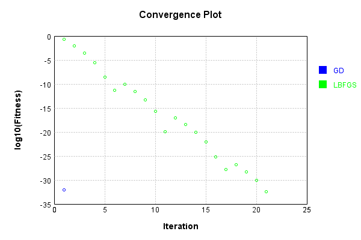
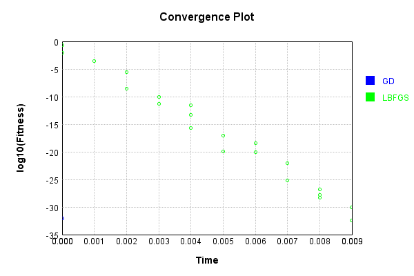
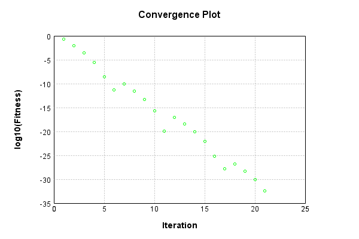
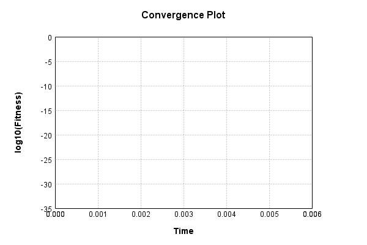
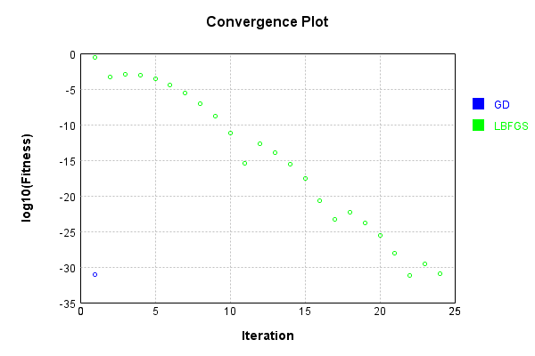
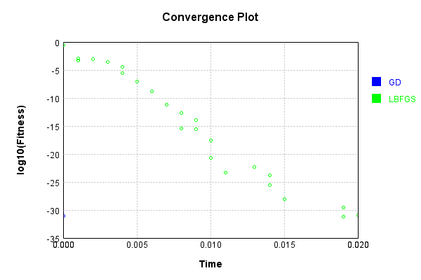

# BiasLayer
## BiasLayerTest
### Json Serialization
Code from [JsonTest.java:36](../../../../../../../src/main/java/com/simiacryptus/mindseye/test/unit/JsonTest.java#L36) executed in 0.00 seconds: 
```java
    JsonObject json = layer.getJson();
    NNLayer echo = NNLayer.fromJson(json);
    if ((echo == null)) throw new AssertionError("Failed to deserialize");
    if ((layer == echo)) throw new AssertionError("Serialization did not copy");
    if ((!layer.equals(echo))) throw new AssertionError("Serialization not equal");
    return new GsonBuilder().setPrettyPrinting().create().toJson(json);
```

Returns: 

```
    {
      "class": "com.simiacryptus.mindseye.layers.java.BiasLayer",
      "id": "29a63453-c4f1-4d7f-9ee3-d93c74c7ba95",
      "isFrozen": false,
      "name": "BiasLayer/29a63453-c4f1-4d7f-9ee3-d93c74c7ba95",
      "bias": [
        -1.14,
        0.68,
        1.496
      ]
    }
```


### Example Input/Output Pair
Code from [ReferenceIO.java:68](../../../../../../../src/main/java/com/simiacryptus/mindseye/test/unit/ReferenceIO.java#L68) executed in 0.00 seconds: 
```java
    SimpleEval eval = SimpleEval.run(layer, inputPrototype);
    return String.format("--------------------\nInput: \n[%s]\n--------------------\nOutput: \n%s\n--------------------\nDerivative: \n%s",
      Arrays.stream(inputPrototype).map(t -> t.prettyPrint()).reduce((a, b) -> a + ",\n" + b).get(),
      eval.getOutput().prettyPrint(),
      Arrays.stream(eval.getDerivative()).map(t -> t.prettyPrint()).reduce((a, b) -> a + ",\n" + b).get());
```

Returns: 

```
    --------------------
    Input: 
    [[ 0.612, 0.432, 1.988 ]]
    --------------------
    Output: 
    [ -0.5279999999999999, 1.112, 3.484 ]
    --------------------
    Derivative: 
    [ 1.0, 1.0, 1.0 ]
```


### Batch Execution
Code from [BatchingTester.java:66](../../../../../../../src/main/java/com/simiacryptus/mindseye/test/unit/BatchingTester.java#L66) executed in 0.00 seconds: 
```java
    return test(reference, inputPrototype);
```

Returns: 

```
    ToleranceStatistics{absoluteTol=0.0000e+00 +- 0.0000e+00 [0.0000e+00 - 0.0000e+00] (60#), relativeTol=0.0000e+00 +- 0.0000e+00 [0.0000e+00 - 0.0000e+00] (58#)}
```


Code from [SingleDerivativeTester.java:77](../../../../../../../src/main/java/com/simiacryptus/mindseye/test/unit/SingleDerivativeTester.java#L77) executed in 0.00 seconds: 
```java
    return test(component, inputPrototype);
```
Logging: 
```
    Inputs: [ 1.4, 1.004, -0.568 ]
    Inputs Statistics: {meanExponent=-0.032596638600580874, negative=1, min=-0.568, max=-0.568, mean=0.612, count=3.0, positive=2, stdDev=0.8499035239366877, zeros=0}
    Output: [ 0.26, 1.6840000000000002, 0.928 ]
    Outputs Statistics: {meanExponent=-0.13037886288222975, negative=0, min=0.928, max=0.928, mean=0.9573333333333335, count=3.0, positive=3, stdDev=0.5817154707319454, zeros=0}
    Feedback for input 0
    Inputs Values: [ 1.4, 1.004, -0.568 ]
    Value Statistics: {meanExponent=-0.032596638600580874, negative=1, min=-0.568, max=-0.568, mean=0.612, count=3.0, positive=2, stdDev=0.8499035239366877, zeros=0}
    Implemented Feedback: [ [ 1.0, 0.0, 0.0 ], [ 0.0, 1.0, 0.0 ], [ 0.0, 0.0, 1.0 ] ]
    Implemented Statistics: {meanExponent=0.0, negative=0, min=1.0, max=1.0, mean=0.3333333333333333, count=9.0, positive=3, stdDev=0.4714045207910317, zeros=6}
    Measured Feedback: [ [ 0.9999999999998899, 0.0, 0.0 ], [ 0.0, 0.9999999999976694, 0.0 ], [ 0.0, 0.0, 0.9999999999998899 ] ]
    Measured Statistic
```
...[skipping 690 bytes](etc/236.txt)...
```
    
    Implemented Statistics: {meanExponent=0.0, negative=0, min=1.0, max=1.0, mean=0.3333333333333333, count=9.0, positive=3, stdDev=0.4714045207910317, zeros=6}
    Measured Gradient: [ [ 0.9999999999998899, 0.0, 0.0 ], [ 0.0, 0.9999999999976694, 0.0 ], [ 0.0, 0.0, 0.9999999999998899 ] ]
    Measured Statistics: {meanExponent=-3.692731311925336E-13, negative=0, min=0.9999999999998899, max=0.9999999999998899, mean=0.33333333333304993, count=9.0, positive=3, stdDev=0.47140452079063083, zeros=6}
    Gradient Error: [ [ -1.1013412404281553E-13, 0.0, 0.0 ], [ 0.0, -2.3305801732931286E-12, 0.0 ], [ 0.0, 0.0, -1.1013412404281553E-13 ] ]
    Error Statistics: {meanExponent=-12.516230716189696, negative=3, min=-1.1013412404281553E-13, max=-1.1013412404281553E-13, mean=-2.834276023754177E-13, count=9.0, positive=0, stdDev=7.251729404930389E-13, zeros=6}
    Finite-Difference Derivative Accuracy:
    absoluteTol: 2.8343e-13 +- 7.2517e-13 [0.0000e+00 - 2.3306e-12] (18#)
    relativeTol: 4.2514e-13 +- 5.2336e-13 [5.5067e-14 - 1.1653e-12] (6#)
    
```

Returns: 

```
    ToleranceStatistics{absoluteTol=2.8343e-13 +- 7.2517e-13 [0.0000e+00 - 2.3306e-12] (18#), relativeTol=4.2514e-13 +- 5.2336e-13 [5.5067e-14 - 1.1653e-12] (6#)}
```


### Performance
Now we execute larger-scale runs to benchmark performance:

Code from [PerformanceTester.java:66](../../../../../../../src/main/java/com/simiacryptus/mindseye/test/unit/PerformanceTester.java#L66) executed in 0.00 seconds: 
```java
    test(component, inputPrototype);
```
Logging: 
```
    100 batches
    Input Dimensions:
    	[3]
    Performance:
    	Evaluation performance: 0.000198s +- 0.000066s [0.000133s - 0.000321s]
    	Learning performance: 0.000151s +- 0.000020s [0.000122s - 0.000175s]
    
```

### Input Learning
In this test, we use a network to learn this target input, given it's pre-evaluated output:

Code from [LearningTester.java:127](../../../../../../../src/main/java/com/simiacryptus/mindseye/test/unit/LearningTester.java#L127) executed in 0.00 seconds: 
```java
    return Arrays.stream(input_target).map(x -> x.prettyPrint()).reduce((a, b) -> a + "\n" + b).orElse("");
```

Returns: 

```
    [ 0.42, -0.932, 1.22 ]
```


First, we use a conjugate gradient descent method, which converges the fastest for purely linear functions.

Code from [LearningTester.java:300](../../../../../../../src/main/java/com/simiacryptus/mindseye/test/unit/LearningTester.java#L300) executed in 0.00 seconds: 
```java
    return new IterativeTrainer(trainable)
      .setLineSearchFactory(label -> new QuadraticSearch())
      .setOrientation(new GradientDescent())
      .setMonitor(monitor)
      .setTimeout(30, TimeUnit.SECONDS)
      .setMaxIterations(250)
      .setTerminateThreshold(0)
      .run();
```
Logging: 
```
    Constructing line search parameters: GD
    F(0.0) = LineSearchPoint{point=PointSample{avg=2.3663360000000004}, derivative=-3.155114666666667}
    New Minimum: 2.3663360000000004 > 2.366335999684489
    F(1.0E-10) = LineSearchPoint{point=PointSample{avg=2.366335999684489}, derivative=-3.155114666456326}, delta = -3.1551161683296414E-10
    New Minimum: 2.366335999684489 > 2.3663359977914196
    F(7.000000000000001E-10) = LineSearchPoint{point=PointSample{avg=2.3663359977914196}, derivative=-3.1551146651942794}, delta = -2.208580873741539E-9
    New Minimum: 2.3663359977914196 > 2.3663359845399383
    F(4.900000000000001E-9) = LineSearchPoint{point=PointSample{avg=2.3663359845399383}, derivative=-3.155114656359959}, delta = -1.5460062119387885E-8
    New Minimum: 2.3663359845399383 > 2.3663358917795683
    F(3.430000000000001E-8) = LineSearchPoint{point=PointSample{avg=2.3663358917795683}, derivative=-3.1551145945197114}, delta = -1.0822043217117994E-7
    New Minimum: 2.3663358917795683 > 2.3663352424570294
    F(2.4010000000000004E-7) = Lin
```
...[skipping 1508 bytes](etc/237.txt)...
```
    4816483993
    New Minimum: 1.783586518351601 > 0.014120351280879635
    F(1.3841287201) = LineSearchPoint{point=PointSample{avg=0.014120351280879635}, derivative=-0.24372478310528534}, delta = -2.352215648719121
    Loops = 12
    New Minimum: 0.014120351280879635 > 8.217301096052206E-33
    F(1.5) = LineSearchPoint{point=PointSample{avg=8.217301096052206E-33}, derivative=3.9474596431116685E-17}, delta = -2.3663360000000004
    Right bracket at 1.5
    Converged to right
    Iteration 1 complete. Error: 8.217301096052206E-33 Total: 249768190636451.8000; Orientation: 0.0000; Line Search: 0.0016
    Zero gradient: 1.0467283057891834E-16
    F(0.0) = LineSearchPoint{point=PointSample{avg=8.217301096052206E-33}, derivative=-1.0956401461402941E-32}
    New Minimum: 8.217301096052206E-33 > 0.0
    F(1.5) = LineSearchPoint{point=PointSample{avg=0.0}, derivative=0.0}, delta = -8.217301096052206E-33
    0.0 <= 8.217301096052206E-33
    Converged to right
    Iteration 2 complete. Error: 0.0 Total: 249768191102105.8000; Orientation: 0.0000; Line Search: 0.0003
    
```

Returns: 

```
    0.0
```


Training Converged

Next, we run the same optimization using L-BFGS, which is nearly ideal for purely second-order or quadratic functions.

Code from [LearningTester.java:324](../../../../../../../src/main/java/com/simiacryptus/mindseye/test/unit/LearningTester.java#L324) executed in 0.01 seconds: 
```java
    return new IterativeTrainer(trainable)
      .setLineSearchFactory(label -> new ArmijoWolfeSearch())
      .setOrientation(new LBFGS())
      .setMonitor(monitor)
      .setTimeout(30, TimeUnit.SECONDS)
      .setMaxIterations(250)
      .setTerminateThreshold(0)
      .run();
```
Logging: 
```
    LBFGS Accumulation History: 1 points
    Constructing line search parameters: GD
    th(0)=2.3663360000000004;dx=-3.155114666666667
    New Minimum: 2.3663360000000004 > 0.450429179627585
    WOLF (strong): th(2.154434690031884)=0.450429179627585; dx=1.3765443259300336 delta=1.9159068203724154
    New Minimum: 0.450429179627585 > 0.1879871726831336
    END: th(1.077217345015942)=0.1879871726831336; dx=-0.8892851703683164 delta=2.1783488273168667
    Iteration 1 complete. Error: 0.1879871726831336 Total: 249768196294127.8000; Orientation: 0.0001; Line Search: 0.0004
    LBFGS Accumulation History: 1 points
    th(0)=0.1879871726831336;dx=-0.25064956357751145
    New Minimum: 0.1879871726831336 > 0.05628782730143924
    WOLF (strong): th(2.3207944168063896)=0.05628782730143924; dx=0.1371545082395864 delta=0.13169934538169437
    New Minimum: 0.05628782730143924 > 0.009635809406298306
    END: th(1.1603972084031948)=0.009635809406298306; dx=-0.056747527668962516 delta=0.17835136327683532
    Iteration 2 complete. Error: 0.009635809406298306 Total: 24976
```
...[skipping 9669 bytes](etc/238.txt)...
```
    al: 249768205038404.7800; Orientation: 0.0000; Line Search: 0.0003
    LBFGS Accumulation History: 1 points
    th(0)=9.203377227578472E-31;dx=-1.2271169636771295E-30
    New Minimum: 9.203377227578472E-31 > 7.642090019328552E-31
    WOLF (strong): th(2.8257016782407427)=7.642090019328552E-31; dx=1.1175529490631E-30 delta=1.5612872082499198E-31
    New Minimum: 7.642090019328552E-31 > 4.108650548026103E-33
    END: th(1.4128508391203713)=4.108650548026103E-33; dx=-6.573840876841765E-32 delta=9.162290722098211E-31
    Iteration 21 complete. Error: 4.108650548026103E-33 Total: 249768205381233.7800; Orientation: 0.0000; Line Search: 0.0002
    LBFGS Accumulation History: 1 points
    th(0)=4.108650548026103E-33;dx=-5.4782007307014706E-33
    Armijo: th(3.043894859641584)=4.108650548026103E-33; dx=5.4782007307014706E-33 delta=0.0
    New Minimum: 4.108650548026103E-33 > 0.0
    END: th(1.521947429820792)=0.0; dx=0.0 delta=4.108650548026103E-33
    Iteration 22 complete. Error: 0.0 Total: 249768205708103.7800; Orientation: 0.0000; Line Search: 0.0002
    
```

Returns: 

```
    0.0
```


Training Converged

Code from [LearningTester.java:96](../../../../../../../src/main/java/com/simiacryptus/mindseye/test/unit/LearningTester.java#L96) executed in 0.00 seconds: 
```java
    return TestUtil.compare(runs);
```

Returns: 




Code from [LearningTester.java:99](../../../../../../../src/main/java/com/simiacryptus/mindseye/test/unit/LearningTester.java#L99) executed in 0.00 seconds: 
```java
    return TestUtil.compareTime(runs);
```

Returns: 




### Model Learning
In this test, attempt to train a network to emulate a randomized network given an example input/output. The target state is:

Code from [LearningTester.java:176](../../../../../../../src/main/java/com/simiacryptus/mindseye/test/unit/LearningTester.java#L176) executed in 0.00 seconds: 
```java
    return network_target.state().stream().map(Arrays::toString).reduce((a, b) -> a + "\n" + b).orElse("");
```

Returns: 

```
    [0.276, 0.712, -1.352]
```


First, we use a conjugate gradient descent method, which converges the fastest for purely linear functions.

Code from [LearningTester.java:300](../../../../../../../src/main/java/com/simiacryptus/mindseye/test/unit/LearningTester.java#L300) executed in 0.00 seconds: 
```java
    return new IterativeTrainer(trainable)
      .setLineSearchFactory(label -> new QuadraticSearch())
      .setOrientation(new GradientDescent())
      .setMonitor(monitor)
      .setTimeout(30, TimeUnit.SECONDS)
      .setMaxIterations(250)
      .setTerminateThreshold(0)
      .run();
```

Returns: 

```
    0.0
```


This training run resulted in the following configuration:

Code from [LearningTester.java:189](../../../../../../../src/main/java/com/simiacryptus/mindseye/test/unit/LearningTester.java#L189) executed in 0.00 seconds: 
```java
    return network_gd.state().stream().map(Arrays::toString).reduce((a, b) -> a + "\n" + b).orElse("");
```

Returns: 

```
    [0.276, 0.712, -1.352]
    [0.696, -0.22000000000000008, -0.13200000000000012]
```


Next, we run the same optimization using L-BFGS, which is nearly ideal for purely second-order or quadratic functions.

Code from [LearningTester.java:324](../../../../../../../src/main/java/com/simiacryptus/mindseye/test/unit/LearningTester.java#L324) executed in 0.01 seconds: 
```java
    return new IterativeTrainer(trainable)
      .setLineSearchFactory(label -> new ArmijoWolfeSearch())
      .setOrientation(new LBFGS())
      .setMonitor(monitor)
      .setTimeout(30, TimeUnit.SECONDS)
      .setMaxIterations(250)
      .setTerminateThreshold(0)
      .run();
```
Logging: 
```
    LBFGS Accumulation History: 1 points
    Constructing line search parameters: GD
    th(0)=2.366858666666667;dx=-3.1558115555555553
    New Minimum: 2.366858666666667 > 0.45052866859190993
    WOLF (strong): th(2.154434690031884)=0.45052866859190993; dx=1.3768483714393573 delta=1.916329998074757
    New Minimum: 0.45052866859190993 > 0.1880286945248851
    END: th(1.077217345015942)=0.1880286945248851; dx=-0.889481592058099 delta=2.1788299721417816
    Iteration 1 complete. Error: 0.1880286945248851 Total: 249768316633661.7000; Orientation: 0.0001; Line Search: 0.0002
    LBFGS Accumulation History: 1 points
    th(0)=0.1880286945248851;dx=-0.25070492603318006
    New Minimum: 0.1880286945248851 > 0.05630025992768914
    WOLF (strong): th(2.3207944168063896)=0.05630025992768914; dx=0.13718480236926206 delta=0.13172843459719596
    New Minimum: 0.05630025992768914 > 0.009637937724670267
    END: th(1.1603972084031948)=0.009637937724670267; dx=-0.05676006183195899 delta=0.17839075680021482
    Iteration 2 complete. Error: 0.009637937724670267 Total: 24
```
...[skipping 9638 bytes](etc/239.txt)...
```
    al: 249768321904052.7000; Orientation: 0.0000; Line Search: 0.0002
    LBFGS Accumulation History: 1 points
    th(0)=7.765349535769335E-31;dx=-1.035379938102578E-30
    New Minimum: 7.765349535769335E-31 > 6.902532920683853E-31
    WOLF (strong): th(2.8257016782407427)=6.902532920683853E-31; dx=9.751197300648619E-31 delta=8.628166150854817E-32
    New Minimum: 6.902532920683853E-31 > 4.108650548026103E-33
    END: th(1.4128508391203713)=4.108650548026103E-33; dx=-6.026020803771617E-32 delta=7.724263030289074E-31
    Iteration 21 complete. Error: 4.108650548026103E-33 Total: 249768322181906.7000; Orientation: 0.0000; Line Search: 0.0002
    LBFGS Accumulation History: 1 points
    th(0)=4.108650548026103E-33;dx=-5.4782007307014706E-33
    Armijo: th(3.043894859641584)=4.108650548026103E-33; dx=5.4782007307014706E-33 delta=0.0
    New Minimum: 4.108650548026103E-33 > 0.0
    END: th(1.521947429820792)=0.0; dx=0.0 delta=4.108650548026103E-33
    Iteration 22 complete. Error: 0.0 Total: 249768322438101.7000; Orientation: 0.0000; Line Search: 0.0002
    
```

Returns: 

```
    0.0
```


Training Converged

Code from [LearningTester.java:96](../../../../../../../src/main/java/com/simiacryptus/mindseye/test/unit/LearningTester.java#L96) executed in 0.00 seconds: 
```java
    return TestUtil.compare(runs);
```

Returns: 




Code from [LearningTester.java:99](../../../../../../../src/main/java/com/simiacryptus/mindseye/test/unit/LearningTester.java#L99) executed in 0.00 seconds: 
```java
    return TestUtil.compareTime(runs);
```

Returns: 




### Composite Learning
In this test, attempt to train a network to emulate a randomized network given an example input/output. The target state is:

Code from [LearningTester.java:219](../../../../../../../src/main/java/com/simiacryptus/mindseye/test/unit/LearningTester.java#L219) executed in 0.00 seconds: 
```java
    return network_target.state().stream().map(Arrays::toString).reduce((a, b) -> a + "\n" + b).orElse("");
```

Returns: 

```
    [-1.352, 0.276, 0.712]
```


We simultaneously regress this target input:

Code from [LearningTester.java:223](../../../../../../../src/main/java/com/simiacryptus/mindseye/test/unit/LearningTester.java#L223) executed in 0.00 seconds: 
```java
    return Arrays.stream(testInput).map(x -> x.prettyPrint()).reduce((a, b) -> a + "\n" + b).orElse("");
```

Returns: 

```
    [ -0.932, 1.22, 0.42 ]
```


Which produces the following output:

Code from [LearningTester.java:230](../../../../../../../src/main/java/com/simiacryptus/mindseye/test/unit/LearningTester.java#L230) executed in 0.00 seconds: 
```java
    return Stream.of(targetOutput).map(x -> x.prettyPrint()).reduce((a, b) -> a + "\n" + b).orElse("");
```

Returns: 

```
    [ -2.2840000000000003, 1.496, 1.132 ]
```


First, we use a conjugate gradient descent method, which converges the fastest for purely linear functions.

Code from [LearningTester.java:300](../../../../../../../src/main/java/com/simiacryptus/mindseye/test/unit/LearningTester.java#L300) executed in 0.00 seconds: 
```java
    return new IterativeTrainer(trainable)
      .setLineSearchFactory(label -> new QuadraticSearch())
      .setOrientation(new GradientDescent())
      .setMonitor(monitor)
      .setTimeout(30, TimeUnit.SECONDS)
      .setMaxIterations(250)
      .setTerminateThreshold(0)
      .run();
```
Logging: 
```
    Constructing line search parameters: GD
    F(0.0) = LineSearchPoint{point=PointSample{avg=1.6350186666666666}, derivative=-4.360049777777778}
    New Minimum: 1.6350186666666666 > 1.6350186662306623
    F(1.0E-10) = LineSearchPoint{point=PointSample{avg=1.6350186662306623}, derivative=-4.360049777196438}, delta = -4.360043437401373E-10
    New Minimum: 1.6350186662306623 > 1.635018663614632
    F(7.000000000000001E-10) = LineSearchPoint{point=PointSample{avg=1.635018663614632}, derivative=-4.360049773708399}, delta = -3.0520346250284547E-9
    New Minimum: 1.635018663614632 > 1.6350186453024234
    F(4.900000000000001E-9) = LineSearchPoint{point=PointSample{avg=1.6350186453024234}, derivative=-4.36004974929212}, delta = -2.1364243263377602E-8
    New Minimum: 1.6350186453024234 > 1.6350185171169624
    F(3.430000000000001E-8) = LineSearchPoint{point=PointSample{avg=1.6350185171169624}, derivative=-4.360049578378168}, delta = -1.4954970417591085E-7
    New Minimum: 1.6350185171169624 > 1.6350176198188826
    F(2.4010000000000004E-7) = LineSe
```
...[skipping 1714 bytes](etc/240.txt)...
```
    52207E-32
    F(0.75) = LineSearchPoint{point=PointSample{avg=8.217301096052207E-32}, derivative=-4.61852778244065E-16}, delta = -1.6350186666666666
    Left bracket at 0.75
    Converged to left
    Iteration 1 complete. Error: 8.217301096052207E-32 Total: 249768422694924.6000; Orientation: 0.0000; Line Search: 0.0013
    Zero gradient: 4.681111291435602E-16
    F(0.0) = LineSearchPoint{point=PointSample{avg=8.217301096052207E-32}, derivative=-2.1912802922805884E-31}
    New Minimum: 8.217301096052207E-32 > 6.573840876841765E-32
    F(0.75) = LineSearchPoint{point=PointSample{avg=6.573840876841765E-32}, derivative=1.7530242338244706E-31}, delta = -1.643460219210442E-32
    6.573840876841765E-32 <= 8.217301096052207E-32
    New Minimum: 6.573840876841765E-32 > 0.0
    F(0.4166666666666667) = LineSearchPoint{point=PointSample{avg=0.0}, derivative=0.0}, delta = -8.217301096052207E-32
    Right bracket at 0.4166666666666667
    Converged to right
    Iteration 2 complete. Error: 0.0 Total: 249768423055706.5600; Orientation: 0.0000; Line Search: 0.0003
    
```

Returns: 

```
    0.0
```


Training Converged

Next, we run the same optimization using L-BFGS, which is nearly ideal for purely second-order or quadratic functions.

Code from [LearningTester.java:324](../../../../../../../src/main/java/com/simiacryptus/mindseye/test/unit/LearningTester.java#L324) executed in 0.02 seconds: 
```java
    return new IterativeTrainer(trainable)
      .setLineSearchFactory(label -> new ArmijoWolfeSearch())
      .setOrientation(new LBFGS())
      .setMonitor(monitor)
      .setTimeout(30, TimeUnit.SECONDS)
      .setMaxIterations(250)
      .setTerminateThreshold(0)
      .run();
```
Logging: 
```
    LBFGS Accumulation History: 1 points
    Constructing line search parameters: GD
    th(0)=1.6350186666666666;dx=-4.360049777777778
    Armijo: th(2.154434690031884)=5.733281750175892; dx=8.164540210902556 delta=-4.0982630835092255
    New Minimum: 1.6350186666666666 > 0.31122381466640997
    WOLF (strong): th(1.077217345015942)=0.31122381466640997; dx=1.9022452165623884 delta=1.3237948520002567
    END: th(0.3590724483386473)=0.44421451738772144; dx=-2.2726181129977223 delta=1.1908041492789452
    Iteration 1 complete. Error: 0.31122381466640997 Total: 249768428945070.5600; Orientation: 0.0003; Line Search: 0.0009
    LBFGS Accumulation History: 1 points
    th(0)=0.44421451738772144;dx=-1.1845720463672569
    New Minimum: 0.44421451738772144 > 4.397701303855208E-4
    WOLF (strong): th(0.7735981389354633)=4.397701303855208E-4; dx=0.03727159430565397 delta=0.4437747472573359
    END: th(0.3867990694677316)=0.1041751479472166; dx=-0.5736502260308014 delta=0.34003936944050484
    Iteration 2 complete. Error: 4.397701303855208E-4 Total: 249768429556
```
...[skipping 11091 bytes](etc/241.txt)...
```
    otal: 249768448160878.5600; Orientation: 0.0001; Line Search: 0.0002
    LBFGS Accumulation History: 1 points
    th(0)=2.7610131682735413E-30;dx=-7.362701782062776E-30
    New Minimum: 2.7610131682735413E-30 > 8.71033916181534E-31
    WOLF (strong): th(1.1773756992669762)=8.71033916181534E-31; dx=4.1196069494875055E-30 delta=1.8899792520920072E-30
    New Minimum: 8.71033916181534E-31 > 1.314768175368353E-31
    END: th(0.5886878496334881)=1.314768175368353E-31; dx=-1.5777218104420234E-30 delta=2.629536350736706E-30
    Iteration 24 complete. Error: 1.314768175368353E-31 Total: 249768448747078.5600; Orientation: 0.0001; Line Search: 0.0004
    LBFGS Accumulation History: 1 points
    th(0)=1.314768175368353E-31;dx=-3.506048467648941E-31
    Armijo: th(1.26828952485066)=1.314768175368353E-31; dx=3.506048467648941E-31 delta=0.0
    New Minimum: 1.314768175368353E-31 > 0.0
    END: th(0.63414476242533)=0.0; dx=0.0 delta=1.314768175368353E-31
    Iteration 25 complete. Error: 0.0 Total: 249768449198484.5600; Orientation: 0.0000; Line Search: 0.0003
    
```

Returns: 

```
    0.0
```


Training Converged

Code from [LearningTester.java:96](../../../../../../../src/main/java/com/simiacryptus/mindseye/test/unit/LearningTester.java#L96) executed in 0.00 seconds: 
```java
    return TestUtil.compare(runs);
```

Returns: 




Code from [LearningTester.java:99](../../../../../../../src/main/java/com/simiacryptus/mindseye/test/unit/LearningTester.java#L99) executed in 0.00 seconds: 
```java
    return TestUtil.compareTime(runs);
```

Returns: 




