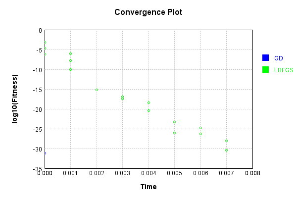

# BiasMetaLayer
## BiasMetaLayerTest
### Json Serialization
Code from [JsonTest.java:36](../../../../../../../src/main/java/com/simiacryptus/mindseye/test/unit/JsonTest.java#L36) executed in 0.00 seconds: 
```java
    JsonObject json = layer.getJson();
    NNLayer echo = NNLayer.fromJson(json);
    if ((echo == null)) throw new AssertionError("Failed to deserialize");
    if ((layer == echo)) throw new AssertionError("Serialization did not copy");
    if ((!layer.equals(echo))) throw new AssertionError("Serialization not equal");
    return new GsonBuilder().setPrettyPrinting().create().toJson(json);
```

Returns: 

```
    {
      "class": "com.simiacryptus.mindseye.layers.java.BiasMetaLayer",
      "id": "350fbcc5-26a9-4d5d-9e91-7b126290bdb1",
      "isFrozen": false,
      "name": "BiasMetaLayer/350fbcc5-26a9-4d5d-9e91-7b126290bdb1"
    }
```


### Example Input/Output Pair
Code from [ReferenceIO.java:68](../../../../../../../src/main/java/com/simiacryptus/mindseye/test/unit/ReferenceIO.java#L68) executed in 0.00 seconds: 
```java
    SimpleEval eval = SimpleEval.run(layer, inputPrototype);
    return String.format("--------------------\nInput: \n[%s]\n--------------------\nOutput: \n%s\n--------------------\nDerivative: \n%s",
      Arrays.stream(inputPrototype).map(t -> t.prettyPrint()).reduce((a, b) -> a + ",\n" + b).get(),
      eval.getOutput().prettyPrint(),
      Arrays.stream(eval.getDerivative()).map(t -> t.prettyPrint()).reduce((a, b) -> a + ",\n" + b).get());
```

Returns: 

```
    --------------------
    Input: 
    [[ -0.056, -1.6, -0.24 ],
    [ 1.88, -0.084, 0.196 ]]
    --------------------
    Output: 
    [ 1.8239999999999998, -1.6840000000000002, -0.043999999999999984 ]
    --------------------
    Derivative: 
    [ 1.0, 1.0, 1.0 ],
    [ 1.0, 1.0, 1.0 ]
```


Code from [SingleDerivativeTester.java:77](../../../../../../../src/main/java/com/simiacryptus/mindseye/test/unit/SingleDerivativeTester.java#L77) executed in 0.00 seconds: 
```java
    return test(component, inputPrototype);
```
Logging: 
```
    Inputs: [ -1.384, -0.944, -1.748 ],
    [ -0.98, -0.448, 1.624 ]
    Inputs Statistics: {meanExponent=0.11954983757239739, negative=3, min=-1.748, max=-1.748, mean=-1.3586666666666665, count=3.0, positive=0, stdDev=0.328720076796184, zeros=0},
    {meanExponent=-0.04896996180140154, negative=2, min=1.624, max=1.624, mean=0.0653333333333334, count=3.0, positive=1, stdDev=1.1233394658586315, zeros=0}
    Output: [ -2.364, -1.392, -0.12399999999999989 ]
    Outputs Statistics: {meanExponent=-0.12976386911800142, negative=3, min=-0.12399999999999989, max=-0.12399999999999989, mean=-1.2933333333333332, count=3.0, positive=0, stdDev=0.917133699207603, zeros=0}
    Feedback for input 0
    Inputs Values: [ -1.384, -0.944, -1.748 ]
    Value Statistics: {meanExponent=0.11954983757239739, negative=3, min=-1.748, max=-1.748, mean=-1.3586666666666665, count=3.0, positive=0, stdDev=0.328720076796184, zeros=0}
    Implemented Feedback: [ [ 1.0, 0.0, 0.0 ], [ 0.0, 1.0, 0.0 ], [ 0.0, 0.0, 1.0 ] ]
    Implemented Statistics: {meanExponent=0.0, negative=0, 
```
...[skipping 1103 bytes](etc/247.txt)...
```
    
    Implemented Statistics: {meanExponent=0.0, negative=0, min=1.0, max=1.0, mean=0.3333333333333333, count=9.0, positive=3, stdDev=0.4714045207910317, zeros=6}
    Measured Feedback: [ [ 0.9999999999976694, 0.0, 0.0 ], [ 0.0, 0.9999999999998899, 0.0 ], [ 0.0, 0.0, 0.9999999999998899 ] ]
    Measured Statistics: {meanExponent=-3.692731311925336E-13, negative=0, min=0.9999999999998899, max=0.9999999999998899, mean=0.33333333333304993, count=9.0, positive=3, stdDev=0.47140452079063083, zeros=6}
    Feedback Error: [ [ -2.3305801732931286E-12, 0.0, 0.0 ], [ 0.0, -1.1013412404281553E-13, 0.0 ], [ 0.0, 0.0, -1.1013412404281553E-13 ] ]
    Error Statistics: {meanExponent=-12.516230716189696, negative=3, min=-1.1013412404281553E-13, max=-1.1013412404281553E-13, mean=-2.834276023754177E-13, count=9.0, positive=0, stdDev=7.251729404930389E-13, zeros=6}
    Finite-Difference Derivative Accuracy:
    absoluteTol: 2.8343e-13 +- 7.2517e-13 [0.0000e+00 - 2.3306e-12] (18#)
    relativeTol: 4.2514e-13 +- 5.2336e-13 [5.5067e-14 - 1.1653e-12] (6#)
    
```

Returns: 

```
    ToleranceStatistics{absoluteTol=2.8343e-13 +- 7.2517e-13 [0.0000e+00 - 2.3306e-12] (18#), relativeTol=4.2514e-13 +- 5.2336e-13 [5.5067e-14 - 1.1653e-12] (6#)}
```


### Performance
Now we execute larger-scale runs to benchmark performance:

Code from [PerformanceTester.java:66](../../../../../../../src/main/java/com/simiacryptus/mindseye/test/unit/PerformanceTester.java#L66) executed in 0.00 seconds: 
```java
    test(component, inputPrototype);
```
Logging: 
```
    100 batches
    Input Dimensions:
    	[3]
    	[3]
    Performance:
    	Evaluation performance: 0.000167s +- 0.000027s [0.000133s - 0.000206s]
    	Learning performance: 0.000038s +- 0.000002s [0.000036s - 0.000042s]
    
```

### Input Learning
In this test, we use a network to learn this target input, given it's pre-evaluated output:

Code from [LearningTester.java:127](../../../../../../../src/main/java/com/simiacryptus/mindseye/test/unit/LearningTester.java#L127) executed in 0.00 seconds: 
```java
    return Arrays.stream(input_target).map(x -> x.prettyPrint()).reduce((a, b) -> a + "\n" + b).orElse("");
```

Returns: 

```
    [ -1.852, 1.24, -1.316 ]
    [ -0.356, 1.016, -1.432 ]
```


First, we use a conjugate gradient descent method, which converges the fastest for purely linear functions.

Code from [LearningTester.java:300](../../../../../../../src/main/java/com/simiacryptus/mindseye/test/unit/LearningTester.java#L300) executed in 0.00 seconds: 
```java
    return new IterativeTrainer(trainable)
      .setLineSearchFactory(label -> new QuadraticSearch())
      .setOrientation(new GradientDescent())
      .setMonitor(monitor)
      .setTimeout(30, TimeUnit.SECONDS)
      .setMaxIterations(250)
      .setTerminateThreshold(0)
      .run();
```
Logging: 
```
    Constructing line search parameters: GD
    F(0.0) = LineSearchPoint{point=PointSample{avg=0.3812959999999999}, derivative=-2.033578666666666}
    New Minimum: 0.3812959999999999 > 0.381295999796642
    F(1.0E-10) = LineSearchPoint{point=PointSample{avg=0.381295999796642}, derivative=-2.033578666124378}, delta = -2.0335788608605299E-10
    New Minimum: 0.381295999796642 > 0.3812959985764948
    F(7.000000000000001E-10) = LineSearchPoint{point=PointSample{avg=0.3812959985764948}, derivative=-2.0335786628706525}, delta = -1.4235050915800684E-9
    New Minimum: 0.3812959985764948 > 0.3812959900354645
    F(4.900000000000001E-9) = LineSearchPoint{point=PointSample{avg=0.3812959900354645}, derivative=-2.0335786400945715}, delta = -9.964535419015874E-9
    New Minimum: 0.3812959900354645 > 0.38129593024825476
    F(3.430000000000001E-8) = LineSearchPoint{point=PointSample{avg=0.38129593024825476}, derivative=-2.033578480662004}, delta = -6.975174515755356E-8
    New Minimum: 0.38129593024825476 > 0.38129551173791826
    F(2.4010000000000004E-7) = 
```
...[skipping 1523 bytes](etc/248.txt)...
```
    delta = -0.2960925658276594
    F(1.3841287201) = LineSearchPoint{point=PointSample{avg=2.7611680971406742}, derivative=5.472380365642661}, delta = 2.3798720971406744
    Loops = 12
    New Minimum: 0.08520343417234051 > 6.573840876841765E-32
    F(0.37499999999999983) = LineSearchPoint{point=PointSample{avg=6.573840876841765E-32}, derivative=-7.547542837629508E-16}, delta = -0.3812959999999999
    Left bracket at 0.37499999999999983
    Converged to left
    Iteration 1 complete. Error: 6.573840876841765E-32 Total: 249768880666311.1200; Orientation: 0.0000; Line Search: 0.0015
    Zero gradient: 5.921189464667501E-16
    F(0.0) = LineSearchPoint{point=PointSample{avg=6.573840876841765E-32}, derivative=-3.506048467648941E-31}
    New Minimum: 6.573840876841765E-32 > 0.0
    F(0.37499999999999983) = LineSearchPoint{point=PointSample{avg=0.0}, derivative=0.0}, delta = -6.573840876841765E-32
    0.0 <= 6.573840876841765E-32
    Converged to right
    Iteration 2 complete. Error: 0.0 Total: 249768880909967.1200; Orientation: 0.0000; Line Search: 0.0002
    
```

Returns: 

```
    0.0
```


Training Converged

Next, we run the same optimization using L-BFGS, which is nearly ideal for purely second-order or quadratic functions.

Code from [LearningTester.java:324](../../../../../../../src/main/java/com/simiacryptus/mindseye/test/unit/LearningTester.java#L324) executed in 0.01 seconds: 
```java
    return new IterativeTrainer(trainable)
      .setLineSearchFactory(label -> new ArmijoWolfeSearch())
      .setOrientation(new LBFGS())
      .setMonitor(monitor)
      .setTimeout(30, TimeUnit.SECONDS)
      .setMaxIterations(250)
      .setTerminateThreshold(0)
      .run();
```
Logging: 
```
    LBFGS Accumulation History: 1 points
    Constructing line search parameters: GD
    th(0)=0.3812959999999999;dx=-2.033578666666666
    Armijo: th(2.154434690031884)=8.585464950922098; dx=9.649654465001202 delta=-8.204168950922098
    Armijo: th(1.077217345015942)=1.3370351316366618; dx=3.8080378991672674 delta=-0.9557391316366619
    New Minimum: 0.3812959999999999 > 6.878563623567488E-4
    END: th(0.3590724483386473)=6.878563623567488E-4; dx=-0.08637314472202173 delta=0.38060814363764317
    Iteration 1 complete. Error: 6.878563623567488E-4 Total: 249768884195198.1200; Orientation: 0.0001; Line Search: 0.0003
    LBFGS Accumulation History: 1 points
    th(0)=6.878563623567488E-4;dx=-0.0036685672659026603
    Armijo: th(0.7735981389354633)=7.771516197008602E-4; dx=0.0038994242259956335 delta=-8.929525734411138E-5
    New Minimum: 6.878563623567488E-4 > 6.809743273116807E-7
    WOLF (strong): th(0.3867990694677316)=6.809743273116807E-7; dx=1.1542848004649379E-4 delta=6.871753880294371E-4
    END: th(0.12893302315591054)=2.9617056263549213E-4; dx
```
...[skipping 7505 bytes](etc/249.txt)...
```
    al: 249768891099654.1000; Orientation: 0.0000; Line Search: 0.0005
    LBFGS Accumulation History: 1 points
    th(0)=9.499200067036351E-29;dx=-5.06624003575272E-28
    New Minimum: 9.499200067036351E-29 > 6.961697488575429E-29
    WOLF (strong): th(0.699506419031633)=6.961697488575429E-29; dx=4.33698195448174E-28 delta=2.5375025784609217E-29
    New Minimum: 6.961697488575429E-29 > 3.944304526105059E-31
    END: th(0.3497532095158165)=3.944304526105059E-31; dx=-3.1905041055605365E-29 delta=9.4597570217753E-29
    Iteration 17 complete. Error: 3.944304526105059E-31 Total: 249768891686140.1000; Orientation: 0.0000; Line Search: 0.0003
    LBFGS Accumulation History: 1 points
    th(0)=3.944304526105059E-31;dx=-2.1036290805893647E-30
    Armijo: th(0.7535204475308647)=3.944304526105059E-31; dx=2.1036290805893647E-30 delta=0.0
    New Minimum: 3.944304526105059E-31 > 0.0
    END: th(0.37676022376543233)=0.0; dx=0.0 delta=3.944304526105059E-31
    Iteration 18 complete. Error: 0.0 Total: 249768892062596.1000; Orientation: 0.0000; Line Search: 0.0003
    
```

Returns: 

```
    0.0
```


Training Converged

Code from [LearningTester.java:96](../../../../../../../src/main/java/com/simiacryptus/mindseye/test/unit/LearningTester.java#L96) executed in 0.00 seconds: 
```java
    return TestUtil.compare(runs);
```

Returns: 


Code from [LearningTester.java:99](../../../../../../../src/main/java/com/simiacryptus/mindseye/test/unit/LearningTester.java#L99) executed in 0.00 seconds: 
```java
    return TestUtil.compareTime(runs);
```

Returns: 




