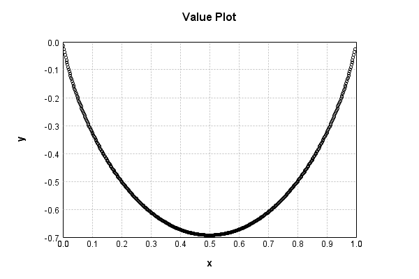
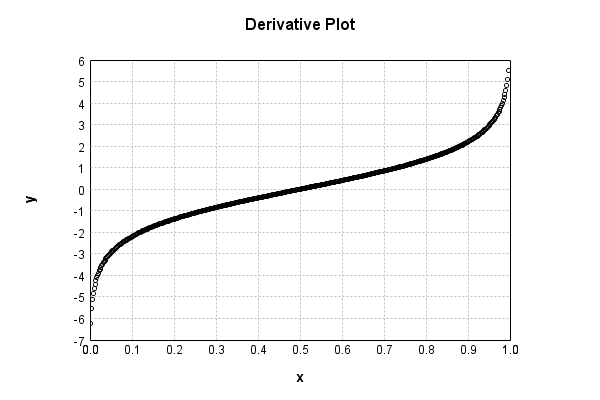

# BinaryEntropyActivationLayer
## BinaryEntropyActivationLayerTest
### Json Serialization
Code from [StandardLayerTests.java:68](../../../../../../../src/main/java/com/simiacryptus/mindseye/test/StandardLayerTests.java#L68) executed in 0.00 seconds: 
```java
    JsonObject json = layer.getJson();
    NNLayer echo = NNLayer.fromJson(json);
    if ((echo == null)) throw new AssertionError("Failed to deserialize");
    if ((layer == echo)) throw new AssertionError("Serialization did not copy");
    if ((!layer.equals(echo))) throw new AssertionError("Serialization not equal");
    return new GsonBuilder().setPrettyPrinting().create().toJson(json);
```

Returns: 

```
    {
      "class": "com.simiacryptus.mindseye.layers.java.BinaryEntropyActivationLayer",
      "id": "e56fd2c0-9db1-47f0-9eda-6897eed2acf3",
      "isFrozen": true,
      "name": "BinaryEntropyActivationLayer/e56fd2c0-9db1-47f0-9eda-6897eed2acf3"
    }
```


### Example Input/Output Pair
Code from [StandardLayerTests.java:152](../../../../../../../src/main/java/com/simiacryptus/mindseye/test/StandardLayerTests.java#L152) executed in 0.00 seconds: 
```java
    SimpleEval eval = SimpleEval.run(layer, inputPrototype);
    return String.format("--------------------\nInput: \n[%s]\n--------------------\nOutput: \n%s\n--------------------\nDerivative: \n%s",
      Arrays.stream(inputPrototype).map(t -> t.prettyPrint()).reduce((a, b) -> a + ",\n" + b).get(),
      eval.getOutput().prettyPrint(),
      Arrays.stream(eval.getDerivative()).map(t -> t.prettyPrint()).reduce((a, b) -> a + ",\n" + b).get());
```

Returns: 

```
    --------------------
    Input: 
    [[
    	[ [ 0.27901523070047074 ], [ 0.14892616052142835 ], [ 0.19126425031358366 ] ],
    	[ [ 0.16476831512317797 ], [ 0.29990456715140534 ], [ 0.17531030256150776 ] ]
    ]]
    --------------------
    Output: 
    [
    	[ [ -0.5920208337386097 ], [ -0.42084187370996873 ], [ -0.4880509565140566 ] ],
    	[ [ -0.4474929168198493 ], [ -0.6107834203208006 ], [ -0.4642072608596643 ] ]
    ]
    --------------------
    Derivative: 
    [
    	[ [ -0.9493516419949957 ], [ -1.7430482765628865 ], [ -1.4418162441141378 ] ],
    	[ [ -1.6231688168939062 ], [ -0.847752343838477 ], [ -1.5484496300352621 ] ]
    ]
```


### Batch Execution
Code from [StandardLayerTests.java:101](../../../../../../../src/main/java/com/simiacryptus/mindseye/test/StandardLayerTests.java#L101) executed in 0.00 seconds: 
```java
    return getBatchingTester().test(layer, inputPrototype);
```

Returns: 

```
    ToleranceStatistics{absoluteTol=0.0000e+00 +- 0.0000e+00 [0.0000e+00 - 0.0000e+00] (120#), relativeTol=0.0000e+00 +- 0.0000e+00 [0.0000e+00 - 0.0000e+00] (120#)}
```


### Differential Validation
Code from [StandardLayerTests.java:109](../../../../../../../src/main/java/com/simiacryptus/mindseye/test/StandardLayerTests.java#L109) executed in 0.00 seconds: 
```java
    return getDerivativeTester().test(layer, inputPrototype);
```
Logging: 
```
    Inputs: [
    	[ [ 0.21433367749278487 ], [ 0.2734624334287134 ], [ 0.11070723310200013 ] ],
    	[ [ 0.1090241412211956 ], [ 0.17333839403983947 ], [ 0.22113851079396363 ] ]
    ]
    Inputs Statistics: {meanExponent=-0.7611256816888593, negative=0, min=0.22113851079396363, max=0.22113851079396363, mean=0.18366739834641618, count=6.0, positive=6, stdDev=0.059734332878853796, zeros=0}
    Output: [
    	[ [ -0.5196421500780007 ], [ -0.5866723237762805 ], [ -0.3479914284739435 ] ],
    	[ [ -0.3444701925647582 ], [ -0.4611403722762677 ], [ -0.5283451640966478 ] ]
    ]
    Outputs Statistics: {meanExponent=-0.3417381584842196, negative=6, min=-0.5283451640966478, max=-0.5283451640966478, mean=-0.46471027187764974, count=6.0, positive=0, stdDev=0.09131936825914798, zeros=0}
    Feedback for input 0
    Inputs Values: [
    	[ [ 0.21433367749278487 ], [ 0.2734624334287134 ], [ 0.11070723310200013 ] ],
    	[ [ 0.1090241412211956 ], [ 0.17333839403983947 ], [ 0.22113851079396363 ] ]
    ]
    Value Statistics: {meanExponent=-0.7611256816888593, negative=0, min=0.221
```
...[skipping 887 bytes](etc/101.txt)...
```
    0.0, 0.0, 0.0, 0.0, -2.0830295933299547, 0.0 ], [ 0.0, 0.0, 0.0, 0.0, 0.0, -1.2587537057195952 ] ]
    Measured Statistics: {meanExponent=0.17297955824797365, negative=6, min=-1.2587537057195952, max=-1.2587537057195952, mean=-0.2577609184840901, count=36.0, positive=0, stdDev=0.6014500711331595, zeros=30}
    Feedback Error: [ [ 2.968877970410677E-4, 0.0, 0.0, 0.0, 0.0, 0.0 ], [ 0.0, 5.145942121913549E-4, 0.0, 0.0, 0.0, 0.0 ], [ 0.0, 0.0, 2.5164091086837814E-4, 0.0, 0.0, 0.0 ], [ 0.0, 0.0, 0.0, 3.4888434239732646E-4, 0.0, 0.0 ], [ 0.0, 0.0, 0.0, 0.0, 5.077323097006925E-4, 0.0 ], [ 0.0, 0.0, 0.0, 0.0, 0.0, 2.902675758011952E-4 ] ]
    Error Statistics: {meanExponent=-3.4506744502061673, negative=0, min=2.902675758011952E-4, max=2.902675758011952E-4, mean=6.138908744444486E-5, count=36.0, positive=6, stdDev=1.4379480378684517E-4, zeros=30}
    Finite-Difference Derivative Accuracy:
    absoluteTol: 6.1389e-05 +- 1.4379e-04 [0.0000e+00 - 5.1459e-04] (36#)
    relativeTol: 1.1907e-04 +- 5.8539e-06 [1.1168e-04 - 1.2878e-04] (6#)
    
```

Returns: 

```
    ToleranceStatistics{absoluteTol=6.1389e-05 +- 1.4379e-04 [0.0000e+00 - 5.1459e-04] (36#), relativeTol=1.1907e-04 +- 5.8539e-06 [1.1168e-04 - 1.2878e-04] (6#)}
```


### Performance
Code from [StandardLayerTests.java:119](../../../../../../../src/main/java/com/simiacryptus/mindseye/test/StandardLayerTests.java#L119) executed in 0.17 seconds: 
```java
    getPerformanceTester().test(layer, permPrototype);
```
Logging: 
```
    100 batches
    Input Dimensions:
    	[100, 100, 1]
    Performance:
    	Evaluation performance: 0.014851s +- 0.014543s [0.007278s - 0.043931s]
    	Learning performance: 0.010035s +- 0.000314s [0.009745s - 0.010496s]
    
```

### Function Plots
Code from [ActivationLayerTestBase.java:110](../../../../../../../src/test/java/com/simiacryptus/mindseye/layers/java/ActivationLayerTestBase.java#L110) executed in 0.00 seconds: 
```java
    return plot("Value Plot", plotData, x -> new double[]{x[0], x[1]});
```

Returns: 




Code from [ActivationLayerTestBase.java:114](../../../../../../../src/test/java/com/simiacryptus/mindseye/layers/java/ActivationLayerTestBase.java#L114) executed in 0.00 seconds: 
```java
    return plot("Derivative Plot", plotData, x -> new double[]{x[0], x[2]});
```

Returns: 




