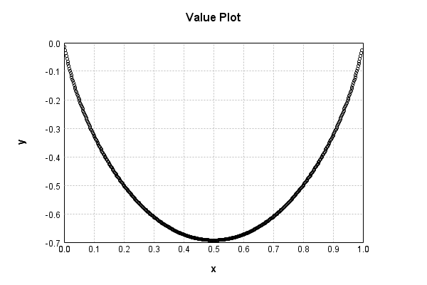
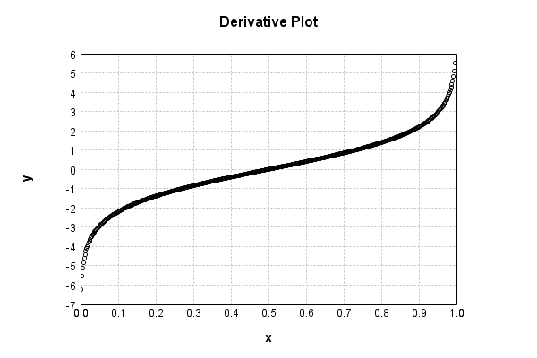

# BinaryEntropyActivationLayer
## BinaryEntropyActivationLayerTest
### Json Serialization
Code from [StandardLayerTests.java:69](../../../../../../../src/main/java/com/simiacryptus/mindseye/test/StandardLayerTests.java#L69) executed in 0.00 seconds: 
```java
    JsonObject json = layer.getJson();
    NNLayer echo = NNLayer.fromJson(json);
    if ((echo == null)) throw new AssertionError("Failed to deserialize");
    if ((layer == echo)) throw new AssertionError("Serialization did not copy");
    if ((!layer.equals(echo))) throw new AssertionError("Serialization not equal");
    return new GsonBuilder().setPrettyPrinting().create().toJson(json);
```

Returns: 

```
    {
      "class": "com.simiacryptus.mindseye.layers.java.BinaryEntropyActivationLayer",
      "id": "ca03029d-0081-4d35-b0b4-e7ac8b0d29f5",
      "isFrozen": true,
      "name": "BinaryEntropyActivationLayer/ca03029d-0081-4d35-b0b4-e7ac8b0d29f5"
    }
```


### Example Input/Output Pair
Code from [StandardLayerTests.java:153](../../../../../../../src/main/java/com/simiacryptus/mindseye/test/StandardLayerTests.java#L153) executed in 0.00 seconds: 
```java
    SimpleEval eval = SimpleEval.run(layer, inputPrototype);
    return String.format("--------------------\nInput: \n[%s]\n--------------------\nOutput: \n%s\n--------------------\nDerivative: \n%s",
      Arrays.stream(inputPrototype).map(t -> t.prettyPrint()).reduce((a, b) -> a + ",\n" + b).get(),
      eval.getOutput().prettyPrint(),
      Arrays.stream(eval.getDerivative()).map(t -> t.prettyPrint()).reduce((a, b) -> a + ",\n" + b).get());
```

Returns: 

```
    --------------------
    Input: 
    [[
    	[ [ 0.15203526856482308 ], [ 0.21179184954674102 ], [ 0.2264205449510979 ] ],
    	[ [ 0.28592732955330036 ], [ 0.17495540143395505 ], [ 0.2392309217277191 ] ]
    ]]
    --------------------
    Output: 
    [
    	[ [ -0.4262232825041623 ], [ -0.5163210810462939 ], [ -0.5349149400237627 ] ],
    	[ [ -0.5984646874971953 ], [ -0.46365727850941985 ], [ -0.5501918047484219 ] ]
    ]
    --------------------
    Derivative: 
    [
    	[ [ -1.7187265206750941 ], [ -1.31415825470872 ], [ -1.2286342977348372 ] ],
    	[ [ -0.9152470504356198 ], [ -1.5509063512463124 ], [ -1.156900581545608 ] ]
    ]
```


### Batch Execution
Code from [StandardLayerTests.java:102](../../../../../../../src/main/java/com/simiacryptus/mindseye/test/StandardLayerTests.java#L102) executed in 0.00 seconds: 
```java
    return getBatchingTester().test(layer, inputPrototype);
```

Returns: 

```
    ToleranceStatistics{absoluteTol=0.0000e+00 +- 0.0000e+00 [0.0000e+00 - 0.0000e+00] (120#), relativeTol=0.0000e+00 +- 0.0000e+00 [0.0000e+00 - 0.0000e+00] (120#)}
```


### Differential Validation
Code from [StandardLayerTests.java:110](../../../../../../../src/main/java/com/simiacryptus/mindseye/test/StandardLayerTests.java#L110) executed in 0.00 seconds: 
```java
    return getDerivativeTester().test(layer, inputPrototype);
```
Logging: 
```
    Inputs: [
    	[ [ 0.2979283621969768 ], [ 0.298508202148451 ], [ 0.2610695657070281 ] ],
    	[ [ 0.20182805620889832 ], [ 0.23241513329767674 ], [ 0.1392704331988549 ] ]
    ]
    Inputs Statistics: {meanExponent=-0.6365117947233142, negative=0, min=0.1392704331988549, max=0.1392704331988549, mean=0.2385032921263143, count=6.0, positive=6, stdDev=0.056080988729731225, zeros=0}
    Output: [
    	[ [ -0.6090987759816588 ], [ -0.6095950011755482 ], [ -0.5741726789693694 ] ],
    	[ [ -0.502926228205882 ], [ -0.5421781465828255 ], [ -0.4036368961324767 ] ]
    ]
    Outputs Statistics: {meanExponent=-0.2715985335030969, negative=6, min=-0.4036368961324767, max=-0.4036368961324767, mean=-0.5402679545079602, count=6.0, positive=0, stdDev=0.07160022252640567, zeros=0}
    Feedback for input 0
    Inputs Values: [
    	[ [ 0.2979283621969768 ], [ 0.298508202148451 ], [ 0.2610695657070281 ] ],
    	[ [ 0.20182805620889832 ], [ 0.23241513329767674 ], [ 0.1392704331988549 ] ]
    ]
    Value Statistics: {meanExponent=-0.6365117947233142, negative=0, min=0.13927043319885
```
...[skipping 873 bytes](etc/60.txt)...
```
    0, 0.0, 0.0, 0.0, -1.0401577107044258, 0.0 ], [ 0.0, 0.0, 0.0, 0.0, 0.0, -1.8209457371937132 ] ]
    Measured Statistics: {meanExponent=0.05953923595857901, negative=6, min=-1.8209457371937132, max=-1.8209457371937132, mean=-0.19836836331960403, count=36.0, positive=0, stdDev=0.4643199573270079, zeros=30}
    Feedback Error: [ [ 2.390279895347902E-4, 0.0, 0.0, 0.0, 0.0, 0.0 ], [ 0.0, 3.103404821864775E-4, 0.0, 0.0, 0.0, 0.0 ], [ 0.0, 0.0, 2.387609412302094E-4, 0.0, 0.0, 0.0 ], [ 0.0, 0.0, 0.0, 2.802436483562154E-4, 0.0, 0.0 ], [ 0.0, 0.0, 0.0, 0.0, 2.591638068056845E-4, 0.0 ], [ 0.0, 0.0, 0.0, 0.0, 0.0, 4.1702035535040594E-4 ] ]
    Error Statistics: {meanExponent=-3.5450803576152956, negative=0, min=4.1702035535040594E-4, max=4.1702035535040594E-4, mean=4.845992287399397E-5, count=36.0, positive=6, stdDev=1.1124542827088144E-4, zeros=30}
    Finite-Difference Derivative Accuracy:
    absoluteTol: 4.8460e-05 +- 1.1125e-04 [0.0000e+00 - 4.1702e-04] (36#)
    relativeTol: 1.2474e-04 +- 1.1125e-05 [1.1287e-04 - 1.3974e-04] (6#)
    
```

Returns: 

```
    ToleranceStatistics{absoluteTol=4.8460e-05 +- 1.1125e-04 [0.0000e+00 - 4.1702e-04] (36#), relativeTol=1.2474e-04 +- 1.1125e-05 [1.1287e-04 - 1.3974e-04] (6#)}
```


### Performance
Code from [StandardLayerTests.java:120](../../../../../../../src/main/java/com/simiacryptus/mindseye/test/StandardLayerTests.java#L120) executed in 0.00 seconds: 
```java
    getPerformanceTester().test(layer, permPrototype);
```
Logging: 
```
    Evaluation performance: 0.000208s +- 0.000012s [0.000193s - 0.000222s]
    Learning performance: 0.000044s +- 0.000003s [0.000039s - 0.000050s]
    
```

### Function Plots
Code from [ActivationLayerTestBase.java:103](../../../../../../../src/test/java/com/simiacryptus/mindseye/layers/java/ActivationLayerTestBase.java#L103) executed in 0.01 seconds: 
```java
    return plot("Value Plot", plotData, x -> new double[]{x[0], x[1]});
```

Returns: 




Code from [ActivationLayerTestBase.java:107](../../../../../../../src/test/java/com/simiacryptus/mindseye/layers/java/ActivationLayerTestBase.java#L107) executed in 0.01 seconds: 
```java
    return plot("Derivative Plot", plotData, x -> new double[]{x[0], x[2]});
```

Returns: 




