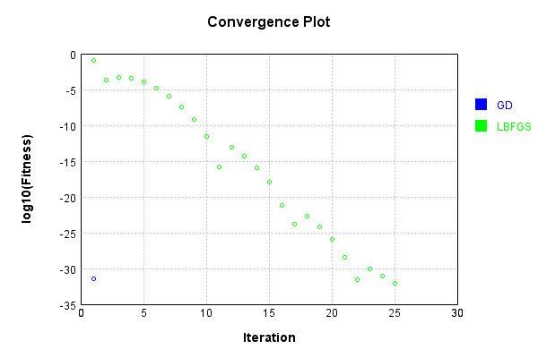
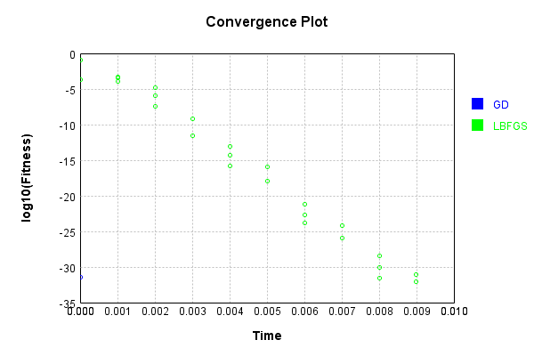

# CrossDifferenceLayer
## CrossDifferenceLayerTest
### Json Serialization
Code from [JsonTest.java:36](../../../../../../../src/main/java/com/simiacryptus/mindseye/test/unit/JsonTest.java#L36) executed in 0.00 seconds: 
```java
    JsonObject json = layer.getJson();
    NNLayer echo = NNLayer.fromJson(json);
    if ((echo == null)) throw new AssertionError("Failed to deserialize");
    if ((layer == echo)) throw new AssertionError("Serialization did not copy");
    if ((!layer.equals(echo))) throw new AssertionError("Serialization not equal");
    return new GsonBuilder().setPrettyPrinting().create().toJson(json);
```

Returns: 

```
    {
      "class": "com.simiacryptus.mindseye.layers.java.CrossDifferenceLayer",
      "id": "b0b3120d-edb6-4a04-8893-a539240dc7a1",
      "isFrozen": false,
      "name": "CrossDifferenceLayer/b0b3120d-edb6-4a04-8893-a539240dc7a1"
    }
```


### Example Input/Output Pair
Code from [ReferenceIO.java:68](../../../../../../../src/main/java/com/simiacryptus/mindseye/test/unit/ReferenceIO.java#L68) executed in 0.00 seconds: 
```java
    SimpleEval eval = SimpleEval.run(layer, inputPrototype);
    return String.format("--------------------\nInput: \n[%s]\n--------------------\nOutput: \n%s\n--------------------\nDerivative: \n%s",
      Arrays.stream(inputPrototype).map(t -> t.prettyPrint()).reduce((a, b) -> a + ",\n" + b).get(),
      eval.getOutput().prettyPrint(),
      Arrays.stream(eval.getDerivative()).map(t -> t.prettyPrint()).reduce((a, b) -> a + ",\n" + b).get());
```

Returns: 

```
    --------------------
    Input: 
    [[ -1.332, 0.676, 1.336, -1.568 ]]
    --------------------
    Output: 
    [ -2.008, -2.668, 0.236, -0.66, 2.244, 2.904 ]
    --------------------
    Derivative: 
    [ 3.0, 1.0, -1.0, -3.0 ]
```


### Batch Execution
Code from [BatchingTester.java:66](../../../../../../../src/main/java/com/simiacryptus/mindseye/test/unit/BatchingTester.java#L66) executed in 0.00 seconds: 
```java
    return test(reference, inputPrototype);
```

Returns: 

```
    ToleranceStatistics{absoluteTol=0.0000e+00 +- 0.0000e+00 [0.0000e+00 - 0.0000e+00] (100#), relativeTol=0.0000e+00 +- 0.0000e+00 [0.0000e+00 - 0.0000e+00] (100#)}
```


Code from [SingleDerivativeTester.java:77](../../../../../../../src/main/java/com/simiacryptus/mindseye/test/unit/SingleDerivativeTester.java#L77) executed in 0.00 seconds: 
```java
    return test(component, inputPrototype);
```
Logging: 
```
    Inputs: [ -1.0, -1.7, 1.284, 1.224 ]
    Inputs Statistics: {meanExponent=0.1066988407301627, negative=2, min=1.224, max=1.224, mean=-0.04800000000000004, count=4.0, positive=2, stdDev=1.325482553638485, zeros=0}
    Output: [ 0.7, -2.284, -2.224, -2.984, -2.924, 0.06000000000000005 ]
    Outputs Statistics: {meanExponent=0.044976059994697525, negative=4, min=0.06000000000000005, max=0.06000000000000005, mean=-1.609333333333333, count=6.0, positive=2, stdDev=1.4474541635421676, zeros=0}
    Feedback for input 0
    Inputs Values: [ -1.0, -1.7, 1.284, 1.224 ]
    Value Statistics: {meanExponent=0.1066988407301627, negative=2, min=1.224, max=1.224, mean=-0.04800000000000004, count=4.0, positive=2, stdDev=1.325482553638485, zeros=0}
    Implemented Feedback: [ [ 1.0, 1.0, 1.0, 0.0, 0.0, 0.0 ], [ -1.0, 0.0, 0.0, 1.0, 1.0, 0.0 ], [ 0.0, -1.0, 0.0, -1.0, 0.0, 1.0 ], [ 0.0, 0.0, -1.0, 0.0, -1.0, -1.0 ] ]
    Implemented Statistics: {meanExponent=0.0, negative=6, min=-1.0, max=-1.0, mean=0.0, count=24.0, positive=6, stdDev=0.707106781186547
```
...[skipping 296 bytes](etc/254.txt)...
```
    9999976694, 0.0, -1.0000000000021103, -0.9999999999998899 ] ]
    Measured Statistics: {meanExponent=-4.7830642341759385E-14, negative=6, min=-0.9999999999998899, max=-0.9999999999998899, mean=0.0, count=24.0, positive=6, stdDev=0.7071067811864696, zeros=12}
    Feedback Error: [ [ -1.1013412404281553E-13, -2.3305801732931286E-12, 2.1103119252074976E-12, 0.0, 0.0, 0.0 ], [ 1.1013412404281553E-13, 0.0, 0.0, -2.3305801732931286E-12, 2.1103119252074976E-12, 0.0 ], [ 0.0, -2.1103119252074976E-12, 0.0, 2.3305801732931286E-12, 0.0, -1.1013412404281553E-13 ], [ 0.0, 0.0, 2.3305801732931286E-12, 0.0, -2.1103119252074976E-12, 1.1013412404281553E-13 ] ]
    Error Statistics: {meanExponent=-12.08875579914072, negative=6, min=1.1013412404281553E-13, max=1.1013412404281553E-13, mean=0.0, count=24.0, positive=6, stdDev=1.284338343992649E-12, zeros=12}
    Finite-Difference Derivative Accuracy:
    absoluteTol: 7.5850e-13 +- 1.0364e-12 [0.0000e+00 - 2.3306e-12] (24#)
    relativeTol: 7.5850e-13 +- 4.9943e-13 [5.5067e-14 - 1.1653e-12] (12#)
    
```

Returns: 

```
    ToleranceStatistics{absoluteTol=7.5850e-13 +- 1.0364e-12 [0.0000e+00 - 2.3306e-12] (24#), relativeTol=7.5850e-13 +- 4.9943e-13 [5.5067e-14 - 1.1653e-12] (12#)}
```


### Performance
Now we execute larger-scale runs to benchmark performance:

Code from [PerformanceTester.java:66](../../../../../../../src/main/java/com/simiacryptus/mindseye/test/unit/PerformanceTester.java#L66) executed in 0.00 seconds: 
```java
    test(component, inputPrototype);
```
Logging: 
```
    100 batches
    Input Dimensions:
    	[4]
    Performance:
    	Evaluation performance: 0.000329s +- 0.000127s [0.000212s - 0.000563s]
    	Learning performance: 0.000043s +- 0.000004s [0.000039s - 0.000049s]
    
```

### Input Learning
In this test, we use a network to learn this target input, given it's pre-evaluated output:

Code from [LearningTester.java:127](../../../../../../../src/main/java/com/simiacryptus/mindseye/test/unit/LearningTester.java#L127) executed in 0.00 seconds: 
```java
    return Arrays.stream(input_target).map(x -> x.prettyPrint()).reduce((a, b) -> a + "\n" + b).orElse("");
```

Returns: 

```
    [ 0.808, 1.504, 0.932, 1.608 ]
```


First, we use a conjugate gradient descent method, which converges the fastest for purely linear functions.

Code from [LearningTester.java:300](../../../../../../../src/main/java/com/simiacryptus/mindseye/test/unit/LearningTester.java#L300) executed in 0.00 seconds: 
```java
    return new IterativeTrainer(trainable)
      .setLineSearchFactory(label -> new QuadraticSearch())
      .setOrientation(new GradientDescent())
      .setMonitor(monitor)
      .setTimeout(30, TimeUnit.SECONDS)
      .setMaxIterations(250)
      .setTerminateThreshold(0)
      .run();
```
Logging: 
```
    Constructing line search parameters: GD
    F(0.0) = LineSearchPoint{point=PointSample{avg=0.6622506666666667}, derivative=-1.7660017777777768}
    New Minimum: 0.6622506666666667 > 0.6622506664900665
    F(1.0E-10) = LineSearchPoint{point=PointSample{avg=0.6622506664900665}, derivative=-1.76600177754231}, delta = -1.7660017892495716E-10
    New Minimum: 0.6622506664900665 > 0.6622506654304655
    F(7.000000000000001E-10) = LineSearchPoint{point=PointSample{avg=0.6622506654304655}, derivative=-1.7660017761295086}, delta = -1.2362011414523977E-9
    New Minimum: 0.6622506654304655 > 0.662250658013258
    F(4.900000000000001E-9) = LineSearchPoint{point=PointSample{avg=0.662250658013258}, derivative=-1.7660017662398992}, delta = -8.653408656300599E-9
    New Minimum: 0.662250658013258 > 0.6622506060928072
    F(3.430000000000001E-8) = LineSearchPoint{point=PointSample{avg=0.6622506060928072}, derivative=-1.7660016970126295}, delta = -6.057385948388117E-8
    New Minimum: 0.6622506060928072 > 0.6622502426497078
    F(2.4010000000000004E-7) = Lin
```
...[skipping 1472 bytes](etc/255.txt)...
```
    3826}, derivative=-1.3004067719930386}, delta = -0.30316458152128406
    F(1.3841287201) = LineSearchPoint{point=PointSample{avg=0.47342885434302673}, derivative=1.493163262715395}, delta = -0.18882181232363993
    Loops = 12
    New Minimum: 0.3590860851453826 > 3.903218020624798E-32
    F(0.75) = LineSearchPoint{point=PointSample{avg=3.903218020624798E-32}, derivative=-4.2869411724192693E-16}, delta = -0.6622506666666667
    Left bracket at 0.75
    Converged to left
    Iteration 1 complete. Error: 3.903218020624798E-32 Total: 249769821524459.2000; Orientation: 0.0000; Line Search: 0.0019
    Zero gradient: 3.226233312755417E-16
    F(0.0) = LineSearchPoint{point=PointSample{avg=3.903218020624798E-32}, derivative=-1.0408581388332793E-31}
    New Minimum: 3.903218020624798E-32 > 0.0
    F(0.75) = LineSearchPoint{point=PointSample{avg=0.0}, derivative=0.0}, delta = -3.903218020624798E-32
    0.0 <= 3.903218020624798E-32
    Converged to right
    Iteration 2 complete. Error: 0.0 Total: 249769821900346.2000; Orientation: 0.0000; Line Search: 0.0002
    
```

Returns: 

```
    0.0
```


Training Converged

Next, we run the same optimization using L-BFGS, which is nearly ideal for purely second-order or quadratic functions.

Code from [LearningTester.java:324](../../../../../../../src/main/java/com/simiacryptus/mindseye/test/unit/LearningTester.java#L324) executed in 0.01 seconds: 
```java
    return new IterativeTrainer(trainable)
      .setLineSearchFactory(label -> new ArmijoWolfeSearch())
      .setOrientation(new LBFGS())
      .setMonitor(monitor)
      .setTimeout(30, TimeUnit.SECONDS)
      .setMaxIterations(250)
      .setTerminateThreshold(0)
      .run();
```
Logging: 
```
    LBFGS Accumulation History: 1 points
    Constructing line search parameters: GD
    th(0)=0.6622506666666667;dx=-1.7660017777777768
    Armijo: th(2.154434690031884)=2.322217928546677; dx=3.3069788791587844 delta=-1.6599672618800105
    New Minimum: 0.6622506666666667 > 0.1260586089610637
    WOLF (strong): th(1.077217345015942)=0.1260586089610637; dx=0.7704885506905031 delta=0.536192057705603
    END: th(0.3590724483386473)=0.17992538328799726; dx=-0.9205050016216839 delta=0.4823252833786694
    Iteration 1 complete. Error: 0.1260586089610637 Total: 249769825890613.2000; Orientation: 0.0001; Line Search: 0.0006
    LBFGS Accumulation History: 1 points
    th(0)=0.17992538328799726;dx=-0.47980102210132586
    New Minimum: 0.17992538328799726 > 1.7812522142126124E-4
    WOLF (strong): th(0.7735981389354633)=1.7812522142126124E-4; dx=0.015096548241232376 delta=0.179747258066576
    END: th(0.3867990694677316)=0.04219527433212353; dx=-0.2323522369300467 delta=0.13773010895587373
    Iteration 2 complete. Error: 1.7812522142126124E-4 Total: 249769826
```
...[skipping 11581 bytes](etc/256.txt)...
```
    E-31 delta=8.874685183736383E-31
    Iteration 24 complete. Error: 8.833598678256122E-32 Total: 249769835039275.1600; Orientation: 0.0000; Line Search: 0.0003
    LBFGS Accumulation History: 1 points
    th(0)=8.833598678256122E-32;dx=-2.355626314201632E-31
    New Minimum: 8.833598678256122E-32 > 2.2597578014143566E-32
    WOLF (strong): th(1.26828952485066)=2.2597578014143566E-32; dx=1.1504221534473087E-31 delta=6.573840876841766E-32
    New Minimum: 2.2597578014143566E-32 > 8.217301096052206E-33
    END: th(0.63414476242533)=8.217301096052206E-33; dx=-3.286920438420882E-32 delta=8.011868568650901E-32
    Iteration 25 complete. Error: 8.217301096052206E-33 Total: 249769835434825.1600; Orientation: 0.0000; Line Search: 0.0003
    LBFGS Accumulation History: 1 points
    th(0)=8.217301096052206E-33;dx=-2.1912802922805882E-32
    New Minimum: 8.217301096052206E-33 > 0.0
    END: th(1.3662234746711586)=0.0; dx=0.0 delta=8.217301096052206E-33
    Iteration 26 complete. Error: 0.0 Total: 249769835771099.1600; Orientation: 0.0000; Line Search: 0.0002
    
```

Returns: 

```
    0.0
```


Training Converged

Code from [LearningTester.java:96](../../../../../../../src/main/java/com/simiacryptus/mindseye/test/unit/LearningTester.java#L96) executed in 0.00 seconds: 
```java
    return TestUtil.compare(runs);
```

Returns: 




Code from [LearningTester.java:99](../../../../../../../src/main/java/com/simiacryptus/mindseye/test/unit/LearningTester.java#L99) executed in 0.00 seconds: 
```java
    return TestUtil.compareTime(runs);
```

Returns: 




