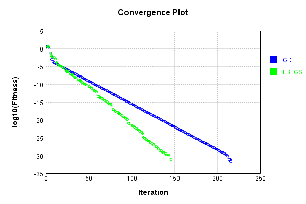
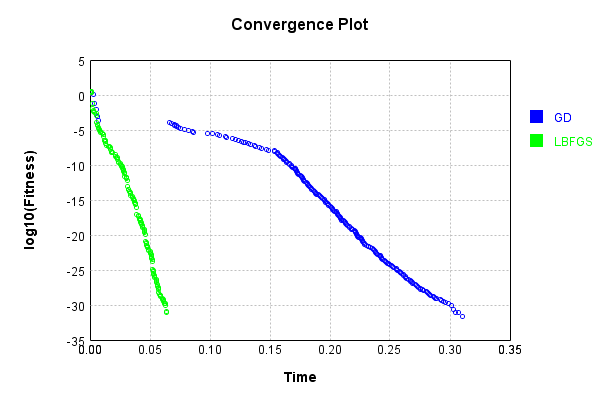

# CrossDotMetaLayer
## CrossDotMetaLayerTest
### Json Serialization
Code from [JsonTest.java:36](../../../../../../../src/main/java/com/simiacryptus/mindseye/test/unit/JsonTest.java#L36) executed in 0.00 seconds: 
```java
    JsonObject json = layer.getJson();
    NNLayer echo = NNLayer.fromJson(json);
    if ((echo == null)) throw new AssertionError("Failed to deserialize");
    if ((layer == echo)) throw new AssertionError("Serialization did not copy");
    if ((!layer.equals(echo))) throw new AssertionError("Serialization not equal");
    return new GsonBuilder().setPrettyPrinting().create().toJson(json);
```

Returns: 

```
    {
      "class": "com.simiacryptus.mindseye.layers.java.CrossDotMetaLayer",
      "id": "b899e5ab-3306-4858-8075-e9eb5c244b85",
      "isFrozen": false,
      "name": "CrossDotMetaLayer/b899e5ab-3306-4858-8075-e9eb5c244b85"
    }
```


### Example Input/Output Pair
Code from [ReferenceIO.java:68](../../../../../../../src/main/java/com/simiacryptus/mindseye/test/unit/ReferenceIO.java#L68) executed in 0.00 seconds: 
```java
    SimpleEval eval = SimpleEval.run(layer, inputPrototype);
    return String.format("--------------------\nInput: \n[%s]\n--------------------\nOutput: \n%s\n--------------------\nDerivative: \n%s",
      Arrays.stream(inputPrototype).map(t -> t.prettyPrint()).reduce((a, b) -> a + ",\n" + b).get(),
      eval.getOutput().prettyPrint(),
      Arrays.stream(eval.getDerivative()).map(t -> t.prettyPrint()).reduce((a, b) -> a + ",\n" + b).get());
```

Returns: 

```
    --------------------
    Input: 
    [[ -0.164, 0.576, 1.14 ]]
    --------------------
    Output: 
    [ [ 0.0, -0.09446399999999999, -0.18696 ], [ -0.09446399999999999, 0.0, 0.6566399999999999 ], [ -0.18696, 0.6566399999999999, 0.0 ] ]
    --------------------
    Derivative: 
    [ 3.4319999999999995, 1.9519999999999997, 0.8239999999999998 ]
```


Code from [SingleDerivativeTester.java:77](../../../../../../../src/main/java/com/simiacryptus/mindseye/test/unit/SingleDerivativeTester.java#L77) executed in 0.00 seconds: 
```java
    return test(component, inputPrototype);
```
Logging: 
```
    Inputs: [ -1.676, -0.648, -1.688 ]
    Inputs Statistics: {meanExponent=0.0877404874848291, negative=3, min=-1.688, max=-1.688, mean=-1.3373333333333333, count=3.0, positive=0, stdDev=0.4874568926810066, zeros=0}
    Output: [ [ 0.0, 1.086048, 2.8290879999999996 ], [ 1.086048, 0.0, 1.093824 ], [ 2.8290879999999996, 1.093824, 0.0 ] ]
    Outputs Statistics: {meanExponent=0.17548097496965812, negative=0, min=0.0, max=0.0, mean=1.113102222222222, count=9.0, positive=6, stdDev=1.0332479110930604, zeros=3}
    Feedback for input 0
    Inputs Values: [ -1.676, -0.648, -1.688 ]
    Value Statistics: {meanExponent=0.0877404874848291, negative=3, min=-1.688, max=-1.688, mean=-1.3373333333333333, count=3.0, positive=0, stdDev=0.4874568926810066, zeros=0}
    Implemented Feedback: [ [ 0.0, -0.648, -1.688, -0.648, 0.0, 0.0, -1.688, 0.0, 0.0 ], [ 0.0, -1.676, 0.0, -1.676, 0.0, -1.688, 0.0, -1.688, 0.0 ], [ 0.0, 0.0, -1.676, 0.0, 0.0, -0.648, -1.676, -0.648, 0.0 ] ]
    Implemented Statistics: {meanExponent=0.0877404874848291, negative=12, min=0.
```
...[skipping 360 bytes](etc/257.txt)...
```
    1.6759999999971242, 0.0, 0.0, -0.6479999999986497, -1.6759999999971242, -0.6479999999986497, 0.0 ] ]
    Measured Statistics: {meanExponent=0.08774048748434833, negative=12, min=0.0, max=0.0, mean=-0.5943703703698628, count=27.0, positive=0, stdDev=0.7397306891394533, zeros=15}
    Feedback Error: [ [ 0.0, 1.350364264851578E-12, 3.1019631308026874E-13, 1.350364264851578E-12, 0.0, 0.0, 3.1019631308026874E-13, 0.0, 0.0 ], [ 0.0, 6.552536291337674E-13, 0.0, 6.552536291337674E-13, 0.0, 3.1019631308026874E-13, 0.0, 3.1019631308026874E-13, 0.0 ], [ 0.0, 0.0, 2.8756996783840805E-12, 0.0, 0.0, 1.350364264851578E-12, 2.8756996783840805E-12, 1.350364264851578E-12, 0.0 ] ]
    Error Statistics: {meanExponent=-12.08011198331691, negative=0, min=0.0, max=0.0, mean=5.075610713615956E-13, count=27.0, positive=12, stdDev=8.192395075082283E-13, zeros=15}
    Finite-Difference Derivative Accuracy:
    absoluteTol: 5.0756e-13 +- 8.1924e-13 [0.0000e+00 - 2.8757e-12] (27#)
    relativeTol: 5.5351e-13 +- 4.3286e-13 [9.1883e-14 - 1.0419e-12] (12#)
    
```

Returns: 

```
    ToleranceStatistics{absoluteTol=5.0756e-13 +- 8.1924e-13 [0.0000e+00 - 2.8757e-12] (27#), relativeTol=5.5351e-13 +- 4.3286e-13 [9.1883e-14 - 1.0419e-12] (12#)}
```


### Performance
Now we execute larger-scale runs to benchmark performance:

Code from [PerformanceTester.java:66](../../../../../../../src/main/java/com/simiacryptus/mindseye/test/unit/PerformanceTester.java#L66) executed in 0.00 seconds: 
```java
    test(component, inputPrototype);
```
Logging: 
```
    100 batches
    Input Dimensions:
    	[3]
    Performance:
    	Evaluation performance: 0.000092s +- 0.000016s [0.000078s - 0.000122s]
    	Learning performance: 0.000003s +- 0.000002s [0.000002s - 0.000007s]
    
```

### Input Learning
In this test, we use a network to learn this target input, given it's pre-evaluated output:

Code from [LearningTester.java:127](../../../../../../../src/main/java/com/simiacryptus/mindseye/test/unit/LearningTester.java#L127) executed in 0.00 seconds: 
```java
    return Arrays.stream(input_target).map(x -> x.prettyPrint()).reduce((a, b) -> a + "\n" + b).orElse("");
```

Returns: 

```
    [ -1.712, 0.76, -1.668 ]
```


First, we use a conjugate gradient descent method, which converges the fastest for purely linear functions.

Code from [LearningTester.java:300](../../../../../../../src/main/java/com/simiacryptus/mindseye/test/unit/LearningTester.java#L300) executed in 0.32 seconds: 
```java
    return new IterativeTrainer(trainable)
      .setLineSearchFactory(label -> new QuadraticSearch())
      .setOrientation(new GradientDescent())
      .setMonitor(monitor)
      .setTimeout(30, TimeUnit.SECONDS)
      .setMaxIterations(250)
      .setTerminateThreshold(0)
      .run();
```
Logging: 
```
    Constructing line search parameters: GD
    F(0.0) = LineSearchPoint{point=PointSample{avg=7.679312966087114}, derivative=-40.127215756808766}
    New Minimum: 7.679312966087114 > 7.679312962074388
    F(1.0E-10) = LineSearchPoint{point=PointSample{avg=7.679312962074388}, derivative=-40.127215732851305}, delta = -4.012726151358947E-9
    New Minimum: 7.679312962074388 > 7.679312937998061
    F(7.000000000000001E-10) = LineSearchPoint{point=PointSample{avg=7.679312937998061}, derivative=-40.127215589106555}, delta = -2.8089052861446362E-8
    New Minimum: 7.679312937998061 > 7.679312769463755
    F(4.900000000000001E-9) = LineSearchPoint{point=PointSample{avg=7.679312769463755}, derivative=-40.12721458289333}, delta = -1.9662335848380508E-7
    New Minimum: 7.679312769463755 > 7.679311589723751
    F(3.430000000000001E-8) = LineSearchPoint{point=PointSample{avg=7.679311589723751}, derivative=-40.12720753940127}, delta = -1.3763633628371963E-6
    New Minimum: 7.679311589723751 > 7.679303331549513
    F(2.4010000000000004E-7) = LineSearchPoint
```
...[skipping 279709 bytes](etc/258.txt)...
```
     delta = -1.0956401461402941E-32
    F(15.079430495900448) = LineSearchPoint{point=PointSample{avg=1.4243321899823824E-31}, derivative=2.889763059224429E-32}, delta = 1.2052041607543237E-31
    F(1.1599561919923422) = LineSearchPoint{point=PointSample{avg=2.1912802922805882E-32}, derivative=-1.1269374721281738E-32}, delta = 0.0
    F(8.119693343946395) = LineSearchPoint{point=PointSample{avg=2.1912802922805882E-32}, derivative=1.1269374721281738E-32}, delta = 0.0
    2.1912802922805882E-32 <= 2.1912802922805882E-32
    F(4.059846671973197) = LineSearchPoint{point=PointSample{avg=1.0956401461402941E-32}, derivative=-4.910493571600922E-33}, delta = -1.0956401461402941E-32
    Left bracket at 4.059846671973197
    New Minimum: 1.0956401461402941E-32 > 0.0
    F(5.2919859343910085) = LineSearchPoint{point=PointSample{avg=0.0}, derivative=0.0}, delta = -2.1912802922805882E-32
    Right bracket at 5.2919859343910085
    Converged to right
    Iteration 217 complete. Error: 0.0 Total: 249770287463271.7200; Orientation: 0.0001; Line Search: 0.0009
    
```

Returns: 

```
    0.0
```


Training Converged

Next, we run the same optimization using L-BFGS, which is nearly ideal for purely second-order or quadratic functions.

Code from [LearningTester.java:324](../../../../../../../src/main/java/com/simiacryptus/mindseye/test/unit/LearningTester.java#L324) executed in 0.07 seconds: 
```java
    return new IterativeTrainer(trainable)
      .setLineSearchFactory(label -> new ArmijoWolfeSearch())
      .setOrientation(new LBFGS())
      .setMonitor(monitor)
      .setTimeout(30, TimeUnit.SECONDS)
      .setMaxIterations(250)
      .setTerminateThreshold(0)
      .run();
```
Logging: 
```
    LBFGS Accumulation History: 1 points
    Constructing line search parameters: GD
    th(0)=7.679312966087114;dx=-40.127215756808766
    Armijo: th(2.154434690031884)=1172.585969997731; dx=2561.2036846616274 delta=-1164.9066570316438
    Armijo: th(1.077217345015942)=39.978356941926855; dx=180.7835424956857 delta=-32.29904397583974
    New Minimum: 7.679312966087114 > 2.6508407626986017
    WOLF (strong): th(0.3590724483386473)=2.6508407626986017; dx=0.4008511186134792 delta=5.028472203388512
    END: th(0.08976811208466183)=4.9259368085997455; dx=-22.434139994302814 delta=2.7533761574873683
    Iteration 1 complete. Error: 2.6508407626986017 Total: 249770294714261.7200; Orientation: 0.0004; Line Search: 0.0011
    LBFGS Accumulation History: 1 points
    th(0)=4.9259368085997455;dx=-12.584223039669117
    New Minimum: 4.9259368085997455 > 3.2657747128721493
    END: th(0.1933995347338658)=3.2657747128721493; dx=-5.260617781671205 delta=1.6601620957275962
    Iteration 2 complete. Error: 3.2657747128721493 Total: 249770295309011.7200; Orientation: 
```
...[skipping 70709 bytes](etc/259.txt)...
```
    749888512695E-32 delta=0.0
    Armijo: th(1.7366755019377112E-10)=8.765121169122353E-32; dx=-4.507749888512695E-32 delta=0.0
    Armijo: th(1.215672851356398E-10)=8.765121169122353E-32; dx=-4.507749888512695E-32 delta=0.0
    WOLFE (weak): th(9.551715260657411E-11)=8.765121169122353E-32; dx=-4.507749888512695E-32 delta=0.0
    WOLFE (weak): th(1.0854221887110695E-10)=8.765121169122353E-32; dx=-4.507749888512695E-32 delta=0.0
    WOLFE (weak): th(1.1505475200337337E-10)=8.765121169122353E-32; dx=-4.507749888512695E-32 delta=0.0
    WOLFE (weak): th(1.1831101856950657E-10)=8.765121169122353E-32; dx=-4.507749888512695E-32 delta=0.0
    WOLFE (weak): th(1.1993915185257318E-10)=8.765121169122353E-32; dx=-4.507749888512695E-32 delta=0.0
    WOLFE (weak): th(1.2075321849410647E-10)=8.765121169122353E-32; dx=-4.507749888512695E-32 delta=0.0
    mu /= nu: th(0)=8.765121169122353E-32;th'(0)=-4.507749888512695E-32;
    Iteration 147 failed, aborting. Error: 8.765121169122353E-32 Total: 249770361321406.6600; Orientation: 0.0000; Line Search: 0.0029
    
```

Returns: 

```
    8.765121169122353E-32
```


Training Converged

Code from [LearningTester.java:96](../../../../../../../src/main/java/com/simiacryptus/mindseye/test/unit/LearningTester.java#L96) executed in 0.00 seconds: 
```java
    return TestUtil.compare(runs);
```

Returns: 




Code from [LearningTester.java:99](../../../../../../../src/main/java/com/simiacryptus/mindseye/test/unit/LearningTester.java#L99) executed in 0.00 seconds: 
```java
    return TestUtil.compareTime(runs);
```

Returns: 




