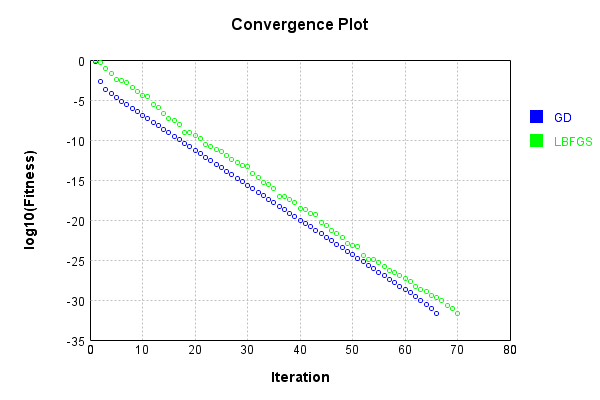
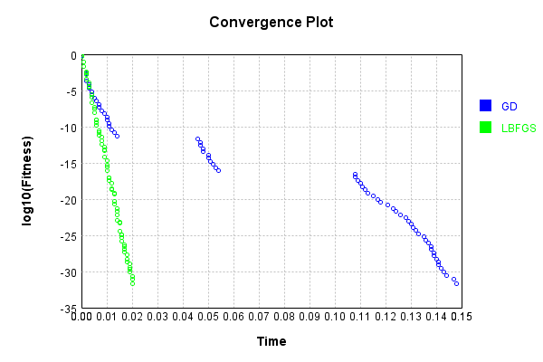

# CrossProductLayer
## CrossProductLayerTest
### Json Serialization
Code from [JsonTest.java:36](../../../../../../../src/main/java/com/simiacryptus/mindseye/test/unit/JsonTest.java#L36) executed in 0.00 seconds: 
```java
    JsonObject json = layer.getJson();
    NNLayer echo = NNLayer.fromJson(json);
    if ((echo == null)) throw new AssertionError("Failed to deserialize");
    if ((layer == echo)) throw new AssertionError("Serialization did not copy");
    if ((!layer.equals(echo))) throw new AssertionError("Serialization not equal");
    return new GsonBuilder().setPrettyPrinting().create().toJson(json);
```

Returns: 

```
    {
      "class": "com.simiacryptus.mindseye.layers.java.CrossProductLayer",
      "id": "74f4fcdb-62b4-4884-90e7-6030f2ab055c",
      "isFrozen": false,
      "name": "CrossProductLayer/74f4fcdb-62b4-4884-90e7-6030f2ab055c"
    }
```


### Example Input/Output Pair
Code from [ReferenceIO.java:68](../../../../../../../src/main/java/com/simiacryptus/mindseye/test/unit/ReferenceIO.java#L68) executed in 0.00 seconds: 
```java
    SimpleEval eval = SimpleEval.run(layer, inputPrototype);
    return String.format("--------------------\nInput: \n[%s]\n--------------------\nOutput: \n%s\n--------------------\nDerivative: \n%s",
      Arrays.stream(inputPrototype).map(t -> t.prettyPrint()).reduce((a, b) -> a + ",\n" + b).get(),
      eval.getOutput().prettyPrint(),
      Arrays.stream(eval.getDerivative()).map(t -> t.prettyPrint()).reduce((a, b) -> a + ",\n" + b).get());
```

Returns: 

```
    --------------------
    Input: 
    [[ 1.836, 0.412, 0.148, -1.42 ]]
    --------------------
    Output: 
    [ 0.756432, 0.271728, -2.60712, 0.060975999999999995, -0.5850399999999999, -0.21015999999999999 ]
    --------------------
    Derivative: 
    [ -0.86, 0.5640000000000001, 0.8280000000000003, 2.3960000000000004 ]
```


### Batch Execution
Code from [BatchingTester.java:66](../../../../../../../src/main/java/com/simiacryptus/mindseye/test/unit/BatchingTester.java#L66) executed in 0.00 seconds: 
```java
    return test(reference, inputPrototype);
```

Returns: 

```
    ToleranceStatistics{absoluteTol=0.0000e+00 +- 0.0000e+00 [0.0000e+00 - 0.0000e+00] (100#), relativeTol=0.0000e+00 +- 0.0000e+00 [0.0000e+00 - 0.0000e+00] (100#)}
```


Code from [SingleDerivativeTester.java:77](../../../../../../../src/main/java/com/simiacryptus/mindseye/test/unit/SingleDerivativeTester.java#L77) executed in 0.00 seconds: 
```java
    return test(component, inputPrototype);
```
Logging: 
```
    Inputs: [ -0.516, 0.416, -1.604, 0.092 ]
    Inputs Statistics: {meanExponent=-0.3748161941130865, negative=2, min=0.092, max=0.092, mean=-0.403, count=4.0, positive=2, stdDev=0.7698954474472492, zeros=0}
    Output: [ -0.21465599999999999, 0.8276640000000001, -0.047472, -0.667264, 0.038272, -0.147568 ]
    Outputs Statistics: {meanExponent=-0.749632388226173, negative=4, min=-0.147568, max=-0.147568, mean=-0.035170666666666635, count=6.0, positive=2, stdDev=0.44617241390097423, zeros=0}
    Feedback for input 0
    Inputs Values: [ -0.516, 0.416, -1.604, 0.092 ]
    Value Statistics: {meanExponent=-0.3748161941130865, negative=2, min=0.092, max=0.092, mean=-0.403, count=4.0, positive=2, stdDev=0.7698954474472492, zeros=0}
    Implemented Feedback: [ [ 0.416, -1.604, 0.092, 0.0, 0.0, 0.0 ], [ -0.516, 0.0, 0.0, -1.604, 0.092, 0.0 ], [ 0.0, -0.516, 0.0, 0.416, 0.0, 0.092 ], [ 0.0, 0.0, -0.516, 0.0, 0.416, -1.604 ] ]
    Implemented Statistics: {meanExponent=-0.3748161941130865, negative=6, min=-1.604, max=-1.604, mean=-0.2015, count=2
```
...[skipping 366 bytes](etc/260.txt)...
```
    999995807, -1.6040000000000498 ] ]
    Measured Statistics: {meanExponent=-0.37481619411316536, negative=6, min=-1.6040000000000498, max=-1.6040000000000498, mean=-0.2015000000000581, count=24.0, positive=6, stdDev=0.5804926786790672, zeros=12}
    Feedback Error: [ [ -2.500777362968165E-13, 5.053735208093713E-13, 8.743006318923108E-15, 0.0, 0.0, 0.0 ], [ -1.2745360322696797E-13, 0.0, 0.0, -6.048495038157853E-13, -6.064593272014918E-14, 0.0 ], [ 0.0, -4.050093593832571E-13, 0.0, -2.500777362968165E-13, 0.0, -1.3003487175922146E-13 ], [ 0.0, 0.0, 1.1324274851176597E-14, 0.0, -4.191091917959966E-14, -4.973799150320701E-14 ] ]
    Error Statistics: {meanExponent=-12.98285206790988, negative=9, min=-4.973799150320701E-14, max=-4.973799150320701E-14, mean=-5.809820217509791E-14, count=24.0, positive=3, stdDev=1.9046133809109551E-13, zeros=12}
    Finite-Difference Derivative Accuracy:
    absoluteTol: 1.0188e-13 +- 1.7109e-13 [0.0000e+00 - 6.0485e-13] (24#)
    relativeTol: 2.1865e-13 +- 1.9361e-13 [1.0973e-14 - 7.0671e-13] (12#)
    
```

Returns: 

```
    ToleranceStatistics{absoluteTol=1.0188e-13 +- 1.7109e-13 [0.0000e+00 - 6.0485e-13] (24#), relativeTol=2.1865e-13 +- 1.9361e-13 [1.0973e-14 - 7.0671e-13] (12#)}
```


### Performance
Now we execute larger-scale runs to benchmark performance:

Code from [PerformanceTester.java:66](../../../../../../../src/main/java/com/simiacryptus/mindseye/test/unit/PerformanceTester.java#L66) executed in 0.00 seconds: 
```java
    test(component, inputPrototype);
```
Logging: 
```
    100 batches
    Input Dimensions:
    	[4]
    Performance:
    	Evaluation performance: 0.000191s +- 0.000061s [0.000147s - 0.000310s]
    	Learning performance: 0.000066s +- 0.000039s [0.000040s - 0.000143s]
    
```

### Input Learning
In this test, we use a network to learn this target input, given it's pre-evaluated output:

Code from [LearningTester.java:127](../../../../../../../src/main/java/com/simiacryptus/mindseye/test/unit/LearningTester.java#L127) executed in 0.00 seconds: 
```java
    return Arrays.stream(input_target).map(x -> x.prettyPrint()).reduce((a, b) -> a + "\n" + b).orElse("");
```

Returns: 

```
    [ 1.068, 1.2, -0.484, -1.192 ]
```


First, we use a conjugate gradient descent method, which converges the fastest for purely linear functions.

Code from [LearningTester.java:300](../../../../../../../src/main/java/com/simiacryptus/mindseye/test/unit/LearningTester.java#L300) executed in 0.15 seconds: 
```java
    return new IterativeTrainer(trainable)
      .setLineSearchFactory(label -> new QuadraticSearch())
      .setOrientation(new GradientDescent())
      .setMonitor(monitor)
      .setTimeout(30, TimeUnit.SECONDS)
      .setMaxIterations(250)
      .setTerminateThreshold(0)
      .run();
```
Logging: 
```
    Constructing line search parameters: GD
    F(0.0) = LineSearchPoint{point=PointSample{avg=2.363970747477333}, derivative=-6.4947089202995585}
    New Minimum: 2.363970747477333 > 2.3639707468278623
    F(1.0E-10) = LineSearchPoint{point=PointSample{avg=2.3639707468278623}, derivative=-6.4947089182687625}, delta = -6.494706994430999E-10
    New Minimum: 2.3639707468278623 > 2.3639707429310373
    F(7.000000000000001E-10) = LineSearchPoint{point=PointSample{avg=2.3639707429310373}, derivative=-6.494708906083991}, delta = -4.546295784280119E-9
    New Minimum: 2.3639707429310373 > 2.36397071565326
    F(4.900000000000001E-9) = LineSearchPoint{point=PointSample{avg=2.36397071565326}, derivative=-6.494708820790587}, delta = -3.182407315449609E-8
    New Minimum: 2.36397071565326 > 2.3639705247088294
    F(3.430000000000001E-8) = LineSearchPoint{point=PointSample{avg=2.3639705247088294}, derivative=-6.494708223736783}, delta = -2.2276850364377765E-7
    New Minimum: 2.3639705247088294 > 2.363969188098307
    F(2.4010000000000004E-7) = LineSearchP
```
...[skipping 84240 bytes](etc/261.txt)...
```
    e=-2.8020317440647407E-32}, delta = -8.833598678256122E-32
    Left bracket at 0.6451852376039575
    Converged to right
    Iteration 66 complete. Error: 2.0543252740130517E-32 Total: 249770686918336.3000; Orientation: 0.0001; Line Search: 0.0013
    Zero gradient: 1.371230061075531E-16
    F(0.0) = LineSearchPoint{point=PointSample{avg=2.0543252740130517E-32}, derivative=-1.8802718803972042E-32}
    F(0.6618966051426571) = LineSearchPoint{point=PointSample{avg=2.0543252740130517E-32}, derivative=-1.8802718803972042E-32}, delta = 0.0
    F(4.6332762359986) = LineSearchPoint{point=PointSample{avg=2.0543252740130517E-32}, derivative=1.8802718803972042E-32}, delta = 0.0
    2.0543252740130517E-32 <= 2.0543252740130517E-32
    New Minimum: 2.0543252740130517E-32 > 0.0
    F(2.3166381179993) = LineSearchPoint{point=PointSample{avg=0.0}, derivative=0.0}, delta = -2.0543252740130517E-32
    Right bracket at 2.3166381179993
    Converged to right
    Iteration 67 complete. Error: 0.0 Total: 249770687929724.3000; Orientation: 0.0000; Line Search: 0.0008
    
```

Returns: 

```
    0.0
```


Training Converged

Next, we run the same optimization using L-BFGS, which is nearly ideal for purely second-order or quadratic functions.

Code from [LearningTester.java:324](../../../../../../../src/main/java/com/simiacryptus/mindseye/test/unit/LearningTester.java#L324) executed in 0.02 seconds: 
```java
    return new IterativeTrainer(trainable)
      .setLineSearchFactory(label -> new ArmijoWolfeSearch())
      .setOrientation(new LBFGS())
      .setMonitor(monitor)
      .setTimeout(30, TimeUnit.SECONDS)
      .setMaxIterations(250)
      .setTerminateThreshold(0)
      .run();
```
Logging: 
```
    LBFGS Accumulation History: 1 points
    Constructing line search parameters: GD
    th(0)=2.363970747477333;dx=-6.4947089202995585
    Armijo: th(2.154434690031884)=12.491028513889162; dx=30.455987240740363 delta=-10.127057766411829
    New Minimum: 2.363970747477333 > 0.8752665932236899
    WOLF (strong): th(1.077217345015942)=0.8752665932236899; dx=1.060526156779107 delta=1.488704154253643
    END: th(0.3590724483386473)=1.0247503919594418; dx=-1.7287375992532172 delta=1.3392203555178912
    Iteration 1 complete. Error: 0.8752665932236899 Total: 249770699782830.3000; Orientation: 0.0001; Line Search: 0.0003
    LBFGS Accumulation History: 1 points
    th(0)=1.0247503919594418;dx=-0.6888741567424221
    New Minimum: 1.0247503919594418 > 0.5416126539173329
    END: th(0.7735981389354633)=0.5416126539173329; dx=-0.5612056247479025 delta=0.4831377380421089
    Iteration 2 complete. Error: 0.5416126539173329 Total: 249770700001978.3000; Orientation: 0.0000; Line Search: 0.0001
    LBFGS Accumulation History: 1 points
    th(0)=0.5416126539173329;dx=-0.
```
...[skipping 33538 bytes](etc/262.txt)...
```
    31 delta=1.8694359993518766E-31
    Iteration 69 complete. Error: 8.833598678256122E-32 Total: 249770719576004.2800; Orientation: 0.0000; Line Search: 0.0002
    LBFGS Accumulation History: 1 points
    th(0)=8.833598678256122E-32;dx=-9.237499844289866E-32
    New Minimum: 8.833598678256122E-32 > 2.465190328815662E-32
    WOLF (strong): th(1.975654311189155)=2.465190328815662E-32; dx=3.4522306236705324E-32 delta=6.36840834944046E-32
    New Minimum: 2.465190328815662E-32 > 2.0543252740130517E-32
    END: th(0.9878271555945775)=2.0543252740130517E-32; dx=-3.7556922662273E-32 delta=6.77927340424307E-32
    Iteration 70 complete. Error: 2.0543252740130517E-32 Total: 249770719841319.2800; Orientation: 0.0000; Line Search: 0.0002
    LBFGS Accumulation History: 1 points
    th(0)=2.0543252740130517E-32;dx=-1.8802718803972042E-32
    New Minimum: 2.0543252740130517E-32 > 0.0
    END: th(2.128209091768481)=0.0; dx=0.0 delta=2.0543252740130517E-32
    Iteration 71 complete. Error: 0.0 Total: 249770720016866.2800; Orientation: 0.0000; Line Search: 0.0001
    
```

Returns: 

```
    0.0
```


Training Converged

Code from [LearningTester.java:96](../../../../../../../src/main/java/com/simiacryptus/mindseye/test/unit/LearningTester.java#L96) executed in 0.00 seconds: 
```java
    return TestUtil.compare(runs);
```

Returns: 




Code from [LearningTester.java:99](../../../../../../../src/main/java/com/simiacryptus/mindseye/test/unit/LearningTester.java#L99) executed in 0.00 seconds: 
```java
    return TestUtil.compareTime(runs);
```

Returns: 




