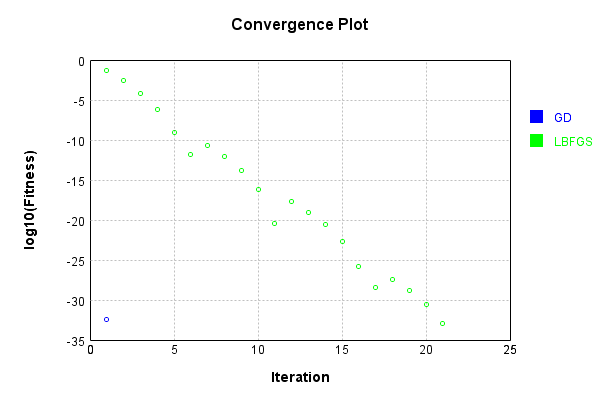
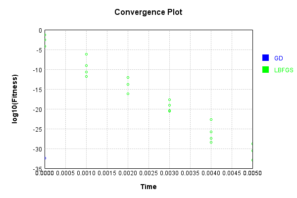

# DropoutNoiseLayer
## DropoutNoiseLayerTest
### Json Serialization
Code from [JsonTest.java:36](../../../../../../../src/main/java/com/simiacryptus/mindseye/test/unit/JsonTest.java#L36) executed in 0.00 seconds: 
```java
    JsonObject json = layer.getJson();
    NNLayer echo = NNLayer.fromJson(json);
    if ((echo == null)) throw new AssertionError("Failed to deserialize");
    if ((layer == echo)) throw new AssertionError("Serialization did not copy");
    if ((!layer.equals(echo))) throw new AssertionError("Serialization not equal");
    return new GsonBuilder().setPrettyPrinting().create().toJson(json);
```

Returns: 

```
    {
      "class": "com.simiacryptus.mindseye.layers.java.DropoutNoiseLayer",
      "id": "f4aa4de9-626b-4024-900f-d830dcd328e4",
      "isFrozen": false,
      "name": "DropoutNoiseLayer/f4aa4de9-626b-4024-900f-d830dcd328e4",
      "value": 0.5
    }
```


### Example Input/Output Pair
Code from [ReferenceIO.java:68](../../../../../../../src/main/java/com/simiacryptus/mindseye/test/unit/ReferenceIO.java#L68) executed in 0.00 seconds: 
```java
    SimpleEval eval = SimpleEval.run(layer, inputPrototype);
    return String.format("--------------------\nInput: \n[%s]\n--------------------\nOutput: \n%s\n--------------------\nDerivative: \n%s",
      Arrays.stream(inputPrototype).map(t -> t.prettyPrint()).reduce((a, b) -> a + ",\n" + b).get(),
      eval.getOutput().prettyPrint(),
      Arrays.stream(eval.getDerivative()).map(t -> t.prettyPrint()).reduce((a, b) -> a + ",\n" + b).get());
```

Returns: 

```
    --------------------
    Input: 
    [[ -0.092, -1.02, 0.712 ]]
    --------------------
    Output: 
    [ -0.092, -0.0, 0.0 ]
    --------------------
    Derivative: 
    [ 1.0, 0.0, 0.0 ]
```


### Batch Execution
Code from [BatchingTester.java:66](../../../../../../../src/main/java/com/simiacryptus/mindseye/test/unit/BatchingTester.java#L66) executed in 0.00 seconds: 
```java
    return test(reference, inputPrototype);
```

Returns: 

```
    ToleranceStatistics{absoluteTol=0.0000e+00 +- 0.0000e+00 [0.0000e+00 - 0.0000e+00] (60#), relativeTol=0.0000e+00 +- 0.0000e+00 [0.0000e+00 - 0.0000e+00] (40#)}
```


Code from [SingleDerivativeTester.java:77](../../../../../../../src/main/java/com/simiacryptus/mindseye/test/unit/SingleDerivativeTester.java#L77) executed in 0.00 seconds: 
```java
    return test(component, inputPrototype);
```
Logging: 
```
    Inputs: [ 1.124, -0.416, 1.2 ]
    Inputs Statistics: {meanExponent=-0.08365303736419671, negative=1, min=1.2, max=1.2, mean=0.636, count=3.0, positive=2, stdDev=0.7445231135879307, zeros=0}
    Output: [ 0.0, -0.416, 0.0 ]
    Outputs Statistics: {meanExponent=-0.3809066693732573, negative=1, min=0.0, max=0.0, mean=-0.13866666666666666, count=3.0, positive=0, stdDev=0.19610428064906918, zeros=2}
    Feedback for input 0
    Inputs Values: [ 1.124, -0.416, 1.2 ]
    Value Statistics: {meanExponent=-0.08365303736419671, negative=1, min=1.2, max=1.2, mean=0.636, count=3.0, positive=2, stdDev=0.7445231135879307, zeros=0}
    Implemented Feedback: [ [ 0.0, 0.0, 0.0 ], [ 0.0, 1.0, 0.0 ], [ 0.0, 0.0, 0.0 ] ]
    Implemented Statistics: {meanExponent=0.0, negative=0, min=0.0, max=0.0, mean=0.1111111111111111, count=9.0, positive=1, stdDev=0.31426968052735443, zeros=8}
    Measured Feedback: [ [ 0.0, 0.0, 0.0 ], [ 0.0, 0.9999999999998899, 0.0 ], [ 0.0, 0.0, 0.0 ] ]
    Measured Statistics: {meanExponent=-4.7830642341045674E-14, negative=0, min=0.0, max=0.0, mean=0.11111111111109888, count=9.0, positive=1, stdDev=0.31426968052731985, zeros=8}
    Feedback Error: [ [ 0.0, 0.0, 0.0 ], [ 0.0, -1.1013412404281553E-13, 0.0 ], [ 0.0, 0.0, 0.0 ] ]
    Error Statistics: {meanExponent=-12.958078098036825, negative=1, min=0.0, max=0.0, mean=-1.223712489364617E-14, count=9.0, positive=0, stdDev=3.461181597809566E-14, zeros=8}
    Finite-Difference Derivative Accuracy:
    absoluteTol: 1.2237e-14 +- 3.4612e-14 [0.0000e+00 - 1.1013e-13] (9#)
    relativeTol: 5.5067e-14 +- 0.0000e+00 [5.5067e-14 - 5.5067e-14] (1#)
    
```

Returns: 

```
    ToleranceStatistics{absoluteTol=1.2237e-14 +- 3.4612e-14 [0.0000e+00 - 1.1013e-13] (9#), relativeTol=5.5067e-14 +- 0.0000e+00 [5.5067e-14 - 5.5067e-14] (1#)}
```


### Performance
Now we execute larger-scale runs to benchmark performance:

Code from [PerformanceTester.java:66](../../../../../../../src/main/java/com/simiacryptus/mindseye/test/unit/PerformanceTester.java#L66) executed in 0.00 seconds: 
```java
    test(component, inputPrototype);
```
Logging: 
```
    100 batches
    Input Dimensions:
    	[3]
    Performance:
    	Evaluation performance: 0.000249s +- 0.000031s [0.000218s - 0.000298s]
    	Learning performance: 0.000027s +- 0.000003s [0.000023s - 0.000031s]
    
```

### Input Learning
In this test, we use a network to learn this target input, given it's pre-evaluated output:

Code from [LearningTester.java:127](../../../../../../../src/main/java/com/simiacryptus/mindseye/test/unit/LearningTester.java#L127) executed in 0.00 seconds: 
```java
    return Arrays.stream(input_target).map(x -> x.prettyPrint()).reduce((a, b) -> a + "\n" + b).orElse("");
```

Returns: 

```
    [ -1.444, -1.732, -0.392 ]
```


First, we use a conjugate gradient descent method, which converges the fastest for purely linear functions.

Code from [LearningTester.java:300](../../../../../../../src/main/java/com/simiacryptus/mindseye/test/unit/LearningTester.java#L300) executed in 0.00 seconds: 
```java
    return new IterativeTrainer(trainable)
      .setLineSearchFactory(label -> new QuadraticSearch())
      .setOrientation(new GradientDescent())
      .setMonitor(monitor)
      .setTimeout(30, TimeUnit.SECONDS)
      .setMaxIterations(250)
      .setTerminateThreshold(0)
      .run();
```
Logging: 
```
    Constructing line search parameters: GD
    F(0.0) = LineSearchPoint{point=PointSample{avg=0.6261813333333333}, derivative=-0.8349084444444442}
    New Minimum: 0.6261813333333333 > 0.6261813332498423
    F(1.0E-10) = LineSearchPoint{point=PointSample{avg=0.6261813332498423}, derivative=-0.8349084443887836}, delta = -8.349099189786102E-11
    New Minimum: 0.6261813332498423 > 0.6261813327488975
    F(7.000000000000001E-10) = LineSearchPoint{point=PointSample{avg=0.6261813327488975}, derivative=-0.8349084440548203}, delta = -5.844357220397001E-10
    New Minimum: 0.6261813327488975 > 0.626181329242282
    F(4.900000000000001E-9) = LineSearchPoint{point=PointSample{avg=0.626181329242282}, derivative=-0.8349084417170767}, delta = -4.0910512755232276E-9
    New Minimum: 0.626181329242282 > 0.6261813046959742
    F(3.430000000000001E-8) = LineSearchPoint{point=PointSample{avg=0.6261813046959742}, derivative=-0.8349084253528714}, delta = -2.8637359039684895E-8
    New Minimum: 0.6261813046959742 > 0.6261811328718316
    F(2.4010000000000004E-7) = 
```
...[skipping 1533 bytes](etc/263.txt)...
```
    32244
    New Minimum: 0.47197379585010885 > 0.0037365363127621234
    F(1.3841287201) = LineSearchPoint{point=PointSample{avg=0.0037365363127621234}, derivative=-0.06449460670473053}, delta = -0.6224447970205711
    Loops = 12
    New Minimum: 0.0037365363127621234 > 4.108650548026103E-33
    F(1.5) = LineSearchPoint{point=PointSample{avg=4.108650548026103E-33}, derivative=-6.611994902212042E-17}, delta = -0.6261813333333333
    Right bracket at 1.5
    Converged to right
    Iteration 1 complete. Error: 4.108650548026103E-33 Total: 249770853805386.1600; Orientation: 0.0000; Line Search: 0.0009
    Zero gradient: 7.401486830834377E-17
    F(0.0) = LineSearchPoint{point=PointSample{avg=4.108650548026103E-33}, derivative=-5.4782007307014706E-33}
    New Minimum: 4.108650548026103E-33 > 0.0
    F(1.5) = LineSearchPoint{point=PointSample{avg=0.0}, derivative=0.0}, delta = -4.108650548026103E-33
    0.0 <= 4.108650548026103E-33
    Converged to right
    Iteration 2 complete. Error: 0.0 Total: 249770853980077.1600; Orientation: 0.0000; Line Search: 0.0001
    
```

Returns: 

```
    0.0
```


Training Converged

Next, we run the same optimization using L-BFGS, which is nearly ideal for purely second-order or quadratic functions.

Code from [LearningTester.java:324](../../../../../../../src/main/java/com/simiacryptus/mindseye/test/unit/LearningTester.java#L324) executed in 0.01 seconds: 
```java
    return new IterativeTrainer(trainable)
      .setLineSearchFactory(label -> new ArmijoWolfeSearch())
      .setOrientation(new LBFGS())
      .setMonitor(monitor)
      .setTimeout(30, TimeUnit.SECONDS)
      .setMaxIterations(250)
      .setTerminateThreshold(0)
      .run();
```
Logging: 
```
    LBFGS Accumulation History: 1 points
    Constructing line search parameters: GD
    th(0)=0.6261813333333333;dx=-0.8349084444444442
    New Minimum: 0.6261813333333333 > 0.1191928552291139
    WOLF (strong): th(2.154434690031884)=0.1191928552291139; dx=0.36426203269666796 delta=0.5069884781042193
    New Minimum: 0.1191928552291139 > 0.04974528487936128
    END: th(1.077217345015942)=0.04974528487936128; dx=-0.2353232058738881 delta=0.576436048453972
    Iteration 1 complete. Error: 0.04974528487936128 Total: 249770857625521.1600; Orientation: 0.0000; Line Search: 0.0002
    LBFGS Accumulation History: 1 points
    th(0)=0.04974528487936128;dx=-0.06632704650581503
    New Minimum: 0.04974528487936128 > 0.014894920564979625
    WOLF (strong): th(2.3207944168063896)=0.014894920564979625; dx=0.03629391297015381 delta=0.034850364314381654
    New Minimum: 0.014894920564979625 > 0.0025498339972775444
    END: th(1.1603972084031948)=0.0025498339972775444; dx=-0.015016566767830603 delta=0.04719545088208373
    Iteration 2 complete. Error: 0.002549833997277
```
...[skipping 9685 bytes](etc/264.txt)...
```
    672203.1200; Orientation: 0.0000; Line Search: 0.0002
    LBFGS Accumulation History: 1 points
    th(0)=2.475461955185727E-31;dx=-3.3006159402476363E-31
    New Minimum: 2.475461955185727E-31 > 1.9002508784620726E-31
    WOLF (strong): th(2.8257016782407427)=1.9002508784620726E-31; dx=2.8897508854450257E-31 delta=5.752110767236544E-32
    New Minimum: 1.9002508784620726E-31 > 1.0271626370065257E-33
    END: th(1.4128508391203713)=1.0271626370065257E-33; dx=-2.0543252740130514E-32 delta=2.465190328815662E-31
    Iteration 21 complete. Error: 1.0271626370065257E-33 Total: 249770862911870.1200; Orientation: 0.0000; Line Search: 0.0002
    LBFGS Accumulation History: 1 points
    th(0)=1.0271626370065257E-33;dx=-1.3695501826753676E-33
    Armijo: th(3.043894859641584)=1.0271626370065257E-33; dx=1.3695501826753676E-33 delta=0.0
    New Minimum: 1.0271626370065257E-33 > 0.0
    END: th(1.521947429820792)=0.0; dx=0.0 delta=1.0271626370065257E-33
    Iteration 22 complete. Error: 0.0 Total: 249770863146122.1200; Orientation: 0.0000; Line Search: 0.0002
    
```

Returns: 

```
    0.0
```


Training Converged

Code from [LearningTester.java:96](../../../../../../../src/main/java/com/simiacryptus/mindseye/test/unit/LearningTester.java#L96) executed in 0.00 seconds: 
```java
    return TestUtil.compare(runs);
```

Returns: 




Code from [LearningTester.java:99](../../../../../../../src/main/java/com/simiacryptus/mindseye/test/unit/LearningTester.java#L99) executed in 0.00 seconds: 
```java
    return TestUtil.compareTime(runs);
```

Returns: 




