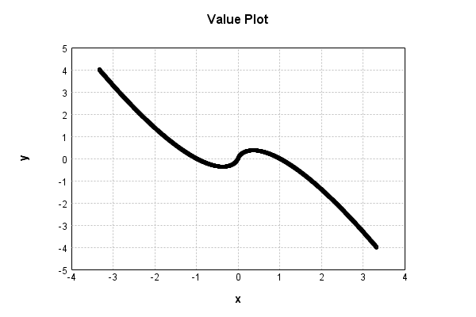
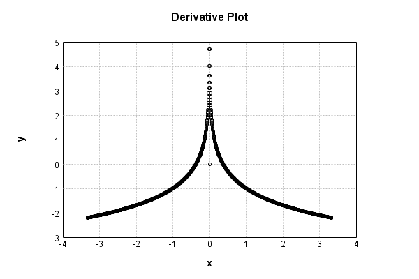

# EntropyLayer
## EntropyLayerTest
### Json Serialization
Code from [StandardLayerTests.java:69](../../../../../../../src/main/java/com/simiacryptus/mindseye/test/StandardLayerTests.java#L69) executed in 0.00 seconds: 
```java
    JsonObject json = layer.getJson();
    NNLayer echo = NNLayer.fromJson(json);
    if ((echo == null)) throw new AssertionError("Failed to deserialize");
    if ((layer == echo)) throw new AssertionError("Serialization did not copy");
    if ((!layer.equals(echo))) throw new AssertionError("Serialization not equal");
    return new GsonBuilder().setPrettyPrinting().create().toJson(json);
```

Returns: 

```
    {
      "class": "com.simiacryptus.mindseye.layers.java.EntropyLayer",
      "id": "ad69482c-8012-4dbc-8e95-efd097f6fc3c",
      "isFrozen": true,
      "name": "EntropyLayer/ad69482c-8012-4dbc-8e95-efd097f6fc3c"
    }
```


### Example Input/Output Pair
Code from [StandardLayerTests.java:153](../../../../../../../src/main/java/com/simiacryptus/mindseye/test/StandardLayerTests.java#L153) executed in 0.00 seconds: 
```java
    SimpleEval eval = SimpleEval.run(layer, inputPrototype);
    return String.format("--------------------\nInput: \n[%s]\n--------------------\nOutput: \n%s\n--------------------\nDerivative: \n%s",
      Arrays.stream(inputPrototype).map(t -> t.prettyPrint()).reduce((a, b) -> a + ",\n" + b).get(),
      eval.getOutput().prettyPrint(),
      Arrays.stream(eval.getDerivative()).map(t -> t.prettyPrint()).reduce((a, b) -> a + ",\n" + b).get());
```

Returns: 

```
    --------------------
    Input: 
    [[
    	[ [ 1.248 ], [ 0.372 ], [ 0.896 ] ],
    	[ [ -0.788 ], [ 0.956 ], [ 0.532 ] ]
    ]]
    --------------------
    Output: 
    [
    	[ [ -0.2764847528941504 ], [ 0.3678564499917445 ], [ 0.09839411994245709 ] ],
    	[ [ -0.18774666502991522 ], [ 0.043017481829783426 ], [ 0.3357514720887421 ] ]
    ]
    --------------------
    Derivative: 
    [
    	[ [ -1.221542269947236 ], [ -0.011138575291009478 ], [ -0.8901851339927934 ] ],
    	[ [ -0.7617428108757421 ], [ -0.9550026340692642 ], [ -0.36888821035950736 ] ]
    ]
```


### Batch Execution
Code from [StandardLayerTests.java:102](../../../../../../../src/main/java/com/simiacryptus/mindseye/test/StandardLayerTests.java#L102) executed in 0.00 seconds: 
```java
    return getBatchingTester().test(layer, inputPrototype);
```

Returns: 

```
    ToleranceStatistics{absoluteTol=0.0000e+00 +- 0.0000e+00 [0.0000e+00 - 0.0000e+00] (120#), relativeTol=0.0000e+00 +- 0.0000e+00 [0.0000e+00 - 0.0000e+00] (120#)}
```


### Differential Validation
Code from [StandardLayerTests.java:110](../../../../../../../src/main/java/com/simiacryptus/mindseye/test/StandardLayerTests.java#L110) executed in 0.00 seconds: 
```java
    return getDerivativeTester().test(layer, inputPrototype);
```
Logging: 
```
    Inputs: [
    	[ [ 1.128 ], [ 0.788 ], [ 0.596 ] ],
    	[ [ 1.86 ], [ 0.556 ], [ 1.128 ] ]
    ]
    Inputs Statistics: {meanExponent=-0.03483693127926458, negative=0, min=1.128, max=1.128, mean=1.0093333333333334, count=6.0, positive=6, stdDev=0.4429336544249288, zeros=0}
    Output: [
    	[ [ -0.13586326066957805 ], [ 0.18774666502991522 ], [ 0.30843870870240525 ] ],
    	[ [ -1.1542722671687047 ], [ 0.3263647635107444 ], [ -0.13586326066957805 ] ]
    ]
    Outputs Statistics: {meanExponent=-0.5658405502018433, negative=3, min=-0.13586326066957805, max=-0.13586326066957805, mean=-0.10057477521079929, count=6.0, positive=3, stdDev=0.5075213643482395, zeros=0}
    Feedback for input 0
    Inputs Values: [
    	[ [ 1.128 ], [ 0.788 ], [ 0.596 ] ],
    	[ [ 1.86 ], [ 0.556 ], [ 1.128 ] ]
    ]
    Value Statistics: {meanExponent=-0.03483693127926458, negative=0, min=1.128, max=1.128, mean=1.0093333333333334, count=6.0, positive=6, stdDev=0.4429336544249288, zeros=0}
    Implemented Feedback: [ [ -1.1204461530758671, 0.0, 0.0, 0.0, 0.0, 0.0 ], [ 0.0, -1.62057648772
```
...[skipping 672 bytes](etc/65.txt)...
```
    .0, 0.0, 0.0, -0.4825692760090927, 0.0 ], [ 0.0, 0.0, 0.0, 0.0, 0.0, -1.1204904780068303 ] ]
    Measured Statistics: {meanExponent=-0.08500740557675947, negative=6, min=-1.1204904780068303, max=-1.1204904780068303, mean=-0.15330729996915668, count=36.0, positive=0, stdDev=0.3827936928850074, zeros=30}
    Feedback Error: [ [ -4.432493096317991E-5, 0.0, 0.0, 0.0, 0.0, 0.0 ], [ 0.0, -2.688123852578883E-5, 0.0, 0.0, 0.0, 0.0 ], [ 0.0, 0.0, -6.344909244748731E-5, 0.0, 0.0, 0.0 ], [ 0.0, 0.0, 0.0, -8.99226666161157E-5, 0.0, 0.0 ], [ 0.0, 0.0, 0.0, 0.0, -8.388792588009952E-5, 0.0 ], [ 0.0, 0.0, 0.0, 0.0, 0.0, -4.432493096317991E-5 ] ]
    Error Statistics: {meanExponent=-4.26621009023667, negative=6, min=-4.432493096317991E-5, max=-4.432493096317991E-5, mean=-9.799744038773644E-6, count=36.0, positive=0, stdDev=2.3771947759779318E-5, zeros=30}
    Finite-Difference Derivative Accuracy:
    absoluteTol: 9.7997e-06 +- 2.3772e-05 [0.0000e+00 - 8.9923e-05] (36#)
    relativeTol: 4.7546e-05 +- 3.7475e-05 [8.2937e-06 - 1.0885e-04] (6#)
    
```

Returns: 

```
    ToleranceStatistics{absoluteTol=9.7997e-06 +- 2.3772e-05 [0.0000e+00 - 8.9923e-05] (36#), relativeTol=4.7546e-05 +- 3.7475e-05 [8.2937e-06 - 1.0885e-04] (6#)}
```


### Performance
Code from [StandardLayerTests.java:120](../../../../../../../src/main/java/com/simiacryptus/mindseye/test/StandardLayerTests.java#L120) executed in 0.00 seconds: 
```java
    getPerformanceTester().test(layer, permPrototype);
```
Logging: 
```
    Evaluation performance: 0.000225s +- 0.000025s [0.000190s - 0.000268s]
    Learning performance: 0.000045s +- 0.000008s [0.000038s - 0.000060s]
    
```

### Function Plots
Code from [ActivationLayerTestBase.java:103](../../../../../../../src/test/java/com/simiacryptus/mindseye/layers/java/ActivationLayerTestBase.java#L103) executed in 0.01 seconds: 
```java
    return plot("Value Plot", plotData, x -> new double[]{x[0], x[1]});
```

Returns: 




Code from [ActivationLayerTestBase.java:107](../../../../../../../src/test/java/com/simiacryptus/mindseye/layers/java/ActivationLayerTestBase.java#L107) executed in 0.01 seconds: 
```java
    return plot("Derivative Plot", plotData, x -> new double[]{x[0], x[2]});
```

Returns: 




