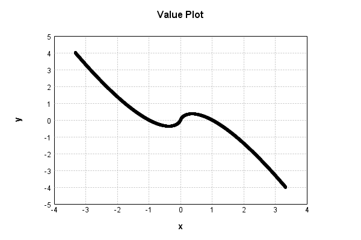
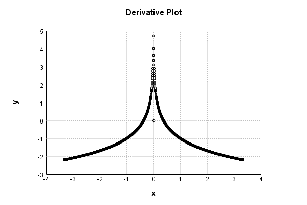

# EntropyLayer
## EntropyLayerTest
### Json Serialization
Code from [LayerTestBase.java:84](../../../../../../../../MindsEye/src/test/java/com/simiacryptus/mindseye/layers/LayerTestBase.java#L84) executed in 0.00 seconds: 
```java
    JsonObject json = layer.getJson();
    NNLayer echo = NNLayer.fromJson(json);
    assert (echo != null) : "Failed to deserialize";
    assert (layer != echo) : "Serialization did not copy";
    Assert.assertEquals("Serialization not equal", layer, echo);
    return new GsonBuilder().setPrettyPrinting().create().toJson(json);
```

Returns: 

```
    {
      "class": "com.simiacryptus.mindseye.layers.java.EntropyLayer",
      "id": "0910987d-3688-428c-a892-e2c400000e16",
      "isFrozen": true,
      "name": "EntropyLayer/0910987d-3688-428c-a892-e2c400000e16"
    }
```


### Example Input/Output Pair
Code from [LayerTestBase.java:121](../../../../../../../../MindsEye/src/test/java/com/simiacryptus/mindseye/layers/LayerTestBase.java#L121) executed in 0.00 seconds: 
```java
    SimpleEval eval = SimpleEval.run(layer, inputPrototype);
    return String.format("--------------------\nInput: \n[%s]\n--------------------\nOutput: \n%s",
      Arrays.stream(inputPrototype).map(t->t.prettyPrint()).reduce((a,b)->a+",\n"+b).get(),
      eval.getOutput().prettyPrint());
```

Returns: 

```
    --------------------
    Input: 
    [[ -0.432, -1.764, 0.988 ]]
    --------------------
    Output: 
    [ -0.36259042639882755, 1.0012181011792336, 0.011927710259458017 ]
```


### Differential Validation
Code from [LayerTestBase.java:139](../../../../../../../../MindsEye/src/test/java/com/simiacryptus/mindseye/layers/LayerTestBase.java#L139) executed in 0.00 seconds: 
```java
    getDerivativeTester().test(layer, inputPrototype);
```
Logging: 
```
    Finite-Difference Derivative Accuracy:
    absoluteTol: 2.1633e-06 +- 3.7341e-06 [0.0000e+00 - 1.1574e-05] (9#)
    relativeTol: 1.3162e-05 +- 1.6177e-05 [9.0409e-07 - 3.6020e-05] (3#)
    
```

### Performance
Code from [LayerTestBase.java:144](../../../../../../../../MindsEye/src/test/java/com/simiacryptus/mindseye/layers/LayerTestBase.java#L144) executed in 0.00 seconds: 
```java
    getPerformanceTester().test(layer, inputPrototype);
```
Logging: 
```
    Evaluation performance: 0.0262 +- 0.0162 [0.0199 - 0.1311]
    Learning performance: 0.0007 +- 0.0018 [0.0000 - 0.0142]
    
```

### Function Plots
Code from [ActivationLayerTestBase.java:73](../../../../../../../../MindsEye/src/test/java/com/simiacryptus/mindseye/layers/java/ActivationLayerTestBase.java#L73) executed in 0.01 seconds: 
```java
    return plot("Value Plot", plotData, x -> new double[]{x[0], x[1]});
```

Returns: 




Code from [ActivationLayerTestBase.java:77](../../../../../../../../MindsEye/src/test/java/com/simiacryptus/mindseye/layers/java/ActivationLayerTestBase.java#L77) executed in 0.01 seconds: 
```java
    return plot("Derivative Plot", plotData, x -> new double[]{x[0], x[2]});
```

Returns: 




