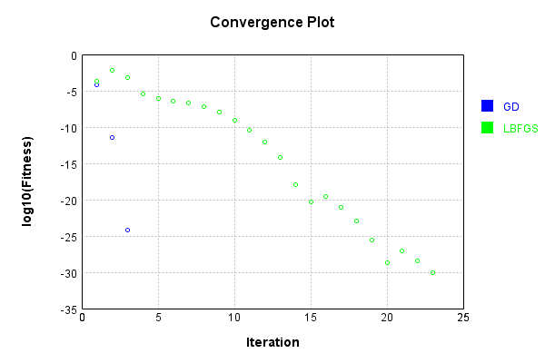
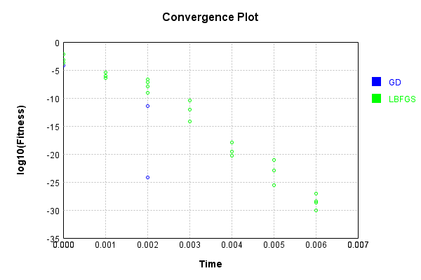

# EntropyLossLayer
## EntropyLossLayerTest
### Json Serialization
Code from [JsonTest.java:36](../../../../../../../src/main/java/com/simiacryptus/mindseye/test/unit/JsonTest.java#L36) executed in 0.00 seconds: 
```java
    JsonObject json = layer.getJson();
    NNLayer echo = NNLayer.fromJson(json);
    if ((echo == null)) throw new AssertionError("Failed to deserialize");
    if ((layer == echo)) throw new AssertionError("Serialization did not copy");
    if ((!layer.equals(echo))) throw new AssertionError("Serialization not equal");
    return new GsonBuilder().setPrettyPrinting().create().toJson(json);
```

Returns: 

```
    {
      "class": "com.simiacryptus.mindseye.layers.java.EntropyLossLayer",
      "id": "1c64ba40-6b9b-42dd-82cd-d7f1bc53944e",
      "isFrozen": false,
      "name": "EntropyLossLayer/1c64ba40-6b9b-42dd-82cd-d7f1bc53944e"
    }
```


### Example Input/Output Pair
Code from [ReferenceIO.java:68](../../../../../../../src/main/java/com/simiacryptus/mindseye/test/unit/ReferenceIO.java#L68) executed in 0.00 seconds: 
```java
    SimpleEval eval = SimpleEval.run(layer, inputPrototype);
    return String.format("--------------------\nInput: \n[%s]\n--------------------\nOutput: \n%s\n--------------------\nDerivative: \n%s",
      Arrays.stream(inputPrototype).map(t -> t.prettyPrint()).reduce((a, b) -> a + ",\n" + b).get(),
      eval.getOutput().prettyPrint(),
      Arrays.stream(eval.getDerivative()).map(t -> t.prettyPrint()).reduce((a, b) -> a + ",\n" + b).get());
```

Returns: 

```
    --------------------
    Input: 
    [[ 0.33999555364735967, 0.2976661208373651, 0.1754463689699698, 0.5079814975483034 ],
    [ 0.6063628167392072, 0.10828134888906249, 0.6917475148703982, 0.1927915995527505 ]]
    --------------------
    Output: 
    [ 2.119883705687436 ]
    --------------------
    Derivative: 
    [ -1.7834433722275123, -0.36376779656501057, -3.9427861569982157, -0.37952484585212315 ],
    [ 1.078822738965207, 1.2117828204684913, 1.7404218726930314, 0.6773102542159669 ]
```


### Batch Execution
Code from [BatchingTester.java:66](../../../../../../../src/main/java/com/simiacryptus/mindseye/test/unit/BatchingTester.java#L66) executed in 0.00 seconds: 
```java
    return test(reference, inputPrototype);
```

Returns: 

```
    ToleranceStatistics{absoluteTol=0.0000e+00 +- 0.0000e+00 [0.0000e+00 - 0.0000e+00] (90#), relativeTol=0.0000e+00 +- 0.0000e+00 [0.0000e+00 - 0.0000e+00] (90#)}
```


Code from [SingleDerivativeTester.java:77](../../../../../../../src/main/java/com/simiacryptus/mindseye/test/unit/SingleDerivativeTester.java#L77) executed in 0.00 seconds: 
```java
    return test(component, inputPrototype);
```
Logging: 
```
    Inputs: [ 0.028702918205099626, 0.8856046831594885, 0.5094804450451283, 0.23229091515968103 ],
    [ 0.9715509095749233, 0.3418113131775625, 0.11169432577610727, 0.7895536654620899 ]
    Inputs Statistics: {meanExponent=-0.6304185744144876, negative=0, min=0.23229091515968103, max=0.23229091515968103, mean=0.4140197403923494, count=4.0, positive=4, stdDev=0.32132519499660206, zeros=0},
    {meanExponent=-0.3833338098809991, negative=0, min=0.7895536654620899, max=0.7895536654620899, mean=0.5536525534976708, count=4.0, positive=4, stdDev=0.3429621541763997, zeros=0}
    Output: [ 4.7191507219173126 ]
    Outputs Statistics: {meanExponent=0.6738638482163704, negative=0, min=4.7191507219173126, max=4.7191507219173126, mean=4.7191507219173126, count=1.0, positive=1, stdDev=0.0, zeros=0}
    Feedback for input 0
    Inputs Values: [ 0.028702918205099626, 0.8856046831594885, 0.5094804450451283, 0.23229091515968103 ]
    Value Statistics: {meanExponent=-0.6304185744144876, negative=0, min=0.23229091515968103, max=0.23229091515968103, mean=0.
```
...[skipping 1514 bytes](etc/267.txt)...
```
    Statistics: {meanExponent=-0.09299518091364825, negative=0, min=1.4597647481940197, max=1.4597647481940197, mean=1.4515924117933565, count=4.0, positive=4, stdDev=1.3019051087238784, zeros=0}
    Measured Feedback: [ [ 3.5507564888348497 ], [ 0.12148468897521525 ], [ 0.6743638536477192 ], [ 1.4597647535197211 ] ]
    Measured Statistics: {meanExponent=-0.09299510186338797, negative=0, min=1.4597647535197211, max=1.4597647535197211, mean=1.4515924462443763, count=4.0, positive=4, stdDev=1.3019050844251627, zeros=0}
    Feedback Error: [ [ 7.069461904762875E-9 ], [ 7.949399354056919E-8 ], [ 4.591492208660952E-8 ], [ 5.325701435410224E-9 ] ]
    Error Statistics: {meanExponent=-7.715487164703077, negative=0, min=5.325701435410224E-9, max=5.325701435410224E-9, mean=3.445101974183795E-8, count=4.0, positive=4, stdDev=3.065258725474682E-8, zeros=0}
    Finite-Difference Derivative Accuracy:
    absoluteTol: 7.9464e-07 +- 1.9704e-06 [5.3257e-09 - 6.0074e-06] (8#)
    relativeTol: 8.8886e-08 +- 1.0547e-07 [9.9549e-10 - 3.2718e-07] (8#)
    
```

Returns: 

```
    ToleranceStatistics{absoluteTol=7.9464e-07 +- 1.9704e-06 [5.3257e-09 - 6.0074e-06] (8#), relativeTol=8.8886e-08 +- 1.0547e-07 [9.9549e-10 - 3.2718e-07] (8#)}
```


### Performance
Now we execute larger-scale runs to benchmark performance:

Code from [PerformanceTester.java:66](../../../../../../../src/main/java/com/simiacryptus/mindseye/test/unit/PerformanceTester.java#L66) executed in 0.00 seconds: 
```java
    test(component, inputPrototype);
```
Logging: 
```
    100 batches
    Input Dimensions:
    	[4]
    	[4]
    Performance:
    	Evaluation performance: 0.000241s +- 0.000035s [0.000212s - 0.000309s]
    	Learning performance: 0.000023s +- 0.000002s [0.000022s - 0.000026s]
    
```

### Input Learning
In this test, we use a network to learn this target input, given it's pre-evaluated output:

Code from [LearningTester.java:127](../../../../../../../src/main/java/com/simiacryptus/mindseye/test/unit/LearningTester.java#L127) executed in 0.00 seconds: 
```java
    return Arrays.stream(input_target).map(x -> x.prettyPrint()).reduce((a, b) -> a + "\n" + b).orElse("");
```

Returns: 

```
    [ 0.40295434534578356, 0.08971837900067381, 0.5072897555511989, 0.8427303803359092 ]
    [ 0.4101841341809368, 0.39618916065491794, 0.006617091395481611, 0.06052476121667916 ]
```


First, we use a conjugate gradient descent method, which converges the fastest for purely linear functions.

Code from [LearningTester.java:300](../../../../../../../src/main/java/com/simiacryptus/mindseye/test/unit/LearningTester.java#L300) executed in 0.00 seconds: 
```java
    return new IterativeTrainer(trainable)
      .setLineSearchFactory(label -> new QuadraticSearch())
      .setOrientation(new GradientDescent())
      .setMonitor(monitor)
      .setTimeout(30, TimeUnit.SECONDS)
      .setMaxIterations(250)
      .setTerminateThreshold(0)
      .run();
```
Logging: 
```
    Constructing line search parameters: GD
    F(0.0) = LineSearchPoint{point=PointSample{avg=0.07390898194181593}, derivative=-0.8247508656575403}
    New Minimum: 0.07390898194181593 > 0.07390898185934085
    F(1.0E-10) = LineSearchPoint{point=PointSample{avg=0.07390898185934085}, derivative=-0.8247508648239178}, delta = -8.247508231917777E-11
    New Minimum: 0.07390898185934085 > 0.07390898136449027
    F(7.000000000000001E-10) = LineSearchPoint{point=PointSample{avg=0.07390898136449027}, derivative=-0.8247508598221832}, delta = -5.773256595009713E-10
    New Minimum: 0.07390898136449027 > 0.07390897790053681
    F(4.900000000000001E-9) = LineSearchPoint{point=PointSample{avg=0.07390897790053681}, derivative=-0.8247508248100442}, delta = -4.041279116906438E-9
    New Minimum: 0.07390897790053681 > 0.07390895365286622
    F(3.430000000000001E-8) = LineSearchPoint{point=PointSample{avg=0.07390895365286622}, derivative=-0.8247505797251139}, delta = -2.8288949710519873E-8
    New Minimum: 0.07390895365286622 > 0.07390878391937347
    F(2.401000
```
...[skipping 4108 bytes](etc/268.txt)...
```
    archPoint{point=PointSample{avg=6.292086150157232E-15}, derivative=3.025129232465703E-13}, delta = -3.9511620874463576E-12
    6.292086150157232E-15 <= 3.957454173596515E-12
    New Minimum: 6.292086150157232E-15 > 6.108938850031515E-25
    F(1.0432603703211354) = LineSearchPoint{point=PointSample{avg=6.108938850031515E-25}, derivative=-2.9807762508015948E-18}, delta = -3.957454173595904E-12
    Left bracket at 1.0432603703211354
    Converged to left
    Iteration 3 complete. Error: 6.108938850031515E-25 Total: 249771010370803.0000; Orientation: 0.0000; Line Search: 0.0004
    Zero gradient: 1.0821901732323414E-12
    F(0.0) = LineSearchPoint{point=PointSample{avg=6.108938850031515E-25}, derivative=-1.1711355710406454E-24}
    New Minimum: 6.108938850031515E-25 > 0.0
    F(1.0432603703211354) = LineSearchPoint{point=PointSample{avg=0.0}, derivative=0.0}, delta = -6.108938850031515E-25
    0.0 <= 6.108938850031515E-25
    Converged to right
    Iteration 4 complete. Error: 0.0 Total: 249771010705653.0000; Orientation: 0.0000; Line Search: 0.0003
    
```

Returns: 

```
    0.0
```


Training Converged

Next, we run the same optimization using L-BFGS, which is nearly ideal for purely second-order or quadratic functions.

Code from [LearningTester.java:324](../../../../../../../src/main/java/com/simiacryptus/mindseye/test/unit/LearningTester.java#L324) executed in 0.01 seconds: 
```java
    return new IterativeTrainer(trainable)
      .setLineSearchFactory(label -> new ArmijoWolfeSearch())
      .setOrientation(new LBFGS())
      .setMonitor(monitor)
      .setTimeout(30, TimeUnit.SECONDS)
      .setMaxIterations(250)
      .setTerminateThreshold(0)
      .run();
```
Logging: 
```
    LBFGS Accumulation History: 1 points
    Constructing line search parameters: GD
    th(0)=0.07390898194181593;dx=-0.8247508656575403
    Armijo: th(2.154434690031884)=0.513184103468813; dx=20.03155024864416 delta=-0.4392751215269971
    New Minimum: 0.07390898194181593 > 0.02660216496678327
    WOLF (strong): th(1.077217345015942)=0.02660216496678327; dx=0.24161794080822982 delta=0.04730681697503266
    New Minimum: 0.02660216496678327 > 2.1076600991309306E-4
    WOLF (strong): th(0.3590724483386473)=2.1076600991309306E-4; dx=0.0092450727091129 delta=0.07369821593190283
    END: th(0.08976811208466183)=0.025097903201591443; dx=-0.3331901029896873 delta=0.04881107874022449
    Iteration 1 complete. Error: 2.1076600991309306E-4 Total: 249771014972919.0000; Orientation: 0.0001; Line Search: 0.0004
    LBFGS Accumulation History: 1 points
    th(0)=0.025097903201591443;dx=-0.1411870212614285
    New Minimum: 0.025097903201591443 > 0.006666447675661962
    END: th(0.1933995347338658)=0.006666447675661962; dx=-0.05742973972105718 delta=0.01843145552592
```
...[skipping 10555 bytes](etc/269.txt)...
```
    story: 1 points
    th(0)=3.594247499413235E-29;dx=-7.502712703857486E-29
    New Minimum: 3.594247499413235E-29 > 1.779867417404908E-29
    WOLF (strong): th(1.6394681696053908)=1.779867417404908E-29; dx=5.279686717529134E-29 delta=1.8143800820083272E-29
    New Minimum: 1.779867417404908E-29 > 7.888609052210118E-31
    END: th(0.8197340848026954)=7.888609052210118E-31; dx=-1.1115129931640503E-29 delta=3.515361408891134E-29
    Iteration 23 complete. Error: 7.888609052210118E-31 Total: 249771021430813.9700; Orientation: 0.0000; Line Search: 0.0002
    LBFGS Accumulation History: 1 points
    th(0)=7.888609052210118E-31;dx=-1.6466859157985605E-30
    New Minimum: 7.888609052210118E-31 > 4.437342591868191E-31
    WOLF (strong): th(1.766063548900465)=4.437342591868191E-31; dx=1.2350144368489125E-30 delta=3.4512664603419266E-31
    New Minimum: 4.437342591868191E-31 > 0.0
    END: th(0.8830317744502325)=0.0; dx=0.0 delta=7.888609052210118E-31
    Iteration 24 complete. Error: 0.0 Total: 249771021754264.9700; Orientation: 0.0000; Line Search: 0.0002
    
```

Returns: 

```
    0.0
```


Training Converged

Code from [LearningTester.java:96](../../../../../../../src/main/java/com/simiacryptus/mindseye/test/unit/LearningTester.java#L96) executed in 0.00 seconds: 
```java
    return TestUtil.compare(runs);
```

Returns: 




Code from [LearningTester.java:99](../../../../../../../src/main/java/com/simiacryptus/mindseye/test/unit/LearningTester.java#L99) executed in 0.00 seconds: 
```java
    return TestUtil.compareTime(runs);
```

Returns: 




