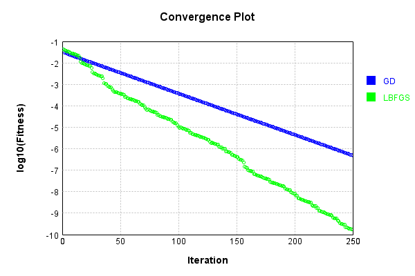
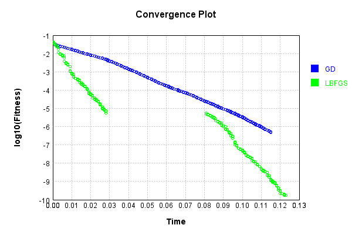
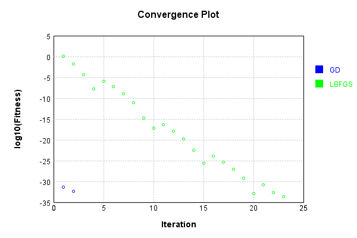
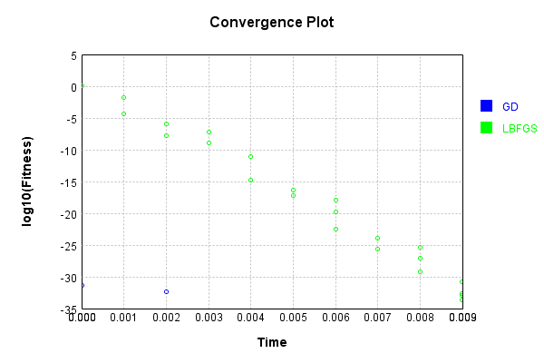
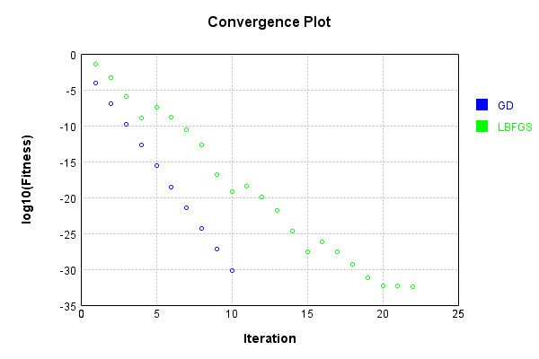
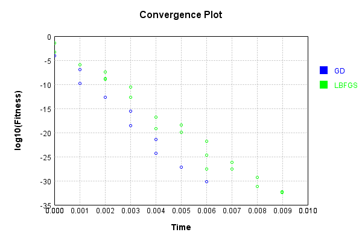

# FullyConnectedLayer
## FullyConnectedLayerTest
### Json Serialization
Code from [JsonTest.java:36](../../../../../../../src/main/java/com/simiacryptus/mindseye/test/unit/JsonTest.java#L36) executed in 0.00 seconds: 
```java
    JsonObject json = layer.getJson();
    NNLayer echo = NNLayer.fromJson(json);
    if ((echo == null)) throw new AssertionError("Failed to deserialize");
    if ((layer == echo)) throw new AssertionError("Serialization did not copy");
    if ((!layer.equals(echo))) throw new AssertionError("Serialization not equal");
    return new GsonBuilder().setPrettyPrinting().create().toJson(json);
```

Returns: 

```
    {
      "class": "com.simiacryptus.mindseye.layers.java.FullyConnectedLayer",
      "id": "7a551c94-79d1-44f4-b3b5-baa981152ca3",
      "isFrozen": false,
      "name": "FullyConnectedLayer/7a551c94-79d1-44f4-b3b5-baa981152ca3",
      "outputDims": [
        3
      ],
      "inputDims": [
        3
      ],
      "weights": [
        [
          0.4905702031910511,
          -0.14673135498692286,
          -0.2528810024136814
        ],
        [
          -0.03474227495376973,
          -0.29113685123500166,
          -0.5130114058390778
        ],
        [
          -0.3205961084898522,
          0.8254788400264649,
          0.32414759582922587
        ]
      ]
    }
```


### Example Input/Output Pair
Code from [ReferenceIO.java:68](../../../../../../../src/main/java/com/simiacryptus/mindseye/test/unit/ReferenceIO.java#L68) executed in 0.01 seconds: 
```java
    SimpleEval eval = SimpleEval.run(layer, inputPrototype);
    return String.format("--------------------\nInput: \n[%s]\n--------------------\nOutput: \n%s\n--------------------\nDerivative: \n%s",
      Arrays.stream(inputPrototype).map(t -> t.prettyPrint()).reduce((a, b) -> a + ",\n" + b).get(),
      eval.getOutput().prettyPrint(),
      Arrays.stream(eval.getDerivative()).map(t -> t.prettyPrint()).reduce((a, b) -> a + ",\n" + b).get());
```

Returns: 

```
    --------------------
    Input: 
    [[ 0.972, -0.216, -1.46 ]]
    --------------------
    Output: 
    [ 0.9524088872869001, -1.2849364236191674, -0.6082453605955273 ]
    --------------------
    Derivative: 
    [ 0.09095784579044686, -0.8388905320278492, 0.8290303273658386 ]
```


### Batch Execution
Code from [BatchingTester.java:66](../../../../../../../src/main/java/com/simiacryptus/mindseye/test/unit/BatchingTester.java#L66) executed in 0.00 seconds: 
```java
    return test(reference, inputPrototype);
```

Returns: 

```
    ToleranceStatistics{absoluteTol=0.0000e+00 +- 0.0000e+00 [0.0000e+00 - 0.0000e+00] (60#), relativeTol=0.0000e+00 +- 0.0000e+00 [0.0000e+00 - 0.0000e+00] (60#)}
```


Code from [SingleDerivativeTester.java:77](../../../../../../../src/main/java/com/simiacryptus/mindseye/test/unit/SingleDerivativeTester.java#L77) executed in 0.00 seconds: 
```java
    return test(component, inputPrototype);
```
Logging: 
```
    Inputs: [ 1.36, -0.148, -1.692 ]
    Inputs Statistics: {meanExponent=-0.15593300584394013, negative=2, min=-1.692, max=-1.692, mean=-0.15999999999999992, count=3.0, positive=1, stdDev=1.2460026752245223, zeros=0}
    Output: [ 1.2147659485978175, -1.5531765861242135, -0.8164502073614733 ]
    Outputs Statistics: {meanExponent=0.06254771609447034, negative=2, min=-0.8164502073614733, max=-0.8164502073614733, mean=-0.3849536149626231, count=3.0, positive=1, stdDev=1.170475245593208, zeros=0}
    Feedback for input 0
    Inputs Values: [ 1.36, -0.148, -1.692 ]
    Value Statistics: {meanExponent=-0.15593300584394013, negative=2, min=-1.692, max=-1.692, mean=-0.15999999999999992, count=3.0, positive=1, stdDev=1.2460026752245223, zeros=0}
    Implemented Feedback: [ [ 0.4905702031910511, -0.14673135498692286, -0.2528810024136814 ], [ -0.03474227495376973, -0.29113685123500166, -0.5130114058390778 ], [ -0.3205961084898522, 0.8254788400264649, 0.32414759582922587 ] ]
    Implemented Statistics: {meanExponent=-0.5657078056154867, negative=
```
...[skipping 1955 bytes](etc/270.txt)...
```
    999998048, 0.0 ], [ 0.0, 0.0, -1.6919999999998048 ] ]
    Measured Statistics: {meanExponent=-0.15593300584308015, negative=6, min=-1.6919999999998048, max=-1.6919999999998048, mean=-0.05333333333359227, count=27.0, positive=3, stdDev=0.7233231950133994, zeros=18}
    Gradient Error: [ [ -8.604228440844963E-13, 0.0, 0.0 ], [ 0.0, -8.604228440844963E-13, 0.0 ], [ 0.0, 0.0, -8.604228440844963E-13 ], [ -2.035399626620915E-12, 0.0, 0.0 ], [ 0.0, 1.8504642262939797E-13, 0.0 ], [ 0.0, 0.0, -9.251766019957586E-13 ], [ -2.0252688415212106E-12, 0.0, 0.0 ], [ 0.0, 1.9517720772910252E-13, 0.0 ], [ 0.0, 0.0, 1.9517720772910252E-13 ] ]
    Error Statistics: {meanExponent=-12.196263143982897, negative=6, min=1.9517720772910252E-13, max=1.9517720772910252E-13, mean=-2.5895232460384334E-13, count=27.0, positive=3, stdDev=5.969493392276228E-13, zeros=18}
    Finite-Difference Derivative Accuracy:
    absoluteTol: 4.6441e-13 +- 6.7924e-13 [0.0000e+00 - 2.2840e-12] (36#)
    relativeTol: 2.0341e-12 +- 3.2288e-12 [5.7676e-14 - 1.3419e-11] (18#)
    
```

Returns: 

```
    ToleranceStatistics{absoluteTol=4.6441e-13 +- 6.7924e-13 [0.0000e+00 - 2.2840e-12] (36#), relativeTol=2.0341e-12 +- 3.2288e-12 [5.7676e-14 - 1.3419e-11] (18#)}
```


### Performance
Now we execute larger-scale runs to benchmark performance:

Code from [PerformanceTester.java:66](../../../../../../../src/main/java/com/simiacryptus/mindseye/test/unit/PerformanceTester.java#L66) executed in 0.00 seconds: 
```java
    test(component, inputPrototype);
```
Logging: 
```
    100 batches
    Input Dimensions:
    	[3]
    Performance:
    	Evaluation performance: 0.000292s +- 0.000048s [0.000239s - 0.000366s]
    	Learning performance: 0.000304s +- 0.000076s [0.000210s - 0.000429s]
    
```

### Input Learning
In this test, we use a network to learn this target input, given it's pre-evaluated output:

Code from [LearningTester.java:127](../../../../../../../src/main/java/com/simiacryptus/mindseye/test/unit/LearningTester.java#L127) executed in 0.00 seconds: 
```java
    return Arrays.stream(input_target).map(x -> x.prettyPrint()).reduce((a, b) -> a + "\n" + b).orElse("");
```

Returns: 

```
    [ -1.192, 1.992, -1.196 ]
```


First, we use a conjugate gradient descent method, which converges the fastest for purely linear functions.

Code from [LearningTester.java:300](../../../../../../../src/main/java/com/simiacryptus/mindseye/test/unit/LearningTester.java#L300) executed in 0.12 seconds: 
```java
    return new IterativeTrainer(trainable)
      .setLineSearchFactory(label -> new QuadraticSearch())
      .setOrientation(new GradientDescent())
      .setMonitor(monitor)
      .setTimeout(30, TimeUnit.SECONDS)
      .setMaxIterations(250)
      .setTerminateThreshold(0)
      .run();
```
Logging: 
```
    Constructing line search parameters: GD
    F(0.0) = LineSearchPoint{point=PointSample{avg=0.17880081858838023}, derivative=-0.1228120523943082}
    New Minimum: 0.17880081858838023 > 0.17880081857609906
    F(1.0E-10) = LineSearchPoint{point=PointSample{avg=0.17880081857609906}, derivative=-0.12281205238878537}, delta = -1.2281176076101019E-11
    New Minimum: 0.17880081857609906 > 0.1788008185024118
    F(7.000000000000001E-10) = LineSearchPoint{point=PointSample{avg=0.1788008185024118}, derivative=-0.1228120523556484}, delta = -8.596842682173644E-11
    New Minimum: 0.1788008185024118 > 0.1788008179866011
    F(4.900000000000001E-9) = LineSearchPoint{point=PointSample{avg=0.1788008179866011}, derivative=-0.12281205212368952}, delta = -6.017791265300332E-10
    New Minimum: 0.1788008179866011 > 0.17880081437592688
    F(3.430000000000001E-8) = LineSearchPoint{point=PointSample{avg=0.17880081437592688}, derivative=-0.12281205049997745}, delta = -4.2124533583542956E-9
    New Minimum: 0.17880081437592688 > 0.17880078910120803
    F(2.4010000
```
...[skipping 296930 bytes](etc/271.txt)...
```
    243656E-7}, derivative=-3.4212869637122662E-9}, delta = -1.3446368963632761E-8
    F(21.122158594986914) = LineSearchPoint{point=PointSample{avg=5.435895471345166E-7}, derivative=8.997680614992954E-9}, delta = 3.7033118646518215E-8
    F(1.6247814303836088) = LineSearchPoint{point=PointSample{avg=4.985399948957749E-7}, derivative=-4.37659216207434E-9}, delta = -8.016433592223486E-9
    New Minimum: 4.931100595243656E-7 > 4.884693659355837E-7
    F(11.373470012685262) = LineSearchPoint{point=PointSample{avg=4.884693659355837E-7}, derivative=2.3105442264552773E-9}, delta = -1.8087062552414727E-8
    4.884693659355837E-7 <= 5.065564284879984E-7
    New Minimum: 4.884693659355837E-7 > 4.845779774254906E-7
    F(8.005096046517298) = LineSearchPoint{point=PointSample{avg=4.845779774254906E-7}, derivative=1.929398778779937E-21}, delta = -2.1978451062507784E-8
    Right bracket at 8.005096046517298
    Converged to right
    Iteration 250 complete. Error: 4.845779774254906E-7 Total: 249771282740893.7200; Orientation: 0.0000; Line Search: 0.0003
    
```

Returns: 

```
    4.845779774254906E-7
```


Training Converged

Next, we run the same optimization using L-BFGS, which is nearly ideal for purely second-order or quadratic functions.

Code from [LearningTester.java:324](../../../../../../../src/main/java/com/simiacryptus/mindseye/test/unit/LearningTester.java#L324) executed in 0.12 seconds: 
```java
    return new IterativeTrainer(trainable)
      .setLineSearchFactory(label -> new ArmijoWolfeSearch())
      .setOrientation(new LBFGS())
      .setMonitor(monitor)
      .setTimeout(30, TimeUnit.SECONDS)
      .setMaxIterations(250)
      .setTerminateThreshold(0)
      .run();
```
Logging: 
```
    LBFGS Accumulation History: 1 points
    Constructing line search parameters: GD
    th(0)=0.17880081858838023;dx=-0.1228120523943082
    New Minimum: 0.17880081858838023 > 0.04238380734630302
    END: th(2.154434690031884)=0.04238380734630302; dx=-0.003826282824902668 delta=0.13641701124207722
    Iteration 1 complete. Error: 0.04238380734630302 Total: 249771286437918.7200; Orientation: 0.0001; Line Search: 0.0001
    LBFGS Accumulation History: 1 points
    th(0)=0.04238380734630302;dx=-7.593672473389715E-4
    New Minimum: 0.04238380734630302 > 0.03943600790874117
    END: th(4.641588833612779)=0.03943600790874117; dx=-5.108010261689853E-4 delta=0.002947799437561849
    Iteration 2 complete. Error: 0.03943600790874117 Total: 249771286611185.7200; Orientation: 0.0000; Line Search: 0.0001
    LBFGS Accumulation History: 1 points
    th(0)=0.03943600790874117;dx=-6.260569719372785E-4
    New Minimum: 0.03943600790874117 > 0.03591921448834933
    END: th(10.000000000000002)=0.03591921448834933; dx=-7.73017121410836E-5 delta=0.0035167934203918366
    Iter
```
...[skipping 139331 bytes](etc/272.txt)...
```
    um: 1.8728098762885548E-10 > 1.8062282664909127E-10
    WOLF (strong): th(9.673564992358898)=1.8062282664909127E-10; dx=7.490215349151709E-13 delta=6.658160979764213E-12
    New Minimum: 1.8062282664909127E-10 > 1.8047593976967597E-10
    END: th(4.836782496179449)=1.8047593976967597E-10; dx=-6.882841004514511E-13 delta=6.805047859179517E-12
    Iteration 249 complete. Error: 1.8047593976967597E-10 Total: 249771408992875.6000; Orientation: 0.0000; Line Search: 0.0002
    LBFGS Accumulation History: 1 points
    th(0)=1.8047593976967597E-10;dx=-2.334005375822512E-12
    New Minimum: 1.8047593976967597E-10 > 1.787793182818422E-10
    WOLF (strong): th(10.420531997908013)=1.787793182818422E-10; dx=2.0083748824509867E-12 delta=1.696621487833759E-12
    New Minimum: 1.787793182818422E-10 > 1.7397138997207227E-10
    END: th(5.210265998954006)=1.7397138997207227E-10; dx=-1.628152467226677E-13 delta=6.504549797603696E-12
    Iteration 250 complete. Error: 1.7397138997207227E-10 Total: 249771409306921.6000; Orientation: 0.0000; Line Search: 0.0003
    
```

Returns: 

```
    1.7397138997207227E-10
```


Training Converged

Code from [LearningTester.java:96](../../../../../../../src/main/java/com/simiacryptus/mindseye/test/unit/LearningTester.java#L96) executed in 0.00 seconds: 
```java
    return TestUtil.compare(runs);
```

Returns: 




Code from [LearningTester.java:99](../../../../../../../src/main/java/com/simiacryptus/mindseye/test/unit/LearningTester.java#L99) executed in 0.00 seconds: 
```java
    return TestUtil.compareTime(runs);
```

Returns: 




### Model Learning
In this test, attempt to train a network to emulate a randomized network given an example input/output. The target state is:

Code from [LearningTester.java:176](../../../../../../../src/main/java/com/simiacryptus/mindseye/test/unit/LearningTester.java#L176) executed in 0.00 seconds: 
```java
    return network_target.state().stream().map(Arrays::toString).reduce((a, b) -> a + "\n" + b).orElse("");
```

Returns: 

```
    [-0.22571535683344565, 0.03290291885375944, -0.43488511545577185, -0.2538729092098257, 0.5110952188195882, -0.06445716145580617, 0.16203219801241586, -0.2519020427841727, 0.2995782674759972]
```


First, we use a conjugate gradient descent method, which converges the fastest for purely linear functions.

Code from [LearningTester.java:300](../../../../../../../src/main/java/com/simiacryptus/mindseye/test/unit/LearningTester.java#L300) executed in 0.01 seconds: 
```java
    return new IterativeTrainer(trainable)
      .setLineSearchFactory(label -> new QuadraticSearch())
      .setOrientation(new GradientDescent())
      .setMonitor(monitor)
      .setTimeout(30, TimeUnit.SECONDS)
      .setMaxIterations(250)
      .setTerminateThreshold(0)
      .run();
```
Logging: 
```
    Constructing line search parameters: GD
    F(0.0) = LineSearchPoint{point=PointSample{avg=0.05361290586312218}, derivative=-0.4874731305603295}
    New Minimum: 0.05361290586312218 > 0.05361290581437492
    F(1.0E-10) = LineSearchPoint{point=PointSample{avg=0.05361290581437492}, derivative=-0.48747313033871315}, delta = -4.874726317050104E-11
    New Minimum: 0.05361290581437492 > 0.05361290552189097
    F(7.000000000000001E-10) = LineSearchPoint{point=PointSample{avg=0.05361290552189097}, derivative=-0.48747312900901413}, delta = -3.412312099548842E-10
    New Minimum: 0.05361290552189097 > 0.05361290347450382
    F(4.900000000000001E-9) = LineSearchPoint{point=PointSample{avg=0.05361290347450382}, derivative=-0.48747311970112245}, delta = -2.388618358661887E-9
    New Minimum: 0.05361290347450382 > 0.053612889142795134
    F(3.430000000000001E-8) = LineSearchPoint{point=PointSample{avg=0.053612889142795134}, derivative=-0.48747305454588213}, delta = -1.6720327046526595E-8
    New Minimum: 0.053612889142795134 > 0.05361278882088741
    F(2
```
...[skipping 4341 bytes](etc/273.txt)...
```
    int{point=PointSample{avg=2.0543252740130517E-32}, derivative=-5.603660292555702E-32}, delta = -2.157041537713704E-32
    2.0543252740130517E-32 > 1.6434602192104412E-32
    Iteration 2 complete. Error: 4.108650548026103E-33 Total: 249771542450535.4700; Orientation: 0.0000; Line Search: 0.0018
    Zero gradient: 4.321905556794635E-16
    F(0.0) = LineSearchPoint{point=PointSample{avg=2.0543252740130517E-32}, derivative=-1.8678867641852342E-31}
    New Minimum: 2.0543252740130517E-32 > 4.108650548026103E-33
    F(0.22321638989211104) = LineSearchPoint{point=PointSample{avg=4.108650548026103E-33}, derivative=3.7357735283704685E-32}, delta = -1.6434602192104414E-32
    4.108650548026103E-33 <= 2.0543252740130517E-32
    New Minimum: 4.108650548026103E-33 > 0.0
    F(0.1860136582434259) = LineSearchPoint{point=PointSample{avg=0.0}, derivative=0.0}, delta = -2.0543252740130517E-32
    Right bracket at 0.1860136582434259
    Converged to right
    Iteration 3 complete. Error: 0.0 Total: 249771543107980.4700; Orientation: 0.0000; Line Search: 0.0005
    
```

Returns: 

```
    0.0
```


Training Converged

Next, we run the same optimization using L-BFGS, which is nearly ideal for purely second-order or quadratic functions.

Code from [LearningTester.java:324](../../../../../../../src/main/java/com/simiacryptus/mindseye/test/unit/LearningTester.java#L324) executed in 0.01 seconds: 
```java
    return new IterativeTrainer(trainable)
      .setLineSearchFactory(label -> new ArmijoWolfeSearch())
      .setOrientation(new LBFGS())
      .setMonitor(monitor)
      .setTimeout(30, TimeUnit.SECONDS)
      .setMaxIterations(250)
      .setTerminateThreshold(0)
      .run();
```
Logging: 
```
    LBFGS Accumulation History: 1 points
    Constructing line search parameters: GD
    th(0)=2.940302613386079;dx=-26.734579979704897
    Armijo: th(2.154434690031884)=227.4153043030958; dx=235.11871223333813 delta=-224.47500168970973
    Armijo: th(1.077217345015942)=44.6595764028865; dx=104.19206612681666 delta=-41.71927378950042
    New Minimum: 2.940302613386079 > 1.1760100864741099
    WOLF (strong): th(0.3590724483386473)=1.1760100864741099; dx=16.907635389135617 delta=1.764292526911969
    New Minimum: 1.1760100864741099 > 1.0300997513382015
    END: th(0.08976811208466183)=1.0300997513382015; dx=-15.824026137494767 delta=1.9102028620478773
    Iteration 1 complete. Error: 1.0300997513382015 Total: 249771547313976.4700; Orientation: 0.0001; Line Search: 0.0006
    LBFGS Accumulation History: 1 points
    th(0)=1.0300997513382015;dx=-9.366139411586206
    New Minimum: 1.0300997513382015 > 0.015022260487803106
    END: th(0.1933995347338658)=0.015022260487803106; dx=-1.1310677533351698 delta=1.0150774908503983
    Iteration 2 complete. Error: 0.01
```
...[skipping 12918 bytes](etc/274.txt)...
```
    .3348584552315428E-33 delta=0.0
    Armijo: th(1.1817204979335548E-11)=2.5679065925163143E-34; dx=-2.3348584552315428E-33 delta=0.0
    WOLFE (weak): th(8.159498676207879E-12)=2.5679065925163143E-34; dx=-2.3348584552315428E-33 delta=0.0
    Armijo: th(9.988351827771714E-12)=2.5679065925163143E-34; dx=-2.3348584552315428E-33 delta=0.0
    WOLFE (weak): th(9.073925251989796E-12)=2.5679065925163143E-34; dx=-2.3348584552315428E-33 delta=0.0
    Armijo: th(9.531138539880755E-12)=2.5679065925163143E-34; dx=-2.3348584552315428E-33 delta=0.0
    Armijo: th(9.302531895935275E-12)=2.5679065925163143E-34; dx=-2.3348584552315428E-33 delta=0.0
    Armijo: th(9.188228573962536E-12)=2.5679065925163143E-34; dx=-2.3348584552315428E-33 delta=0.0
    WOLFE (weak): th(9.131076912976166E-12)=2.5679065925163143E-34; dx=-2.3348584552315428E-33 delta=0.0
    mu /= nu: th(0)=2.5679065925163143E-34;th'(0)=-2.3348584552315428E-33;
    Iteration 24 failed, aborting. Error: 2.5679065925163143E-34 Total: 249771558518471.4400; Orientation: 0.0000; Line Search: 0.0021
    
```

Returns: 

```
    2.5679065925163143E-34
```


Training Converged

Code from [LearningTester.java:96](../../../../../../../src/main/java/com/simiacryptus/mindseye/test/unit/LearningTester.java#L96) executed in 0.00 seconds: 
```java
    return TestUtil.compare(runs);
```

Returns: 




Code from [LearningTester.java:99](../../../../../../../src/main/java/com/simiacryptus/mindseye/test/unit/LearningTester.java#L99) executed in 0.00 seconds: 
```java
    return TestUtil.compareTime(runs);
```

Returns: 




### Composite Learning
In this test, attempt to train a network to emulate a randomized network given an example input/output. The target state is:

Code from [LearningTester.java:219](../../../../../../../src/main/java/com/simiacryptus/mindseye/test/unit/LearningTester.java#L219) executed in 0.00 seconds: 
```java
    return network_target.state().stream().map(Arrays::toString).reduce((a, b) -> a + "\n" + b).orElse("");
```

Returns: 

```
    [0.2995782674759972, -0.2519020427841727, -0.06445716145580617, 0.5110952188195882, -0.43488511545577185, -0.22571535683344565, 0.03290291885375944, 0.16203219801241586, -0.2538729092098257]
```


We simultaneously regress this target input:

Code from [LearningTester.java:223](../../../../../../../src/main/java/com/simiacryptus/mindseye/test/unit/LearningTester.java#L223) executed in 0.00 seconds: 
```java
    return Arrays.stream(testInput).map(x -> x.prettyPrint()).reduce((a, b) -> a + "\n" + b).orElse("");
```

Returns: 

```
    [ -1.196, 1.992, -1.192 ]
```


Which produces the following output:

Code from [LearningTester.java:230](../../../../../../../src/main/java/com/simiacryptus/mindseye/test/unit/LearningTester.java#L230) executed in 0.00 seconds: 
```java
    return Stream.of(targetOutput).map(x -> x.prettyPrint()).reduce((a, b) -> a + "\n" + b).orElse("");
```

Returns: 

```
    [ 0.6205857887136458, -0.7581586868488266, -0.0699177179329673 ]
```


First, we use a conjugate gradient descent method, which converges the fastest for purely linear functions.

Code from [LearningTester.java:300](../../../../../../../src/main/java/com/simiacryptus/mindseye/test/unit/LearningTester.java#L300) executed in 0.01 seconds: 
```java
    return new IterativeTrainer(trainable)
      .setLineSearchFactory(label -> new QuadraticSearch())
      .setOrientation(new GradientDescent())
      .setMonitor(monitor)
      .setTimeout(30, TimeUnit.SECONDS)
      .setMaxIterations(250)
      .setTerminateThreshold(0)
      .run();
```
Logging: 
```
    Constructing line search parameters: GD
    F(0.0) = LineSearchPoint{point=PointSample{avg=0.12055229109737531}, derivative=-1.110735229703075}
    New Minimum: 0.12055229109737531 > 0.12055229098630182
    F(1.0E-10) = LineSearchPoint{point=PointSample{avg=0.12055229098630182}, derivative=-1.1107352291910717}, delta = -1.1107348374395087E-10
    New Minimum: 0.12055229098630182 > 0.12055229031986069
    F(7.000000000000001E-10) = LineSearchPoint{point=PointSample{avg=0.12055229031986069}, derivative=-1.110735226119051}, delta = -7.775146221300488E-10
    New Minimum: 0.12055229031986069 > 0.12055228565477283
    F(4.900000000000001E-9) = LineSearchPoint{point=PointSample{avg=0.12055228565477283}, derivative=-1.1107352046149075}, delta = -5.442602479810432E-9
    New Minimum: 0.12055228565477283 > 0.12055225299915999
    F(3.430000000000001E-8) = LineSearchPoint{point=PointSample{avg=0.12055225299915999}, derivative=-1.1107350540859013}, delta = -3.809821531863822E-8
    New Minimum: 0.12055225299915999 > 0.12055202440999424
    F(2.40100000
```
...[skipping 13032 bytes](etc/275.txt)...
```
    .1738182026018704E-30}, derivative=1.8279599388946271E-29}, delta = 4.429895662749894E-30
    F(0.06017542467887091) = LineSearchPoint{point=PointSample{avg=4.149737053506364E-31}, derivative=-5.162521938145135E-30}, delta = -3.289488345013399E-31
    F(0.42122797275209634) = LineSearchPoint{point=PointSample{avg=6.843471069055978E-31}, derivative=6.592544648388501E-30}, delta = -5.957543294637844E-32
    6.843471069055978E-31 <= 7.439225398519763E-31
    New Minimum: 2.1570415377137042E-32 > 5.135813185032629E-33
    F(0.21583848951040857) = LineSearchPoint{point=PointSample{avg=5.135813185032629E-33}, derivative=-5.710965653388354E-31}, delta = -7.387867266669437E-31
    Left bracket at 0.21583848951040857
    New Minimum: 5.135813185032629E-33 > 0.0
    F(0.23221245701331414) = LineSearchPoint{point=PointSample{avg=0.0}, derivative=0.0}, delta = -7.439225398519763E-31
    Right bracket at 0.23221245701331414
    Converged to right
    Iteration 11 complete. Error: 0.0 Total: 249771674998258.3000; Orientation: 0.0000; Line Search: 0.0011
    
```

Returns: 

```
    0.0
```


Training Converged

Next, we run the same optimization using L-BFGS, which is nearly ideal for purely second-order or quadratic functions.

Code from [LearningTester.java:324](../../../../../../../src/main/java/com/simiacryptus/mindseye/test/unit/LearningTester.java#L324) executed in 0.01 seconds: 
```java
    return new IterativeTrainer(trainable)
      .setLineSearchFactory(label -> new ArmijoWolfeSearch())
      .setOrientation(new LBFGS())
      .setMonitor(monitor)
      .setTimeout(30, TimeUnit.SECONDS)
      .setMaxIterations(250)
      .setTerminateThreshold(0)
      .run();
```
Logging: 
```
    LBFGS Accumulation History: 1 points
    Constructing line search parameters: GD
    th(0)=0.12055229109737531;dx=-1.110735229703075
    Armijo: th(2.154434690031884)=9.623138332801565; dx=9.938211626377875 delta=-9.50258604170419
    Armijo: th(1.077217345015942)=1.8963162363694266; dx=4.409195490074123 delta=-1.7757639452720513
    New Minimum: 0.12055229109737531 > 0.05184900130974768
    WOLF (strong): th(0.3590724483386473)=0.05184900130974768; dx=0.72823249395636 delta=0.06870328978762763
    New Minimum: 0.05184900130974768 > 0.04147405155326894
    END: th(0.08976811208466183)=0.04147405155326894; dx=-0.651087893817646 delta=0.07907823954410637
    Iteration 1 complete. Error: 0.04147405155326894 Total: 249771681058894.3000; Orientation: 0.0001; Line Search: 0.0009
    LBFGS Accumulation History: 1 points
    th(0)=0.04147405155326894;dx=-0.3822371709347159
    New Minimum: 0.04147405155326894 > 5.062481565045572E-4
    END: th(0.1933995347338658)=5.062481565045572E-4; dx=-0.04088359949062631 delta=0.04096780339676438
    Iteration 2 complete
```
...[skipping 10262 bytes](etc/276.txt)...
```
    35813185032629E-33;dx=-4.831581445796548E-32
    New Minimum: 5.135813185032629E-33 > 4.365441207277735E-33
    WOLF (strong): th(0.3382105399601761)=4.365441207277735E-33; dx=4.3545117753455605E-32 delta=7.703719777548943E-34
    New Minimum: 4.365441207277735E-33 > 4.108650548026103E-33
    END: th(0.16910526998008804)=4.108650548026103E-33; dx=-3.8774421048945723E-32 delta=1.0271626370065262E-33
    Iteration 22 complete. Error: 4.108650548026103E-33 Total: 249771690257426.3000; Orientation: 0.0000; Line Search: 0.0003
    LBFGS Accumulation History: 1 points
    th(0)=4.108650548026103E-33;dx=-3.882713338843816E-32
    Armijo: th(0.364326259912309)=1.6434602192104412E-32; dx=7.765426677687632E-32 delta=-1.232595164407831E-32
    Armijo: th(0.1821631299561545)=4.108650548026103E-33; dx=3.882713338843816E-32 delta=0.0
    New Minimum: 4.108650548026103E-33 > 0.0
    END: th(0.060721043318718165)=0.0; dx=0.0 delta=4.108650548026103E-33
    Iteration 23 complete. Error: 0.0 Total: 249771691089563.3000; Orientation: 0.0001; Line Search: 0.0007
    
```

Returns: 

```
    0.0
```


Training Converged

Code from [LearningTester.java:96](../../../../../../../src/main/java/com/simiacryptus/mindseye/test/unit/LearningTester.java#L96) executed in 0.00 seconds: 
```java
    return TestUtil.compare(runs);
```

Returns: 




Code from [LearningTester.java:99](../../../../../../../src/main/java/com/simiacryptus/mindseye/test/unit/LearningTester.java#L99) executed in 0.00 seconds: 
```java
    return TestUtil.compareTime(runs);
```

Returns: 




