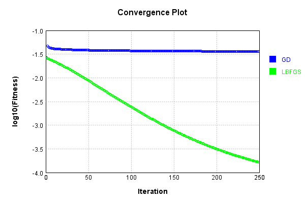
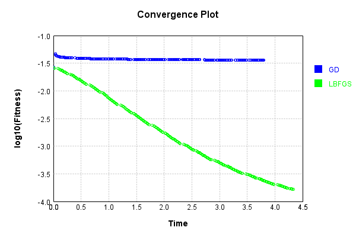
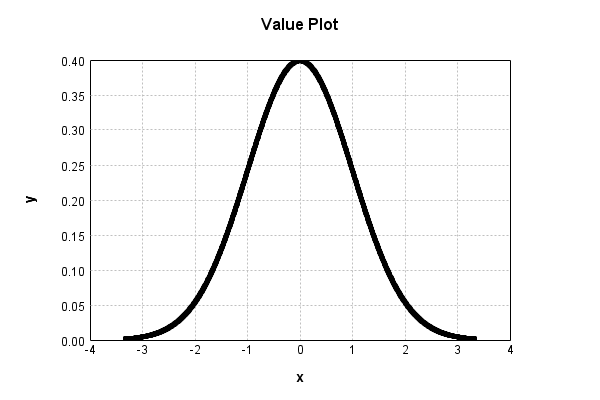
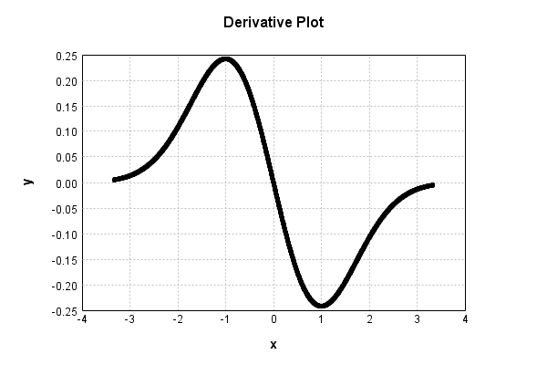

# GaussianActivationLayer
## GaussianActivationLayerTest
### Json Serialization
Code from [JsonTest.java:36](../../../../../../../src/main/java/com/simiacryptus/mindseye/test/unit/JsonTest.java#L36) executed in 0.00 seconds: 
```java
    JsonObject json = layer.getJson();
    NNLayer echo = NNLayer.fromJson(json);
    if ((echo == null)) throw new AssertionError("Failed to deserialize");
    if ((layer == echo)) throw new AssertionError("Serialization did not copy");
    if ((!layer.equals(echo))) throw new AssertionError("Serialization not equal");
    return new GsonBuilder().setPrettyPrinting().create().toJson(json);
```

Returns: 

```
    {
      "class": "com.simiacryptus.mindseye.layers.java.GaussianActivationLayer",
      "id": "9a5dbb19-2390-492c-a80b-dc3c6d1fda69",
      "isFrozen": true,
      "name": "GaussianActivationLayer/9a5dbb19-2390-492c-a80b-dc3c6d1fda69",
      "mean": 0.0,
      "stddev": 1.0
    }
```


### Example Input/Output Pair
Code from [ReferenceIO.java:68](../../../../../../../src/main/java/com/simiacryptus/mindseye/test/unit/ReferenceIO.java#L68) executed in 0.00 seconds: 
```java
    SimpleEval eval = SimpleEval.run(layer, inputPrototype);
    return String.format("--------------------\nInput: \n[%s]\n--------------------\nOutput: \n%s\n--------------------\nDerivative: \n%s",
      Arrays.stream(inputPrototype).map(t -> t.prettyPrint()).reduce((a, b) -> a + ",\n" + b).get(),
      eval.getOutput().prettyPrint(),
      Arrays.stream(eval.getDerivative()).map(t -> t.prettyPrint()).reduce((a, b) -> a + ",\n" + b).get());
```

Returns: 

```
    --------------------
    Input: 
    [[
    	[ [ -1.132 ], [ -0.628 ], [ 0.656 ] ],
    	[ [ -1.74 ], [ 0.56 ], [ -1.58 ] ]
    ]]
    --------------------
    Output: 
    [
    	[ [ 0.21020951961329312 ], [ 0.3275447692646581 ], [ 0.3217094296581982 ] ],
    	[ [ 0.08779607061090564 ], [ 0.34104578863035256 ], [ 0.11450480025929236 ] ]
    ]
    --------------------
    Derivative: 
    [
    	[ [ 0.2379571762022478 ], [ 0.2056981150982053 ], [ -0.21104138585577803 ] ],
    	[ [ 0.1527651628629758 ], [ -0.19098564163299747 ], [ 0.18091758440968195 ] ]
    ]
```


### Batch Execution
Code from [BatchingTester.java:66](../../../../../../../src/main/java/com/simiacryptus/mindseye/test/unit/BatchingTester.java#L66) executed in 0.00 seconds: 
```java
    return test(reference, inputPrototype);
```

Returns: 

```
    ToleranceStatistics{absoluteTol=0.0000e+00 +- 0.0000e+00 [0.0000e+00 - 0.0000e+00] (120#), relativeTol=0.0000e+00 +- 0.0000e+00 [0.0000e+00 - 0.0000e+00] (120#)}
```


Code from [SingleDerivativeTester.java:77](../../../../../../../src/main/java/com/simiacryptus/mindseye/test/unit/SingleDerivativeTester.java#L77) executed in 0.00 seconds: 
```java
    return test(component, inputPrototype);
```
Logging: 
```
    Inputs: [
    	[ [ -0.972 ], [ 1.316 ], [ 0.3 ] ],
    	[ [ -1.456 ], [ -1.028 ], [ -1.048 ] ]
    ]
    Inputs Statistics: {meanExponent=-0.03674013646535718, negative=4, min=-1.048, max=-1.048, mean=-0.48133333333333334, count=6.0, positive=2, stdDev=0.9705302101886829, zeros=0}
    Output: [
    	[ [ 0.24874412204196625 ], [ 0.1678194578307663 ], [ 0.38138781546052414 ] ],
    	[ [ 0.13822029401003963 ], [ 0.235197302213376 ], [ 0.23036493969445945 ] ]
    ]
    Outputs Statistics: {meanExponent=-0.6539362523971225, negative=0, min=0.23036493969445945, max=0.23036493969445945, mean=0.2336223218751886, count=6.0, positive=6, stdDev=0.07692850021694418, zeros=0}
    Feedback for input 0
    Inputs Values: [
    	[ [ -0.972 ], [ 1.316 ], [ 0.3 ] ],
    	[ [ -1.456 ], [ -1.028 ], [ -1.048 ] ]
    ]
    Value Statistics: {meanExponent=-0.03674013646535718, negative=4, min=-1.048, max=-1.048, mean=-0.48133333333333334, count=6.0, positive=2, stdDev=0.9705302101886829, zeros=0}
    Implemented Feedback: [ [ 0.24177928662479117, 0.0, 0.0, 0.0, 0.0, 0.0 ], [ 0.0, 0.20124
```
...[skipping 676 bytes](etc/277.txt)...
```
     0.0, 0.0, 0.0, -0.11443369722918817, 0.0 ], [ 0.0, 0.0, 0.0, 0.0, 0.0, 0.24142358832440758 ] ]
    Measured Statistics: {meanExponent=-0.6906643081913297, negative=2, min=0.24142358832440758, max=0.24142358832440758, mean=0.016415672401296242, count=36.0, positive=4, stdDev=0.08626056412935956, zeros=30}
    Feedback Error: [ [ -6.87561244355761E-7, 0.0, 0.0, 0.0, 0.0, 0.0 ], [ 0.0, 7.739599096806549E-6, 0.0, 0.0, 0.0, 0.0 ], [ 0.0, 0.0, 6.141450534680182E-6, 0.0, 0.0, 0.0 ], [ 0.0, 0.0, 0.0, 6.669895871447284E-7, 0.0, 0.0 ], [ 0.0, 0.0, 0.0, 0.0, -1.735259103091691E-5, 0.0 ], [ 0.0, 0.0, 0.0, 0.0, 0.0, 1.1315246140897184E-6 ] ]
    Error Statistics: {meanExponent=-5.5614252994534175, negative=2, min=1.1315246140897184E-6, max=1.1315246140897184E-6, mean=-6.55719011819859E-8, count=36.0, positive=4, stdDev=3.336558438095617E-6, zeros=30}
    Finite-Difference Derivative Accuracy:
    absoluteTol: 9.3666e-07 +- 3.2031e-06 [0.0000e+00 - 1.7353e-05] (36#)
    relativeTol: 1.9017e-05 +- 2.6306e-05 [1.3793e-06 - 7.5825e-05] (6#)
    
```

Returns: 

```
    ToleranceStatistics{absoluteTol=9.3666e-07 +- 3.2031e-06 [0.0000e+00 - 1.7353e-05] (36#), relativeTol=1.9017e-05 +- 2.6306e-05 [1.3793e-06 - 7.5825e-05] (6#)}
```


### Performance
Now we execute larger-scale runs to benchmark performance:

Code from [PerformanceTester.java:66](../../../../../../../src/main/java/com/simiacryptus/mindseye/test/unit/PerformanceTester.java#L66) executed in 0.27 seconds: 
```java
    test(component, inputPrototype);
```
Logging: 
```
    100 batches
    Input Dimensions:
    	[100, 100, 1]
    Performance:
    	Evaluation performance: 0.026142s +- 0.022617s [0.007323s - 0.055496s]
    	Learning performance: 0.014713s +- 0.003158s [0.012273s - 0.020948s]
    
```

### Input Learning
In this test, we use a network to learn this target input, given it's pre-evaluated output:

Code from [LearningTester.java:127](../../../../../../../src/main/java/com/simiacryptus/mindseye/test/unit/LearningTester.java#L127) executed in 0.01 seconds: 
```java
    return Arrays.stream(input_target).map(x -> x.prettyPrint()).reduce((a, b) -> a + "\n" + b).orElse("");
```

Returns: 

```
    [
    	[ [ 1.216 ], [ 0.124 ], [ -0.5 ], [ -1.912 ], [ 0.444 ], [ 0.48 ], [ 0.708 ], [ -1.448 ], ... ],
    	[ [ -1.192 ], [ 0.148 ], [ -0.124 ], [ 1.684 ], [ -1.392 ], [ 1.352 ], [ 1.58 ], [ -1.352 ], ... ],
    	[ [ 0.02 ], [ 0.872 ], [ 0.72 ], [ -1.892 ], [ -1.092 ], [ 1.632 ], [ 0.464 ], [ -1.64 ], ... ],
    	[ [ -1.236 ], [ 0.748 ], [ 1.336 ], [ -0.74 ], [ 0.676 ], [ -0.332 ], [ 0.636 ], [ -0.284 ], ... ],
    	[ [ 0.608 ], [ 0.952 ], [ 1.788 ], [ 0.36 ], [ 0.752 ], [ -1.236 ], [ -0.98 ], [ -1.78 ], ... ],
    	[ [ -1.416 ], [ 0.736 ], [ 1.132 ], [ 0.28 ], [ 0.92 ], [ -0.488 ], [ 1.076 ], [ 1.872 ], ... ],
    	[ [ 0.904 ], [ 1.584 ], [ -0.224 ], [ -0.972 ], [ 0.248 ], [ 1.656 ], [ -1.48 ], [ 0.448 ], ... ],
    	[ [ -0.284 ], [ 0.836 ], [ 1.512 ], [ 1.6 ], [ 1.368 ], [ 0.748 ], [ -0.04 ], [ -0.448 ], ... ],
    	...
    ]
```


First, we use a conjugate gradient descent method, which converges the fastest for purely linear functions.

Code from [LearningTester.java:300](../../../../../../../src/main/java/com/simiacryptus/mindseye/test/unit/LearningTester.java#L300) executed in 3.86 seconds: 
```java
    return new IterativeTrainer(trainable)
      .setLineSearchFactory(label -> new QuadraticSearch())
      .setOrientation(new GradientDescent())
      .setMonitor(monitor)
      .setTimeout(30, TimeUnit.SECONDS)
      .setMaxIterations(250)
      .setTerminateThreshold(0)
      .run();
```
Logging: 
```
    Constructing line search parameters: GD
    F(0.0) = LineSearchPoint{point=PointSample{avg=0.02646521217608506}, derivative=-2.867580801045894E-7}
    New Minimum: 0.02646521217608506 > 0.026465212176085027
    F(1.0E-10) = LineSearchPoint{point=PointSample{avg=0.026465212176085027}, derivative=-2.8675808010458933E-7}, delta = -3.469446951953614E-17
    New Minimum: 0.026465212176085027 > 0.026465212176084867
    F(7.000000000000001E-10) = LineSearchPoint{point=PointSample{avg=0.026465212176084867}, derivative=-2.867580801045892E-7}, delta = -1.942890293094024E-16
    New Minimum: 0.026465212176084867 > 0.026465212176083684
    F(4.900000000000001E-9) = LineSearchPoint{point=PointSample{avg=0.026465212176083684}, derivative=-2.867580801045882E-7}, delta = -1.3773704399255848E-15
    New Minimum: 0.026465212176083684 > 0.026465212176075163
    F(3.430000000000001E-8) = LineSearchPoint{point=PointSample{avg=0.026465212176075163}, derivative=-2.8675808010458144E-7}, delta = -9.898332153923661E-15
    New Minimum: 0.026465212176075163 > 0.026
```
...[skipping 364272 bytes](etc/278.txt)...
```
    =PointSample{avg=0.0359017735505208}, derivative=7.321148716972828E-11}, delta = -1.0093336202957048E-5
    0.0359017735505208 <= 0.03591186688672376
    New Minimum: 0.0359017735505208 > 0.03589904733096164
    F(148500.15743218816) = LineSearchPoint{point=PointSample{avg=0.03589904733096164}, derivative=2.071287149904116E-11}, delta = -1.2819555762114132E-5
    Right bracket at 148500.15743218816
    New Minimum: 0.03589904733096164 > 0.03589883165811118
    F(132763.08475078674) = LineSearchPoint{point=PointSample{avg=0.03589883165811118}, derivative=5.868353652681087E-12}, delta = -1.3035228612574834E-5
    Right bracket at 132763.08475078674
    New Minimum: 0.03589883165811118 > 0.035898816989332276
    F(128449.33983860712) = LineSearchPoint{point=PointSample{avg=0.035898816989332276}, derivative=8.591724554185742E-13}, delta = -1.3049897391481657E-5
    Right bracket at 128449.33983860712
    Converged to right
    Iteration 250 complete. Error: 0.035898816989332276 Total: 249775953047395.0600; Orientation: 0.0004; Line Search: 0.0106
    
```

Returns: 

```
    0.035898816989332276
```


This training run resulted in the following regressed input:

Code from [LearningTester.java:144](../../../../../../../src/main/java/com/simiacryptus/mindseye/test/unit/LearningTester.java#L144) executed in 0.00 seconds: 
```java
    return Arrays.stream(input_gd).map(x -> x.prettyPrint()).reduce((a, b) -> a + "\n" + b).orElse("");
```

Returns: 

```
    [
    	[ [ 7.088063501086051 ], [ -11.248759521034255 ], [ -7.621489695830992 ], [ 8.168732800694652 ], [ 9.72097481725998 ], [ -6.857385260528595 ], [ 0.7079999999999999 ], [ -10.037515876521335 ], ... ],
    	[ [ 5.889525622604641 ], [ 8.863823735735844 ], [ -9.936778876945496 ], [ -1.684 ], [ 1.392 ], [ 1.352 ], [ 4.2558666908387925 ], [ 1.352 ], ... ],
    	[ [ -0.027929580099333395 ], [ -0.8720000000119148 ], [ -0.7199999999999999 ], [ 5.160483385550207 ], [ -1.0920021630335393 ], [ -6.812219651259598 ], [ 0.4639999999999999 ], [ 8.63652536157592 ], ... ],
    	[ [ -1.236 ], [ -5.821366414273078 ], [ 1.336 ], [ -0.74 ], [ -0.676 ], [ 9.85654850382256 ], [ -6.457277486468837 ], [ -10.32430518374703 ], ... ],
    	[ [ -0.6080000000000001 ], [ -0.9500475007952682 ], [ 8.73729005915076 ], [ 8.290753366173773 ], [ -0.7519999999999999 ], [ 1.236 ], [ 4.097752843186204 ], [ -1.78 ], ... ],
    	[ [ 1.416 ], [ 0.7360000000000002 ], [ -1.1320000000229227 ], [ 0.27999999999999986 ], [ -0.9200317272740992 ], [ -0.488 ], [ 1.0760181804287487 ], [ -4.993256985015238 ], ... ],
    	[ [ 4.541662904003236 ], [ 1.584 ], [ 11.001254873856343 ], [ 0.9829520667775826 ], [ -0.24799999999999975 ], [ 8.697927292433103 ], [ -1.4799999999999998 ], [ -9.680248025147181 ], ... ],
    	[ [ 0.2839999999999999 ], [ -0.8360000000000001 ], [ 1.512 ], [ 1.6 ], [ -1.368 ], [ 6.419713106281228 ], [ 10.998659687497055 ], [ 0.4479999999999998 ], ... ],
    	...
    ]
```


Next, we run the same optimization using L-BFGS, which is nearly ideal for purely second-order or quadratic functions.

Code from [LearningTester.java:324](../../../../../../../src/main/java/com/simiacryptus/mindseye/test/unit/LearningTester.java#L324) executed in 4.35 seconds: 
```java
    return new IterativeTrainer(trainable)
      .setLineSearchFactory(label -> new ArmijoWolfeSearch())
      .setOrientation(new LBFGS())
      .setMonitor(monitor)
      .setTimeout(30, TimeUnit.SECONDS)
      .setMaxIterations(250)
      .setTerminateThreshold(0)
      .run();
```
Logging: 
```
    LBFGS Accumulation History: 1 points
    Constructing line search parameters: GD
    th(0)=0.02646521217608506;dx=-2.867580801045894E-7
    New Minimum: 0.02646521217608506 > 0.026464594375064873
    WOLFE (weak): th(2.154434690031884)=0.026464594375064873; dx=-2.867575831646389E-7 delta=6.17801020189046E-7
    New Minimum: 0.026464594375064873 > 0.02646397657511562
    WOLFE (weak): th(4.308869380063768)=0.02646397657511562; dx=-2.867570859377067E-7 delta=1.2356009694430847E-6
    New Minimum: 0.02646397657511562 > 0.026461505386040533
    WOLFE (weak): th(12.926608140191302)=0.026461505386040533; dx=-2.867550941602086E-7 delta=3.7067900445289514E-6
    New Minimum: 0.026461505386040533 > 0.026450385248430023
    WOLFE (weak): th(51.70643256076521)=0.026450385248430023; dx=-2.867460743436629E-7 delta=1.4826927655038624E-5
    New Minimum: 0.026450385248430023 > 0.02639108387372837
    WOLFE (weak): th(258.53216280382605)=0.02639108387372837; dx=-2.866963989366213E-7 delta=7.412830235669146E-5
    New Minimum: 0.02639108387372837 > 0.0260207108845
```
...[skipping 325534 bytes](etc/279.txt)...
```
    617242415789516E-4
    WOLFE (weak): th(4.308869380063768)=1.6617242415789516E-4; dx=-1.1440170127632048E-9 delta=4.92948441693287E-9
    New Minimum: 1.6617242415789516E-4 > 1.6616256557630985E-4
    WOLFE (weak): th(12.926608140191302)=1.6616256557630985E-4; dx=-1.1439570972805533E-9 delta=1.4788066002242905E-8
    New Minimum: 1.6616256557630985E-4 > 1.6611820834900294E-4
    WOLFE (weak): th(51.70643256076521)=1.6611820834900294E-4; dx=-1.1436874656345302E-9 delta=5.9145293309156724E-8
    New Minimum: 1.6611820834900294E-4 > 1.6588181308971895E-4
    WOLFE (weak): th(258.53216280382605)=1.6588181308971895E-4; dx=-1.1422490995290761E-9 delta=2.9554055259314806E-7
    New Minimum: 1.6588181308971895E-4 > 1.6441108860233412E-4
    WOLFE (weak): th(1551.1929768229563)=1.6441108860233412E-4; dx=-1.1332467544833991E-9 delta=1.766265039977971E-6
    MAX ALPHA: th(0)=1.661773536423121E-4;th'(0)=-1.1440469701416213E-9;
    Iteration 250 complete. Error: 1.6441108860233412E-4 Total: 249780307234492.7200; Orientation: 0.0006; Line Search: 0.0122
    
```

Returns: 

```
    1.6441108860233412E-4
```


This training run resulted in the following regressed input:

Code from [LearningTester.java:154](../../../../../../../src/main/java/com/simiacryptus/mindseye/test/unit/LearningTester.java#L154) executed in 0.00 seconds: 
```java
    return Arrays.stream(input_lbgfs).map(x -> x.prettyPrint()).reduce((a, b) -> a + "\n" + b).orElse("");
```

Returns: 

```
    [
    	[ [ 1.2043213366655772 ], [ 0.33568030016220907 ], [ 0.5482172988698094 ], [ 1.7613942843342443 ], [ -0.49234716712464227 ], [ 0.5374332483365866 ], [ 0.711258750162922 ], [ -1.4293286308290174 ], ... ],
    	[ [ 1.1783321371404514 ], [ -0.3579718595515143 ], [ 0.31811329664109766 ], [ -1.5377343515817923 ], [ -1.4055653120010512 ], [ 1.351692587832915 ], [ 1.5191169344873434 ], [ 1.3548566534766806 ], ... ],
    	[ [ 0.2776780743391681 ], [ -0.8691130054115187 ], [ -0.12900957969453533 ], [ 1.7372457399962224 ], [ 1.1000500568472906 ], [ -1.6037778716270612 ], [ -0.4878688987870814 ], [ 1.606179205625806 ], ... ],
    	[ [ -1.2135252559631386 ], [ 0.7560288123123008 ], [ 1.3050994971180507 ], [ -0.7315384031169226 ], [ 0.6826346979174952 ], [ -0.40945328111060386 ], [ 0.664810353345375 ], [ 0.3836333773232976 ], ... ],
    	[ [ 0.6122874069576921 ], [ 0.9542571111989088 ], [ 1.7249863113158797 ], [ -0.42162780048739934 ], [ -0.7511587060662315 ], [ -1.2499176487738275 ], [ 0.9764735979975032 ], [ -1.6571931959485402 ], ... ],
    	[ [ 1.4192175089032215 ], [ 0.7035290072098569 ], [ -1.0657375332882906 ], [ 0.33144614209657 ], [ 0.9379784342871321 ], [ 0.49785241229135596 ], [ 0.6004254415943664 ], [ -1.7248320513964834 ], ... ],
    	[ [ -0.9182314109757794 ], [ 1.5743966159250575 ], [ -0.36568382825444684 ], [ 0.3542555755483319 ], [ -0.3220093582379557 ], [ 1.593165198543947 ], [ -1.4974065257054403 ], [ 0.4946018848956972 ], ... ],
    	[ [ 0.07018551283594185 ], [ -0.8280921909632121 ], [ 1.455229558621738 ], [ 1.6493655717428974 ], [ -1.369279178513939 ], [ -0.7573989155956836 ], [ -0.31032396363161047 ], [ 0.4509687032744331 ], ... ],
    	...
    ]
```


Code from [LearningTester.java:96](../../../../../../../src/main/java/com/simiacryptus/mindseye/test/unit/LearningTester.java#L96) executed in 0.00 seconds: 
```java
    return TestUtil.compare(runs);
```

Returns: 




Code from [LearningTester.java:99](../../../../../../../src/main/java/com/simiacryptus/mindseye/test/unit/LearningTester.java#L99) executed in 0.00 seconds: 
```java
    return TestUtil.compareTime(runs);
```

Returns: 




### Function Plots
Code from [ActivationLayerTestBase.java:110](../../../../../../../src/test/java/com/simiacryptus/mindseye/layers/java/ActivationLayerTestBase.java#L110) executed in 0.00 seconds: 
```java
    return plot("Value Plot", plotData, x -> new double[]{x[0], x[1]});
```

Returns: 




Code from [ActivationLayerTestBase.java:114](../../../../../../../src/test/java/com/simiacryptus/mindseye/layers/java/ActivationLayerTestBase.java#L114) executed in 0.00 seconds: 
```java
    return plot("Derivative Plot", plotData, x -> new double[]{x[0], x[2]});
```

Returns: 




