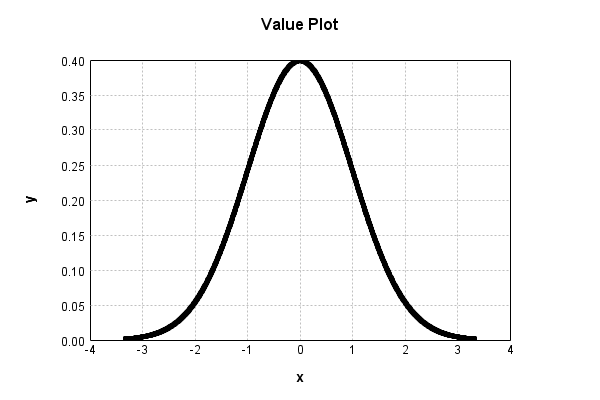
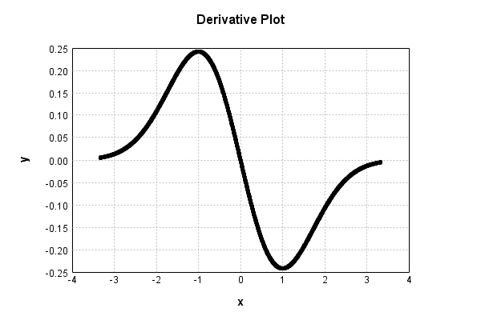

# GaussianActivationLayer
## GaussianActivationLayerTest
### Json Serialization
Code from [StandardLayerTests.java:68](../../../../../../../src/main/java/com/simiacryptus/mindseye/test/StandardLayerTests.java#L68) executed in 0.00 seconds: 
```java
    JsonObject json = layer.getJson();
    NNLayer echo = NNLayer.fromJson(json);
    if ((echo == null)) throw new AssertionError("Failed to deserialize");
    if ((layer == echo)) throw new AssertionError("Serialization did not copy");
    if ((!layer.equals(echo))) throw new AssertionError("Serialization not equal");
    return new GsonBuilder().setPrettyPrinting().create().toJson(json);
```

Returns: 

```
    {
      "class": "com.simiacryptus.mindseye.layers.java.GaussianActivationLayer",
      "id": "48b0a415-c058-4cbd-a941-6b5fe2242d81",
      "isFrozen": true,
      "name": "GaussianActivationLayer/48b0a415-c058-4cbd-a941-6b5fe2242d81",
      "mean": 0.0,
      "stddev": 1.0
    }
```


### Example Input/Output Pair
Code from [StandardLayerTests.java:152](../../../../../../../src/main/java/com/simiacryptus/mindseye/test/StandardLayerTests.java#L152) executed in 0.00 seconds: 
```java
    SimpleEval eval = SimpleEval.run(layer, inputPrototype);
    return String.format("--------------------\nInput: \n[%s]\n--------------------\nOutput: \n%s\n--------------------\nDerivative: \n%s",
      Arrays.stream(inputPrototype).map(t -> t.prettyPrint()).reduce((a, b) -> a + ",\n" + b).get(),
      eval.getOutput().prettyPrint(),
      Arrays.stream(eval.getDerivative()).map(t -> t.prettyPrint()).reduce((a, b) -> a + ",\n" + b).get());
```

Returns: 

```
    --------------------
    Input: 
    [[
    	[ [ -0.268 ], [ 0.636 ], [ -0.112 ] ],
    	[ [ -1.52 ], [ 1.828 ], [ 0.896 ] ]
    ]]
    --------------------
    Output: 
    [
    	[ [ 0.3848696654896559 ], [ 0.32589288240019854 ], [ 0.39644794483193985 ] ],
    	[ [ 0.12566463678908815 ], [ 0.0750402582190496 ], [ 0.26704274675123274 ] ]
    ]
    --------------------
    Derivative: 
    [
    	[ [ 0.10314507035122777 ], [ -0.20726787320652626 ], [ 0.04440216982117726 ] ],
    	[ [ 0.19101024791941398 ], [ -0.13717359202442267 ], [ -0.23927030108910452 ] ]
    ]
```


### Batch Execution
Code from [StandardLayerTests.java:101](../../../../../../../src/main/java/com/simiacryptus/mindseye/test/StandardLayerTests.java#L101) executed in 0.00 seconds: 
```java
    return getBatchingTester().test(layer, inputPrototype);
```

Returns: 

```
    ToleranceStatistics{absoluteTol=0.0000e+00 +- 0.0000e+00 [0.0000e+00 - 0.0000e+00] (120#), relativeTol=0.0000e+00 +- 0.0000e+00 [0.0000e+00 - 0.0000e+00] (120#)}
```


### Differential Validation
Code from [StandardLayerTests.java:109](../../../../../../../src/main/java/com/simiacryptus/mindseye/test/StandardLayerTests.java#L109) executed in 0.00 seconds: 
```java
    return getDerivativeTester().test(layer, inputPrototype);
```
Logging: 
```
    Inputs: [
    	[ [ -1.852 ], [ -1.952 ], [ 1.952 ] ],
    	[ [ 1.136 ], [ 0.596 ], [ -0.544 ] ]
    ]
    Inputs Statistics: {meanExponent=0.069137349970113, negative=3, min=-0.544, max=-0.544, mean=-0.11066666666666669, count=6.0, positive=3, stdDev=1.4673489322205844, zeros=0}
    Output: [
    	[ [ 0.07179858338010711 ], [ 0.05936262061891833 ], [ 0.05936262061891833 ] ],
    	[ [ 0.2092581685277828 ], [ 0.3340226302020763 ], [ 0.3440712457878323 ] ]
    ]
    Outputs Statistics: {meanExponent=-0.8692918838460701, negative=0, min=0.3440712457878323, max=0.3440712457878323, mean=0.17964597818927253, count=6.0, positive=6, stdDev=0.12403758429880828, zeros=0}
    Feedback for input 0
    Inputs Values: [
    	[ [ -1.852 ], [ -1.952 ], [ 1.952 ] ],
    	[ [ 1.136 ], [ 0.596 ], [ -0.544 ] ]
    ]
    Value Statistics: {meanExponent=0.069137349970113, negative=3, min=-0.544, max=-0.544, mean=-0.11066666666666669, count=6.0, positive=3, stdDev=1.4673489322205844, zeros=0}
    Implemented Feedback: [ [ 0.13297097641995836, 0.0, 0.0, 0.0, 0.0, 0.0 ], [ 0.0, -0.237717279
```
...[skipping 676 bytes](etc/110.txt)...
```
    0.0, 0.0, -0.11586749425411547, 0.0 ], [ 0.0, 0.0, 0.0, 0.0, 0.0, 0.18716264445606257 ] ]
    Measured Statistics: {meanExponent=-0.8001514809465613, negative=3, min=0.18716264445606257, max=0.18716264445606257, mean=-0.003240096328533917, count=36.0, positive=3, stdDev=0.06978819775126056, zeros=30}
    Feedback Error: [ [ 8.723278401734369E-6, 0.0, 0.0, 0.0, 0.0, 0.0 ], [ 0.0, 3.0401102890653675E-6, 0.0, 0.0, 0.0, 0.0 ], [ 0.0, 0.0, 8.341507040807161E-6, 0.0, 0.0, 0.0 ], [ 0.0, 0.0, 0.0, -1.0767744987927319E-5, 0.0, 0.0 ], [ 0.0, 0.0, 0.0, 0.0, 8.341194013120057E-6, 0.0 ], [ 0.0, 0.0, 0.0, 0.0, 0.0, -1.2113252518236584E-5 ] ]
    Error Statistics: {meanExponent=-5.103095441945421, negative=2, min=-1.2113252518236584E-5, max=-1.2113252518236584E-5, mean=1.5458589551564033E-7, count=36.0, positive=4, stdDev=3.675402653105829E-6, zeros=30}
    Finite-Difference Derivative Accuracy:
    absoluteTol: 1.4258e-06 +- 3.3911e-06 [0.0000e+00 - 1.2113e-05] (36#)
    relativeTol: 2.8430e-05 +- 1.0299e-05 [6.3944e-06 - 3.5993e-05] (6#)
    
```

Returns: 

```
    ToleranceStatistics{absoluteTol=1.4258e-06 +- 3.3911e-06 [0.0000e+00 - 1.2113e-05] (36#), relativeTol=2.8430e-05 +- 1.0299e-05 [6.3944e-06 - 3.5993e-05] (6#)}
```


### Performance
Code from [StandardLayerTests.java:119](../../../../../../../src/main/java/com/simiacryptus/mindseye/test/StandardLayerTests.java#L119) executed in 0.49 seconds: 
```java
    getPerformanceTester().test(layer, permPrototype);
```
Logging: 
```
    100 batches
    Input Dimensions:
    	[100, 100, 1]
    Performance:
    	Evaluation performance: 0.022668s +- 0.031144s [0.006576s - 0.084952s]
    	Learning performance: 0.065998s +- 0.107324s [0.009532s - 0.280558s]
    
```

### Function Plots
Code from [ActivationLayerTestBase.java:110](../../../../../../../src/test/java/com/simiacryptus/mindseye/layers/java/ActivationLayerTestBase.java#L110) executed in 0.01 seconds: 
```java
    return plot("Value Plot", plotData, x -> new double[]{x[0], x[1]});
```

Returns: 




Code from [ActivationLayerTestBase.java:114](../../../../../../../src/test/java/com/simiacryptus/mindseye/layers/java/ActivationLayerTestBase.java#L114) executed in 0.00 seconds: 
```java
    return plot("Derivative Plot", plotData, x -> new double[]{x[0], x[2]});
```

Returns: 




