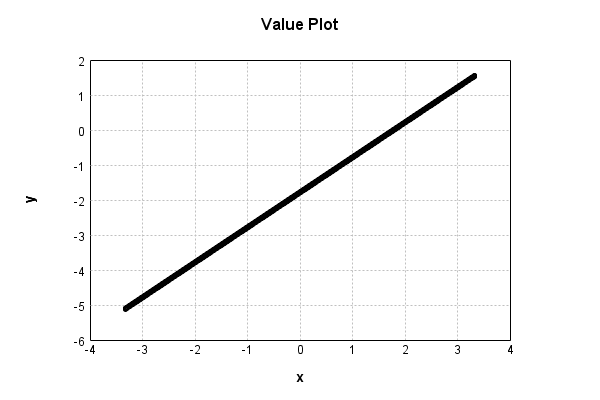

# GaussianNoiseLayer
## GaussianNoiseLayerTest
### Json Serialization
Code from [LayerTestBase.java:84](../../../../../../../../MindsEye/src/test/java/com/simiacryptus/mindseye/layers/LayerTestBase.java#L84) executed in 0.00 seconds: 
```java
    JsonObject json = layer.getJson();
    NNLayer echo = NNLayer.fromJson(json);
    assert (echo != null) : "Failed to deserialize";
    assert (layer != echo) : "Serialization did not copy";
    Assert.assertEquals("Serialization not equal", layer, echo);
    return new GsonBuilder().setPrettyPrinting().create().toJson(json);
```

Returns: 

```
    {
      "class": "com.simiacryptus.mindseye.layers.java.GaussianNoiseLayer",
      "id": "f4569375-56fe-4e46-925c-95f4000009bb",
      "isFrozen": false,
      "name": "GaussianNoiseLayer/f4569375-56fe-4e46-925c-95f4000009bb",
      "value": 1.0
    }
```


### Example Input/Output Pair
Code from [LayerTestBase.java:121](../../../../../../../../MindsEye/src/test/java/com/simiacryptus/mindseye/layers/LayerTestBase.java#L121) executed in 0.00 seconds: 
```java
    SimpleEval eval = SimpleEval.run(layer, inputPrototype);
    return String.format("--------------------\nInput: \n[%s]\n--------------------\nOutput: \n%s",
      Arrays.stream(inputPrototype).map(t->t.prettyPrint()).reduce((a,b)->a+",\n"+b).get(),
      eval.getOutput().prettyPrint());
```

Returns: 

```
    --------------------
    Input: 
    [[ -1.028, -1.78, 1.328 ]]
    --------------------
    Output: 
    [ -0.6468562406070972, -0.629397388726292, 1.9628479423174419 ]
```


### Differential Validation
Code from [LayerTestBase.java:139](../../../../../../../../MindsEye/src/test/java/com/simiacryptus/mindseye/layers/LayerTestBase.java#L139) executed in 0.00 seconds: 
```java
    getDerivativeTester().test(layer, inputPrototype);
```
Logging: 
```
    Feedback for input 0
    Inputs: [ -1.028, -1.78, 1.328 ]
    Output: [ -0.6468562406070972, -0.629397388726292, 1.9628479423174419 ]
    Measured: [ [ 0.9999999999998899, 0.0, 0.0 ], [ 0.0, 0.9999999999998899, 0.0 ], [ 0.0, 0.0, 0.9999999999976694 ] ]
    Implemented: [ [ 1.0, 0.0, 0.0 ], [ 0.0, 1.0, 0.0 ], [ 0.0, 0.0, 1.0 ] ]
    Error: [ [ -1.1013412404281553E-13, 0.0, 0.0 ], [ 0.0, -1.1013412404281553E-13, 0.0 ], [ 0.0, 0.0, -2.3305801732931286E-12 ] ]
    Finite-Difference Derivative Accuracy:
    absoluteTol: 2.8343e-13 +- 7.2517e-13 [0.0000e+00 - 2.3306e-12] (9#)
    relativeTol: 4.2514e-13 +- 5.2336e-13 [5.5067e-14 - 1.1653e-12] (3#)
    
```

### Performance
Code from [LayerTestBase.java:144](../../../../../../../../MindsEye/src/test/java/com/simiacryptus/mindseye/layers/LayerTestBase.java#L144) executed in 0.01 seconds: 
```java
    getPerformanceTester().test(layer, inputPrototype);
```
Logging: 
```
    Evaluation performance: 0.2085 +- 0.0617 [0.1510 - 0.5301]
    Learning performance: 0.0031 +- 0.0021 [0.0000 - 0.0142]
    
```

### Function Plots
Code from [ActivationLayerTestBase.java:73](../../../../../../../../MindsEye/src/test/java/com/simiacryptus/mindseye/layers/java/ActivationLayerTestBase.java#L73) executed in 0.01 seconds: 
```java
    return plot("Value Plot", plotData, x -> new double[]{x[0], x[1]});
```

Returns: 




Code from [ActivationLayerTestBase.java:77](../../../../../../../../MindsEye/src/test/java/com/simiacryptus/mindseye/layers/java/ActivationLayerTestBase.java#L77) executed in 0.01 seconds: 
```java
    return plot("Derivative Plot", plotData, x -> new double[]{x[0], x[2]});
```

Returns: 


