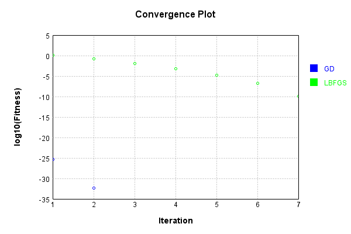
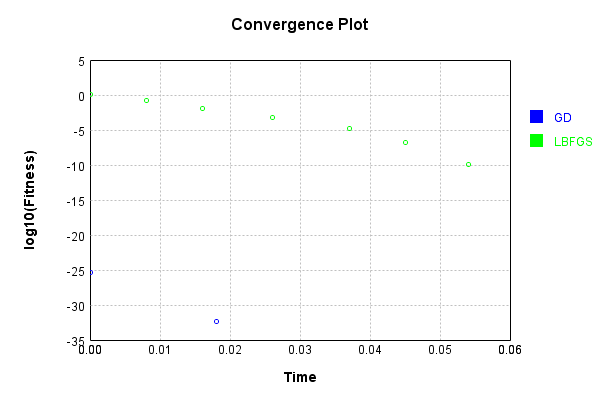

# GaussianNoiseLayer
## GaussianNoiseLayerTest
### Json Serialization
Code from [JsonTest.java:36](../../../../../../../src/main/java/com/simiacryptus/mindseye/test/unit/JsonTest.java#L36) executed in 0.00 seconds: 
```java
    JsonObject json = layer.getJson();
    NNLayer echo = NNLayer.fromJson(json);
    if ((echo == null)) throw new AssertionError("Failed to deserialize");
    if ((layer == echo)) throw new AssertionError("Serialization did not copy");
    if ((!layer.equals(echo))) throw new AssertionError("Serialization not equal");
    return new GsonBuilder().setPrettyPrinting().create().toJson(json);
```

Returns: 

```
    {
      "class": "com.simiacryptus.mindseye.layers.java.GaussianNoiseLayer",
      "id": "324cdd2d-27b2-4c14-9b4e-0d332c38745a",
      "isFrozen": false,
      "name": "GaussianNoiseLayer/324cdd2d-27b2-4c14-9b4e-0d332c38745a",
      "value": 1.0
    }
```


### Example Input/Output Pair
Code from [ReferenceIO.java:68](../../../../../../../src/main/java/com/simiacryptus/mindseye/test/unit/ReferenceIO.java#L68) executed in 0.00 seconds: 
```java
    SimpleEval eval = SimpleEval.run(layer, inputPrototype);
    return String.format("--------------------\nInput: \n[%s]\n--------------------\nOutput: \n%s\n--------------------\nDerivative: \n%s",
      Arrays.stream(inputPrototype).map(t -> t.prettyPrint()).reduce((a, b) -> a + ",\n" + b).get(),
      eval.getOutput().prettyPrint(),
      Arrays.stream(eval.getDerivative()).map(t -> t.prettyPrint()).reduce((a, b) -> a + ",\n" + b).get());
```

Returns: 

```
    --------------------
    Input: 
    [[
    	[ [ -0.632 ], [ -0.776 ], [ -0.168 ] ],
    	[ [ -0.692 ], [ 0.544 ], [ 1.516 ] ]
    ]]
    --------------------
    Output: 
    [
    	[ [ -0.5979303783632144 ], [ 0.13744928582630245 ], [ -0.3704453853043732 ] ],
    	[ [ -1.0692441648767497 ], [ 2.8153764464210025 ], [ 2.3403492391937624 ] ]
    ]
    --------------------
    Derivative: 
    [
    	[ [ 1.0 ], [ 1.0 ], [ 1.0 ] ],
    	[ [ 1.0 ], [ 1.0 ], [ 1.0 ] ]
    ]
```


### Batch Execution
Code from [BatchingTester.java:66](../../../../../../../src/main/java/com/simiacryptus/mindseye/test/unit/BatchingTester.java#L66) executed in 0.00 seconds: 
```java
    return test(reference, inputPrototype);
```

Returns: 

```
    ToleranceStatistics{absoluteTol=0.0000e+00 +- 0.0000e+00 [0.0000e+00 - 0.0000e+00] (120#), relativeTol=0.0000e+00 +- 0.0000e+00 [0.0000e+00 - 0.0000e+00] (120#)}
```


Code from [SingleDerivativeTester.java:77](../../../../../../../src/main/java/com/simiacryptus/mindseye/test/unit/SingleDerivativeTester.java#L77) executed in 0.00 seconds: 
```java
    return test(component, inputPrototype);
```
Logging: 
```
    Inputs: [
    	[ [ -0.872 ], [ 1.404 ], [ 1.352 ] ],
    	[ [ -0.4 ], [ -0.284 ], [ -0.768 ] ]
    ]
    Inputs Statistics: {meanExponent=-0.14006669404358618, negative=4, min=-0.768, max=-0.768, mean=0.072, count=6.0, positive=2, stdDev=0.9450643717052647, zeros=0}
    Output: [
    	[ [ 0.751757454351384 ], [ 1.5693255544696094 ], [ 1.699688667812712 ] ],
    	[ [ 1.368252343340342 ], [ -0.15322186755900924 ], [ -2.3084696940532856 ] ]
    ]
    Outputs Statistics: {meanExponent=-0.0021714502725307303, negative=2, min=-2.3084696940532856, max=-2.3084696940532856, mean=0.4878887430602921, count=6.0, positive=4, stdDev=1.3972159654149474, zeros=0}
    Feedback for input 0
    Inputs Values: [
    	[ [ -0.872 ], [ 1.404 ], [ 1.352 ] ],
    	[ [ -0.4 ], [ -0.284 ], [ -0.768 ] ]
    ]
    Value Statistics: {meanExponent=-0.14006669404358618, negative=4, min=-0.768, max=-0.768, mean=0.072, count=6.0, positive=2, stdDev=0.9450643717052647, zeros=0}
    Implemented Feedback: [ [ 1.0, 0.0, 0.0, 0.0, 0.0, 0.0 ], [ 0.0, 1.0, 0.0, 0.0, 0.0, 0.0 ], [ 0.0, 0.0, 1.0, 0.0, 0.0, 
```
...[skipping 515 bytes](etc/280.txt)...
```
    999999999998899, 0.0 ], [ 0.0, 0.0, 0.0, 0.0, 0.0, 0.9999999999976694 ] ]
    Measured Statistics: {meanExponent=-4.7830642341402504E-14, negative=0, min=0.9999999999976694, max=0.9999999999976694, mean=0.1666666666666483, count=36.0, positive=6, stdDev=0.3726779962499239, zeros=30}
    Feedback Error: [ [ -1.1013412404281553E-13, 0.0, 0.0, 0.0, 0.0, 0.0 ], [ 0.0, 2.1103119252074976E-12, 0.0, 0.0, 0.0, 0.0 ], [ 0.0, 0.0, -1.1013412404281553E-13, 0.0, 0.0, 0.0 ], [ 0.0, 0.0, 0.0, -1.1013412404281553E-13, 0.0, 0.0 ], [ 0.0, 0.0, 0.0, 0.0, -1.1013412404281553E-13, 0.0 ], [ 0.0, 0.0, 0.0, 0.0, 0.0, -2.3305801732931286E-12 ] ]
    Error Statistics: {meanExponent=-12.523416948588775, negative=5, min=-2.3305801732931286E-12, max=-2.3305801732931286E-12, mean=-1.8355687340469256E-14, count=36.0, positive=1, stdDev=5.249711352291466E-13, zeros=30}
    Finite-Difference Derivative Accuracy:
    absoluteTol: 1.3560e-13 +- 5.0749e-13 [0.0000e+00 - 2.3306e-12] (36#)
    relativeTol: 4.0679e-13 +- 4.9842e-13 [5.5067e-14 - 1.1653e-12] (6#)
    
```

Returns: 

```
    ToleranceStatistics{absoluteTol=1.3560e-13 +- 5.0749e-13 [0.0000e+00 - 2.3306e-12] (36#), relativeTol=4.0679e-13 +- 4.9842e-13 [5.5067e-14 - 1.1653e-12] (6#)}
```


### Performance
Now we execute larger-scale runs to benchmark performance:

Code from [PerformanceTester.java:66](../../../../../../../src/main/java/com/simiacryptus/mindseye/test/unit/PerformanceTester.java#L66) executed in 0.69 seconds: 
```java
    test(component, inputPrototype);
```
Logging: 
```
    100 batches
    Input Dimensions:
    	[100, 100, 1]
    Performance:
    	Evaluation performance: 0.065522s +- 0.013198s [0.058524s - 0.091897s]
    	Learning performance: 0.011935s +- 0.000153s [0.011792s - 0.012151s]
    
```

### Input Learning
In this test, we use a network to learn this target input, given it's pre-evaluated output:

Code from [LearningTester.java:127](../../../../../../../src/main/java/com/simiacryptus/mindseye/test/unit/LearningTester.java#L127) executed in 0.00 seconds: 
```java
    return Arrays.stream(input_target).map(x -> x.prettyPrint()).reduce((a, b) -> a + "\n" + b).orElse("");
```

Returns: 

```
    [
    	[ [ -1.7 ], [ 0.964 ], [ 0.88 ], [ -1.932 ], [ 0.44 ], [ 0.684 ], [ 0.748 ], [ 1.756 ], ... ],
    	[ [ 0.208 ], [ -1.448 ], [ 1.628 ], [ -1.368 ], [ 0.064 ], [ -0.344 ], [ 1.74 ], [ 1.456 ], ... ],
    	[ [ -1.968 ], [ 1.356 ], [ -1.528 ], [ 0.692 ], [ -1.148 ], [ -0.408 ], [ 1.48 ], [ 1.812 ], ... ],
    	[ [ -1.456 ], [ 1.8 ], [ -1.496 ], [ -0.592 ], [ -1.276 ], [ 1.804 ], [ -0.312 ], [ -0.504 ], ... ],
    	[ [ -0.74 ], [ 0.092 ], [ -1.572 ], [ -1.196 ], [ 1.176 ], [ -1.452 ], [ -0.356 ], [ 0.136 ], ... ],
    	[ [ -1.304 ], [ -1.756 ], [ 0.728 ], [ 1.452 ], [ 1.416 ], [ 1.324 ], [ -0.964 ], [ -1.764 ], ... ],
    	[ [ -0.12 ], [ -0.584 ], [ 1.124 ], [ -0.48 ], [ -1.792 ], [ 0.236 ], [ 1.752 ], [ 1.36 ], ... ],
    	[ [ 1.844 ], [ 0.116 ], [ 0.92 ], [ -1.124 ], [ 0.856 ], [ -0.168 ], [ -0.7 ], [ -1.46 ], ... ],
    	...
    ]
```


First, we use a conjugate gradient descent method, which converges the fastest for purely linear functions.

Code from [LearningTester.java:300](../../../../../../../src/main/java/com/simiacryptus/mindseye/test/unit/LearningTester.java#L300) executed in 0.06 seconds: 
```java
    return new IterativeTrainer(trainable)
      .setLineSearchFactory(label -> new QuadraticSearch())
      .setOrientation(new GradientDescent())
      .setMonitor(monitor)
      .setTimeout(30, TimeUnit.SECONDS)
      .setMaxIterations(250)
      .setTerminateThreshold(0)
      .run();
```
Logging: 
```
    Constructing line search parameters: GD
    F(0.0) = LineSearchPoint{point=PointSample{avg=2.668826425599997}, derivative=-0.00106753057024}
    New Minimum: 2.668826425599997 > 2.6688264255998893
    F(1.0E-10) = LineSearchPoint{point=PointSample{avg=2.6688264255998893}, derivative=-0.0010675305702399788}, delta = -1.0791367799356522E-13
    New Minimum: 2.6688264255998893 > 2.6688264255992324
    F(7.000000000000001E-10) = LineSearchPoint{point=PointSample{avg=2.6688264255992324}, derivative=-0.0010675305702398507}, delta = -7.647216193618078E-13
    New Minimum: 2.6688264255992324 > 2.6688264255947702
    F(4.900000000000001E-9) = LineSearchPoint{point=PointSample{avg=2.6688264255947702}, derivative=-0.0010675305702389538}, delta = -5.226929999935237E-12
    New Minimum: 2.6688264255947702 > 2.6688264255633802
    F(3.430000000000001E-8) = LineSearchPoint{point=PointSample{avg=2.6688264255633802}, derivative=-0.0010675305702326767}, delta = -3.661693170897706E-11
    New Minimum: 2.6688264255633802 > 2.6688264253436933
    F(2.40100000000
```
...[skipping 3618 bytes](etc/281.txt)...
```
    146040906E-28 <= 4.6065708042045184E-26
    F(5000.000176635676) = LineSearchPoint{point=PointSample{avg=5.0047985906824465E-33}, derivative=-6.88756305241212E-35}, delta = -4.606570303724659E-26
    Left bracket at 5000.000176635676
    Converged to left
    Iteration 2 complete. Error: 5.0047985906824465E-33 Total: 249781346159974.6600; Orientation: 0.0003; Line Search: 0.0162
    Zero gradient: 1.4148920228317702E-18
    F(0.0) = LineSearchPoint{point=PointSample{avg=5.0047985906824465E-33}, derivative=-2.0019194362729787E-36}
    F(5000.000176635676) = LineSearchPoint{point=PointSample{avg=5.0047985906824465E-33}, derivative=2.0019194362729787E-36}, delta = 0.0
    5.0047985906824465E-33 <= 5.0047985906824465E-33
    New Minimum: 5.0047985906824465E-33 > 0.0
    F(2500.000088317838) = LineSearchPoint{point=PointSample{avg=0.0}, derivative=0.0}, delta = -5.0047985906824465E-33
    Right bracket at 2500.000088317838
    Converged to right
    Iteration 3 complete. Error: 0.0 Total: 249781353010285.6600; Orientation: 0.0003; Line Search: 0.0055
    
```

Returns: 

```
    0.0
```


Training Converged

Next, we run the same optimization using L-BFGS, which is nearly ideal for purely second-order or quadratic functions.

Code from [LearningTester.java:324](../../../../../../../src/main/java/com/simiacryptus/mindseye/test/unit/LearningTester.java#L324) executed in 0.10 seconds: 
```java
    return new IterativeTrainer(trainable)
      .setLineSearchFactory(label -> new ArmijoWolfeSearch())
      .setOrientation(new LBFGS())
      .setMonitor(monitor)
      .setTimeout(30, TimeUnit.SECONDS)
      .setMaxIterations(250)
      .setTerminateThreshold(0)
      .run();
```
Logging: 
```
    LBFGS Accumulation History: 1 points
    Constructing line search parameters: GD
    th(0)=2.668826425599997;dx=-0.00106753057024
    New Minimum: 2.668826425599997 > 2.666526996210602
    WOLFE (weak): th(2.154434690031884)=2.666526996210602; dx=-0.0010670705852613611 delta=0.00229942938939498
    New Minimum: 2.666526996210602 > 2.664228557828798
    WOLFE (weak): th(4.308869380063768)=2.664228557828798; dx=-0.0010666106002827224 delta=0.004597867771199304
    New Minimum: 2.664228557828798 > 2.655044714377528
    WOLFE (weak): th(12.926608140191302)=2.655044714377528; dx=-0.0010647706603681667 delta=0.013781711222469184
    New Minimum: 2.655044714377528 > 2.6139136383506636
    WOLFE (weak): th(51.70643256076521)=2.6139136383506636; dx=-0.0010564909307526661 delta=0.05491278724933357
    New Minimum: 2.6139136383506636 > 2.399970693099736
    WOLFE (weak): th(258.53216280382605)=2.399970693099736; dx=-0.0010123323728033302 delta=0.2688557325002612
    New Minimum: 2.399970693099736 > 1.269749671091057
    END: th(1551.1929768229563)=1.26974967109
```
...[skipping 2535 bytes](etc/282.txt)...
```
    96784641856926E-10 delta=1.4770419885959087E-5
    Iteration 6 complete. Error: 1.4919616046423044E-7 Total: 249781441956885.5600; Orientation: 0.0006; Line Search: 0.0069
    LBFGS Accumulation History: 1 points
    th(0)=1.4919616046423044E-7;dx=-5.967846418569217E-11
    New Minimum: 1.4919616046423044E-7 > 1.3154692802879373E-7
    WOLF (strong): th(9694.956105143481)=1.3154692802879373E-7; dx=5.603755395484061E-11 delta=1.764923243543671E-8
    New Minimum: 1.3154692802879373E-7 > 1.3882967970521418E-10
    END: th(4847.478052571741)=1.3882967970521418E-10; dx=-1.8204551154256753E-12 delta=1.4905733078452524E-7
    Iteration 7 complete. Error: 1.3882967970521418E-10 Total: 249781450097008.5600; Orientation: 0.0005; Line Search: 0.0064
    LBFGS Accumulation History: 1 points
    th(0)=1.3882967970521418E-10;dx=-5.553187188208589E-14
    MAX ALPHA: th(0)=1.3882967970521418E-10;th'(0)=-5.553187188208589E-14;
    Iteration 8 failed, aborting. Error: 1.3882967970521418E-10 Total: 249781456819078.5600; Orientation: 0.0009; Line Search: 0.0046
    
```

Returns: 

```
    1.3882967970521418E-10
```


Training Converged

Code from [LearningTester.java:96](../../../../../../../src/main/java/com/simiacryptus/mindseye/test/unit/LearningTester.java#L96) executed in 0.00 seconds: 
```java
    return TestUtil.compare(runs);
```

Returns: 




Code from [LearningTester.java:99](../../../../../../../src/main/java/com/simiacryptus/mindseye/test/unit/LearningTester.java#L99) executed in 0.00 seconds: 
```java
    return TestUtil.compareTime(runs);
```

Returns: 




### Function Plots
Code from [ActivationLayerTestBase.java:110](../../../../../../../src/test/java/com/simiacryptus/mindseye/layers/java/ActivationLayerTestBase.java#L110) executed in 0.00 seconds: 
```java
    return plot("Value Plot", plotData, x -> new double[]{x[0], x[1]});
```

Returns: 


Code from [ActivationLayerTestBase.java:114](../../../../../../../src/test/java/com/simiacryptus/mindseye/layers/java/ActivationLayerTestBase.java#L114) executed in 0.00 seconds: 
```java
    return plot("Derivative Plot", plotData, x -> new double[]{x[0], x[2]});
```

Returns: 


