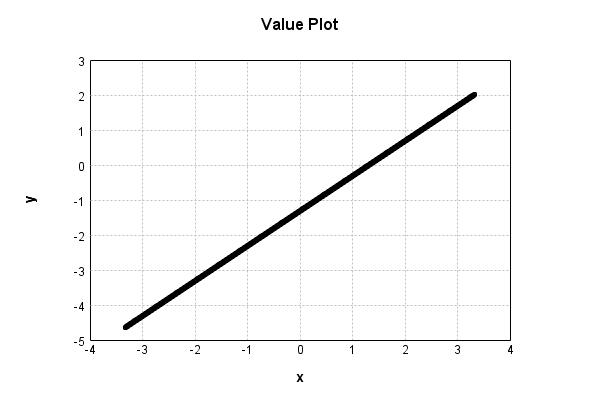

# GaussianNoiseLayer
## GaussianNoiseLayerTest
### Json Serialization
Code from [StandardLayerTests.java:68](../../../../../../../src/main/java/com/simiacryptus/mindseye/test/StandardLayerTests.java#L68) executed in 0.00 seconds: 
```java
    JsonObject json = layer.getJson();
    NNLayer echo = NNLayer.fromJson(json);
    if ((echo == null)) throw new AssertionError("Failed to deserialize");
    if ((layer == echo)) throw new AssertionError("Serialization did not copy");
    if ((!layer.equals(echo))) throw new AssertionError("Serialization not equal");
    return new GsonBuilder().setPrettyPrinting().create().toJson(json);
```

Returns: 

```
    {
      "class": "com.simiacryptus.mindseye.layers.java.GaussianNoiseLayer",
      "id": "1f8512e2-86fa-4343-b83e-7c8ae929d86f",
      "isFrozen": false,
      "name": "GaussianNoiseLayer/1f8512e2-86fa-4343-b83e-7c8ae929d86f",
      "value": 1.0
    }
```


### Example Input/Output Pair
Code from [StandardLayerTests.java:152](../../../../../../../src/main/java/com/simiacryptus/mindseye/test/StandardLayerTests.java#L152) executed in 0.00 seconds: 
```java
    SimpleEval eval = SimpleEval.run(layer, inputPrototype);
    return String.format("--------------------\nInput: \n[%s]\n--------------------\nOutput: \n%s\n--------------------\nDerivative: \n%s",
      Arrays.stream(inputPrototype).map(t -> t.prettyPrint()).reduce((a, b) -> a + ",\n" + b).get(),
      eval.getOutput().prettyPrint(),
      Arrays.stream(eval.getDerivative()).map(t -> t.prettyPrint()).reduce((a, b) -> a + ",\n" + b).get());
```

Returns: 

```
    --------------------
    Input: 
    [[
    	[ [ 0.092 ], [ 0.268 ], [ -1.832 ] ],
    	[ [ 1.98 ], [ 1.52 ], [ -0.736 ] ]
    ]]
    --------------------
    Output: 
    [
    	[ [ -1.2214752762922263 ], [ 1.3042353124238228 ], [ -0.6164244610370584 ] ],
    	[ [ 2.897342109093536 ], [ -0.06539538373007381 ], [ -0.44289434893982443 ] ]
    ]
    --------------------
    Derivative: 
    [
    	[ [ 1.0 ], [ 1.0 ], [ 1.0 ] ],
    	[ [ 1.0 ], [ 1.0 ], [ 1.0 ] ]
    ]
```


### Batch Execution
Code from [StandardLayerTests.java:101](../../../../../../../src/main/java/com/simiacryptus/mindseye/test/StandardLayerTests.java#L101) executed in 0.00 seconds: 
```java
    return getBatchingTester().test(layer, inputPrototype);
```

Returns: 

```
    ToleranceStatistics{absoluteTol=0.0000e+00 +- 0.0000e+00 [0.0000e+00 - 0.0000e+00] (120#), relativeTol=0.0000e+00 +- 0.0000e+00 [0.0000e+00 - 0.0000e+00] (120#)}
```


### Differential Validation
Code from [StandardLayerTests.java:109](../../../../../../../src/main/java/com/simiacryptus/mindseye/test/StandardLayerTests.java#L109) executed in 0.00 seconds: 
```java
    return getDerivativeTester().test(layer, inputPrototype);
```
Logging: 
```
    Inputs: [
    	[ [ -1.148 ], [ -0.728 ], [ 0.536 ] ],
    	[ [ 0.872 ], [ 1.524 ], [ 0.252 ] ]
    ]
    Inputs Statistics: {meanExponent=-0.1373099917024242, negative=2, min=0.252, max=0.252, mean=0.218, count=6.0, positive=4, stdDev=0.9125517336933104, zeros=0}
    Output: [
    	[ [ -2.4614752762922265 ], [ 0.30823531242382285 ], [ 1.7515755389629417 ] ],
    	[ [ 1.789342109093536 ], [ -0.061395383730073805 ], [ 0.5451056510601755 ] ]
    ]
    Outputs Statistics: {meanExponent=-0.18319724569795617, negative=2, min=0.5451056510601755, max=0.5451056510601755, mean=0.31189799191969597, count=6.0, positive=4, stdDev=1.422489543925918, zeros=0}
    Feedback for input 0
    Inputs Values: [
    	[ [ -1.148 ], [ -0.728 ], [ 0.536 ] ],
    	[ [ 0.872 ], [ 1.524 ], [ 0.252 ] ]
    ]
    Value Statistics: {meanExponent=-0.1373099917024242, negative=2, min=0.252, max=0.252, mean=0.218, count=6.0, positive=4, stdDev=0.9125517336933104, zeros=0}
    Implemented Feedback: [ [ 1.0, 0.0, 0.0, 0.0, 0.0, 0.0 ], [ 0.0, 1.0, 0.0, 0.0, 0.0, 0.0 ], [ 0.0, 0.0, 1.0, 0.0, 0.0, 0.0 ],
```
...[skipping 508 bytes](etc/111.txt)...
```
    9999999999998899, 0.0 ], [ 0.0, 0.0, 0.0, 0.0, 0.0, 0.9999999999998899 ] ]
    Measured Statistics: {meanExponent=-4.783064234140254E-14, negative=0, min=0.9999999999998899, max=0.9999999999998899, mean=0.1666666666666483, count=36.0, positive=6, stdDev=0.3726779962499239, zeros=30}
    Feedback Error: [ [ 2.1103119252074976E-12, 0.0, 0.0, 0.0, 0.0, 0.0 ], [ 0.0, -2.3305801732931286E-12, 0.0, 0.0, 0.0, 0.0 ], [ 0.0, 0.0, -1.1013412404281553E-13, 0.0, 0.0, 0.0 ], [ 0.0, 0.0, 0.0, -1.1013412404281553E-13, 0.0, 0.0 ], [ 0.0, 0.0, 0.0, 0.0, -1.1013412404281553E-13, 0.0 ], [ 0.0, 0.0, 0.0, 0.0, 0.0, -1.1013412404281553E-13 ] ]
    Error Statistics: {meanExponent=-12.523416948588773, negative=5, min=-1.1013412404281553E-13, max=-1.1013412404281553E-13, mean=-1.8355687340469256E-14, count=36.0, positive=1, stdDev=5.249711352291466E-13, zeros=30}
    Finite-Difference Derivative Accuracy:
    absoluteTol: 1.3560e-13 +- 5.0749e-13 [0.0000e+00 - 2.3306e-12] (36#)
    relativeTol: 4.0679e-13 +- 4.9842e-13 [5.5067e-14 - 1.1653e-12] (6#)
    
```

Returns: 

```
    ToleranceStatistics{absoluteTol=1.3560e-13 +- 5.0749e-13 [0.0000e+00 - 2.3306e-12] (36#), relativeTol=4.0679e-13 +- 4.9842e-13 [5.5067e-14 - 1.1653e-12] (6#)}
```


### Performance
Code from [StandardLayerTests.java:119](../../../../../../../src/main/java/com/simiacryptus/mindseye/test/StandardLayerTests.java#L119) executed in 0.75 seconds: 
```java
    getPerformanceTester().test(layer, permPrototype);
```
Logging: 
```
    100 batches
    Input Dimensions:
    	[100, 100, 1]
    Performance:
    	Evaluation performance: 0.071151s +- 0.006134s [0.060804s - 0.079317s]
    	Learning performance: 0.014641s +- 0.003970s [0.009672s - 0.018930s]
    
```

### Function Plots
Code from [ActivationLayerTestBase.java:110](../../../../../../../src/test/java/com/simiacryptus/mindseye/layers/java/ActivationLayerTestBase.java#L110) executed in 0.00 seconds: 
```java
    return plot("Value Plot", plotData, x -> new double[]{x[0], x[1]});
```

Returns: 




Code from [ActivationLayerTestBase.java:114](../../../../../../../src/test/java/com/simiacryptus/mindseye/layers/java/ActivationLayerTestBase.java#L114) executed in 0.00 seconds: 
```java
    return plot("Derivative Plot", plotData, x -> new double[]{x[0], x[2]});
```

Returns: 


