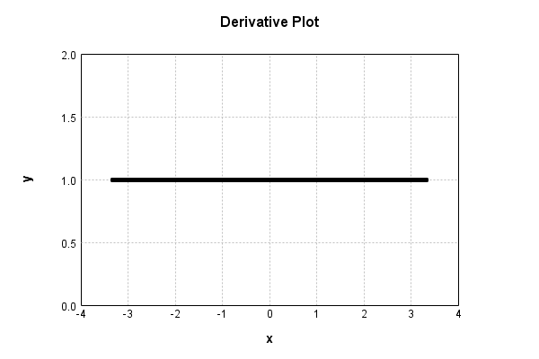

# GaussianNoiseLayer
## GaussianNoiseLayerTest
### Json Serialization
Code from [StandardLayerTests.java:69](../../../../../../../src/main/java/com/simiacryptus/mindseye/test/StandardLayerTests.java#L69) executed in 0.00 seconds: 
```java
    JsonObject json = layer.getJson();
    NNLayer echo = NNLayer.fromJson(json);
    if ((echo == null)) throw new AssertionError("Failed to deserialize");
    if ((layer == echo)) throw new AssertionError("Serialization did not copy");
    if ((!layer.equals(echo))) throw new AssertionError("Serialization not equal");
    return new GsonBuilder().setPrettyPrinting().create().toJson(json);
```

Returns: 

```
    {
      "class": "com.simiacryptus.mindseye.layers.java.GaussianNoiseLayer",
      "id": "b96ee2be-2c22-4afc-9cee-d448447b0eea",
      "isFrozen": false,
      "name": "GaussianNoiseLayer/b96ee2be-2c22-4afc-9cee-d448447b0eea",
      "value": 1.0
    }
```


### Example Input/Output Pair
Code from [StandardLayerTests.java:153](../../../../../../../src/main/java/com/simiacryptus/mindseye/test/StandardLayerTests.java#L153) executed in 0.00 seconds: 
```java
    SimpleEval eval = SimpleEval.run(layer, inputPrototype);
    return String.format("--------------------\nInput: \n[%s]\n--------------------\nOutput: \n%s\n--------------------\nDerivative: \n%s",
      Arrays.stream(inputPrototype).map(t -> t.prettyPrint()).reduce((a, b) -> a + ",\n" + b).get(),
      eval.getOutput().prettyPrint(),
      Arrays.stream(eval.getDerivative()).map(t -> t.prettyPrint()).reduce((a, b) -> a + ",\n" + b).get());
```

Returns: 

```
    --------------------
    Input: 
    [[
    	[ [ 0.932 ], [ 1.316 ], [ -1.936 ] ],
    	[ [ 1.8 ], [ 1.22 ], [ 0.464 ] ]
    ]]
    --------------------
    Output: 
    [
    	[ [ 2.4165397831159128 ], [ 1.34460360978511 ], [ -1.312811664428378 ] ],
    	[ [ 2.357217811802176 ], [ 1.685688777034299 ], [ -0.8308015344757529 ] ]
    ]
    --------------------
    Derivative: 
    [
    	[ [ 1.0 ], [ 1.0 ], [ 1.0 ] ],
    	[ [ 1.0 ], [ 1.0 ], [ 1.0 ] ]
    ]
```


### Batch Execution
Code from [StandardLayerTests.java:102](../../../../../../../src/main/java/com/simiacryptus/mindseye/test/StandardLayerTests.java#L102) executed in 0.00 seconds: 
```java
    return getBatchingTester().test(layer, inputPrototype);
```

Returns: 

```
    ToleranceStatistics{absoluteTol=0.0000e+00 +- 0.0000e+00 [0.0000e+00 - 0.0000e+00] (120#), relativeTol=0.0000e+00 +- 0.0000e+00 [0.0000e+00 - 0.0000e+00] (120#)}
```


### Differential Validation
Code from [StandardLayerTests.java:110](../../../../../../../src/main/java/com/simiacryptus/mindseye/test/StandardLayerTests.java#L110) executed in 0.00 seconds: 
```java
    return getDerivativeTester().test(layer, inputPrototype);
```
Logging: 
```
    Inputs: [
    	[ [ -0.048 ], [ 1.528 ], [ 1.864 ] ],
    	[ [ -1.18 ], [ 0.908 ], [ -1.472 ] ]
    ]
    Inputs Statistics: {meanExponent=-0.11105230575634811, negative=3, min=-1.472, max=-1.472, mean=0.26666666666666666, count=6.0, positive=3, stdDev=1.2759679550138485, zeros=0}
    Output: [
    	[ [ 1.4365397831159126 ], [ 1.55660360978511 ], [ 2.4871883355716218 ] ],
    	[ [ -0.622782188197824 ], [ 1.3736887770342991 ], [ -2.7668015344757526 ] ]
    ]
    Outputs Statistics: {meanExponent=0.18656781738472203, negative=2, min=-2.7668015344757526, max=-2.7668015344757526, mean=0.5774061304722277, count=6.0, positive=4, stdDev=1.760797611278132, zeros=0}
    Feedback for input 0
    Inputs Values: [
    	[ [ -0.048 ], [ 1.528 ], [ 1.864 ] ],
    	[ [ -1.18 ], [ 0.908 ], [ -1.472 ] ]
    ]
    Value Statistics: {meanExponent=-0.11105230575634811, negative=3, min=-1.472, max=-1.472, mean=0.26666666666666666, count=6.0, positive=3, stdDev=1.2759679550138485, zeros=0}
    Implemented Feedback: [ [ 1.0, 0.0, 0.0, 0.0, 0.0, 0.0 ], [ 0.0, 1.0, 0.0, 0.0, 0.0, 0.0 ], [ 0.
```
...[skipping 535 bytes](etc/69.txt)...
```
    1.0000000000021103, 0.0 ], [ 0.0, 0.0, 0.0, 0.0, 0.0, 0.9999999999976694 ] ]
    Measured Statistics: {meanExponent=-2.085518867671465E-13, negative=0, min=0.9999999999976694, max=0.9999999999976694, mean=0.16666666666658664, count=36.0, positive=6, stdDev=0.372677996249786, zeros=30}
    Feedback Error: [ [ -1.1013412404281553E-13, 0.0, 0.0, 0.0, 0.0, 0.0 ], [ 0.0, -1.1013412404281553E-13, 0.0, 0.0, 0.0, 0.0 ], [ 0.0, 0.0, -1.1013412404281553E-13, 0.0, 0.0, 0.0 ], [ 0.0, 0.0, 0.0, -2.3305801732931286E-12, 0.0, 0.0 ], [ 0.0, 0.0, 0.0, 0.0, 2.1103119252074976E-12, 0.0 ], [ 0.0, 0.0, 0.0, 0.0, 0.0, -2.3305801732931286E-12 ] ]
    Error Statistics: {meanExponent=-12.30249325766521, negative=5, min=-2.3305801732931286E-12, max=-2.3305801732931286E-12, mean=-8.003474426408907E-14, count=36.0, positive=1, stdDev=6.481257747318635E-13, zeros=30}
    Finite-Difference Derivative Accuracy:
    absoluteTol: 1.9727e-13 +- 6.2254e-13 [0.0000e+00 - 2.3306e-12] (36#)
    relativeTol: 5.9182e-13 +- 5.3801e-13 [5.5067e-14 - 1.1653e-12] (6#)
    
```

Returns: 

```
    ToleranceStatistics{absoluteTol=1.9727e-13 +- 6.2254e-13 [0.0000e+00 - 2.3306e-12] (36#), relativeTol=5.9182e-13 +- 5.3801e-13 [5.5067e-14 - 1.1653e-12] (6#)}
```


### Performance
Code from [StandardLayerTests.java:120](../../../../../../../src/main/java/com/simiacryptus/mindseye/test/StandardLayerTests.java#L120) executed in 0.00 seconds: 
```java
    getPerformanceTester().test(layer, permPrototype);
```
Logging: 
```
    Evaluation performance: 0.000506s +- 0.000694s [0.000127s - 0.001894s]
    Learning performance: 0.000030s +- 0.000004s [0.000026s - 0.000037s]
    
```

### Function Plots
Code from [ActivationLayerTestBase.java:103](../../../../../../../src/test/java/com/simiacryptus/mindseye/layers/java/ActivationLayerTestBase.java#L103) executed in 0.00 seconds: 
```java
    return plot("Value Plot", plotData, x -> new double[]{x[0], x[1]});
```

Returns: 


Code from [ActivationLayerTestBase.java:107](../../../../../../../src/test/java/com/simiacryptus/mindseye/layers/java/ActivationLayerTestBase.java#L107) executed in 0.00 seconds: 
```java
    return plot("Derivative Plot", plotData, x -> new double[]{x[0], x[2]});
```

Returns: 




