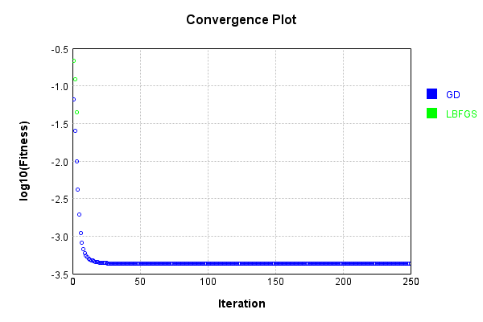
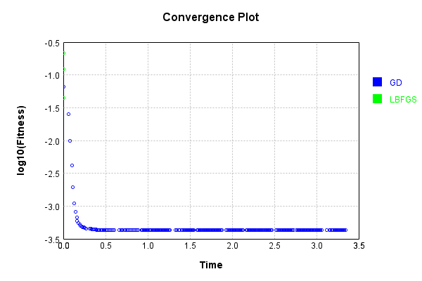

# HyperbolicActivationLayer
## HyperbolicActivationLayerTest
### Json Serialization
Code from [JsonTest.java:36](../../../../../../../src/main/java/com/simiacryptus/mindseye/test/unit/JsonTest.java#L36) executed in 0.00 seconds: 
```java
    JsonObject json = layer.getJson();
    NNLayer echo = NNLayer.fromJson(json);
    if ((echo == null)) throw new AssertionError("Failed to deserialize");
    if ((layer == echo)) throw new AssertionError("Serialization did not copy");
    if ((!layer.equals(echo))) throw new AssertionError("Serialization not equal");
    return new GsonBuilder().setPrettyPrinting().create().toJson(json);
```

Returns: 

```
    {
      "class": "com.simiacryptus.mindseye.layers.java.HyperbolicActivationLayer",
      "id": "b3964eec-65ae-4e48-b0fe-25a20516981c",
      "isFrozen": false,
      "name": "HyperbolicActivationLayer/b3964eec-65ae-4e48-b0fe-25a20516981c",
      "weights": [
        1.0,
        1.0
      ],
      "negativeMode": 1
    }
```


### Reference Input/Output Pairs
Code from [ReferenceIO.java:56](../../../../../../../src/main/java/com/simiacryptus/mindseye/test/unit/ReferenceIO.java#L56) executed in 0.00 seconds: 
```java
    SimpleEval eval = SimpleEval.run(layer, input);
    DoubleStatistics error = new DoubleStatistics().accept(eval.getOutput().add(output.scale(-1)).getData());
    return String.format("--------------------\nInput: \n[%s]\n--------------------\nOutput: \n%s\nError: %s\n--------------------\nDerivative: \n%s",
      Arrays.stream(input).map(t -> t.prettyPrint()).reduce((a, b) -> a + ",\n" + b).get(),
      eval.getOutput().prettyPrint(), error,
      Arrays.stream(eval.getDerivative()).map(t -> t.prettyPrint()).reduce((a, b) -> a + ",\n" + b).get());
```

Returns: 

```
    --------------------
    Input: 
    [[ 0.0 ]]
    --------------------
    Output: 
    [ 0.0 ]
    Error: 0.0000e+00 +- 0.0000e+00 [0.0000e+00 - 0.0000e+00] (1#)
    --------------------
    Derivative: 
    [ 0.0 ]
```


### Batch Execution
Code from [BatchingTester.java:66](../../../../../../../src/main/java/com/simiacryptus/mindseye/test/unit/BatchingTester.java#L66) executed in 0.00 seconds: 
```java
    return test(reference, inputPrototype);
```

Returns: 

```
    ToleranceStatistics{absoluteTol=0.0000e+00 +- 0.0000e+00 [0.0000e+00 - 0.0000e+00] (120#), relativeTol=0.0000e+00 +- 0.0000e+00 [0.0000e+00 - 0.0000e+00] (120#)}
```


Code from [SingleDerivativeTester.java:77](../../../../../../../src/main/java/com/simiacryptus/mindseye/test/unit/SingleDerivativeTester.java#L77) executed in 0.00 seconds: 
```java
    return test(component, inputPrototype);
```
Logging: 
```
    Inputs: [
    	[ [ 0.96 ], [ 0.004 ], [ 0.412 ] ],
    	[ [ 0.472 ], [ 1.824 ], [ 1.408 ] ]
    ]
    Inputs Statistics: {meanExponent=-0.45286701202779267, negative=0, min=1.408, max=1.408, mean=0.8466666666666667, count=6.0, positive=6, stdDev=0.6221625368199392, zeros=0}
    Output: [
    	[ [ 0.38621787609307656 ], [ 7.999968000271807E-6 ], [ 0.08154704012354452 ] ],
    	[ [ 0.10579564115617668 ], [ 1.0801384569302113 ], [ 0.7269811811366098 ] ]
    ]
    Outputs Statistics: {meanExponent=-1.2798668007061527, negative=0, min=0.7269811811366098, max=0.7269811811366098, mean=0.39678136590126983, count=6.0, positive=6, stdDev=0.3910658289056328, zeros=0}
    Feedback for input 0
    Inputs Values: [
    	[ [ 0.96 ], [ 0.004 ], [ 0.412 ] ],
    	[ [ 0.472 ], [ 1.824 ], [ 1.408 ] ]
    ]
    Value Statistics: {meanExponent=-0.45286701202779267, negative=0, min=1.408, max=1.408, mean=0.8466666666666667, count=6.0, positive=6, stdDev=0.6221625368199392, zeros=0}
    Implemented Feedback: [ [ 0.6925318281897135, 0.0, 0.0, 0.0, 0.0, 0.0 ], [ 0.0, 0.42684197914408056, 0
```
...[skipping 1792 bytes](etc/283.txt)...
```
    egative=6, min=0.0, max=0.0, mean=-0.3841741140958081, count=12.0, positive=0, stdDev=0.4070628553320916, zeros=6}
    Measured Gradient: [ [ -0.7212978931925296, -0.9042275662485277, -0.9998920100949821, -0.4806706827054086, -0.9245023268800168, -0.5789679650902713 ], [ 0.0, 0.0, 0.0, 0.0, 0.0, 0.0 ] ]
    Measured Statistics: {meanExponent=-0.12920738637560383, negative=6, min=0.0, max=0.0, mean=-0.38412987035097795, count=12.0, positive=0, stdDev=0.40701820688279317, zeros=6}
    Gradient Error: [ [ 8.942783842191826E-5, 9.866075164299826E-5, 9.999000101668098E-5, 6.654739020811595E-5, 9.915867882726026E-5, 7.714027784377908E-5 ], [ 0.0, 0.0, 0.0, 0.0, 0.0, 0.0 ] ]
    Error Statistics: {meanExponent=-4.057947219184093, negative=0, min=0.0, max=0.0, mean=4.4243744830062735E-5, count=12.0, positive=6, stdDev=4.513941018291368E-5, zeros=6}
    Finite-Difference Derivative Accuracy:
    absoluteTol: 1.4405e-05 +- 3.0238e-05 [0.0000e+00 - 9.9990e-05] (48#)
    relativeTol: 5.5708e-04 +- 1.7049e-03 [3.1675e-06 - 6.2111e-03] (12#)
    
```

Returns: 

```
    ToleranceStatistics{absoluteTol=1.4405e-05 +- 3.0238e-05 [0.0000e+00 - 9.9990e-05] (48#), relativeTol=5.5708e-04 +- 1.7049e-03 [3.1675e-06 - 6.2111e-03] (12#)}
```


### Performance
Now we execute larger-scale runs to benchmark performance:

Code from [PerformanceTester.java:66](../../../../../../../src/main/java/com/simiacryptus/mindseye/test/unit/PerformanceTester.java#L66) executed in 0.43 seconds: 
```java
    test(component, inputPrototype);
```
Logging: 
```
    100 batches
    Input Dimensions:
    	[100, 100, 1]
    Performance:
    	Evaluation performance: 0.029848s +- 0.010616s [0.023848s - 0.051044s]
    	Learning performance: 0.031040s +- 0.007432s [0.026922s - 0.045891s]
    
```

### Input Learning
In this test, we use a network to learn this target input, given it's pre-evaluated output:

Code from [LearningTester.java:127](../../../../../../../src/main/java/com/simiacryptus/mindseye/test/unit/LearningTester.java#L127) executed in 0.00 seconds: 
```java
    return Arrays.stream(input_target).map(x -> x.prettyPrint()).reduce((a, b) -> a + "\n" + b).orElse("");
```

Returns: 

```
    [
    	[ [ 0.016 ], [ -1.588 ], [ 0.216 ], [ 1.832 ], [ 1.98 ], [ 0.212 ], [ -1.172 ], [ -0.424 ], ... ],
    	[ [ -1.324 ], [ 0.588 ], [ 1.132 ], [ 1.396 ], [ -1.976 ], [ 1.184 ], [ 1.004 ], [ 1.492 ], ... ],
    	[ [ 0.984 ], [ -0.78 ], [ 1.004 ], [ -1.852 ], [ 0.676 ], [ -1.42 ], [ -1.672 ], [ -1.58 ], ... ],
    	[ [ 0.356 ], [ 0.24 ], [ 0.54 ], [ -1.14 ], [ -1.332 ], [ 1.432 ], [ 0.064 ], [ -1.14 ], ... ],
    	[ [ -0.748 ], [ -0.04 ], [ 0.736 ], [ -0.764 ], [ -0.124 ], [ -0.08 ], [ -1.404 ], [ 0.224 ], ... ],
    	[ [ -0.3 ], [ -0.332 ], [ -1.176 ], [ 1.168 ], [ -1.492 ], [ 1.688 ], [ -0.708 ], [ 0.368 ], ... ],
    	[ [ 0.728 ], [ 1.38 ], [ -1.088 ], [ 1.176 ], [ 1.284 ], [ -0.324 ], [ 1.4 ], [ 0.816 ], ... ],
    	[ [ 0.552 ], [ -1.824 ], [ 1.528 ], [ 0.516 ], [ -1.48 ], [ -1.608 ], [ 1.42 ], [ -1.028 ], ... ],
    	...
    ]
```


First, we use a conjugate gradient descent method, which converges the fastest for purely linear functions.

Code from [LearningTester.java:300](../../../../../../../src/main/java/com/simiacryptus/mindseye/test/unit/LearningTester.java#L300) executed in 3.40 seconds: 
```java
    return new IterativeTrainer(trainable)
      .setLineSearchFactory(label -> new QuadraticSearch())
      .setOrientation(new GradientDescent())
      .setMonitor(monitor)
      .setTimeout(30, TimeUnit.SECONDS)
      .setMaxIterations(250)
      .setTerminateThreshold(0)
      .run();
```
Logging: 
```
    Constructing line search parameters: GD
    F(0.0) = LineSearchPoint{point=PointSample{avg=0.2927470218038708}, derivative=-5.365571256588212E-5}
    New Minimum: 0.2927470218038708 > 0.29274702180386575
    F(1.0E-10) = LineSearchPoint{point=PointSample{avg=0.29274702180386575}, derivative=-5.365571256588142E-5}, delta = -5.051514762044462E-15
    New Minimum: 0.29274702180386575 > 0.2927470218038333
    F(7.000000000000001E-10) = LineSearchPoint{point=PointSample{avg=0.2927470218038333}, derivative=-5.36557125658772E-5}, delta = -3.752553823233029E-14
    New Minimum: 0.2927470218038333 > 0.29274702180360834
    F(4.900000000000001E-9) = LineSearchPoint{point=PointSample{avg=0.29274702180360834}, derivative=-5.3655712565847656E-5}, delta = -2.62456723021387E-13
    New Minimum: 0.29274702180360834 > 0.2927470218020318
    F(3.430000000000001E-8) = LineSearchPoint{point=PointSample{avg=0.2927470218020318}, derivative=-5.3655712565640865E-5}, delta = -1.8389734179891093E-12
    New Minimum: 0.2927470218020318 > 0.292747021790987
    F(2.4010
```
...[skipping 332115 bytes](etc/284.txt)...
```
    SearchPoint{point=PointSample{avg=4.2612141364687577E-4}, derivative=-2.3334403893642834E-14}, delta = -1.0053764168838769E-10
    F(25113.37919756796) = LineSearchPoint{point=PointSample{avg=4.261215170048875E-4}, derivative=3.293909049278757E-14}, delta = 2.8203700225964967E-12
    F(1931.79839981292) = LineSearchPoint{point=PointSample{avg=4.2612145586813286E-4}, derivative=-2.766276449400658E-14}, delta = -5.831638459890404E-11
    F(13522.58879869044) = LineSearchPoint{point=PointSample{avg=4.2612131083066764E-4}, derivative=2.6368666611971974E-15}, delta = -2.0335384981820526E-10
    4.2612131083066764E-4 <= 4.2612151418451745E-4
    New Minimum: 4.261213095265328E-4 > 4.261213095008123E-4
    F(12513.877319602163) = LineSearchPoint{point=PointSample{avg=4.261213095008123E-4}, derivative=-1.2149071207532134E-19}, delta = -2.0468370515213177E-10
    Left bracket at 12513.877319602163
    Converged to left
    Iteration 250 complete. Error: 4.261213095008123E-4 Total: 249785552436733.4700; Orientation: 0.0003; Line Search: 0.0149
    
```

Returns: 

```
    4.261213095008123E-4
```


This training run resulted in the following regressed input:

Code from [LearningTester.java:144](../../../../../../../src/main/java/com/simiacryptus/mindseye/test/unit/LearningTester.java#L144) executed in 0.04 seconds: 
```java
    return Arrays.stream(input_gd).map(x -> x.prettyPrint()).reduce((a, b) -> a + "\n" + b).orElse("");
```

Returns: 

```
    [
    	[ [ 0.0414049750787299 ], [ -1.588 ], [ 0.21600000000001976 ], [ -1.8319999999996317 ], [ -1.979990818784931 ], [ 0.2120000000000181 ], [ 1.1720000000000002 ], [ -0.4239999999999998 ], ... ],
    	[ [ -1.324 ], [ -0.5879999999999996 ], [ 1.1319999999999997 ], [ -1.3959999999999997 ], [ 1.9759937888910137 ], [ -1.184 ], [ -1.0039999999999998 ], [ 1.4920000000000002 ], ... ],
    	[ [ 0.9839999999999998 ], [ -0.78 ], [ -1.0039999999999998 ], [ 1.8520000000037216 ], [ 0.6759999999999998 ], [ -1.4200000000000006 ], [ -1.6719999999999988 ], [ -1.5800000000000005 ], ... ],
    	[ [ -0.3559999999999999 ], [ -0.2399999999999996 ], [ 0.5400000000000001 ], [ 1.14 ], [ -1.3320000000000003 ], [ 1.4320000000000002 ], [ 0.03974825473980424 ], [ -1.14 ], ... ],
    	[ [ 0.748 ], [ -0.050314953640744224 ], [ -0.7360000000000001 ], [ 0.764 ], [ -0.1240040356150514 ], [ 0.08033036501767288 ], [ 1.404 ], [ -0.22400000000000272 ], ... ],
    	[ [ 0.30000000000000054 ], [ 0.33200000000000024 ], [ 1.1760000000000002 ], [ 1.168 ], [ 1.492 ], [ -1.6880000000000004 ], [ 0.7080000000000001 ], [ 0.3680000000000004 ], ... ],
    	[ [ -0.728 ], [ -1.3800000000000001 ], [ 1.088 ], [ 1.1760000000000002 ], [ -1.284 ], [ 0.3239999999999999 ], [ -1.4 ], [ 0.8159999999999998 ], ... ],
    	[ [ 0.5520000000000002 ], [ -1.824000000000304 ], [ -1.5279999999999998 ], [ 0.5160000000000001 ], [ 1.4800000000000006 ], [ -1.6080000000000017 ], [ 1.42 ], [ 1.0279999999999998 ], ... ],
    	...
    ]
```


Next, we run the same optimization using L-BFGS, which is nearly ideal for purely second-order or quadratic functions.

Code from [LearningTester.java:324](../../../../../../../src/main/java/com/simiacryptus/mindseye/test/unit/LearningTester.java#L324) executed in 0.03 seconds: 
```java
    return new IterativeTrainer(trainable)
      .setLineSearchFactory(label -> new ArmijoWolfeSearch())
      .setOrientation(new LBFGS())
      .setMonitor(monitor)
      .setTimeout(30, TimeUnit.SECONDS)
      .setMaxIterations(250)
      .setTerminateThreshold(0)
      .run();
```
Logging: 
```
    LBFGS Accumulation History: 1 points
    Constructing line search parameters: GD
    th(0)=0.2927470218038708;dx=-5.365571256588212E-5
    New Minimum: 0.2927470218038708 > 0.2926314403992152
    WOLFE (weak): th(2.154434690031884)=0.2926314403992152; dx=-5.364055886820421E-5 delta=1.1558140465561806E-4
    New Minimum: 0.2926314403992152 > 0.2925158916422782
    WOLFE (weak): th(4.308869380063768)=0.2925158916422782; dx=-5.362540510952191E-5 delta=2.3113016159259647E-4
    New Minimum: 0.2925158916422782 > 0.29205402309429823
    WOLFE (weak): th(12.926608140191302)=0.29205402309429823; dx=-5.356478947797836E-5 delta=6.929987095725676E-4
    New Minimum: 0.29205402309429823 > 0.2899820791116517
    WOLFE (weak): th(51.70643256076521)=0.2899820791116517; dx=-5.329200832650905E-5 delta=0.002764942692219108
    New Minimum: 0.2899820791116517 > 0.2791103828078731
    WOLFE (weak): th(258.53216280382605)=0.2791103828078731; dx=-5.1837021931799176E-5 delta=0.013636638995997707
    New Minimum: 0.2791103828078731 > 0.21796995631407953
    END: th(1551.192
```
...[skipping 206 bytes](etc/285.txt)...
```
    BFGS Accumulation History: 1 points
    th(0)=0.21796995631407953;dx=-3.47681867793977E-5
    New Minimum: 0.21796995631407953 > 0.12329527949676505
    END: th(3341.943960201201)=0.12329527949676505; dx=-2.1875109045698286E-5 delta=0.09467467681731448
    Iteration 2 complete. Error: 0.12329527949676505 Total: 249785614038517.3800; Orientation: 0.0005; Line Search: 0.0028
    LBFGS Accumulation History: 1 points
    th(0)=0.12329527949676505;dx=-1.5450213887819866E-5
    New Minimum: 0.12329527949676505 > 0.045020545026346226
    END: th(7200.000000000001)=0.045020545026346226; dx=-5.688197371820663E-6 delta=0.07827473447041883
    Iteration 3 complete. Error: 0.045020545026346226 Total: 249785618176973.3800; Orientation: 0.0005; Line Search: 0.0028
    LBFGS Accumulation History: 1 points
    th(0)=0.045020545026346226;dx=-4.364833139024334E-6
    MAX ALPHA: th(0)=0.045020545026346226;th'(0)=-4.364833139024334E-6;
    Iteration 4 failed, aborting. Error: 0.045020545026346226 Total: 249785622225946.3800; Orientation: 0.0005; Line Search: 0.0027
    
```

Returns: 

```
    0.045020545026346226
```


This training run resulted in the following regressed input:

Code from [LearningTester.java:154](../../../../../../../src/main/java/com/simiacryptus/mindseye/test/unit/LearningTester.java#L154) executed in 0.00 seconds: 
```java
    return Arrays.stream(input_lbgfs).map(x -> x.prettyPrint()).reduce((a, b) -> a + "\n" + b).orElse("");
```

Returns: 

```
    [
    	[ [ 0.26884391189411483 ], [ -1.4962403089213696 ], [ 0.5235381888186916 ], [ -1.8428355041606892 ], [ -1.9896517907490336 ], [ 0.5930825608471332 ], [ 1.0226725833181718 ], [ -0.6673260905767278 ], ... ],
    	[ [ -0.2790073208506025 ], [ -0.74822474431957 ], [ 1.1458105209562104 ], [ -1.3859663094785275 ], [ 1.9855622730609956 ], [ -1.1770602381455821 ], [ -1.0450874931488248 ], [ 1.4911559308980689 ], ... ],
    	[ [ 0.8445687429945914 ], [ -0.8121108397170519 ], [ -0.855897665666817 ], [ 0.42630073895316045 ], [ 0.8067570118117007 ], [ -1.4207235632709572 ], [ -1.674176154994897 ], [ -1.57470498435127 ], ... ],
    	[ [ -0.6270496029383034 ], [ -0.06391177084116695 ], [ 0.6846186743877726 ], [ 1.1569729166671168 ], [ -1.329281500987676 ], [ 1.1464154177416979 ], [ 0.5811723158944845 ], [ -1.039914878952745 ], ... ],
    	[ [ 0.7281393478234574 ], [ -0.5322295327697992 ], [ -0.5616810265776796 ], [ 0.3926123528048955 ], [ -0.3547960084460927 ], [ -0.5844941953427096 ], [ 1.371445753905187 ], [ -0.46787726537825525 ], ... ],
    	[ [ 0.3961939814144081 ], [ 0.5596391001746698 ], [ 0.7212668360022803 ], [ 1.1401297110210613 ], [ 0.8244811689600234 ], [ -1.3639052882293627 ], [ 0.7535204661095957 ], [ 0.6222496147018666 ], ... ],
    	[ [ -0.742205834679001 ], [ -1.3727191395172318 ], [ 1.1027458698321873 ], [ 1.1846402116278054 ], [ -1.2884962865282084 ], [ -0.6363202515481781 ], [ -1.395572120179842 ], [ 0.8983354184539354 ], ... ],
    	[ [ 0.602185077912419 ], [ -1.4812363970632267 ], [ -1.516039147961596 ], [ 0.03186927144575751 ], [ 1.3341330806731528 ], [ -1.0430319542927253 ], [ 1.4172604302482195 ], [ 1.06522031145341 ], ... ],
    	...
    ]
```


Code from [LearningTester.java:96](../../../../../../../src/main/java/com/simiacryptus/mindseye/test/unit/LearningTester.java#L96) executed in 0.00 seconds: 
```java
    return TestUtil.compare(runs);
```

Returns: 




Code from [LearningTester.java:99](../../../../../../../src/main/java/com/simiacryptus/mindseye/test/unit/LearningTester.java#L99) executed in 0.00 seconds: 
```java
    return TestUtil.compareTime(runs);
```

Returns: 




### Model Learning
In this test, attempt to train a network to emulate a randomized network given an example input/output. The target state is:

Code from [LearningTester.java:176](../../../../../../../src/main/java/com/simiacryptus/mindseye/test/unit/LearningTester.java#L176) executed in 0.00 seconds: 
```java
    return network_target.state().stream().map(Arrays::toString).reduce((a, b) -> a + "\n" + b).orElse("");
```

Returns: 

```
    [1.0, 1.0]
```


First, we use a conjugate gradient descent method, which converges the fastest for purely linear functions.

Code from [LearningTester.java:300](../../../../../../../src/main/java/com/simiacryptus/mindseye/test/unit/LearningTester.java#L300) executed in 0.00 seconds: 
```java
    return new IterativeTrainer(trainable)
      .setLineSearchFactory(label -> new QuadraticSearch())
      .setOrientation(new GradientDescent())
      .setMonitor(monitor)
      .setTimeout(30, TimeUnit.SECONDS)
      .setMaxIterations(250)
      .setTerminateThreshold(0)
      .run();
```

Returns: 

```
    0.0
```


This training run resulted in the following configuration:

Code from [LearningTester.java:189](../../../../../../../src/main/java/com/simiacryptus/mindseye/test/unit/LearningTester.java#L189) executed in 0.00 seconds: 
```java
    return network_gd.state().stream().map(Arrays::toString).reduce((a, b) -> a + "\n" + b).orElse("");
```

Returns: 

```
    [0.48069713310994167, 0.5497922441411298, 0.8061052018085768, 0.05117838638358618, 0.8328382361790687, 0.29830042748202157, 1.225341322134652, 0.27564258317132073, 0.154025996240986, 0.1641374489294638, 0.890189408498524, 1.0626235720557449, 0.0011513372113129972, 0.21155107197344347, 0.7042300314218148, 0.7172116934146471, 1.0836468030834783, 1.2110594745506056, 1.2003636063160106, 1.0138281952540042, 0.06418795332403571, 0.7400505739776646, 0.7269811811366098, 1.2146277339544, 0.8361917111238684, 1.0034210740630636, 0.6816372973979854, 0.0062524534131582765, 0.38899100069078907, 3.199948801646535E-5, 0.13839184817882466, 1.076631888419322, 1.196801310997424, 0.09091521210403886, 0.9516598064211907, 1.2039274035230831, 0.07703296142690097, 0.35882302011704237, 0.8867962264113209, 0.005815092350477613, 0.17032645018387926, 0.6117369512423545, 0.10923396990896372, 0.7367786272291583, 1.0731271065711336, 0.15203472169895993, 0.10072703246536108, 0.7107144706233124, 0.08154704012354452, 0.492536096715922, 0.3588
```
...[skipping 202149 bytes](etc/286.txt)...
```
    393, 9.675319409716554E-4, 0.8664876104598178, 0.4866068747318506, 0.6848548898940823, 0.7928033913399428, 0.5682040683533505, 1.179012620431557, 0.6945276628016435, 1.2146277339544, 0.012719112093773077, 0.982660838368479, 0.5467385040788246, 0.7762387226946721, 0.6720047846821493, 0.3615344285033706, 0.7139614931497147, 0.9003831192683227, 0.10072703246536108, 0.16209466051608712, 0.056219674120871366, 0.29830042748202157, 0.492536096715922, 0.11097074668957863, 0.03324730824715916, 0.258449840081042, 0.782856135530851, 1.094182418033348, 0.17660528640661832, 0.8127724622798087, 0.0475418846041431, 0.7762387226946721, 0.1345906750894792, 1.1541736234574964, 0.5992198097822574, 0.5194525329867992, 0.890189408498524, 0.09906141775607802, 0.2206555615733703, 0.6656001921229477, 0.7009926513656666, 0.492536096715922, 1.0103571821942485, 0.12897121309624193, 1.1047337123731356, 1.1153004514725562, 0.40294547292473193, 0.0015667726117913894, 0.1216345215800021, 0.7466035612009956, 0.005815092350477613]
    [1.0, 1.0]
```


Next, we run the same optimization using L-BFGS, which is nearly ideal for purely second-order or quadratic functions.

Code from [LearningTester.java:324](../../../../../../../src/main/java/com/simiacryptus/mindseye/test/unit/LearningTester.java#L324) executed in 0.00 seconds: 
```java
    return new IterativeTrainer(trainable)
      .setLineSearchFactory(label -> new ArmijoWolfeSearch())
      .setOrientation(new LBFGS())
      .setMonitor(monitor)
      .setTimeout(30, TimeUnit.SECONDS)
      .setMaxIterations(250)
      .setTerminateThreshold(0)
      .run();
```

Returns: 

```
    0.0
```


This training run resulted in the following configuration:

Code from [LearningTester.java:203](../../../../../../../src/main/java/com/simiacryptus/mindseye/test/unit/LearningTester.java#L203) executed in 0.00 seconds: 
```java
    return network_lbfgs.state().stream().map(Arrays::toString).reduce((a, b) -> a + "\n" + b).orElse("");
```

Returns: 

```
    [1.0, 1.0]
    [0.48069713310994167, 0.5497922441411298, 0.8061052018085768, 0.05117838638358618, 0.8328382361790687, 0.29830042748202157, 1.225341322134652, 0.27564258317132073, 0.154025996240986, 0.1641374489294638, 0.890189408498524, 1.0626235720557449, 0.0011513372113129972, 0.21155107197344347, 0.7042300314218148, 0.7172116934146471, 1.0836468030834783, 1.2110594745506056, 1.2003636063160106, 1.0138281952540042, 0.06418795332403571, 0.7400505739776646, 0.7269811811366098, 1.2146277339544, 0.8361917111238684, 1.0034210740630636, 0.6816372973979854, 0.0062524534131582765, 0.38899100069078907, 3.199948801646535E-5, 0.13839184817882466, 1.076631888419322, 1.196801310997424, 0.09091521210403886, 0.9516598064211907, 1.2039274035230831, 0.07703296142690097, 0.35882302011704237, 0.8867962264113209, 0.005815092350477613, 0.17032645018387926, 0.6117369512423545, 0.10923396990896372, 0.7367786272291583, 1.0731271065711336, 0.15203472169895993, 0.10072703246536108, 0.7107144706233124, 0.08154704012354452, 0.492536096715
```
...[skipping 202149 bytes](etc/287.txt)...
```
    75389026671393, 9.675319409716554E-4, 0.8664876104598178, 0.4866068747318506, 0.6848548898940823, 0.7928033913399428, 0.5682040683533505, 1.179012620431557, 0.6945276628016435, 1.2146277339544, 0.012719112093773077, 0.982660838368479, 0.5467385040788246, 0.7762387226946721, 0.6720047846821493, 0.3615344285033706, 0.7139614931497147, 0.9003831192683227, 0.10072703246536108, 0.16209466051608712, 0.056219674120871366, 0.29830042748202157, 0.492536096715922, 0.11097074668957863, 0.03324730824715916, 0.258449840081042, 0.782856135530851, 1.094182418033348, 0.17660528640661832, 0.8127724622798087, 0.0475418846041431, 0.7762387226946721, 0.1345906750894792, 1.1541736234574964, 0.5992198097822574, 0.5194525329867992, 0.890189408498524, 0.09906141775607802, 0.2206555615733703, 0.6656001921229477, 0.7009926513656666, 0.492536096715922, 1.0103571821942485, 0.12897121309624193, 1.1047337123731356, 1.1153004514725562, 0.40294547292473193, 0.0015667726117913894, 0.1216345215800021, 0.7466035612009956, 0.005815092350477613]
```


Code from [LearningTester.java:96](../../../../../../../src/main/java/com/simiacryptus/mindseye/test/unit/LearningTester.java#L96) executed in 0.00 seconds: 
```java
    return TestUtil.compare(runs);
```

Code from [LearningTester.java:99](../../../../../../../src/main/java/com/simiacryptus/mindseye/test/unit/LearningTester.java#L99) executed in 0.00 seconds: 
```java
    return TestUtil.compareTime(runs);
```

### Composite Learning
In this test, attempt to train a network to emulate a randomized network given an example input/output. The target state is:

Code from [LearningTester.java:219](../../../../../../../src/main/java/com/simiacryptus/mindseye/test/unit/LearningTester.java#L219) executed in 0.00 seconds: 
```java
    return network_target.state().stream().map(Arrays::toString).reduce((a, b) -> a + "\n" + b).orElse("");
```

Returns: 

```
    [1.0, 1.0]
```


We simultaneously regress this target input:

Code from [LearningTester.java:223](../../../../../../../src/main/java/com/simiacryptus/mindseye/test/unit/LearningTester.java#L223) executed in 0.00 seconds: 
```java
    return Arrays.stream(testInput).map(x -> x.prettyPrint()).reduce((a, b) -> a + "\n" + b).orElse("");
```

Returns: 

```
    [
    	[ [ 1.304 ], [ 1.752 ], [ -1.836 ], [ -1.46 ], [ -1.024 ], [ -1.5 ], [ -1.904 ], [ 1.904 ], ... ],
    	[ [ 1.732 ], [ 0.876 ], [ 1.264 ], [ -0.544 ], [ 1.24 ], [ -0.036 ], [ 0.008 ], [ 1.204 ], ... ],
    	[ [ 0.72 ], [ -1.46 ], [ -0.26 ], [ 0.524 ], [ 1.7 ], [ 0.848 ], [ -0.236 ], [ 1.02 ], ... ],
    	[ [ 1.732 ], [ 0.268 ], [ -0.8 ], [ 1.736 ], [ -1.86 ], [ 0.568 ], [ 0.548 ], [ 1.144 ], ... ],
    	[ [ -1.232 ], [ -1.748 ], [ 0.916 ], [ -0.024 ], [ 1.156 ], [ 1.172 ], [ -0.664 ], [ 0.508 ], ... ],
    	[ [ 1.108 ], [ -0.764 ], [ -1.28 ], [ 1.512 ], [ -1.696 ], [ -1.176 ], [ -1.92 ], [ -0.624 ], ... ],
    	[ [ 0.876 ], [ 1.204 ], [ -1.448 ], [ 0.452 ], [ 1.92 ], [ -1.804 ], [ 1.664 ], [ 0.216 ], ... ],
    	[ [ 0.908 ], [ 0.992 ], [ 0.58 ], [ 1.724 ], [ 1.316 ], [ 0.168 ], [ 1.396 ], [ 0.744 ], ... ],
    	...
    ]
```


Which produces the following output:

Code from [LearningTester.java:230](../../../../../../../src/main/java/com/simiacryptus/mindseye/test/unit/LearningTester.java#L230) executed in 0.00 seconds: 
```java
    return Stream.of(targetOutput).map(x -> x.prettyPrint()).reduce((a, b) -> a + "\n" + b).orElse("");
```

Returns: 

```
    [
    	[ [ 0.6432942524088618 ], [ 1.017301167401635 ], [ 1.0906687925159262 ], [ 0.7696327302578916 ], [ 0.4312847375697122 ], [ 0.8027756377319946 ], [ 1.1506315351542673 ], [ 1.1506315351542673 ], ... ],
    	[ [ 0.9999559995159892 ], [ 0.3294269442131825 ], [ 0.6117369512423545 ], [ 0.13839184817882466 ], [ 0.5929846201391902 ], [ 6.477901839387901E-4 ], [ 3.199948801646535E-5 ], [ 0.5651249151425581 ], ... ],
    	[ [ 0.23223374405994912 ], [ 0.7696327302578916 ], [ 0.03324730824715916 ], [ 0.12897121309624193 ], [ 0.972308292331602 ], [ 0.31114606356423913 ], [ 0.02747068084690385 ], [ 0.42842570685352754 ], ... ],
    	[ [ 0.9999559995159892 ], [ 0.035289331539739344 ], [ 0.2806248474865698 ], [ 1.0034210740630636 ], [ 1.1117765033260505 ], [ 0.15005391177979122 ], [ 0.14030873012531142 ], [ 0.5194525329867992 ], ... ],
    	[ [ 0.5867652630430249 ], [ 1.0138281952540042 ], [ 0.3561179889670367 ], [ 2.879585399395701E-4 ], [ 0.5285077690348845 ], [ 0.5406440211807528 ], [ 0.20037327527731974 ], [ 0.1216345215800021 ], ... ],
    	[ [ 0.492536096715922 ], [ 0.258449840081042 ], [ 0.6243152403397563 ], [ 0.8127724622798087 ], [ 0.9688616000115395 ], [ 0.5436890878671132 ], [ 1.1648094604375694 ], [ 0.1787179476023939 ], ... ],
    	[ [ 0.3294269442131825 ], [ 0.5651249151425581 ], [ 0.7597454361355793 ], [ 0.09740785490172255 ], [ 1.1648094604375694 ], [ 1.0626235720557449 ], [ 0.9413644686147935 ], [ 0.02306207045320563 ], ... ],
    	[ [ 0.35072721154199016 ], [ 0.4085680672228802 ], [ 0.1560276813294741 ], [ 0.993031861260627 ], [ 0.6528327199084607 ], [ 0.01401380661211915 ], [ 0.7172116934146471 ], [ 0.24640924258447305 ], ... ],
    	...
    ]
```


First, we use a conjugate gradient descent method, which converges the fastest for purely linear functions.

Code from [LearningTester.java:300](../../../../../../../src/main/java/com/simiacryptus/mindseye/test/unit/LearningTester.java#L300) executed in 4.08 seconds: 
```java
    return new IterativeTrainer(trainable)
      .setLineSearchFactory(label -> new QuadraticSearch())
      .setOrientation(new GradientDescent())
      .setMonitor(monitor)
      .setTimeout(30, TimeUnit.SECONDS)
      .setMaxIterations(250)
      .setTerminateThreshold(0)
      .run();
```
Logging: 
```
    Constructing line search parameters: GD
    F(0.0) = LineSearchPoint{point=PointSample{avg=0.2954823737313983}, derivative=-0.009317978835901738}
    New Minimum: 0.2954823737313983 > 0.2954823737304674
    F(1.0E-10) = LineSearchPoint{point=PointSample{avg=0.2954823737304674}, derivative=-0.009317978835480632}, delta = -9.309220061481938E-13
    New Minimum: 0.2954823737304674 > 0.2954823737248746
    F(7.000000000000001E-10) = LineSearchPoint{point=PointSample{avg=0.2954823737248746}, derivative=-0.009317978832954007}, delta = -6.52367049269742E-12
    New Minimum: 0.2954823737248746 > 0.29548237368573904
    F(4.900000000000001E-9) = LineSearchPoint{point=PointSample{avg=0.29548237368573904}, derivative=-0.009317978815267781}, delta = -4.565925415533911E-11
    New Minimum: 0.29548237368573904 > 0.2954823734117919
    F(3.430000000000001E-8) = LineSearchPoint{point=PointSample{avg=0.2954823734117919}, derivative=-0.009317978691463894}, delta = -3.1960639690353787E-10
    New Minimum: 0.2954823734117919 > 0.29548237149415124
    F(2.401000
```
...[skipping 365814 bytes](etc/288.txt)...
```
    2592
    F(1.2369312472952758) = LineSearchPoint{point=PointSample{avg=0.24232815784972592}, derivative=-4.161749503546941E-5}, delta = -5.896082615131082E-5
    New Minimum: 0.24232815784972592 > 0.24230570256987302
    F(8.65851873106693) = LineSearchPoint{point=PointSample{avg=0.24230570256987302}, derivative=3.763367579171985E-5}, delta = -8.141610600420623E-5
    0.24230570256987302 <= 0.24238711867587723
    New Minimum: 0.24230570256987302 > 0.24224305523715983
    F(5.089427016451388) = LineSearchPoint{point=PointSample{avg=0.24224305523715983}, derivative=-2.028617734847617E-6}, delta = -1.4406343871739558E-4
    Left bracket at 5.089427016451388
    New Minimum: 0.24224305523715983 > 0.24224286340341236
    F(5.27197628694975) = LineSearchPoint{point=PointSample{avg=0.24224286340341236}, derivative=-7.184585160103455E-8}, delta = -1.4425527246486602E-4
    Left bracket at 5.27197628694975
    Converged to left
    Iteration 250 complete. Error: 0.24224286340341236 Total: 249789837898728.2000; Orientation: 0.0003; Line Search: 0.0098
    
```

Returns: 

```
    0.24224286340341236
```


This training run resulted in the following configuration:

Code from [LearningTester.java:245](../../../../../../../src/main/java/com/simiacryptus/mindseye/test/unit/LearningTester.java#L245) executed in 0.00 seconds: 
```java
    return network_gd.state().stream().map(Arrays::toString).reduce((a, b) -> a + "\n" + b).orElse("");
```

Returns: 

```
    [0.6432942524088618, 0.9999559995159892, 0.23223374405994912, 0.9999559995159892, 0.5867652630430249, 0.492536096715922, 0.3294269442131825, 0.35072721154199016, 0.1308333210513386, 0.019026986885038344, 0.38068968273106174, 0.3561179889670367, 0.8732474476160377, 0.10923396990896372, 0.008158717663047321, 0.8969828676084559, 0.29830042748202157, 0.9447940765027025, 0.14417481181854375, 0.07263414079545316, 0.02747068084690385, 0.9208331525668749, 0.04288829699062213, 0.6688007670180405, 1.1577173123465454, 0.060143386528445086, 0.937937047481161, 0.5867652630430249, 0.6464701637138768, 1.0626235720557449, 0.10750891644266236, 0.15203472169895993, 1.1188260900791271, 0.01148603549431182, 0.209297316626478, 0.08617493986926439, 0.5497922441411298, 0.14030873012531142, 0.046357491491316294, 0.40014284985497106, 0.07555381083421397, 0.6086018774078314, 0.08617493986926439, 3.9192319810332776E-4, 0.15005391177979122, 1.1329453813916563, 0.38899100069078907, 0.9550959055759898, 0.5104383469708387, 0.06556276211211
```
...[skipping 202178 bytes](etc/289.txt)...
```
    66035612009956, 0.5867652630430249, 0.09740785490172255, 0.6211650131926731, 0.016787096692321368, 0.16209466051608712, 1.006888138387389, 0.5406440211807528, 0.6560193235587561, 0.9003831192683227, 0.4689370306449492, 0.16619037896905997, 1.0242529486207994, 0.5836615800100726, 0.7564555217824334, 0.993031861260627, 0.026559301745398445, 0.258449840081042, 0.052418167840141416, 0.856366343155359, 0.38621787609307656, 0.017518550199454586, 0.2731629903511963, 0.1461239025515524, 0.7172116934146471, 0.006705518014081369, 0.6464701637138768, 0.48956906519973087, 1.1047337123731356, 0.27564258317132073, 0.993031861260627, 0.2512010230174846, 0.7466035612009956, 0.008158717663047321, 0.8597376159017702, 0.1641374489294638, 3.9192319810332776E-4, 0.002309333489417309, 0.056219674120871366, 0.18084037871339742, 0.17240948477910223, 0.17032645018387926, 0.030293162163080645, 0.15005391177979122, 0.21381382427454665, 0.5805619253923586, 0.10240464440240804, 0.02747068084690385]
    [0.897428785798802, 0.8880703097718661]
```


And regressed input:

Code from [LearningTester.java:249](../../../../../../../src/main/java/com/simiacryptus/mindseye/test/unit/LearningTester.java#L249) executed in 0.00 seconds: 
```java
    return Arrays.stream(input_gd).map(x -> x.prettyPrint()).reduce((a, b) -> a + "\n" + b).orElse("");
```

Returns: 

```
    [
    	[ [ -1.8067669604865895 ], [ 0.009292640981784155 ], [ -0.3983467978607989 ], [ -0.33576225750096456 ], [ 0.7606228391615126 ], [ 0.5406959794839323 ], [ 1.8222904151824042 ], [ -1.9240036112476069 ], ... ],
    	[ [ -1.0273751219021339 ], [ 0.3608962113101587 ], [ -1.113671974978861 ], [ 0.2833837686132779 ], [ 1.8298100263290464 ], [ 0.5249865995631898 ], [ 0.011769879786914489 ], [ -0.7093857084459604 ], ... ],
    	[ [ -0.8634838533528209 ], [ -1.0221919139938933 ], [ -0.24782975984201452 ], [ 1.3902181609770667 ], [ 0.5838678098299803 ], [ 1.064705399554699 ], [ 1.4005320447350673 ], [ -0.9777271265433066 ], ... ],
    	[ [ 1.2764701363613409 ], [ 1.144060015768665 ], [ -0.7122655046486286 ], [ -0.2264147607934737 ], [ -1.380071065321698 ], [ 0.26015915980936016 ], [ 1.2032030843639094 ], [ 0.4415764376423013 ], ... ],
    	[ [ -1.8774940715699784 ], [ -1.9519175682984824 ], [ -0.2324486185210295 ], [ 0.569866135900364 ], [ -0.9858834602819453 ], [ -0.24379216233819195 ], [ -0.6517930816601022 ], [ 1.578953827064155 ], ... ],
    	[ [ -0.9036787241180474 ], [ 0.20409845390120057 ], [ 0.996407237397714 ], [ -0.8284431708314868 ], [ -0.30189967849070837 ], [ -1.2387371145525354 ], [ 1.003720268308795 ], [ -1.4148761259811147 ], ... ],
    	[ [ -1.0856308758245032 ], [ 1.8497477467898211 ], [ -0.5588496331835063 ], [ 1.1519434883631046 ], [ 0.05711732507958094 ], [ 1.6089226927564755 ], [ -1.5427741810445055 ], [ 1.7287972860335596 ], ... ],
    	[ [ 1.4241774975112782 ], [ -0.5935009189728355 ], [ 1.6456363702757593 ], [ 1.1461712812220222 ], [ 1.1143441952338622 ], [ -1.3956507350964888 ], [ -0.013291362293166227 ], [ -1.8336305327631846 ], ... ],
    	...
    ]
```


Which produces the following output:

Code from [LearningTester.java:256](../../../../../../../src/main/java/com/simiacryptus/mindseye/test/unit/LearningTester.java#L256) executed in 0.00 seconds: 
```java
    return Stream.of(regressedOutput).map(x -> x.prettyPrint()).reduce((a, b) -> a + "\n" + b).orElse("");
```

Returns: 

```
    [ 0.24224286340341236 ]
```


Next, we run the same optimization using L-BFGS, which is nearly ideal for purely second-order or quadratic functions.

Code from [LearningTester.java:324](../../../../../../../src/main/java/com/simiacryptus/mindseye/test/unit/LearningTester.java#L324) executed in 0.00 seconds: 
```java
    return new IterativeTrainer(trainable)
      .setLineSearchFactory(label -> new ArmijoWolfeSearch())
      .setOrientation(new LBFGS())
      .setMonitor(monitor)
      .setTimeout(30, TimeUnit.SECONDS)
      .setMaxIterations(250)
      .setTerminateThreshold(0)
      .run();
```
Logging: 
```
    LBFGS Accumulation History: 1 points
    Constructing line search parameters: GD
    th(0)=0.2954823737313983;dx=-0.009317978835901738
    New Minimum: 0.2954823737313983 > 0.2902922526236811
    WOLF (strong): th(2.154434690031884)=0.2902922526236811; dx=0.007598443925510185 delta=0.005190121107717216
    New Minimum: 0.2902922526236811 > 0.28844051773883334
    END: th(1.077217345015942)=0.28844051773883334; dx=-0.0031722486501057057 delta=0.00704185599256496
    Iteration 1 complete. Error: 0.28844051773883334 Total: 249789860741741.1600; Orientation: 0.0005; Line Search: 0.0048
    LBFGS Accumulation History: 1 points
    th(0)=0.28844051773883334;dx=-0.0011054485716340537
    Armijo: th(2.3207944168063896)=0.2884919180832857; dx=0.0013104839173888711 delta=-5.140034445239028E-5
    New Minimum: 0.28844051773883334 > 0.2877675947397174
    END: th(1.1603972084031948)=0.2877675947397174; dx=-1.795695233852222E-5 delta=6.729229991159213E-4
    Iteration 2 complete. Error: 0.2877675947397174 Total: 249789867036913.1200; Orientation: 0.0006; Line 
```
...[skipping 6865 bytes](etc/290.txt)...
```
    90084E-4
    New Minimum: 0.2828510456858006 > 0.282733133540344
    WOLFE (weak): th(4.34027777777778)=0.282733133540344; dx=-5.4322854999604515E-5 delta=2.3587229563559742E-4
    New Minimum: 0.282733133540344 > 0.28226196518018354
    WOLFE (weak): th(13.020833333333341)=0.28226196518018354; dx=-5.4234324446268045E-5 delta=7.070406557960762E-4
    New Minimum: 0.28226196518018354 > 0.28015122926763336
    WOLFE (weak): th(52.083333333333364)=0.28015122926763336; dx=-5.383513445124744E-5 delta=0.002817776568346253
    New Minimum: 0.28015122926763336 > 0.2691590633263337
    WOLFE (weak): th(260.4166666666668)=0.2691590633263337; dx=-5.1683030040116234E-5 delta=0.0138099425096459
    New Minimum: 0.2691590633263337 > 0.211121317061975
    END: th(1562.500000000001)=0.211121317061975; dx=-3.708365601300262E-5 delta=0.0718476887740046
    Iteration 15 complete. Error: 0.211121317061975 Total: 249789967301430.0300; Orientation: 0.0006; Line Search: 0.0118
    LBFGS Accumulation History: 1 points
    th(0)=0.211121317061975;dx=-0.01283350684500042
    
```

Returns: 

```
    java.lang.RuntimeException: java.lang.RuntimeException: java.lang.RuntimeException: com.simiacryptus.mindseye.lang.GpuError: java.util.concurrent.ExecutionException: com.simiacryptus.mindseye.lang.GpuError: Failed executing 1 items
    	at com.simiacryptus.util.lang.TimedResult.time(TimedResult.java:61)
    	at com.simiacryptus.util.io.MarkdownNotebookOutput.lambda$code$2(MarkdownNotebookOutput.java:138)
    	at com.simiacryptus.util.test.SysOutInterceptor.withOutput(SysOutInterceptor.java:72)
    	at com.simiacryptus.util.io.MarkdownNotebookOutput.code(MarkdownNotebookOutput.java:136)
    	at com.simiacryptus.util.io.NotebookOutput.code(NotebookOutput.java:133)
    	at com.simiacryptus.mindseye.test.unit.LearningTester.trainLBFGS(LearningTester.java:324)
    	at com.simiacryptus.mindseye.test.unit.LearningTester.testCompleteLearning(LearningTester.java:263)
    	at com.simiacryptus.mindseye.test.unit.LearningTester.test(LearningTester.java:416)
    	at com.simiacryptus.mindseye.test.unit.LearningTester.test(LearningTester.java:58)
    	a
```
...[skipping 7442 bytes](etc/291.txt)...
```
    bda$eval$11(GpuTrainable.java:204)
    	at com.simiacryptus.util.lang.TimedResult.time(TimedResult.java:59)
    	at com.simiacryptus.mindseye.eval.GpuTrainable.eval(GpuTrainable.java:198)
    	at com.simiacryptus.mindseye.eval.GpuTrainable.lambda$null$4(GpuTrainable.java:141)
    	at com.simiacryptus.mindseye.layers.cudnn.GpuController.lambda$evaluate$7(GpuController.java:184)
    	at java.util.stream.ReferencePipeline$3$1.accept(ReferencePipeline.java:193)
    	at java.util.Spliterators$ArraySpliterator.forEachRemaining(Spliterators.java:948)
    	at java.util.stream.AbstractPipeline.copyInto(AbstractPipeline.java:481)
    	at java.util.stream.AbstractPipeline.wrapAndCopyInto(AbstractPipeline.java:471)
    	at java.util.stream.ReduceOps$ReduceOp.evaluateSequential(ReduceOps.java:708)
    	at java.util.stream.AbstractPipeline.evaluate(AbstractPipeline.java:234)
    	at java.util.stream.ReferencePipeline.reduce(ReferencePipeline.java:479)
    	at com.simiacryptus.mindseye.layers.cudnn.GpuController.evaluate(GpuController.java:184)
    	... 5 more
    
```


