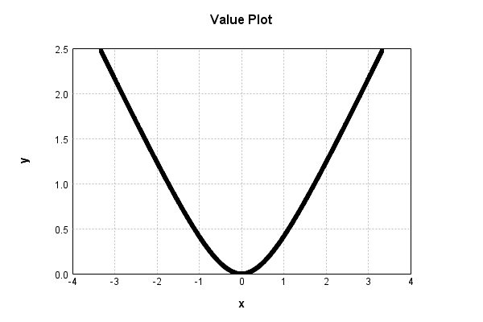
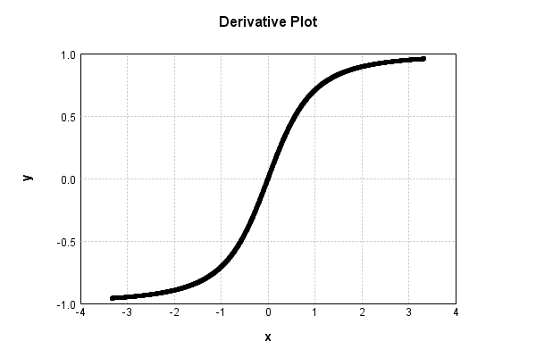

# HyperbolicActivationLayer
## HyperbolicActivationLayerTest
### Json Serialization
Code from [LayerTestBase.java:83](../../../../../../../../MindsEye/src/test/java/com/simiacryptus/mindseye/layers/LayerTestBase.java#L83) executed in 0.00 seconds: 
```java
    JsonObject json = layer.getJson();
    NNLayer echo = NNLayer.fromJson(json);
    assert (echo != null) : "Failed to deserialize";
    assert (layer != echo) : "Serialization did not copy";
    Assert.assertEquals("Serialization not equal", layer, echo);
    return new GsonBuilder().setPrettyPrinting().create().toJson(json);
```

Returns: 

```
    {
      "class": "com.simiacryptus.mindseye.layers.java.HyperbolicActivationLayer",
      "id": "370a9587-74a1-4959-b406-fa4500002bbc",
      "isFrozen": false,
      "name": "HyperbolicActivationLayer/370a9587-74a1-4959-b406-fa4500002bbc",
      "weights": {
        "dimensions": [
          2
        ],
        "data": [
          1.0,
          1.0
        ]
      },
      "negativeMode": 1
    }
```


### Reference Input/Output Pairs
Code from [LayerTestBase.java:110](../../../../../../../../MindsEye/src/test/java/com/simiacryptus/mindseye/layers/LayerTestBase.java#L110) executed in 0.00 seconds: 
```java
    SimpleEval eval = SimpleEval.run(layer, input);
    DoubleStatistics error = new DoubleStatistics().accept(eval.getOutput().add(output.scale(-1)).getData());
    return String.format("--------------------\nInput: \n[%s]\n--------------------\nOutput: \n%s\nError: %s",
      Arrays.stream(input).map(t->t.prettyPrint()).reduce((a,b)->a+",\n"+b).get(),
      eval.getOutput().prettyPrint(), error);
```

Returns: 

```
    --------------------
    Input: 
    [[ 0.0 ]]
    --------------------
    Output: 
    [ 0.0 ]
    Error: 0.0000e+00 +- 0.0000e+00 [0.0000e+00 - 0.0000e+00] (1#)
```


### Batch Execution
Code from [LayerTestBase.java:138](../../../../../../../../MindsEye/src/test/java/com/simiacryptus/mindseye/layers/LayerTestBase.java#L138) executed in 0.00 seconds: 
```java
    BatchingTester batchingTester = getBatchingTester();
    return batchingTester==null?null:batchingTester.test(layer, inputPrototype);
```

Returns: 

```
    ToleranceStatistics{absoluteTol=0.0000e+00 +- 0.0000e+00 [0.0000e+00 - 0.0000e+00] (120#), relativeTol=0.0000e+00 +- 0.0000e+00 [0.0000e+00 - 0.0000e+00] (120#)}
```


### Differential Validation
Code from [LayerTestBase.java:144](../../../../../../../../MindsEye/src/test/java/com/simiacryptus/mindseye/layers/LayerTestBase.java#L144) executed in 0.00 seconds: 
```java
    return getDerivativeTester().test(layer, inputPrototype);
```
Logging: 
```
    Inputs: [
    	[ [ -1.568 ], [ -0.524 ], [ -1.94 ] ],
    	[ [ -0.2 ], [ 1.792 ], [ -1.292 ] ]
    ]
    Inputs Statistics: {meanExponent=-0.021981735014745773, negative=5, min=-1.292, max=-1.292, mean=-0.6219999999999999, count=6.0, positive=1, stdDev=1.2312611420815651, zeros=0}
    Output: [
    	[ [ 0.8597376159017702 ], [ 0.12897121309624193 ], [ 1.182567295640618 ] ],
    	[ [ 0.01980390271855703 ], [ 1.0521364477051716 ], [ 0.6337882359718472 ] ]
    ]
    Outputs Statistics: {meanExponent=-0.46025806643029893, negative=0, min=0.6337882359718472, max=0.6337882359718472, mean=0.6461674518390343, count=6.0, positive=6, stdDev=0.4393412346977925, zeros=0}
    Feedback for input 0
    Inputs Values: [
    	[ [ -1.568 ], [ -0.524 ], [ -1.94 ] ],
    	[ [ -0.2 ], [ 1.792 ], [ -1.292 ] ]
    ]
    Value Statistics: {meanExponent=-0.021981735014745773, negative=5, min=-1.292, max=-1.292, mean=-0.6219999999999999, count=6.0, positive=1, stdDev=1.2312611420815651, zeros=0}
    Implemented Feedback: [ [ -0.8431296902276673, 0.0, 0.0, 0.0, 0.0, 0.0 ], [ 0.0, -0.19611613513818402, 0.0, 0.0, 0.0, 0.0 ], [ 0.0, 0.0, -0.46413938098821156, 0.0, 0.0, 0.0 ], [ 0.0, 0.0, 0.0, 0.873236281146864, 0.0, 0.0 ], [ 0.0, 0.0, 0.0, 0.0, -0.8888614815565535, 0.0 ], [ 0.0, 0.0, 0.0, 0.0, 0.0, -0.7908001609715736 ] ]
    Implemented Statistics: {meanExponent=-0.22115187753363305, negative=5, min=-0.7908001609715736, max=-0.7908001609715736, mean=-0.06416140465931461, count=36.0, positive=1, stdDev=0.288412085495978, zeros=30}
    Measured Feedback: [ [ -0.8431219164051207, 0.0, 0.0, 0.0, 0.0, 0.0 ], [ 0.0, -0.1960689909319413, 0.0, 0.0, 0.0, 0.0 ], [ 0.0, 0.0, -0.4641046322340081, 0.0, 0.0, 0.0 ], [ 0.0, 0.0, 0.0, 0.8732420665413798, 0.0, 0.0 ], [ 0.0, 0.0, 0.0, 0.0, -0.8888566722253799, 0.0 ], [ 0.0, 0.0, 0.0, 0.0, 0.0, -0.7907886951885601 ] ]
    Measured Statistics: {meanExponent=-0.22117632778979265, negative=5, min=-0.7907886951885601, max=-0.7907886951885601, mean=-0.06415830112343418, count=36.0, positive=1, stdDev=0.28840890252740353, zeros=30}
    Feedback Error: [ [ 7.773822546575104E-6, 0.0, 0.0, 0.0, 0.0, 0.0 ], [ 0.0, 4.714420624271631E-5, 0.0, 0.0, 0.0, 0.0 ], [ 0.0, 0.0, 3.4748754203450805E-5, 0.0, 0.0, 0.0 ], [ 0.0, 0.0, 0.0, 5.785394515789299E-6, 0.0, 0.0 ], [ 0.0, 0.0, 0.0, 0.0, 4.809331173638576E-6, 0.0 ], [ 0.0, 0.0, 0.0, 0.0, 0.0, 1.1465783013475672E-5 ] ]
    Error Statistics: {meanExponent=-4.898529404679149, negative=0, min=1.1465783013475672E-5, max=1.1465783013475672E-5, mean=3.1035358804346047E-6, count=36.0, positive=6, stdDev=9.620290183145314E-6, zeros=30}
    Learning Gradient for weight set 0
    Weights: [ 1.0, 1.0 ]
    Implemented Gradient: [ [ 0.0, 0.0, 0.0, -0.4872970318899911, 0.0, 0.0 ], [ -0.5377102616247879, -0.9805806756909201, -0.885762177458419, 0.0, -0.45817602142090386, -0.612074427996574 ] ]
    Implemented Statistics: {meanExponent=-0.1991701425188872, negative=6, min=-0.612074427996574, max=-0.612074427996574, mean=-0.3301333830067997, count=12.0, positive=0, stdDev=0.359328956111943, zeros=6}
    Measured Gradient: [ [ 0.0, 0.0, 0.0, -0.48722973111869905, 0.0, 0.0 ], [ -0.5376373872034712, -0.9804807418930389, -0.8856640704743568, 0.0, -0.45811211197399615, -0.6119940912907573 ] ]
    Measured Statistics: {meanExponent=-0.19922494315262373, negative=6, min=-0.6119940912907573, max=-0.6119940912907573, mean=-0.33009317782952663, count=12.0, positive=0, stdDev=0.35928812767682644, zeros=6}
    Gradient Error: [ [ 0.0, 0.0, 0.0, 6.730077129202261E-5, 0.0, 0.0 ], [ 7.287442131664879E-5, 9.993379788120205E-5, 9.81069840622073E-5, 0.0, 6.390944690770617E-5, 8.033670581664154E-5 ] ]
    Error Statistics: {meanExponent=-4.101252240497957, negative=0, min=8.033670581664154E-5, max=8.033670581664154E-5, mean=4.020517727303571E-5, count=12.0, positive=6, stdDev=4.142538244676053E-5, zeros=6}
    Finite-Difference Derivative Accuracy:
    absoluteTol: 1.2379e-05 +- 2.7505e-05 [0.0000e+00 - 9.9934e-05] (48#)
    relativeTol: 4.6173e-05 +- 3.4832e-05 [2.7053e-06 - 1.2021e-04] (12#)
    
```

Returns: 

```
    ToleranceStatistics{absoluteTol=1.2379e-05 +- 2.7505e-05 [0.0000e+00 - 9.9934e-05] (48#), relativeTol=4.6173e-05 +- 3.4832e-05 [2.7053e-06 - 1.2021e-04] (12#)}
```


### Performance
Code from [LayerTestBase.java:149](../../../../../../../../MindsEye/src/test/java/com/simiacryptus/mindseye/layers/LayerTestBase.java#L149) executed in 0.00 seconds: 
```java
    getPerformanceTester().test(layer, inputPrototype);
```
Logging: 
```
    Evaluation performance: 0.1775 +- 0.0537 [0.1083 - 0.3819]
    Learning performance: 0.0466 +- 0.0204 [0.0370 - 0.1824]
    
```

### Function Plots
Code from [ActivationLayerTestBase.java:74](../../../../../../../../MindsEye/src/test/java/com/simiacryptus/mindseye/layers/java/ActivationLayerTestBase.java#L74) executed in 0.01 seconds: 
```java
    return plot("Value Plot", plotData, x -> new double[]{x[0], x[1]});
```

Returns: 




Code from [ActivationLayerTestBase.java:78](../../../../../../../../MindsEye/src/test/java/com/simiacryptus/mindseye/layers/java/ActivationLayerTestBase.java#L78) executed in 0.01 seconds: 
```java
    return plot("Derivative Plot", plotData, x -> new double[]{x[0], x[2]});
```

Returns: 




