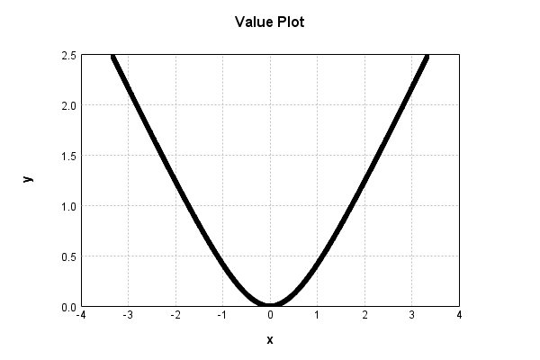

# HyperbolicActivationLayer
## HyperbolicActivationLayerTest
### Json Serialization
Code from [StandardLayerTests.java:68](../../../../../../../src/main/java/com/simiacryptus/mindseye/test/StandardLayerTests.java#L68) executed in 0.00 seconds: 
```java
    JsonObject json = layer.getJson();
    NNLayer echo = NNLayer.fromJson(json);
    if ((echo == null)) throw new AssertionError("Failed to deserialize");
    if ((layer == echo)) throw new AssertionError("Serialization did not copy");
    if ((!layer.equals(echo))) throw new AssertionError("Serialization not equal");
    return new GsonBuilder().setPrettyPrinting().create().toJson(json);
```

Returns: 

```
    {
      "class": "com.simiacryptus.mindseye.layers.java.HyperbolicActivationLayer",
      "id": "ab7107b4-0937-42ff-9489-04686c36014e",
      "isFrozen": false,
      "name": "HyperbolicActivationLayer/ab7107b4-0937-42ff-9489-04686c36014e",
      "weights": [
        1.0,
        1.0
      ],
      "negativeMode": 1
    }
```


### Reference Input/Output Pairs
Code from [StandardLayerTests.java:140](../../../../../../../src/main/java/com/simiacryptus/mindseye/test/StandardLayerTests.java#L140) executed in 0.00 seconds: 
```java
    SimpleEval eval = SimpleEval.run(layer, input);
    DoubleStatistics error = new DoubleStatistics().accept(eval.getOutput().add(output.scale(-1)).getData());
    return String.format("--------------------\nInput: \n[%s]\n--------------------\nOutput: \n%s\nError: %s\n--------------------\nDerivative: \n%s",
      Arrays.stream(input).map(t -> t.prettyPrint()).reduce((a, b) -> a + ",\n" + b).get(),
      eval.getOutput().prettyPrint(), error,
      Arrays.stream(eval.getDerivative()).map(t -> t.prettyPrint()).reduce((a, b) -> a + ",\n" + b).get());
```

Returns: 

```
    --------------------
    Input: 
    [[ 0.0 ]]
    --------------------
    Output: 
    [ 0.0 ]
    Error: 0.0000e+00 +- 0.0000e+00 [0.0000e+00 - 0.0000e+00] (1#)
    --------------------
    Derivative: 
    [ 0.0 ]
```


### Batch Execution
Code from [StandardLayerTests.java:101](../../../../../../../src/main/java/com/simiacryptus/mindseye/test/StandardLayerTests.java#L101) executed in 0.00 seconds: 
```java
    return getBatchingTester().test(layer, inputPrototype);
```

Returns: 

```
    ToleranceStatistics{absoluteTol=0.0000e+00 +- 0.0000e+00 [0.0000e+00 - 0.0000e+00] (120#), relativeTol=0.0000e+00 +- 0.0000e+00 [0.0000e+00 - 0.0000e+00] (120#)}
```


### Differential Validation
Code from [StandardLayerTests.java:109](../../../../../../../src/main/java/com/simiacryptus/mindseye/test/StandardLayerTests.java#L109) executed in 0.00 seconds: 
```java
    return getDerivativeTester().test(layer, inputPrototype);
```
Logging: 
```
    Inputs: [
    	[ [ 1.232 ], [ 1.304 ], [ 1.832 ] ],
    	[ [ -1.712 ], [ 0.196 ], [ 0.48 ] ]
    ]
    Inputs Statistics: {meanExponent=-0.05403086039511045, negative=1, min=0.48, max=0.48, mean=0.5553333333333333, count=6.0, positive=5, stdDev=1.1491919866681208, zeros=0}
    Output: [
    	[ [ 0.5867652630430249 ], [ 0.6432942524088618 ], [ 1.087156917914894 ] ],
    	[ [ 0.982660838368479 ], [ 0.019026986885038344 ], [ 0.10923396990896372 ] ]
    ]
    Outputs Statistics: {meanExponent=-0.5127837191172149, negative=0, min=0.10923396990896372, max=0.10923396990896372, mean=0.5713563714215436, count=6.0, positive=6, stdDev=0.39984557935064524, zeros=0}
    Feedback for input 0
    Inputs Values: [
    	[ [ 1.232 ], [ 1.304 ], [ 1.832 ] ],
    	[ [ -1.712 ], [ 0.196 ], [ 0.48 ] ]
    ]
    Value Statistics: {meanExponent=-0.05403086039511045, negative=1, min=0.48, max=0.48, mean=0.5553333333333333, count=6.0, positive=5, stdDev=1.1491919866681208, zeros=0}
    Implemented Feedback: [ [ 0.7764223409058801, 0.0, 0.0, 0.0, 0.0, 0.0 ], [ 0.0, -0.8634860621995215, 0.0, 
```
...[skipping 1788 bytes](etc/112.txt)...
```
    2, negative=6, min=0.0, max=0.0, mean=-0.3420909481410976, count=12.0, positive=0, stdDev=0.3677481593554118, zeros=6}
    Measured Gradient: [ [ -0.6301309314826753, 0.0, -0.6084537381723099, -0.9812283416623866, -0.4790542992094693, -0.901424474390039 ], [ 0.0, -0.5043034677176816, 0.0, 0.0, 0.0, 0.0 ] ]
    Measured Statistics: {meanExponent=-0.18109425202802054, negative=6, min=0.0, max=0.0, mean=-0.3420496043862135, count=12.0, positive=0, stdDev=0.3677063944952016, zeros=6}
    Gradient Error: [ [ 8.200756430531975E-5, 0.0, 8.000344707836948E-5, 9.993802998931045E-5, 6.636077378546767E-5, 9.858307823462642E-5 ], [ 0.0, 6.923216521648179E-5, 0.0, 0.0, 0.0, 0.0 ] ]
    Error Statistics: {meanExponent=-4.087880812082384, negative=0, min=0.0, max=0.0, mean=4.13437548841313E-5, count=12.0, positive=6, stdDev=4.2345009035904575E-5, zeros=6}
    Finite-Difference Derivative Accuracy:
    absoluteTol: 1.2827e-05 +- 2.8159e-05 [0.0000e+00 - 9.9938e-05] (48#)
    relativeTol: 4.6787e-05 +- 3.4630e-05 [3.1325e-06 - 1.2281e-04] (12#)
    
```

Returns: 

```
    ToleranceStatistics{absoluteTol=1.2827e-05 +- 2.8159e-05 [0.0000e+00 - 9.9938e-05] (48#), relativeTol=4.6787e-05 +- 3.4630e-05 [3.1325e-06 - 1.2281e-04] (12#)}
```


### Performance
Code from [StandardLayerTests.java:119](../../../../../../../src/main/java/com/simiacryptus/mindseye/test/StandardLayerTests.java#L119) executed in 0.54 seconds: 
```java
    getPerformanceTester().test(layer, permPrototype);
```
Logging: 
```
    100 batches
    Input Dimensions:
    	[100, 100, 1]
    Performance:
    	Evaluation performance: 0.054139s +- 0.054592s [0.019344s - 0.163013s]
    	Learning performance: 0.028839s +- 0.014162s [0.020694s - 0.057050s]
    
```

### Function Plots
Code from [ActivationLayerTestBase.java:110](../../../../../../../src/test/java/com/simiacryptus/mindseye/layers/java/ActivationLayerTestBase.java#L110) executed in 0.00 seconds: 
```java
    return plot("Value Plot", plotData, x -> new double[]{x[0], x[1]});
```

Returns: 




Code from [ActivationLayerTestBase.java:114](../../../../../../../src/test/java/com/simiacryptus/mindseye/layers/java/ActivationLayerTestBase.java#L114) executed in 0.00 seconds: 
```java
    return plot("Derivative Plot", plotData, x -> new double[]{x[0], x[2]});
```

Returns: 


