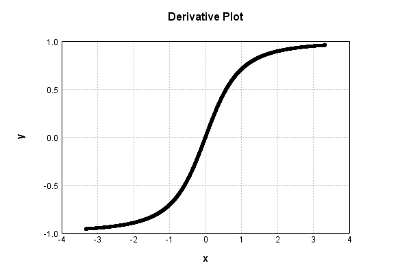

# HyperbolicActivationLayer
## HyperbolicActivationLayerTest
### Json Serialization
Code from [StandardLayerTests.java:69](../../../../../../../src/main/java/com/simiacryptus/mindseye/test/StandardLayerTests.java#L69) executed in 0.00 seconds: 
```java
    JsonObject json = layer.getJson();
    NNLayer echo = NNLayer.fromJson(json);
    if ((echo == null)) throw new AssertionError("Failed to deserialize");
    if ((layer == echo)) throw new AssertionError("Serialization did not copy");
    if ((!layer.equals(echo))) throw new AssertionError("Serialization not equal");
    return new GsonBuilder().setPrettyPrinting().create().toJson(json);
```

Returns: 

```
    {
      "class": "com.simiacryptus.mindseye.layers.java.HyperbolicActivationLayer",
      "id": "df46d0ee-575e-4ac9-ae9a-69984155eba5",
      "isFrozen": false,
      "name": "HyperbolicActivationLayer/df46d0ee-575e-4ac9-ae9a-69984155eba5",
      "weights": [
        1.0,
        1.0
      ],
      "negativeMode": 1
    }
```


### Reference Input/Output Pairs
Code from [StandardLayerTests.java:141](../../../../../../../src/main/java/com/simiacryptus/mindseye/test/StandardLayerTests.java#L141) executed in 0.00 seconds: 
```java
    SimpleEval eval = SimpleEval.run(layer, input);
    DoubleStatistics error = new DoubleStatistics().accept(eval.getOutput().add(output.scale(-1)).getData());
    return String.format("--------------------\nInput: \n[%s]\n--------------------\nOutput: \n%s\nError: %s\n--------------------\nDerivative: \n%s",
      Arrays.stream(input).map(t -> t.prettyPrint()).reduce((a, b) -> a + ",\n" + b).get(),
      eval.getOutput().prettyPrint(), error,
      Arrays.stream(eval.getDerivative()).map(t -> t.prettyPrint()).reduce((a, b) -> a + ",\n" + b).get());
```

Returns: 

```
    --------------------
    Input: 
    [[ 0.0 ]]
    --------------------
    Output: 
    [ 0.0 ]
    Error: 0.0000e+00 +- 0.0000e+00 [0.0000e+00 - 0.0000e+00] (1#)
    --------------------
    Derivative: 
    [ 0.0 ]
```


### Batch Execution
Code from [StandardLayerTests.java:102](../../../../../../../src/main/java/com/simiacryptus/mindseye/test/StandardLayerTests.java#L102) executed in 0.00 seconds: 
```java
    return getBatchingTester().test(layer, inputPrototype);
```

Returns: 

```
    ToleranceStatistics{absoluteTol=0.0000e+00 +- 0.0000e+00 [0.0000e+00 - 0.0000e+00] (120#), relativeTol=0.0000e+00 +- 0.0000e+00 [0.0000e+00 - 0.0000e+00] (120#)}
```


### Differential Validation
Code from [StandardLayerTests.java:110](../../../../../../../src/main/java/com/simiacryptus/mindseye/test/StandardLayerTests.java#L110) executed in 0.00 seconds: 
```java
    return getDerivativeTester().test(layer, inputPrototype);
```
Logging: 
```
    Inputs: [
    	[ [ 0.408 ], [ -0.3 ], [ -1.612 ] ],
    	[ [ -1.596 ], [ 1.552 ], [ -1.704 ] ]
    ]
    Inputs Statistics: {meanExponent=-0.0132432250589707, negative=4, min=-1.704, max=-1.704, mean=-0.542, count=6.0, positive=2, stdDev=1.2214717898229714, zeros=0}
    Output: [
    	[ [ 0.08002962922319856 ], [ 0.04403065089105507 ], [ 0.8969828676084559 ] ],
    	[ [ 0.8834054263487721 ], [ 0.8462675862398712 ], [ 0.9757570700873122 ] ]
    ]
    Outputs Statistics: {meanExponent=-0.4395334108939595, negative=0, min=0.9757570700873122, max=0.9757570700873122, mean=0.6210788717331108, count=6.0, positive=6, stdDev=0.3973167816161782, zeros=0}
    Feedback for input 0
    Inputs Values: [
    	[ [ 0.408 ], [ -0.3 ], [ -1.612 ] ],
    	[ [ -1.596 ], [ 1.552 ], [ -1.704 ] ]
    ]
    Value Statistics: {meanExponent=-0.0132432250589707, negative=4, min=-1.704, max=-1.704, mean=-0.542, count=6.0, positive=2, stdDev=1.2214717898229714, zeros=0}
    Implemented Feedback: [ [ 0.37776741393053287, 0.0, 0.0, 0.0, 0.0, 0.0 ], [ 0.0, -0.8474011902440225, 0.0, 0.0, 0.0, 0.0 ]
```
...[skipping 1884 bytes](etc/70.txt)...
```
    0, positive=0, stdDev=0.36028390499934554, zeros=6}
    Measured Gradient: [ [ -0.9258013376195473, 0.0, 0.0, -0.5415600056091208, 0.0, 0.0 ], [ 0.0, -0.5308809764159594, -0.9577265582702554, 0.0, -0.527081149650499, -0.5060656698441246 ] ]
    Measured Statistics: {meanExponent=-0.19458542610559634, negative=6, min=-0.5060656698441246, max=-0.5060656698441246, mean=-0.3324263081174589, count=12.0, positive=0, stdDev=0.36024298796304083, zeros=6}
    Gradient Error: [ [ 9.918671999409323E-5, 0.0, 0.0, 7.329145623635736E-5, 0.0, 0.0 ], [ 0.0, 7.21503033528359E-5, 9.972695089588424E-5, 0.0, 7.173985382702419E-5, 6.942901993167716E-5 ] ]
    Error Statistics: {meanExponent=-4.097356815977348, negative=0, min=6.942901993167716E-5, max=6.942901993167716E-5, mean=4.046035868648934E-5, count=12.0, positive=6, stdDev=4.1516344095480875E-5, zeros=6}
    Finite-Difference Derivative Accuracy:
    absoluteTol: 1.2466e-05 +- 2.7609e-05 [0.0000e+00 - 9.9727e-05] (48#)
    relativeTol: 4.3673e-05 +- 2.8726e-05 [3.7586e-06 - 7.6461e-05] (12#)
    
```

Returns: 

```
    ToleranceStatistics{absoluteTol=1.2466e-05 +- 2.7609e-05 [0.0000e+00 - 9.9727e-05] (48#), relativeTol=4.3673e-05 +- 2.8726e-05 [3.7586e-06 - 7.6461e-05] (12#)}
```


### Performance
Code from [StandardLayerTests.java:120](../../../../../../../src/main/java/com/simiacryptus/mindseye/test/StandardLayerTests.java#L120) executed in 0.00 seconds: 
```java
    getPerformanceTester().test(layer, permPrototype);
```
Logging: 
```
    Evaluation performance: 0.000114s +- 0.000013s [0.000098s - 0.000136s]
    Learning performance: 0.000268s +- 0.000049s [0.000172s - 0.000305s]
    
```

### Function Plots
Code from [ActivationLayerTestBase.java:103](../../../../../../../src/test/java/com/simiacryptus/mindseye/layers/java/ActivationLayerTestBase.java#L103) executed in 0.01 seconds: 
```java
    return plot("Value Plot", plotData, x -> new double[]{x[0], x[1]});
```

Returns: 


Code from [ActivationLayerTestBase.java:107](../../../../../../../src/test/java/com/simiacryptus/mindseye/layers/java/ActivationLayerTestBase.java#L107) executed in 0.01 seconds: 
```java
    return plot("Derivative Plot", plotData, x -> new double[]{x[0], x[2]});
```

Returns: 




