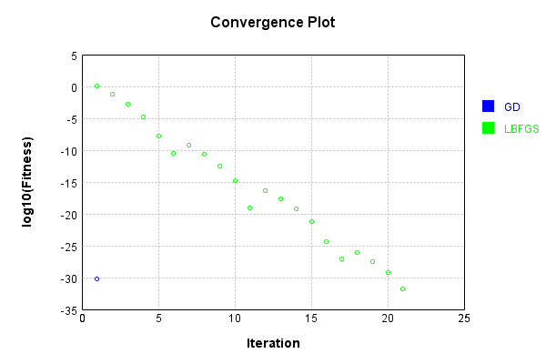
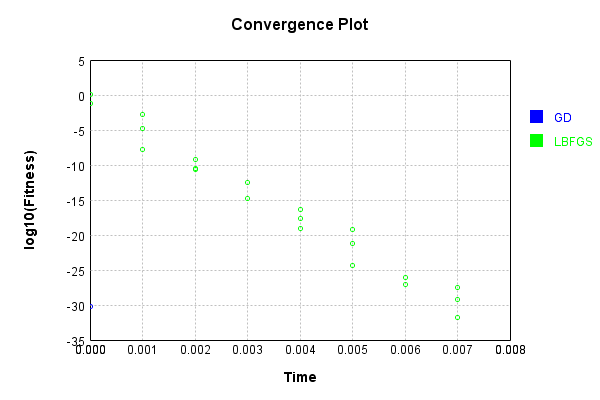
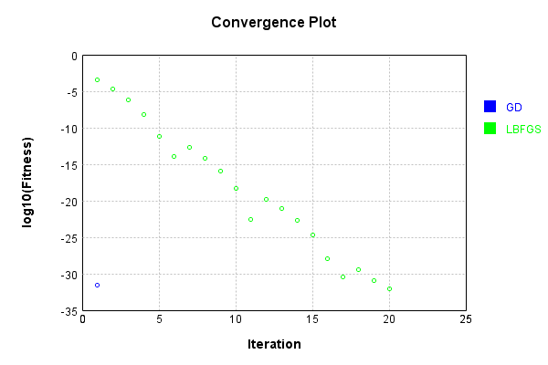
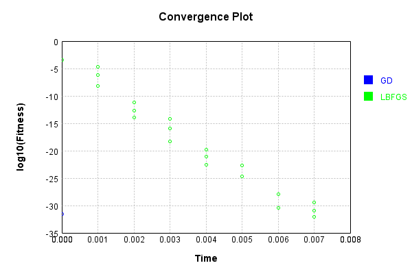
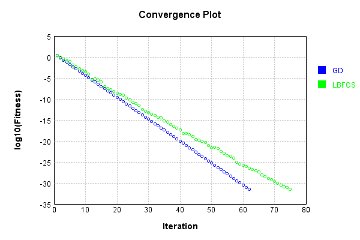
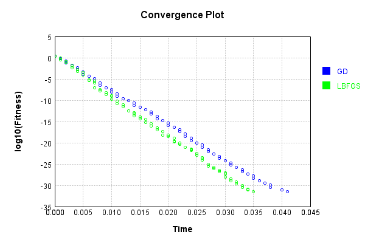

# ImgBandBiasLayer
## ImgBandBiasLayerTest
### Json Serialization
Code from [JsonTest.java:36](../../../../../../../src/main/java/com/simiacryptus/mindseye/test/unit/JsonTest.java#L36) executed in 0.00 seconds: 
```java
    JsonObject json = layer.getJson();
    NNLayer echo = NNLayer.fromJson(json);
    if ((echo == null)) throw new AssertionError("Failed to deserialize");
    if ((layer == echo)) throw new AssertionError("Serialization did not copy");
    if ((!layer.equals(echo))) throw new AssertionError("Serialization not equal");
    return new GsonBuilder().setPrettyPrinting().create().toJson(json);
```

Returns: 

```
    {
      "class": "com.simiacryptus.mindseye.layers.java.ImgBandBiasLayer",
      "id": "ff1851ed-c927-496c-a96d-44064f6437de",
      "isFrozen": false,
      "name": "ImgBandBiasLayer/ff1851ed-c927-496c-a96d-44064f6437de",
      "bias": [
        1.188,
        -0.944,
        0.732
      ]
    }
```


### Example Input/Output Pair
Code from [ReferenceIO.java:68](../../../../../../../src/main/java/com/simiacryptus/mindseye/test/unit/ReferenceIO.java#L68) executed in 0.00 seconds: 
```java
    SimpleEval eval = SimpleEval.run(layer, inputPrototype);
    return String.format("--------------------\nInput: \n[%s]\n--------------------\nOutput: \n%s\n--------------------\nDerivative: \n%s",
      Arrays.stream(inputPrototype).map(t -> t.prettyPrint()).reduce((a, b) -> a + ",\n" + b).get(),
      eval.getOutput().prettyPrint(),
      Arrays.stream(eval.getDerivative()).map(t -> t.prettyPrint()).reduce((a, b) -> a + ",\n" + b).get());
```

Returns: 

```
    --------------------
    Input: 
    [[
    	[ [ -0.828, 1.596, -0.18 ], [ 1.396, -1.172, 0.788 ] ],
    	[ [ -0.588, 1.496, -1.372 ], [ -0.412, -1.628, 1.36 ] ]
    ]]
    --------------------
    Output: 
    [
    	[ [ 0.36, 0.6520000000000001, 0.552 ], [ 2.5839999999999996, -2.1159999999999997, 1.52 ] ],
    	[ [ 0.6, 0.552, -0.6400000000000001 ], [ 0.776, -2.572, 2.092 ] ]
    ]
    --------------------
    Derivative: 
    [
    	[ [ 1.0, 1.0, 1.0 ], [ 1.0, 1.0, 1.0 ] ],
    	[ [ 1.0, 1.0, 1.0 ], [ 1.0, 1.0, 1.0 ] ]
    ]
```


### Batch Execution
Code from [BatchingTester.java:66](../../../../../../../src/main/java/com/simiacryptus/mindseye/test/unit/BatchingTester.java#L66) executed in 0.00 seconds: 
```java
    return test(reference, inputPrototype);
```

Returns: 

```
    ToleranceStatistics{absoluteTol=0.0000e+00 +- 0.0000e+00 [0.0000e+00 - 0.0000e+00] (240#), relativeTol=0.0000e+00 +- 0.0000e+00 [0.0000e+00 - 0.0000e+00] (240#)}
```


Code from [SingleDerivativeTester.java:77](../../../../../../../src/main/java/com/simiacryptus/mindseye/test/unit/SingleDerivativeTester.java#L77) executed in 0.00 seconds: 
```java
    return test(component, inputPrototype);
```
Logging: 
```
    Inputs: [
    	[ [ -0.94, 1.14, 1.356 ], [ 0.192, 1.656, -1.508 ] ],
    	[ [ 1.608, 0.18, 0.228 ], [ -1.724, -1.44, 1.184 ] ]
    ]
    Inputs Statistics: {meanExponent=-0.07243332086329843, negative=4, min=1.184, max=1.184, mean=0.16100000000000006, count=12.0, positive=8, stdDev=1.2207179581432122, zeros=0}
    Output: [
    	[ [ 0.248, 0.19599999999999995, 2.088 ], [ 1.38, 0.712, -0.776 ] ],
    	[ [ 2.7960000000000003, -0.764, 0.96 ], [ -0.536, -2.384, 1.916 ] ]
    ]
    Outputs Statistics: {meanExponent=-0.034214387333200445, negative=4, min=1.916, max=1.916, mean=0.48633333333333334, count=12.0, positive=8, stdDev=1.4023689085100095, zeros=0}
    Feedback for input 0
    Inputs Values: [
    	[ [ -0.94, 1.14, 1.356 ], [ 0.192, 1.656, -1.508 ] ],
    	[ [ 1.608, 0.18, 0.228 ], [ -1.724, -1.44, 1.184 ] ]
    ]
    Value Statistics: {meanExponent=-0.07243332086329843, negative=4, min=1.184, max=1.184, mean=0.16100000000000006, count=12.0, positive=8, stdDev=1.2207179581432122, zeros=0}
    Implemented Feedback: [ [ 1.0, 0.0, 0.0, 0.0, 0.0, 0.0, 0.0, 0.0, ... ]
```
...[skipping 2673 bytes](etc/292.txt)...
```
    99998899, 1.0000000000021103, ... ], [ 0.0, 0.0, 0.0, 0.0, 0.0, 0.0, 0.0, 0.0, ... ] ]
    Measured Statistics: {meanExponent=-1.2819126455409606E-13, negative=0, min=0.9999999999998899, max=0.9999999999998899, mean=0.33333333333323495, count=36.0, positive=12, stdDev=0.4714045207908925, zeros=24}
    Gradient Error: [ [ -1.1013412404281553E-13, -2.3305801732931286E-12, -1.1013412404281553E-13, -1.1013412404281553E-13, 0.0, 0.0, 0.0, 0.0, ... ], [ 0.0, 0.0, 0.0, 0.0, -1.1013412404281553E-13, -1.1013412404281553E-13, -1.1013412404281553E-13, 2.1103119252074976E-12, ... ], [ 0.0, 0.0, 0.0, 0.0, 0.0, 0.0, 0.0, 0.0, ... ] ]
    Error Statistics: {meanExponent=-12.630285677851015, negative=11, min=-1.1013412404281553E-13, max=-1.1013412404281553E-13, mean=-9.839043160455831E-14, count=36.0, positive=1, stdDev=6.471580105942531E-13, zeros=24}
    Finite-Difference Derivative Accuracy:
    absoluteTol: 8.6252e-14 +- 4.0492e-13 [0.0000e+00 - 2.3306e-12] (180#)
    relativeTol: 3.2344e-13 +- 4.6557e-13 [5.5067e-14 - 1.1653e-12] (24#)
    
```

Returns: 

```
    ToleranceStatistics{absoluteTol=8.6252e-14 +- 4.0492e-13 [0.0000e+00 - 2.3306e-12] (180#), relativeTol=3.2344e-13 +- 4.6557e-13 [5.5067e-14 - 1.1653e-12] (24#)}
```


### Performance
Now we execute larger-scale runs to benchmark performance:

Code from [PerformanceTester.java:66](../../../../../../../src/main/java/com/simiacryptus/mindseye/test/unit/PerformanceTester.java#L66) executed in 0.00 seconds: 
```java
    test(component, inputPrototype);
```
Logging: 
```
    100 batches
    Input Dimensions:
    	[2, 2, 3]
    Performance:
    	Evaluation performance: 0.000339s +- 0.000012s [0.000326s - 0.000358s]
    	Learning performance: 0.000153s +- 0.000013s [0.000142s - 0.000177s]
    
```

### Input Learning
In this test, we use a network to learn this target input, given it's pre-evaluated output:

Code from [LearningTester.java:127](../../../../../../../src/main/java/com/simiacryptus/mindseye/test/unit/LearningTester.java#L127) executed in 0.00 seconds: 
```java
    return Arrays.stream(input_target).map(x -> x.prettyPrint()).reduce((a, b) -> a + "\n" + b).orElse("");
```

Returns: 

```
    [
    	[ [ -0.396, -1.848, 0.58 ], [ 1.832, 1.156, 1.516 ] ],
    	[ [ 1.6, 1.5, 1.34 ], [ -1.04, 0.32, -0.468 ] ]
    ]
```


First, we use a conjugate gradient descent method, which converges the fastest for purely linear functions.

Code from [LearningTester.java:300](../../../../../../../src/main/java/com/simiacryptus/mindseye/test/unit/LearningTester.java#L300) executed in 0.00 seconds: 
```java
    return new IterativeTrainer(trainable)
      .setLineSearchFactory(label -> new QuadraticSearch())
      .setOrientation(new GradientDescent())
      .setMonitor(monitor)
      .setTimeout(30, TimeUnit.SECONDS)
      .setMaxIterations(250)
      .setTerminateThreshold(0)
      .run();
```
Logging: 
```
    Constructing line search parameters: GD
    F(0.0) = LineSearchPoint{point=PointSample{avg=2.8756720000000002}, derivative=-0.9585573333333335}
    New Minimum: 2.8756720000000002 > 2.8756719999041453
    F(1.0E-10) = LineSearchPoint{point=PointSample{avg=2.8756719999041453}, derivative=-0.9585573333173574}, delta = -9.585487958929662E-11
    New Minimum: 2.8756719999041453 > 2.87567199932901
    F(7.000000000000001E-10) = LineSearchPoint{point=PointSample{avg=2.87567199932901}, derivative=-0.9585573332215017}, delta = -6.709903743740142E-10
    New Minimum: 2.87567199932901 > 2.875671995303069
    F(4.900000000000001E-9) = LineSearchPoint{point=PointSample{avg=2.875671995303069}, derivative=-0.9585573325505116}, delta = -4.69693128835047E-9
    New Minimum: 2.875671995303069 > 2.875671967121484
    F(3.430000000000001E-8) = LineSearchPoint{point=PointSample{avg=2.875671967121484}, derivative=-0.9585573278535806}, delta = -3.287851635391803E-8
    New Minimum: 2.875671967121484 > 2.87567176985039
    F(2.4010000000000004E-7) = LineSearchPoin
```
...[skipping 2749 bytes](etc/293.txt)...
```
    -4.971467163111585E-31
    F(22.615384615384603) = LineSearchPoint{point=PointSample{avg=4.73932840714811E-30}, derivative=5.680209382646087E-31}, delta = 4.125085150218208E-30
    F(1.7396449704142003) = LineSearchPoint{point=PointSample{avg=3.0506730319093816E-31}, derivative=-1.4243321899823822E-31}, delta = -3.091759537389643E-31
    F(12.177514792899402) = LineSearchPoint{point=PointSample{avg=6.1424325692990245E-31}, derivative=2.0474775230996743E-31}, delta = 0.0
    6.1424325692990245E-31 <= 6.1424325692990245E-31
    F(6.088757396449701) = LineSearchPoint{point=PointSample{avg=4.108650548026103E-33}, derivative=-6.847750913376838E-33}, delta = -6.101346063818763E-31
    Left bracket at 6.088757396449701
    New Minimum: 4.108650548026103E-33 > 0.0
    F(6.285804561383348) = LineSearchPoint{point=PointSample{avg=0.0}, derivative=0.0}, delta = -6.1424325692990245E-31
    Right bracket at 6.285804561383348
    Converged to right
    Iteration 2 complete. Error: 0.0 Total: 249790013575081.0000; Orientation: 0.0000; Line Search: 0.0008
    
```

Returns: 

```
    0.0
```


Training Converged

Next, we run the same optimization using L-BFGS, which is nearly ideal for purely second-order or quadratic functions.

Code from [LearningTester.java:324](../../../../../../../src/main/java/com/simiacryptus/mindseye/test/unit/LearningTester.java#L324) executed in 0.01 seconds: 
```java
    return new IterativeTrainer(trainable)
      .setLineSearchFactory(label -> new ArmijoWolfeSearch())
      .setOrientation(new LBFGS())
      .setMonitor(monitor)
      .setTimeout(30, TimeUnit.SECONDS)
      .setMaxIterations(250)
      .setTerminateThreshold(0)
      .run();
```
Logging: 
```
    LBFGS Accumulation History: 1 points
    Constructing line search parameters: GD
    th(0)=2.8756720000000002;dx=-0.9585573333333335
    New Minimum: 2.8756720000000002 > 1.1812919132470145
    END: th(2.154434690031884)=1.1812919132470145; dx=-0.6143658047803685 delta=1.6943800867529857
    Iteration 1 complete. Error: 1.1812919132470145 Total: 249790016031309.9700; Orientation: 0.0000; Line Search: 0.0002
    LBFGS Accumulation History: 1 points
    th(0)=1.1812919132470145;dx=-0.3937639710823381
    New Minimum: 1.1812919132470145 > 0.06055042781262585
    END: th(4.641588833612779)=0.06055042781262585; dx=-0.08914889587320382 delta=1.1207414854343887
    Iteration 2 complete. Error: 0.06055042781262585 Total: 249790016295769.9700; Orientation: 0.0000; Line Search: 0.0002
    LBFGS Accumulation History: 1 points
    th(0)=0.06055042781262585;dx=-0.020183475937541953
    New Minimum: 0.06055042781262585 > 0.026911301250055975
    WOLF (strong): th(10.000000000000002)=0.026911301250055975; dx=0.013455650625027977 delta=0.03363912656256988
    New Minim
```
...[skipping 9607 bytes](etc/294.txt)...
```
    875E-30 delta=1.2120519116677002E-30
    New Minimum: 4.258616293029056E-30 > 1.8488927466117464E-32
    END: th(5.651403356481485)=1.8488927466117464E-32; dx=-9.758045051561994E-32 delta=5.452179277230639E-30
    Iteration 21 complete. Error: 1.8488927466117464E-32 Total: 249790023360953.9700; Orientation: 0.0000; Line Search: 0.0003
    LBFGS Accumulation History: 1 points
    th(0)=1.8488927466117464E-32;dx=-6.162975822039155E-33
    Armijo: th(12.175579438566336)=1.8488927466117464E-32; dx=6.162975822039155E-33 delta=0.0
    New Minimum: 1.8488927466117464E-32 > 1.0271626370065257E-33
    WOLF (strong): th(6.087789719283168)=1.0271626370065257E-33; dx=3.423875456688419E-34 delta=1.746176482911094E-32
    WOLFE (weak): th(2.029263239761056)=1.746176482911094E-32; dx=-5.8205882763703126E-33 delta=1.0271626370065249E-33
    New Minimum: 1.0271626370065257E-33 > 0.0
    END: th(4.058526479522112)=0.0; dx=0.0 delta=1.8488927466117464E-32
    Iteration 22 complete. Error: 0.0 Total: 249790023972802.9700; Orientation: 0.0000; Line Search: 0.0005
    
```

Returns: 

```
    0.0
```


Training Converged

Code from [LearningTester.java:96](../../../../../../../src/main/java/com/simiacryptus/mindseye/test/unit/LearningTester.java#L96) executed in 0.00 seconds: 
```java
    return TestUtil.compare(runs);
```

Returns: 




Code from [LearningTester.java:99](../../../../../../../src/main/java/com/simiacryptus/mindseye/test/unit/LearningTester.java#L99) executed in 0.01 seconds: 
```java
    return TestUtil.compareTime(runs);
```

Returns: 




### Model Learning
In this test, attempt to train a network to emulate a randomized network given an example input/output. The target state is:

Code from [LearningTester.java:176](../../../../../../../src/main/java/com/simiacryptus/mindseye/test/unit/LearningTester.java#L176) executed in 0.00 seconds: 
```java
    return network_target.state().stream().map(Arrays::toString).reduce((a, b) -> a + "\n" + b).orElse("");
```

Returns: 

```
    [0.964, -0.84, -0.928]
```


First, we use a conjugate gradient descent method, which converges the fastest for purely linear functions.

Code from [LearningTester.java:300](../../../../../../../src/main/java/com/simiacryptus/mindseye/test/unit/LearningTester.java#L300) executed in 0.00 seconds: 
```java
    return new IterativeTrainer(trainable)
      .setLineSearchFactory(label -> new QuadraticSearch())
      .setOrientation(new GradientDescent())
      .setMonitor(monitor)
      .setTimeout(30, TimeUnit.SECONDS)
      .setMaxIterations(250)
      .setTerminateThreshold(0)
      .run();
```
Logging: 
```
    Constructing line search parameters: GD
    F(0.0) = LineSearchPoint{point=PointSample{avg=2.169610666666667}, derivative=-2.8928142222222215}
    New Minimum: 2.169610666666667 > 2.1696106663773853
    F(1.0E-10) = LineSearchPoint{point=PointSample{avg=2.1696106663773853}, derivative=-2.8928142220293678}, delta = -2.892814876531702E-10
    New Minimum: 2.1696106663773853 > 2.1696106646416973
    F(7.000000000000001E-10) = LineSearchPoint{point=PointSample{avg=2.1696106646416973}, derivative=-2.892814220872242}, delta = -2.0249695253937716E-9
    New Minimum: 2.1696106646416973 > 2.1696106524918766
    F(4.900000000000001E-9) = LineSearchPoint{point=PointSample{avg=2.1696106524918766}, derivative=-2.892814212772362}, delta = -1.417479023047008E-8
    New Minimum: 2.1696106524918766 > 2.1696105674431396
    F(3.430000000000001E-8) = LineSearchPoint{point=PointSample{avg=2.1696105674431396}, derivative=-2.892814156073203}, delta = -9.922352717239846E-8
    New Minimum: 2.1696105674431396 > 2.169609972102027
    F(2.4010000000000004E-7) = LineS
```
...[skipping 1969 bytes](etc/295.txt)...
```
    mplete. Error: 2.9787716473189246E-32 Total: 249790196244803.8000; Orientation: 0.0000; Line Search: 0.0017
    Zero gradient: 1.7456371777814234E-16
    F(0.0) = LineSearchPoint{point=PointSample{avg=2.9787716473189246E-32}, derivative=-3.047249156452693E-32}
    New Minimum: 2.9787716473189246E-32 > 2.0543252740130515E-33
    F(1.5) = LineSearchPoint{point=PointSample{avg=2.0543252740130515E-33}, derivative=5.4782007307014706E-33}, delta = -2.7733391199176196E-32
    2.0543252740130515E-33 <= 2.9787716473189246E-32
    F(1.2714285714285714) = LineSearchPoint{point=PointSample{avg=2.0543252740130515E-33}, derivative=5.4782007307014706E-33}, delta = -2.7733391199176196E-32
    Right bracket at 1.2714285714285714
    New Minimum: 2.0543252740130515E-33 > 0.0
    F(1.0776870748299319) = LineSearchPoint{point=PointSample{avg=0.0}, derivative=0.0}, delta = -2.9787716473189246E-32
    Right bracket at 1.0776870748299319
    Converged to right
    Iteration 2 complete. Error: 0.0 Total: 249790196933596.8000; Orientation: 0.0001; Line Search: 0.0005
    
```

Returns: 

```
    0.0
```


Training Converged

Next, we run the same optimization using L-BFGS, which is nearly ideal for purely second-order or quadratic functions.

Code from [LearningTester.java:324](../../../../../../../src/main/java/com/simiacryptus/mindseye/test/unit/LearningTester.java#L324) executed in 0.01 seconds: 
```java
    return new IterativeTrainer(trainable)
      .setLineSearchFactory(label -> new ArmijoWolfeSearch())
      .setOrientation(new LBFGS())
      .setMonitor(monitor)
      .setTimeout(30, TimeUnit.SECONDS)
      .setMaxIterations(250)
      .setTerminateThreshold(0)
      .run();
```
Logging: 
```
    LBFGS Accumulation History: 1 points
    Constructing line search parameters: GD
    th(0)=0.005162666666666676;dx=-0.006883555555555566
    New Minimum: 0.005162666666666676 > 9.827073210893745E-4
    WOLF (strong): th(2.154434690031884)=9.827073210893745E-4; dx=0.0030032250308781702 delta=0.004179959345577302
    New Minimum: 9.827073210893745E-4 > 4.1013411035969544E-4
    END: th(1.077217345015942)=4.1013411035969544E-4; dx=-0.001940165262338691 delta=0.00475253255630698
    Iteration 1 complete. Error: 4.1013411035969544E-4 Total: 249790201022466.8000; Orientation: 0.0001; Line Search: 0.0003
    LBFGS Accumulation History: 1 points
    th(0)=4.1013411035969544E-4;dx=-5.468454804795938E-4
    New Minimum: 4.1013411035969544E-4 > 1.2280390010050565E-4
    WOLF (strong): th(2.3207944168063896)=1.2280390010050565E-4; dx=2.9923181148897265E-4 delta=2.8733021025918975E-4
    New Minimum: 1.2280390010050565E-4 > 2.1022573306686134E-5
    END: th(1.1603972084031948)=2.1022573306686134E-5; dx=-1.238068344953124E-4 delta=3.891115370530093E-4
    Iteratio
```
...[skipping 9189 bytes](etc/296.txt)...
```
    0; Orientation: 0.0000; Line Search: 0.0004
    LBFGS Accumulation History: 1 points
    th(0)=1.314768175368353E-31;dx=-1.7530242338244706E-31
    New Minimum: 1.314768175368353E-31 > 8.320017359752859E-32
    WOLF (strong): th(2.623149071368624)=8.320017359752859E-32; dx=1.3695501826753677E-31 delta=4.8276643939306705E-32
    New Minimum: 8.320017359752859E-32 > 9.244463733058732E-33
    END: th(1.311574535684312)=9.244463733058732E-33; dx=-3.834740511491029E-32 delta=1.2223235380377656E-31
    Iteration 20 complete. Error: 9.244463733058732E-33 Total: 249790208229000.7800; Orientation: 0.0000; Line Search: 0.0003
    LBFGS Accumulation History: 1 points
    th(0)=9.244463733058732E-33;dx=-8.559688641721048E-33
    Armijo: th(2.8257016782407427)=1.0271626370065258E-32; dx=8.217301096052206E-33 delta=-1.0271626370065262E-33
    New Minimum: 9.244463733058732E-33 > 0.0
    END: th(1.4128508391203713)=0.0; dx=0.0 delta=9.244463733058732E-33
    Iteration 21 complete. Error: 0.0 Total: 249790208609446.7800; Orientation: 0.0000; Line Search: 0.0003
    
```

Returns: 

```
    0.0
```


Training Converged

Code from [LearningTester.java:96](../../../../../../../src/main/java/com/simiacryptus/mindseye/test/unit/LearningTester.java#L96) executed in 0.00 seconds: 
```java
    return TestUtil.compare(runs);
```

Returns: 




Code from [LearningTester.java:99](../../../../../../../src/main/java/com/simiacryptus/mindseye/test/unit/LearningTester.java#L99) executed in 0.00 seconds: 
```java
    return TestUtil.compareTime(runs);
```

Returns: 




### Composite Learning
In this test, attempt to train a network to emulate a randomized network given an example input/output. The target state is:

Code from [LearningTester.java:219](../../../../../../../src/main/java/com/simiacryptus/mindseye/test/unit/LearningTester.java#L219) executed in 0.00 seconds: 
```java
    return network_target.state().stream().map(Arrays::toString).reduce((a, b) -> a + "\n" + b).orElse("");
```

Returns: 

```
    [-0.928, -0.84, 0.964]
```


We simultaneously regress this target input:

Code from [LearningTester.java:223](../../../../../../../src/main/java/com/simiacryptus/mindseye/test/unit/LearningTester.java#L223) executed in 0.00 seconds: 
```java
    return Arrays.stream(testInput).map(x -> x.prettyPrint()).reduce((a, b) -> a + "\n" + b).orElse("");
```

Returns: 

```
    [
    	[ [ -0.396, -1.04, 1.156 ], [ 0.58, -0.468, -1.848 ] ],
    	[ [ 1.6, 0.32, 1.832 ], [ 1.516, 1.5, 1.34 ] ]
    ]
```


Which produces the following output:

Code from [LearningTester.java:230](../../../../../../../src/main/java/com/simiacryptus/mindseye/test/unit/LearningTester.java#L230) executed in 0.00 seconds: 
```java
    return Stream.of(targetOutput).map(x -> x.prettyPrint()).reduce((a, b) -> a + "\n" + b).orElse("");
```

Returns: 

```
    [
    	[ [ -1.324, -1.88, 2.12 ], [ -0.3480000000000001, -1.308, -0.8840000000000001 ] ],
    	[ [ 0.672, -0.52, 2.7960000000000003 ], [ 0.588, 0.66, 2.3040000000000003 ] ]
    ]
```


First, we use a conjugate gradient descent method, which converges the fastest for purely linear functions.

Code from [LearningTester.java:300](../../../../../../../src/main/java/com/simiacryptus/mindseye/test/unit/LearningTester.java#L300) executed in 0.04 seconds: 
```java
    return new IterativeTrainer(trainable)
      .setLineSearchFactory(label -> new QuadraticSearch())
      .setOrientation(new GradientDescent())
      .setMonitor(monitor)
      .setTimeout(30, TimeUnit.SECONDS)
      .setMaxIterations(250)
      .setTerminateThreshold(0)
      .run();
```
Logging: 
```
    Constructing line search parameters: GD
    F(0.0) = LineSearchPoint{point=PointSample{avg=6.273029333333334}, derivative=-6.188656}
    New Minimum: 6.273029333333334 > 6.273029332714469
    F(1.0E-10) = LineSearchPoint{point=PointSample{avg=6.273029332714469}, derivative=-6.188655999555385}, delta = -6.188649592786533E-10
    New Minimum: 6.273029332714469 > 6.273029329001275
    F(7.000000000000001E-10) = LineSearchPoint{point=PointSample{avg=6.273029329001275}, derivative=-6.188655996887696}, delta = -4.332058267664252E-9
    New Minimum: 6.273029329001275 > 6.273029303008919
    F(4.900000000000001E-9) = LineSearchPoint{point=PointSample{avg=6.273029303008919}, derivative=-6.188655978213875}, delta = -3.032441497907712E-8
    New Minimum: 6.273029303008919 > 6.273029121062436
    F(3.430000000000001E-8) = LineSearchPoint{point=PointSample{avg=6.273029121062436}, derivative=-6.18865584749713}, delta = -2.1227089774811247E-7
    New Minimum: 6.273029121062436 > 6.273027847437157
    F(2.4010000000000004E-7) = LineSearchPoint{point=PointSa
```
...[skipping 81091 bytes](etc/297.txt)...
```
    ivative=-1.626340841926999E-32}, delta = 1.2839532962581554E-33
    F(0.09181746590720538) = LineSearchPoint{point=PointSample{avg=3.0814879110195774E-32}, derivative=-1.780415237477978E-32}, delta = 0.0
    F(0.6427222613504376) = LineSearchPoint{point=PointSample{avg=3.0814879110195774E-32}, derivative=-1.780415237477978E-32}, delta = 0.0
    F(4.499055829453064) = LineSearchPoint{point=PointSample{avg=6.676557140542418E-32}, derivative=2.1912802922805882E-32}, delta = 3.5950692295228406E-32
    Loops = 12
    F(2.016818130444477) = LineSearchPoint{point=PointSample{avg=3.59506922952284E-32}, derivative=6.847750913376839E-33}, delta = 5.135813185032627E-33
    Right bracket at 2.016818130444477
    F(1.456590871987678) = LineSearchPoint{point=PointSample{avg=3.5180320317473506E-32}, derivative=-1.5578633327932307E-32}, delta = 4.365441207277733E-33
    3.5180320317473506E-32 > 3.0814879110195774E-32
    Iteration 63 failed, aborting. Error: 3.0814879110195774E-32 Total: 249790371770403.6200; Orientation: 0.0000; Line Search: 0.0013
    
```

Returns: 

```
    3.0814879110195774E-32
```


Training Converged

Next, we run the same optimization using L-BFGS, which is nearly ideal for purely second-order or quadratic functions.

Code from [LearningTester.java:324](../../../../../../../src/main/java/com/simiacryptus/mindseye/test/unit/LearningTester.java#L324) executed in 0.04 seconds: 
```java
    return new IterativeTrainer(trainable)
      .setLineSearchFactory(label -> new ArmijoWolfeSearch())
      .setOrientation(new LBFGS())
      .setMonitor(monitor)
      .setTimeout(30, TimeUnit.SECONDS)
      .setMaxIterations(250)
      .setTerminateThreshold(0)
      .run();
```
Logging: 
```
    LBFGS Accumulation History: 1 points
    Constructing line search parameters: GD
    th(0)=6.273029333333334;dx=-6.188656
    New Minimum: 6.273029333333334 > 3.2585692731328755
    WOLF (strong): th(2.154434690031884)=3.2585692731328755; dx=3.3902791690403697 delta=3.014460060200458
    New Minimum: 3.2585692731328755 > 2.18615052551473
    END: th(1.077217345015942)=2.18615052551473; dx=-1.3991884154798149 delta=4.086878807818604
    Iteration 1 complete. Error: 2.18615052551473 Total: 249790375696266.6200; Orientation: 0.0001; Line Search: 0.0004
    LBFGS Accumulation History: 1 points
    th(0)=2.18615052551473;dx=-0.771615727206424
    New Minimum: 2.18615052551473 > 0.8379952880757772
    END: th(2.3207944168063896)=0.8379952880757772; dx=-0.3901892372282362 delta=1.3481552374389527
    Iteration 2 complete. Error: 0.8379952880757772 Total: 249790376149951.6200; Orientation: 0.0001; Line Search: 0.0003
    LBFGS Accumulation History: 1 points
    th(0)=0.8379952880757772;dx=-0.3167544898955339
    New Minimum: 0.8379952880757772 > 0.3039481009180
```
...[skipping 37444 bytes](etc/298.txt)...
```
    598725714E-32; dx=-3.0301297791692507E-32 delta=0.0
    WOLFE (weak): th(1.7836012772039314E-10)=5.05877598725714E-32; dx=-3.0301297791692507E-32 delta=0.0
    Armijo: th(2.465566471428964E-10)=5.05877598725714E-32; dx=-3.0301297791692507E-32 delta=0.0
    Armijo: th(2.1245838743164475E-10)=5.05877598725714E-32; dx=-3.0301297791692507E-32 delta=0.0
    Armijo: th(1.9540925757601893E-10)=5.05877598725714E-32; dx=-3.0301297791692507E-32 delta=0.0
    Armijo: th(1.8688469264820605E-10)=5.05877598725714E-32; dx=-3.0301297791692507E-32 delta=0.0
    Armijo: th(1.8262241018429958E-10)=5.05877598725714E-32; dx=-3.0301297791692507E-32 delta=0.0
    WOLFE (weak): th(1.8049126895234637E-10)=5.05877598725714E-32; dx=-3.0301297791692507E-32 delta=0.0
    Armijo: th(1.8155683956832298E-10)=5.05877598725714E-32; dx=-3.0301297791692507E-32 delta=0.0
    mu /= nu: th(0)=5.05877598725714E-32;th'(0)=-3.0301297791692507E-32;
    Iteration 76 failed, aborting. Error: 5.05877598725714E-32 Total: 249790413567044.6000; Orientation: 0.0000; Line Search: 0.0030
    
```

Returns: 

```
    5.05877598725714E-32
```


Training Converged

Code from [LearningTester.java:96](../../../../../../../src/main/java/com/simiacryptus/mindseye/test/unit/LearningTester.java#L96) executed in 0.00 seconds: 
```java
    return TestUtil.compare(runs);
```

Returns: 




Code from [LearningTester.java:99](../../../../../../../src/main/java/com/simiacryptus/mindseye/test/unit/LearningTester.java#L99) executed in 0.00 seconds: 
```java
    return TestUtil.compareTime(runs);
```

Returns: 




