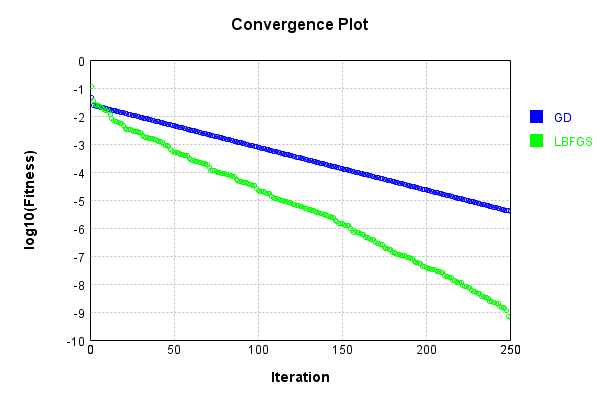
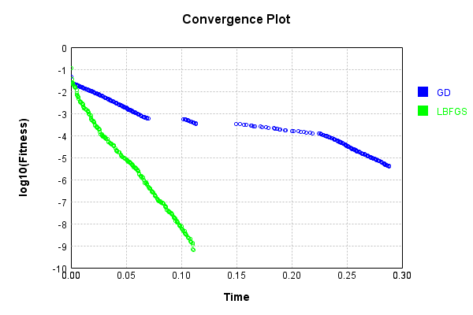
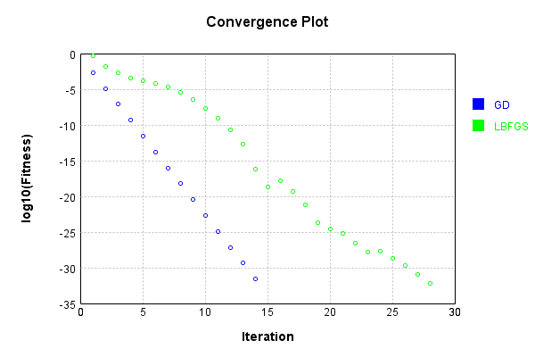
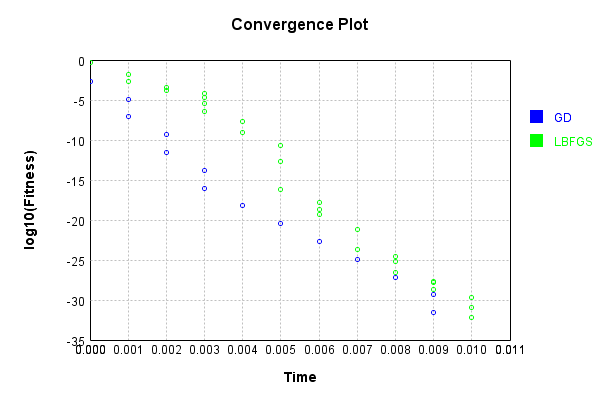
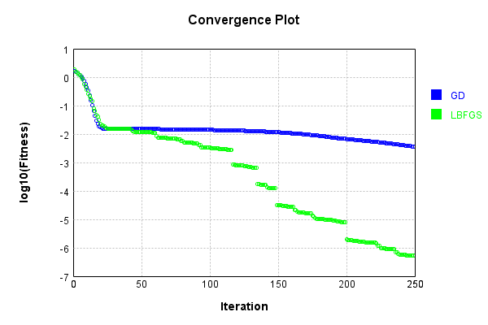
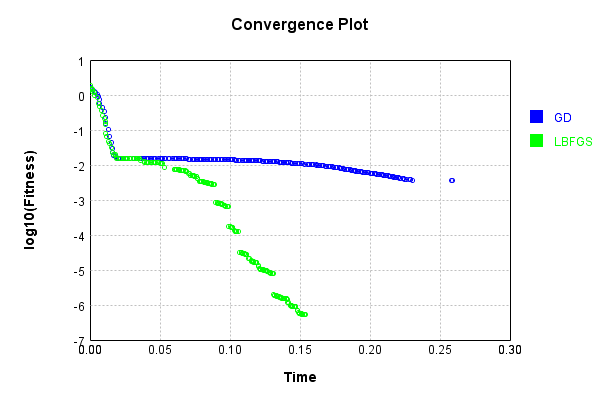

# ImgBandScaleLayer
## ImgBandScaleLayerTest
### Json Serialization
Code from [JsonTest.java:36](../../../../../../../src/main/java/com/simiacryptus/mindseye/test/unit/JsonTest.java#L36) executed in 0.00 seconds: 
```java
    JsonObject json = layer.getJson();
    NNLayer echo = NNLayer.fromJson(json);
    if ((echo == null)) throw new AssertionError("Failed to deserialize");
    if ((layer == echo)) throw new AssertionError("Serialization did not copy");
    if ((!layer.equals(echo))) throw new AssertionError("Serialization not equal");
    return new GsonBuilder().setPrettyPrinting().create().toJson(json);
```

Returns: 

```
    {
      "class": "com.simiacryptus.mindseye.layers.java.ImgBandScaleLayer",
      "id": "0b18a037-c3e3-4b91-9381-cb35f4775771",
      "isFrozen": false,
      "name": "ImgBandScaleLayer/0b18a037-c3e3-4b91-9381-cb35f4775771",
      "bias": [
        -1.224,
        -0.496,
        1.072
      ]
    }
```


### Example Input/Output Pair
Code from [ReferenceIO.java:68](../../../../../../../src/main/java/com/simiacryptus/mindseye/test/unit/ReferenceIO.java#L68) executed in 0.00 seconds: 
```java
    SimpleEval eval = SimpleEval.run(layer, inputPrototype);
    return String.format("--------------------\nInput: \n[%s]\n--------------------\nOutput: \n%s\n--------------------\nDerivative: \n%s",
      Arrays.stream(inputPrototype).map(t -> t.prettyPrint()).reduce((a, b) -> a + ",\n" + b).get(),
      eval.getOutput().prettyPrint(),
      Arrays.stream(eval.getDerivative()).map(t -> t.prettyPrint()).reduce((a, b) -> a + ",\n" + b).get());
```

Returns: 

```
    --------------------
    Input: 
    [[
    	[ [ -0.64, 0.884, -0.036 ], [ 0.484, -0.964, -1.532 ] ],
    	[ [ 1.288, 1.216, 1.72 ], [ -0.596, -1.276, 0.984 ] ]
    ]]
    --------------------
    Output: 
    [
    	[ [ 0.7833600000000001, -0.438464, -0.038592 ], [ -0.5924159999999999, 0.47814399999999996, -1.6423040000000002 ] ],
    	[ [ -1.576512, -0.603136, 1.8438400000000001 ], [ 0.7295039999999999, 0.632896, 1.054848 ] ]
    ]
    --------------------
    Derivative: 
    [
    	[ [ -1.224, -0.496, 1.072 ], [ -1.224, -0.496, 1.072 ] ],
    	[ [ -1.224, -0.496, 1.072 ], [ -1.224, -0.496, 1.072 ] ]
    ]
```


### Batch Execution
Code from [BatchingTester.java:66](../../../../../../../src/main/java/com/simiacryptus/mindseye/test/unit/BatchingTester.java#L66) executed in 0.00 seconds: 
```java
    return test(reference, inputPrototype);
```

Returns: 

```
    ToleranceStatistics{absoluteTol=0.0000e+00 +- 0.0000e+00 [0.0000e+00 - 0.0000e+00] (240#), relativeTol=0.0000e+00 +- 0.0000e+00 [0.0000e+00 - 0.0000e+00] (240#)}
```


Code from [SingleDerivativeTester.java:77](../../../../../../../src/main/java/com/simiacryptus/mindseye/test/unit/SingleDerivativeTester.java#L77) executed in 0.00 seconds: 
```java
    return test(component, inputPrototype);
```
Logging: 
```
    Inputs: [
    	[ [ 1.832, -1.404, 1.128 ], [ 0.288, -1.12, -1.408 ] ],
    	[ [ 1.512, -0.9, -0.14 ], [ 1.332, 0.756, -0.196 ] ]
    ]
    Inputs Statistics: {meanExponent=-0.10874839416806976, negative=6, min=-0.196, max=-0.196, mean=0.14000000000000004, count=12.0, positive=6, stdDev=1.1248834013650777, zeros=0}
    Output: [
    	[ [ -2.242368, 0.696384, 1.2092159999999998 ], [ -0.352512, 0.55552, -1.509376 ] ],
    	[ [ -1.8506879999999999, 0.4464, -0.15008000000000002 ], [ -1.630368, -0.374976, -0.21011200000000002 ] ]
    ]
    Outputs Statistics: {meanExponent=-0.1709291009492394, negative=8, min=-0.21011200000000002, max=-0.21011200000000002, mean=-0.4510800000000001, count=12.0, positive=4, stdDev=1.0698313830905006, zeros=0}
    Feedback for input 0
    Inputs Values: [
    	[ [ 1.832, -1.404, 1.128 ], [ 0.288, -1.12, -1.408 ] ],
    	[ [ 1.512, -0.9, -0.14 ], [ 1.332, 0.756, -0.196 ] ]
    ]
    Value Statistics: {meanExponent=-0.10874839416806976, negative=6, min=-0.196, max=-0.196, mean=0.14000000000000004, count=12.0, positive=6, stdDev=1.124883401
```
...[skipping 2832 bytes](etc/299.txt)...
```
    899, -1.1200000000000099, 0.7559999999995348, ... ], [ 0.0, 0.0, 0.0, 0.0, 0.0, 0.0, 0.0, 0.0, ... ] ]
    Measured Statistics: {meanExponent=-0.1087483941680631, negative=6, min=-0.196000000000085, max=-0.196000000000085, mean=0.046666666666697915, count=36.0, positive=6, stdDev=0.6527963779854817, zeros=24}
    Gradient Error: [ [ -6.104006189389111E-13, -9.303668946358812E-13, -4.50195436485501E-14, 5.548894677076532E-13, 0.0, 0.0, 0.0, 0.0, ... ], [ 0.0, 0.0, 0.0, 0.0, -4.050093593832571E-13, 2.1016521856154213E-13, -9.769962616701378E-15, -4.651834473179406E-13, ... ], [ 0.0, 0.0, 0.0, 0.0, 0.0, 0.0, 0.0, 0.0, ... ] ]
    Error Statistics: {meanExponent=-12.568677383393366, negative=8, min=-8.498757253505573E-14, max=-8.498757253505573E-14, mean=3.1249694190351976E-14, count=36.0, positive=4, stdDev=4.307314356572578E-13, zeros=24}
    Finite-Difference Derivative Accuracy:
    absoluteTol: 6.6614e-14 +- 2.5188e-13 [0.0000e+00 - 1.9602e-12] (180#)
    relativeTol: 2.7651e-13 +- 2.5263e-13 [4.3616e-15 - 9.4772e-13] (24#)
    
```

Returns: 

```
    ToleranceStatistics{absoluteTol=6.6614e-14 +- 2.5188e-13 [0.0000e+00 - 1.9602e-12] (180#), relativeTol=2.7651e-13 +- 2.5263e-13 [4.3616e-15 - 9.4772e-13] (24#)}
```


### Performance
Now we execute larger-scale runs to benchmark performance:

Code from [PerformanceTester.java:66](../../../../../../../src/main/java/com/simiacryptus/mindseye/test/unit/PerformanceTester.java#L66) executed in 0.01 seconds: 
```java
    test(component, inputPrototype);
```
Logging: 
```
    100 batches
    Input Dimensions:
    	[2, 2, 3]
    Performance:
    	Evaluation performance: 0.000400s +- 0.000040s [0.000337s - 0.000451s]
    	Learning performance: 0.000333s +- 0.000071s [0.000203s - 0.000406s]
    
```

### Input Learning
In this test, we use a network to learn this target input, given it's pre-evaluated output:

Code from [LearningTester.java:127](../../../../../../../src/main/java/com/simiacryptus/mindseye/test/unit/LearningTester.java#L127) executed in 0.00 seconds: 
```java
    return Arrays.stream(input_target).map(x -> x.prettyPrint()).reduce((a, b) -> a + "\n" + b).orElse("");
```

Returns: 

```
    [
    	[ [ 1.008, 1.86, -1.504 ], [ -0.636, 1.128, 1.468 ] ],
    	[ [ -1.912, 1.924, 1.824 ], [ -1.004, 0.872, 1.064 ] ]
    ]
```


First, we use a conjugate gradient descent method, which converges the fastest for purely linear functions.

Code from [LearningTester.java:300](../../../../../../../src/main/java/com/simiacryptus/mindseye/test/unit/LearningTester.java#L300) executed in 0.29 seconds: 
```java
    return new IterativeTrainer(trainable)
      .setLineSearchFactory(label -> new QuadraticSearch())
      .setOrientation(new GradientDescent())
      .setMonitor(monitor)
      .setTimeout(30, TimeUnit.SECONDS)
      .setMaxIterations(250)
      .setTerminateThreshold(0)
      .run();
```
Logging: 
```
    Constructing line search parameters: GD
    F(0.0) = LineSearchPoint{point=PointSample{avg=1.8471102452266666}, derivative=-1.3479068657004096}
    New Minimum: 1.8471102452266666 > 1.8471102450918757
    F(1.0E-10) = LineSearchPoint{point=PointSample{avg=1.8471102450918757}, derivative=-1.3479068656499735}, delta = -1.347908451521107E-10
    New Minimum: 1.8471102450918757 > 1.847110244283132
    F(7.000000000000001E-10) = LineSearchPoint{point=PointSample{avg=1.847110244283132}, derivative=-1.347906865347356}, delta = -9.435345837971454E-10
    New Minimum: 1.847110244283132 > 1.8471102386219227
    F(4.900000000000001E-9) = LineSearchPoint{point=PointSample{avg=1.8471102386219227}, derivative=-1.3479068632290345}, delta = -6.604743862936857E-9
    New Minimum: 1.8471102386219227 > 1.8471101989934617
    F(3.430000000000001E-8) = LineSearchPoint{point=PointSample{avg=1.8471101989934617}, derivative=-1.3479068484007826}, delta = -4.623320482011195E-8
    New Minimum: 1.8471101989934617 > 1.8471099215942426
    F(2.4010000000000004E-7) = Lin
```
...[skipping 281345 bytes](etc/300.txt)...
```
    4116943) = LineSearchPoint{point=PointSample{avg=3.982724590646856E-6}, derivative=-2.7178319190254498E-8}, delta = -9.420585106678011E-8
    F(17.72609368188186) = LineSearchPoint{point=PointSample{avg=4.483542636556064E-6}, derivative=9.310234404459597E-8}, delta = 4.066121948424281E-7
    F(1.363545667837066) = LineSearchPoint{point=PointSample{avg=4.019896207397766E-6}, derivative=-3.6430677900623494E-8}, delta = -5.7034234315869526E-8
    F(9.544819674859463) = LineSearchPoint{point=PointSample{avg=3.986783135603954E-6}, derivative=2.8335833071973653E-8}, delta = -9.014730610968194E-8
    3.986783135603954E-6 <= 4.076930441713636E-6
    New Minimum: 3.942381065184452E-6 > 3.936070940274358E-6
    F(5.965451092273023) = LineSearchPoint{point=PointSample{avg=3.936070940274358E-6}, derivative=1.3780829005133441E-21}, delta = -1.4085950143927822E-7
    Right bracket at 5.965451092273023
    Converged to right
    Iteration 250 complete. Error: 3.936070940274358E-6 Total: 249790856079493.1600; Orientation: 0.0000; Line Search: 0.0007
    
```

Returns: 

```
    3.936070940274358E-6
```


Training Converged

Next, we run the same optimization using L-BFGS, which is nearly ideal for purely second-order or quadratic functions.

Code from [LearningTester.java:324](../../../../../../../src/main/java/com/simiacryptus/mindseye/test/unit/LearningTester.java#L324) executed in 0.11 seconds: 
```java
    return new IterativeTrainer(trainable)
      .setLineSearchFactory(label -> new ArmijoWolfeSearch())
      .setOrientation(new LBFGS())
      .setMonitor(monitor)
      .setTimeout(30, TimeUnit.SECONDS)
      .setMaxIterations(250)
      .setTerminateThreshold(0)
      .run();
```
Logging: 
```
    LBFGS Accumulation History: 1 points
    Constructing line search parameters: GD
    th(0)=1.8471102452266666;dx=-1.3479068657004096
    New Minimum: 1.8471102452266666 > 0.11365415580855064
    END: th(2.154434690031884)=0.11365415580855064; dx=-0.26129121993983045 delta=1.733456089418116
    Iteration 1 complete. Error: 0.11365415580855064 Total: 249790860818969.1200; Orientation: 0.0001; Line Search: 0.0002
    LBFGS Accumulation History: 1 points
    th(0)=0.11365415580855064;dx=-0.05474062585471371
    New Minimum: 0.11365415580855064 > 0.0621446814467447
    WOLF (strong): th(4.641588833612779)=0.0621446814467447; dx=0.03254586616863718 delta=0.05150947436180594
    New Minimum: 0.0621446814467447 > 0.03725591779004564
    END: th(2.3207944168063896)=0.03725591779004564; dx=-0.011097379843038258 delta=0.076398238018505
    Iteration 2 complete. Error: 0.03725591779004564 Total: 249790861553643.1200; Orientation: 0.0000; Line Search: 0.0005
    LBFGS Accumulation History: 1 points
    th(0)=0.03725591779004564;dx=-0.004257675835335085
    New Minim
```
...[skipping 136306 bytes](etc/301.txt)...
```
    16072541)=6.682442534463944E-10; dx=-4.65986413123878E-12 delta=4.3766769288032473E-10
    Iteration 249 complete. Error: 6.682442534463944E-10 Total: 249790971360661.0300; Orientation: 0.0000; Line Search: 0.0002
    LBFGS Accumulation History: 1 points
    th(0)=6.682442534463944E-10;dx=-2.636719446258381E-11
    Armijo: th(158.261829718228)=1.0145013121229378E-7; dx=1.2999767203764335E-9 delta=-1.0078188695884739E-7
    Armijo: th(79.130914859114)=2.4820485883108973E-8; dx=6.368047629568859E-10 delta=-2.415224162966258E-8
    Armijo: th(26.376971619704666)=2.8881688300537675E-9; dx=1.9469012467718927E-10 delta=-2.219924576607373E-9
    Armijo: th(6.594242904926166)=6.765857757287089E-10; dx=2.889713532238014E-11 delta=-8.3415222823145E-12
    New Minimum: 6.682442534463944E-10 > 6.407584447361478E-10
    END: th(1.3188485809852333)=6.407584447361478E-10; dx=-1.5314328505359598E-11 delta=2.7485808710246675E-11
    Iteration 250 complete. Error: 6.407584447361478E-10 Total: 249790971976215.0300; Orientation: 0.0000; Line Search: 0.0005
    
```

Returns: 

```
    6.407584447361478E-10
```


Training Converged

Code from [LearningTester.java:96](../../../../../../../src/main/java/com/simiacryptus/mindseye/test/unit/LearningTester.java#L96) executed in 0.00 seconds: 
```java
    return TestUtil.compare(runs);
```

Returns: 




Code from [LearningTester.java:99](../../../../../../../src/main/java/com/simiacryptus/mindseye/test/unit/LearningTester.java#L99) executed in 0.00 seconds: 
```java
    return TestUtil.compareTime(runs);
```

Returns: 




### Model Learning
In this test, attempt to train a network to emulate a randomized network given an example input/output. The target state is:

Code from [LearningTester.java:176](../../../../../../../src/main/java/com/simiacryptus/mindseye/test/unit/LearningTester.java#L176) executed in 0.00 seconds: 
```java
    return network_target.state().stream().map(Arrays::toString).reduce((a, b) -> a + "\n" + b).orElse("");
```

Returns: 

```
    [0.932, 1.504, 0.14]
```


First, we use a conjugate gradient descent method, which converges the fastest for purely linear functions.

Code from [LearningTester.java:300](../../../../../../../src/main/java/com/simiacryptus/mindseye/test/unit/LearningTester.java#L300) executed in 0.01 seconds: 
```java
    return new IterativeTrainer(trainable)
      .setLineSearchFactory(label -> new QuadraticSearch())
      .setOrientation(new GradientDescent())
      .setMonitor(monitor)
      .setTimeout(30, TimeUnit.SECONDS)
      .setMaxIterations(250)
      .setTerminateThreshold(0)
      .run();
```
Logging: 
```
    Constructing line search parameters: GD
    F(0.0) = LineSearchPoint{point=PointSample{avg=0.36881881836799996}, derivative=-0.8365707735207355}
    New Minimum: 0.36881881836799996 > 0.368818818284343
    F(1.0E-10) = LineSearchPoint{point=PointSample{avg=0.368818818284343}, derivative=-0.8365707734252904}, delta = -8.365697024004248E-11
    New Minimum: 0.368818818284343 > 0.3688188177824005
    F(7.000000000000001E-10) = LineSearchPoint{point=PointSample{avg=0.3688188177824005}, derivative=-0.8365707728526203}, delta = -5.855994578141122E-10
    New Minimum: 0.3688188177824005 > 0.36881881426880314
    F(4.900000000000001E-9) = LineSearchPoint{point=PointSample{avg=0.36881881426880314}, derivative=-0.836570768843929}, delta = -4.099196815321449E-9
    New Minimum: 0.36881881426880314 > 0.36881878967362297
    F(3.430000000000001E-8) = LineSearchPoint{point=PointSample{avg=0.36881878967362297}, derivative=-0.8365707407830913}, delta = -2.8694376985605174E-8
    New Minimum: 0.36881878967362297 > 0.36881861750738487
    F(2.4010000000000004
```
...[skipping 17416 bytes](etc/302.txt)...
```
    delta = -1.3096323621833204E-30
    F(0.9552100609291831) = LineSearchPoint{point=PointSample{avg=4.1086505480261033E-32}, derivative=6.571635353227584E-31}, delta = -4.6037429390632486E-30
    4.1086505480261033E-32 <= 4.6448294445435094E-30
    F(0.897878675516744) = LineSearchPoint{point=PointSample{avg=4.724948130230019E-32}, derivative=4.012950763821332E-31}, delta = -4.5975799632412094E-30
    4.724948130230019E-32 > 4.1086505480261033E-32
    Iteration 14 complete. Error: 2.5679065925163147E-32 Total: 249791206681851.7800; Orientation: 0.0000; Line Search: 0.0008
    Zero gradient: 3.2908745075623495E-16
    F(0.0) = LineSearchPoint{point=PointSample{avg=4.724948130230019E-32}, derivative=-1.0829855024523737E-31}
    New Minimum: 4.724948130230019E-32 > 0.0
    F(0.9552100609291831) = LineSearchPoint{point=PointSample{avg=0.0}, derivative=0.0}, delta = -4.724948130230019E-32
    0.0 <= 4.724948130230019E-32
    Converged to right
    Iteration 15 complete. Error: 0.0 Total: 249791206953150.7800; Orientation: 0.0000; Line Search: 0.0002
    
```

Returns: 

```
    0.0
```


Training Converged

Next, we run the same optimization using L-BFGS, which is nearly ideal for purely second-order or quadratic functions.

Code from [LearningTester.java:324](../../../../../../../src/main/java/com/simiacryptus/mindseye/test/unit/LearningTester.java#L324) executed in 0.01 seconds: 
```java
    return new IterativeTrainer(trainable)
      .setLineSearchFactory(label -> new ArmijoWolfeSearch())
      .setOrientation(new LBFGS())
      .setMonitor(monitor)
      .setTimeout(30, TimeUnit.SECONDS)
      .setMaxIterations(250)
      .setTerminateThreshold(0)
      .run();
```
Logging: 
```
    LBFGS Accumulation History: 1 points
    Constructing line search parameters: GD
    th(0)=1.856021431616;dx=-5.068969615067315
    Armijo: th(2.154434690031884)=7.626578979322516; dx=10.425880710498214 delta=-5.770557547706516
    New Minimum: 1.856021431616 > 0.5684698231879811
    WOLF (strong): th(1.077217345015942)=0.5684698231879811; dx=2.6784555477154486 delta=1.2875516084280187
    New Minimum: 0.5684698231879811 > 0.4995419216330436
    END: th(0.3590724483386473)=0.4995419216330436; dx=-2.4864945608063937 delta=1.3564795099829563
    Iteration 1 complete. Error: 0.4995419216330436 Total: 249791212691760.7800; Orientation: 0.0001; Line Search: 0.0005
    LBFGS Accumulation History: 1 points
    th(0)=0.4995419216330436;dx=-1.272468443181006
    New Minimum: 0.4995419216330436 > 0.01394422178719659
    WOLF (strong): th(0.7735981389354633)=0.01394422178719659; dx=0.017042207243906718 delta=0.48559769984584705
    END: th(0.3867990694677316)=0.13204769179684875; dx=-0.6277131179685497 delta=0.36749422983619484
    Iteration 2 complete. Error: 
```
...[skipping 13221 bytes](etc/303.txt)...
```
    Orientation: 0.0000; Line Search: 0.0003
    LBFGS Accumulation History: 1 points
    th(0)=1.078520768856852E-31;dx=-2.2256765999004877E-31
    New Minimum: 1.078520768856852E-31 > 6.471124613141112E-32
    WOLF (strong): th(1.5853619060633264)=6.471124613141112E-32; dx=1.7263484640583638E-31 delta=4.3140830754274083E-32
    New Minimum: 6.471124613141112E-32 > 6.162975822039155E-33
    END: th(0.7926809530316632)=6.162975822039155E-33; dx=-4.993281358421239E-32 delta=1.0168910106364605E-31
    Iteration 28 complete. Error: 6.162975822039155E-33 Total: 249791222803363.7800; Orientation: 0.0000; Line Search: 0.0002
    LBFGS Accumulation History: 1 points
    th(0)=6.162975822039155E-33;dx=-1.1202372674211438E-32
    Armijo: th(1.7077793433389497)=7.190138459045681E-33; dx=1.2910146970000315E-32 delta=-1.0271626370065262E-33
    New Minimum: 6.162975822039155E-33 > 0.0
    END: th(0.8538896716694748)=0.0; dx=0.0 delta=6.162975822039155E-33
    Iteration 29 complete. Error: 0.0 Total: 249791223135648.7800; Orientation: 0.0000; Line Search: 0.0002
    
```

Returns: 

```
    0.0
```


Training Converged

Code from [LearningTester.java:96](../../../../../../../src/main/java/com/simiacryptus/mindseye/test/unit/LearningTester.java#L96) executed in 0.00 seconds: 
```java
    return TestUtil.compare(runs);
```

Returns: 




Code from [LearningTester.java:99](../../../../../../../src/main/java/com/simiacryptus/mindseye/test/unit/LearningTester.java#L99) executed in 0.00 seconds: 
```java
    return TestUtil.compareTime(runs);
```

Returns: 




### Composite Learning
In this test, attempt to train a network to emulate a randomized network given an example input/output. The target state is:

Code from [LearningTester.java:219](../../../../../../../src/main/java/com/simiacryptus/mindseye/test/unit/LearningTester.java#L219) executed in 0.00 seconds: 
```java
    return network_target.state().stream().map(Arrays::toString).reduce((a, b) -> a + "\n" + b).orElse("");
```

Returns: 

```
    [1.504, 0.14, 0.932]
```


We simultaneously regress this target input:

Code from [LearningTester.java:223](../../../../../../../src/main/java/com/simiacryptus/mindseye/test/unit/LearningTester.java#L223) executed in 0.00 seconds: 
```java
    return Arrays.stream(testInput).map(x -> x.prettyPrint()).reduce((a, b) -> a + "\n" + b).orElse("");
```

Returns: 

```
    [
    	[ [ 1.064, -0.636, 1.468 ], [ -1.004, -1.504, 0.872 ] ],
    	[ [ 1.924, 1.824, 1.86 ], [ 1.128, -1.912, 1.008 ] ]
    ]
```


Which produces the following output:

Code from [LearningTester.java:230](../../../../../../../src/main/java/com/simiacryptus/mindseye/test/unit/LearningTester.java#L230) executed in 0.00 seconds: 
```java
    return Stream.of(targetOutput).map(x -> x.prettyPrint()).reduce((a, b) -> a + "\n" + b).orElse("");
```

Returns: 

```
    [
    	[ [ 1.6002560000000001, -0.08904000000000001, 1.368176 ], [ -1.510016, -0.21056000000000002, 0.8127040000000001 ] ],
    	[ [ 2.893696, 0.25536000000000003, 1.7335200000000002 ], [ 1.6965119999999998, -0.26768000000000003, 0.9394560000000001 ] ]
    ]
```


First, we use a conjugate gradient descent method, which converges the fastest for purely linear functions.

Code from [LearningTester.java:300](../../../../../../../src/main/java/com/simiacryptus/mindseye/test/unit/LearningTester.java#L300) executed in 0.26 seconds: 
```java
    return new IterativeTrainer(trainable)
      .setLineSearchFactory(label -> new QuadraticSearch())
      .setOrientation(new GradientDescent())
      .setMonitor(monitor)
      .setTimeout(30, TimeUnit.SECONDS)
      .setMaxIterations(250)
      .setTerminateThreshold(0)
      .run();
```
Logging: 
```
    Constructing line search parameters: GD
    F(0.0) = LineSearchPoint{point=PointSample{avg=2.769960705898667}, derivative=-3.4683293402003335}
    New Minimum: 2.769960705898667 > 2.7699607055518336
    F(1.0E-10) = LineSearchPoint{point=PointSample{avg=2.7699607055518336}, derivative=-3.468329339596151}, delta = -3.4683322880368905E-10
    New Minimum: 2.7699607055518336 > 2.7699607034708364
    F(7.000000000000001E-10) = LineSearchPoint{point=PointSample{avg=2.7699607034708364}, derivative=-3.468329335971052}, delta = -2.427830381179774E-9
    New Minimum: 2.7699607034708364 > 2.769960688903853
    F(4.900000000000001E-9) = LineSearchPoint{point=PointSample{avg=2.769960688903853}, derivative=-3.4683293105953608}, delta = -1.699481400052605E-8
    New Minimum: 2.769960688903853 > 2.769960586934974
    F(3.430000000000001E-8) = LineSearchPoint{point=PointSample{avg=2.769960586934974}, derivative=-3.4683291329655246}, delta = -1.1896369267461182E-7
    New Minimum: 2.769960586934974 > 2.7699598731529664
    F(2.4010000000000004E-7) = LineSear
```
...[skipping 337141 bytes](etc/304.txt)...
```
    1646185783.3800; Orientation: 0.0001; Line Search: 0.0277
    F(0.0) = LineSearchPoint{point=PointSample{avg=0.0036452523804542405}, derivative=-4.272577410810371E-5}
    New Minimum: 0.0036452523804542405 > 0.003625246272810172
    F(0.5217629499039647) = LineSearchPoint{point=PointSample{avg=0.003625246272810172}, derivative=-3.396168461367563E-5}, delta = -2.0006107644068502E-5
    New Minimum: 0.003625246272810172 > 0.003601112604661468
    F(3.6523406493277526) = LineSearchPoint{point=PointSample{avg=0.003601112604661468}, derivative=1.8511998497176122E-5}, delta = -4.413977579277237E-5
    0.003601112604661468 <= 0.0036452523804542405
    New Minimum: 0.003601112604661468 > 0.0035908759077593207
    F(2.5482488162145867) = LineSearchPoint{point=PointSample{avg=0.0035908759077593207}, derivative=2.7264843415852717E-8}, delta = -5.437647269491974E-5
    Right bracket at 2.5482488162145867
    Converged to right
    Iteration 250 complete. Error: 0.0035908759077593207 Total: 249791646729807.3400; Orientation: 0.0000; Line Search: 0.0004
    
```

Returns: 

```
    0.0035908759077593207
```


This training run resulted in the following configuration:

Code from [LearningTester.java:245](../../../../../../../src/main/java/com/simiacryptus/mindseye/test/unit/LearningTester.java#L245) executed in 0.00 seconds: 
```java
    return network_gd.state().stream().map(Arrays::toString).reduce((a, b) -> a + "\n" + b).orElse("");
```

Returns: 

```
    [1.6002560000000001, 2.893696, -1.510016, 1.6965119999999998, -0.08904000000000001, 0.25536000000000003, -0.21056000000000002, -0.26768000000000003, 1.368176, 1.7335200000000002, 0.8127040000000001, 0.9394560000000001]
    [-1.1257260074543427, 0.17146579587755484, 1.0912798125775027]
```


And regressed input:

Code from [LearningTester.java:249](../../../../../../../src/main/java/com/simiacryptus/mindseye/test/unit/LearningTester.java#L249) executed in 0.00 seconds: 
```java
    return Arrays.stream(input_gd).map(x -> x.prettyPrint()).reduce((a, b) -> a + "\n" + b).orElse("");
```

Returns: 

```
    [
    	[ [ -1.4140384911194328, -0.008257162502686982, 1.2537352434113525 ], [ 1.3342994784623217, -1.542668640960725, 0.7447255669309941 ] ],
    	[ [ -2.5569643392046877, 1.5223672947065578, 1.5885201312977628 ], [ -1.499093437953684, -0.5174979226186857, 0.8608754259936263 ] ]
    ]
```


Which produces the following output:

Code from [LearningTester.java:256](../../../../../../../src/main/java/com/simiacryptus/mindseye/test/unit/LearningTester.java#L256) executed in 0.00 seconds: 
```java
    return Stream.of(regressedOutput).map(x -> x.prettyPrint()).reduce((a, b) -> a + "\n" + b).orElse("");
```

Returns: 

```
    [ 0.0035908759077593207 ]
```


Next, we run the same optimization using L-BFGS, which is nearly ideal for purely second-order or quadratic functions.

Code from [LearningTester.java:324](../../../../../../../src/main/java/com/simiacryptus/mindseye/test/unit/LearningTester.java#L324) executed in 0.19 seconds: 
```java
    return new IterativeTrainer(trainable)
      .setLineSearchFactory(label -> new ArmijoWolfeSearch())
      .setOrientation(new LBFGS())
      .setMonitor(monitor)
      .setTimeout(30, TimeUnit.SECONDS)
      .setMaxIterations(250)
      .setTerminateThreshold(0)
      .run();
```
Logging: 
```
    LBFGS Accumulation History: 1 points
    Constructing line search parameters: GD
    th(0)=2.769960705898667;dx=-3.4683293402003335
    Armijo: th(2.154434690031884)=4.7001279217989635; dx=3.8073364506921115 delta=-1.9301672159002967
    New Minimum: 2.769960705898667 > 1.8687651044342977
    WOLF (strong): th(1.077217345015942)=1.8687651044342977; dx=1.2591046118262974 delta=0.9011956014643692
    END: th(0.3590724483386473)=1.8869426648355503; dx=-1.5223603066421951 delta=0.8830180410631165
    Iteration 1 complete. Error: 1.8687651044342977 Total: 249791696166148.3400; Orientation: 0.0002; Line Search: 0.0029
    LBFGS Accumulation History: 1 points
    th(0)=1.8869426648355503;dx=-0.7399710607846348
    New Minimum: 1.8869426648355503 > 1.5428450472078667
    END: th(0.7735981389354633)=1.5428450472078667; dx=-0.17349592306959438 delta=0.34409761762768354
    Iteration 2 complete. Error: 1.5428450472078667 Total: 249791697271579.3000; Orientation: 0.0001; Line Search: 0.0007
    LBFGS Accumulation History: 1 points
    th(0)=1.5428450472078667;dx
```
...[skipping 139590 bytes](etc/305.txt)...
```
    04
    LBFGS Accumulation History: 1 points
    th(0)=5.284381215610382E-7;dx=-6.511689267757011E-9
    New Minimum: 5.284381215610382E-7 > 5.232334793373925E-7
    END: th(1.1873469729627335)=5.232334793373925E-7; dx=-2.255166834977172E-9 delta=5.20464222364568E-9
    Iteration 249 complete. Error: 5.232334793373925E-7 Total: 249791849687712.1600; Orientation: 0.0000; Line Search: 0.0002
    LBFGS Accumulation History: 1 points
    th(0)=5.232334793373925E-7;dx=-1.0513519538346103E-8
    Armijo: th(2.558061507655262)=5.411856003868935E-7; dx=2.454970216677434E-8 delta=-1.7952121049500966E-8
    New Minimum: 5.232334793373925E-7 > 5.20997805140343E-7
    WOLF (strong): th(1.279030753827631)=5.20997805140343E-7; dx=7.017746405418E-9 delta=2.235674197049486E-9
    New Minimum: 5.20997805140343E-7 > 5.199968124629034E-7
    END: th(0.42634358460921035)=5.199968124629034E-7; dx=-4.669840869596192E-9 delta=3.236666874489147E-9
    Iteration 250 complete. Error: 5.199968124629034E-7 Total: 249791850198678.1600; Orientation: 0.0000; Line Search: 0.0004
    
```

Returns: 

```
    5.199968124629034E-7
```


Training Converged

Code from [LearningTester.java:96](../../../../../../../src/main/java/com/simiacryptus/mindseye/test/unit/LearningTester.java#L96) executed in 0.00 seconds: 
```java
    return TestUtil.compare(runs);
```

Returns: 




Code from [LearningTester.java:99](../../../../../../../src/main/java/com/simiacryptus/mindseye/test/unit/LearningTester.java#L99) executed in 0.00 seconds: 
```java
    return TestUtil.compareTime(runs);
```

Returns: 




