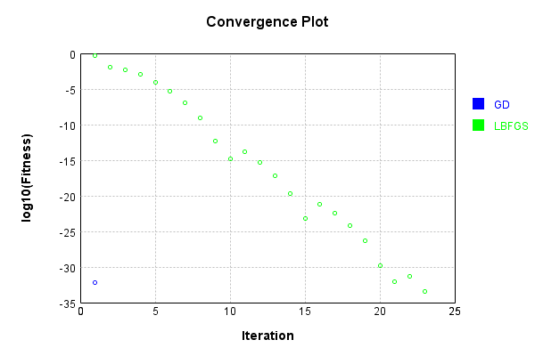
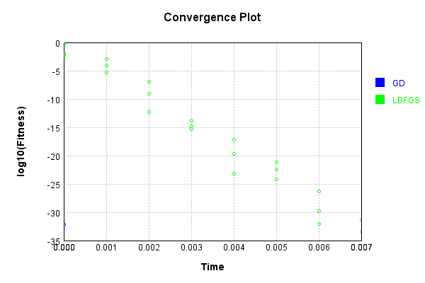

# ImgBandSelectLayer
## ImgBandSelectLayerTest
### Json Serialization
Code from [JsonTest.java:36](../../../../../../../src/main/java/com/simiacryptus/mindseye/test/unit/JsonTest.java#L36) executed in 0.00 seconds: 
```java
    JsonObject json = layer.getJson();
    NNLayer echo = NNLayer.fromJson(json);
    if ((echo == null)) throw new AssertionError("Failed to deserialize");
    if ((layer == echo)) throw new AssertionError("Serialization did not copy");
    if ((!layer.equals(echo))) throw new AssertionError("Serialization not equal");
    return new GsonBuilder().setPrettyPrinting().create().toJson(json);
```

Returns: 

```
    {
      "class": "com.simiacryptus.mindseye.layers.java.ImgBandSelectLayer",
      "id": "609531e1-40d4-4de9-a47c-a82273f14c2c",
      "isFrozen": false,
      "name": "ImgBandSelectLayer/609531e1-40d4-4de9-a47c-a82273f14c2c",
      "bands": [
        0,
        2
      ]
    }
```


### Example Input/Output Pair
Code from [ReferenceIO.java:68](../../../../../../../src/main/java/com/simiacryptus/mindseye/test/unit/ReferenceIO.java#L68) executed in 0.00 seconds: 
```java
    SimpleEval eval = SimpleEval.run(layer, inputPrototype);
    return String.format("--------------------\nInput: \n[%s]\n--------------------\nOutput: \n%s\n--------------------\nDerivative: \n%s",
      Arrays.stream(inputPrototype).map(t -> t.prettyPrint()).reduce((a, b) -> a + ",\n" + b).get(),
      eval.getOutput().prettyPrint(),
      Arrays.stream(eval.getDerivative()).map(t -> t.prettyPrint()).reduce((a, b) -> a + ",\n" + b).get());
```

Returns: 

```
    --------------------
    Input: 
    [[
    	[ [ 1.948, 0.16, -0.72 ], [ -0.696, -0.844, -0.916 ] ],
    	[ [ 1.024, -0.084, 1.476 ], [ -0.664, 0.632, -1.164 ] ]
    ]]
    --------------------
    Output: 
    [
    	[ [ 1.948, -0.72 ], [ -0.696, -0.916 ] ],
    	[ [ 1.024, 1.476 ], [ -0.664, -1.164 ] ]
    ]
    --------------------
    Derivative: 
    [
    	[ [ 1.0, 0.0, 1.0 ], [ 1.0, 0.0, 1.0 ] ],
    	[ [ 1.0, 0.0, 1.0 ], [ 1.0, 0.0, 1.0 ] ]
    ]
```


### Batch Execution
Code from [BatchingTester.java:66](../../../../../../../src/main/java/com/simiacryptus/mindseye/test/unit/BatchingTester.java#L66) executed in 0.00 seconds: 
```java
    return test(reference, inputPrototype);
```

Returns: 

```
    ToleranceStatistics{absoluteTol=0.0000e+00 +- 0.0000e+00 [0.0000e+00 - 0.0000e+00] (200#), relativeTol=0.0000e+00 +- 0.0000e+00 [0.0000e+00 - 0.0000e+00] (160#)}
```


Code from [SingleDerivativeTester.java:77](../../../../../../../src/main/java/com/simiacryptus/mindseye/test/unit/SingleDerivativeTester.java#L77) executed in 0.00 seconds: 
```java
    return test(component, inputPrototype);
```
Logging: 
```
    Inputs: [
    	[ [ -1.544, 0.376, -0.132 ], [ 1.54, 0.396, -1.408 ] ],
    	[ [ 0.408, 0.292, 0.848 ], [ 0.552, -0.672, 1.42 ] ]
    ]
    Inputs Statistics: {meanExponent=-0.20464473369480088, negative=4, min=1.42, max=1.42, mean=0.17299999999999996, count=12.0, positive=8, stdDev=0.9326480222105945, zeros=0}
    Output: [
    	[ [ -1.544, -0.132 ], [ 1.54, -1.408 ] ],
    	[ [ 0.408, 0.848 ], [ 0.552, 1.42 ] ]
    ]
    Outputs Statistics: {meanExponent=-0.11517149496162837, negative=3, min=1.42, max=1.42, mean=0.2105, count=8.0, positive=5, stdDev=1.0958794413620505, zeros=0}
    Feedback for input 0
    Inputs Values: [
    	[ [ -1.544, 0.376, -0.132 ], [ 1.54, 0.396, -1.408 ] ],
    	[ [ 0.408, 0.292, 0.848 ], [ 0.552, -0.672, 1.42 ] ]
    ]
    Value Statistics: {meanExponent=-0.20464473369480088, negative=4, min=1.42, max=1.42, mean=0.17299999999999996, count=12.0, positive=8, stdDev=0.9326480222105945, zeros=0}
    Implemented Feedback: [ [ 1.0, 0.0, 0.0, 0.0, 0.0, 0.0, 0.0, 0.0 ], [ 0.0, 1.0, 0.0, 0.0, 0.0, 0.0, 0.0, 0.0 ], [ 0.0, 0.0, 1.0, 0.0, 0.0, 0.0, 
```
...[skipping 880 bytes](etc/306.txt)...
```
    30642341045674E-14, negative=0, min=0.9999999999998899, max=0.9999999999998899, mean=0.08333333333332416, count=96.0, positive=8, stdDev=0.2763853991962529, zeros=88}
    Feedback Error: [ [ -1.1013412404281553E-13, 0.0, 0.0, 0.0, 0.0, 0.0, 0.0, 0.0 ], [ 0.0, -1.1013412404281553E-13, 0.0, 0.0, 0.0, 0.0, 0.0, 0.0 ], [ 0.0, 0.0, -1.1013412404281553E-13, 0.0, 0.0, 0.0, 0.0, 0.0 ], [ 0.0, 0.0, 0.0, -1.1013412404281553E-13, 0.0, 0.0, 0.0, 0.0 ], [ 0.0, 0.0, 0.0, 0.0, 0.0, 0.0, 0.0, 0.0 ], [ 0.0, 0.0, 0.0, 0.0, 0.0, 0.0, 0.0, 0.0 ], [ 0.0, 0.0, 0.0, 0.0, 0.0, 0.0, 0.0, 0.0 ], [ 0.0, 0.0, 0.0, 0.0, 0.0, 0.0, 0.0, 0.0 ], ... ]
    Error Statistics: {meanExponent=-12.958078098036824, negative=8, min=-1.1013412404281553E-13, max=-1.1013412404281553E-13, mean=-9.177843670234628E-15, count=96.0, positive=0, stdDev=3.0439463838706555E-14, zeros=88}
    Finite-Difference Derivative Accuracy:
    absoluteTol: 9.1778e-15 +- 3.0439e-14 [0.0000e+00 - 1.1013e-13] (96#)
    relativeTol: 5.5067e-14 +- 0.0000e+00 [5.5067e-14 - 5.5067e-14] (8#)
    
```

Returns: 

```
    ToleranceStatistics{absoluteTol=9.1778e-15 +- 3.0439e-14 [0.0000e+00 - 1.1013e-13] (96#), relativeTol=5.5067e-14 +- 0.0000e+00 [5.5067e-14 - 5.5067e-14] (8#)}
```


### Performance
Now we execute larger-scale runs to benchmark performance:

Code from [PerformanceTester.java:66](../../../../../../../src/main/java/com/simiacryptus/mindseye/test/unit/PerformanceTester.java#L66) executed in 0.00 seconds: 
```java
    test(component, inputPrototype);
```
Logging: 
```
    100 batches
    Input Dimensions:
    	[2, 2, 3]
    Performance:
    	Evaluation performance: 0.000199s +- 0.000009s [0.000182s - 0.000207s]
    	Learning performance: 0.000050s +- 0.000008s [0.000041s - 0.000064s]
    
```

### Input Learning
In this test, we use a network to learn this target input, given it's pre-evaluated output:

Code from [LearningTester.java:127](../../../../../../../src/main/java/com/simiacryptus/mindseye/test/unit/LearningTester.java#L127) executed in 0.00 seconds: 
```java
    return Arrays.stream(input_target).map(x -> x.prettyPrint()).reduce((a, b) -> a + "\n" + b).orElse("");
```

Returns: 

```
    [
    	[ [ -0.728, -0.472, -1.06 ], [ -1.664, -1.776, -1.728 ] ],
    	[ [ -1.204, 0.14, 0.28 ], [ -1.764, 0.752, 1.964 ] ]
    ]
```


First, we use a conjugate gradient descent method, which converges the fastest for purely linear functions.

Code from [LearningTester.java:300](../../../../../../../src/main/java/com/simiacryptus/mindseye/test/unit/LearningTester.java#L300) executed in 0.00 seconds: 
```java
    return new IterativeTrainer(trainable)
      .setLineSearchFactory(label -> new QuadraticSearch())
      .setOrientation(new GradientDescent())
      .setMonitor(monitor)
      .setTimeout(30, TimeUnit.SECONDS)
      .setMaxIterations(250)
      .setTerminateThreshold(0)
      .run();
```
Logging: 
```
    Constructing line search parameters: GD
    F(0.0) = LineSearchPoint{point=PointSample{avg=2.199546}, derivative=-1.099773}
    New Minimum: 2.199546 > 2.1995459998900224
    F(1.0E-10) = LineSearchPoint{point=PointSample{avg=2.1995459998900224}, derivative=-1.0997729999725057}, delta = -1.0997736055173846E-10
    New Minimum: 2.1995459998900224 > 2.1995459992301587
    F(7.000000000000001E-10) = LineSearchPoint{point=PointSample{avg=2.1995459992301587}, derivative=-1.0997729998075396}, delta = -7.698410797729593E-10
    New Minimum: 2.1995459992301587 > 2.199545994611112
    F(4.900000000000001E-9) = LineSearchPoint{point=PointSample{avg=2.199545994611112}, derivative=-1.099772998652778}, delta = -5.3888875584107154E-9
    New Minimum: 2.199545994611112 > 2.199545962277786
    F(3.430000000000001E-8) = LineSearchPoint{point=PointSample{avg=2.199545962277786}, derivative=-1.0997729905694464}, delta = -3.772221379705343E-8
    New Minimum: 2.199545962277786 > 2.1995457359445103
    F(2.4010000000000004E-7) = LineSearchPoint{point=PointSample{
```
...[skipping 1479 bytes](etc/307.txt)...
```
     delta = -0.2120861618828549
    New Minimum: 1.9874598381171449 > 0.9406884370833372
    F(1.3841287201) = LineSearchPoint{point=PointSample{avg=0.9406884370833372}, derivative=-0.7192161512773656}, delta = -1.2588575629166625
    Loops = 12
    New Minimum: 0.9406884370833372 > 6.162975822039155E-33
    F(4.0) = LineSearchPoint{point=PointSample{avg=6.162975822039155E-33}, derivative=4.39648317751562E-17}, delta = -2.199546
    Right bracket at 4.0
    Converged to right
    Iteration 1 complete. Error: 6.162975822039155E-33 Total: 249791988923878.0000; Orientation: 0.0000; Line Search: 0.0015
    Zero gradient: 5.551115123125783E-17
    F(0.0) = LineSearchPoint{point=PointSample{avg=6.162975822039155E-33}, derivative=-3.0814879110195774E-33}
    New Minimum: 6.162975822039155E-33 > 0.0
    F(4.0) = LineSearchPoint{point=PointSample{avg=0.0}, derivative=0.0}, delta = -6.162975822039155E-33
    0.0 <= 6.162975822039155E-33
    Converged to right
    Iteration 2 complete. Error: 0.0 Total: 249791989151576.0000; Orientation: 0.0000; Line Search: 0.0001
    
```

Returns: 

```
    0.0
```


Training Converged

Next, we run the same optimization using L-BFGS, which is nearly ideal for purely second-order or quadratic functions.

Code from [LearningTester.java:324](../../../../../../../src/main/java/com/simiacryptus/mindseye/test/unit/LearningTester.java#L324) executed in 0.01 seconds: 
```java
    return new IterativeTrainer(trainable)
      .setLineSearchFactory(label -> new ArmijoWolfeSearch())
      .setOrientation(new LBFGS())
      .setMonitor(monitor)
      .setTimeout(30, TimeUnit.SECONDS)
      .setMaxIterations(250)
      .setTerminateThreshold(0)
      .run();
```
Logging: 
```
    LBFGS Accumulation History: 1 points
    Constructing line search parameters: GD
    th(0)=2.199546;dx=-1.099773
    New Minimum: 2.199546 > 0.4682436571781683
    END: th(2.154434690031884)=0.4682436571781683; dx=-0.5074257244098912 delta=1.7313023428218315
    Iteration 1 complete. Error: 0.4682436571781683 Total: 249791992167503.0000; Orientation: 0.0000; Line Search: 0.0002
    LBFGS Accumulation History: 1 points
    th(0)=0.4682436571781683;dx=-0.23412182858908415
    New Minimum: 0.4682436571781683 > 0.012046628401596895
    WOLF (strong): th(4.641588833612779)=0.012046628401596895; dx=0.03755248773194035 delta=0.4561970287765714
    END: th(2.3207944168063896)=0.08252008366300094; dx=-0.09828467042857189 delta=0.38572357351516734
    Iteration 2 complete. Error: 0.012046628401596895 Total: 249791992502352.0000; Orientation: 0.0000; Line Search: 0.0002
    LBFGS Accumulation History: 1 points
    th(0)=0.08252008366300094;dx=-0.04126004183150047
    New Minimum: 0.08252008366300094 > 0.005157505228937558
    WOLF (strong): th(5.000000000000001)=0
```
...[skipping 10398 bytes](etc/308.txt)...
```
    9136649.0000; Orientation: 0.0000; Line Search: 0.0002
    LBFGS Accumulation History: 1 points
    th(0)=4.3140830754274083E-32;dx=-2.1570415377137042E-32
    New Minimum: 4.3140830754274083E-32 > 1.7333369499485123E-32
    WOLF (strong): th(6.557872678421563)=1.7333369499485123E-32; dx=1.3096323621833204E-32 delta=2.580746125478896E-32
    New Minimum: 1.7333369499485123E-32 > 3.8518598887744717E-34
    END: th(3.2789363392107815)=3.8518598887744717E-34; dx=-7.703719777548943E-34 delta=4.2755644765396636E-32
    Iteration 23 complete. Error: 3.8518598887744717E-34 Total: 249791999474918.0000; Orientation: 0.0000; Line Search: 0.0003
    LBFGS Accumulation History: 1 points
    th(0)=3.8518598887744717E-34;dx=-1.9259299443872359E-34
    Armijo: th(7.06425419560186)=3.8518598887744717E-34; dx=1.9259299443872359E-34 delta=0.0
    New Minimum: 3.8518598887744717E-34 > 0.0
    END: th(3.53212709780093)=0.0; dx=0.0 delta=3.8518598887744717E-34
    Iteration 24 complete. Error: 0.0 Total: 249791999804068.0000; Orientation: 0.0000; Line Search: 0.0003
    
```

Returns: 

```
    0.0
```


Training Converged

Code from [LearningTester.java:96](../../../../../../../src/main/java/com/simiacryptus/mindseye/test/unit/LearningTester.java#L96) executed in 0.00 seconds: 
```java
    return TestUtil.compare(runs);
```

Returns: 




Code from [LearningTester.java:99](../../../../../../../src/main/java/com/simiacryptus/mindseye/test/unit/LearningTester.java#L99) executed in 0.00 seconds: 
```java
    return TestUtil.compareTime(runs);
```

Returns: 




