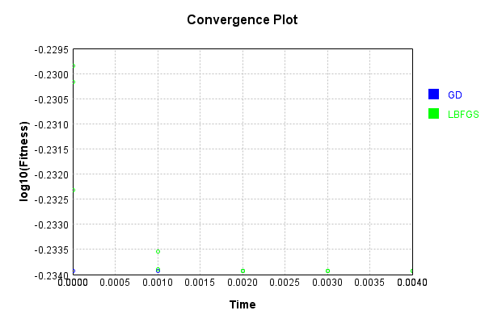

# ImgConcatLayer
## ImgConcatLayerTest
### Json Serialization
Code from [JsonTest.java:36](../../../../../../../src/main/java/com/simiacryptus/mindseye/test/unit/JsonTest.java#L36) executed in 0.00 seconds: 
```java
    JsonObject json = layer.getJson();
    NNLayer echo = NNLayer.fromJson(json);
    if ((echo == null)) throw new AssertionError("Failed to deserialize");
    if ((layer == echo)) throw new AssertionError("Serialization did not copy");
    if ((!layer.equals(echo))) throw new AssertionError("Serialization not equal");
    return new GsonBuilder().setPrettyPrinting().create().toJson(json);
```

Returns: 

```
    {
      "class": "com.simiacryptus.mindseye.layers.java.ImgConcatLayer",
      "id": "6d53e32c-c716-4133-847e-ea93305d4c2b",
      "isFrozen": false,
      "name": "ImgConcatLayer/6d53e32c-c716-4133-847e-ea93305d4c2b"
    }
```


### Example Input/Output Pair
Code from [ReferenceIO.java:68](../../../../../../../src/main/java/com/simiacryptus/mindseye/test/unit/ReferenceIO.java#L68) executed in 0.00 seconds: 
```java
    SimpleEval eval = SimpleEval.run(layer, inputPrototype);
    return String.format("--------------------\nInput: \n[%s]\n--------------------\nOutput: \n%s\n--------------------\nDerivative: \n%s",
      Arrays.stream(inputPrototype).map(t -> t.prettyPrint()).reduce((a, b) -> a + ",\n" + b).get(),
      eval.getOutput().prettyPrint(),
      Arrays.stream(eval.getDerivative()).map(t -> t.prettyPrint()).reduce((a, b) -> a + ",\n" + b).get());
```

Returns: 

```
    --------------------
    Input: 
    [[
    	[ [ -0.712 ], [ 1.188 ] ],
    	[ [ 0.696 ], [ -0.296 ] ]
    ],
    [
    	[ [ -0.592 ], [ 0.956 ] ],
    	[ [ 0.508 ], [ -1.176 ] ]
    ]]
    --------------------
    Output: 
    [
    	[ [ -0.712, -0.592 ], [ 1.188, 0.956 ] ],
    	[ [ 0.696, 0.508 ], [ -0.296, -1.176 ] ]
    ]
    --------------------
    Derivative: 
    [
    	[ [ 1.0 ], [ 1.0 ] ],
    	[ [ 1.0 ], [ 1.0 ] ]
    ],
    [
    	[ [ 1.0 ], [ 1.0 ] ],
    	[ [ 1.0 ], [ 1.0 ] ]
    ]
```


### Batch Execution
Code from [BatchingTester.java:66](../../../../../../../src/main/java/com/simiacryptus/mindseye/test/unit/BatchingTester.java#L66) executed in 0.00 seconds: 
```java
    return test(reference, inputPrototype);
```

Returns: 

```
    ToleranceStatistics{absoluteTol=0.0000e+00 +- 0.0000e+00 [0.0000e+00 - 0.0000e+00] (160#), relativeTol=0.0000e+00 +- 0.0000e+00 [0.0000e+00 - 0.0000e+00] (160#)}
```


Code from [SingleDerivativeTester.java:77](../../../../../../../src/main/java/com/simiacryptus/mindseye/test/unit/SingleDerivativeTester.java#L77) executed in 0.00 seconds: 
```java
    return test(component, inputPrototype);
```
Logging: 
```
    Inputs: [
    	[ [ 0.784 ], [ -0.712 ] ],
    	[ [ 1.596 ], [ -1.84 ] ]
    ],
    [
    	[ [ -0.128 ], [ -0.032 ] ],
    	[ [ 1.736 ], [ 1.296 ] ]
    ]
    Inputs Statistics: {meanExponent=0.05366169158638548, negative=2, min=-1.84, max=-1.84, mean=-0.04300000000000004, count=4.0, positive=2, stdDev=1.3273111918461322, zeros=0},
    {meanExponent=-0.5088713324142945, negative=2, min=1.296, max=1.296, mean=0.718, count=4.0, positive=2, stdDev=0.813729684846264, zeros=0}
    Output: [
    	[ [ 0.784, -0.128 ], [ -0.712, -0.032 ] ],
    	[ [ 1.596, 1.736 ], [ -1.84, 1.296 ] ]
    ]
    Outputs Statistics: {meanExponent=-0.22760482041395452, negative=4, min=1.296, max=1.296, mean=0.3375, count=8.0, positive=4, stdDev=1.1647900025326452, zeros=0}
    Feedback for input 0
    Inputs Values: [
    	[ [ 0.784 ], [ -0.712 ] ],
    	[ [ 1.596 ], [ -1.84 ] ]
    ]
    Value Statistics: {meanExponent=0.05366169158638548, negative=2, min=-1.84, max=-1.84, mean=-0.04300000000000004, count=4.0, positive=2, stdDev=1.3273111918461322, zeros=0}
    Implemented Feedback: [ [ 1.0, 0.0, 0.0, 0.0, 0.0, 0
```
...[skipping 1911 bytes](etc/309.txt)...
```
    999998899, 0.0, 0.0 ], [ 0.0, 0.0, 0.0, 0.0, 0.0, 0.0, 1.0000000000000286, 0.0 ], [ 0.0, 0.0, 0.0, 0.0, 0.0, 0.0, 0.0, 0.9999999999998899 ] ]
    Measured Statistics: {meanExponent=-3.276302567614995E-14, negative=0, min=0.9999999999998899, max=0.9999999999998899, mean=0.12499999999999056, count=32.0, positive=4, stdDev=0.33071891388304886, zeros=28}
    Feedback Error: [ [ 0.0, 0.0, 0.0, 0.0, -1.1013412404281553E-13, 0.0, 0.0, 0.0 ], [ 0.0, 0.0, 0.0, 0.0, 0.0, -1.1013412404281553E-13, 0.0, 0.0 ], [ 0.0, 0.0, 0.0, 0.0, 0.0, 0.0, 2.864375403532904E-14, 0.0 ], [ 0.0, 0.0, 0.0, 0.0, 0.0, 0.0, 0.0, -1.1013412404281553E-13 ] ]
    Error Statistics: {meanExponent=-13.104301089584563, negative=3, min=-1.1013412404281553E-13, max=-1.1013412404281553E-13, mean=-9.429956815409923E-15, count=32.0, positive=1, stdDev=3.2769779210413227E-14, zeros=28}
    Finite-Difference Derivative Accuracy:
    absoluteTol: 1.2493e-14 +- 3.4401e-14 [0.0000e+00 - 1.1013e-13] (64#)
    relativeTol: 4.9974e-14 +- 1.3475e-14 [1.4322e-14 - 5.5067e-14] (8#)
    
```

Returns: 

```
    ToleranceStatistics{absoluteTol=1.2493e-14 +- 3.4401e-14 [0.0000e+00 - 1.1013e-13] (64#), relativeTol=4.9974e-14 +- 1.3475e-14 [1.4322e-14 - 5.5067e-14] (8#)}
```


### Performance
Now we execute larger-scale runs to benchmark performance:

Code from [PerformanceTester.java:66](../../../../../../../src/main/java/com/simiacryptus/mindseye/test/unit/PerformanceTester.java#L66) executed in 0.00 seconds: 
```java
    test(component, inputPrototype);
```
Logging: 
```
    100 batches
    Input Dimensions:
    	[2, 2, 1]
    	[2, 2, 1]
    Performance:
    	Evaluation performance: 0.000122s +- 0.000016s [0.000101s - 0.000146s]
    	Learning performance: 0.000191s +- 0.000007s [0.000183s - 0.000202s]
    
```

### Input Learning
In this test, we use a network to learn this target input, given it's pre-evaluated output:

Code from [LearningTester.java:127](../../../../../../../src/main/java/com/simiacryptus/mindseye/test/unit/LearningTester.java#L127) executed in 0.00 seconds: 
```java
    return Arrays.stream(input_target).map(x -> x.prettyPrint()).reduce((a, b) -> a + "\n" + b).orElse("");
```

Returns: 

```
    [
    	[ [ -0.872 ], [ 1.348 ] ],
    	[ [ -0.444 ], [ -0.912 ] ]
    ]
    [
    	[ [ 1.48 ], [ 0.036 ] ],
    	[ [ -1.676 ], [ -0.16 ] ]
    ]
```


First, we use a conjugate gradient descent method, which converges the fastest for purely linear functions.

Code from [LearningTester.java:300](../../../../../../../src/main/java/com/simiacryptus/mindseye/test/unit/LearningTester.java#L300) executed in 0.00 seconds: 
```java
    return new IterativeTrainer(trainable)
      .setLineSearchFactory(label -> new QuadraticSearch())
      .setOrientation(new GradientDescent())
      .setMonitor(monitor)
      .setTimeout(30, TimeUnit.SECONDS)
      .setMaxIterations(250)
      .setTerminateThreshold(0)
      .run();
```
Logging: 
```
    Constructing line search parameters: GD
    F(0.0) = LineSearchPoint{point=PointSample{avg=1.5101760000000002}, derivative=-0.9266400000000001}
    New Minimum: 1.5101760000000002 > 1.5101759999073363
    F(1.0E-10) = LineSearchPoint{point=PointSample{avg=1.5101759999073363}, derivative=-0.926639999953668}, delta = -9.266387657191899E-11
    New Minimum: 1.5101759999073363 > 1.510175999351352
    F(7.000000000000001E-10) = LineSearchPoint{point=PointSample{avg=1.510175999351352}, derivative=-0.926639999675676}, delta = -6.486482462264576E-10
    New Minimum: 1.510175999351352 > 1.5101759954594642
    F(4.900000000000001E-9) = LineSearchPoint{point=PointSample{avg=1.5101759954594642}, derivative=-0.926639997729732}, delta = -4.5405359472283635E-9
    New Minimum: 1.5101759954594642 > 1.5101759682162483
    F(3.430000000000001E-8) = LineSearchPoint{point=PointSample{avg=1.5101759682162483}, derivative=-0.926639984108124}, delta = -3.178375185264315E-8
    New Minimum: 1.5101759682162483 > 1.5101757775137492
    F(2.4010000000000004E-7) = LineS
```
...[skipping 3210 bytes](etc/310.txt)...
```
    rivative=-3.0814879110195774E-33}, delta = -2.220446049250313E-16
    Left bracket at 1.0000000000000002
    F(1.3333333333333335) = LineSearchPoint{point=PointSample{avg=0.5835359999999999}, derivative=-3.0814879110195774E-33}, delta = -2.220446049250313E-16
    Left bracket at 1.3333333333333335
    F(1.5555555555555558) = LineSearchPoint{point=PointSample{avg=0.5835360000000002}, derivative=0.0}, delta = 0.0
    Right bracket at 1.5555555555555558
    Converged to right
    Iteration 3 complete. Error: 0.5835359999999999 Total: 249792127460992.8800; Orientation: 0.0000; Line Search: 0.0007
    Zero gradient: 7.850462293418876E-17
    F(0.0) = LineSearchPoint{point=PointSample{avg=0.5835360000000002}, derivative=-6.162975822039155E-33}
    F(1.5555555555555558) = LineSearchPoint{point=PointSample{avg=0.5835360000000002}, derivative=0.0}, delta = 0.0
    0.5835360000000002 <= 0.5835360000000002
    Converged to right
    Iteration 4 failed, aborting. Error: 0.5835360000000002 Total: 249792127791282.8800; Orientation: 0.0000; Line Search: 0.0002
    
```

Returns: 

```
    0.5835360000000002
```


This training run resulted in the following regressed input:

Code from [LearningTester.java:144](../../../../../../../src/main/java/com/simiacryptus/mindseye/test/unit/LearningTester.java#L144) executed in 0.00 seconds: 
```java
    return Arrays.stream(input_gd).map(x -> x.prettyPrint()).reduce((a, b) -> a + "\n" + b).orElse("");
```

Returns: 

```
    [
    	[ [ 0.30400000000000005 ], [ 0.6920000000000001 ] ],
    	[ [ -1.06 ], [ -0.536 ] ]
    ]
    [
    	[ [ 1.48 ], [ -0.16 ] ],
    	[ [ 0.036 ], [ -1.676 ] ]
    ]
```


Next, we run the same optimization using L-BFGS, which is nearly ideal for purely second-order or quadratic functions.

Code from [LearningTester.java:324](../../../../../../../src/main/java/com/simiacryptus/mindseye/test/unit/LearningTester.java#L324) executed in 0.01 seconds: 
```java
    return new IterativeTrainer(trainable)
      .setLineSearchFactory(label -> new ArmijoWolfeSearch())
      .setOrientation(new LBFGS())
      .setMonitor(monitor)
      .setTimeout(30, TimeUnit.SECONDS)
      .setMaxIterations(250)
      .setTerminateThreshold(0)
      .run();
```
Logging: 
```
    LBFGS Accumulation History: 1 points
    Constructing line search parameters: GD
    th(0)=1.5101760000000002;dx=-0.9266400000000001
    New Minimum: 1.5101760000000002 > 0.5890611080235917
    WOLF (strong): th(2.154434690031884)=0.5890611080235917; dx=0.07155268058557238 delta=0.9211148919764085
    END: th(1.077217345015942)=0.7808009367131118; dx=-0.42754365970721386 delta=0.7293750632868884
    Iteration 1 complete. Error: 0.5890611080235917 Total: 249792131369471.8800; Orientation: 0.0000; Line Search: 0.0003
    LBFGS Accumulation History: 1 points
    th(0)=0.7808009367131118;dx=-0.19726493671311174
    New Minimum: 0.7808009367131118 > 0.5886110871962011
    WOLF (strong): th(2.3207944168063896)=0.5886110871962011; dx=0.03164074516461605 delta=0.19218984951691065
    END: th(1.1603972084031948)=0.6183006333950204; dx=-0.08281209577424785 delta=0.1625003033180914
    Iteration 2 complete. Error: 0.5886110871962011 Total: 249792131772715.8800; Orientation: 0.0000; Line Search: 0.0003
    LBFGS Accumulation History: 1 points
    th(0)=0.6183006
```
...[skipping 4850 bytes](etc/311.txt)...
```
    0000003
    END: th(1.6276041666666676)=0.5835360000000003; dx=-1.0653818482221791E-15 delta=5.329070518200751E-15
    Iteration 12 complete. Error: 0.5835360000000003 Total: 249792135615649.8800; Orientation: 0.0000; Line Search: 0.0003
    LBFGS Accumulation History: 1 points
    th(0)=0.5835360000000003;dx=-1.9837188084403848E-16
    WOLF (strong): th(3.5065668783071047)=0.5835360000000003; dx=1.494302525912181E-16 delta=0.0
    New Minimum: 0.5835360000000003 > 0.583536
    END: th(1.7532834391535523)=0.583536; dx=-2.4470813743050214E-17 delta=2.220446049250313E-16
    Iteration 13 complete. Error: 0.583536 Total: 249792136036562.8800; Orientation: 0.0000; Line Search: 0.0003
    LBFGS Accumulation History: 1 points
    th(0)=0.583536;dx=-3.0186774592204073E-18
    WOLF (strong): th(3.777334662770819)=0.583536; dx=2.682600064415366E-18 delta=0.0
    END: th(1.8886673313854094)=0.583536; dx=-1.6803862877099626E-19 delta=0.0
    Iteration 14 failed, aborting. Error: 0.583536 Total: 249792136443796.8800; Orientation: 0.0000; Line Search: 0.0003
    
```

Returns: 

```
    0.583536
```


This training run resulted in the following regressed input:

Code from [LearningTester.java:154](../../../../../../../src/main/java/com/simiacryptus/mindseye/test/unit/LearningTester.java#L154) executed in 0.00 seconds: 
```java
    return Arrays.stream(input_lbgfs).map(x -> x.prettyPrint()).reduce((a, b) -> a + "\n" + b).orElse("");
```

Returns: 

```
    [
    	[ [ 0.3040000001048928 ], [ 0.6919999998388429 ] ],
    	[ [ -1.0599999999811112 ], [ -0.5359999999907566 ] ]
    ]
    [
    	[ [ 1.48 ], [ -0.16 ] ],
    	[ [ 0.036 ], [ -1.676 ] ]
    ]
```


Code from [LearningTester.java:96](../../../../../../../src/main/java/com/simiacryptus/mindseye/test/unit/LearningTester.java#L96) executed in 0.00 seconds: 
```java
    return TestUtil.compare(runs);
```

Returns: 


Code from [LearningTester.java:99](../../../../../../../src/main/java/com/simiacryptus/mindseye/test/unit/LearningTester.java#L99) executed in 0.00 seconds: 
```java
    return TestUtil.compareTime(runs);
```

Returns: 




