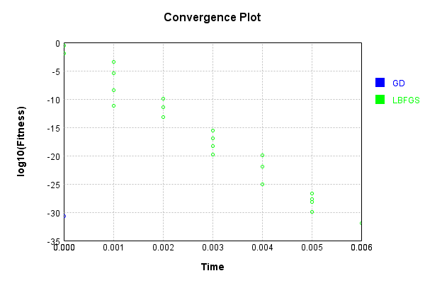

# ImgCropLayer
## ImgCropLayerTest
### Json Serialization
Code from [JsonTest.java:36](../../../../../../../src/main/java/com/simiacryptus/mindseye/test/unit/JsonTest.java#L36) executed in 0.00 seconds: 
```java
    JsonObject json = layer.getJson();
    NNLayer echo = NNLayer.fromJson(json);
    if ((echo == null)) throw new AssertionError("Failed to deserialize");
    if ((layer == echo)) throw new AssertionError("Serialization did not copy");
    if ((!layer.equals(echo))) throw new AssertionError("Serialization not equal");
    return new GsonBuilder().setPrettyPrinting().create().toJson(json);
```

Returns: 

```
    {
      "class": "com.simiacryptus.mindseye.layers.java.ImgCropLayer",
      "id": "5c5d9a75-a552-431d-a8a8-a524ba69fbbf",
      "isFrozen": false,
      "name": "ImgCropLayer/5c5d9a75-a552-431d-a8a8-a524ba69fbbf",
      "sizeX": 1,
      "sizeY": 1
    }
```


### Example Input/Output Pair
Code from [ReferenceIO.java:68](../../../../../../../src/main/java/com/simiacryptus/mindseye/test/unit/ReferenceIO.java#L68) executed in 0.00 seconds: 
```java
    SimpleEval eval = SimpleEval.run(layer, inputPrototype);
    return String.format("--------------------\nInput: \n[%s]\n--------------------\nOutput: \n%s\n--------------------\nDerivative: \n%s",
      Arrays.stream(inputPrototype).map(t -> t.prettyPrint()).reduce((a, b) -> a + ",\n" + b).get(),
      eval.getOutput().prettyPrint(),
      Arrays.stream(eval.getDerivative()).map(t -> t.prettyPrint()).reduce((a, b) -> a + ",\n" + b).get());
```

Returns: 

```
    --------------------
    Input: 
    [[
    	[ [ 1.992 ], [ 0.192 ], [ 1.084 ] ],
    	[ [ -0.572 ], [ 1.456 ], [ 0.3 ] ],
    	[ [ 1.024 ], [ -1.524 ], [ 0.616 ] ]
    ]]
    --------------------
    Output: 
    [
    	[ [ 1.456 ] ]
    ]
    --------------------
    Derivative: 
    [
    	[ [ 0.0 ], [ 0.0 ], [ 0.0 ] ],
    	[ [ 0.0 ], [ 1.0 ], [ 0.0 ] ],
    	[ [ 0.0 ], [ 0.0 ], [ 0.0 ] ]
    ]
```


Code from [SingleDerivativeTester.java:77](../../../../../../../src/main/java/com/simiacryptus/mindseye/test/unit/SingleDerivativeTester.java#L77) executed in 0.00 seconds: 
```java
    return test(component, inputPrototype);
```
Logging: 
```
    Inputs: [
    	[ [ 0.868 ], [ 0.492 ], [ 0.064 ] ],
    	[ [ -0.788 ], [ -0.856 ], [ -0.34 ] ],
    	[ [ -1.656 ], [ 0.688 ], [ 1.464 ] ]
    ]
    Inputs Statistics: {meanExponent=-0.220074050161839, negative=4, min=1.464, max=1.464, mean=-0.0071111111111111175, count=9.0, positive=5, stdDev=0.932582131556661, zeros=0}
    Output: [
    	[ [ -0.856 ] ]
    ]
    Outputs Statistics: {meanExponent=-0.06752623532284678, negative=1, min=-0.856, max=-0.856, mean=-0.856, count=1.0, positive=0, stdDev=0.0, zeros=0}
    Feedback for input 0
    Inputs Values: [
    	[ [ 0.868 ], [ 0.492 ], [ 0.064 ] ],
    	[ [ -0.788 ], [ -0.856 ], [ -0.34 ] ],
    	[ [ -1.656 ], [ 0.688 ], [ 1.464 ] ]
    ]
    Value Statistics: {meanExponent=-0.220074050161839, negative=4, min=1.464, max=1.464, mean=-0.0071111111111111175, count=9.0, positive=5, stdDev=0.932582131556661, zeros=0}
    Implemented Feedback: [ [ 0.0 ], [ 0.0 ], [ 0.0 ], [ 0.0 ], [ 1.0 ], [ 0.0 ], [ 0.0 ], [ 0.0 ], [ 0.0 ] ]
    Implemented Statistics: {meanExponent=0.0, negative=0, min=0.0, max=0.0, mean=0.1111111111111111, count=9.0, positive=1, stdDev=0.31426968052735443, zeros=8}
    Measured Feedback: [ [ 0.0 ], [ 0.0 ], [ 0.0 ], [ 0.0 ], [ 0.9999999999998899 ], [ 0.0 ], [ 0.0 ], [ 0.0 ], [ 0.0 ] ]
    Measured Statistics: {meanExponent=-4.7830642341045674E-14, negative=0, min=0.0, max=0.0, mean=0.11111111111109888, count=9.0, positive=1, stdDev=0.31426968052731985, zeros=8}
    Feedback Error: [ [ 0.0 ], [ 0.0 ], [ 0.0 ], [ 0.0 ], [ -1.1013412404281553E-13 ], [ 0.0 ], [ 0.0 ], [ 0.0 ], [ 0.0 ] ]
    Error Statistics: {meanExponent=-12.958078098036825, negative=1, min=0.0, max=0.0, mean=-1.223712489364617E-14, count=9.0, positive=0, stdDev=3.461181597809566E-14, zeros=8}
    Finite-Difference Derivative Accuracy:
    absoluteTol: 1.2237e-14 +- 3.4612e-14 [0.0000e+00 - 1.1013e-13] (9#)
    relativeTol: 5.5067e-14 +- 0.0000e+00 [5.5067e-14 - 5.5067e-14] (1#)
    
```

Returns: 

```
    ToleranceStatistics{absoluteTol=1.2237e-14 +- 3.4612e-14 [0.0000e+00 - 1.1013e-13] (9#), relativeTol=5.5067e-14 +- 0.0000e+00 [5.5067e-14 - 5.5067e-14] (1#)}
```


### Performance
Now we execute larger-scale runs to benchmark performance:

Code from [PerformanceTester.java:66](../../../../../../../src/main/java/com/simiacryptus/mindseye/test/unit/PerformanceTester.java#L66) executed in 0.00 seconds: 
```java
    test(component, inputPrototype);
```
Logging: 
```
    100 batches
    Input Dimensions:
    	[3, 3, 1]
    Performance:
    	Evaluation performance: 0.000248s +- 0.000051s [0.000201s - 0.000337s]
    	Learning performance: 0.000063s +- 0.000007s [0.000054s - 0.000075s]
    
```

### Input Learning
In this test, we use a network to learn this target input, given it's pre-evaluated output:

Code from [LearningTester.java:127](../../../../../../../src/main/java/com/simiacryptus/mindseye/test/unit/LearningTester.java#L127) executed in 0.00 seconds: 
```java
    return Arrays.stream(input_target).map(x -> x.prettyPrint()).reduce((a, b) -> a + "\n" + b).orElse("");
```

Returns: 

```
    [
    	[ [ -1.732 ], [ -1.64 ], [ -1.684 ] ],
    	[ [ -1.108 ], [ 0.7 ], [ -1.056 ] ],
    	[ [ -1.74 ], [ 1.848 ], [ 1.668 ] ]
    ]
```


First, we use a conjugate gradient descent method, which converges the fastest for purely linear functions.

Code from [LearningTester.java:300](../../../../../../../src/main/java/com/simiacryptus/mindseye/test/unit/LearningTester.java#L300) executed in 0.00 seconds: 
```java
    return new IterativeTrainer(trainable)
      .setLineSearchFactory(label -> new QuadraticSearch())
      .setOrientation(new GradientDescent())
      .setMonitor(monitor)
      .setTimeout(30, TimeUnit.SECONDS)
      .setMaxIterations(250)
      .setTerminateThreshold(0)
      .run();
```
Logging: 
```
    Constructing line search parameters: GD
    F(0.0) = LineSearchPoint{point=PointSample{avg=3.083536}, derivative=-12.334144}
    New Minimum: 3.083536 > 3.083535998766586
    F(1.0E-10) = LineSearchPoint{point=PointSample{avg=3.083535998766586}, derivative=-12.334143997533172}, delta = -1.2334142596159836E-9
    New Minimum: 3.083535998766586 > 3.0835359913660993
    F(7.000000000000001E-10) = LineSearchPoint{point=PointSample{avg=3.0835359913660993}, derivative=-12.334143982732199}, delta = -8.633900705490305E-9
    New Minimum: 3.0835359913660993 > 3.083535939562695
    F(4.900000000000001E-9) = LineSearchPoint{point=PointSample{avg=3.083535939562695}, derivative=-12.334143879125389}, delta = -6.043730493843213E-8
    New Minimum: 3.083535939562695 > 3.0835355769388753
    F(3.430000000000001E-8) = LineSearchPoint{point=PointSample{avg=3.0835355769388753}, derivative=-12.334143153877722}, delta = -4.2306112479906233E-7
    New Minimum: 3.0835355769388753 > 3.0835330385727366
    F(2.4010000000000004E-7) = LineSearchPoint{point=PointSample{
```
...[skipping 1452 bytes](etc/312.txt)...
```
    3357401}, delta = -1.956620320046764
    F(1.3841287201) = LineSearchPoint{point=PointSample{avg=9.641398007203154}, derivative=21.809941896498188}, delta = 6.557862007203154
    Loops = 12
    New Minimum: 1.126915679953236 > 1.9721522630525295E-31
    F(0.5000000000000001) = LineSearchPoint{point=PointSample{avg=1.9721522630525295E-31}, derivative=3.11928260998684E-15}, delta = -3.083536
    Right bracket at 0.5000000000000001
    Converged to right
    Iteration 1 complete. Error: 1.9721522630525295E-31 Total: 249792277130788.7200; Orientation: 0.0000; Line Search: 0.0014
    Zero gradient: 8.881784197001252E-16
    F(0.0) = LineSearchPoint{point=PointSample{avg=1.9721522630525295E-31}, derivative=-7.888609052210118E-31}
    New Minimum: 1.9721522630525295E-31 > 0.0
    F(0.5000000000000001) = LineSearchPoint{point=PointSample{avg=0.0}, derivative=0.0}, delta = -1.9721522630525295E-31
    0.0 <= 1.9721522630525295E-31
    Converged to right
    Iteration 2 complete. Error: 0.0 Total: 249792277361335.7200; Orientation: 0.0000; Line Search: 0.0001
    
```

Returns: 

```
    0.0
```


Training Converged

Next, we run the same optimization using L-BFGS, which is nearly ideal for purely second-order or quadratic functions.

Code from [LearningTester.java:324](../../../../../../../src/main/java/com/simiacryptus/mindseye/test/unit/LearningTester.java#L324) executed in 0.01 seconds: 
```java
    return new IterativeTrainer(trainable)
      .setLineSearchFactory(label -> new ArmijoWolfeSearch())
      .setOrientation(new LBFGS())
      .setMonitor(monitor)
      .setTimeout(30, TimeUnit.SECONDS)
      .setMaxIterations(250)
      .setTerminateThreshold(0)
      .run();
```
Logging: 
```
    LBFGS Accumulation History: 1 points
    Constructing line search parameters: GD
    th(0)=3.083536;dx=-12.334144
    Armijo: th(2.154434690031884)=33.76045335712344; dx=40.81207141089724 delta=-30.67691735712344
    Armijo: th(1.077217345015942)=4.109488412918705; dx=14.23896370544862 delta=-1.0259524129187052
    New Minimum: 3.083536 > 0.24496318971889844
    END: th(0.3590724483386473)=0.24496318971889844; dx=-3.4764414315171273 delta=2.8385728102811014
    Iteration 1 complete. Error: 0.24496318971889844 Total: 249792280791050.7200; Orientation: 0.0001; Line Search: 0.0003
    LBFGS Accumulation History: 1 points
    th(0)=0.24496318971889844;dx=-0.9798527588755938
    New Minimum: 0.24496318971889844 > 0.07334780092335612
    WOLF (strong): th(0.7735981389354633)=0.07334780092335612; dx=0.5361717825182832 delta=0.17161538879554233
    New Minimum: 0.07334780092335612 > 0.012556274845778244
    END: th(0.3867990694677316)=0.012556274845778244; dx=-0.22184048817865537 delta=0.2324069148731202
    Iteration 2 complete. Error: 0.012556274845778244 
```
...[skipping 9676 bytes](etc/313.txt)...
```
    al: 249792286348984.7200; Orientation: 0.0000; Line Search: 0.0002
    LBFGS Accumulation History: 1 points
    th(0)=1.232595164407831E-30;dx=-4.930380657631324E-30
    New Minimum: 1.232595164407831E-30 > 9.98402083170343E-31
    WOLF (strong): th(0.9419005594135813)=9.98402083170343E-31; dx=4.4373425918681914E-30 delta=2.341930812374879E-31
    New Minimum: 9.98402083170343E-31 > 1.232595164407831E-32
    END: th(0.47095027970679065)=1.232595164407831E-32; dx=-4.930380657631324E-31 delta=1.2202692127637526E-30
    Iteration 21 complete. Error: 1.232595164407831E-32 Total: 249792286646216.7200; Orientation: 0.0000; Line Search: 0.0002
    LBFGS Accumulation History: 1 points
    th(0)=1.232595164407831E-32;dx=-4.930380657631324E-32
    Armijo: th(1.0146316198805285)=1.232595164407831E-32; dx=4.930380657631324E-32 delta=0.0
    New Minimum: 1.232595164407831E-32 > 0.0
    END: th(0.5073158099402643)=0.0; dx=0.0 delta=1.232595164407831E-32
    Iteration 22 complete. Error: 0.0 Total: 249792286900987.7200; Orientation: 0.0000; Line Search: 0.0002
    
```

Returns: 

```
    0.0
```


Training Converged

Code from [LearningTester.java:96](../../../../../../../src/main/java/com/simiacryptus/mindseye/test/unit/LearningTester.java#L96) executed in 0.00 seconds: 
```java
    return TestUtil.compare(runs);
```

Returns: 


Code from [LearningTester.java:99](../../../../../../../src/main/java/com/simiacryptus/mindseye/test/unit/LearningTester.java#L99) executed in 0.01 seconds: 
```java
    return TestUtil.compareTime(runs);
```

Returns: 




