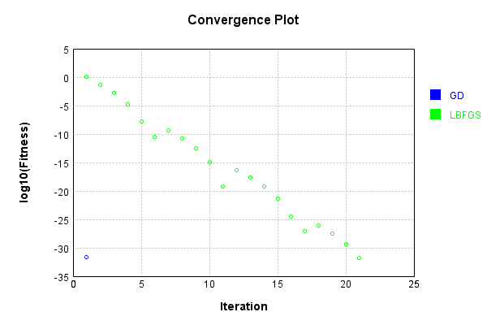
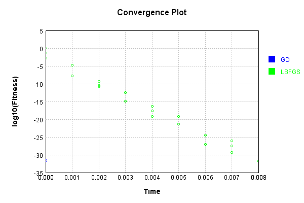

# ImgReshapeLayer
## ImgReshapeLayerTest
### Json Serialization
Code from [JsonTest.java:36](../../../../../../../src/main/java/com/simiacryptus/mindseye/test/unit/JsonTest.java#L36) executed in 0.00 seconds: 
```java
    JsonObject json = layer.getJson();
    NNLayer echo = NNLayer.fromJson(json);
    if ((echo == null)) throw new AssertionError("Failed to deserialize");
    if ((layer == echo)) throw new AssertionError("Serialization did not copy");
    if ((!layer.equals(echo))) throw new AssertionError("Serialization not equal");
    return new GsonBuilder().setPrettyPrinting().create().toJson(json);
```

Returns: 

```
    {
      "class": "com.simiacryptus.mindseye.layers.java.ImgReshapeLayer",
      "id": "99292064-6054-407e-957f-9908df7a6be0",
      "isFrozen": false,
      "name": "ImgReshapeLayer/99292064-6054-407e-957f-9908df7a6be0",
      "kernelSizeX": 2,
      "kernelSizeY": 2,
      "expand": false
    }
```


### Example Input/Output Pair
Code from [ReferenceIO.java:68](../../../../../../../src/main/java/com/simiacryptus/mindseye/test/unit/ReferenceIO.java#L68) executed in 0.00 seconds: 
```java
    SimpleEval eval = SimpleEval.run(layer, inputPrototype);
    return String.format("--------------------\nInput: \n[%s]\n--------------------\nOutput: \n%s\n--------------------\nDerivative: \n%s",
      Arrays.stream(inputPrototype).map(t -> t.prettyPrint()).reduce((a, b) -> a + ",\n" + b).get(),
      eval.getOutput().prettyPrint(),
      Arrays.stream(eval.getDerivative()).map(t -> t.prettyPrint()).reduce((a, b) -> a + ",\n" + b).get());
```

Returns: 

```
    --------------------
    Input: 
    [[
    	[ [ -1.236, -0.152, -1.024 ], [ 0.036, 0.472, -1.948 ] ],
    	[ [ 1.792, -0.968, -1.536 ], [ 1.784, 1.756, -0.616 ] ]
    ]]
    --------------------
    Output: 
    [
    	[ [ -1.236, -0.152, -1.024, 0.036, 0.472, -1.948, 1.792, -0.968, ... ] ]
    ]
    --------------------
    Derivative: 
    [
    	[ [ 1.0, 1.0, 1.0 ], [ 1.0, 1.0, 1.0 ] ],
    	[ [ 1.0, 1.0, 1.0 ], [ 1.0, 1.0, 1.0 ] ]
    ]
```


### Batch Execution
Code from [BatchingTester.java:66](../../../../../../../src/main/java/com/simiacryptus/mindseye/test/unit/BatchingTester.java#L66) executed in 0.00 seconds: 
```java
    return test(reference, inputPrototype);
```

Returns: 

```
    ToleranceStatistics{absoluteTol=0.0000e+00 +- 0.0000e+00 [0.0000e+00 - 0.0000e+00] (240#), relativeTol=0.0000e+00 +- 0.0000e+00 [0.0000e+00 - 0.0000e+00] (240#)}
```


Code from [SingleDerivativeTester.java:77](../../../../../../../src/main/java/com/simiacryptus/mindseye/test/unit/SingleDerivativeTester.java#L77) executed in 0.00 seconds: 
```java
    return test(component, inputPrototype);
```
Logging: 
```
    Inputs: [
    	[ [ 0.14, 1.868, -1.592 ], [ 1.14, 1.084, -1.244 ] ],
    	[ [ 1.696, 1.7, 0.144 ], [ 1.728, -0.656, -0.936 ] ]
    ]
    Inputs Statistics: {meanExponent=-0.0458197356234615, negative=4, min=-0.936, max=-0.936, mean=0.4226666666666666, count=12.0, positive=8, stdDev=1.2247953116972468, zeros=0}
    Output: [
    	[ [ 0.14, 1.868, -1.592, 1.14, 1.084, -1.244, 1.696, 1.7, ... ] ]
    ]
    Outputs Statistics: {meanExponent=-0.0458197356234615, negative=4, min=-0.936, max=-0.936, mean=0.4226666666666667, count=12.0, positive=8, stdDev=1.2247953116972465, zeros=0}
    Feedback for input 0
    Inputs Values: [
    	[ [ 0.14, 1.868, -1.592 ], [ 1.14, 1.084, -1.244 ] ],
    	[ [ 1.696, 1.7, 0.144 ], [ 1.728, -0.656, -0.936 ] ]
    ]
    Value Statistics: {meanExponent=-0.0458197356234615, negative=4, min=-0.936, max=-0.936, mean=0.4226666666666666, count=12.0, positive=8, stdDev=1.2247953116972468, zeros=0}
    Implemented Feedback: [ [ 1.0, 0.0, 0.0, 0.0, 0.0, 0.0, 0.0, 0.0, ... ], [ 0.0, 0.0, 0.0, 0.0, 0.0, 0.0, 1.0, 0.0, ... ], [ 0.0, 0.0, 0.0, 1.0,
```
...[skipping 1081 bytes](etc/314.txt)...
```
    8333333333332416, count=144.0, positive=12, stdDev=0.2763853991962529, zeros=132}
    Feedback Error: [ [ -1.1013412404281553E-13, 0.0, 0.0, 0.0, 0.0, 0.0, 0.0, 0.0, ... ], [ 0.0, 0.0, 0.0, 0.0, 0.0, 0.0, -1.1013412404281553E-13, 0.0, ... ], [ 0.0, 0.0, 0.0, -1.1013412404281553E-13, 0.0, 0.0, 0.0, 0.0, ... ], [ 0.0, 0.0, 0.0, 0.0, 0.0, 0.0, 0.0, 0.0, ... ], [ 0.0, -1.1013412404281553E-13, 0.0, 0.0, 0.0, 0.0, 0.0, 0.0, ... ], [ 0.0, 0.0, 0.0, 0.0, 0.0, 0.0, 0.0, -1.1013412404281553E-13, ... ], [ 0.0, 0.0, 0.0, 0.0, -1.1013412404281553E-13, 0.0, 0.0, 0.0, ... ], [ 0.0, 0.0, 0.0, 0.0, 0.0, 0.0, 0.0, 0.0, ... ], ... ]
    Error Statistics: {meanExponent=-12.958078098036824, negative=12, min=-1.1013412404281553E-13, max=-1.1013412404281553E-13, mean=-9.177843670234628E-15, count=144.0, positive=0, stdDev=3.0439463838706555E-14, zeros=132}
    Finite-Difference Derivative Accuracy:
    absoluteTol: 9.1778e-15 +- 3.0439e-14 [0.0000e+00 - 1.1013e-13] (144#)
    relativeTol: 5.5067e-14 +- 0.0000e+00 [5.5067e-14 - 5.5067e-14] (12#)
    
```

Returns: 

```
    ToleranceStatistics{absoluteTol=9.1778e-15 +- 3.0439e-14 [0.0000e+00 - 1.1013e-13] (144#), relativeTol=5.5067e-14 +- 0.0000e+00 [5.5067e-14 - 5.5067e-14] (12#)}
```


### Performance
Now we execute larger-scale runs to benchmark performance:

Code from [PerformanceTester.java:66](../../../../../../../src/main/java/com/simiacryptus/mindseye/test/unit/PerformanceTester.java#L66) executed in 0.00 seconds: 
```java
    test(component, inputPrototype);
```
Logging: 
```
    100 batches
    Input Dimensions:
    	[2, 2, 3]
    Performance:
    	Evaluation performance: 0.000283s +- 0.000076s [0.000184s - 0.000400s]
    	Learning performance: 0.000051s +- 0.000004s [0.000046s - 0.000056s]
    
```

### Input Learning
In this test, we use a network to learn this target input, given it's pre-evaluated output:

Code from [LearningTester.java:127](../../../../../../../src/main/java/com/simiacryptus/mindseye/test/unit/LearningTester.java#L127) executed in 0.00 seconds: 
```java
    return Arrays.stream(input_target).map(x -> x.prettyPrint()).reduce((a, b) -> a + "\n" + b).orElse("");
```

Returns: 

```
    [
    	[ [ 0.908, 1.048, 1.548 ], [ 1.496, -1.296, 0.664 ] ],
    	[ [ 0.476, -1.932, -0.468 ], [ 0.524, 0.736, -0.592 ] ]
    ]
```


First, we use a conjugate gradient descent method, which converges the fastest for purely linear functions.

Code from [LearningTester.java:300](../../../../../../../src/main/java/com/simiacryptus/mindseye/test/unit/LearningTester.java#L300) executed in 0.00 seconds: 
```java
    return new IterativeTrainer(trainable)
      .setLineSearchFactory(label -> new QuadraticSearch())
      .setOrientation(new GradientDescent())
      .setMonitor(monitor)
      .setTimeout(30, TimeUnit.SECONDS)
      .setMaxIterations(250)
      .setTerminateThreshold(0)
      .run();
```
Logging: 
```
    Constructing line search parameters: GD
    F(0.0) = LineSearchPoint{point=PointSample{avg=2.4594160000000005}, derivative=-0.8198053333333333}
    New Minimum: 2.4594160000000005 > 2.459415999918019
    F(1.0E-10) = LineSearchPoint{point=PointSample{avg=2.459415999918019}, derivative=-0.8198053333196698}, delta = -8.198153267358066E-11
    New Minimum: 2.459415999918019 > 2.459415999426136
    F(7.000000000000001E-10) = LineSearchPoint{point=PointSample{avg=2.459415999426136}, derivative=-0.8198053332376893}, delta = -5.738645114661267E-10
    New Minimum: 2.459415999426136 > 2.4594159959829542
    F(4.900000000000001E-9) = LineSearchPoint{point=PointSample{avg=2.4594159959829542}, derivative=-0.8198053326638256}, delta = -4.017046251192369E-9
    New Minimum: 2.4594159959829542 > 2.459415971880677
    F(3.430000000000001E-8) = LineSearchPoint{point=PointSample{avg=2.459415971880677}, derivative=-0.8198053286467795}, delta = -2.8119323314257372E-8
    New Minimum: 2.459415971880677 > 2.459415803164743
    F(2.4010000000000004E-7) = LineSear
```
...[skipping 1502 bytes](etc/315.txt)...
```
    94312241753979
    New Minimum: 2.2999847758246026 > 1.455582655952476
    F(1.3841287201) = LineSearchPoint{point=PointSample{avg=1.455582655952476}, derivative=-0.6306859822070299}, delta = -1.0038333440475244
    Loops = 12
    New Minimum: 1.455582655952476 > 1.9772880762375622E-32
    F(6.0) = LineSearchPoint{point=PointSample{avg=1.9772880762375622E-32}, derivative=-5.342639910723947E-17}, delta = -2.4594160000000005
    Right bracket at 6.0
    Converged to right
    Iteration 1 complete. Error: 1.9772880762375622E-32 Total: 249792447582347.5600; Orientation: 0.0000; Line Search: 0.0014
    Zero gradient: 8.11847291929043E-17
    F(0.0) = LineSearchPoint{point=PointSample{avg=1.9772880762375622E-32}, derivative=-6.590960254125207E-33}
    New Minimum: 1.9772880762375622E-32 > 0.0
    F(6.0) = LineSearchPoint{point=PointSample{avg=0.0}, derivative=0.0}, delta = -1.9772880762375622E-32
    0.0 <= 1.9772880762375622E-32
    Converged to right
    Iteration 2 complete. Error: 0.0 Total: 249792447824009.5600; Orientation: 0.0000; Line Search: 0.0001
    
```

Returns: 

```
    0.0
```


Training Converged

Next, we run the same optimization using L-BFGS, which is nearly ideal for purely second-order or quadratic functions.

Code from [LearningTester.java:324](../../../../../../../src/main/java/com/simiacryptus/mindseye/test/unit/LearningTester.java#L324) executed in 0.01 seconds: 
```java
    return new IterativeTrainer(trainable)
      .setLineSearchFactory(label -> new ArmijoWolfeSearch())
      .setOrientation(new LBFGS())
      .setMonitor(monitor)
      .setTimeout(30, TimeUnit.SECONDS)
      .setMaxIterations(250)
      .setTerminateThreshold(0)
      .run();
```
Logging: 
```
    LBFGS Accumulation History: 1 points
    Constructing line search parameters: GD
    th(0)=2.4594160000000005;dx=-0.8198053333333333
    New Minimum: 2.4594160000000005 > 1.0102988908715318
    END: th(2.154434690031884)=1.0102988908715318; dx=-0.5254358251322524 delta=1.4491171091284687
    Iteration 1 complete. Error: 1.0102988908715318 Total: 249792451106960.5600; Orientation: 0.0001; Line Search: 0.0003
    LBFGS Accumulation History: 1 points
    th(0)=1.0102988908715318;dx=-0.3367662969571772
    New Minimum: 1.0102988908715318 > 0.05178570120974055
    END: th(4.641588833612779)=0.05178570120974055; dx=-0.07624451637491739 delta=0.9585131896617912
    Iteration 2 complete. Error: 0.05178570120974055 Total: 249792451408467.5600; Orientation: 0.0000; Line Search: 0.0002
    LBFGS Accumulation History: 1 points
    th(0)=0.05178570120974055;dx=-0.01726190040324685
    New Minimum: 0.05178570120974055 > 0.023015867204329136
    WOLF (strong): th(10.000000000000002)=0.023015867204329136; dx=0.011507933602164566 delta=0.028769834005411412
    New Minim
```
...[skipping 9312 bytes](etc/316.txt)...
```
    249792458790547.5300; Orientation: 0.0000; Line Search: 0.0002
    LBFGS Accumulation History: 1 points
    th(0)=4.568819409405027E-30;dx=-1.5229398031350087E-30
    New Minimum: 4.568819409405027E-30 > 3.5991778800708664E-30
    WOLF (strong): th(11.30280671296297)=3.5991778800708664E-30; dx=1.3510612552092501E-30 delta=9.696415293341606E-31
    New Minimum: 3.5991778800708664E-30 > 1.746176482911094E-32
    END: th(5.651403356481485)=1.746176482911094E-32; dx=-8.799359923689236E-32 delta=4.551357644575916E-30
    Iteration 21 complete. Error: 1.746176482911094E-32 Total: 249792459145916.5300; Orientation: 0.0000; Line Search: 0.0003
    LBFGS Accumulation History: 1 points
    th(0)=1.746176482911094E-32;dx=-5.8205882763703126E-33
    Armijo: th(12.175579438566336)=1.746176482911094E-32; dx=5.8205882763703126E-33 delta=0.0
    New Minimum: 1.746176482911094E-32 > 0.0
    END: th(6.087789719283168)=0.0; dx=0.0 delta=1.746176482911094E-32
    Iteration 22 complete. Error: 0.0 Total: 249792459529781.5300; Orientation: 0.0000; Line Search: 0.0003
    
```

Returns: 

```
    0.0
```


Training Converged

Code from [LearningTester.java:96](../../../../../../../src/main/java/com/simiacryptus/mindseye/test/unit/LearningTester.java#L96) executed in 0.00 seconds: 
```java
    return TestUtil.compare(runs);
```

Returns: 




Code from [LearningTester.java:99](../../../../../../../src/main/java/com/simiacryptus/mindseye/test/unit/LearningTester.java#L99) executed in 0.00 seconds: 
```java
    return TestUtil.compareTime(runs);
```

Returns: 




