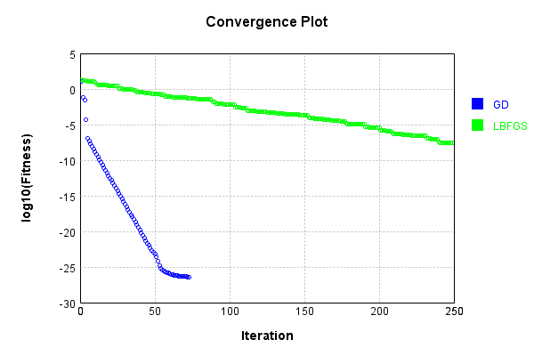
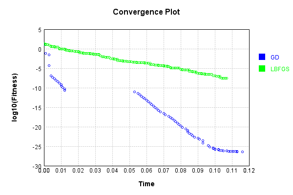

# L1NormalizationLayer
## L1NormalizationLayerTest
### Json Serialization
Code from [JsonTest.java:36](../../../../../../../src/main/java/com/simiacryptus/mindseye/test/unit/JsonTest.java#L36) executed in 0.00 seconds: 
```java
    JsonObject json = layer.getJson();
    NNLayer echo = NNLayer.fromJson(json);
    if ((echo == null)) throw new AssertionError("Failed to deserialize");
    if ((layer == echo)) throw new AssertionError("Serialization did not copy");
    if ((!layer.equals(echo))) throw new AssertionError("Serialization not equal");
    return new GsonBuilder().setPrettyPrinting().create().toJson(json);
```

Returns: 

```
    {
      "class": "com.simiacryptus.mindseye.layers.java.L1NormalizationLayer",
      "id": "60fc7317-013a-4926-925c-77b4a8118a9f",
      "isFrozen": false,
      "name": "L1NormalizationLayer/60fc7317-013a-4926-925c-77b4a8118a9f"
    }
```


### Example Input/Output Pair
Code from [ReferenceIO.java:68](../../../../../../../src/main/java/com/simiacryptus/mindseye/test/unit/ReferenceIO.java#L68) executed in 0.00 seconds: 
```java
    SimpleEval eval = SimpleEval.run(layer, inputPrototype);
    return String.format("--------------------\nInput: \n[%s]\n--------------------\nOutput: \n%s\n--------------------\nDerivative: \n%s",
      Arrays.stream(inputPrototype).map(t -> t.prettyPrint()).reduce((a, b) -> a + ",\n" + b).get(),
      eval.getOutput().prettyPrint(),
      Arrays.stream(eval.getDerivative()).map(t -> t.prettyPrint()).reduce((a, b) -> a + ",\n" + b).get());
```

Returns: 

```
    --------------------
    Input: 
    [[ -36.0, -101.2, -144.0, -112.79999999999998 ]]
    --------------------
    Output: 
    [ 0.09137055837563451, 0.25685279187817256, 0.36548223350253806, 0.28629441624365476 ]
    --------------------
    Derivative: 
    [ 0.0, 0.0, 0.0, 0.0 ]
```


### Batch Execution
Code from [BatchingTester.java:66](../../../../../../../src/main/java/com/simiacryptus/mindseye/test/unit/BatchingTester.java#L66) executed in 0.00 seconds: 
```java
    return test(reference, inputPrototype);
```

Returns: 

```
    ToleranceStatistics{absoluteTol=0.0000e+00 +- 0.0000e+00 [0.0000e+00 - 0.0000e+00] (80#), relativeTol=0.0000e+00 +- 0.0000e+00 [0.0000e+00 - 0.0000e+00] (40#)}
```


Code from [SingleDerivativeTester.java:77](../../../../../../../src/main/java/com/simiacryptus/mindseye/test/unit/SingleDerivativeTester.java#L77) executed in 0.00 seconds: 
```java
    return test(component, inputPrototype);
```
Logging: 
```
    Inputs: [ 68.4, 53.2, -87.6, 128.8 ]
    Inputs Statistics: {meanExponent=1.9033469258017597, negative=1, min=128.8, max=128.8, mean=40.7, count=4.0, positive=3, stdDev=79.28751478007115, zeros=0}
    Output: [ 0.4201474201474202, 0.32678132678132676, -0.538083538083538, 0.7911547911547911 ]
    Outputs Statistics: {meanExponent=-0.30830747475142284, negative=1, min=0.7911547911547911, max=0.7911547911547911, mean=0.25, count=4.0, positive=3, stdDev=0.48702404656063353, zeros=0}
    Feedback for input 0
    Inputs Values: [ 68.4, 53.2, -87.6, 128.8 ]
    Value Statistics: {meanExponent=1.9033469258017597, negative=1, min=128.8, max=128.8, mean=40.7, count=4.0, positive=3, stdDev=79.28751478007115, zeros=0}
    Implemented Feedback: [ [ 0.003561748033492505, -0.0020072563070106064, 0.00330518143785957, -0.0048596731643414685 ], [ -0.002580758109013637, 0.004135249835495535, 0.00330518143785957, -0.0048596731643414685 ], [ -0.002580758109013637, -0.0020072563070106064, 0.009447687580365712, -0.0048596731643414685 ], [ -0.0025807581
```
...[skipping 700 bytes](etc/317.txt)...
```
     ] ]
    Measured Statistics: {meanExponent=-2.4992428865535903, negative=9, min=0.0012828321882540905, max=0.0012828321882540905, mean=-5.204170427930421E-13, count=16.0, positive=7, stdDev=0.0040029723345801375, zeros=0}
    Feedback Error: [ [ -2.1891209830114666E-9, 1.2320788933366245E-9, -2.0288073976880427E-9, 2.9836290408799537E-9 ], [ 1.5838635294800063E-9, -2.540350507208855E-9, -2.0288073976880427E-9, 2.9836290408799537E-9 ], [ 1.5838635294800063E-9, 1.2320788933366245E-9, -5.801236798233522E-9, 2.9836290408799537E-9 ], [ 1.5838635294800063E-9, 1.2320788933366245E-9, -2.0288073976880427E-9, -7.899105829069913E-10 ] ]
    Error Statistics: {meanExponent=-8.711044518874726, negative=7, min=-7.899105829069913E-10, max=-7.899105829069913E-10, mean=-5.204170834506236E-13, count=16.0, positive=9, stdDev=2.457872117456439E-9, zeros=0}
    Finite-Difference Derivative Accuracy:
    absoluteTol: 2.1754e-09 +- 1.1441e-09 [7.8991e-10 - 5.8012e-09] (16#)
    relativeTol: 3.0702e-07 +- 2.4915e-10 [3.0686e-07 - 3.0788e-07] (16#)
    
```

Returns: 

```
    ToleranceStatistics{absoluteTol=2.1754e-09 +- 1.1441e-09 [7.8991e-10 - 5.8012e-09] (16#), relativeTol=3.0702e-07 +- 2.4915e-10 [3.0686e-07 - 3.0788e-07] (16#)}
```


### Performance
Now we execute larger-scale runs to benchmark performance:

Code from [PerformanceTester.java:66](../../../../../../../src/main/java/com/simiacryptus/mindseye/test/unit/PerformanceTester.java#L66) executed in 0.00 seconds: 
```java
    test(component, inputPrototype);
```
Logging: 
```
    100 batches
    Input Dimensions:
    	[4]
    Performance:
    	Evaluation performance: 0.000089s +- 0.000010s [0.000076s - 0.000105s]
    	Learning performance: 0.000026s +- 0.000001s [0.000025s - 0.000028s]
    
```

### Input Learning
In this test, we use a network to learn this target input, given it's pre-evaluated output:

Code from [LearningTester.java:127](../../../../../../../src/main/java/com/simiacryptus/mindseye/test/unit/LearningTester.java#L127) executed in 0.00 seconds: 
```java
    return Arrays.stream(input_target).map(x -> x.prettyPrint()).reduce((a, b) -> a + "\n" + b).orElse("");
```

Returns: 

```
    [ 86.0, 2.0, 85.2, -144.79999999999998 ]
```


First, we use a conjugate gradient descent method, which converges the fastest for purely linear functions.

Code from [LearningTester.java:300](../../../../../../../src/main/java/com/simiacryptus/mindseye/test/unit/LearningTester.java#L300) executed in 0.12 seconds: 
```java
    return new IterativeTrainer(trainable)
      .setLineSearchFactory(label -> new QuadraticSearch())
      .setOrientation(new GradientDescent())
      .setMonitor(monitor)
      .setTimeout(30, TimeUnit.SECONDS)
      .setMaxIterations(250)
      .setTerminateThreshold(0)
      .run();
```
Logging: 
```
    Constructing line search parameters: GD
    F(0.0) = LineSearchPoint{point=PointSample{avg=25.377802023408027}, derivative=-3.225437839938222}
    New Minimum: 25.377802023408027 > 25.377802023085486
    F(1.0E-10) = LineSearchPoint{point=PointSample{avg=25.377802023085486}, derivative=-3.225437839821853}, delta = -3.225402167572611E-10
    New Minimum: 25.377802023085486 > 25.37780202115023
    F(7.000000000000001E-10) = LineSearchPoint{point=PointSample{avg=25.37780202115023}, derivative=-3.225437839123623}, delta = -2.2577957281555427E-9
    New Minimum: 25.37780202115023 > 25.377802007603385
    F(4.900000000000001E-9) = LineSearchPoint{point=PointSample{avg=25.377802007603385}, derivative=-3.2254378342360126}, delta = -1.5804641151362375E-8
    New Minimum: 25.377802007603385 > 25.377801912775492
    F(3.430000000000001E-8) = LineSearchPoint{point=PointSample{avg=25.377801912775492}, derivative=-3.2254378000227444}, delta = -1.1063253424481445E-7
    New Minimum: 25.377801912775492 > 25.377801248980436
    F(2.4010000000000004E-7) = Lin
```
...[skipping 142667 bytes](etc/318.txt)...
```
    4.063006521925444E-27}, derivative=-8.285604981640602E-45}, delta = 3.5971556536292598E-31
    F(9.559398283045453E13) = LineSearchPoint{point=PointSample{avg=4.062646806360081E-27}, derivative=-8.285665832911468E-45}, delta = 0.0
    F(6.691578798131818E14) = LineSearchPoint{point=PointSample{avg=4.063006521925444E-27}, derivative=-8.285604981640602E-45}, delta = 3.5971556536292598E-31
    F(5.1473683062552445E13) = LineSearchPoint{point=PointSample{avg=4.062646806360081E-27}, derivative=-8.285665832911468E-45}, delta = 0.0
    F(3.603157814378671E14) = LineSearchPoint{point=PointSample{avg=4.063006521925444E-27}, derivative=-8.285604981640602E-45}, delta = 3.5971556536292598E-31
    Loops = 12
    F(4.906152520454904E19) = LineSearchPoint{point=PointSample{avg=2.239176928108706E-22}, derivative=9.135963066039126E-42}, delta = 2.2391363016406425E-22
    2.239176928108706E-22 > 4.063006521925444E-27
    Iteration 74 failed, aborting. Error: 4.062646806360081E-27 Total: 249792705647948.2800; Orientation: 0.0000; Line Search: 0.0010
    
```

Returns: 

```
    4.062646806360081E-27
```


Training Converged

Next, we run the same optimization using L-BFGS, which is nearly ideal for purely second-order or quadratic functions.

Code from [LearningTester.java:324](../../../../../../../src/main/java/com/simiacryptus/mindseye/test/unit/LearningTester.java#L324) executed in 0.11 seconds: 
```java
    return new IterativeTrainer(trainable)
      .setLineSearchFactory(label -> new ArmijoWolfeSearch())
      .setOrientation(new LBFGS())
      .setMonitor(monitor)
      .setTimeout(30, TimeUnit.SECONDS)
      .setMaxIterations(250)
      .setTerminateThreshold(0)
      .run();
```
Logging: 
```
    LBFGS Accumulation History: 1 points
    Constructing line search parameters: GD
    th(0)=25.377802023408027;dx=-3.225437839938222
    New Minimum: 25.377802023408027 > 20.416433779455986
    END: th(2.154434690031884)=20.416433779455986; dx=-1.6271166695972088 delta=4.961368243952041
    Iteration 1 complete. Error: 20.416433779455986 Total: 249792709525649.2800; Orientation: 0.0001; Line Search: 0.0003
    LBFGS Accumulation History: 1 points
    th(0)=20.416433779455986;dx=-0.8222226397080484
    New Minimum: 20.416433779455986 > 17.558914205130097
    END: th(4.641588833612779)=17.558914205130097; dx=-0.4576215164098592 delta=2.857519574325888
    Iteration 2 complete. Error: 17.558914205130097 Total: 249792709848530.2800; Orientation: 0.0000; Line Search: 0.0002
    LBFGS Accumulation History: 1 points
    th(0)=17.558914205130097;dx=-0.2553620603153699
    New Minimum: 17.558914205130097 > 15.624403388586083
    END: th(10.000000000000002)=15.624403388586083; dx=-0.1456365023105023 delta=1.9345108165440141
    Iteration 3 complete. Error: 15.6244
```
...[skipping 141691 bytes](etc/319.txt)...
```
    000; Orientation: 0.0000; Line Search: 0.0003
    LBFGS Accumulation History: 1 points
    th(0)=2.6772430620510957E-8;dx=-2.6127209077252254E-11
    New Minimum: 2.6772430620510957E-8 > 2.584842579828148E-8
    END: th(56.46266414740045)=2.584842579828148E-8; dx=-6.602690277638607E-12 delta=9.240048222294768E-10
    Iteration 249 complete. Error: 2.584842579828148E-8 Total: 249792816464930.2000; Orientation: 0.0000; Line Search: 0.0001
    LBFGS Accumulation History: 1 points
    th(0)=2.584842579828148E-8;dx=-6.29139133733189E-11
    Armijo: th(121.64512233077906)=4.044221021286317E-8; dx=3.0287057628891344E-10 delta=-1.4593784414581691E-8
    Armijo: th(60.82256116538953)=2.7583330639951135E-8; dx=1.199660696502793E-10 delta=-1.7349048416696549E-9
    New Minimum: 2.584842579828148E-8 > 2.5190822291116456E-8
    END: th(20.274187055129843)=2.5190822291116456E-8; dx=-1.956643676094474E-12 delta=6.576035071650246E-10
    Iteration 250 complete. Error: 2.5190822291116456E-8 Total: 249792816851646.2000; Orientation: 0.0000; Line Search: 0.0003
    
```

Returns: 

```
    2.5190822291116456E-8
```


Training Converged

Code from [LearningTester.java:96](../../../../../../../src/main/java/com/simiacryptus/mindseye/test/unit/LearningTester.java#L96) executed in 0.00 seconds: 
```java
    return TestUtil.compare(runs);
```

Returns: 




Code from [LearningTester.java:99](../../../../../../../src/main/java/com/simiacryptus/mindseye/test/unit/LearningTester.java#L99) executed in 0.00 seconds: 
```java
    return TestUtil.compareTime(runs);
```

Returns: 




