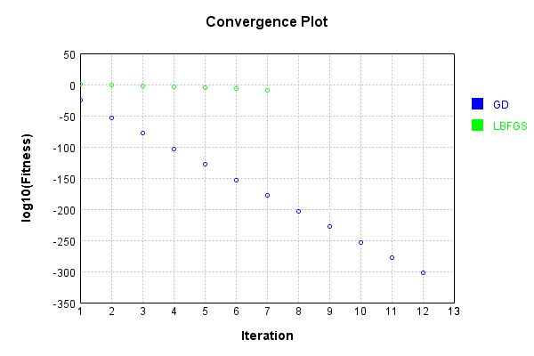
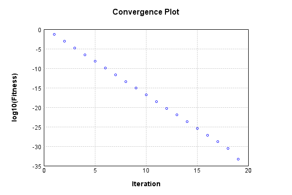
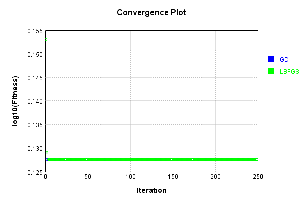
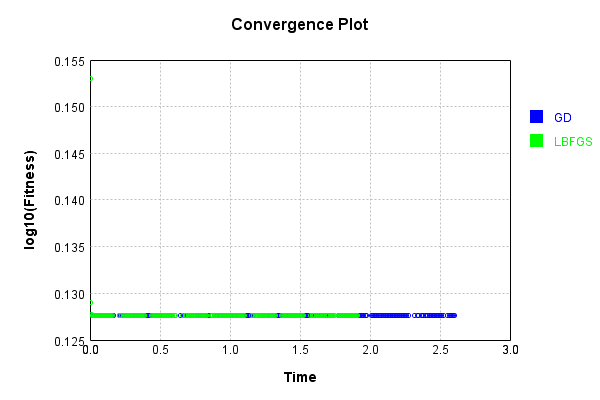

# LinearActivationLayer
## LinearActivationLayerTest
### Json Serialization
Code from [JsonTest.java:36](../../../../../../../src/main/java/com/simiacryptus/mindseye/test/unit/JsonTest.java#L36) executed in 0.00 seconds: 
```java
    JsonObject json = layer.getJson();
    NNLayer echo = NNLayer.fromJson(json);
    if ((echo == null)) throw new AssertionError("Failed to deserialize");
    if ((layer == echo)) throw new AssertionError("Serialization did not copy");
    if ((!layer.equals(echo))) throw new AssertionError("Serialization not equal");
    return new GsonBuilder().setPrettyPrinting().create().toJson(json);
```

Returns: 

```
    {
      "class": "com.simiacryptus.mindseye.layers.java.LinearActivationLayer",
      "id": "f8b35e81-860f-4698-a128-baa13dfb4bf1",
      "isFrozen": false,
      "name": "LinearActivationLayer/f8b35e81-860f-4698-a128-baa13dfb4bf1",
      "weights": [
        1.0,
        0.0
      ]
    }
```


### Example Input/Output Pair
Code from [ReferenceIO.java:68](../../../../../../../src/main/java/com/simiacryptus/mindseye/test/unit/ReferenceIO.java#L68) executed in 0.00 seconds: 
```java
    SimpleEval eval = SimpleEval.run(layer, inputPrototype);
    return String.format("--------------------\nInput: \n[%s]\n--------------------\nOutput: \n%s\n--------------------\nDerivative: \n%s",
      Arrays.stream(inputPrototype).map(t -> t.prettyPrint()).reduce((a, b) -> a + ",\n" + b).get(),
      eval.getOutput().prettyPrint(),
      Arrays.stream(eval.getDerivative()).map(t -> t.prettyPrint()).reduce((a, b) -> a + ",\n" + b).get());
```

Returns: 

```
    --------------------
    Input: 
    [[
    	[ [ -1.624 ], [ -0.328 ], [ 0.348 ] ],
    	[ [ -1.016 ], [ 1.328 ], [ -0.408 ] ]
    ]]
    --------------------
    Output: 
    [
    	[ [ -1.624 ], [ -0.328 ], [ 0.348 ] ],
    	[ [ -1.016 ], [ 1.328 ], [ -0.408 ] ]
    ]
    --------------------
    Derivative: 
    [
    	[ [ 1.0 ], [ 1.0 ], [ 1.0 ] ],
    	[ [ 1.0 ], [ 1.0 ], [ 1.0 ] ]
    ]
```


### Batch Execution
Code from [BatchingTester.java:66](../../../../../../../src/main/java/com/simiacryptus/mindseye/test/unit/BatchingTester.java#L66) executed in 0.00 seconds: 
```java
    return test(reference, inputPrototype);
```

Returns: 

```
    ToleranceStatistics{absoluteTol=0.0000e+00 +- 0.0000e+00 [0.0000e+00 - 0.0000e+00] (120#), relativeTol=0.0000e+00 +- 0.0000e+00 [0.0000e+00 - 0.0000e+00] (120#)}
```


Code from [SingleDerivativeTester.java:77](../../../../../../../src/main/java/com/simiacryptus/mindseye/test/unit/SingleDerivativeTester.java#L77) executed in 0.00 seconds: 
```java
    return test(component, inputPrototype);
```
Logging: 
```
    Inputs: [
    	[ [ -1.504 ], [ -1.848 ], [ 0.576 ] ],
    	[ [ -1.064 ], [ -0.184 ], [ -0.096 ] ]
    ]
    Inputs Statistics: {meanExponent=-0.2535995049048237, negative=5, min=-0.096, max=-0.096, mean=-0.6866666666666669, count=6.0, positive=1, stdDev=0.8519582671051962, zeros=0}
    Output: [
    	[ [ -1.504 ], [ -1.848 ], [ 0.576 ] ],
    	[ [ -1.064 ], [ -0.184 ], [ -0.096 ] ]
    ]
    Outputs Statistics: {meanExponent=-0.2535995049048237, negative=5, min=-0.096, max=-0.096, mean=-0.6866666666666669, count=6.0, positive=1, stdDev=0.8519582671051962, zeros=0}
    Feedback for input 0
    Inputs Values: [
    	[ [ -1.504 ], [ -1.848 ], [ 0.576 ] ],
    	[ [ -1.064 ], [ -0.184 ], [ -0.096 ] ]
    ]
    Value Statistics: {meanExponent=-0.2535995049048237, negative=5, min=-0.096, max=-0.096, mean=-0.6866666666666669, count=6.0, positive=1, stdDev=0.8519582671051962, zeros=0}
    Implemented Feedback: [ [ 1.0, 0.0, 0.0, 0.0, 0.0, 0.0 ], [ 0.0, 1.0, 0.0, 0.0, 0.0, 0.0 ], [ 0.0, 0.0, 1.0, 0.0, 0.0, 0.0 ], [ 0.0, 0.0, 0.0, 1.0, 0.0, 0.0 ], [ 0.0, 0.0, 0.0, 0.0, 1.0, 0
```
...[skipping 1798 bytes](etc/320.txt)...
```
    98899, 0.9999999999998899, 0.9999999999998899, 0.9999999999998899, 0.9999999999998899, 1.0000000000000286 ] ]
    Measured Statistics: {meanExponent=-0.1267997524524862, negative=5, min=1.0000000000000286, max=1.0000000000000286, mean=0.15666666666676551, count=12.0, positive=7, stdDev=1.0364012521967567, zeros=0}
    Gradient Error: [ [ 1.1604051053382136E-12, 4.902744876744691E-13, 1.503241975342462E-13, -1.7486012637846216E-14, -9.00390872971002E-14, 1.5015766408055242E-14 ], [ -1.1013412404281553E-13, -1.1013412404281553E-13, -1.1013412404281553E-13, -1.1013412404281553E-13, -1.1013412404281553E-13, 2.864375403532904E-14 ] ]
    Error Statistics: {meanExponent=-13.002301113276415, negative=7, min=2.864375403532904E-14, max=2.864375403532904E-14, mean=9.88722992367741E-14, count=12.0, positive=5, stdDev=3.608212888220069E-13, zeros=0}
    Finite-Difference Derivative Accuracy:
    absoluteTol: 6.4212e-14 +- 1.7930e-13 [0.0000e+00 - 1.1604e-12] (48#)
    relativeTol: 8.0002e-14 +- 8.6142e-14 [1.4322e-14 - 3.8577e-13] (18#)
    
```

Returns: 

```
    ToleranceStatistics{absoluteTol=6.4212e-14 +- 1.7930e-13 [0.0000e+00 - 1.1604e-12] (48#), relativeTol=8.0002e-14 +- 8.6142e-14 [1.4322e-14 - 3.8577e-13] (18#)}
```


### Performance
Now we execute larger-scale runs to benchmark performance:

Code from [PerformanceTester.java:66](../../../../../../../src/main/java/com/simiacryptus/mindseye/test/unit/PerformanceTester.java#L66) executed in 0.45 seconds: 
```java
    test(component, inputPrototype);
```
Logging: 
```
    100 batches
    Input Dimensions:
    	[100, 100, 1]
    Performance:
    	Evaluation performance: 0.031204s +- 0.026552s [0.014178s - 0.084027s]
    	Learning performance: 0.038324s +- 0.013244s [0.028686s - 0.064244s]
    
```

### Input Learning
In this test, we use a network to learn this target input, given it's pre-evaluated output:

Code from [LearningTester.java:127](../../../../../../../src/main/java/com/simiacryptus/mindseye/test/unit/LearningTester.java#L127) executed in 0.00 seconds: 
```java
    return Arrays.stream(input_target).map(x -> x.prettyPrint()).reduce((a, b) -> a + "\n" + b).orElse("");
```

Returns: 

```
    [
    	[ [ 1.744 ], [ -0.368 ], [ 1.996 ], [ -1.588 ], [ 1.236 ], [ 1.504 ], [ -0.696 ], [ 0.116 ], ... ],
    	[ [ 1.872 ], [ 0.128 ], [ 1.98 ], [ -1.392 ], [ -0.44 ], [ 1.8 ], [ -0.652 ], [ -0.22 ], ... ],
    	[ [ -1.576 ], [ 0.848 ], [ 0.252 ], [ -0.108 ], [ -1.58 ], [ 1.52 ], [ -0.948 ], [ -1.208 ], ... ],
    	[ [ -1.688 ], [ -0.352 ], [ 1.38 ], [ -0.892 ], [ -1.052 ], [ -0.8 ], [ -1.764 ], [ 0.252 ], ... ],
    	[ [ 0.344 ], [ -1.272 ], [ 1.664 ], [ -0.064 ], [ -1.544 ], [ 1.488 ], [ 1.572 ], [ -1.664 ], ... ],
    	[ [ 0.168 ], [ -0.04 ], [ -0.94 ], [ 1.088 ], [ 0.344 ], [ -1.528 ], [ -1.788 ], [ 0.428 ], ... ],
    	[ [ -0.476 ], [ 0.948 ], [ -1.908 ], [ 0.492 ], [ -1.012 ], [ -0.336 ], [ 0.868 ], [ 1.396 ], ... ],
    	[ [ 1.6 ], [ 1.396 ], [ -0.668 ], [ -0.06 ], [ 1.756 ], [ -1.872 ], [ 1.884 ], [ 0.164 ], ... ],
    	...
    ]
```


First, we use a conjugate gradient descent method, which converges the fastest for purely linear functions.

Code from [LearningTester.java:300](../../../../../../../src/main/java/com/simiacryptus/mindseye/test/unit/LearningTester.java#L300) executed in 0.07 seconds: 
```java
    return new IterativeTrainer(trainable)
      .setLineSearchFactory(label -> new QuadraticSearch())
      .setOrientation(new GradientDescent())
      .setMonitor(monitor)
      .setTimeout(30, TimeUnit.SECONDS)
      .setMaxIterations(250)
      .setTerminateThreshold(0)
      .run();
```
Logging: 
```
    Constructing line search parameters: GD
    F(0.0) = LineSearchPoint{point=PointSample{avg=2.698851612799996}, derivative=-0.00107954064512}
    New Minimum: 2.698851612799996 > 2.6988516127998987
    F(1.0E-10) = LineSearchPoint{point=PointSample{avg=2.6988516127998987}, derivative=-0.0010795406451199784}, delta = -9.725553695716371E-14
    New Minimum: 2.6988516127998987 > 2.698851612799245
    F(7.000000000000001E-10) = LineSearchPoint{point=PointSample{avg=2.698851612799245}, derivative=-0.001079540645119849}, delta = -7.509548538564559E-13
    New Minimum: 2.698851612799245 > 2.698851612794721
    F(4.900000000000001E-9) = LineSearchPoint{point=PointSample{avg=2.698851612794721}, derivative=-0.0010795406451189421}, delta = -5.274891634599044E-12
    New Minimum: 2.698851612794721 > 2.6988516127629767
    F(3.430000000000001E-8) = LineSearchPoint{point=PointSample{avg=2.6988516127629767}, derivative=-0.0010795406451125943}, delta = -3.701927653310122E-11
    New Minimum: 2.6988516127629767 > 2.6988516125408086
    F(2.4010000000000004E-7
```
...[skipping 7746 bytes](etc/321.txt)...
```
    36301956413568E-141
    F(0.0) = LineSearchPoint{point=PointSample{avg=1.456402680327933E-278}, derivative=-5.825610721311734E-282}
    New Minimum: 1.456402680327933E-278 > 1.7312261206573292E-303
    F(5000.0000000017235) = LineSearchPoint{point=PointSample{avg=1.7312261206573292E-303}, derivative=2.0085267372591188E-294}, delta = -1.456402680327933E-278
    1.7312261206573292E-303 <= 1.456402680327933E-278
    Converged to right
    Iteration 12 complete. Error: 1.7312261206573292E-303 Total: 249793483435763.5300; Orientation: 0.0003; Line Search: 0.0019
    Zero gradient: 8.32160109752283E-154
    F(0.0) = LineSearchPoint{point=PointSample{avg=1.7312261206573292E-303}, derivative=-6.924904482629317E-307}
    New Minimum: 1.7312261206573292E-303 > 0.0
    F(5000.0000000017235) = LineSearchPoint{point=PointSample{avg=0.0}, derivative=2.38737E-319}, delta = -1.7312261206573292E-303
    0.0 <= 1.7312261206573292E-303
    Converged to right
    Iteration 13 complete. Error: 0.0 Total: 249793486424901.5300; Orientation: 0.0003; Line Search: 0.0020
    
```

Returns: 

```
    0.0
```


Training Converged

Next, we run the same optimization using L-BFGS, which is nearly ideal for purely second-order or quadratic functions.

Code from [LearningTester.java:324](../../../../../../../src/main/java/com/simiacryptus/mindseye/test/unit/LearningTester.java#L324) executed in 0.04 seconds: 
```java
    return new IterativeTrainer(trainable)
      .setLineSearchFactory(label -> new ArmijoWolfeSearch())
      .setOrientation(new LBFGS())
      .setMonitor(monitor)
      .setTimeout(30, TimeUnit.SECONDS)
      .setMaxIterations(250)
      .setTerminateThreshold(0)
      .run();
```
Logging: 
```
    LBFGS Accumulation History: 1 points
    Constructing line search parameters: GD
    th(0)=2.698851612799996;dx=-0.00107954064512
    New Minimum: 2.698851612799996 > 2.6965263140632456
    WOLFE (weak): th(2.154434690031884)=2.6965263140632456; dx=-0.0010790754851569709 delta=0.0023252987367503586
    New Minimum: 2.6965263140632456 > 2.6942020174832355
    WOLFE (weak): th(4.308869380063768)=2.6942020174832355; dx=-0.0010786103251939417 delta=0.0046495953167604576
    New Minimum: 2.6942020174832355 > 2.6849148527307958
    WOLFE (weak): th(12.926608140191302)=2.6849148527307958; dx=-0.001076749685341825 delta=0.013936760069200194
    New Minimum: 2.6849148527307958 > 2.6433210383836143
    WOLFE (weak): th(51.70643256076521)=2.6433210383836143; dx=-0.0010683768060072998 delta=0.05553057441638165
    New Minimum: 2.6433210383836143 > 2.4269711636599753
    WOLFE (weak): th(258.53216280382605)=2.4269711636599753; dx=-0.001023721449556498 delta=0.27188044914002063
    New Minimum: 2.4269711636599753 > 1.284034778284971
    END: th(1551.1929768229563)
```
...[skipping 2556 bytes](etc/322.txt)...
```
    4986680738227E-10 delta=1.493659203482736E-5
    Iteration 6 complete. Error: 1.5087466701845297E-7 Total: 249793524158605.4700; Orientation: 0.0005; Line Search: 0.0036
    LBFGS Accumulation History: 1 points
    th(0)=1.5087466701845297E-7;dx=-6.034986680738125E-11
    New Minimum: 1.5087466701845297E-7 > 1.3302687483303558E-7
    WOLF (strong): th(9694.956105143481)=1.3302687483303558E-7; dx=5.666799512238218E-11 delta=1.7847792185417393E-8
    New Minimum: 1.3302687483303558E-7 > 1.4039155989429727E-10
    END: th(4847.478052571741)=1.4039155989429727E-10; dx=-1.840935842499822E-12 delta=1.5073427545855867E-7
    Iteration 7 complete. Error: 1.4039155989429727E-10 Total: 249793529387388.4700; Orientation: 0.0005; Line Search: 0.0039
    LBFGS Accumulation History: 1 points
    th(0)=1.4039155989429727E-10;dx=-5.6156623957718904E-14
    MAX ALPHA: th(0)=1.4039155989429727E-10;th'(0)=-5.6156623957718904E-14;
    Iteration 8 failed, aborting. Error: 1.4039155989429727E-10 Total: 249793532727050.4700; Orientation: 0.0005; Line Search: 0.0022
    
```

Returns: 

```
    1.4039155989429727E-10
```


Training Converged

Code from [LearningTester.java:96](../../../../../../../src/main/java/com/simiacryptus/mindseye/test/unit/LearningTester.java#L96) executed in 0.00 seconds: 
```java
    return TestUtil.compare(runs);
```

Returns: 




Code from [LearningTester.java:99](../../../../../../../src/main/java/com/simiacryptus/mindseye/test/unit/LearningTester.java#L99) executed in 0.00 seconds: 
```java
    return TestUtil.compareTime(runs);
```

Returns: 


### Model Learning
In this test, attempt to train a network to emulate a randomized network given an example input/output. The target state is:

Code from [LearningTester.java:176](../../../../../../../src/main/java/com/simiacryptus/mindseye/test/unit/LearningTester.java#L176) executed in 0.00 seconds: 
```java
    return network_target.state().stream().map(Arrays::toString).reduce((a, b) -> a + "\n" + b).orElse("");
```

Returns: 

```
    [0.0, 1.0]
```


First, we use a conjugate gradient descent method, which converges the fastest for purely linear functions.

Code from [LearningTester.java:300](../../../../../../../src/main/java/com/simiacryptus/mindseye/test/unit/LearningTester.java#L300) executed in 0.14 seconds: 
```java
    return new IterativeTrainer(trainable)
      .setLineSearchFactory(label -> new QuadraticSearch())
      .setOrientation(new GradientDescent())
      .setMonitor(monitor)
      .setTimeout(30, TimeUnit.SECONDS)
      .setMaxIterations(250)
      .setTerminateThreshold(0)
      .run();
```
Logging: 
```
    Constructing line search parameters: GD
    F(0.0) = LineSearchPoint{point=PointSample{avg=2.359447171199997}, derivative=-11.367622129329511}
    New Minimum: 2.359447171199997 > 2.359447170063225
    F(1.0E-10) = LineSearchPoint{point=PointSample{avg=2.359447170063225}, derivative=-11.367622126537917}, delta = -1.1367720098576228E-9
    New Minimum: 2.359447170063225 > 2.359447163242672
    F(7.000000000000001E-10) = LineSearchPoint{point=PointSample{avg=2.359447163242672}, derivative=-11.367622109788606}, delta = -7.957325021124007E-9
    New Minimum: 2.359447163242672 > 2.3594471154986465
    F(4.900000000000001E-9) = LineSearchPoint{point=PointSample{avg=2.3594471154986465}, derivative=-11.36762199254309}, delta = -5.570135064303372E-8
    New Minimum: 2.3594471154986465 > 2.3594467812905613
    F(3.430000000000001E-8) = LineSearchPoint{point=PointSample{avg=2.3594467812905613}, derivative=-11.367621171825192}, delta = -3.8990943584948923E-7
    New Minimum: 2.3594467812905613 > 2.359444441834732
    F(2.4010000000000004E-7) = LineSearc
```
...[skipping 22559 bytes](etc/323.txt)...
```
    hPoint{point=PointSample{avg=7.656881161301446E-33}, derivative=1.2153950116512427E-31}, delta = -2.5282622233784103E-31
    7.656881161301446E-33 <= 2.604831034991425E-31
    New Minimum: 7.656881161301446E-33 > 5.312485158597751E-34
    F(0.4097326051989957) = LineSearchPoint{point=PointSample{avg=5.312485158597751E-34}, derivative=9.658691065231562E-33}, delta = -2.5995185498328273E-31
    Right bracket at 0.4097326051989957
    Converged to right
    Iteration 19 complete. Error: 5.312485158597751E-34 Total: 249793790939130.2200; Orientation: 0.0000; Line Search: 0.0019
    Zero gradient: 2.0669139906718097E-17
    F(0.0) = LineSearchPoint{point=PointSample{avg=5.312485158597751E-34}, derivative=-4.272133444834865E-34}
    New Minimum: 5.312485158597751E-34 > 0.0
    F(0.4097326051989957) = LineSearchPoint{point=PointSample{avg=0.0}, derivative=0.0}, delta = -5.312485158597751E-34
    0.0 <= 5.312485158597751E-34
    Converged to right
    Iteration 20 complete. Error: 0.0 Total: 249793792634466.2200; Orientation: 0.0000; Line Search: 0.0012
    
```

Returns: 

```
    0.0
```


Training Converged

Next, we run the same optimization using L-BFGS, which is nearly ideal for purely second-order or quadratic functions.

Code from [LearningTester.java:324](../../../../../../../src/main/java/com/simiacryptus/mindseye/test/unit/LearningTester.java#L324) executed in 0.00 seconds: 
```java
    return new IterativeTrainer(trainable)
      .setLineSearchFactory(label -> new ArmijoWolfeSearch())
      .setOrientation(new LBFGS())
      .setMonitor(monitor)
      .setTimeout(30, TimeUnit.SECONDS)
      .setMaxIterations(250)
      .setTerminateThreshold(0)
      .run();
```

Returns: 

```
    0.0
```


This training run resulted in the following configuration:

Code from [LearningTester.java:203](../../../../../../../src/main/java/com/simiacryptus/mindseye/test/unit/LearningTester.java#L203) executed in 0.00 seconds: 
```java
    return network_lbfgs.state().stream().map(Arrays::toString).reduce((a, b) -> a + "\n" + b).orElse("");
```

Returns: 

```
    [1.0, 1.0, 1.0, 1.0, 1.0, 1.0, 1.0, 1.0, 1.0, 1.0, 1.0, 1.0, 1.0, 1.0, 1.0, 1.0, 1.0, 1.0, 1.0, 1.0, 1.0, 1.0, 1.0, 1.0, 1.0, 1.0, 1.0, 1.0, 1.0, 1.0, 1.0, 1.0, 1.0, 1.0, 1.0, 1.0, 1.0, 1.0, 1.0, 1.0, 1.0, 1.0, 1.0, 1.0, 1.0, 1.0, 1.0, 1.0, 1.0, 1.0, 1.0, 1.0, 1.0, 1.0, 1.0, 1.0, 1.0, 1.0, 1.0, 1.0, 1.0, 1.0, 1.0, 1.0, 1.0, 1.0, 1.0, 1.0, 1.0, 1.0, 1.0, 1.0, 1.0, 1.0, 1.0, 1.0, 1.0, 1.0, 1.0, 1.0, 1.0, 1.0, 1.0, 1.0, 1.0, 1.0, 1.0, 1.0, 1.0, 1.0, 1.0, 1.0, 1.0, 1.0, 1.0, 1.0, 1.0, 1.0, 1.0, 1.0, 1.0, 1.0, 1.0, 1.0, 1.0, 1.0, 1.0, 1.0, 1.0, 1.0, 1.0, 1.0, 1.0, 1.0, 1.0, 1.0, 1.0, 1.0, 1.0, 1.0, 1.0, 1.0, 1.0, 1.0, 1.0, 1.0, 1.0, 1.0, 1.0, 1.0, 1.0, 1.0, 1.0, 1.0, 1.0, 1.0, 1.0, 1.0, 1.0, 1.0, 1.0, 1.0, 1.0, 1.0, 1.0, 1.0, 1.0, 1.0, 1.0, 1.0, 1.0, 1.0, 1.0, 1.0, 1.0, 1.0, 1.0, 1.0, 1.0, 1.0, 1.0, 1.0, 1.0, 1.0, 1.0, 1.0, 1.0, 1.0, 1.0, 1.0, 1.0, 1.0, 1.0, 1.0, 1.0, 1.0, 1.0, 1.0, 1.0, 1.0, 1.0, 1.0, 1.0, 1.0, 1.0, 1.0, 1.0, 1.0, 1.0, 1.0, 1.0, 1.0, 1.0, 1.0, 1.0, 1.0, 1.0, 1.0, 1.0, 1.0, 1.0, 1.0, 1.0, 1.0, 1.0
```
...[skipping 47963 bytes](etc/324.txt)...
```
    .0, 1.0, 1.0, 1.0, 1.0, 1.0, 1.0, 1.0, 1.0, 1.0, 1.0, 1.0, 1.0, 1.0, 1.0, 1.0, 1.0, 1.0, 1.0, 1.0, 1.0, 1.0, 1.0, 1.0, 1.0, 1.0, 1.0, 1.0, 1.0, 1.0, 1.0, 1.0, 1.0, 1.0, 1.0, 1.0, 1.0, 1.0, 1.0, 1.0, 1.0, 1.0, 1.0, 1.0, 1.0, 1.0, 1.0, 1.0, 1.0, 1.0, 1.0, 1.0, 1.0, 1.0, 1.0, 1.0, 1.0, 1.0, 1.0, 1.0, 1.0, 1.0, 1.0, 1.0, 1.0, 1.0, 1.0, 1.0, 1.0, 1.0, 1.0, 1.0, 1.0, 1.0, 1.0, 1.0, 1.0, 1.0, 1.0, 1.0, 1.0, 1.0, 1.0, 1.0, 1.0, 1.0, 1.0, 1.0, 1.0, 1.0, 1.0, 1.0, 1.0, 1.0, 1.0, 1.0, 1.0, 1.0, 1.0, 1.0, 1.0, 1.0, 1.0, 1.0, 1.0, 1.0, 1.0, 1.0, 1.0, 1.0, 1.0, 1.0, 1.0, 1.0, 1.0, 1.0, 1.0, 1.0, 1.0, 1.0, 1.0, 1.0, 1.0, 1.0, 1.0, 1.0, 1.0, 1.0, 1.0, 1.0, 1.0, 1.0, 1.0, 1.0, 1.0, 1.0, 1.0, 1.0, 1.0, 1.0, 1.0, 1.0, 1.0, 1.0, 1.0, 1.0, 1.0, 1.0, 1.0, 1.0, 1.0, 1.0, 1.0, 1.0, 1.0, 1.0, 1.0, 1.0, 1.0, 1.0, 1.0, 1.0, 1.0, 1.0, 1.0, 1.0, 1.0, 1.0, 1.0, 1.0, 1.0, 1.0, 1.0, 1.0, 1.0, 1.0, 1.0, 1.0, 1.0, 1.0, 1.0, 1.0, 1.0, 1.0, 1.0, 1.0, 1.0, 1.0, 1.0, 1.0, 1.0, 1.0, 1.0, 1.0, 1.0, 1.0, 1.0, 1.0, 1.0, 1.0, 1.0, 1.0, 1.0]
    [0.0, 1.0]
```


Code from [LearningTester.java:96](../../../../../../../src/main/java/com/simiacryptus/mindseye/test/unit/LearningTester.java#L96) executed in 0.00 seconds: 
```java
    return TestUtil.compare(runs);
```

Returns: 




Code from [LearningTester.java:99](../../../../../../../src/main/java/com/simiacryptus/mindseye/test/unit/LearningTester.java#L99) executed in 0.00 seconds: 
```java
    return TestUtil.compareTime(runs);
```

Returns: 


### Composite Learning
In this test, attempt to train a network to emulate a randomized network given an example input/output. The target state is:

Code from [LearningTester.java:219](../../../../../../../src/main/java/com/simiacryptus/mindseye/test/unit/LearningTester.java#L219) executed in 0.00 seconds: 
```java
    return network_target.state().stream().map(Arrays::toString).reduce((a, b) -> a + "\n" + b).orElse("");
```

Returns: 

```
    [1.0, 0.0]
```


We simultaneously regress this target input:

Code from [LearningTester.java:223](../../../../../../../src/main/java/com/simiacryptus/mindseye/test/unit/LearningTester.java#L223) executed in 0.00 seconds: 
```java
    return Arrays.stream(testInput).map(x -> x.prettyPrint()).reduce((a, b) -> a + "\n" + b).orElse("");
```

Returns: 

```
    [
    	[ [ 0.036 ], [ 1.336 ], [ -1.284 ], [ 0.404 ], [ -1.312 ], [ -1.604 ], [ -0.456 ], [ 0.32 ], ... ],
    	[ [ -1.232 ], [ 0.56 ], [ -0.42 ], [ 0.264 ], [ -0.544 ], [ -0.072 ], [ -0.38 ], [ -1.608 ], ... ],
    	[ [ 1.14 ], [ 1.532 ], [ -1.34 ], [ 0.604 ], [ 1.056 ], [ 1.148 ], [ 0.356 ], [ 1.704 ], ... ],
    	[ [ -1.12 ], [ -1.46 ], [ -0.38 ], [ -1.192 ], [ -1.424 ], [ -0.56 ], [ -1.072 ], [ 0.492 ], ... ],
    	[ [ -0.84 ], [ 0.552 ], [ -1.28 ], [ 1.92 ], [ -0.5 ], [ 1.528 ], [ 1.62 ], [ 0.252 ], ... ],
    	[ [ -0.848 ], [ -0.676 ], [ 1.96 ], [ -1.972 ], [ 1.504 ], [ 1.868 ], [ -0.38 ], [ 1.776 ], ... ],
    	[ [ -0.896 ], [ -1.844 ], [ -0.468 ], [ -0.78 ], [ 1.152 ], [ 0.356 ], [ -1.036 ], [ 0.64 ], ... ],
    	[ [ 0.936 ], [ 1.336 ], [ -0.124 ], [ 0.856 ], [ -0.132 ], [ 0.948 ], [ -1.464 ], [ -1.024 ], ... ],
    	...
    ]
```


Which produces the following output:

Code from [LearningTester.java:230](../../../../../../../src/main/java/com/simiacryptus/mindseye/test/unit/LearningTester.java#L230) executed in 0.00 seconds: 
```java
    return Stream.of(targetOutput).map(x -> x.prettyPrint()).reduce((a, b) -> a + "\n" + b).orElse("");
```

Returns: 

```
    [
    	[ [ 0.036 ], [ 1.336 ], [ -1.284 ], [ 0.404 ], [ -1.312 ], [ -1.604 ], [ -0.456 ], [ 0.32 ], ... ],
    	[ [ -1.232 ], [ 0.56 ], [ -0.42 ], [ 0.264 ], [ -0.544 ], [ -0.072 ], [ -0.38 ], [ -1.608 ], ... ],
    	[ [ 1.14 ], [ 1.532 ], [ -1.34 ], [ 0.604 ], [ 1.056 ], [ 1.148 ], [ 0.356 ], [ 1.704 ], ... ],
    	[ [ -1.12 ], [ -1.46 ], [ -0.38 ], [ -1.192 ], [ -1.424 ], [ -0.56 ], [ -1.072 ], [ 0.492 ], ... ],
    	[ [ -0.84 ], [ 0.552 ], [ -1.28 ], [ 1.92 ], [ -0.5 ], [ 1.528 ], [ 1.62 ], [ 0.252 ], ... ],
    	[ [ -0.848 ], [ -0.676 ], [ 1.96 ], [ -1.972 ], [ 1.504 ], [ 1.868 ], [ -0.38 ], [ 1.776 ], ... ],
    	[ [ -0.896 ], [ -1.844 ], [ -0.468 ], [ -0.78 ], [ 1.152 ], [ 0.356 ], [ -1.036 ], [ 0.64 ], ... ],
    	[ [ 0.936 ], [ 1.336 ], [ -0.124 ], [ 0.856 ], [ -0.132 ], [ 0.948 ], [ -1.464 ], [ -1.024 ], ... ],
    	...
    ]
```


First, we use a conjugate gradient descent method, which converges the fastest for purely linear functions.

Code from [LearningTester.java:300](../../../../../../../src/main/java/com/simiacryptus/mindseye/test/unit/LearningTester.java#L300) executed in 2.63 seconds: 
```java
    return new IterativeTrainer(trainable)
      .setLineSearchFactory(label -> new QuadraticSearch())
      .setOrientation(new GradientDescent())
      .setMonitor(monitor)
      .setTimeout(30, TimeUnit.SECONDS)
      .setMaxIterations(250)
      .setTerminateThreshold(0)
      .run();
```
Logging: 
```
    Constructing line search parameters: GD
    F(0.0) = LineSearchPoint{point=PointSample{avg=2.3594471711999887}, derivative=-4.071725760637588}
    New Minimum: 2.3594471711999887 > 2.3594471707928273
    F(1.0E-10) = LineSearchPoint{point=PointSample{avg=2.3594471707928273}, derivative=-4.071725759823006}, delta = -4.071614156941905E-10
    New Minimum: 2.3594471707928273 > 2.359447168349783
    F(7.000000000000001E-10) = LineSearchPoint{point=PointSample{avg=2.359447168349783}, derivative=-4.071725754935406}, delta = -2.850205849114218E-9
    New Minimum: 2.359447168349783 > 2.3594471512485526
    F(4.900000000000001E-9) = LineSearchPoint{point=PointSample{avg=2.3594471512485526}, derivative=-4.071725720722288}, delta = -1.9951436058818217E-8
    New Minimum: 2.3594471512485526 > 2.359447031539824
    F(3.430000000000001E-8) = LineSearchPoint{point=PointSample{avg=2.359447031539824}, derivative=-4.071725481230405}, delta = -1.396601647662976E-7
    New Minimum: 2.359447031539824 > 2.3594461935788824
    F(2.4010000000000004E-7) = LineSearch
```
...[skipping 281716 bytes](etc/325.txt)...
```
    8000879
    Converged to left
    Iteration 249 complete. Error: 1.3416899980546744 Total: 249796538200627.4700; Orientation: 0.0003; Line Search: 0.0085
    F(0.0) = LineSearchPoint{point=PointSample{avg=1.3416899980546744}, derivative=-1.0930826398472596E-8}
    New Minimum: 1.3416899980546744 > 1.3416899935868103
    F(0.4708114398000879) = LineSearchPoint{point=PointSample{avg=1.3416899935868103}, derivative=-8.04864890922513E-9}, delta = -4.467864078705475E-9
    F(3.2956800786006153) = LineSearchPoint{point=PointSample{avg=1.3416899952757522}, derivative=9.244416014995795E-9}, delta = -2.7789222034613204E-9
    1.3416899952757522 <= 1.3416899980546744
    New Minimum: 1.3416899935868103 > 1.341689988295747
    F(1.7855798738774487) = LineSearchPoint{point=PointSample{avg=1.341689988295747}, derivative=3.244336365692208E-18}, delta = -9.758927443925813E-9
    Right bracket at 1.7855798738774487
    Converged to right
    Iteration 250 complete. Error: 1.341689988295747 Total: 249796545367548.4700; Orientation: 0.0003; Line Search: 0.0061
    
```

Returns: 

```
    1.341689988295747
```


This training run resulted in the following configuration:

Code from [LearningTester.java:245](../../../../../../../src/main/java/com/simiacryptus/mindseye/test/unit/LearningTester.java#L245) executed in 0.00 seconds: 
```java
    return network_gd.state().stream().map(Arrays::toString).reduce((a, b) -> a + "\n" + b).orElse("");
```

Returns: 

```
    [0.036, -1.232, 1.14, -1.12, -0.84, -0.848, -0.896, 0.936, -0.82, 1.0, 0.108, -1.824, -0.772, -1.056, -0.256, -0.504, 0.04, -0.816, -1.532, 0.096, -0.432, 1.984, -0.208, 0.972, 0.528, -1.132, -0.52, -1.576, 0.54, -1.856, -1.328, 0.908, 1.668, -1.036, -1.788, 1.836, 0.68, 0.116, 1.476, -1.744, -1.624, 1.104, -0.292, 0.632, 1.144, 1.808, -0.796, 1.436, 0.292, -0.296, -1.964, 0.14, 1.604, 0.32, -0.492, 0.568, -0.688, 0.652, -0.004, 0.192, -1.348, 1.172, -0.732, 1.436, -0.956, -1.808, 0.996, 1.372, 0.092, -1.248, 0.268, -0.688, 1.132, 0.664, -1.976, 1.864, 0.236, -0.712, -0.572, 0.36, 1.644, -0.616, -0.904, 1.524, 0.628, -1.288, -0.584, 1.704, -1.372, -0.916, -0.692, 1.844, 1.8, 0.896, 0.5, -0.156, -1.048, 1.116, 0.02, 1.496, 1.336, 0.56, 1.532, -1.46, 0.552, -0.676, -1.844, 1.336, 0.108, -1.316, -1.888, -1.54, 1.52, 0.144, -0.4, -0.256, 0.236, -1.656, 0.044, 0.664, 0.992, 1.996, 0.644, -1.612, -0.36, 0.756, 1.82, 0.224, -0.992, 0.568, 1.192, -1.616, -1.46, 0.124, -1.936, -1.58, -1.672, -1.724, 0.6, -0.484, 0.264
```
...[skipping 70615 bytes](etc/326.txt)...
```
    , 0.7, -0.88, 0.804, -0.2, 1.508, -1.516, 0.74, 0.112, -1.712, 1.0, 1.46, 0.64, 1.16, -0.964, 1.88, 1.72, 1.436, 0.988, 0.376, -0.64, 0.952, -0.548, 0.748, -1.828, -1.716, -0.888, 1.452, -1.4, -0.824, -1.276, 0.788, 1.4, -0.548, 1.424, 0.616, -1.792, -1.328, 1.472, -1.7, -0.748, 0.844, 1.804, 0.648, 1.6, 1.46, -1.18, -0.004, -0.664, -1.412, -0.596, -0.808, 0.264, 1.888, 0.324, -1.216, -1.476, -0.408, 1.196, -1.688, 0.42, 0.844, -1.624, -0.12, -0.132, 1.6, -1.408, -1.652, 1.088, 0.6, 0.3, 1.588, -1.668, -0.556, 1.72, 0.9, -0.272, -0.072, 0.072, -0.252, -0.88, 0.5, 1.008, 1.836, 1.004, -0.972, 1.86, 1.308, 0.036, 0.384, -0.776, 0.728, -1.264, -1.56, 0.828, 0.456, -1.972, 1.912, -0.52, 1.42, -1.744, -1.544, 1.636, 1.488, 0.748, 1.492, -0.344, 0.928, -0.204, 1.276, -1.312, 0.712, 1.384, -0.776, -0.504, 1.792, -0.944, 1.3, -1.836, 1.22, -1.776, 1.648, -1.784, 0.02, 0.616, 0.016, 1.796, -1.004, 1.876, -1.552, 1.0, -1.12, -0.008, 1.652, 0.14, 1.048, -1.28, -0.44, -0.272]
    [0.003948406223411311, -0.008791607187120356]
```


And regressed input:

Code from [LearningTester.java:249](../../../../../../../src/main/java/com/simiacryptus/mindseye/test/unit/LearningTester.java#L249) executed in 0.00 seconds: 
```java
    return Arrays.stream(input_gd).map(x -> x.prettyPrint()).reduce((a, b) -> a + "\n" + b).orElse("");
```

Returns: 

```
    [
    	[ [ 0.32000970489920794 ], [ -0.3876998277714116 ], [ -0.2802840690901851 ], [ -0.5639074682033277 ], [ 1.251708338290373 ], [ -0.37235533412548866 ], [ 1.5358989388663458 ], [ -1.2479255938852025 ], ... ],
    	[ [ -1.8042711325622998 ], [ -0.2798729372122535 ], [ 1.2319072331547234 ], [ 0.060060768077021265 ], [ 0.7318800270895532 ], [ 0.48798547756802696 ], [ -1.9160810748992925 ], [ -0.040356518474904346 ], ... ],
    	[ [ -1.8797422126628989 ], [ 0.10434343821409994 ], [ -1.864295159004043 ], [ 0.8361358895750093 ], [ -1.8397609762568468 ], [ -0.3557417717977926 ], [ -0.3039183992021675 ], [ 1.0963809126954016 ], ... ],
    	[ [ 1.535750895717241 ], [ -1.5203222168863684 ], [ -0.152082629149152 ], [ 1.1557351776613827 ], [ -0.08431545570159392 ], [ 0.42787672763733964 ], [ 0.37976261617632767 ], [ 0.8081109431120574 ], ... ],
    	[ [ -0.5001848825413647 ], [ 0.23212482801520715 ], [ 0.3237162905552226 ], [ -1.507568634320988 ], [ 1.8678888362549348 ], [ -0.8956565725180735 ], [ 0.16036300904922193 ], [ 1.2600570352855922 ], ... ],
    	[ [ 0.01981287563734377 ], [ 0.49585080476316284 ], [ -0.04756100245627049 ], [ 0.259562061012741 ], [ -0.5076622653397539 ], [ -0.39958120431376004 ], [ 0.7519165743418491 ], [ 0.6923973215289777 ], ... ],
    	[ [ 1.019801292628925 ], [ -0.34040887189246294 ], [ -0.5961018581197921 ], [ -0.9481711104182499 ], [ -1.463739903719413 ], [ -0.9359178423507429 ], [ 1.4677696839818215 ], [ -1.3278541773017276 ], ... ],
    	[ [ -0.7797886650024958 ], [ 1.6282983959430333 ], [ -1.1280246923246195 ], [ 1.7961912287753088 ], [ 1.5199711908860019 ], [ 0.16421317872334307 ], [ 1.7436740153965344 ], [ -1.6162249232456058 ], ... ],
    	...
    ]
```


Which produces the following output:

Code from [LearningTester.java:256](../../../../../../../src/main/java/com/simiacryptus/mindseye/test/unit/LearningTester.java#L256) executed in 0.00 seconds: 
```java
    return Stream.of(regressedOutput).map(x -> x.prettyPrint()).reduce((a, b) -> a + "\n" + b).orElse("");
```

Returns: 

```
    [ 1.341689988295747 ]
```


Next, we run the same optimization using L-BFGS, which is nearly ideal for purely second-order or quadratic functions.

Code from [LearningTester.java:324](../../../../../../../src/main/java/com/simiacryptus/mindseye/test/unit/LearningTester.java#L324) executed in 1.92 seconds: 
```java
    return new IterativeTrainer(trainable)
      .setLineSearchFactory(label -> new ArmijoWolfeSearch())
      .setOrientation(new LBFGS())
      .setMonitor(monitor)
      .setTimeout(30, TimeUnit.SECONDS)
      .setMaxIterations(250)
      .setTerminateThreshold(0)
      .run();
```
Logging: 
```
    LBFGS Accumulation History: 1 points
    Constructing line search parameters: GD
    th(0)=2.3594471711999887;dx=-4.071725760637588
    Armijo: th(2.154434690031884)=12.492328833045327; dx=13.478259835425725 delta=-10.132881661845339
    Armijo: th(1.077217345015942)=2.6996007799078043; dx=4.703267037394099 delta=-0.34015360870781564
    New Minimum: 2.3594471711999887 > 1.4225456580548552
    END: th(0.3590724483386473)=1.4225456580548552; dx=-1.1467281612936955 delta=0.9369015131451335
    Iteration 1 complete. Error: 1.4225456580548552 Total: 249796565603294.4400; Orientation: 0.0006; Line Search: 0.0053
    LBFGS Accumulation History: 1 points
    th(0)=1.4225456580548552;dx=-0.3233418549300913
    New Minimum: 1.4225456580548552 > 1.3658718820788947
    WOLF (strong): th(0.7735981389354633)=1.3658718820788947; dx=0.17682191157691324 delta=0.05667377597596057
    New Minimum: 1.3658718820788947 > 1.3458430502002834
    END: th(0.3867990694677316)=1.3458430502002834; dx=-0.07325996824164983 delta=0.07670260785457184
    Iteration 2 complete. Error
```
...[skipping 140781 bytes](etc/327.txt)...
```
    points
    th(0)=1.3416135310305632;dx=-4.46832831973274E-8
    New Minimum: 1.3416135310305632 > 1.341613510483237
    END: th(0.5009120042186536)=1.341613510483237; dx=-3.735636391124464E-8 delta=2.0547326284869882E-8
    Iteration 249 complete. Error: 1.341613510483237 Total: 249798472792385.5300; Orientation: 0.0005; Line Search: 0.0024
    LBFGS Accumulation History: 1 points
    th(0)=1.341613510483237;dx=-3.988636558028346E-8
    New Minimum: 1.341613510483237 > 1.341613468445909
    WOLFE (weak): th(1.0791821985420647)=1.341613468445909; dx=-3.801953389367084E-8 delta=4.2037328062960455E-8
    New Minimum: 1.341613468445909 > 1.3416134284232326
    WOLFE (weak): th(2.1583643970841293)=1.3416134284232326; dx=-3.6152702194052684E-8 delta=8.206000434718419E-8
    New Minimum: 1.3416134284232326 > 1.3416132884790368
    END: th(6.4750931912523875)=1.3416132884790368; dx=-2.8685375263725825E-8 delta=2.2200420013440691E-7
    Iteration 250 complete. Error: 1.3416132884790368 Total: 249798479509895.5300; Orientation: 0.0005; Line Search: 0.0055
    
```

Returns: 

```
    1.3416132884790368
```


This training run resulted in the following configuration:

Code from [LearningTester.java:266](../../../../../../../src/main/java/com/simiacryptus/mindseye/test/unit/LearningTester.java#L266) executed in 0.00 seconds: 
```java
    return network_lbfgs.state().stream().map(Arrays::toString).reduce((a, b) -> a + "\n" + b).orElse("");
```

Returns: 

```
    [0.036, -1.232, 1.14, -1.12, -0.84, -0.848, -0.896, 0.936, -0.82, 1.0, 0.108, -1.824, -0.772, -1.056, -0.256, -0.504, 0.04, -0.816, -1.532, 0.096, -0.432, 1.984, -0.208, 0.972, 0.528, -1.132, -0.52, -1.576, 0.54, -1.856, -1.328, 0.908, 1.668, -1.036, -1.788, 1.836, 0.68, 0.116, 1.476, -1.744, -1.624, 1.104, -0.292, 0.632, 1.144, 1.808, -0.796, 1.436, 0.292, -0.296, -1.964, 0.14, 1.604, 0.32, -0.492, 0.568, -0.688, 0.652, -0.004, 0.192, -1.348, 1.172, -0.732, 1.436, -0.956, -1.808, 0.996, 1.372, 0.092, -1.248, 0.268, -0.688, 1.132, 0.664, -1.976, 1.864, 0.236, -0.712, -0.572, 0.36, 1.644, -0.616, -0.904, 1.524, 0.628, -1.288, -0.584, 1.704, -1.372, -0.916, -0.692, 1.844, 1.8, 0.896, 0.5, -0.156, -1.048, 1.116, 0.02, 1.496, 1.336, 0.56, 1.532, -1.46, 0.552, -0.676, -1.844, 1.336, 0.108, -1.316, -1.888, -1.54, 1.52, 0.144, -0.4, -0.256, 0.236, -1.656, 0.044, 0.664, 0.992, 1.996, 0.644, -1.612, -0.36, 0.756, 1.82, 0.224, -0.992, 0.568, 1.192, -1.616, -1.46, 0.124, -1.936, -1.58, -1.672, -1.724, 0.6, -0.484, 0.264
```
...[skipping 70615 bytes](etc/328.txt)...
```
    , 0.7, -0.88, 0.804, -0.2, 1.508, -1.516, 0.74, 0.112, -1.712, 1.0, 1.46, 0.64, 1.16, -0.964, 1.88, 1.72, 1.436, 0.988, 0.376, -0.64, 0.952, -0.548, 0.748, -1.828, -1.716, -0.888, 1.452, -1.4, -0.824, -1.276, 0.788, 1.4, -0.548, 1.424, 0.616, -1.792, -1.328, 1.472, -1.7, -0.748, 0.844, 1.804, 0.648, 1.6, 1.46, -1.18, -0.004, -0.664, -1.412, -0.596, -0.808, 0.264, 1.888, 0.324, -1.216, -1.476, -0.408, 1.196, -1.688, 0.42, 0.844, -1.624, -0.12, -0.132, 1.6, -1.408, -1.652, 1.088, 0.6, 0.3, 1.588, -1.668, -0.556, 1.72, 0.9, -0.272, -0.072, 0.072, -0.252, -0.88, 0.5, 1.008, 1.836, 1.004, -0.972, 1.86, 1.308, 0.036, 0.384, -0.776, 0.728, -1.264, -1.56, 0.828, 0.456, -1.972, 1.912, -0.52, 1.42, -1.744, -1.544, 1.636, 1.488, 0.748, 1.492, -0.344, 0.928, -0.204, 1.276, -1.312, 0.712, 1.384, -0.776, -0.504, 1.792, -0.944, 1.3, -1.836, 1.22, -1.776, 1.648, -1.784, 0.02, 0.616, 0.016, 1.796, -1.004, 1.876, -1.552, 1.0, -1.12, -0.008, 1.652, 0.14, 1.048, -1.28, -0.44, -0.272]
    [0.008716932550166744, -0.008757221050768661]
```


And regressed input:

Code from [LearningTester.java:270](../../../../../../../src/main/java/com/simiacryptus/mindseye/test/unit/LearningTester.java#L270) executed in 0.00 seconds: 
```java
    return Arrays.stream(input_lbgfs).map(x -> x.prettyPrint()).reduce((a, b) -> a + "\n" + b).orElse("");
```

Returns: 

```
    [
    	[ [ 0.3202057776804018 ], [ -0.38157738448944034 ], [ -0.28607553894650994 ], [ -0.5620182262554486 ], [ 1.2457547197578476 ], [ -0.37959954547930447 ], [ 1.533830541672253 ], [ -1.2464026859965098 ], ... ],
    	[ [ -1.809791523153439 ], [ -0.277280924083114 ], [ 1.2300094203634897 ], [ 0.06129932494253465 ], [ 0.7294298402242919 ], [ 0.48768672200906166 ], [ -1.9177254211837627 ], [ -0.04762646775323645 ], ... ],
    	[ [ -1.8744769146941846 ], [ 0.11134577528838327 ], [ -1.8703051912821165 ], [ 0.8389025551256862 ], [ -1.8348784822461564 ], [ -0.350474771652221 ], [ -0.30225329701247694 ], [ 1.1041426567456543 ], ... ],
    	[ [ 1.5306637172312016 ], [ -1.526885637525324 ], [ -0.15376710375067676 ], [ 1.1503293058669333 ], [ -0.09074787429124818 ], [ 0.42536071459183245 ], [ 0.37491996008571193 ], [ 0.8103690535950006 ], ... ],
    	[ [ -0.5039527650611771 ], [ 0.234668823064131 ], [ 0.3179292660470178 ], [ -1.4987656400399212 ], [ 1.8656128468416315 ], [ -0.8886496723942037 ], [ 0.16776415165700806 ], [ 1.2612137376878312 ], ... ],
    	[ [ 0.015996793049483485 ], [ 0.49280586736646215 ], [ -0.03860936665992821 ], [ 0.25063041310896295 ], [ -0.5007733042025733 ], [ -0.39103982593059056 ], [ 0.750211535115258 ], [ 0.7004955936952196 ], ... ],
    	[ [ 1.0157442364083737 ], [ -0.34874493696578174 ], [ -0.5981763118449467 ], [ -0.9516560201774017 ], [ -1.4584295128295766 ], [ -0.9342383631222897 ], [ 1.4630659464112201 ], [ -1.3248746151771462 ], ... ],
    	[ [ -0.7754758472636899 ], [ 1.6343749782912278 ], [ -1.128523096924534 ], [ 1.8000817378426732 ], [ 1.5193761774546093 ], [ 0.1685590781863286 ], [ 1.73701815829247 ], [ -1.6208039482183896 ], ... ],
    	...
    ]
```


Which produces the following output:

Code from [LearningTester.java:277](../../../../../../../src/main/java/com/simiacryptus/mindseye/test/unit/LearningTester.java#L277) executed in 0.00 seconds: 
```java
    return Stream.of(regressedOutput).map(x -> x.prettyPrint()).reduce((a, b) -> a + "\n" + b).orElse("");
```

Returns: 

```
    [ 1.3416132884790368 ]
```


Code from [LearningTester.java:96](../../../../../../../src/main/java/com/simiacryptus/mindseye/test/unit/LearningTester.java#L96) executed in 0.00 seconds: 
```java
    return TestUtil.compare(runs);
```

Returns: 




Code from [LearningTester.java:99](../../../../../../../src/main/java/com/simiacryptus/mindseye/test/unit/LearningTester.java#L99) executed in 0.00 seconds: 
```java
    return TestUtil.compareTime(runs);
```

Returns: 




### Function Plots
Code from [ActivationLayerTestBase.java:110](../../../../../../../src/test/java/com/simiacryptus/mindseye/layers/java/ActivationLayerTestBase.java#L110) executed in 0.00 seconds: 
```java
    return plot("Value Plot", plotData, x -> new double[]{x[0], x[1]});
```

Returns: 


Code from [ActivationLayerTestBase.java:114](../../../../../../../src/test/java/com/simiacryptus/mindseye/layers/java/ActivationLayerTestBase.java#L114) executed in 0.00 seconds: 
```java
    return plot("Derivative Plot", plotData, x -> new double[]{x[0], x[2]});
```

Returns: 


