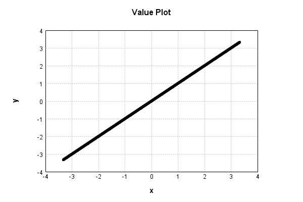

# LinearActivationLayer
## LinearActivationLayerTest
### Json Serialization
Code from [StandardLayerTests.java:69](../../../../../../../src/main/java/com/simiacryptus/mindseye/test/StandardLayerTests.java#L69) executed in 0.00 seconds: 
```java
    JsonObject json = layer.getJson();
    NNLayer echo = NNLayer.fromJson(json);
    if ((echo == null)) throw new AssertionError("Failed to deserialize");
    if ((layer == echo)) throw new AssertionError("Serialization did not copy");
    if ((!layer.equals(echo))) throw new AssertionError("Serialization not equal");
    return new GsonBuilder().setPrettyPrinting().create().toJson(json);
```

Returns: 

```
    {
      "class": "com.simiacryptus.mindseye.layers.java.LinearActivationLayer",
      "id": "efa4d379-78fb-4bb1-a8ad-f41e39e95efc",
      "isFrozen": false,
      "name": "LinearActivationLayer/efa4d379-78fb-4bb1-a8ad-f41e39e95efc",
      "weights": [
        1.0,
        0.0
      ]
    }
```


### Example Input/Output Pair
Code from [StandardLayerTests.java:153](../../../../../../../src/main/java/com/simiacryptus/mindseye/test/StandardLayerTests.java#L153) executed in 0.00 seconds: 
```java
    SimpleEval eval = SimpleEval.run(layer, inputPrototype);
    return String.format("--------------------\nInput: \n[%s]\n--------------------\nOutput: \n%s\n--------------------\nDerivative: \n%s",
      Arrays.stream(inputPrototype).map(t -> t.prettyPrint()).reduce((a, b) -> a + ",\n" + b).get(),
      eval.getOutput().prettyPrint(),
      Arrays.stream(eval.getDerivative()).map(t -> t.prettyPrint()).reduce((a, b) -> a + ",\n" + b).get());
```

Returns: 

```
    --------------------
    Input: 
    [[
    	[ [ 0.508 ], [ -1.88 ], [ 1.62 ] ],
    	[ [ 0.24 ], [ -1.212 ], [ 0.716 ] ]
    ]]
    --------------------
    Output: 
    [
    	[ [ 0.508 ], [ -1.88 ], [ 1.62 ] ],
    	[ [ 0.24 ], [ -1.212 ], [ 0.716 ] ]
    ]
    --------------------
    Derivative: 
    [
    	[ [ 1.0 ], [ 1.0 ], [ 1.0 ] ],
    	[ [ 1.0 ], [ 1.0 ], [ 1.0 ] ]
    ]
```


### Batch Execution
Code from [StandardLayerTests.java:102](../../../../../../../src/main/java/com/simiacryptus/mindseye/test/StandardLayerTests.java#L102) executed in 0.00 seconds: 
```java
    return getBatchingTester().test(layer, inputPrototype);
```

Returns: 

```
    ToleranceStatistics{absoluteTol=0.0000e+00 +- 0.0000e+00 [0.0000e+00 - 0.0000e+00] (120#), relativeTol=0.0000e+00 +- 0.0000e+00 [0.0000e+00 - 0.0000e+00] (120#)}
```


### Differential Validation
Code from [StandardLayerTests.java:110](../../../../../../../src/main/java/com/simiacryptus/mindseye/test/StandardLayerTests.java#L110) executed in 0.00 seconds: 
```java
    return getDerivativeTester().test(layer, inputPrototype);
```
Logging: 
```
    Inputs: [
    	[ [ 1.368 ], [ 0.924 ], [ -1.764 ] ],
    	[ [ 0.252 ], [ 0.792 ], [ 1.188 ] ]
    ]
    Inputs Statistics: {meanExponent=-0.04613353126396375, negative=1, min=1.188, max=1.188, mean=0.46, count=6.0, positive=5, stdDev=1.0543092525440532, zeros=0}
    Output: [
    	[ [ 1.368 ], [ 0.924 ], [ -1.764 ] ],
    	[ [ 0.252 ], [ 0.792 ], [ 1.188 ] ]
    ]
    Outputs Statistics: {meanExponent=-0.04613353126396375, negative=1, min=1.188, max=1.188, mean=0.46, count=6.0, positive=5, stdDev=1.0543092525440532, zeros=0}
    Feedback for input 0
    Inputs Values: [
    	[ [ 1.368 ], [ 0.924 ], [ -1.764 ] ],
    	[ [ 0.252 ], [ 0.792 ], [ 1.188 ] ]
    ]
    Value Statistics: {meanExponent=-0.04613353126396375, negative=1, min=1.188, max=1.188, mean=0.46, count=6.0, positive=5, stdDev=1.0543092525440532, zeros=0}
    Implemented Feedback: [ [ 1.0, 0.0, 0.0, 0.0, 0.0, 0.0 ], [ 0.0, 1.0, 0.0, 0.0, 0.0, 0.0 ], [ 0.0, 0.0, 1.0, 0.0, 0.0, 0.0 ], [ 0.0, 0.0, 0.0, 1.0, 0.0, 0.0 ], [ 0.0, 0.0, 0.0, 0.0, 1.0, 0.0 ], [ 0.0, 0.0, 0.0, 0.0, 0.0, 1.0 ] ]
    Implemented Statis
```
...[skipping 1729 bytes](etc/77.txt)...
```
    99999999998899, 0.9999999999998899, 0.9999999999998899, 0.9999999999998899, 0.9999999999998899 ] ]
    Measured Statistics: {meanExponent=-0.023066765632026837, negative=1, min=0.9999999999998899, max=0.9999999999998899, mean=0.7299999999999436, count=12.0, positive=11, stdDev=0.7928959578657307, zeros=0}
    Gradient Error: [ [ -6.303846333821639E-13, 2.9976021664879227E-14, -7.51620987671231E-14, -5.402345237826012E-13, 3.452793606584237E-13, 8.550937735662956E-13 ], [ -1.1013412404281553E-13, -1.1013412404281553E-13, -1.1013412404281553E-13, -1.1013412404281553E-13, -1.1013412404281553E-13, -1.1013412404281553E-13 ] ]
    Error Statistics: {meanExponent=-12.782776948368719, negative=9, min=-1.1013412404281553E-13, max=-1.1013412404281553E-13, mean=-5.6353070358265235E-14, count=12.0, positive=3, stdDev=3.6295756838229667E-13, zeros=0}
    Finite-Difference Derivative Accuracy:
    absoluteTol: 7.9120e-14 +- 1.7025e-13 [0.0000e+00 - 8.5509e-13] (48#)
    relativeTol: 9.9454e-14 +- 9.7765e-14 [4.0672e-14 - 3.5989e-13] (18#)
    
```

Returns: 

```
    ToleranceStatistics{absoluteTol=7.9120e-14 +- 1.7025e-13 [0.0000e+00 - 8.5509e-13] (48#), relativeTol=9.9454e-14 +- 9.7765e-14 [4.0672e-14 - 3.5989e-13] (18#)}
```


### Performance
Code from [StandardLayerTests.java:120](../../../../../../../src/main/java/com/simiacryptus/mindseye/test/StandardLayerTests.java#L120) executed in 0.00 seconds: 
```java
    getPerformanceTester().test(layer, permPrototype);
```
Logging: 
```
    Evaluation performance: 0.000133s +- 0.000039s [0.000095s - 0.000204s]
    Learning performance: 0.000221s +- 0.000046s [0.000170s - 0.000304s]
    
```

### Function Plots
Code from [ActivationLayerTestBase.java:103](../../../../../../../src/test/java/com/simiacryptus/mindseye/layers/java/ActivationLayerTestBase.java#L103) executed in 0.00 seconds: 
```java
    return plot("Value Plot", plotData, x -> new double[]{x[0], x[1]});
```

Returns: 




Code from [ActivationLayerTestBase.java:107](../../../../../../../src/test/java/com/simiacryptus/mindseye/layers/java/ActivationLayerTestBase.java#L107) executed in 0.00 seconds: 
```java
    return plot("Derivative Plot", plotData, x -> new double[]{x[0], x[2]});
```

Returns: 


