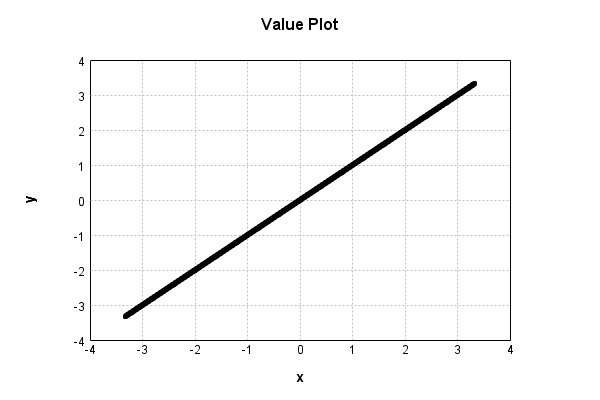

# LinearActivationLayer
## LinearActivationLayerTest
### Json Serialization
Code from [LayerTestBase.java:84](../../../../../../../../MindsEye/src/test/java/com/simiacryptus/mindseye/layers/LayerTestBase.java#L84) executed in 0.00 seconds: 
```java
    JsonObject json = layer.getJson();
    NNLayer echo = NNLayer.fromJson(json);
    assert (echo != null) : "Failed to deserialize";
    assert (layer != echo) : "Serialization did not copy";
    Assert.assertEquals("Serialization not equal", layer, echo);
    return new GsonBuilder().setPrettyPrinting().create().toJson(json);
```

Returns: 

```
    {
      "class": "com.simiacryptus.mindseye.layers.java.LinearActivationLayer",
      "id": "c88cbdf1-1c2a-4a5e-b964-890900000f7a",
      "isFrozen": false,
      "name": "LinearActivationLayer/c88cbdf1-1c2a-4a5e-b964-890900000f7a",
      "weights": {
        "dimensions": [
          2
        ],
        "data": [
          1.0,
          0.0
        ]
      }
    }
```


### Example Input/Output Pair
Code from [LayerTestBase.java:121](../../../../../../../../MindsEye/src/test/java/com/simiacryptus/mindseye/layers/LayerTestBase.java#L121) executed in 0.00 seconds: 
```java
    SimpleEval eval = SimpleEval.run(layer, inputPrototype);
    return String.format("--------------------\nInput: \n[%s]\n--------------------\nOutput: \n%s",
      Arrays.stream(inputPrototype).map(t->t.prettyPrint()).reduce((a,b)->a+",\n"+b).get(),
      eval.getOutput().prettyPrint());
```

Returns: 

```
    --------------------
    Input: 
    [[ -0.54, -1.404, -1.624 ]]
    --------------------
    Output: 
    [ -0.54, -1.404, -1.624 ]
```


### Differential Validation
Code from [LayerTestBase.java:139](../../../../../../../../MindsEye/src/test/java/com/simiacryptus/mindseye/layers/LayerTestBase.java#L139) executed in 0.00 seconds: 
```java
    getDerivativeTester().test(layer, inputPrototype);
```
Logging: 
```
    Component: LinearActivationLayer/c88cbdf1-1c2a-4a5e-b964-890900000f7a
    Inputs: [ -0.54, -1.404, -1.624 ]
    output=[ -0.54, -1.404, -1.624 ]
    measured/actual: [ [ 0.9999999999998899, 0.0, 0.0 ], [ 0.0, 0.9999999999998899, 0.0 ], [ 0.0, 0.0, 0.9999999999998899 ] ]
    implemented/expected: [ [ 1.0, 0.0, 0.0 ], [ 0.0, 1.0, 0.0 ], [ 0.0, 0.0, 1.0 ] ]
    error: [ [ -1.1013412404281553E-13, 0.0, 0.0 ], [ 0.0, -1.1013412404281553E-13, 0.0 ], [ 0.0, 0.0, -1.1013412404281553E-13 ] ]
    Component: LinearActivationLayer/c88cbdf1-1c2a-4a5e-b964-890900000f7a
    Inputs: [ -0.54, -1.404, -1.624 ]
    Outputs: [ -0.54, -1.404, -1.624 ]
    Measured Gradient: [ [ -0.5399999999999849, -1.404000000000405, -1.6240000000000698 ], [ 0.9999999999998899, 0.9999999999998899, 0.9999999999998899 ] ]
    Implemented Gradient: [ [ -0.54, -1.404, -1.624 ], [ 1.0, 1.0, 1.0 ] ]
    Error: [ [ 1.509903313490213E-14, -4.050093593832571E-13, -6.972200594645983E-14 ], [ -1.1013412404281553E-13, -1.1013412404281553E-13, -1.1013412404281553E-13 ] ]
    Finite-Difference Derivative Accuracy:
    absoluteTol: 7.6709e-14 +- 1.0120e-13 [0.0000e+00 - 4.0501e-13] (15#)
    relativeTol: 5.6676e-14 +- 3.4552e-14 [1.3981e-14 - 1.4423e-13] (9#)
    
```

### Performance
Code from [LayerTestBase.java:144](../../../../../../../../MindsEye/src/test/java/com/simiacryptus/mindseye/layers/LayerTestBase.java#L144) executed in 0.00 seconds: 
```java
    getPerformanceTester().test(layer, inputPrototype);
```
Logging: 
```
    Evaluation performance: 0.1525 +- 0.0327 [0.1140 - 0.3163]
    Learning performance: 0.0383 +- 0.0147 [0.0285 - 0.1282]
    
```

### Function Plots
Code from [ActivationLayerTestBase.java:73](../../../../../../../../MindsEye/src/test/java/com/simiacryptus/mindseye/layers/java/ActivationLayerTestBase.java#L73) executed in 0.01 seconds: 
```java
    return plot("Value Plot", plotData, x -> new double[]{x[0], x[1]});
```

Returns: 




Code from [ActivationLayerTestBase.java:77](../../../../../../../../MindsEye/src/test/java/com/simiacryptus/mindseye/layers/java/ActivationLayerTestBase.java#L77) executed in 0.00 seconds: 
```java
    return plot("Derivative Plot", plotData, x -> new double[]{x[0], x[2]});
```

Returns: 


