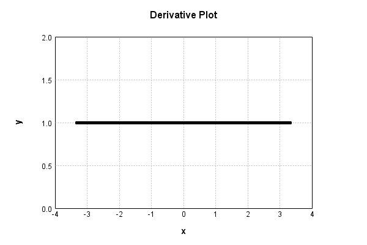

# LinearActivationLayer
## LinearActivationLayerTest
### Json Serialization
Code from [StandardLayerTests.java:68](../../../../../../../src/main/java/com/simiacryptus/mindseye/test/StandardLayerTests.java#L68) executed in 0.00 seconds: 
```java
    JsonObject json = layer.getJson();
    NNLayer echo = NNLayer.fromJson(json);
    if ((echo == null)) throw new AssertionError("Failed to deserialize");
    if ((layer == echo)) throw new AssertionError("Serialization did not copy");
    if ((!layer.equals(echo))) throw new AssertionError("Serialization not equal");
    return new GsonBuilder().setPrettyPrinting().create().toJson(json);
```

Returns: 

```
    {
      "class": "com.simiacryptus.mindseye.layers.java.LinearActivationLayer",
      "id": "cd49cd92-e4b5-4a1b-a7a7-834caedaa244",
      "isFrozen": false,
      "name": "LinearActivationLayer/cd49cd92-e4b5-4a1b-a7a7-834caedaa244",
      "weights": [
        1.0,
        0.0
      ]
    }
```


### Example Input/Output Pair
Code from [StandardLayerTests.java:152](../../../../../../../src/main/java/com/simiacryptus/mindseye/test/StandardLayerTests.java#L152) executed in 0.00 seconds: 
```java
    SimpleEval eval = SimpleEval.run(layer, inputPrototype);
    return String.format("--------------------\nInput: \n[%s]\n--------------------\nOutput: \n%s\n--------------------\nDerivative: \n%s",
      Arrays.stream(inputPrototype).map(t -> t.prettyPrint()).reduce((a, b) -> a + ",\n" + b).get(),
      eval.getOutput().prettyPrint(),
      Arrays.stream(eval.getDerivative()).map(t -> t.prettyPrint()).reduce((a, b) -> a + ",\n" + b).get());
```

Returns: 

```
    --------------------
    Input: 
    [[
    	[ [ -1.176 ], [ 1.424 ], [ -1.272 ] ],
    	[ [ -1.104 ], [ -0.364 ], [ 1.976 ] ]
    ]]
    --------------------
    Output: 
    [
    	[ [ -1.176 ], [ 1.424 ], [ -1.272 ] ],
    	[ [ -1.104 ], [ -0.364 ], [ 1.976 ] ]
    ]
    --------------------
    Derivative: 
    [
    	[ [ 1.0 ], [ 1.0 ], [ 1.0 ] ],
    	[ [ 1.0 ], [ 1.0 ], [ 1.0 ] ]
    ]
```


### Batch Execution
Code from [StandardLayerTests.java:101](../../../../../../../src/main/java/com/simiacryptus/mindseye/test/StandardLayerTests.java#L101) executed in 0.00 seconds: 
```java
    return getBatchingTester().test(layer, inputPrototype);
```

Returns: 

```
    ToleranceStatistics{absoluteTol=0.0000e+00 +- 0.0000e+00 [0.0000e+00 - 0.0000e+00] (120#), relativeTol=0.0000e+00 +- 0.0000e+00 [0.0000e+00 - 0.0000e+00] (120#)}
```


### Differential Validation
Code from [StandardLayerTests.java:109](../../../../../../../src/main/java/com/simiacryptus/mindseye/test/StandardLayerTests.java#L109) executed in 0.00 seconds: 
```java
    return getDerivativeTester().test(layer, inputPrototype);
```
Logging: 
```
    Inputs: [
    	[ [ 0.144 ], [ -1.872 ], [ 0.848 ] ],
    	[ [ 1.04 ], [ -0.78 ], [ 1.596 ] ]
    ]
    Inputs Statistics: {meanExponent=-0.08812916370699642, negative=2, min=1.596, max=1.596, mean=0.16266666666666665, count=6.0, positive=4, stdDev=1.177757567960779, zeros=0}
    Output: [
    	[ [ 0.144 ], [ -1.872 ], [ 0.848 ] ],
    	[ [ 1.04 ], [ -0.78 ], [ 1.596 ] ]
    ]
    Outputs Statistics: {meanExponent=-0.08812916370699642, negative=2, min=1.596, max=1.596, mean=0.16266666666666665, count=6.0, positive=4, stdDev=1.177757567960779, zeros=0}
    Feedback for input 0
    Inputs Values: [
    	[ [ 0.144 ], [ -1.872 ], [ 0.848 ] ],
    	[ [ 1.04 ], [ -0.78 ], [ 1.596 ] ]
    ]
    Value Statistics: {meanExponent=-0.08812916370699642, negative=2, min=1.596, max=1.596, mean=0.16266666666666665, count=6.0, positive=4, stdDev=1.177757567960779, zeros=0}
    Implemented Feedback: [ [ 1.0, 0.0, 0.0, 0.0, 0.0, 0.0 ], [ 0.0, 1.0, 0.0, 0.0, 0.0, 0.0 ], [ 0.0, 0.0, 1.0, 0.0, 0.0, 0.0 ], [ 0.0, 0.0, 0.0, 1.0, 0.0, 0.0 ], [ 0.0, 0.0, 0.0, 0.0, 1.0, 0.0 ], [ 0.0, 0.0, 0.0
```
...[skipping 1785 bytes](etc/119.txt)...
```
    99999998899, 0.9999999999998899, 0.9999999999998899, 0.9999999999998899, 0.9999999999998899 ] ]
    Measured Statistics: {meanExponent=-0.0440645818535664, negative=2, min=0.9999999999998899, max=0.9999999999998899, mean=0.5813333333330496, count=12.0, positive=10, stdDev=0.9321149189999232, zeros=0}
    Gradient Error: [ [ -2.250977182427505E-14, -1.1803891197814664E-12, -5.397904345727511E-13, -2.2493118478905672E-13, -4.007905118896815E-14, -7.354117315117037E-13 ], [ -1.1013412404281553E-13, -1.1013412404281553E-13, -1.1013412404281553E-13, -1.1013412404281553E-13, -1.1013412404281553E-13, -1.1013412404281553E-13 ] ]
    Error Statistics: {meanExponent=-12.814195788111254, negative=12, min=-1.1013412404281553E-13, max=-1.1013412404281553E-13, mean=-2.8365966982709284E-13, count=12.0, positive=0, stdDev=3.397858532096883E-13, zeros=0}
    Finite-Difference Derivative Accuracy:
    absoluteTol: 8.4682e-14 +- 2.0815e-13 [0.0000e+00 - 1.1804e-12] (48#)
    relativeTol: 1.0271e-13 +- 1.2244e-13 [2.3632e-14 - 5.6749e-13] (18#)
    
```

Returns: 

```
    ToleranceStatistics{absoluteTol=8.4682e-14 +- 2.0815e-13 [0.0000e+00 - 1.1804e-12] (48#), relativeTol=1.0271e-13 +- 1.2244e-13 [2.3632e-14 - 5.6749e-13] (18#)}
```


### Performance
Code from [StandardLayerTests.java:119](../../../../../../../src/main/java/com/simiacryptus/mindseye/test/StandardLayerTests.java#L119) executed in 0.20 seconds: 
```java
    getPerformanceTester().test(layer, permPrototype);
```
Logging: 
```
    100 batches
    Input Dimensions:
    	[100, 100, 1]
    Performance:
    	Evaluation performance: 0.010209s +- 0.000193s [0.009973s - 0.010528s]
    	Learning performance: 0.020124s +- 0.008351s [0.014634s - 0.036399s]
    
```

### Function Plots
Code from [ActivationLayerTestBase.java:110](../../../../../../../src/test/java/com/simiacryptus/mindseye/layers/java/ActivationLayerTestBase.java#L110) executed in 0.00 seconds: 
```java
    return plot("Value Plot", plotData, x -> new double[]{x[0], x[1]});
```

Returns: 


Code from [ActivationLayerTestBase.java:114](../../../../../../../src/test/java/com/simiacryptus/mindseye/layers/java/ActivationLayerTestBase.java#L114) executed in 0.00 seconds: 
```java
    return plot("Derivative Plot", plotData, x -> new double[]{x[0], x[2]});
```

Returns: 




