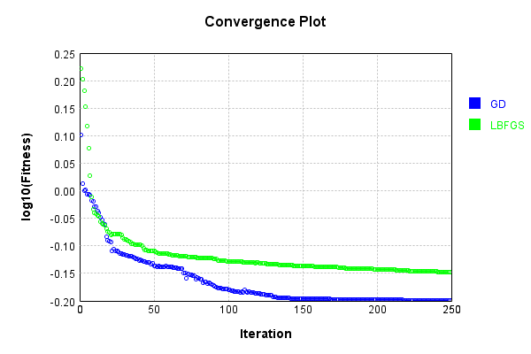
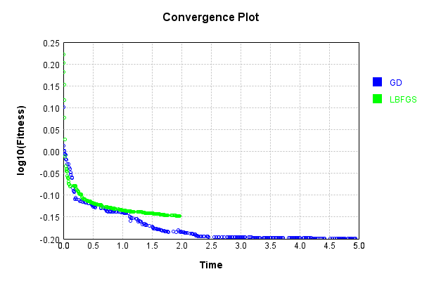
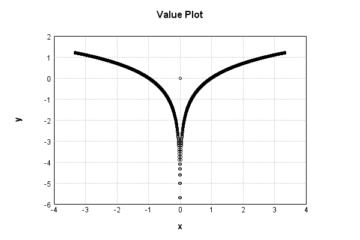
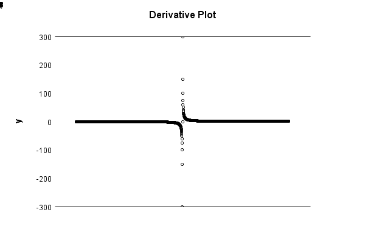

# LogActivationLayer
## LogActivationLayerTest
### Json Serialization
Code from [JsonTest.java:36](../../../../../../../src/main/java/com/simiacryptus/mindseye/test/unit/JsonTest.java#L36) executed in 0.00 seconds: 
```java
    JsonObject json = layer.getJson();
    NNLayer echo = NNLayer.fromJson(json);
    if ((echo == null)) throw new AssertionError("Failed to deserialize");
    if ((layer == echo)) throw new AssertionError("Serialization did not copy");
    if ((!layer.equals(echo))) throw new AssertionError("Serialization not equal");
    return new GsonBuilder().setPrettyPrinting().create().toJson(json);
```

Returns: 

```
    {
      "class": "com.simiacryptus.mindseye.layers.java.LogActivationLayer",
      "id": "dda8ea62-6c7a-4a8f-b21a-4255d54ba0e1",
      "isFrozen": true,
      "name": "LogActivationLayer/dda8ea62-6c7a-4a8f-b21a-4255d54ba0e1"
    }
```


### Example Input/Output Pair
Code from [ReferenceIO.java:68](../../../../../../../src/main/java/com/simiacryptus/mindseye/test/unit/ReferenceIO.java#L68) executed in 0.00 seconds: 
```java
    SimpleEval eval = SimpleEval.run(layer, inputPrototype);
    return String.format("--------------------\nInput: \n[%s]\n--------------------\nOutput: \n%s\n--------------------\nDerivative: \n%s",
      Arrays.stream(inputPrototype).map(t -> t.prettyPrint()).reduce((a, b) -> a + ",\n" + b).get(),
      eval.getOutput().prettyPrint(),
      Arrays.stream(eval.getDerivative()).map(t -> t.prettyPrint()).reduce((a, b) -> a + ",\n" + b).get());
```

Returns: 

```
    --------------------
    Input: 
    [[
    	[ [ 1.188 ], [ 0.176 ], [ 0.324 ] ],
    	[ [ 1.316 ], [ -1.656 ], [ 1.668 ] ]
    ]]
    --------------------
    Output: 
    [
    	[ [ 0.17227122094045313 ], [ -1.7372712839439852 ], [ -1.1270117631898076 ] ],
    	[ [ 0.2745968329031255 ], [ 0.504405055963068 ], [ 0.5116253039365549 ] ]
    ]
    --------------------
    Derivative: 
    [
    	[ [ 0.8417508417508418 ], [ 5.6818181818181825 ], [ 3.0864197530864197 ] ],
    	[ [ 0.7598784194528875 ], [ -0.6038647342995169 ], [ 0.5995203836930456 ] ]
    ]
```


### Batch Execution
Code from [BatchingTester.java:66](../../../../../../../src/main/java/com/simiacryptus/mindseye/test/unit/BatchingTester.java#L66) executed in 0.00 seconds: 
```java
    return test(reference, inputPrototype);
```

Returns: 

```
    ToleranceStatistics{absoluteTol=0.0000e+00 +- 0.0000e+00 [0.0000e+00 - 0.0000e+00] (120#), relativeTol=0.0000e+00 +- 0.0000e+00 [0.0000e+00 - 0.0000e+00] (120#)}
```


Code from [SingleDerivativeTester.java:77](../../../../../../../src/main/java/com/simiacryptus/mindseye/test/unit/SingleDerivativeTester.java#L77) executed in 0.00 seconds: 
```java
    return test(component, inputPrototype);
```
Logging: 
```
    Inputs: [
    	[ [ -1.056 ], [ -0.956 ], [ -0.312 ] ],
    	[ [ -0.912 ], [ 0.968 ], [ -0.76 ] ]
    ]
    Inputs Statistics: {meanExponent=-0.11250663459834376, negative=5, min=-0.76, max=-0.76, mean=-0.5046666666666666, count=6.0, positive=1, stdDev=0.7005537492266783, zeros=0}
    Output: [
    	[ [ 0.054488185284069776 ], [ -0.044997365930735805 ], [ -1.1647520911726548 ] ],
    	[ [ -0.09211528890780563 ], [ -0.03252319170556006 ], [ -0.2744368457017603 ] ]
    ]
    Outputs Statistics: {meanExponent=-0.9382182947972456, negative=5, min=-0.2744368457017603, max=-0.2744368457017603, mean=-0.25905609968907445, count=6.0, positive=1, stdDev=0.4171009768186937, zeros=0}
    Feedback for input 0
    Inputs Values: [
    	[ [ -1.056 ], [ -0.956 ], [ -0.312 ] ],
    	[ [ -0.912 ], [ 0.968 ], [ -0.76 ] ]
    ]
    Value Statistics: {meanExponent=-0.11250663459834376, negative=5, min=-0.76, max=-0.76, mean=-0.5046666666666666, count=6.0, positive=1, stdDev=0.7005537492266783, zeros=0}
    Implemented Feedback: [ [ -0.9469696969696969, 0.0, 0.0, 0.0, 0.0, 0.0 ], [ 0.0, 
```
...[skipping 687 bytes](etc/329.txt)...
```
    0, 0.0, -3.205128251693168, 0.0 ], [ 0.0, 0.0, 0.0, 0.0, 0.0, -1.3157894884763266 ] ]
    Measured Statistics: {meanExponent=0.1125066378853266, negative=5, min=-1.3157894884763266, max=-1.3157894884763266, mean=-0.18270405389215266, count=36.0, positive=1, stdDev=0.6468484072390817, zeros=30}
    Feedback Error: [ [ 1.2554132178266286E-9, 0.0, 0.0, 0.0, 0.0, 0.0 ], [ 0.0, -1.1401577681979802E-8, 0.0, 0.0, 0.0, 0.0 ], [ 0.0, 0.0, -1.1228118435013812E-8, 0.0, 0.0, 0.0 ], [ 0.0, 0.0, 0.0, -1.7100565408156854E-10, 0.0, 0.0 ], [ 0.0, 0.0, 0.0, 0.0, -4.656496255250886E-8, 0.0 ], [ 0.0, 0.0, 0.0, 0.0, 0.0, -1.4792115976547393E-8 ] ]
    Error Statistics: {meanExponent=-8.287140222722082, negative=5, min=-1.4792115976547393E-8, max=-1.4792115976547393E-8, mean=-2.3028435300640222E-9, count=36.0, positive=1, stdDev=8.256080546125185E-9, zeros=30}
    Finite-Difference Derivative Accuracy:
    absoluteTol: 2.3726e-09 +- 8.2363e-09 [0.0000e+00 - 4.6565e-08] (36#)
    relativeTol: 4.0328e-09 +- 2.6790e-09 [8.2767e-11 - 7.2641e-09] (6#)
    
```

Returns: 

```
    ToleranceStatistics{absoluteTol=2.3726e-09 +- 8.2363e-09 [0.0000e+00 - 4.6565e-08] (36#), relativeTol=4.0328e-09 +- 2.6790e-09 [8.2767e-11 - 7.2641e-09] (6#)}
```


### Performance
Now we execute larger-scale runs to benchmark performance:

Code from [PerformanceTester.java:66](../../../../../../../src/main/java/com/simiacryptus/mindseye/test/unit/PerformanceTester.java#L66) executed in 0.23 seconds: 
```java
    test(component, inputPrototype);
```
Logging: 
```
    100 batches
    Input Dimensions:
    	[100, 100, 1]
    Performance:
    	Evaluation performance: 0.024223s +- 0.021904s [0.008301s - 0.065144s]
    	Learning performance: 0.013616s +- 0.002123s [0.011902s - 0.017469s]
    
```

### Input Learning
In this test, we use a network to learn this target input, given it's pre-evaluated output:

Code from [LearningTester.java:127](../../../../../../../src/main/java/com/simiacryptus/mindseye/test/unit/LearningTester.java#L127) executed in 0.00 seconds: 
```java
    return Arrays.stream(input_target).map(x -> x.prettyPrint()).reduce((a, b) -> a + "\n" + b).orElse("");
```

Returns: 

```
    [
    	[ [ 0.148 ], [ 0.128 ], [ -1.424 ], [ -0.408 ], [ 0.836 ], [ 1.912 ], [ -1.22 ], [ -1.828 ], ... ],
    	[ [ 1.136 ], [ -0.76 ], [ -1.656 ], [ -1.468 ], [ 0.716 ], [ 0.632 ], [ -0.644 ], [ -1.024 ], ... ],
    	[ [ 1.02 ], [ -0.336 ], [ 1.168 ], [ 1.82 ], [ 1.296 ], [ 0.992 ], [ 0.68 ], [ 0.628 ], ... ],
    	[ [ -1.664 ], [ 0.064 ], [ -1.408 ], [ 0.656 ], [ 1.844 ], [ 0.536 ], [ 1.156 ], [ -0.584 ], ... ],
    	[ [ -1.216 ], [ 0.588 ], [ -1.192 ], [ -1.272 ], [ 1.584 ], [ 0.32 ], [ -1.804 ], [ -1.576 ], ... ],
    	[ [ -1.536 ], [ -1.488 ], [ 0.708 ], [ 1.448 ], [ 1.352 ], [ -1.516 ], [ -1.836 ], [ -1.68 ], ... ],
    	[ [ -1.416 ], [ 1.128 ], [ 1.4 ], [ -1.148 ], [ 1.056 ], [ 1.12 ], [ 0.376 ], [ 0.892 ], ... ],
    	[ [ 0.924 ], [ -0.784 ], [ 1.912 ], [ 0.112 ], [ -1.66 ], [ -0.328 ], [ 0.224 ], [ 0.8 ], ... ],
    	...
    ]
```


First, we use a conjugate gradient descent method, which converges the fastest for purely linear functions.

Code from [LearningTester.java:300](../../../../../../../src/main/java/com/simiacryptus/mindseye/test/unit/LearningTester.java#L300) executed in 5.00 seconds: 
```java
    return new IterativeTrainer(trainable)
      .setLineSearchFactory(label -> new QuadraticSearch())
      .setOrientation(new GradientDescent())
      .setMonitor(monitor)
      .setTimeout(30, TimeUnit.SECONDS)
      .setMaxIterations(250)
      .setTerminateThreshold(0)
      .run();
```
Logging: 
```
    Constructing line search parameters: GD
    F(0.0) = LineSearchPoint{point=PointSample{avg=1.9488754822744507}, derivative=-1.978443134684752}
    New Minimum: 1.9488754822744507 > 1.9488754820766032
    F(1.0E-10) = LineSearchPoint{point=PointSample{avg=1.9488754820766032}, derivative=-1.978443122804809}, delta = -1.9784751614793095E-10
    New Minimum: 1.9488754820766032 > 1.948875480889537
    F(7.000000000000001E-10) = LineSearchPoint{point=PointSample{avg=1.948875480889537}, derivative=-1.9784430515251528}, delta = -1.384913739244098E-9
    New Minimum: 1.948875480889537 > 1.9488754725800748
    F(4.900000000000001E-9) = LineSearchPoint{point=PointSample{avg=1.9488754725800748}, derivative=-1.9784425525677274}, delta = -9.694375968649638E-9
    New Minimum: 1.9488754725800748 > 1.9488754144139202
    F(3.430000000000001E-8) = LineSearchPoint{point=PointSample{avg=1.9488754144139202}, derivative=-1.9784390598739274}, delta = -6.786053052820762E-8
    New Minimum: 1.9488754144139202 > 1.9488750072536738
    F(2.4010000000000004E-7) = Line
```
...[skipping 425532 bytes](etc/330.txt)...
```
    090677578587E-5
    F(0.32690892203663735) = LineSearchPoint{point=PointSample{avg=0.631394700866346}, derivative=0.001049217610638416}, delta = 2.340002972611721E-5
    F(0.02514684015666441) = LineSearchPoint{point=PointSample{avg=0.6313597159665351}, derivative=-4.3507793429377036E-4}, delta = -1.1584870084790921E-5
    F(0.17602788109665088) = LineSearchPoint{point=PointSample{avg=0.6313247373105136}, derivative=2.605144938976035E-5}, delta = -4.6563526106213615E-5
    0.6313247373105136 <= 0.6313713008366199
    F(0.16706135738152766) = LineSearchPoint{point=PointSample{avg=0.6313246747141776}, derivative=-1.1799092448336335E-5}, delta = -4.662612244221709E-5
    Left bracket at 0.16706135738152766
    F(0.16985647832609638) = LineSearchPoint{point=PointSample{avg=0.6313246579255629}, derivative=-1.8606798464603408E-7}, delta = -4.664291105693774E-5
    Left bracket at 0.16985647832609638
    Converged to left
    Iteration 250 complete. Error: 0.6312208477862128 Total: 249803984692507.0300; Orientation: 0.0003; Line Search: 0.0163
    
```

Returns: 

```
    0.6313246579255629
```


This training run resulted in the following regressed input:

Code from [LearningTester.java:144](../../../../../../../src/main/java/com/simiacryptus/mindseye/test/unit/LearningTester.java#L144) executed in 0.00 seconds: 
```java
    return Arrays.stream(input_gd).map(x -> x.prettyPrint()).reduce((a, b) -> a + "\n" + b).orElse("");
```

Returns: 

```
    [
    	[ [ -0.1730157370847295 ], [ -0.13149706809022862 ], [ 1.12170956304763 ], [ 0.42527862057729554 ], [ -0.7722173739919055 ], [ -1.326942564696066 ], [ -1.7036036879886396 ], [ -1.1595366974014532 ], ... ],
    	[ [ 0.936944043119912 ], [ -1.4838965328533267 ], [ 1.8734489861555743 ], [ -1.0676862579878956 ], [ -0.6783108616586778 ], [ -0.900657035787704 ], [ -0.6242359764179153 ], [ -1.1849280165412823 ], ... ],
    	[ [ -0.8795395237633592 ], [ -0.3362349690224218 ], [ -0.9372709646699179 ], [ 1.7405284575212843 ], [ -1.5976368601135036 ], [ 0.8509779045701763 ], [ 0.9238029241659109 ], [ 0.6712138774343583 ], ... ],
    	[ [ 1.3849219881457755 ], [ 0.06400057116435277 ], [ -1.5101614799837404 ], [ -0.6728319203760099 ], [ -1.92647943614503 ], [ -0.8218430118322608 ], [ -1.0008763175445567 ], [ -1.3448226752189805 ], ... ],
    	[ [ 0.957520240027898 ], [ 0.5947223350857836 ], [ 1.1239860677584221 ], [ -1.3818156627621307 ], [ -1.088042819799904 ], [ -1.046334528133724 ], [ 1.1601312743724272 ], [ 1.4828441171543132 ], ... ],
    	[ [ -1.8648142036650155 ], [ 1.1595193143806002 ], [ 0.9053778532919519 ], [ 1.1792397753734725 ], [ 1.4785380741628096 ], [ -1.304077537183114 ], [ -1.158699546053513 ], [ -1.1363759228704706 ], ... ],
    	[ [ -1.380105912601471 ], [ -0.9695012495476979 ], [ -1.2731875916969033 ], [ 0.9566762473725283 ], [ -1.4395814516668042 ], [ 1.2323413299978987 ], [ -0.4033654820499153 ], [ 0.8076929477051865 ], ... ],
    	[ [ -2.16589783082478 ], [ -0.7268131261668426 ], [ 1.9219132420603682 ], [ -0.1119999990362773 ], [ -1.4212237287778697 ], [ 0.3397893039605241 ], [ 0.22399999963064607 ], [ -1.1147379886656694 ], ... ],
    	...
    ]
```


Next, we run the same optimization using L-BFGS, which is nearly ideal for purely second-order or quadratic functions.

Code from [LearningTester.java:324](../../../../../../../src/main/java/com/simiacryptus/mindseye/test/unit/LearningTester.java#L324) executed in 1.98 seconds: 
```java
    return new IterativeTrainer(trainable)
      .setLineSearchFactory(label -> new ArmijoWolfeSearch())
      .setOrientation(new LBFGS())
      .setMonitor(monitor)
      .setTimeout(30, TimeUnit.SECONDS)
      .setMaxIterations(250)
      .setTerminateThreshold(0)
      .run();
```
Logging: 
```
    LBFGS Accumulation History: 1 points
    Constructing line search parameters: GD
    th(0)=1.9488754822744507;dx=-1.978443134684752
    New Minimum: 1.9488754822744507 > 1.6682675070078512
    END: th(2.154434690031884)=1.6682675070078512; dx=-0.04485639865081996 delta=0.28060797526659953
    Iteration 1 complete. Error: 1.6682675070078512 Total: 249803999852218.0000; Orientation: 0.0005; Line Search: 0.0031
    LBFGS Accumulation History: 1 points
    th(0)=1.6682675070078512;dx=-0.01839316603911639
    New Minimum: 1.6682675070078512 > 1.5971551167794475
    END: th(4.641588833612779)=1.5971551167794475; dx=-0.0103375090362747 delta=0.07111239022840365
    Iteration 2 complete. Error: 1.5971551167794475 Total: 249804004037695.0000; Orientation: 0.0005; Line Search: 0.0028
    LBFGS Accumulation History: 1 points
    th(0)=1.5971551167794475;dx=-0.21041323951138122
    New Minimum: 1.5971551167794475 > 1.5186989317055652
    END: th(10.000000000000002)=1.5186989317055652; dx=-0.007040050861793638 delta=0.0784561850738823
    Iteration 3 complete. Error
```
...[skipping 128974 bytes](etc/331.txt)...
```
    ; Line Search: 0.0060
    LBFGS Accumulation History: 1 points
    th(0)=0.7116522694997172;dx=-5.57599472619791E-4
    New Minimum: 0.7116522694997172 > 0.7115376423944776
    END: th(0.26120393327195957)=0.7115376423944776; dx=-2.395779003927168E-4 delta=1.1462710523957309E-4
    Iteration 249 complete. Error: 0.7115376423944776 Total: 249805962003666.0300; Orientation: 0.0005; Line Search: 0.0029
    LBFGS Accumulation History: 1 points
    th(0)=0.7115376423944776;dx=-0.0012738689291658023
    Armijo: th(0.562746815013883)=0.7115420144388757; dx=2.7778314207748447E-4 delta=-4.37204439807104E-6
    New Minimum: 0.7115376423944776 > 0.7114884492741569
    WOLF (strong): th(0.2813734075069415)=0.7114884492741569; dx=1.173368158277995E-4 delta=4.919312032070078E-5
    New Minimum: 0.7114884492741569 > 0.7114850675911268
    END: th(0.09379113583564717)=0.7114850675911268; dx=-1.8008017484722253E-4 delta=5.257480335074671E-5
    Iteration 250 complete. Error: 0.7114850675911268 Total: 249805969589506.0300; Orientation: 0.0005; Line Search: 0.0061
    
```

Returns: 

```
    0.7114850675911268
```


This training run resulted in the following regressed input:

Code from [LearningTester.java:154](../../../../../../../src/main/java/com/simiacryptus/mindseye/test/unit/LearningTester.java#L154) executed in 0.00 seconds: 
```java
    return Arrays.stream(input_lbgfs).map(x -> x.prettyPrint()).reduce((a, b) -> a + "\n" + b).orElse("");
```

Returns: 

```
    [
    	[ [ -0.796520863761754 ], [ -0.7875018910793068 ], [ 1.0491692761122808 ], [ 0.40538351573598935 ], [ -0.6920402783395333 ], [ -1.2367717956651354 ], [ -1.7613710818245008 ], [ -1.0114063189540954 ], ... ],
    	[ [ 0.8108281104432513 ], [ -1.6148177847947844 ], [ 1.8929465522077071 ], [ -0.9049841329664282 ], [ -0.6374092727306871 ], [ -1.0255654097941034 ], [ -0.5898311945648975 ], [ -1.2235045901810118 ], ... ],
    	[ [ -0.7696166512695168 ], [ -0.34026886892141583 ], [ -0.8271458281981462 ], [ 1.7328075099994533 ], [ -1.636756508599515 ], [ 0.7659078832034673 ], [ 1.029797450252884 ], [ 0.5770149303257244 ], ... ],
    	[ [ 1.3430152303602856 ], [ 0.06399997723549936 ], [ -1.5242535520179403 ], [ -0.6882808325704803 ], [ -1.9332152465115022 ], [ -0.9866093066848699 ], [ -0.9504864675126107 ], [ -1.5229623280157307 ], ... ],
    	[ [ 0.8428620946160673 ], [ 0.6036228272291209 ], [ 1.1068464915650642 ], [ -1.4002341432309438 ], [ -0.9313704872067055 ], [ -1.3578782924002946 ], [ 0.9819484364212756 ], [ 1.470183876638529 ], ... ],
    	[ [ -1.895512733205883 ], [ 1.0870096067810673 ], [ 0.9938586065633968 ], [ 1.1214542590926195 ], [ 1.4969440985804872 ], [ -1.267197953085828 ], [ -1.0010018921411132 ], [ -1.0128707694533199 ], ... ],
    	[ [ -1.3743217232204032 ], [ -0.9137474589138809 ], [ -1.2494067962803341 ], [ 0.8869781426835215 ], [ -1.5040167973043257 ], [ 1.2566197138027646 ], [ -0.5207064787485832 ], [ 0.718015371380774 ], ... ],
    	[ [ -0.7308943580015022 ], [ -0.6788091688263254 ], [ 1.9227128509013243 ], [ 0.3992073184448309 ], [ -1.3869769143664916 ], [ 0.4573667242082779 ], [ 0.22427915369112664 ], [ -1.2063679427258438 ], ... ],
    	...
    ]
```


Code from [LearningTester.java:96](../../../../../../../src/main/java/com/simiacryptus/mindseye/test/unit/LearningTester.java#L96) executed in 0.00 seconds: 
```java
    return TestUtil.compare(runs);
```

Returns: 




Code from [LearningTester.java:99](../../../../../../../src/main/java/com/simiacryptus/mindseye/test/unit/LearningTester.java#L99) executed in 0.00 seconds: 
```java
    return TestUtil.compareTime(runs);
```

Returns: 




### Function Plots
Code from [ActivationLayerTestBase.java:110](../../../../../../../src/test/java/com/simiacryptus/mindseye/layers/java/ActivationLayerTestBase.java#L110) executed in 0.00 seconds: 
```java
    return plot("Value Plot", plotData, x -> new double[]{x[0], x[1]});
```

Returns: 




Code from [ActivationLayerTestBase.java:114](../../../../../../../src/test/java/com/simiacryptus/mindseye/layers/java/ActivationLayerTestBase.java#L114) executed in 0.01 seconds: 
```java
    return plot("Derivative Plot", plotData, x -> new double[]{x[0], x[2]});
```

Returns: 




