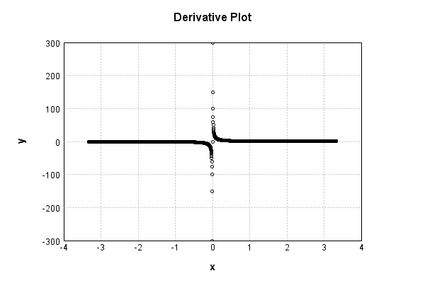

# LogActivationLayer
## LogActivationLayerTest
### Json Serialization
Code from [StandardLayerTests.java:69](../../../../../../../src/main/java/com/simiacryptus/mindseye/test/StandardLayerTests.java#L69) executed in 0.00 seconds: 
```java
    JsonObject json = layer.getJson();
    NNLayer echo = NNLayer.fromJson(json);
    if ((echo == null)) throw new AssertionError("Failed to deserialize");
    if ((layer == echo)) throw new AssertionError("Serialization did not copy");
    if ((!layer.equals(echo))) throw new AssertionError("Serialization not equal");
    return new GsonBuilder().setPrettyPrinting().create().toJson(json);
```

Returns: 

```
    {
      "class": "com.simiacryptus.mindseye.layers.java.LogActivationLayer",
      "id": "c59913b2-6fe1-4e73-be8d-f5675e1ce0e7",
      "isFrozen": true,
      "name": "LogActivationLayer/c59913b2-6fe1-4e73-be8d-f5675e1ce0e7"
    }
```


### Example Input/Output Pair
Code from [StandardLayerTests.java:153](../../../../../../../src/main/java/com/simiacryptus/mindseye/test/StandardLayerTests.java#L153) executed in 0.00 seconds: 
```java
    SimpleEval eval = SimpleEval.run(layer, inputPrototype);
    return String.format("--------------------\nInput: \n[%s]\n--------------------\nOutput: \n%s\n--------------------\nDerivative: \n%s",
      Arrays.stream(inputPrototype).map(t -> t.prettyPrint()).reduce((a, b) -> a + ",\n" + b).get(),
      eval.getOutput().prettyPrint(),
      Arrays.stream(eval.getDerivative()).map(t -> t.prettyPrint()).reduce((a, b) -> a + ",\n" + b).get());
```

Returns: 

```
    --------------------
    Input: 
    [[
    	[ [ 1.816 ], [ -1.692 ], [ 1.656 ] ],
    	[ [ 1.436 ], [ -1.728 ], [ -1.928 ] ]
    ]]
    --------------------
    Output: 
    [
    	[ [ 0.5966362801791015 ], [ 0.5259112611840315 ], [ 0.504405055963068 ] ],
    	[ [ 0.3618614706260324 ], [ 0.5469646703818639 ], [ 0.6564831961883538 ] ]
    ]
    --------------------
    Derivative: 
    [
    	[ [ 0.5506607929515418 ], [ -0.5910165484633569 ], [ 0.6038647342995169 ] ],
    	[ [ 0.6963788300835655 ], [ -0.5787037037037037 ], [ -0.5186721991701245 ] ]
    ]
```


### Batch Execution
Code from [StandardLayerTests.java:102](../../../../../../../src/main/java/com/simiacryptus/mindseye/test/StandardLayerTests.java#L102) executed in 0.00 seconds: 
```java
    return getBatchingTester().test(layer, inputPrototype);
```

Returns: 

```
    ToleranceStatistics{absoluteTol=0.0000e+00 +- 0.0000e+00 [0.0000e+00 - 0.0000e+00] (120#), relativeTol=0.0000e+00 +- 0.0000e+00 [0.0000e+00 - 0.0000e+00] (120#)}
```


### Differential Validation
Code from [StandardLayerTests.java:110](../../../../../../../src/main/java/com/simiacryptus/mindseye/test/StandardLayerTests.java#L110) executed in 0.00 seconds: 
```java
    return getDerivativeTester().test(layer, inputPrototype);
```
Logging: 
```
    Inputs: [
    	[ [ 0.628 ], [ -1.7 ], [ 1.936 ] ],
    	[ [ -1.272 ], [ 1.452 ], [ 1.272 ] ]
    ]
    Inputs Statistics: {meanExponent=0.11437579284611832, negative=2, min=1.272, max=1.272, mean=0.38599999999999995, count=6.0, positive=4, stdDev=1.3834001590284715, zeros=0}
    Output: [
    	[ [ -0.4652151125139384 ], [ 0.5306282510621704 ], [ 0.6606239888543852 ] ],
    	[ [ 0.24059046491793043 ], [ 0.3729419164026043 ], [ 0.24059046491793043 ] ]
    ]
    Outputs Statistics: {meanExponent=-0.4089005760603777, negative=1, min=0.24059046491793043, max=0.24059046491793043, mean=0.2633599956068471, count=6.0, positive=5, stdDev=0.35896095175269427, zeros=0}
    Feedback for input 0
    Inputs Values: [
    	[ [ 0.628 ], [ -1.7 ], [ 1.936 ] ],
    	[ [ -1.272 ], [ 1.452 ], [ 1.272 ] ]
    ]
    Value Statistics: {meanExponent=0.11437579284611832, negative=2, min=1.272, max=1.272, mean=0.38599999999999995, count=6.0, positive=4, stdDev=1.3834001590284715, zeros=0}
    Implemented Feedback: [ [ 1.5923566878980893, 0.0, 0.0, 0.0, 0.0, 0.0 ], [ 0.0, -0.7861635220125786,
```
...[skipping 651 bytes](etc/78.txt)...
```
    0, 0.0, 0.0, 0.0, 0.5165289196362721, 0.0 ], [ 0.0, 0.0, 0.0, 0.0, 0.0, 0.7861635120676169 ] ]
    Measured Statistics: {meanExponent=-0.11437579573947003, negative=2, min=0.7861635120676169, max=0.7861635120676169, mean=0.06137098691892816, count=36.0, positive=4, stdDev=0.36221745337400146, zeros=30}
    Feedback Error: [ [ -2.499945139788906E-9, 0.0, 0.0, 0.0, 0.0, 0.0 ], [ 0.0, 1.6182889472915463E-9, 0.0, 0.0, 0.0, 0.0 ], [ 0.0, 0.0, 3.0962110653121044E-10, 0.0, 0.0, 0.0 ], [ 0.0, 0.0, 0.0, -7.978083527149238E-9, 0.0, 0.0 ], [ 0.0, 0.0, 0.0, 0.0, -5.983562645361928E-9, 0.0 ], [ 0.0, 0.0, 0.0, 0.0, 0.0, -9.94496163198022E-9 ] ]
    Error Statistics: {meanExponent=-8.53762022703024, negative=4, min=-9.94496163198022E-9, max=-9.94496163198022E-9, mean=-6.799623025127093E-10, count=36.0, positive=2, stdDev=2.3014186218323835E-9, zeros=30}
    Finite-Difference Derivative Accuracy:
    absoluteTol: 7.8707e-10 +- 2.2670e-09 [0.0000e+00 - 9.9450e-09] (36#)
    relativeTol: 3.3311e-09 +- 2.6542e-09 [2.6318e-10 - 6.3250e-09] (6#)
    
```

Returns: 

```
    ToleranceStatistics{absoluteTol=7.8707e-10 +- 2.2670e-09 [0.0000e+00 - 9.9450e-09] (36#), relativeTol=3.3311e-09 +- 2.6542e-09 [2.6318e-10 - 6.3250e-09] (6#)}
```


### Performance
Code from [StandardLayerTests.java:120](../../../../../../../src/main/java/com/simiacryptus/mindseye/test/StandardLayerTests.java#L120) executed in 0.00 seconds: 
```java
    getPerformanceTester().test(layer, permPrototype);
```
Logging: 
```
    Evaluation performance: 0.000157s +- 0.000005s [0.000152s - 0.000166s]
    Learning performance: 0.000042s +- 0.000003s [0.000037s - 0.000044s]
    
```

### Function Plots
Code from [ActivationLayerTestBase.java:103](../../../../../../../src/test/java/com/simiacryptus/mindseye/layers/java/ActivationLayerTestBase.java#L103) executed in 0.00 seconds: 
```java
    return plot("Value Plot", plotData, x -> new double[]{x[0], x[1]});
```

Returns: 


Code from [ActivationLayerTestBase.java:107](../../../../../../../src/test/java/com/simiacryptus/mindseye/layers/java/ActivationLayerTestBase.java#L107) executed in 0.01 seconds: 
```java
    return plot("Derivative Plot", plotData, x -> new double[]{x[0], x[2]});
```

Returns: 




