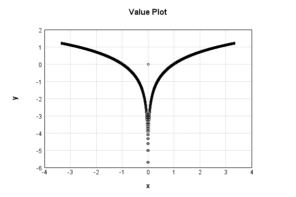
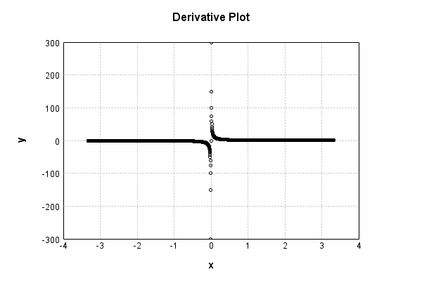

# LogActivationLayer
## LogActivationLayerTest
### Json Serialization
Code from [StandardLayerTests.java:68](../../../../../../../src/main/java/com/simiacryptus/mindseye/test/StandardLayerTests.java#L68) executed in 0.00 seconds: 
```java
    JsonObject json = layer.getJson();
    NNLayer echo = NNLayer.fromJson(json);
    if ((echo == null)) throw new AssertionError("Failed to deserialize");
    if ((layer == echo)) throw new AssertionError("Serialization did not copy");
    if ((!layer.equals(echo))) throw new AssertionError("Serialization not equal");
    return new GsonBuilder().setPrettyPrinting().create().toJson(json);
```

Returns: 

```
    {
      "class": "com.simiacryptus.mindseye.layers.java.LogActivationLayer",
      "id": "5ebcde54-5b15-470f-b25a-1ce075563c39",
      "isFrozen": true,
      "name": "LogActivationLayer/5ebcde54-5b15-470f-b25a-1ce075563c39"
    }
```


### Example Input/Output Pair
Code from [StandardLayerTests.java:152](../../../../../../../src/main/java/com/simiacryptus/mindseye/test/StandardLayerTests.java#L152) executed in 0.00 seconds: 
```java
    SimpleEval eval = SimpleEval.run(layer, inputPrototype);
    return String.format("--------------------\nInput: \n[%s]\n--------------------\nOutput: \n%s\n--------------------\nDerivative: \n%s",
      Arrays.stream(inputPrototype).map(t -> t.prettyPrint()).reduce((a, b) -> a + ",\n" + b).get(),
      eval.getOutput().prettyPrint(),
      Arrays.stream(eval.getDerivative()).map(t -> t.prettyPrint()).reduce((a, b) -> a + ",\n" + b).get());
```

Returns: 

```
    --------------------
    Input: 
    [[
    	[ [ -1.192 ], [ -0.396 ], [ 0.388 ] ],
    	[ [ 1.548 ], [ -0.3 ], [ 1.568 ] ]
    ]]
    --------------------
    Output: 
    [
    	[ [ 0.17563256864315796 ], [ -0.9263410677276565 ], [ -0.9467499393588635 ] ],
    	[ [ 0.4369637751675354 ], [ -1.2039728043259361 ], [ 0.44980092192821614 ] ]
    ]
    --------------------
    Derivative: 
    [
    	[ [ -0.8389261744966443 ], [ -2.525252525252525 ], [ 2.5773195876288657 ] ],
    	[ [ 0.6459948320413437 ], [ -3.3333333333333335 ], [ 0.6377551020408163 ] ]
    ]
```


### Batch Execution
Code from [StandardLayerTests.java:101](../../../../../../../src/main/java/com/simiacryptus/mindseye/test/StandardLayerTests.java#L101) executed in 0.00 seconds: 
```java
    return getBatchingTester().test(layer, inputPrototype);
```

Returns: 

```
    ToleranceStatistics{absoluteTol=0.0000e+00 +- 0.0000e+00 [0.0000e+00 - 0.0000e+00] (120#), relativeTol=0.0000e+00 +- 0.0000e+00 [0.0000e+00 - 0.0000e+00] (120#)}
```


### Differential Validation
Code from [StandardLayerTests.java:109](../../../../../../../src/main/java/com/simiacryptus/mindseye/test/StandardLayerTests.java#L109) executed in 0.00 seconds: 
```java
    return getDerivativeTester().test(layer, inputPrototype);
```
Logging: 
```
    Inputs: [
    	[ [ 0.12 ], [ -1.324 ], [ 0.576 ] ],
    	[ [ 1.8 ], [ 0.804 ], [ -1.156 ] ]
    ]
    Inputs Statistics: {meanExponent=-0.13583698291486904, negative=2, min=-1.156, max=-1.156, mean=0.1366666666666667, count=6.0, positive=4, stdDev=1.0961932108691221, zeros=0}
    Output: [
    	[ [ -2.120263536200091 ], [ 0.2806574575148165 ], [ -0.5516476182862459 ] ],
    	[ [ 0.5877866649021191 ], [ -0.21815600980317063 ], [ 0.14496577025018564 ] ]
    ]
    Outputs Statistics: {meanExponent=-0.36908657390651717, negative=3, min=0.14496577025018564, max=0.14496577025018564, mean=-0.3127762119370644, count=6.0, positive=3, stdDev=0.8856003327528087, zeros=0}
    Feedback for input 0
    Inputs Values: [
    	[ [ 0.12 ], [ -1.324 ], [ 0.576 ] ],
    	[ [ 1.8 ], [ 0.804 ], [ -1.156 ] ]
    ]
    Value Statistics: {meanExponent=-0.13583698291486904, negative=2, min=-1.156, max=-1.156, mean=0.1366666666666667, count=6.0, positive=4, stdDev=1.0961932108691221, zeros=0}
    Implemented Feedback: [ [ 8.333333333333334, 0.0, 0.0, 0.0, 0.0, 0.0 ], [ 0.0, 0.555555555555555
```
...[skipping 649 bytes](etc/120.txt)...
```
     0.0, 0.0, 0.0, 0.0, 1.736111099326365, 0.0 ], [ 0.0, 0.0, 0.0, 0.0, 0.0, -0.865051899556768 ] ]
    Measured Statistics: {meanExponent=0.13583697709317621, negative=2, min=-0.865051899556768, max=-0.865051899556768, mean=0.2846789386014138, count=36.0, positive=4, stdDev=1.4212221951686097, zeros=30}
    Feedback Error: [ [ -3.763110125731828E-7, 0.0, 0.0, 0.0, 0.0, 0.0 ], [ 0.0, -9.54427847865702E-9, 0.0, 0.0, 0.0, 0.0 ], [ 0.0, 0.0, 3.9026344378356725E-9, 0.0, 0.0, 0.0 ], [ 0.0, 0.0, 0.0, -2.5188517938090627E-9, 0.0, 0.0 ], [ 0.0, 0.0, 0.0, 0.0, -1.1784746067888818E-8, 0.0 ], [ 0.0, 0.0, 0.0, 0.0, 0.0, 3.557418915001165E-9 ] ]
    Error Statistics: {meanExponent=-7.9716157072046085, negative=4, min=3.557418915001165E-9, max=3.557418915001165E-9, mean=-1.0908300987797245E-8, count=36.0, positive=2, stdDev=6.182199019470127E-8, zeros=30}
    Finite-Difference Derivative Accuracy:
    absoluteTol: 1.1323e-08 +- 6.1747e-08 [0.0000e+00 - 3.7631e-07] (36#)
    relativeTol: 6.7025e-09 +- 7.4999e-09 [1.0126e-09 - 2.2579e-08] (6#)
    
```

Returns: 

```
    ToleranceStatistics{absoluteTol=1.1323e-08 +- 6.1747e-08 [0.0000e+00 - 3.7631e-07] (36#), relativeTol=6.7025e-09 +- 7.4999e-09 [1.0126e-09 - 2.2579e-08] (6#)}
```


### Performance
Code from [StandardLayerTests.java:119](../../../../../../../src/main/java/com/simiacryptus/mindseye/test/StandardLayerTests.java#L119) executed in 0.13 seconds: 
```java
    getPerformanceTester().test(layer, permPrototype);
```
Logging: 
```
    100 batches
    Input Dimensions:
    	[100, 100, 1]
    Performance:
    	Evaluation performance: 0.007877s +- 0.001559s [0.005938s - 0.009797s]
    	Learning performance: 0.010134s +- 0.000328s [0.009785s - 0.010665s]
    
```

### Function Plots
Code from [ActivationLayerTestBase.java:110](../../../../../../../src/test/java/com/simiacryptus/mindseye/layers/java/ActivationLayerTestBase.java#L110) executed in 0.00 seconds: 
```java
    return plot("Value Plot", plotData, x -> new double[]{x[0], x[1]});
```

Returns: 




Code from [ActivationLayerTestBase.java:114](../../../../../../../src/test/java/com/simiacryptus/mindseye/layers/java/ActivationLayerTestBase.java#L114) executed in 0.00 seconds: 
```java
    return plot("Derivative Plot", plotData, x -> new double[]{x[0], x[2]});
```

Returns: 




