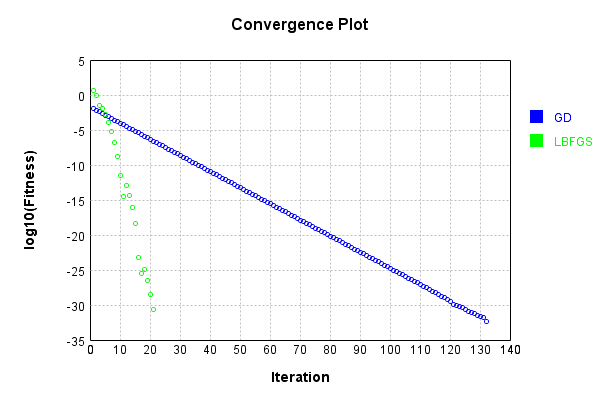
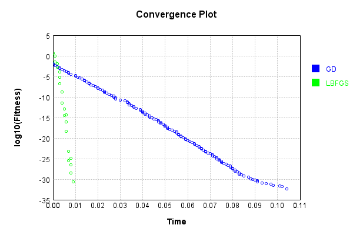

# LoggingWrapperLayer
## LoggingWrapperLayerTest
### Json Serialization
Code from [JsonTest.java:36](../../../../../../../src/main/java/com/simiacryptus/mindseye/test/unit/JsonTest.java#L36) executed in 0.00 seconds: 
```java
    JsonObject json = layer.getJson();
    NNLayer echo = NNLayer.fromJson(json);
    if ((echo == null)) throw new AssertionError("Failed to deserialize");
    if ((layer == echo)) throw new AssertionError("Serialization did not copy");
    if ((!layer.equals(echo))) throw new AssertionError("Serialization not equal");
    return new GsonBuilder().setPrettyPrinting().create().toJson(json);
```

Returns: 

```
    {
      "class": "com.simiacryptus.mindseye.layers.java.LoggingWrapperLayer",
      "id": "6a810545-3528-4a48-a9f9-7c4f05c61e6e",
      "isFrozen": false,
      "name": "LoggingWrapperLayer/6a810545-3528-4a48-a9f9-7c4f05c61e6e",
      "inner": {
        "class": "com.simiacryptus.mindseye.layers.java.LinearActivationLayer",
        "id": "67894d56-cc20-4a5d-adf3-f9a6f27e8418",
        "isFrozen": false,
        "name": "LinearActivationLayer/67894d56-cc20-4a5d-adf3-f9a6f27e8418",
        "weights": [
          1.0,
          0.0
        ]
      }
    }
```


### Example Input/Output Pair
Code from [ReferenceIO.java:68](../../../../../../../src/main/java/com/simiacryptus/mindseye/test/unit/ReferenceIO.java#L68) executed in 0.00 seconds: 
```java
    SimpleEval eval = SimpleEval.run(layer, inputPrototype);
    return String.format("--------------------\nInput: \n[%s]\n--------------------\nOutput: \n%s\n--------------------\nDerivative: \n%s",
      Arrays.stream(inputPrototype).map(t -> t.prettyPrint()).reduce((a, b) -> a + ",\n" + b).get(),
      eval.getOutput().prettyPrint(),
      Arrays.stream(eval.getDerivative()).map(t -> t.prettyPrint()).reduce((a, b) -> a + ",\n" + b).get());
```

Returns: 

```
    --------------------
    Input: 
    [[ -1.596, -0.264, 0.944 ]]
    --------------------
    Output: 
    [ -1.596, -0.264, 0.944 ]
    --------------------
    Derivative: 
    [ 1.0, 1.0, 1.0 ]
```


Code from [SingleDerivativeTester.java:77](../../../../../../../src/main/java/com/simiacryptus/mindseye/test/unit/SingleDerivativeTester.java#L77) executed in 0.01 seconds: 
```java
    return test(component, inputPrototype);
```
Logging: 
```
    Inputs: [ -0.708, 1.8, 1.5 ]
    Inputs Statistics: {meanExponent=0.09379900728291878, negative=1, min=1.5, max=1.5, mean=0.864, count=3.0, positive=2, stdDev=1.1182987078593984, zeros=0}
    Output: [ -0.708, 1.8, 1.5 ]
    Outputs Statistics: {meanExponent=0.09379900728291878, negative=1, min=1.5, max=1.5, mean=0.864, count=3.0, positive=2, stdDev=1.1182987078593984, zeros=0}
    Input 0 for layer LinearActivationLayer/67894d56-cc20-4a5d-adf3-f9a6f27e8418: 
    	[ -0.708, 1.8, 1.5 ]
    Output for layer LinearActivationLayer/67894d56-cc20-4a5d-adf3-f9a6f27e8418: 
    	[ -0.708, 1.8, 1.5 ]
    Feedback Input for layer LinearActivationLayer/67894d56-cc20-4a5d-adf3-f9a6f27e8418: 
    	[ 1.0, 0.0, 0.0 ]
    Feedback Output 0 for layer LinearActivationLayer/67894d56-cc20-4a5d-adf3-f9a6f27e8418: 
    	[ 1.0, 0.0, 0.0 ]
    Input 0 for layer LinearActivationLayer/67894d56-cc20-4a5d-adf3-f9a6f27e8418: 
    	[ -0.708, 1.8, 1.5 ]
    Output for layer LinearActivationLayer/67894d56-cc20-4a5d-adf3-f9a6f27e8418: 
    	[ -0.708, 1.8, 1.5 ]
    Feedback Input for layer Linea
```
...[skipping 1921 bytes](etc/332.txt)...
```
    939, negative=1, min=1.0, max=1.0, mean=0.932, count=6.0, positive=5, stdDev=0.7936749964563581, zeros=0}
    Measured Gradient: [ [ -0.708000000000375, 1.80000000000069, 1.500000000000945 ], [ 0.9999999999998899, 0.9999999999998899, 0.9999999999998899 ] ]
    Measured Statistics: {meanExponent=0.04689950364154716, negative=1, min=0.9999999999998899, max=0.9999999999998899, mean=0.9320000000001549, count=6.0, positive=5, stdDev=0.7936749964567209, zeros=0}
    Gradient Error: [ [ -3.750333377183779E-13, 6.898925875020723E-13, 9.450218385609332E-13 ], [ -1.1013412404281553E-13, -1.1013412404281553E-13, -1.1013412404281553E-13 ] ]
    Error Statistics: {meanExponent=-12.580990182596429, negative=4, min=-1.1013412404281553E-13, max=-1.1013412404281553E-13, mean=1.549131193693635E-13, count=6.0, positive=2, stdDev=4.834025566349321E-13, zeros=0}
    Finite-Difference Derivative Accuracy:
    absoluteTol: 1.7805e-13 +- 2.7165e-13 [0.0000e+00 - 9.4502e-13] (15#)
    relativeTol: 1.2243e-13 +- 9.9659e-14 [5.5067e-14 - 3.1501e-13] (9#)
    
```

Returns: 

```
    ToleranceStatistics{absoluteTol=1.7805e-13 +- 2.7165e-13 [0.0000e+00 - 9.4502e-13] (15#), relativeTol=1.2243e-13 +- 9.9659e-14 [5.5067e-14 - 3.1501e-13] (9#)}
```


### Performance
Now we execute larger-scale runs to benchmark performance:

Code from [PerformanceTester.java:66](../../../../../../../src/main/java/com/simiacryptus/mindseye/test/unit/PerformanceTester.java#L66) executed in 0.07 seconds: 
```java
    test(component, inputPrototype);
```
Logging: 
```
    100 batches
    Input Dimensions:
    	[3]
    Performance:
    	Evaluation performance: 0.002954s +- 0.001820s [0.001005s - 0.005551s]
    	Learning performance: 0.000516s +- 0.000142s [0.000319s - 0.000681s]
    
```

### Input Learning
In this test, we use a network to learn this target input, given it's pre-evaluated output:

Code from [LearningTester.java:127](../../../../../../../src/main/java/com/simiacryptus/mindseye/test/unit/LearningTester.java#L127) executed in 0.00 seconds: 
```java
    return Arrays.stream(input_target).map(x -> x.prettyPrint()).reduce((a, b) -> a + "\n" + b).orElse("");
```

Returns: 

```
    [ -1.492, -1.988, -0.416 ]
```


First, we use a conjugate gradient descent method, which converges the fastest for purely linear functions.

Code from [LearningTester.java:300](../../../../../../../src/main/java/com/simiacryptus/mindseye/test/unit/LearningTester.java#L300) executed in 0.00 seconds: 
```java
    return new IterativeTrainer(trainable)
      .setLineSearchFactory(label -> new QuadraticSearch())
      .setOrientation(new GradientDescent())
      .setMonitor(monitor)
      .setTimeout(30, TimeUnit.SECONDS)
      .setMaxIterations(250)
      .setTerminateThreshold(0)
      .run();
```
Logging: 
```
    Input 0 for layer LinearActivationLayer/5d527d99-2233-410c-b8c7-6a96f9fe5784: 
    	[ -1.492, -1.988, -0.416 ]
    Output for layer LinearActivationLayer/5d527d99-2233-410c-b8c7-6a96f9fe5784: 
    	[ -1.492, -1.988, -0.416 ]
    Feedback Input for layer LinearActivationLayer/5d527d99-2233-410c-b8c7-6a96f9fe5784: 
    	[ 0.0, 0.0, 0.0 ]
    Feedback Output 0 for layer LinearActivationLayer/5d527d99-2233-410c-b8c7-6a96f9fe5784: 
    	[ 0.0, 0.0, 0.0 ]
    
```

Returns: 

```
    0.0
```


This training run resulted in the following regressed input:

Code from [LearningTester.java:144](../../../../../../../src/main/java/com/simiacryptus/mindseye/test/unit/LearningTester.java#L144) executed in 0.00 seconds: 
```java
    return Arrays.stream(input_gd).map(x -> x.prettyPrint()).reduce((a, b) -> a + "\n" + b).orElse("");
```

Returns: 

```
    [ -1.492, -1.988, -0.416 ]
```


Next, we run the same optimization using L-BFGS, which is nearly ideal for purely second-order or quadratic functions.

Code from [LearningTester.java:324](../../../../../../../src/main/java/com/simiacryptus/mindseye/test/unit/LearningTester.java#L324) executed in 0.00 seconds: 
```java
    return new IterativeTrainer(trainable)
      .setLineSearchFactory(label -> new ArmijoWolfeSearch())
      .setOrientation(new LBFGS())
      .setMonitor(monitor)
      .setTimeout(30, TimeUnit.SECONDS)
      .setMaxIterations(250)
      .setTerminateThreshold(0)
      .run();
```
Logging: 
```
    Input 0 for layer LinearActivationLayer/5d527d99-2233-410c-b8c7-6a96f9fe5784: 
    	[ -1.492, -1.988, -0.416 ]
    Output for layer LinearActivationLayer/5d527d99-2233-410c-b8c7-6a96f9fe5784: 
    	[ -1.492, -1.988, -0.416 ]
    Feedback Input for layer LinearActivationLayer/5d527d99-2233-410c-b8c7-6a96f9fe5784: 
    	[ 0.0, 0.0, 0.0 ]
    Feedback Output 0 for layer LinearActivationLayer/5d527d99-2233-410c-b8c7-6a96f9fe5784: 
    	[ 0.0, 0.0, 0.0 ]
    
```

Returns: 

```
    0.0
```


This training run resulted in the following regressed input:

Code from [LearningTester.java:154](../../../../../../../src/main/java/com/simiacryptus/mindseye/test/unit/LearningTester.java#L154) executed in 0.00 seconds: 
```java
    return Arrays.stream(input_lbgfs).map(x -> x.prettyPrint()).reduce((a, b) -> a + "\n" + b).orElse("");
```

Returns: 

```
    [ -1.492, -1.988, -0.416 ]
```


Code from [LearningTester.java:96](../../../../../../../src/main/java/com/simiacryptus/mindseye/test/unit/LearningTester.java#L96) executed in 0.00 seconds: 
```java
    return TestUtil.compare(runs);
```

Code from [LearningTester.java:99](../../../../../../../src/main/java/com/simiacryptus/mindseye/test/unit/LearningTester.java#L99) executed in 0.00 seconds: 
```java
    return TestUtil.compareTime(runs);
```

### Model Learning
In this test, attempt to train a network to emulate a randomized network given an example input/output. The target state is:

Code from [LearningTester.java:176](../../../../../../../src/main/java/com/simiacryptus/mindseye/test/unit/LearningTester.java#L176) executed in 0.00 seconds: 
```java
    return network_target.state().stream().map(Arrays::toString).reduce((a, b) -> a + "\n" + b).orElse("");
```

Returns: 

```
    [0.0, 1.0]
```


First, we use a conjugate gradient descent method, which converges the fastest for purely linear functions.

Code from [LearningTester.java:300](../../../../../../../src/main/java/com/simiacryptus/mindseye/test/unit/LearningTester.java#L300) executed in 0.00 seconds: 
```java
    return new IterativeTrainer(trainable)
      .setLineSearchFactory(label -> new QuadraticSearch())
      .setOrientation(new GradientDescent())
      .setMonitor(monitor)
      .setTimeout(30, TimeUnit.SECONDS)
      .setMaxIterations(250)
      .setTerminateThreshold(0)
      .run();
```
Logging: 
```
    Input 0 for layer LinearActivationLayer/5d527d99-2233-410c-b8c7-6a96f9fe5784: 
    	[ -1.492, -0.416, -1.988 ]
    Output for layer LinearActivationLayer/5d527d99-2233-410c-b8c7-6a96f9fe5784: 
    	[ 1.0, 1.0, 1.0 ]
    Feedback Input for layer LinearActivationLayer/5d527d99-2233-410c-b8c7-6a96f9fe5784: 
    	[ 0.0, 0.0, 0.0 ]
    
```

Returns: 

```
    0.0
```


This training run resulted in the following configuration:

Code from [LearningTester.java:189](../../../../../../../src/main/java/com/simiacryptus/mindseye/test/unit/LearningTester.java#L189) executed in 0.00 seconds: 
```java
    return network_gd.state().stream().map(Arrays::toString).reduce((a, b) -> a + "\n" + b).orElse("");
```

Returns: 

```
    [1.0, 1.0, 1.0]
    [0.0, 1.0]
```


Next, we run the same optimization using L-BFGS, which is nearly ideal for purely second-order or quadratic functions.

Code from [LearningTester.java:324](../../../../../../../src/main/java/com/simiacryptus/mindseye/test/unit/LearningTester.java#L324) executed in 0.00 seconds: 
```java
    return new IterativeTrainer(trainable)
      .setLineSearchFactory(label -> new ArmijoWolfeSearch())
      .setOrientation(new LBFGS())
      .setMonitor(monitor)
      .setTimeout(30, TimeUnit.SECONDS)
      .setMaxIterations(250)
      .setTerminateThreshold(0)
      .run();
```
Logging: 
```
    Input 0 for layer LinearActivationLayer/5d527d99-2233-410c-b8c7-6a96f9fe5784: 
    	[ -1.492, -0.416, -1.988 ]
    Output for layer LinearActivationLayer/5d527d99-2233-410c-b8c7-6a96f9fe5784: 
    	[ 1.0, 1.0, 1.0 ]
    Feedback Input for layer LinearActivationLayer/5d527d99-2233-410c-b8c7-6a96f9fe5784: 
    	[ 0.0, 0.0, 0.0 ]
    
```

Returns: 

```
    0.0
```


This training run resulted in the following configuration:

Code from [LearningTester.java:203](../../../../../../../src/main/java/com/simiacryptus/mindseye/test/unit/LearningTester.java#L203) executed in 0.00 seconds: 
```java
    return network_lbfgs.state().stream().map(Arrays::toString).reduce((a, b) -> a + "\n" + b).orElse("");
```

Returns: 

```
    [0.0, 1.0]
    [1.0, 1.0, 1.0]
```


Code from [LearningTester.java:96](../../../../../../../src/main/java/com/simiacryptus/mindseye/test/unit/LearningTester.java#L96) executed in 0.00 seconds: 
```java
    return TestUtil.compare(runs);
```

Code from [LearningTester.java:99](../../../../../../../src/main/java/com/simiacryptus/mindseye/test/unit/LearningTester.java#L99) executed in 0.00 seconds: 
```java
    return TestUtil.compareTime(runs);
```

### Composite Learning
In this test, attempt to train a network to emulate a randomized network given an example input/output. The target state is:

Code from [LearningTester.java:219](../../../../../../../src/main/java/com/simiacryptus/mindseye/test/unit/LearningTester.java#L219) executed in 0.00 seconds: 
```java
    return network_target.state().stream().map(Arrays::toString).reduce((a, b) -> a + "\n" + b).orElse("");
```

Returns: 

```
    [0.0, 1.0]
```


We simultaneously regress this target input:

Code from [LearningTester.java:223](../../../../../../../src/main/java/com/simiacryptus/mindseye/test/unit/LearningTester.java#L223) executed in 0.00 seconds: 
```java
    return Arrays.stream(testInput).map(x -> x.prettyPrint()).reduce((a, b) -> a + "\n" + b).orElse("");
```

Returns: 

```
    [ -0.416, -1.492, -1.988 ]
```


Which produces the following output:

Code from [LearningTester.java:230](../../../../../../../src/main/java/com/simiacryptus/mindseye/test/unit/LearningTester.java#L230) executed in 0.00 seconds: 
```java
    return Stream.of(targetOutput).map(x -> x.prettyPrint()).reduce((a, b) -> a + "\n" + b).orElse("");
```

Returns: 

```
    [ 1.0, 1.0, 1.0 ]
```


First, we use a conjugate gradient descent method, which converges the fastest for purely linear functions.

Code from [LearningTester.java:300](../../../../../../../src/main/java/com/simiacryptus/mindseye/test/unit/LearningTester.java#L300) executed in 0.11 seconds: 
```java
    return new IterativeTrainer(trainable)
      .setLineSearchFactory(label -> new QuadraticSearch())
      .setOrientation(new GradientDescent())
      .setMonitor(monitor)
      .setTimeout(30, TimeUnit.SECONDS)
      .setMaxIterations(250)
      .setTerminateThreshold(0)
      .run();
```
Logging: 
```
    Input 0 for layer LinearActivationLayer/5d527d99-2233-410c-b8c7-6a96f9fe5784: 
    	[ -1.988, -1.492, -0.416 ]
    Output for layer LinearActivationLayer/5d527d99-2233-410c-b8c7-6a96f9fe5784: 
    	[ -1.988, -1.492, -0.416 ]
    Feedback Input for layer LinearActivationLayer/5d527d99-2233-410c-b8c7-6a96f9fe5784: 
    	[ -1.992, -1.6613333333333333, -0.944 ]
    Feedback Output 0 for layer LinearActivationLayer/5d527d99-2233-410c-b8c7-6a96f9fe5784: 
    	[ -1.992, -1.6613333333333333, -0.944 ]
    Input 0 for layer LinearActivationLayer/5d527d99-2233-410c-b8c7-6a96f9fe5784: 
    	[ -1.988, -1.492, -0.416 ]
    Output for layer LinearActivationLayer/5d527d99-2233-410c-b8c7-6a96f9fe5784: 
    	[ -1.988, -1.492, -0.416 ]
    Feedback Input for layer LinearActivationLayer/5d527d99-2233-410c-b8c7-6a96f9fe5784: 
    	[ -1.992, -1.6613333333333333, -0.944 ]
    Feedback Output 0 for layer LinearActivationLayer/5d527d99-2233-410c-b8c7-6a96f9fe5784: 
    	[ -1.992, -1.6613333333333333, -0.944 ]
    Constructing line search parameters: GD
    Input 0 for layer LinearActivationL
```
...[skipping 882832 bytes](etc/333.txt)...
```
    tivationLayer/5d527d99-2233-410c-b8c7-6a96f9fe5784: 
    	[ -3.034765843181889E-32, -0.0, 1.5173829215909445E-32 ]
    Input 0 for layer LinearActivationLayer/5d527d99-2233-410c-b8c7-6a96f9fe5784: 
    	[ -1.624781600394552, -1.2043779476775085, -0.29237324944456766 ]
    Output for layer LinearActivationLayer/5d527d99-2233-410c-b8c7-6a96f9fe5784: 
    	[ 1.0000000000000002, 1.0, 0.9999999999999999 ]
    Feedback Input for layer LinearActivationLayer/5d527d99-2233-410c-b8c7-6a96f9fe5784: 
    	[ 1.4802973661668753E-16, 0.0, -7.401486830834377E-17 ]
    Feedback Output 0 for layer LinearActivationLayer/5d527d99-2233-410c-b8c7-6a96f9fe5784: 
    	[ -3.034765843181889E-32, -0.0, 1.5173829215909445E-32 ]
    F(0.05832582002274718) = LineSearchPoint{point=PointSample{avg=2.0543252740130517E-32}, derivative=1.0214670806085637E-32}, delta = 1.6434602192104414E-32
    Right bracket at 0.05832582002274718
    Converged to left
    Iteration 133 failed, aborting. Error: 4.108650548026103E-33 Total: 249806570100528.4400; Orientation: 0.0000; Line Search: 0.0022
    
```

Returns: 

```
    4.108650548026103E-33
```


Training Converged

Next, we run the same optimization using L-BFGS, which is nearly ideal for purely second-order or quadratic functions.

Code from [LearningTester.java:324](../../../../../../../src/main/java/com/simiacryptus/mindseye/test/unit/LearningTester.java#L324) executed in 0.02 seconds: 
```java
    return new IterativeTrainer(trainable)
      .setLineSearchFactory(label -> new ArmijoWolfeSearch())
      .setOrientation(new LBFGS())
      .setMonitor(monitor)
      .setTimeout(30, TimeUnit.SECONDS)
      .setMaxIterations(250)
      .setTerminateThreshold(0)
      .run();
```
Logging: 
```
    Input 0 for layer LinearActivationLayer/5d527d99-2233-410c-b8c7-6a96f9fe5784: 
    	[ -1.988, -1.492, -0.416 ]
    Output for layer LinearActivationLayer/5d527d99-2233-410c-b8c7-6a96f9fe5784: 
    	[ -1.988, -1.492, -0.416 ]
    Feedback Input for layer LinearActivationLayer/5d527d99-2233-410c-b8c7-6a96f9fe5784: 
    	[ -1.992, -1.6613333333333333, -0.944 ]
    Feedback Output 0 for layer LinearActivationLayer/5d527d99-2233-410c-b8c7-6a96f9fe5784: 
    	[ -1.992, -1.6613333333333333, -0.944 ]
    Input 0 for layer LinearActivationLayer/5d527d99-2233-410c-b8c7-6a96f9fe5784: 
    	[ -1.988, -1.492, -0.416 ]
    Output for layer LinearActivationLayer/5d527d99-2233-410c-b8c7-6a96f9fe5784: 
    	[ -1.988, -1.492, -0.416 ]
    Feedback Input for layer LinearActivationLayer/5d527d99-2233-410c-b8c7-6a96f9fe5784: 
    	[ -1.992, -1.6613333333333333, -0.944 ]
    Feedback Output 0 for layer LinearActivationLayer/5d527d99-2233-410c-b8c7-6a96f9fe5784: 
    	[ -1.992, -1.6613333333333333, -0.944 ]
    LBFGS Accumulation History: 1 points
    Constructing line search parameters: G
```
...[skipping 82373 bytes](etc/334.txt)...
```
    410c-b8c7-6a96f9fe5784: 
    	[ -1.8940686111166514E-15, -1.8940686111166514E-15, 1.8940686111166514E-15 ]
    Armijo: th(1.0114143001793698E-12)=1.9721522630525295E-31; dx=-1.0881647257336515E-29 delta=0.0
    mu /= nu: th(0)=1.9721522630525295E-31;th'(0)=-1.0881647257336515E-29;
    Input 0 for layer LinearActivationLayer/5d527d99-2233-410c-b8c7-6a96f9fe5784: 
    	[ 0.5995615361372236, 0.5995615361372236, 0.5995615361372237 ]
    Output for layer LinearActivationLayer/5d527d99-2233-410c-b8c7-6a96f9fe5784: 
    	[ 1.0000000000000004, 1.0000000000000004, 0.9999999999999996 ]
    Feedback Input for layer LinearActivationLayer/5d527d99-2233-410c-b8c7-6a96f9fe5784: 
    	[ 2.9605947323337506E-16, 2.9605947323337506E-16, -2.9605947323337506E-16 ]
    Feedback Output 0 for layer LinearActivationLayer/5d527d99-2233-410c-b8c7-6a96f9fe5784: 
    	[ -1.8940686111166514E-15, -1.8940686111166514E-15, 1.8940686111166514E-15 ]
    Iteration 22 failed, aborting. Error: 1.9721522630525295E-31 Total: 249806591249344.4000; Orientation: 0.0000; Line Search: 0.0032
    
```

Returns: 

```
    1.9721522630525295E-31
```


Training Converged

Code from [LearningTester.java:96](../../../../../../../src/main/java/com/simiacryptus/mindseye/test/unit/LearningTester.java#L96) executed in 0.00 seconds: 
```java
    return TestUtil.compare(runs);
```

Returns: 




Code from [LearningTester.java:99](../../../../../../../src/main/java/com/simiacryptus/mindseye/test/unit/LearningTester.java#L99) executed in 0.00 seconds: 
```java
    return TestUtil.compareTime(runs);
```

Returns: 




