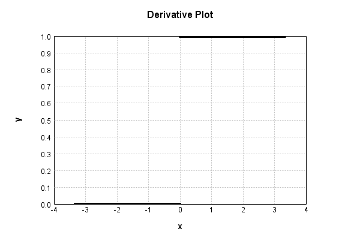

# MaxConstLayer
## MaxConstLayerTest
### Json Serialization
Code from [StandardLayerTests.java:69](../../../../../../../src/main/java/com/simiacryptus/mindseye/test/StandardLayerTests.java#L69) executed in 0.00 seconds: 
```java
    JsonObject json = layer.getJson();
    NNLayer echo = NNLayer.fromJson(json);
    if ((echo == null)) throw new AssertionError("Failed to deserialize");
    if ((layer == echo)) throw new AssertionError("Serialization did not copy");
    if ((!layer.equals(echo))) throw new AssertionError("Serialization not equal");
    return new GsonBuilder().setPrettyPrinting().create().toJson(json);
```

Returns: 

```
    {
      "class": "com.simiacryptus.mindseye.layers.java.MaxConstLayer",
      "id": "62a99c51-c776-4a86-8fa0-a71a68c6fa98",
      "isFrozen": true,
      "name": "MaxConstLayer/62a99c51-c776-4a86-8fa0-a71a68c6fa98",
      "value": 0.0
    }
```


### Example Input/Output Pair
Code from [StandardLayerTests.java:153](../../../../../../../src/main/java/com/simiacryptus/mindseye/test/StandardLayerTests.java#L153) executed in 0.00 seconds: 
```java
    SimpleEval eval = SimpleEval.run(layer, inputPrototype);
    return String.format("--------------------\nInput: \n[%s]\n--------------------\nOutput: \n%s\n--------------------\nDerivative: \n%s",
      Arrays.stream(inputPrototype).map(t -> t.prettyPrint()).reduce((a, b) -> a + ",\n" + b).get(),
      eval.getOutput().prettyPrint(),
      Arrays.stream(eval.getDerivative()).map(t -> t.prettyPrint()).reduce((a, b) -> a + ",\n" + b).get());
```

Returns: 

```
    --------------------
    Input: 
    [[
    	[ [ 1.388 ], [ -0.456 ], [ -0.58 ] ],
    	[ [ 0.84 ], [ -1.444 ], [ 0.524 ] ]
    ]]
    --------------------
    Output: 
    [
    	[ [ 1.388 ], [ 0.0 ], [ 0.0 ] ],
    	[ [ 0.84 ], [ 0.0 ], [ 0.524 ] ]
    ]
    --------------------
    Derivative: 
    [
    	[ [ 1.0 ], [ 0.0 ], [ 0.0 ] ],
    	[ [ 1.0 ], [ 0.0 ], [ 1.0 ] ]
    ]
```


### Batch Execution
Code from [StandardLayerTests.java:102](../../../../../../../src/main/java/com/simiacryptus/mindseye/test/StandardLayerTests.java#L102) executed in 0.00 seconds: 
```java
    return getBatchingTester().test(layer, inputPrototype);
```

Returns: 

```
    ToleranceStatistics{absoluteTol=0.0000e+00 +- 0.0000e+00 [0.0000e+00 - 0.0000e+00] (120#), relativeTol=0.0000e+00 +- 0.0000e+00 [0.0000e+00 - 0.0000e+00] (48#)}
```


### Differential Validation
Code from [StandardLayerTests.java:110](../../../../../../../src/main/java/com/simiacryptus/mindseye/test/StandardLayerTests.java#L110) executed in 0.00 seconds: 
```java
    return getDerivativeTester().test(layer, inputPrototype);
```
Logging: 
```
    Inputs: [
    	[ [ -0.044 ], [ -0.276 ], [ 1.472 ] ],
    	[ [ -0.336 ], [ 1.004 ], [ -0.54 ] ]
    ]
    Inputs Statistics: {meanExponent=-0.4145439469042169, negative=4, min=-0.54, max=-0.54, mean=0.2133333333333333, count=6.0, positive=2, stdDev=0.7510372087246336, zeros=0}
    Output: [
    	[ [ 0.0 ], [ 0.0 ], [ 1.472 ] ],
    	[ [ 0.0 ], [ 1.004 ], [ 0.0 ] ]
    ]
    Outputs Statistics: {meanExponent=0.08482076140524028, negative=0, min=0.0, max=0.0, mean=0.4126666666666667, count=6.0, positive=2, stdDev=0.5990321824038802, zeros=4}
    Feedback for input 0
    Inputs Values: [
    	[ [ -0.044 ], [ -0.276 ], [ 1.472 ] ],
    	[ [ -0.336 ], [ 1.004 ], [ -0.54 ] ]
    ]
    Value Statistics: {meanExponent=-0.4145439469042169, negative=4, min=-0.54, max=-0.54, mean=0.2133333333333333, count=6.0, positive=2, stdDev=0.7510372087246336, zeros=0}
    Implemented Feedback: [ [ 0.0, 0.0, 0.0, 0.0, 0.0, 0.0 ], [ 0.0, 0.0, 0.0, 0.0, 0.0, 0.0 ], [ 0.0, 0.0, 0.0, 0.0, 0.0, 0.0 ], [ 0.0, 0.0, 0.0, 1.0, 0.0, 0.0 ], [ 0.0, 0.0, 0.0, 0.0, 1.0, 0.0 ], [ 0.0, 0.0, 0.0, 0.0, 0.
```
...[skipping 208 bytes](etc/80.txt)...
```
    0, 0.0, 0.0, 0.0 ], [ 0.0, 0.0, 0.0, 0.0, 0.0, 0.0 ], [ 0.0, 0.0, 0.0, 0.0, 0.0, 0.0 ], [ 0.0, 0.0, 0.0, 0.9999999999998899, 0.0, 0.0 ], [ 0.0, 0.0, 0.0, 0.0, 0.9999999999998899, 0.0 ], [ 0.0, 0.0, 0.0, 0.0, 0.0, 0.0 ] ]
    Measured Statistics: {meanExponent=-4.7830642341045674E-14, negative=0, min=0.0, max=0.0, mean=0.05555555555554944, count=36.0, positive=2, stdDev=0.22906142364540036, zeros=34}
    Feedback Error: [ [ 0.0, 0.0, 0.0, 0.0, 0.0, 0.0 ], [ 0.0, 0.0, 0.0, 0.0, 0.0, 0.0 ], [ 0.0, 0.0, 0.0, 0.0, 0.0, 0.0 ], [ 0.0, 0.0, 0.0, -1.1013412404281553E-13, 0.0, 0.0 ], [ 0.0, 0.0, 0.0, 0.0, -1.1013412404281553E-13, 0.0 ], [ 0.0, 0.0, 0.0, 0.0, 0.0, 0.0 ] ]
    Error Statistics: {meanExponent=-12.958078098036825, negative=2, min=0.0, max=0.0, mean=-6.118562446823085E-15, count=36.0, positive=0, stdDev=2.5227479245189218E-14, zeros=34}
    Finite-Difference Derivative Accuracy:
    absoluteTol: 6.1186e-15 +- 2.5227e-14 [0.0000e+00 - 1.1013e-13] (36#)
    relativeTol: 5.5067e-14 +- 0.0000e+00 [5.5067e-14 - 5.5067e-14] (2#)
    
```

Returns: 

```
    ToleranceStatistics{absoluteTol=6.1186e-15 +- 2.5227e-14 [0.0000e+00 - 1.1013e-13] (36#), relativeTol=5.5067e-14 +- 0.0000e+00 [5.5067e-14 - 5.5067e-14] (2#)}
```


### Performance
Code from [StandardLayerTests.java:120](../../../../../../../src/main/java/com/simiacryptus/mindseye/test/StandardLayerTests.java#L120) executed in 0.00 seconds: 
```java
    getPerformanceTester().test(layer, permPrototype);
```
Logging: 
```
    Evaluation performance: 0.000132s +- 0.000008s [0.000121s - 0.000145s]
    Learning performance: 0.000036s +- 0.000002s [0.000032s - 0.000040s]
    
```

### Function Plots
Code from [ActivationLayerTestBase.java:103](../../../../../../../src/test/java/com/simiacryptus/mindseye/layers/java/ActivationLayerTestBase.java#L103) executed in 0.00 seconds: 
```java
    return plot("Value Plot", plotData, x -> new double[]{x[0], x[1]});
```

Returns: 


Code from [ActivationLayerTestBase.java:107](../../../../../../../src/test/java/com/simiacryptus/mindseye/layers/java/ActivationLayerTestBase.java#L107) executed in 0.00 seconds: 
```java
    return plot("Derivative Plot", plotData, x -> new double[]{x[0], x[2]});
```

Returns: 




